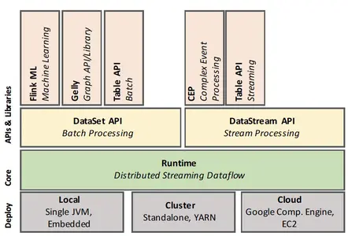
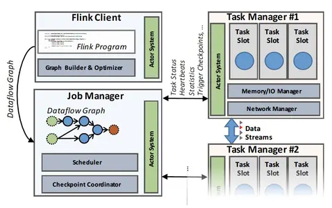
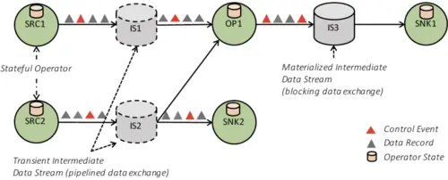
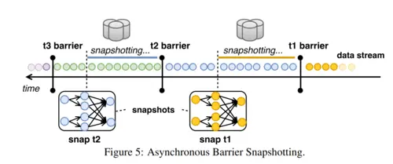

# Apache Flink™: Stream and Batch Processing in a Single Engine

本篇是论文[Apache Flink™: Stream and Batch Processing in a Single Engine](http://asterios.katsifodimos.com/assets/publications/flink-deb.pdf)的中文简单翻译
<!--more-->

Apache Flink 是一个开放源代码系统，用于处理流数据和批处理数据。Flink的哲学是，许多类别的数据处理应用程序（包括实时分析，数据管道，历史数据处理（批处理）和迭代算法（机器学习，图形分析）都可以表示为容错的流水线数据流并执行。在本文中，我们提出Flink的体系结构，并就如何在单一执行模型下执行一组多样性用例进行扩展分析。

## 引言

数据流处理(例如复杂事件处理系统)和静态(批)数据处理(例如MPP数据库和Hadoop)通常被认为是两种不同类型的应用。它们使用不同的编程模型和AP进行编程。并且由不同的系统执行(例如，专用流系统，如 Apache Storm、IBM Infosphere Streams、Microsoft StreamInsight 或是 流数据库与关系数据库，又或是Hadoop上的执行引擎，包括Apache Spark 和 Apache Drill)。通常来说，批数据处理适用于大部分的用例，数据集，而流数据分享通常服务于特定应用。

然而越来越明显地是，现今大量的大规模数据处理案例处理的数据实际上是随时间连续产生的。这些连续的数据流来自于Web 日志、应用程序日志、传感器，或是数据库中应用程序状态的更改（事务日志记录）。现今的处理忽略了数据的连续和实时的特性，而不是将产生的数据视为流。取而代之的是，数据记录被（通常是人为的）分批成静态数据集（例如小时级，天级或是月级数据块），然后以时间无关的方式处理。数据收集工具，工作流管理器和调度器编排批任务的创建和处理，实际上是连续数据处理管道。诸如“lambda 架构”之类的架构模式结合了批处理和流处理实现多链路计算的系统：用于实时近似结果的流式快速链路，和用于获得后期准确结果的批量离线路径。所有这些方法都存在高延迟问题（由批处理造成），高复杂度（连接和协调多个系统，实现两次业务逻辑），以及存在不准确性，因为应用程序代码没有明确地处理时间维度。

Apache Flink 遵循一种范式: 将数据流处理作为编程模型好执行引擎的统一模型用于实时分析，连续流和批处理。通过与可以任意重放数据的持久化队列（如 ApacheKafka 或 Amazon Kinesis）结合，流处理程序在处理最新的实时事件，在大窗口中定期连续聚合数据，或处理 TB 级的数据历史数据等场景时，可以不做区分。相反，在flink上这些不同类型的计算只是在持久流中不同的点开始处理，并在计算过程中保持不同形式的状态。通过高度灵活的窗口机制，Flink 程序可以计算提前数据和近似结果，以及延迟数据和准确率，这些都是相同的操作，无需为两个用例组合不同的系统。flink支持不同的时间概念（事件时间、摄取时间、处理时间），给程序员定义事件应如何关联提供了高度灵活性。

同时flink承认存在并且将会需要专门的批处理（处理静态数据集）。对静态数据的复杂查询仍然非常适合用批处理抽象。此外，对于流使用案例的传统实现，以及对于尚无有效算法执行此类流数据处理的分析应用程序，仍然需要批处理。批处理程序是流程序的特例，即流是有限的，并且记录的顺序和时间无关紧要（所有记录都隐式地属于一个全局窗口）。然而，为了使批处理场景的易用性和性能更具有竞争力，Flink 有一个专门的 API用于处理静态数据集，使用专门的数据结构和算法来处理批处理版本的操作，例如`join`和`group by`，并且使用专门的调度策略。上述的结果是 Flink 将自己呈现为在流运行时之上的成熟且高效的批处理器，包括用于图形分析和机器学习的库。Flink起源于 Stratosphere 项目，是 Apache 的一个顶级项目。

本文的贡献如下：

1. 我们为流数据和批数据处理的统一架构提供了案例，包括仅对批处理的特定优化。
2. 我们展示了如何将流式、批处理、迭代和交互式分析表示为容错流式数据流（在第3节中）。
3.  我们讨论如何使用灵活的窗口机制构建成熟的流分析系统（在第 4 节中），以及在这些数据流之上的成熟的批处理器（在第 4.1 节中），通过展示流、批处理、迭代和交互式分析如何表示为流数据流。

## 系统架构

在本节中，我们将 Flink 的架构展示为一个软件栈和一个分布式系统。虽然 Flink 的API 堆栈不断增长，我们可以区分四个主要层：部署、核心、API 和库。



上述图1展示flink的软件架构。flink的核心是数据流引擎，用于执行数据流程序。flink 运行时程序是由带状态的算子组成的DAG，算子间由数据流连接。Flink 中有两个核心API：用于处理有限数据集的 DataSet API（通常是称为批处理），以及用于处理无界数据流的 DataStream API（通常称为流处理）。Flink 的核心运行时引擎可以看作是一个流式数据流引擎，DataSet 和 DataStream API 都创建了引擎可执行的运行时程序。因此，它服务于抽象有界（批处理）和无界（流）处理的通用架构。在核心API之上，flink 绑定了领域特定的库和API，来生成使用数据集和数据流API运行的程序。目前，有Flink ML 用于机器学习，Gelly 用于图计算和Table用于类sql 操作。



如上图2描述，Flink 集群包含三种类型的进程：客户端、作业管理器和至少一个任务管理器。客户端接收程序代码，将它翻译成数据流图，并将其提交给作业管理器。在转换阶段还检查了运算符之间交换的数据的数据类型 (模式) 并创建 序列化器和其他 类型/模式 具体代码。数据集程序会额外经过一个基于开销的查询优化阶段，类似于关系型数据库查询优化器执行的物理层优化。(注: 物理层优化更多的是指底层优化，例如存储，内存，cpu，IO的相关优化)。

作业管理器协调数据流的分布式执行。它跟踪每个算子和流的状态与进度，调度新算子，并协调checkpoint和恢复。在高可用配置下，JobManager 将每个检查点的最小元数据集保存到容错的存储中。这样备 JobManager 可以重建检查点并从检查点恢复数据流执行。实际上的数据处理发生在TaskManager中，TaskManager 执行一个或多个算子，这些算子产生流，并向jobManager 报告自己的状态。TaskManager 维护缓冲池或实现流和网络连接，以在算子间交换数据。

## 通用结构: 流式数据

尽管用户可以使用多种 API 编写 Flink 程序，但所有 Flink 程序最终都编译为一个共同表示: 数据流图。数据流图由flink 的运行时引擎执行，运行时是批处理 (DataSet) 和流处理 (DataStream) API 下的公共层。

### 数据流图



如图3所示的数据流图是一个有向无环图(DAG)，它包括：

1. 有状态的算子
2. 表示算子产生的数据并且可供算子消费的数据流

由于数据流图以数据并行的方式执行，算子被并行化为一个或多个被称为子任务的并行实例，数据流被拆分成一个或多个分区(每分区一个数据产出子任务)。支持状态的算子(特殊情况下是无状态的)实现了所有处理逻辑(例如过滤器，散列连接和窗口函数)。许多算子是常见算法的教科书版实现。在第4节中我们提供了有关窗口操作符的实现细节。流在生产操作符和消费操作符之间分配数据的模式多种多样，例如点对点、广播、重新分区、扇状扩展和合并。

### 通过中间数据流进行数据交换

flink 的中间数据流是算子之间数据交换的核心抽象。中间数据流表示对数据的逻辑处理，这些数据由一个算子产生，并且可以被一个或多个算子消费。中间数据流在某种意义上是逻辑概念的，它们指向的数据可能是在磁盘上，也可能不在磁盘上。数据流的特定行为由flink的更高层参数指定（例如，被DataSet API 使用的程序优化器）。

**管道和阻塞数据交换**。管道中间流在并发运行的生产者和消费者之间交换数据，这产生了管道执行。作为结果，管道流从消费者传播反压到生产者，通过中间缓冲池实现一些弹性，用于补偿短期的吞吐量波动。flink 在连续流程序和批处理流的许多部分中使用管道流，用于避免不必要的数据实体化『此处指数据反序列化？』。另一方面，阻塞流适用于有界数据流，阻塞流会缓存所有生产者算子的数据，然后才会提供给消费，从而将生产和消费算子分隔为不同的执行阶段。阻塞流通常需要更多的内存，经常溢出到二级存储『离线计算，由于数据量，常会用到磁盘』，并且不会传播反压。它们将用来互相隔离连续的算子（在需要的时候）以及一些破坏管道执行的算子的情况，比如基于排序-合并的连接可能会导致分布式死锁『sort-merge join 中需要对分区节点的两表数据，分别进行排序，所以必须在全量数据产出完后消费』。

**平衡延迟和吞吐量**。Flink 的数据交换机制是由缓冲数据的交换实现。当一个数据记录在生产者端准备好了，它被序列化并拆分为一个或多个可以转发给消费者的缓冲区（一个缓冲也可以包含多条记录）。缓冲区会按照以下两种条件发送给消费端：1. 缓冲区满了；2. 达到超时条件。这可以让 Flink 通过设置缓冲区的大小为一个大值（比如几kb）来实现高吞吐，也可以通过设置超时（比如几毫秒）来实现低延迟。下图4展示了设置30台机器（120核）中缓冲-超时影响吞吐量和延迟数据的关系图。Flink 可以达到99%的20毫秒的延迟，相应的吞吐量是每秒150万事件。当我们增加缓冲的超时时间，我们可以看到增加了延迟和吞吐量，直到最高的吞吐量到达（举例：缓冲区填满的速度比超时过期的速度要快）。当缓存超时时间设置为50毫秒，集群的吞吐量达到了每秒8000多万个事件，其中99%的延迟在50毫秒。


**控制事件**。除了交换数据，flink的流还传达了不同类型的控制事件。算子在数据流中注入特殊的事件，并与流分区内的所有其他数据记录和事件一起按顺序交付。接收算子通过执行特定的动作，作为事件到达时的反应。flink使用了很多特殊类型的控制事件，包括：

* 检查点屏障。通过将流划分为检查点前和检查点后（在第 3.3 节中讨论）来协调检查点，
* 水印，表示流分区内事件时间进度（在第 4.1 节中讨论），
* 迭代屏障，标志着一个流分区到达了一个在循环数据流的基础上的、基于 Bulk/Stale Synchronous-Parallel 迭代算法的超级步骤的结束（在第 5.3 节中讨论）『翻译的磕磕绊绊的，我理解为是对于迭代任务而言，表示一次迭代完成的特殊事件』。

如上所述，控制事件假设流分区保留了事件的顺序。为此，flink使用消费单一流分区的一元算子保证记录的先进先出顺序。然而，接收多个流分区的算子会按照记录到达顺序合并上游的流数据，以跟上游流的速率并避免产生反压。因此，flink中的流式数据并不能保证任何形式的重分区和广播后的顺序性，而处理乱序的记录则留给算子来实现。我们发现这个安排可以提供非常有效的设计，大多数算子不要求确定的顺序（例如哈希join，映射），而且需要对乱序到达补偿的算子，诸如事件时间窗口等可以作为算子逻辑的一部分来更有效地做到这一点。

### 容错

Flink 通过严格的精准一次处理一致性保证提供可靠的执行并通过检查点和部分重新执行处理故障。系统能做出这些有效的保证的前提是假定数据源是持久化的且可以回放的。举例来说这些数据源可以是文件和持久的消息队列（比如Apache Kafka）。在实践中，非持久化的数据源可以通过在source 算子的状态中保存WAL日志被纳入保证。

Flink 的检查点机制构建在分布式一致性快照上，以实现精确一次运行的保证。数据流的无界特性让恢复并重新计算的方案变的不切实际，因为可能需要为长期运行的任务重放数月的数据，并重新计算。为了限制恢复的时长，flink对算子状态做了快照，包括定期存储当前输入流的位置。

核心的跳转在于如何在不停止任务执行的情况下，制作所有并行算子的一致性快照。本质上，所有算子的快照应该指向计算中的相同逻辑时间。flink使用的机制是异步障碍快照，Asynchronous Barrier Snapshotting（ABS）。屏障(Barrier)是注入进输入流的控制事件，它对应逻辑时间，然后将流在逻辑上区分两个部分：影响到当前快照的一部分流和属于后续快照的其他部分。

算子从上游接收屏障事件：

* 首先，进入对齐阶段，确保来自上游的所有屏障已被接收，
* 然后，算子将自己的状态（例如，滑动窗口中的内容，或自定义数据结构）写到持久化存储（例如，存储后端可以是HDFS之类的外部存储）。
* 一旦状态被备份，算子将向下游转发屏障。
* 最终，所有的算子将注册他们状态的快照，这些就组成了一份全局快照。



例如，在上图5中我们展示了快照t2包含了所有的算子状态，这些状态是消耗t2障碍之前的消费的所有记录的结果。ABS 与 Chandy-Lamport 算法在分布式异步快照有相似之处。然而，由于 Flink 程序的有向无环图的结构，ABS 不需要时刻对屏障记录进行检查，而仅仅依靠在对齐阶段将屏障作用于算子的状态。这保证了需要写入到可靠的存储数据维持在理论的最小值（即，只有算子的当前状态）。

故障恢复将所有算子的状态恢复到最后一次成功快照的各自状态，并重启他们的输入流到最后一次有快照的屏障。重新计算最大的量取决于两个连续屏障之间输入的记录量。此外，额外重放直接上游子任务缓存的未处理的记录，可以恢复一个失败的子任务。

ABS 提供了几个好处：
1. 它保证了精确一次状态更新而不去暂停计算；
2. 它完全地与其他形式的控制信息解耦（例如，事件触发窗口的计算，从而不会限制窗口检查点间隔的倍数）；
3. 它与可靠性存储完全解耦，允许状态备份到文件系统、数据库等，取决于 Flink 使用的大环境。

### 迭代数据流

增量处理和迭代对于应用来说是至关重要的，比如图形处理和机器学习。数据并行计算平台对于迭代计算的支持，通常依靠对各自迭代运算提交一个新的任务，或者在有向无环图添加额外的节点或者反馈边。Flink 中的迭代运算是由迭代步骤实现的，特殊的算子本身包含了一个执行图（图6）。为了维护基于有向无环图运行时和调度器，Flink 允许迭代的“头”和“尾”任务隐式地与反馈边连接。这些任务的作用是建立一个开启状态的反馈通道，为处理反馈通道中的数据记录提供协调。协调对于实现任何形式的结构化并行迭代模型都是需要的，例如录入批量同步并行（Bulk Synchronous Parallel）模型，并且使用控制事件来实现。我们在4.4节和5.3节分别解释了如何在DataStream和DataSet API中实现迭代。


## 数据流上的流分析

Flink 的 DataStream API 在 Flink 运行时上实现了完整的流分析框架，包括了管理时间的机制，例如乱序事件处理、定义窗口、维护和更新用户定义的状态。Streaming API 是建立在 DataStream 的概念上，是一个（可能是无界的）不可改变的特定类型的元素集合。由于 Flink 运行时已经支持管道数据传输，连续的有状态算子，和用于一致性状态更新的容错机制。在运行时上实现一层流处理器基本上归结于实现一个窗口系统和状态接口。如前所述，这些对运行时是不可见的，它认为窗口只是一个状态算子的实现。

### 时间的概念

Flink 有两个时间的概念：

1. 事件事件，标志着事件的起源事件（例如手机传感器信号的时间戳）
2. 处理事件，是机器指处理数据的时间。

在分布式系统中，事件时间和处理时间之间存在着任意的偏移。这种偏移可能意味着根据事件时间语义获取的结果有着随意的延迟。为了避免任意的延迟，这些系统定期地插入被称之为低水印的特殊事件，来标记全局的进展。以时间进度作为例子，水印包括了时间的属性t，表示所有低于t的时间都已经进入了算子。水印有助于执行引擎按照正确的顺序处理时间，并且触发操作，例如通过统一的进度进行窗口计算。

水印起源于拓扑图的源头，我们可以确定未来元素中的时间。水印从源头传播，并流经数据流的其他算子。算子自己决定如何处理水印。简单的算子，例如map和filter只是转发他们接收的水印。而，复杂的算子基于水印进行计算，例如事件时间窗口，首先计算由水印触发的结果，然后转发它。如果一个算子有多个输入，则系统只将最小的水印转发给算子，从而保证结果正确。

* 基于处理时间的flink程序，依赖于本地机器时钟，因此时间概念不太可靠，这会导致恢复时的不一致重放。然而，他们延迟更低。
* 基于事件时间的flink程序，提供最可靠的时间语义，但是可能会出现延迟。

由于事件时间滞后于处理时间，flink提供了第三种时间概念-摄入时间，作为事件时间的特例。即事件进入flink系统的时间，这提供了比事件时间更低延迟，比处理时间更准确的结果。

### 带状态的流式处理

虽然 Flink 的 DataStream API 的大多数算子看起来像是函数式的、无副作用的，但是他们提供了高效的状态化的计算。状态对于许多应用都至关重要，比如机器学习的模型建立、图分析、用户会话处理和窗口据合。根据用例也有不同形态的状态。比如，状态可以简单得如计数器或者求和，或者可以复杂得像分类树或者机器学习中经常使用到的大型稀疏矩阵。流窗口是有状态的算子，它将记录分配给保存在内存中持续更新的桶，作为算子状态的一部分。

在 Flink 中，状态是显式的，并通过提供以下方式的API： 

1. 算子接口或者注解，在算子的作用域内静态显式注册的局部变量。『operator state』
2. 算子状态的抽象，用于声明分区的键值状态和其他相关操作。『keyed state』

用户也可以通过系统提供的状态后端（StateBackend）来配置状态在哪里存储和检查点在哪里存储，从而允许高灵活自定义状态管理。Flink 的检查点机制（在3.3节讨论过）保证了任何注册的状态是持久的，并具有精确一次的更新语义。

### 流窗口

无界流上的增量计算通常在不断发展的逻辑视图上进行评估，称为窗口。Flink 加入了有状态的窗口，这个窗口通过一个灵活的声明进行配置，该声明由三个核心函数组成：一个窗口分配器，可选的一个触发器和可选的一个驱逐器。所有这三个函数都可以在一个公共预定义实现中进行选择（例如，滑动时间窗口），也可以显式地由用户定义（例如，用户定义函数）。

更加详细地说，分配器负责分配每一条记录到逻辑窗口。例如，如果是事件时间窗口时，这个决定可以基于记录的时间戳。注意在滑动窗口的情况下，一条记录可以属于多个逻辑窗口。一个可选的触发器定义何时执行与窗口定义相关的操作。最后，一个可选的驱逐器决定每个窗口保留了哪些记录。Flink 的窗口分配过程是独特的，能够覆盖所有已知的窗口类型，比如周期性的时间和计数的窗口、标点符号窗口、地标窗口、会话窗口和delta窗口。注意，Flink 的窗口处理能力无缝地加入了无序的处理，与Google Cloud Dataflow 类似，且从原则上来说，加入了这些处理模型。例如，下面是一个窗口定义，它定义了6秒的窗口按照每2秒滑动（分配器）。一旦水印通过这个窗口的末端（触发器），窗口的结果将被计算出来。

```scala
stream
.window(SlidingTimeWindows.of(Time.of(6, SECONDS), Time.of(2, SECONDS))
.trigger(EventTimeTrigger.create())
```

一个全局窗口创建了一个单一的逻辑组。接下来的例子定义了一个全局窗口（分配器），对每1000个时间（触发器）调用操作，同时保留最后的100个元素（即驱逐器）。

```scala
stream
.window(GlobalWindow.create())
.trigger(Count.of(1000))
.evict(Count.of(100))
```

注意一旦流在窗口化之前以一个键分区了，那么上面的窗口化操作就是本地的，因此不需要workers的协调。这个机制可以用来实现各种各样的窗口化函数。

### 异步流迭代

流内的循环对于一些应用是必不可少的，比如增量构建和训练机器学习模型，强化学习和图的近似计算。在大多数这样的情况下，反馈循环不需要协调。异步迭代循环覆盖了流式应用的通信需求，与基于有限数据结构化迭代的并行优化的问题不同。如第3.4和第6节，当没有启动迭代控制机制时，Flink 的执行模型覆盖了异步迭代。此外，为了遵守容错保证，反馈流被视作隐式迭代头运算器内的算子状态，是全局快照的一部分。DataStream API 允许显式地定义回馈流，并且可以琐碎地支持流上结构化循环以进度的跟踪。

## 数据流之上的批处理分析

一个有界数据集是无界数据流的特例。因此，一个在窗口插入所有输入数据流的流程序可以作为一个批处理程序，批处理应该完全被 Flink 上面的特性覆盖。但是：1. 语法（即批处理的计算 API）可以被简化（例如，不需要人为的全局窗口定义）；2. 处理有界数据集可以接受额外的优化，为容错提供更有效的记录，已经分阶段调度。

Flink采用了如下的批处理方式：

* 批量计算与流式计算是同时被相同的flink运行时执行的。运行时的可执行文件可以通过参数化变为阻塞的数据流执行，以大型计算分解为连续调度的孤立阶段。
* 当开销大的时候，周期性快照会被关闭，恢复故障可以由从重放最新落地的丢失中间流分区（可能是数据源）来实现。
* 阻塞算子（例如排序）只是算子实现，他们堵塞住，直到全部的输入被消费完。运行时不会意识到一个算子是否堵塞。这些算子使用 Flink 提供的管理内存（无论是在JVM的堆内外），如果输入超过了内存界限，就会溢出到磁盘。
* 专门的 DataSet API 为批处理提供了熟悉的抽象，一个有界的容错数据集数据结构和DataSet的转换（例如，链接，据合，迭代）。
* 查询优化层转换 DataSet 程序到一个高效的可执行文件。

接下来我们更加详细地描述这些方面。

### 查询优化

Flink 的优化器建立在并行数据库系统的技术上，比如计算等价、成本模型和有趣属性传播。然而，任意的重度UDF的有向无环图让 Flink 的数据流程序不允许使用一个传统的，开箱即用的优化器，因为算子对优化器隐藏了他们的语义。处于同样的原因，cardinality和cost-estimation(成本分析)方法同样难以采用。Flink 的运行时支持多样的执行策略，包括重新分区和广播数据转换，基于排序的分组和哈希的链接的实现。Flink 优化器列举了不同的基于有趣属性传播的物理执行计划，使用基于成本的方法在多个物理计划中选择。该成本包括了网络和磁盘 I/O 以及CPU的成本。为了克服存在的UDF的cardinality估计问题，Flink 的优化器可以使用由程序员提供的提示。

### 内存管理

基于数据库的技术， Flink 序列化数据到内存段，而不是在 JVM 堆中分配对象来表示缓存中未落地的记录。像排序和连接的操作尽可能地直接按照二进制数据操作，保持序列化与反系列化的开销在低水平，当需要时，则溢出到磁盘。为了处理任意的对象，Flink使用类型推断和自定义序列化的机制。通过将数据处理保持在二进制表示和堆外，Flink 控制减少垃圾收集的开销，在内存压力下使用高效缓存和健壮算法来优雅扩展。

### 批量迭代

迭代图分析、并行梯度下降和优化技术过去一直是在批量同步并行（BSP）和陈旧的同步并行（SSP）模型之上实现的。Flink 的执行引擎允许通过使用迭代控制实现，在上面实现任意类型的结构化迭代逻辑。例如，在BSP执行的情况下，迭代控制事件标志了迭代计算的开始和结束。最后，Flink 介绍了其他的优化技术，比如 delta 迭代的概念，它可以礼用稀疏计算依赖关系。Delta 迭代已经被 Flink 的 Graph API Gelly 所利用。

迭代图分析、并行梯度下降和优化技术过去一直是在批量同步并行（BSP）和陈旧的同步并行（SSP）模型之上实现的，除此之外。Flink的执行模型允许通过使用迭代控制事件，在上面实现任何类型的结构化迭代逻辑。例如，在BSP执行的情况下，迭代控制事件标志着迭代计算中超级步骤的开始和结束。最后，Flink引入了更多新的优化技术，比如delta迭代的概念，它可以利用稀疏的计算依赖关系 Delta迭代已经被Flink的图形API Gelly所利用。

## 相关工作

今天，有丰富的分布式批和流分析处理引擎，我们将主要的系统分类如下。

批处理。Apache Hadoop 是目前最流行的大规模数据分析的开源系统之一，它是基于 MapReduce 范式。Dryad 介绍了在一般基于有向无环图的数据流中内嵌的用户定义函数，并由 SCOPE 丰富，SCOPE 是一个语言，它建立在SQL优化器之上。Apache Tez 可以被看做是 Dryad 提议的一个开源实现。 MPP 数据库，已经最近像 Apache Drill 和 Apache Impala 的开源实现，限制在他们的 API 在 SQL 的变体。与 Flink 相似的是，Apache Spark 是一个数据处理框架，它实现了以有向无环图为基础的执行引擎，提供了 SQL 优化器，执行基于驱动器的迭代，并将无边界的计算视为微批处理。与之相对的，Flink 是唯一一个包含以下内容的系统：1. 分布式数据流运行时，用管道流执行批处理和流工作负载；2. 通过轻量化检查点实现精确一次一致性；3. 本地迭代处理；4. 丰富的窗口语义，支持无序处理。

流处理。在学术和商业流处理系统方面有大量的先前的工作，比如 SEEP、Naiad、Microsoft StreamInsight 和 IBM Streams。这些系统许多都建立在数据库社区的研究中。上述许多的系统要么是学术原型，要么是闭源商业产品，要么不能在商业服务器集群上横向扩展计算。最新的流处理方法能够横向扩展和具有较弱的状态一致性保证的组合式操作（例如 Apche Storm 和 Samza 中的最少一次处理）。值得注意的是，像“无序处理”的概念获得了巨大的吸引力，并被 MillWheel 采用，它是谷歌后来提供的 Apache Beam、Google Dataflow的商业执行器的内部版本，Millwheel 作为一个概念验证了精确一次低延迟的无需处理，因此，对于 Flink 的发展非常有影响。据我们所知， Flink 是唯一一个开源项目，包含：1. 支持事件时间处理和无序事件处理；2. 提供一致性管理状态，并由精确一次保障；3. 完成高吞吐和低延迟，同时服务于批处理和流处理。

## 感谢

Apache Flink 项目的发展是由一个自我选择的项目活跃的贡献者团队监督的。项目管理委员会（PMC）指导项目的持续运作，包括社区发展和产品发布。在目前写这篇文章的时候，Flink的提交者名单是：Marton Balassi, Paris Carbone, Ufuk Celebi, Stephan Ewen, Gyula F ´ ora, Alan Gates, Greg Hogan, ´ Fabian Hueske, Vasia Kalavri, Aljoscha Krettek, ChengXiang Li, Andra Lungu, Robert Metzger, Maximilian Michels, Chiwan Park, Till Rohrmann, Henry Saputra, Matthias J. Sax, Sebastian Schelter, Kostas Tzoumas, Timo Walther and Daniel Warneke。除了这些人之外，我们还要感谢更广泛的 Flink 社区的 180 多名贡献者。

## 总结

在本文中，我们介绍了 Apache Flink，一个实现了通用数据流引擎平台，它设计成同时为流处理和批处理分析。Flink 的数据流引擎将算子的状态和逻辑中间结果视作为一等公民，用被批处理和流处理 API的不同参数所使用。建立在 Flink 流数据引擎之上的流式 API 提供了保持可恢复状态的方法，并对流窗口进行分区，转换和据合操作。虽然批处理在理论上是流处理的一个特例。Flink 对其进行了特殊处理，使用查询优化器优化它的执行引擎，并实现了堵塞算子来在没有内存的情况下优雅地溢出到磁盘。


## 参考

- [1] D. J. Abadi, Y. Ahmad, M. Balazinska, U. Cetintemel, M. Cherniack, J.-H. Hwang, W. Lindner, A. Maskey, A. Rasin,E. Ryvkina, et al. The design of the Borealis stream processing engine. CIDR, 2005.

- [2] T. Akidau, A. Balikov, K. Bekiroglu, S. Chernyak, J. Haberman, R. Lax, S. McVeety, D. Mills, P. Nordstrom, and S. Whittle. Millwheel: fault-tolerant stream processing at Internet scale. PVLDB, 2013.

- [3] T. Akidau, R. Bradshaw, C. Chambers, S. Chernyak, R. J. Fernandez-Moctezuma, R. Lax, S. McVeety, D. Mills, F. Perry, E. Schmidt, et al. The dataflow model: a practical approach to balancing correctness, latency, and cost in massive-scale, unbounded, out-of-order data processing. PVLDB, 2015.

- [4] A. Alexandrov, R. Bergmann, S. Ewen, J.-C. Freytag, F. Hueske, A. Heise, O. Kao, M. Leich, U. Leser, V. Markl, F. Naumann, M. Peters, A. Rheinlaender, M. J. Sax, S. Schelter, M. Hoeger, K. Tzoumas, and D. Warneke. The stratosphere platform for big data analytics. VLDB Journal, 2014.

- [5] A. Arasu, B. Babcock, S. Babu, J. Cieslewicz, M. Datar, K. Ito, R. Motwani, U. Srivastava, and J. Widom. Stream: The stanford data stream management system. Technical Report, 2004.

- [6] Y. Bu, B. Howe, M. Balazinska, and M. D. Ernst. HaLoop: Efficient Iterative Data Processing on Large Clusters.PVLDB, 2010.

- [7] P. Carbone, G. Fora, S. Ewen, S. Haridi, and K. Tzoumas. Lightweight asynchronous snapshots for distributed dataflows. arXiv:1506.08603, 2015.

- [8] B. Chandramouli, J. Goldstein, M. Barnett, R. DeLine, D. Fisher, J. C. Platt, J. F. Terwilliger, and J. Wernsing. Trill: a high-performance incremental query processor for diverse analytics. PVLDB, 2014.

- [9] B. Chandramouli, J. Goldstein, and D. Maier. On-the-fly progress detection in iterative stream queries. PVLDB, 2009.

- [10] S. Chandrasekaran and M. J. Franklin. Psoup: a system for streaming queries over streaming data. VLDB Journal,2003.

- [11] K. M. Chandy and L. Lamport. Distributed snapshots: determining global states of distributed systems. ACM TOCS, 1985.

- [12] J. Dean et al. MapReduce: simplified data processing on large clusters. Communications of the ACM, 2008.

- [13] D. J. DeWitt, S. Ghandeharizadeh, D. Schneider, A. Bricker, H.-I. Hsiao, R. Rasmussen, et al. The gamma database machine project. IEEE TKDE, 1990.

- [14] S. Ewen, K. Tzoumas, M. Kaufmann, and V. Markl. Spinning Fast Iterative Data Flows. PVLDB, 2012.

- [15] J. Feigenbaum, S. Kannan, A. McGregor, S. Suri, and J. Zhang. On graph problems in a semi-streaming model. Theoretical Computer Science, 2005.

- [16] B. Gedik, H. Andrade, K.-L. Wu, P. S. Yu, and M. Doo. Spade: the system s declarative stream processing engine. ACM SIGMOD, 2008.

- [17] F. Hueske, M. Peters, M. J. Sax, A. Rheinlander, R. Bergmann, A. Krettek, and K. Tzoumas. Opening the Black Boxes in Data Flow Optimization. PVLDB, 2012.

- [18] M. Isard, M. Budiu, Y. Yu, A. Birrell, and D. Fetterly. Dryad: distributed data-parallel programs from sequential building blocks. ACM SIGOPS, 2007.

- [19] M. Kornacker, A. Behm, V. Bittorf, T. Bobrovytsky, C. Ching, A. Choi, J. Erickson, M. Grund, D. Hecht, M. Jacobs, et al. Impala: A modern, open-source sql engine for hadoop. CIDR, 2015.

- [20] J. Li, K. Tufte, V. Shkapenyuk, V. Papadimos, T. Johnson, and D. Maier. Out-of-order processing: a new architecture for high-performance stream systems. PVLDB, 2008.

- [21] N. Marz and J. Warren. Big Data: Principles and best practices of scalable realtime data systems. Manning Publications Co., 2015.

- [22] M. Migliavacca, D. Eyers, J. Bacon, Y. Papagiannis, B. Shand, and P. Pietzuch. Seep: scalable and elastic event processing. ACM Middleware’10 Posters and Demos Track, 2010.

- [23] D. G. Murray, F. McSherry, R. Isaacs, M. Isard, P. Barham, and M. Abadi. Naiad: a timely dataflow system. ACM SOSP, 2013.

- [24] B. Saha, H. Shah, S. Seth, G. Vijayaraghavan, A. Murthy, and C. Curino. Apache tez: A unifying framework for modeling and building data processing applications. ACM SIGMOD, 2015.

- [25] M. Zaharia, M. Chowdhury, M. J. Franklin, S. Shenker, and I. Stoica. Spark: Cluster Computing with Working Sets. USENIX HotCloud, 2010.

- [26] J. Zhou, P.-A. Larson, and R. Chaiken. Incorporating partitioning and parallel plans into the scope optimizer. IEEE ICDE, 2010.

