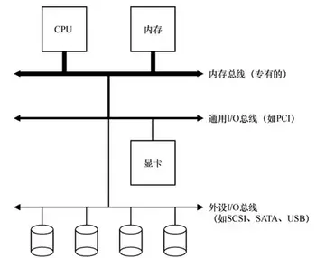
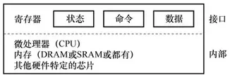
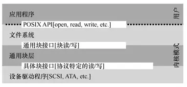
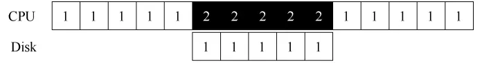
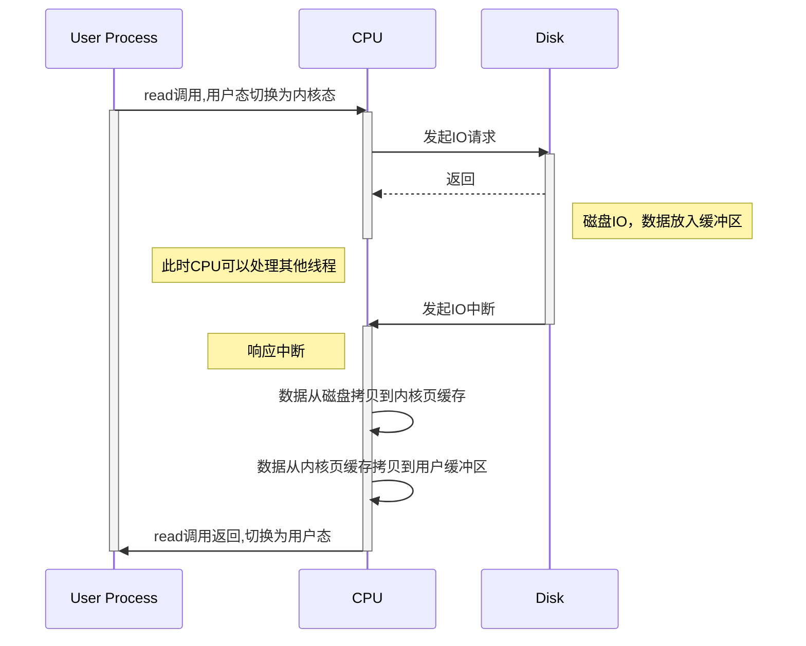
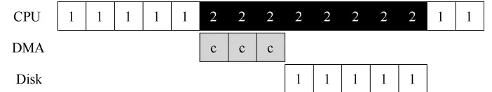
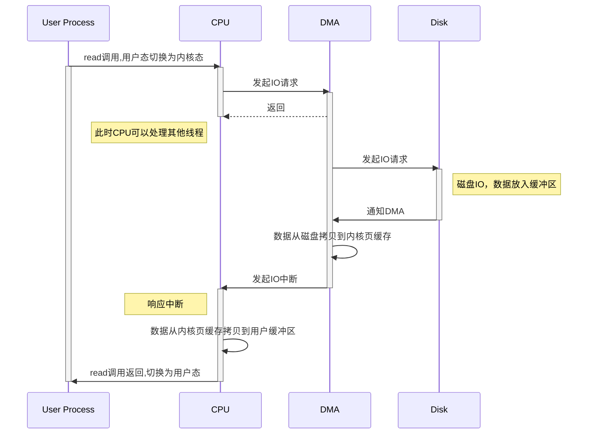
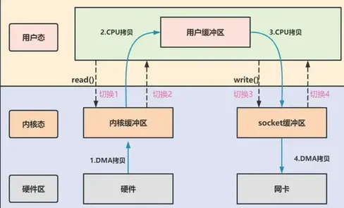
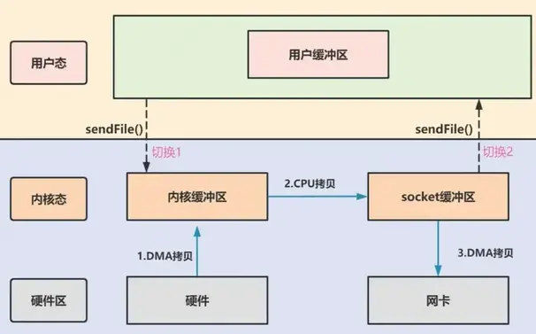
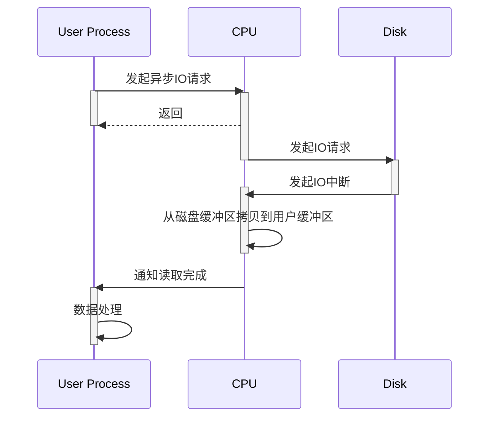

# 操作系统-IO

先介绍下系统的IO原型架构。CPU 通过内存总线(memory bus)连接到系统内存。显卡或者其他高性能 I/O 设备通过常规的I/O 总线(I/O bus)连接到系统，在许多现代系统中会是 PCI 或它的衍生形式。最后，更下面是外围总线(peripheral bus)，比如 SCSI、SATA 或者 USB。它们将最慢的设备连接到系统，包括磁盘、鼠标及其他类似设备。



考虑物理布局及造价成本。越快的I/O 设备的总线越短，因此高性能的内存总线没有足够的空间连接太多设备。另外，在工程上高性能总线的造价非常高。所以，系统的设计采用了这种分层的方式，这样可以让要求高性能的设
备（比如显卡）离 CPU 更近一些，低性能的设备离 CPU 远一些。将磁盘和其他低速设备连到外围总线的好处很多，其中较为突出的好处就是你可以在外围总线上连接大量的设备。

<!--more-->

## IO设备

标准IO设备包含两部分重要组件。第一部分是向系统其他部分展现的硬件接口(interface)。同软件一样，硬件也需要一些接口，让系统软件来控制它的操作。因此，所有设备都有自己的特定接口以及典型交互的协议。第2部分是它的内部结构(internal structure)。这部分包含设备相关的特定实现，负责具体实现设备展示给系统的抽象接口。



上图设备接口包含3个寄存器：一个状态(status)寄存器，可以读取并查看设备的当前状态；一个命令(command)寄存器，用于通知设备执行某个具体任务；一个数据(data)寄存器，将数据传给设备或从设备接收数据。通过读写这些寄存器，操作系统可以控制设备的行为。我们现在来描述操作系统与该设备的典型交互，以便让设备为它做某事。协议如下：

```
While (STATUS == BUSY);//wait until device is not busy

Write data to DATA register
Write command to COMMAND register
	(Doing so starts the device and executes the command)

While (STATUS == BUSY);//wait until device is done with your request
```

该协议包含4步。
1. 操作系统通过反复读取状态寄存器，等待设备进入可以接收命令的就绪状态。我们称之为轮询（polling）设备（基本上，就是问它正在做什么）。
2. 操作系统下发数据到数据寄存器。例如，你可以想象如果这是一个磁盘，需要多次写入操作，将一个磁盘块（比如4KB）传递给设备。如果主CPU参与数据移动（就像这个示例协议一样），我们就称之为编程的I/O（programmedI/O，PIO）。
3. 操作系统将命令写入命令寄存器；这样设备就知道数据已经准备好了，它应该开始执行命令。
4. 最后一步，操作系统再次通过不断轮询设备，等待并判断设备是否执行完成命令（有可能得到一个指示成功或失败的错误码）。

这个简单的协议好处是足够简单并且有效。但是难免会有一些低效和不方便。我们注意到这个协议存在的第一个问题就是轮询过程比较低效，在等待设备执行完成命令时浪费大量CPU时间，如果此时操作系统可以切换执行下一个就绪进程，就可以大大提高CPU的利用率。

### 文件描述符

文件描述符(file descriptor,简称 fd)在形式上是一个非负整数。实际上，它是一个索引值，指向内核为每一个进程所维护的该进程打开文件的记录表。当程序打开一个现有文件或者创建一个新文件时，内核向进程返回一个文件描述符。在程序设计中，一些涉及底层的程序编写往往会围绕着文件描述符展开。但是文件描述符这一概念往往只适用于UNIX、Linux这样的操作系统。

在 Linux 中，内核将所有的外部设备都当做一个文件来进行操作，而对一个文件的读写操作会调用内核提供的系统命令，返回一个 fd，对一个 socket 的读写也会有相应的描述符，称为 socketfd(socket 描述符)，实际上描述符就是一个数字，它指向内核中的一个结构体(文件路径、数据区等一些属性)。

### 设备驱动

在最底层，操作系统的一部分软件清楚地知道设备如何工作，我们将这部分软件称为设备驱动程序（device driver），所有设备交互的细节都封装在其中。

以Linux 文件系统栈为例:



文件系统（当然也包括在其之上的应用程序）完全不清楚它使用的是什么类型的磁盘。它只需要简单地向通用块设备层发送读写请求即可，块设备层会将这些请求路由给对应的设备驱动，然后设备驱动来完成真正的底层操作。

这种封装也有不足的地方。例如，如果有一个设备可以提供很多特殊的功能，但为了兼容大多数操作系统它不得不提供一个通用的接口，这样就使得自身的特殊功能无法使用。这种情况在使用 SCSI 设备的 Linux 中就发生了。SCSI 设备提供非常丰富的报告错误信息，但其他的块设备（比如 ATA/IDE）只提供非常简单的报错处理，这样上层的所有软件只能在出错时收到一个通用的 EIO 错误码（一般 IO 错误），SCSI 可能提供的所有附加信息都不能报告给文件系统。

## 中断

有了中断后，CPU 不再需要不断轮询设备，而是向设备发出一个请求，然后就可以让对应进程睡眠，切换执行其他任务。当设备完成了自身操作，会抛出一个硬件中断，引发CPU跳转执行操作系统预先定义好的中断服务例程（InterruptService Routine，ISR），或更为简单的中断处理程序（interrupt handler）。中断处理程序是一小段操作系统代码，它会结束之前的请求（比如从设备读取到了数据或者错误码）并且唤醒等待I/O的进程继续执行。

因此，中断允许计算与 I/O 重叠(overlap)，这是提高 CPU 利用率的关键。下面的时间线展示了这一点：


进程 1 在 CPU 上运行一段时间（对应 CPU 那一行上重复的 1），然后发出一个读取数据的 I/O 请求给磁盘。如果没有中断，那么操作系统就会简单自旋，不断轮询设备状态，直到设备完成 I/O 操作（对应其中的 p）。当设备完成请求的操作后，进程 1 又可以继续运行。

如果我们利用中断并允许重叠，操作系统就可以在等待磁盘操作时做其他事情：



在这个例子中，在磁盘处理进程 1 的请求时，操作系统在 CPU 上运行进程 2。磁盘处理完成后，触发一个中断，然后操作系统唤醒进程 1 继续运行。这样，在这段时间，无论CPU 还是磁盘都可以有效地利用。

注意，使用中断并非总是最佳方案。假如有一个非常高性能的设备，它处理请求很快：通常在CPU第一次轮询时就可以返回结果。此时如果使用中断，反而会使系统变慢：切换到其他进程，处理中断，再切换回之前的进程代价不小。

因此，如果设备非常快，那么最好的办法反而是轮询。如果设备比较慢，那么采用允许发生重叠的中断更好。如果设备的速度未知，或者时快时慢，可以考虑使用混合(hybrid)策略，先尝试轮询一小段时间，如果设备没有完成操作，此时再使用中断。这种两阶段(two-phased)的办法可以实现两种方法的好处。

> 尽管中断可以做到计算与 I/O 的重叠，但这仅在慢速设备上有意义。否则，额外的中断处理和上下文切换的代价反而会超过其收益。另外，如果短时间内出现大量的中断，可能会使得系统过载并且引发活锁。这种情况下，轮询的方式可以在操作系统自身的调度上提供更多的控制，反而更有效。

## 数据拷贝

标准协议还有一点需要我们注意。具体来说，如果使用编程的 I/O 将一大块数据传给设备，CPU 又会因为琐碎的任务而变得负载很重，浪费了时间和算力，本来更好是用于运行其他进程。下面的时间线展示了这个问题:


进程 1 在运行过程中需要向磁盘写一些数据，所以它开始进行 I/O 操作，将数据从内存拷贝到磁盘(其中标示c的过程)。拷贝结束后，磁盘上的 I/O 操作开始执行，此时 CPU 才可以处理其他请求。显然，使用 PIO 的方式，CPU 的时间会浪费在向设备传输数据或从设备传出数据的过程中。

时序图如下:



1. 用户进程调用 read 方法，向cpu发出 I/O 请求
2. cpu向磁盘发起IO请求给磁盘控制器，之后立马返回。返回之后cpu可以切换到其它进程执行其他任务
3. 磁盘控制器收到指令后，于是就开始进行磁盘IO，磁盘IO完成后会把数据放入到磁盘控制器的内部缓冲区中，然后产生一个中断
4. CPU 收到中断信号后，停下手头的工作，接着把磁盘控制器的缓冲区的数据读进内核的页缓存【优化方法DMA】。
5. 接着将数据从内核页缓存拷贝到用户进程空间。
6. 最后read()调用返回。


### DMA

DMA(Direct Memory Access)引擎是系统中的一个特殊设备，它可以协调完成**内存和设备间**的数据传递，不需要 CPU 介入(优化上述第4步)。

DMA 工作过程如下。以将数据传送给设备为例，操作系统会通过编程告诉 DMA 引擎数据在内存的位置，要拷贝的大小以及要拷贝到哪个设备。在此之后，操作系统就可以处理其他请求了。当 DMA 的任务完成后，DMA 控制器会抛出一个中断来告诉操作系统自己已经完成数据传输。修改后的时间线如下:



从时间线中可以看到，数据的拷贝工作都是由 DMA 控制器来完成的。因为 CPU 在此时是空闲的，所以操作系统可以让它做一些其他事情，比如此处调度进程 2 到 CPU 来运行。因此进程 2 在进程 1 再次运行之前可以使用更多的 CPU。

时序图如下:


#### scatter/gather 

scatter/gather指的在多个缓冲区上实现一个简单的I/O操作，比如从通道中读取数据到多个缓冲区，或从多个缓冲区中写入数据到通道；

scatter（分散）：指的是从通道中读取数据分散到多个缓冲区Buffer的过程，该过程会将每个缓存区填满，直至通道中无数据或缓冲区没有空间；

gather（聚集）：指的是将多个缓冲区Buffer聚集起来写入到通道的过程，该过程类似于将多个缓冲区的内容连接起来写入通道；

#### scatter/gather DMA

Scatter-gather DMA方式是与block DMA方式相对应的一种DMA方式。

在DMA传输数据的过程中，要求源物理地址和目标物理地址必须是连续的。但是在某些计算机体系中，如IA架构，连续的存储器地址在物理上不一定是连续的，所以DMA传输要分成多次完成。

如果在传输完一块物理上连续的数据后引起一次中断，然后再由主机进行下一块物理上连续的数据传输，那么这种方式就为block DMA方式。

Scatter-gather DMA方式则不同，它使用一个链表描述物理上不连续的存储空间，然后把链表首地址告诉DMA master。DMA master在传输完一块物理连续的数据后，不用发起中断，而是根据链表来传输下一块物理上连续的数据，直到传输完毕后再发起一次中断。

很显然，scatter-gather DMA方式比block DMA方式效率高。

### 零拷贝

从上面的介绍中可以看到读取数据过程中发生了2次Copy。接下来，我们考虑文件下载场景:将磁盘上的文件读取出来，然后通过网络协议发送给客户端。




首先，期间共发生了 4 次用户态与内核态的上下文切换，因为发生了两次系统调用，一次是 read() ，一次是 write()，每次系统调用都得先从用户态切换到内核态，等内核完成任务后，再从内核态切换回用户态。上下文切换到成本并不小，一次切换需要耗时几十纳秒到几微秒，虽然时间看上去很短，但是在高并发的场景下，这类时间容易被累积和放大，从而影响系统的性能。

其次，还发生了 4 次数据拷贝，其中两次是 DMA 的拷贝，另外两次则是通过 CPU 拷贝的，下面说一下这个过程：

- 第一次拷贝，把磁盘上的数据拷贝到操作系统内核的缓冲区里，这个拷贝的过程是通过 DMA 搬运的。
- 第二次拷贝，把内核缓冲区的数据拷贝到用户的缓冲区里，于是我们应用程序就可以使用这部分数据了，这个拷贝到过程是由 CPU 完成的。
- 第三次拷贝，把刚才拷贝到用户的缓冲区里的数据，再拷贝到内核的 socket 的缓冲区里，这个过程依然还是由 CPU 搬运的。
- 第四次拷贝，把内核的 socket 缓冲区里的数据，拷贝到网卡的缓冲区里，这个过程又是由 DMA 搬运的。

> 要想提高文件传输的性能，就需要减少「用户态与内核态的上下文切换」和「内存拷贝」的次数。

「从内核的读缓冲区拷贝到用户的缓冲区里，再从用户的缓冲区里拷贝到 socket 的缓冲区里」，这个过程是没有必要的。因为文件传输的应用场景中，在用户空间我们并不会对数据「再加工」，所以数据实际上可以不用搬运到用户空间，因此用户的缓冲区是没有必要存在的。

#### mmap

read() 系统调用的过程中会把内核缓冲区的数据拷贝到用户的缓冲区里，为了减少这一步开销，我们可以用 mmap() 替换 read() 系统调用函数。

```c
buf = mmap(file, len);
write(sockfd, buf, len);
```

mmap() 系统调用函数会直接把内核缓冲区里的数据映射到用户空间，这样，操作系统内核与用户空间共享缓冲区，就不需要再进行任何的数据拷贝操作。通过使用 mmap() 来代替 read()， 可以减少一次数据拷贝的过程。

- 应用进程调用了 mmap() 后，DMA 会把磁盘的数据拷贝到内核的缓冲区里。接着，应用进程跟操作系统内核「共享」这个缓冲区；
- 应用进程再调用 write()，操作系统直接将内核缓冲区的数据拷贝到 socket 缓冲区中，这一切都发生在内核态，由 CPU 来搬运数据；
- 最后，把内核的 socket 缓冲区里的数据，拷贝到网卡的缓冲区里，这个过程是由 DMA 搬运的。


>但这还不是最理想的零拷贝，因为仍然需要通过 CPU 把内核缓冲区的数据拷贝到 socket 缓冲区里，而且仍然需要 4 次上下文切换，因为系统调用还是 2 次。

mmap内存映射有两种类型，共享型和私有型，前者可以将任何对内存的写操作都同步到磁盘文件，而且所有映射同一个文件的进程都共享任意一个进程对映射内存的修改；后者映射的文件只能是只读文件，所以不可以将对内存的写同步到文件，而且多个进程不共享修改。

显然，共享型内存映射的效率偏低，因为如果一个文件被很多进程映射，那么每次的修改同步将花费一定的开销。

#### SendFile

在 Linux 内核版本 2.1 中，提供了一个专门发送文件的系统调用函数 sendfile()，函数形式如下：

```c
#include <sys/socket.h>
ssize_t sendfile(int out_fd, int in_fd, off_t *offset, size_t count);
```

它的前两个参数分别是目的端和源端的文件描述符，后面两个参数是源端的偏移量和复制数据的长度，返回值是实际复制数据的长度。

首先，它可以替代前面的 read() 和 write() 这两个系统调用，这样就可以减少一次系统调用，也就减少了 2 次上下文切换的开销。

其次，该系统调用，可以直接把内核缓冲区里的数据拷贝到 socket 缓冲区里，不再拷贝到用户态，这样就只有 2 次上下文切换，和 3 次数据拷贝。如下图：



但是这还不是真正的零拷贝技术，如果网卡支持 SG-DMA（The Scatter-Gather Direct Memory Access）技术（和普通的 DMA 有所不同），我们可以进一步减少通过 CPU 把内核缓冲区里的数据拷贝到 socket 缓冲区的过程。

Linux 系统通过下面这个命令，查看网卡是否支持 scatter-gather 特性：

```sh
$ ethtool -k eth0 | grep scatter-gather
scatter-gather: on
```

从 Linux 内核 2.4 版本开始起，对于支持网卡支持 SG-DMA 技术的情况下， sendfile() 系统调用的过程发生了点变化，具体过程如下：

- 第一步，通过 DMA 将磁盘上的数据拷贝到内核缓冲区里；
- 第二步，缓冲区描述符和数据长度传到 socket 缓冲区，这样网卡的 SG-DMA 控制器就可以直接将内核缓存中的数据拷贝到网卡的缓冲区里，

在第二步中不需要将数据从操作系统内核缓冲区拷贝到 socket 缓冲区中，这样就减少了一次数据拷贝; 所以，这个过程之中，只进行了 2 次数据拷贝。

|send file2.4-|send file 2.4+|
|:---|:---|
|3次copy|2次copy|
|||

### 总结

这就是所谓的零拷贝（Zero-copy）技术，因为我们没有在内存层面去拷贝数据，也就是说全程没有通过 CPU 来搬运数据，所有的数据都是通过 DMA 来进行传输的。。

零拷贝技术的文件传输方式相比传统文件传输的方式，减少了 2 次上下文切换和数据拷贝次数，只需要 2 次上下文切换和数据拷贝次数，就可以完成文件的传输，而且 2 次的数据拷贝过程，都不需要通过 CPU，2 次都是由 DMA 来搬运。

所以，总体来看，零拷贝技术可以把文件传输的性能提高至少一倍以上。

## PageCache

文件传输过程，其中第一步都是先需要先把磁盘文件数据拷贝「内核缓冲区」里，这个「内核缓冲区」实际上是磁盘高速缓存（PageCache）。

由于零拷贝使用了 PageCache 技术，可以使得零拷贝进一步提升了性能，我们接下来看看 PageCache 是如何做到这一点的。

读写磁盘相比读写内存的速度慢太多了，所以我们应该想办法把「读写磁盘」替换成「读写内存」。于是，我们会通过 DMA 把磁盘里的数据搬运到内存里，这样就可以用读内存替换读磁盘。

但是，内存空间远比磁盘要小，内存注定只能拷贝磁盘里的一小部分数据。

那问题来了，选择哪些磁盘数据拷贝到内存呢？

我们都知道程序运行的时候，具有「局部性」，所以通常，刚被访问的数据在短时间内再次被访问的概率很高，于是我们可以用 PageCache 来缓存最近被访问的数据，当空间不足时淘汰最久未被访问的缓存。

所以，读写磁盘数据的时候，优先在 PageCache 找，如果数据存在则可以直接返回；如果没有，则从磁盘中读取，然后缓存 PageCache 中。

还有一点，读取磁盘数据的时候，需要找到数据所在的位置，但是对于机械磁盘来说，就是通过磁头旋转到数据所在的扇区，再开始「顺序」读取数据，但是旋转磁头这个物理动作是非常耗时的，为了降低它的影响，PageCache 使用了「预读功能」。

比如，假设 read 方法每次只会读 32 KB 的字节，虽然 read 刚开始只会读 0 ～ 32 KB 的字节，但内核会把其后面的 32～64 KB 也读取到 PageCache，这样后面读取 32～64 KB 的成本就很低，如果在 32～64 KB 淘汰出 PageCache 前，进程读取到它了，收益就非常大。

所以，PageCache 的优点主要是两个：

- 缓存最近被访问的数据；
- 预读功能；

这两个做法，将大大提高读写磁盘的性能。

Page Cache的工作过程:

- 写数据时首先写到缓存，将写入的页标记为dirty，然后向外部存储flush，也就是缓存写机制中的write-back（另一种是write-through，Linux未采用）
- 读数据时首先读取缓存，如果未命中，再去外部存储读取，并且将读取来的数据也加入缓存。
- 操作系统总是积极地将所有空闲内存都用作cache(Page/Buffer Cache)，当内存不够用时也会用LRU等算法淘汰缓存页。

### Buffer cache

Page cache用于缓存文件的页数据，Buffer cache用于缓存块设备（如磁盘）的块数据。页是逻辑上的概念，因此page cache是与文件系统同级的；块是物理上的概念，因此buffer cache是与块设备驱动程序同级的。page cache与buffer cache的共同目的都是加速数据I/O

在Linux 2.4版本的内核之前，page cache与buffer cache是完全分离的。但是，块设备大多是磁盘，磁盘上的数据又大多通过文件系统来组织，这种设计导致很多数据被缓存了两次，浪费内存。

所以在2.4版本内核之后，两块缓存近似融合在了一起：如果一个文件的页加载到了page cache，那么同时buffer cache只需要维护块指向页的指针就可以了。只有那些没有文件表示的块，或者绕过了文件系统直接操作（如dd命令）的块，才会真正放到buffer cache里（**在没有文件系统的情况下,直接对磁盘进行操作的数据会缓存到buffer cache中**）。

或者可以这样讲： 2.4.10之后的内核的disk cache 只有 page cache, 而page cache中有些页面被叫做buffer page的，是因为这些页面（buffer page）都有与其相关的buffer_head 描述符，也正是这样页面被free 统计为 buffer 占用。如果没有buffer_head与该页相关，则被free统计为 cache占用。 

因此，我们现在提起page cache，基本上都同时指page cache和buffer cache两者。

下图近似地示出32-bit Linux系统中可能的一种page cache结构，其中block size大小为1KB，page size大小为4KB。


### 数据回写

当进程修改了高速缓存里的数据时，该页就被内核标记为脏页，内核将会在合适的时间把脏页的数据写到磁盘中去，以保持高速缓存中的数据和磁盘中的数据是一致的。回写数据一般有几种情况。

- 周期性的扫描脏页，如果发现脏页存在的时间过了某一时间时，也会把该脏页的数据刷到磁盘上
- 当发现脏页太多的时候，内核会把一定数量的脏页数据写到磁盘上；
- 用户主动调用 sync，fsync，fdatasync，内核缓存会flush到磁盘上；

page cache中的数据会随着内核中flusher线程的调度写回磁盘。与它相关的有以下4个参数，必要时可以调整。

```sh
## flush检查的周期。单位为0.01秒，默认值500，即5秒。每次检查都会按照以下三个参数控制的逻辑来处理。
/proc/sys/vm/dirty_writeback_centisecs
## 如果page cache中的页被标记为dirty的时间超过了这个值，就会被直接刷到磁盘。单位为0.01秒。默认值3000，即半分钟。
/proc/sys/vm/dirty_expire_centisecs
## 如果dirty page的总大小占空闲内存量的比例超过了该值，就会在后台调度flusher线程异步写磁盘，不会阻塞当前的write()操作。默认值为10%。
/proc/sys/vm/dirty_background_ratio
## 如果dirty page的总大小占总内存量的比例超过了该值，就会阻塞所有进程的write()操作，并且强制每个进程将自己的文件写入磁盘。默认值为20%。
/proc/sys/vm/dirty_ratio
```

## 直接IO

磁盘 I/O 是非常慢的，所以 Linux 内核通过减少磁盘 I/O 次数来减少I/O时间，在系统调用后，会把用户数据拷贝到内核中缓存起来，只有当缓存满足某些条件的时候，才发起磁盘 I/O 的请求。根据是「否利用操作系统的页缓存」，可以把文件 I/O 分为直接 I/O 与非直接 I/O：

- 直接 I/O，不会发生内核缓存和用户程序之间数据复制，跳过操作系统的页缓存，直接经过文件系统访问磁盘。
- 非直接 I/O，正相反，读操作时，数据从内核缓存中拷贝给用户程序，写操作时，数据从用户程序拷贝给内核缓存，再由内核决定什么时候写入数据到磁盘。

> 想要实现直接I/O，需要在系统调用中，指定 O_DIRECT 标志。如果没有设置过，默认的是非直接I/O。
> 顺便提一下，与O_DIRECT类似的一个选项是O_SYNC，后者只对写数据有效，它将写入内核缓冲区的数据立即写入磁盘，将机器故障时数据的丢失减少到最小，但是它仍然要经过内核缓冲区。

一些较复杂的应用，比如数据库服务器，它们为了充分提高性能，希望绕过内核缓冲区，由自己在用户态空间实现并管理I/O缓冲区，包括缓存机制和写延迟机制等，以支持独特的查询机制，比如数据库可以根据更加合理的策略来提高查询缓存命中率。另一方面，绕过内核缓冲区也可以减少系统内存的开销，因为内核缓冲区本身就在使用系统内存。

直接I/O的缺点就是如果访问的数据不在应用程序缓存中，那么每次数据都会直接从磁盘进行加载，这种直接加载会非常缓慢。通常**直接I/O跟异步I/O结合使用**会得到较好的性能。

另外，由于直接 I/O 绕过了 PageCache，就无法享受内核的这两点的优化：

- 内核的 I/O 调度算法会缓存尽可能多的 I/O 请求在 PageCache 中，最后「合并」成一个更大的 I/O 请求再发给磁盘，这样做是为了减少磁盘的寻址操作；
- 内核也会「预读」后续的 I/O 请求放在 PageCache 中，一样是为了减少对磁盘的操作。



- 内核向磁盘发起读请求，但是可以不等待数据就位就可以返回，于是进程此时可以处理其他任务；
- 当内核将磁盘中的数据拷贝到进程缓冲区后，进程将接收到内核的通知，再去处理数据；

> 可以发现，异步 I/O 并没有涉及到 PageCache。

## 大文件

当用户访问这些大文件(GB 级别的文件)的时候，内核就会把它们载入 PageCache 中，于是 PageCache 空间很快被这些大文件占满。

另外，由于文件太大，可能某些部分的文件数据被再次访问的概率比较低，这样就会带来 2 个问题：

- PageCache 由于长时间被大文件占据，其他「热点」的小文件可能就无法充分使用到 PageCache，于是这样磁盘读写的性能就会下降了；
- PageCache 中的大文件数据，由于没有享受到缓存带来的好处，但却耗费 DMA 多拷贝到 PageCache 一次；

所以，针对大文件的传输，不应该使用 PageCache，也就是说不应该使用零拷贝技术，因为可能由于 PageCache 被大文件占据，而导致「热点」小文件无法利用到 PageCache，这样在高并发的环境下，会带来严重的性能问题。相反页缓存可以提升小文件传输的效率。

