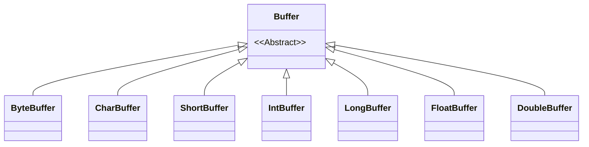
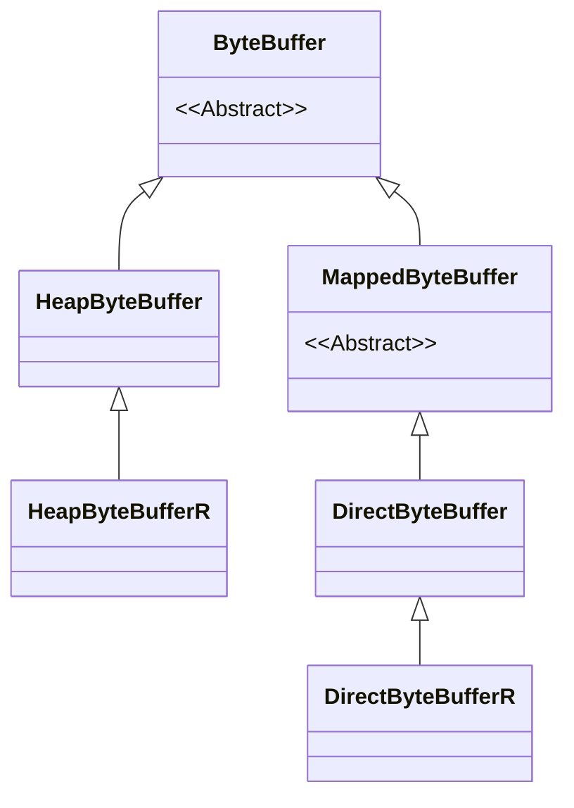
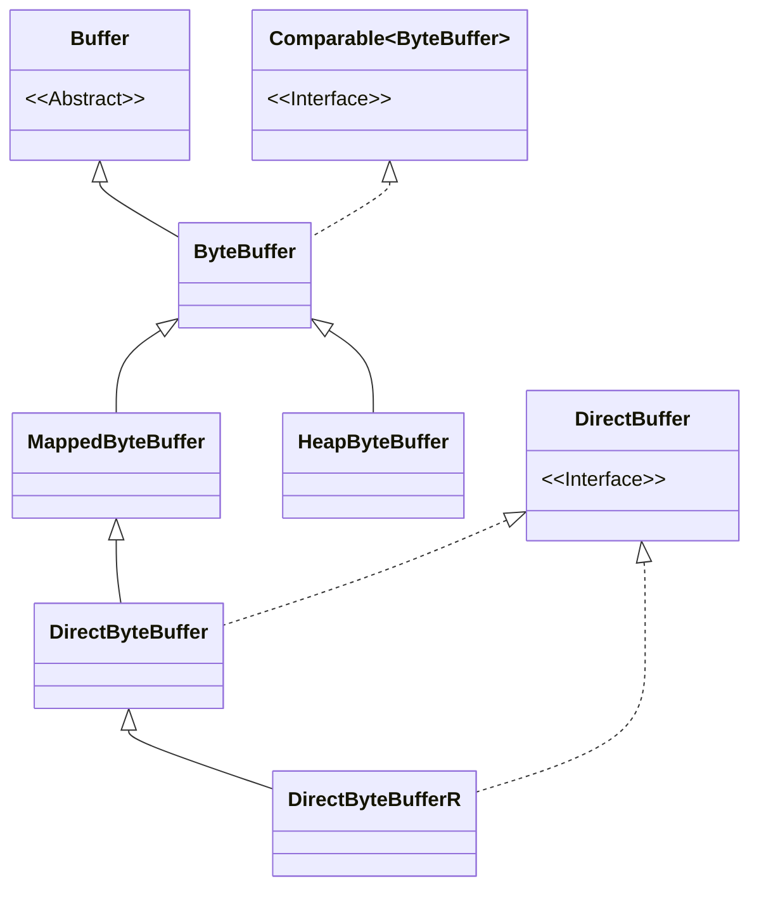

# Java NIO: Buffer

Java 传统 IO 是面向流的，流的处理是单向「只能从输入流中读取数据，或是向输出流中写入数据」且阻塞的。通常都是从输入流中边读取数据边处理数据，这样 IO 处理效率就会很低，基于上述原因，JDK1.4 引入了 NIO，而 NIO 是面向 Buffer 的，在处理 IO 操作的时候，会一次性将 Channel 中的数据读取到 Buffer 中然后在做后续处理，向 Channel 中写入数据也是一样，也是需要一个 Buffer 做中转，然后将 Buffer 中的数据批量写入 Channel 中。通过增加Buffer支持了数据的灵活处理。

除此之外，Nio Buffer 还提供了堆外的直接内存和内存映射相关的访问方式，来避免内存之间的来回拷贝，所以即使在传统 IO 中用到了 BufferedInputStream 也还是没办法和 Nio Buffer 相匹敌。本文将结合源码介绍 ByteBuffer^[本文JDK源码基于Java8]。

<!--more-->

## Buffer

Buffer 类是JDK NIO 定义的一个顶层抽象类，对于缓冲区的所有基本操作和基础属性全部定义在顶层 Buffer 类中，在 Java 中一共有八种基本类型，JDK NIO 也为这八种基本类型分别提供了其对应的 Buffer 类。



Buffer的每个子类都分别有基于Heap和基于DirectMemory的实现。以ByteBuffer为例:



> HeapByteBufferR 是HeapByteBuffer的只读实现，DirectByteBufferR是DirectByteBuffer的只读实现。

Buffer中定义了4个重要的属性，用来支持buffer的各种操作:


```java
public abstract class Buffer {
    // 不变式 mark <= position <= limit <= capacity
    private int mark = -1;
    private int position = 0;
    private int limit;
    private int capacity;
}
```

- capacity：规定了整个 Buffer 的容量，具体可以容纳多少个元素。capacity 指针之前的元素均是 Buffer 可操作的空间。
- position：用于指向 Buffer 中下一个操作的元素，初始值为 0。写模式下，position 指针用于指向下一个可写位置。读模式下，position 指针指向下一个可读位置。
- limit：表示 Buffer 可操作元素的上限。比如在 Buffer 的写模式下，可写元素的上限就是 Buffer 的整体容量也就是 capacity，capacity - 1 即为 Buffer 最后一个可写位置。在读模式下，Buffer 中可读元素的上限即也就是上一次写模式中的 position。注意，limit指向的位置是不能操作的。
- mark：用于标记 Buffer 的reset的位置。在reset时，position会被改为上次mark的位置。

> 对于上面四个属性，我们有不变式  $\text{mark} <= \text{position} <= \text{limit} <= \text{capacity}$

### 类簇

基本上对于每一类 buffer，都有三大类子系列。拿 CharBuffer 类举例说明：

- ByteBufferAsCharBuffer: 基于ByteBuffer进行封装
    - ByteBufferAsCharBufferB: ByteBufferAsCharBufferB 类是将 ByteBuffer 进行一层封装，提供的方法都是字符层面的，使用大端序列。
    - ByteBufferAsCharBufferL: ByteBufferAsCharBufferL 类是将 ByteBuffer 进行一层封装，提供的方法都是字符层面的，使用小端序列。
    - ByteBufferAsCharBufferRB: 继承 ByteBufferAsCharBufferB 类，是 ByteBufferAsCharBufferB 类的可读版本。
    - ByteBufferAsCharBufferRL: 继承 ByteBufferAsCharBufferL 类，是 ByteBufferAsCharBufferL 类的可读版本。
- DirectBuffer: DirectBuffer 系列是内核态的缓冲区，而不是用户态的缓冲区，JVM所管理的内存都是属于用户态。
    - DirectCharBufferU 类是内核态字符缓冲区，U表示与平台字节序列保持一致。
    - DirectCharBufferS 类是内核态字符缓冲区，U表示与平台字节序列不一致。
    - DirectCharBufferRU 类继承 DirectCharBufferU，是 DirectCharBufferU 类的可读版本。但是目前JDK8中没有实现，因此需要自己去实现。
    - DirectCharBufferRS 类继承 DirectCharBufferS，是 DirectCharBufferS 类的可读版本。但是目前JDK8中没有实现，因此需要自己去实现。
- HeapBuffer: HeapBuffer 系列是我们平常用的缓冲区，是JVM堆中的缓冲区.
    - HeapCharBuffer 内置一个`char[] buf`。
    - HeapCharBufferR 继承 HeapCharBuffer 类，是它的可读版本。

> ByteBuffer 只有DirecBuffer和HeapBuffer两类。


### Buffer 分配

要想获得一个Buffer对象首先要进行分配。 每一个Buffer类都有allocate方法(可以在堆上分配，也可以在直接内存上分配)。

```java
// 堆中分配48字节capacity的ByteBuffer
ByteBuffer buf = ByteBuffer.allocate(48);
// 也可以使用wrap方法。把一个byte数组或byte数组的一部分包装成ByteBuffer
ByteBuffer buf = ByteBuffer.wrap(byteArray)

// 直接内存中分配48字节capacity的ByteBuffer
ByteBuffer buf = ByteBuffer.allocateDirect(48);
```
Buffer构造时根据指定的参数来初始化 Buffer 中的这四个重要属性：mark，position，limit，capacity。其中 mark 初始默认为 -1，position 初始默认为 0。初始化后的Buffer 如下图:

```ascii
                               capacity
                                  |    
+---+---+---+---+---+---+---+---+ v    
|   |   |   |   |   |   |   |   |      
+---+---+---+---+---+---+---+---+      
  ^                               ^    
  |                               |    
position                        limit  
```

### Buffer 写入

Buffer的写入有两种方法。

- 通过Channel读取写到Buffer。在Jdk实现的FileChannel,SocketChannel中对于HeapBuffer实际上还是调用了put方法。而对于DirectBuffer，使用了Native方法。

```java
//read into buffer.
int bytesRead = inChannel.read(buf); 
```

- 通过Buffer的put()方法写到Buffer里。对于HeapBuffer的put方法是修改数组对应值。而对于DirectBuffer，使用了Unsafe中的Native方法。

```java
byteBuffer.putInt(127);
```

在向Buffer中写入3个数据后的结构如下:

```ascii
                               capacity
                                  |    
+---+---+---+---+---+---+---+---+ v    
| 1 | 2 | 3 |   |   |   |   |   |      
+---+---+---+---+---+---+---+---+      
              ^                   ^    
              |                   |    
            position            limit  
```

#### nextPutIndex

以HeapByteBuffer的put方法为例，看下put过程中的属性变化。

```java
// HeapByteBuffer.java
public ByteBuffer put(byte x) {
    hb[ix(nextPutIndex())] = x;
    return this;
}
final int nextPutIndex() {
    int p = position;
    if (p >= limit)
        throw new BufferOverflowException();
    position = p + 1;
    return p;
}

final int nextPutIndex(int nb) {
    int p = position;
    if (limit - p < nb)
        throw new BufferOverflowException();
    position = p + nb;
    return p;
}
```

可以看到在put的过程中只有position指针迁移了一位。`nextPutIndex(int nb)`方法用于put比当前类型更大的类型值时使用。例如`putInt()`方法。

```java
public ByteBuffer putInt(int x) {
    // 一个int是 4个byte 长度
    Bits.putInt(this, ix(nextPutIndex(4)), x, bigEndian);
    return this;
}
```

### flip 写=>读 

Buffer中写入数据后，如果想从Buffer中读取，需要先从写模式切换到读模式。

```ascii
                               capacity
                                  |    
+---+---+---+---+---+---+---+---+ v    
| 1 | 2 | 3 |   |   |   |   |   |      
+---+---+---+---+---+---+---+---+      
  ^           ^                        
  |           |                        
position    limit                      
```
flip 方法中是对 Buffer 中的这四个指针做了一些调整：

- 将下一个可写入位置 position 作为读模式下的上限 limit。
- position设置为 0 。这样使得我们可以从头开始读取 Buffer 中写入的数据。

```java
public Buffer flip() {
    limit = position;
    position = 0;
    mark = -1;
    return this;
}
```

### Buffer 读取

从Buffer中读取数据有两种方式(底层对heap和direct memory实现类似写入):

- 从Buffer读取数据写入到Channel。

```java
int bytesWritten = inChannel.write(buf);
```

- 使用get()方法从Buffer中读取数据。

```java
byteBuffer.getInt();
```
在Buffer读取写入的3个元素后的结构:

```ascii
                               capacity
                                  |    
+---+---+---+---+---+---+---+---+ v    
| 1 | 2 | 3 |   |   |   |   |   |      
+---+---+---+---+---+---+---+---+      
              ^                        
              |                        
            position                   
            limit                                        
```

#### nextGetIndex

以HeapByteBuffer的get方法为例，看下get过程中的属性变化。

```java
// HeapByteBuffer.java
public byte get() {
    return hb[ix(nextGetIndex())];
}
final int nextGetIndex() {
    int p = position;
    if (p >= limit)
        throw new BufferUnderflowException();
    position = p + 1;
    return p;
}

final int nextGetIndex(int nb) {
    int p = position;
    if (limit - p < nb)
        throw new BufferUnderflowException();
    position = p + nb;
    return p;
}
```

可以看到在get的过程中只有position指针迁移了一位。`nextGetIndex(int nb)`方法用于get比当前类型更大的类型值时使用。例如`getInt()`方法。

```java
public int getInt() {
    return Bits.getInt(this, ix(nextGetIndex(4)), bigEndian);
}
```

### clear 读=>写

在读模式下以将 Buffer 中的数据读取完毕之后，这时候如果再次向 Buffer 写入数据的话，就需要切换到 Buffer 的写模式下。

```java
public final Buffer clear() {
    position = 0;
    limit = capacity;
    mark = -1;
    return this;
}
```

看到调用 clear() 方法之后，Buffer 中各个指针的状态又回到了最初的状态：

- position 位置重新指向起始位置 0 处。写入上限 limit 重新指向了 capacity 的位置。
- 这时向 Buffer 中写入数据时，就会从 Buffer 的开头处依次写入，**新写入的数据就会把已经读取的那部分数据覆盖掉**。

```ascii
                                capacity
                                   |    
 +---+---+---+---+---+---+---+---+ v    
 | 1 | 2 | 3 |   |   |   |   |   |      
 +---+---+---+---+---+---+---+---+      
   ^                               ^    
   |                               |    
position                         limit  
```

### compact

如果我们只是读取了 Buffer 中的部分数据，但是还有一部分数据没有读取，这时候，调用 clear() 方法开启写模式向 Buffer 中写入数据的话，就会出问题，因为这会覆盖掉我们还没有读取的数据部分。

针对这种情况，为了保证未读取的数据部分不被覆盖，我们就需要先将不可覆盖的数据部分移动到 Buffer 的最前边，然后将 position 指针指向可覆盖数据区域的第一个位置。

假设我们读到3的位置，还有3和4没有读到。

```ascii
                               capacity
                                  |    
+---+---+---+---+---+---+---+---+ v    
| 1 | 2 | 3 | 4 |   |   |   |   |      
+---+---+---+---+---+---+---+---+      
          ^       ^                    
          |       |                    
       position limit
```

1. 首先将3和4 copy到Buffer最前面。
2. 将position设置为2(未读取的长度)
3. 将limit设置为capacity

```ascii
                               capacity
                                  |    
+---+---+---+---+---+---+---+---+ v    
| 3 | 4 |   |   |   |   |   |   |      
+---+---+---+---+---+---+---+---+      
          ^                       ^    
          |                       |    
       position                 limit  
```

由于 Buffer 是顶层设计只是负责定义 Buffer 相关的操作规范，并未定义具体的数据存储方式，因为 compact() 涉及到移动数据，所以实现在了 Buffer 具体子类中，这里我们以 HeapByteBuffer 举例说明：

```java
public ByteBuffer compact() {
    int pos = position();
    int lim = limit();
    assert (pos <= lim);
    int rem = (pos <= lim ? lim - pos : 0);
    System.arraycopy(hb, ix(pos), hb, ix(0), rem);
    position(rem);
    limit(capacity());
    discardMark();
    return this;
}
```

### rewind

rewind() 方法可以帮助我们重新读取 Buffer 中的数据，它会将 position 的值重新设置为 0，并丢弃 mark。

```java
public final Buffer rewind() {
    position = 0;
    mark = -1;
    return this;
}
```

### mark & reset

mark用于标记 Buffer 当前 position 的位置，常用于网络数据包解码等场景。

为了应对TCP传输中的粘包拆包问题，在解码之前都需要先调用mark 方法将 Buffer 的当前 position 指针保存至 mark 属性中，如果 Buffer 中的数据足够我们解码为一个完整的包，我们就执行解码操作。如果 Buffer 中的数据不够我们解码为一个完整的包（也就是半包），我们就调用 reset 方法，将 position 还原到原来的位置，等待剩下的网络数据到来。

```java
public final Buffer mark() {
    mark = position;
    return this;
}
public final Buffer reset() {
    int m = mark;
    if (m < 0)
        throw new InvalidMarkException();
    position = m;
    return this;
}
```

- 写入3个元素后先mark，然后开始读取。

```ascii
 mark        limit              capacity
   |           |                   |    
   v           v                   v    
 +---+---+---+---+---+---+---+---+      
 | 1 | 2 | 3 |   |   |   |   |   |      
 +---+---+---+---+---+---+---+---+      
   ^                                    
   |                                    
position                     
```

- 读取完3个元素后，发现没有读全

```ascii
mark        limit              capacity
  |           |                   |    
  v           v                   v    
+---+---+---+---+---+---+---+---+      
| 1 | 2 | 3 |   |   |   |   |   |      
+---+---+---+---+---+---+---+---+      
              ^                        
              |                        
           position                    
```

- 调用reset方法复位。

### Comparable Buffer

八种基本类型的Buffer都实现了Comparable接口，并重写了`equals()`方法。

当满足下列条件时，表示两个Buffer相等：

- 有相同的元素类型。
- Buffer中剩余的元素的个数相等。
- Buffer中所有剩余的元素等都相同。

compareTo方法比较两个Buffer的剩余元素， 如果满足下列条件，则认为一个Buffer小于另一个Buffer：

- 第一个不相等的元素小于另一个Buffer中对应的元素 。
- 所有元素都相等，但第一个Buffer比另一个先耗尽(第一个Buffer的剩余元素个数比另一个少)。

注意，这里都是比较剩余元素(范围是`[position,limit)`)

## Deep into Buffer

对每一种基本类型的 Buffer ，NIO 又根据 Buffer的数据存储内存不同分为了：HeapBuffer，DirectBuffer。以ByteBuffer为例:



HeapBuffer 背后是有一个对应的基本类型数组作为存储的。而 DirectBuffer 和 MappedBuffer 背后是一块堆外内存做存储。并没有一个基本类型的数组。可以使用hasArray() 方法来判断一个 Buffer 背后是否有一个 Java 基本类型的数组。

```java
public abstract class Buffer {
    // 仅用于 direct buffers
    //提升 JNI GetDirectBufferAddress速度 
    long address;
}

public abstract class ByteBuffer extends Buffer implements Comparable<ByteBuffer> {
    // 在这里而不是在Heap-X-Buffer中声明这些字段，是为了减少访问这些值所需的虚拟方法调用的数量
    // 在编写小缓冲区时，这种调用的成本特别高。

    final byte[] hb;  
    final int offset;
    boolean isReadOnly;   
    /** 上面这三个字段只用于 heap buffers **/

    // 基于数组，创建ByteBuffer
    ByteBuffer(int mark, int pos, int lim, int cap, byte[] hb, int offset)
    {
        super(mark, pos, lim, cap);
        this.hb = hb;
        this.offset = offset;
    }
    // 基于直接内存，创建ByteBuffer
    ByteBuffer(int mark, int pos, int lim, int cap) { 
        this(mark, pos, lim, cap, null, 0);
    }
}
```

Buffer和ByteBuffer 出现了4个新参数,其中address是用于直接内存，其他参数只用于堆:

- `long address`: DirectByteBuffer 和 MappedByteBuffer 背后依赖于堆外内存。这块堆外内存的起始地址存储于 Buffer 类中的 address 字段。
- `byte[] hb`: ByteBuffer 中背后依赖的用于存储数据的数组，该字段只适用于 HeapByteBuffer。
- `int offset`：ByteBuffer 中的内存偏移，用于创建新的 ByteBuffer 视图。该字段只适用于 HeapByteBuffer。
- `boolean isReadOnly`：用于标识该 ByteBuffer 是否是只读的。该字段只适用于 HeapByteBuffer。

ByteBuffer提供了创建具体存储类型的工厂方法:

```java
// DirectByteBuffer:
public static ByteBuffer allocateDirect(int capacity) {
    return new DirectByteBuffer(capacity);
}

// HeapByteBuffer:
public static ByteBuffer allocate(int capacity) {
    if (capacity < 0)
        throw new IllegalArgumentException();
    return new HeapByteBuffer(capacity, capacity);
}
```

> DirectBuffer 涉及到的代码比较复杂，后面会单独分析，本篇主要以HeapBuffer为例介绍。

### HeapByteBuffer

由于HeapByteBuffer本质上是基于byte array的，所以可以使用wrap方法从一个byte array生成HeapByteBuffer。

```java
// 使用已有的 byte array，不开辟新空间
public static ByteBuffer wrap(byte[] array) {
    return wrap(array, 0, array.length);
}
public static ByteBuffer wrap(byte[] array, int offset, int length)
{
    try {
        return new HeapByteBuffer(array, offset, length);
    } catch (IllegalArgumentException x) {
        throw new IndexOutOfBoundsException();
    }
}
HeapByteBuffer(byte[] buf, int off, int len) {
    // ByteBuffer(int mark, int pos, int lim, int cap, byte[] hb, int offset)
    super(-1, off, off + len, buf.length, buf, 0);
}
```

- wrap方法参数offset，指定了使用array中子数组的起始点，也就是映射之后 Buffer 的 position。
- wrap方法参数length，指定了使用array中子数组的长度，offset + length就是映射之后 Buffer 的 limit

### Buffer 视图

上面提到 ByteBuffer中有一个属性是 offset。事实上我们可以根据一段连续的内存地址或者一个数组创建出不同的 Buffer 视图出来。

```ascii
     +------------------------------------------------+
     |                    BASE BUFFER                 |
     |                                                |
     |          mark=2 position=4          capacity=9 |
     |            |       |                   |       |
     |            v       v                   v       |
     |  +---+---+---+---+---+---+---+---+---+         |
     |  | 0 | 1 | 2 | 3 | 4 | 5 | 6 | 7 | 8 |         |
+--- |  +---+---+---+---+---+---+---+---+---+         |
|    |                                        ^       |
|    |                                        |       |
|    |                                      limit=9   |
|    +------------------------------------------------+
|                                                      
|                                                      
|          +----------------------------------------+  
|          |           OFFSET=4                     |  
|          |                                        |  
|          |         position=0          capacity=5 |  
|          |            |                   |       |  
|  VIEW    |            v                   v       |  
+--------> |          +---+---+---+---+---+         |  
           |          | 4 | 5 | 6 | 7 | 8 |         |  
           |          +---+---+---+---+---+         |  
           |        ^                       ^       |  
           |        |                       |       |  
           |      mark=-1                 limit=5   |  
           +----------------------------------------+  
```

新的视图 Buffer 和原 Buffer 共享一个存储数组或者一段连续内存。站在新的视图 Buffer 角度来说，它的存储数组范围：0 - 4，所以再此视图下 position = 0，limit = capacity = 5 。

所以在新视图 Buffer 中访问元素的时候，就需要加上一个偏移 offset, position + offset 才能正确的访问到真实数组中的元素。这里的 offset = 4。

通过 `arrayOffset()` 方法获取视图 Buffer(只支持HeapBuffer)中的 offset。

ByteBuffer 的视图本质上也是一个 ByteBuffer，原生的 ByteBuffer 和它的视图 ByteBuffer 拥有各自独立的 mark，position，limit，capacity 指针。只不过背后依靠的内存空间是一样的。所以在视图 ByteBuffer 做的任何内容上的改动，原生 ByteBuffer 是看得见的。同理在原生 ByteBuffer 上做的任何内容改动，视图 ByteBuffer 也是看得见的。它们是相互影响的。

### 视图相关操作

Buffer的视图相关操作分别为 slice() 方法和 duplicate() 方法，我们还是以`ByteBuffer`为例。

#### `slice`

```java
// ByteBuffer
public abstract ByteBuffer slice();
// HeapByteBuffer
public ByteBuffer slice() {
    int pos = this.position();
    int lim = this.limit();
    int rem = (pos <= lim ? lim - pos : 0);
    return new HeapByteBuffer(hb,
                            -1,
                            0,
                            rem,
                            rem,
                            pos + offset);
}
```

调用 slice() 方法创建出来的 ByteBuffer 视图内容是从原生 ByteBufer 的当前位置 position 开始一直到 limit 之间的数据。也就是说通过 slice() 方法创建出来的视图里边的数据是原生 ByteBuffer 中还未处理的数据部分。

```
     +------------------------------------------------+
     |                    BASE BUFFER                 |
     |                                                |
     |          mark=2 position=4          capacity=9 |
     |            |       |                   |       |
     |            v       v<----unhandled---> v       |
     |  +---+---+---+---+---+---+---+---+---+         |
     |  | 0 | 1 | 2 | 3 | 4 | 5 | 6 | 7 | 8 |         |
+--- |  +---+---+---+---+---+---+---+---+---+         |
|    |                                        ^       |
|    |                                        |       |
|    |                                      limit=9   |
|    +------------------------------------------------+
|                                                      
|                                                      
|          +----------------------------------------+  
|          |           OFFSET=4                     |  
|          |                                        |  
|          |         position=0          capacity=5 |  
|          |            |                   |       |  
|  SLICE   |            v                   v       |  
+--------> |          +---+---+---+---+---+         |  
           |          | 4 | 5 | 6 | 7 | 8 |         |  
           |          +---+---+---+---+---+         |  
           |        ^                       ^       |  
           |        |                       |       |  
           |      mark=-1                 limit=5   |  
           +----------------------------------------+  
```

如上图所属，调用 slice() 方法创建出来的视图 ByteBuffer 它的存储数组范围：0 - 4，所以再此视图下 position = 0，limit = capacity = 5。

#### `duplicate`

```java
// ByteBuffer
public abstract ByteBuffer duplicate();
// 
public ByteBuffer duplicate() {
    return new HeapByteBuffer(hb,
                this.markValue(),
                this.position(),
                this.limit(),
                this.capacity(),
                offset);
}
```

duplicate() 方法创建出来的视图相当于就是完全复刻原生 ByteBuffer。它们的 offset，mark，position，limit，capacity 变量的值全部是一样的，这里需要注意虽然值是一样的，但是它们各自之间是相互独立的。用于对同一字节数组做不同的逻辑处理。

```ascii
     +------------------------------------------------+
     |                    BASE BUFFER                 |
     |                                                |
     |          mark=2 position=4          capacity=9 |
     |            |       |                   |       |
     |            v       v                   v       |
     |  +---+---+---+---+---+---+---+---+---+         |
     |  | 0 | 1 | 2 | 3 | 4 | 5 | 6 | 7 | 8 |         |
+--- |  +---+---+---+---+---+---+---+---+---+         |
|    |                                        ^       |
|    |                                        |       |
|    |                                      limit=9   |
|    +------------------------------------------------+
|                                                      
|duplicate                                             
|     +----------------------------------------------+ 
|     |                                              | 
|     |         mark=2 position=4          capacity=9| 
|     |           |       |                   |      | 
|     |           v       v                   v      | 
|     | +---+---+---+---+---+---+---+---+---+        | 
+---->| | 0 | 1 | 2 | 3 | 4 | 5 | 6 | 7 | 8 |        | 
      | +---+---+---+---+---+---+---+---+---+        | 
      |                                       ^      | 
      |                                       |      | 
      |                                     limit=9  | 
      |                                              | 
      +----------------------------------------------+ 
```

#### `asReadOnlyBuffer`

通过 asReadOnlyBuffer() 方法我们可以基于原生 ByteBuffer 创建出一个只读视图。对于只读视图的 ByteBuffer 只能读取不能写入。对只读视图进行写入操作会抛出 ReadOnlyBufferException 异常。

```java
// ByteBuffer
public abstract ByteBuffer asReadOnlyBuffer();
// HeapByteBuffer
public ByteBuffer asReadOnlyBuffer() {

    return new HeapByteBufferR(hb,
                            this.markValue(),
                            this.position(),
                            this.limit(),
                            this.capacity(),
                            offset);
}
```

NIO 中专门设计了一个只读 ByteBufferR 视图类。它的 isReadOnly 属性为 true。

```java
class HeapByteBufferR extends HeapByteBuffer {

   protected HeapByteBufferR(byte[] buf,
                                   int mark, int pos, int lim, int cap,
                                   int off)
    {
        super(buf, mark, pos, lim, cap, off);
        this.isReadOnly = true;

    }

}
```

### 字节序

HeapByteBuffer 背后是一个在 JVM 堆中开辟的一个字节数组，里边存放的是一个一个的字节，当我们以单个字节的形式操作 HeapByteBuffer 的时候并没有什么问题，可是当我们向 HeapByteBuffer 写入一个指定的基本类型数据时，比如写入一个 int 型 （占用 4 个字节），写入一个 double 型 （占用 8 个字节），就必须要考虑[字节序](/posts/3a40ba7d/)的问题了。

```java
public abstract class ByteBuffer extends Buffer implements Comparable<ByteBuffer> {

   boolean bigEndian = true;
   boolean nativeByteOrder = (Bits.byteOrder() == ByteOrder.BIG_ENDIAN);
}
```

我们可以强制网络协议传输使用大端字节序，但是我们无法强制主机中采用的字节序，所以我们需要经常在网络 IO 场景下做一些字节序的转换工作。

JDK NIO ByteBuffer 默认的字节序为大端模式，我们可以通过 NIO 提供的操作类 Bits 获取主机字节序 Bits.byteOrder()，或者直接获取 NIO ByteBuffer 中的 nativeByteOrder 字段判断主机字节序：true 表示主机字节序为大端模式，false 表示主机字节序为小端模式。

当然我们也可以通过 ByteBuffer 中的 order 方法来指定我们想要的字节序：

```java
public final ByteBuffer order(ByteOrder bo) {
    bigEndian = (bo == ByteOrder.BIG_ENDIAN);
    nativeByteOrder =
        (bigEndian == (Bits.byteOrder() == ByteOrder.BIG_ENDIAN));
    return this;
}
```

### Buffer转换

NIO 允许我们将 ByteBuffer 转换成任意一种基本类型的 Buffer，这里我们以转换 IntBuffer 为例说明:

```java
// HeapByteBuffer 
public IntBuffer asIntBuffer() {
    int size = this.remaining() >> 2;
    int off = offset + position();
    return (bigEndian
            ? (IntBuffer)(new ByteBufferAsIntBufferB(this,
                                                    -1,
                                                    0,
                                                    size,
                                                    size,
                                                    off))
            : (IntBuffer)(new ByteBufferAsIntBufferL(this,
                                                    -1,
                                                    0,
                                                    size,
                                                    size,
                                                    off)));
}
```

IntBuffer 底层其实依托了一个 ByteBuffer，当我们向 IntBuffer 读取一个 int 数据时，其实是从底层依托的这个 ByteBuffer 中读取 4 个字节出来然后组装成 int 数据返回。

```java
// ByteBufferAsIntBufferB

protected final ByteBuffer bb;

public int get() {
    return Bits.getIntB(bb, ix(nextGetIndex()));
}

// class Bits 

static int getIntB(ByteBuffer bb, int bi) {
    return makeInt(bb._get(bi    ),
                    bb._get(bi + 1),
                    bb._get(bi + 2),
                    bb._get(bi + 3));
}

static private int makeInt(byte b3, byte b2, byte b1, byte b0) {
    return (((b3       ) << 24) |
            ((b2 & 0xff) << 16) |
            ((b1 & 0xff) <<  8) |
            ((b0 & 0xff)      ));
}
```

