# 编译原理-词法分析

编译器模型：

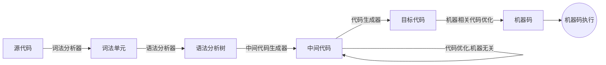

<!--more-->

词法分析是编译的第一阶段，将构成源程序的字符流处理成词法单元组成的词符流。此外，它还会完成一些工作:

* 过滤掉源程序中的注释和空白。
* 将编译器生成的错误信息与源程序位置关联起来。

关于词法分析，有3个术语:

* 词法单元: 词法单元由一个词法单元名和一个可选属性组成。词法单元名是一个表示某种词法单元的抽象符号，例如一个特定的关键字，或者一个代表标识符的输入字符序列。
* 词素: 词素是源程序的一个字符序列，和某个词法单元的模式匹配。
* 模式: 模式描述了一个词法单元的词素可能具有的形式。当词法单元是是一个关键字时，它的模式就是组成这个关键字的字符序列，对于标识符和其它词法单元，模式是一个更复杂的结构。

> 词法分析做的事就是：通过模式识别匹配词素，从而生成词法单元

下面是一些常见例子:

|词法单元|非正式描述|词素示例|
|:---|:---|:----|
|if|字符i,f|if|
|comparison|<或>或<=或>=或==或!=|<=,!=|
|id|字母开头的字母或数字串|pi,score,a1|
|number|任何数字常量|0,2.435|
|literal|在两个`"`之间，除`"`以外的任何字符|"String"|

如果有多个词素可以和一个模式匹配，那么词法分析器必须提供额外信息用于后续阶段的区分。例如，0和1都可以匹配数字常量。因此，对于某些词法单元，词法分析器还会返回其属性。例如:

```bnf
## 对于表达式 a=b*2 ,下面的 id 和 number 均带有其属性值
<id,a>
<assign_op>
<id,b>
<mult_op>
<number,2>
```

词法分析仅是用于处理字符到词法单元的转换，本身很难发现源代码中的错误。例如:

```java
fi(a==f(x))...
```

在上面的代码片段中，在遇到 fi 时，无法指出 fi 究竟是关键字 if 的误写还是一个标识符 id，具体的错误会在稍后的语法分析中发现和处理。

假设出现所有词法单元的模式都无法和剩余输入的某个前缀相匹配，此时，词法分析器无法继续处理，在这种情况下，可以进行`错误恢复`。常见的恢复策略有:

* 从剩余输入中删除一个字符;
* 向剩余输入中插入一个遗漏字符;
* 用一个字符来替换另一个字符;
* 交换两个相邻字符;

显然词法分析的重点在于模式和词素的匹配，从而生成不同 Class 的词法单元。正则表达式是一种用来描述词素模式的重要表示方法。

关于这方面介绍几个术语的定义:

* 字母表是一个有限的符号集合。符号的典型例子包括字母，数位和标点符号。$\{0,1\}$ 是二进制字母表;ASCII是字母表的一个重要例子;同样 Unicode 也是字母表的一个重要例子。
* 字母表上的串是该字母表中符号的一个有穷序列。串 s 的长度通常记作 $\vert{s}\vert$，指串中符号的个数。空串使用 $\epsilon$ 表示。
* 语言是某个给定字母表上的任意可数个的串的集合。 $\varnothing$ 表示空集。

|运算|定义|
|:---|:---|
|语言L和语言M的连接| $LM=\{st\vert{s \in L \land t \in M}\}$|
|语言L和语言M的并|$L\cup{M}=\{s\vert{s\in L \lor s \in M}\}$|
|语言L的幂|$L^{i}$,一个原因 L连接 i 次后得到的集合,$L^{0}=\{\epsilon\}$|
|语言L的闭包|$L^{*}=\cup^{\infty}_{i=0}L^{i}$|
|语言L正闭包|$L^{+}=\cup^{\infty}_{i=1}L^{i}$|

下面使用上面的定义来描述某个字母表 $\Sigma$ 上的正则表达式。下面是两个基础的规则:

* 首先，$\epsilon$ 是一个正则表达式，$L(\epsilon)=\{\epsilon\}$,即该语言只包含空串。
* 如果 *a* 是 $\Sigma$ 上的一个符号，那么**a**是一个正则表达式，并且 $L(a)=\{a\}$ 。也就是说这个语言仅包含长度为1的符号串a。

下面是由小的正则表达式构造较大的正则表达式的步骤。假设 r 和 s 都是正则表达式，分别是 $L(r)$ 和 $L(s)$,那么:

* $(r)|(s)$ 是一个正则表达式，表示语言 $L(r) \cup L(s)$。
* $(r)(s)$ 是一个正则表达式, 表示语言 $L(r)L(s)$
* $(r)^{*}$ 是一个正则表达式，表示语言 $(L(r))^{*}$
* $(r)$ 是一个正则表达式，表示语言 $L(r)$。这是说明表达式两边加上括号不会影响表达式代表的语言。

按照上面的的规定，正则表达式常会包含一些不必要的括号，如果，我们设置好运算符优先级，那么就可以丢掉一些无用的括号。通常约定的优先级如下：

1. 一元算符 $*$ 拥有最高优先级,并且是左结合的。  
2. 连接有次高的优先级，也是左结合的。  
3. 并 $|$ 的优先级最低，也是左结合的。

显然，$(a)|((b)*(c))$ 可以被简化为 $a|b*c$。

根据上述描述，如果我们将表达同样语言的两个表达式称为等价，那么我们可以推导出下面的代数规则:

|定律|描述|
|:---|:---|
|$r{\vert}s = s{\vert}sr$| $\vert$ 满足交换律|
|$r{\vert}(s{\vert}t) = (r{\vert}s){\vert}t$| $\vert$ 满足结合律|
|$r(st) = (rs)t$|连接满足结合律|
|$r(s{\vert}t)=rs{\vert}rt$|连接对 $\vert$ 是可分配|
|${\epsilon}r=r{\epsilon}=r$| $\epsilon$ 是连接的单位元|
|$r^{*}=(r\vert{\epsilon})^{*}$|闭包中一定包含 $\epsilon$ |
|$r^{*^{*}}=r^{*}$| $r^{*}$ 具有幂等性|

如果 $\Sigma$ 是基本符号的集合，那么一个正则定义是具有如下形式的定义序列:

$$
d_{1}{\to}r_{1}
$$
$$
d_{2}{\to}r_{2}
$$
$$
\downarrow
$$
$$
d_{n}{\to}r_{n}
$$

* 每个 $d_i$ 都是一个新符号，它们都不在 $\Sigma$ 中，并且各不相同
* 每个 $r_i$ 都是字母表 $\Sigma$ 和 $\{d_1,d_2,d_3...d_i-1\}$ 上的正则表达式。如果把 $d_i$ 换成对应的全由 $r_?$ 组成的 $r_i$,这样 $r_i$ 可以被构造出只含有 $\Sigma$ 中符号的正则表达式。

例如:

$$
{letter\_}{\to}A{\vert}B{\vert}{...}{\vert}Z{\vert}a{\vert}b{\vert}{...}{\vert}z{\vert}\_
$$

$$
digit{\to} 0{\vert}1{\vert}{...}{\vert}9
$$

$$
id {\to} letter\_(letter\_|digit)^{*}
$$

下面我们来看看如何使用正则表达式表示的模式，来实现对词法单元的识别。

## 状态转换图

词法分析的开始，我们需要把模式转换成状态转换图。状态转换图有一组被称为状态的结点。每个状态代表一个可能和模式匹配的词素。状态图中的边从图的一个状态指向另一个状态。每条边的标号包含了一个或多个符号。

如果我们处于某个状态 s，并且下一个输入符号是 a，那么我们就会寻找一条从 s 离开且标号为 a 的边(该边的标号中可能还包括其它符号)。如果找到这样的边，那么就进入该边所指的状态s1。如果找不到对应的边就回退，或终止。

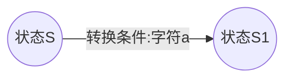

基于状态转换图，我们可以根据状态机模式来手写出词法分析的解析代码。

## 有穷自动机

上面已经介绍过状态转换图的方式来解析词法单元，下面介绍下，有穷自动机，可以更通用的处理词法分析。有穷自动机本质上是和状态转换图类似的图，但是有下面几点不同:

1. 有穷自动机是识别器,它们只会对每个输入串，简单回答"是"或"否"。
2. 有穷自动机分为两类:
    * 确定的有穷自动机(DFA),对于每个状态及自动机输入字母表的每个符号，有且只有一条离开该状态、以该符号为标号的边。
    * 不确定的有穷自动机(NFA),对其边上的标号没有限制。一个符号可以标记离开同一状态的多个边，这些边的离开条件相同。并且 ${\epsilon}$ 串也可以作为标号。

### NFA

一个不确定的有穷自动机(NFA)由下面几个部分组成:

* 一个有穷的状态集 $s$。
* 一个输入符号集合 $\Sigma$ ,即输入字母表,我们假设代表空串的 ${\epsilon}$ 不是 $\Sigma$ 中的函数。
* 一个转换函数，它为每个状态和 ${\Sigma} {\cup} \{\epsilon\}$ 中的每个符号都给出了转移的后继状态的集合。
* $s$ 中的一个状态 $s_{0}$ 被指定为开始状态,或者说是初始状态。
* $s$ 的一个子集F 被指定为接受状态(结束状态)的集合。

我们可以把NFA表示成一张转换图,图中的节点是状态，带标号的边表示自动机的转换函数。这个图和状态转换图很相似,但是:

1. 同一个符号可以标记从同一状态出发，到达多个目标状态的多条边。
2. 一条边的标号不仅可以是输入字母表的符号，也可以是空串 ${\epsilon}$。

下面是 $(a|b)^{*}ab$ 的NFA(3是结束状态):

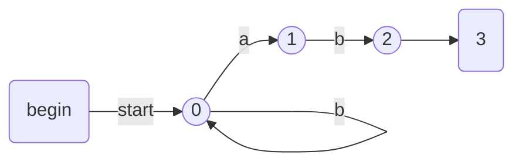

上图NFA的转换表:

|状态|输入a|输入b|
|:---|:---|:---|
|0|{0,1}|{0}|
|1|$\varnothing$|{2}|
|2|$\varnothing$|$\varnothing$|

> $\varnothing$ : 空集

> 观察从状态0到状态1的变化，在输入符号a时，可以看到a对应的跳转状态集合是 {0,1}，这是一个多状态的结果，所以称为不确定状态机。

### DFA

确定有穷自动机(DFA)是不确定有穷自动机的一个特例。在 DFA中:

* 没有输入 ${\epsilon}$ 的转换函数
* 对每个状态s和每个输入符号a,有且只有一条标号为 a 的边离开。

下面是识别 $(a|b)^{*}ab$ 的DFA:

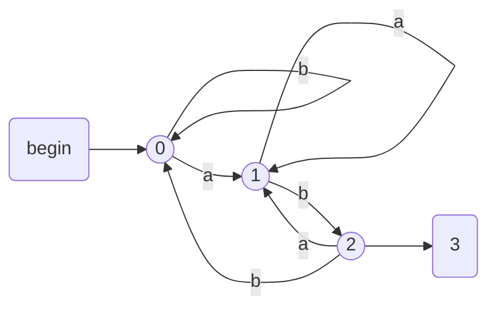

### 正则表达式构建 NFA

Thompson构造法是一个能将正则表达式转化为一个与之等价的非确定有限状态自动机（NFA）的算法。算法通过递归地将一个正则表达式划分成构成它的子表达式，在得到每个子表达式对应的NFA之后，根据子表达式之间的运算关系和一系列规则构造表达式自身对应的NFA。

对于表达式 $\epsilon$ ,直接转换成下面的图:


字母表中的子表达式a直接转化为：

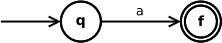

下面针对正则表达式的三种运算——并、连接和闭包给出NFA的构造规则。设子表达式为s和t，则它们对应的NFA分别记作 $N(s)$ 和 $N(t)$。

两个正则表达式的并 $s|t$ 可以转化为:


通过ε转移， 状态q 可以直接到达 $N(s)$ 或 $N(t)$ 的初态。而 $N(s)$ 或 $N(t)$ 原来的终态也可以通过 $\epsilon$ 转移直接到达整个NFA的新终态。

连接表达式st可以转化为：


 $N(s)$ 的初态成为新的NFA的初态。 原来 $N(s)$ 的终态成为 $N(t)$ 的初态。而原来 $N(t)$ 的终态成为新的NFA的终态。

闭包 $s^{*}$ 可以转化为：


将新表达式的初态和终态以及夹在中间的子表达式的NFA $N(s)$ 连接起来的 $\epsilon$ 转移使得可以选择经过或者不经过子表达式。而从 $N(s)$ 的终态到初态的ε转移使得s可以重复任意多次。

> 加括号的表达式 (s) 直接转化为 $N(s)$自身即可。

### NFA到DFA的变换-子集构造法

DFA 的书写比 NFA 要复杂很多，我们通常可以基于 NFA 来生成 DFA。

子集构造法的基本思想是让构造的DFA的一个状态对应NFA的一个状态集合。DFA 在输入a1,a2,...an后能到达的状态对应于NFA从开始状态出发沿着a1,a2,...an为标号的路径能到达的状态的集合。

预先定义几个概念:

* $\epsilon - closure (s)$ : 从 NFA 状态 s 出发，只通过 $\epsilon$ 能到达的状态集合。
* $\epsilon -closure(T)$ : 从状态集合T中的一个状态出发，只通过$\epsilon$ 能到达的状态集合。
* $move (T,a)$ :  从状态集合T中的一个状态出发，只通过标号 a 的转换能到达的状态集合。

一开始DFA States 里只有一个状态:$\epsilon-closure(0)$,且未标记;

当DFA States 中有未标记状态T时:

1. 给T 加上标记
2. 对于每个输入符号 $a_{i}$:
    1. U = $\epsilon-closure(move(T,a))$。
    2. 若 U 不在 DFA states 中，将其加入，且不加标记
    3. 构建转换函数 DFA $transform(T,a_{i}) = U$

我们以上面的 $(a|b)^{*}abb$ 为例，来描述下这一过程;

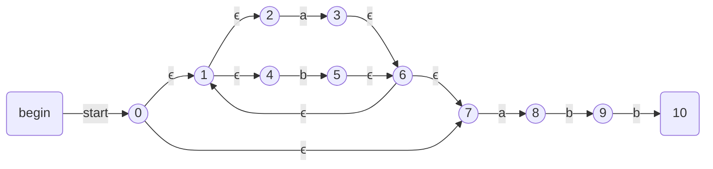

NFA的输入字母表是 {a,b}。等效DFA 的开始状态是 $\epsilon-closure(0)$,即{0,1,2,4,7}，即从 NFA 状态 0 出发，只通过 $\epsilon$ 能到达的状态集合。

1. 我们先标记A, 并 根据字母表计算转换函数 $tranform(A,a)$和 $tranform(A,b)$
2. 在 A 集合中只有状态2和状态7 有 a 上的转换，对应 $\text{move}(A,a) = \{3,8\}$ ,再计算 $\epsilon$ 的可达，最终有 $\text{transform}(A,a) = \{1,2,3,4,6,7,8\}$,我们称为 B 集合。
3. 同样可以计算得到 $\text{transform}(A,b)= \{1,2,4,5,6,7\}$,称此状态为 C 集合。
4. 继续对 B，C 进行 ... ...
5. 直到不会出现新的未标记状态

|NFA 状态|DFA 状态|a|b|
|:---|:---|:---|:---|
|{0,1,2,4,7}|A|B|C|
|{1,2,3,4,6,7,8}|B|B|D|
|{1,2,4,5,6,7}|C|B|C|
|{1,2,4,5,6,7,9}|D|B|E|
|{1,2,4,5,6,7,9,10}|E|B|C|

DFA的接受状态是所有至少包含了NFA的一个接受状态的状态集合

> 包含开始状态0的 SA 是 DFA 的开始状态，包含结束状态10的 SE 是 DFA 的结束状态

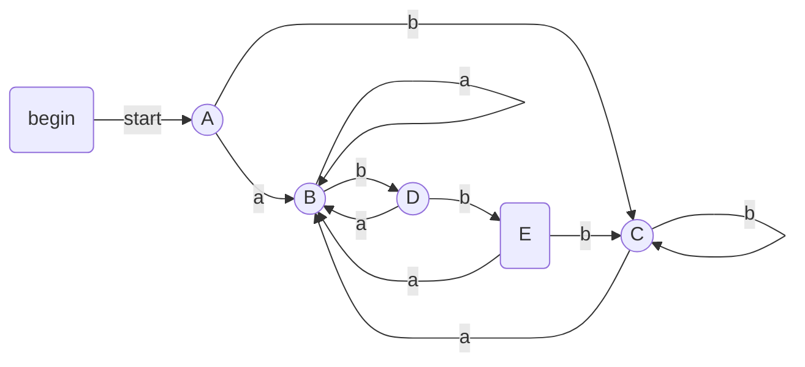
### DFA 化简

DFA状态最小化算法的工作原理是将一个DFA的状态集合分划成多个组，每个组中的各个状态之间相互不可区分。然后，将每个组中的状态合并成状态最少DFA的一个状态。

假设有一个DFA D，其状态集合为S，输入字母表为 $\Sigma$ ，开始状态为 $s_0$，接受状态集为F。

- 首先构造包含两个组 $F$ 和 $S-F$ 的初始划分 $\Pi$ ，这两个组分别是D的接受状态组和非接受状态组。
- 令 $\Pi_{new} = \Pi$ ，对 $\Pi$ 中的每个组 $G$
    - 将 $G$ 划分为更小的组，使得两个状态 $s_i$ 和 $s_j$ 在同一个小组中，当且仅当对于所有的输入符号a，状态 $s_i$ 和 $s_j$ 在a上转换都到达 $\Pi$ 中的同一组 （在最坏的情况下，每个状态自成一组）。
    - 在 $\Pi_{new}$ 中将 $G$ 替换为其划分的小组
- 如果 $\Pi_{new} = \Pi$ ，令 $\Pi_{final} = \Pi$ 并接着执行步骤4；否则，用 $\Pi_{new}$ 替换 $\Pi$ 并重复步骤2。
- 在分划 $\Pi_{final}$ 的每个组中选取一个状态作为该组的代表(删去同组中的其他等价状态。将指向这些状态的箭头改为指向状态代表)。这些代表构成了状态最少DFA D'的状态。
- 删去无关状态，从其它状态到无关状态的转换都成为无定义。无关状态定义如下:
    - 多于状态：对于一个状态 $S_i$ ，若从开始状态出发，不可能到达改状态 $S_i$ ，则 $S_i$ 为多余（无用）状态。
    - 死状态：对于一个状态 $S_i$ ，对于任意输入符号a，若转到它本身后，不可能从它到达终止状态，则称 $S_i$ 为死状态。

D' 的其他部分按如下步骤构建：
- D' 的开始状态是包含了D的开始状态的组的代表。
- D' 的接受状态是那些包含了D的接受状态的组的代表。请注意，每个组中要么只包含接受状态，要么只包含非接受状态，因为我们一开始就将这两类状态分开了，且总是通过分解已经构造得到的组来得到新的组。

我们以上面从NFA生成的DFA为例:


|DFA 状态|a|b|
|:---|:---|:---|
|A|B|C|
|B|B|D|
|C|B|C|
|D|B|E|
|E|B|C|

> 开始状态是A，结束状态是E

- 将DFA的状态集合划分为终态集 $\lbrace E \rbrace$ 和非终态集 $\lbrace A,B,C,D \rbrace$ 。
- 执行拆分(第一轮):
    - 因为终态集 $\lbrace E \rbrace$ 只包含一个状态，不能再被分割，所以 $\lbrace E \rbrace$ 保留在 $\Pi_{new}$ 中。
    - 对于非终态集 $\lbrace A,B,C,D \rbrace$ :
        - 首先考虑输入字符a，$\lbrace A,B,C,D \rbrace \xrightarrow{a} \lbrace B \rbrace$。这些状态中的每一个都转到B，因此使用以a开头的串无法区分这些状态。
        - 对于输入b，有 $\lbrace A,B,C\rbrace \xrightarrow{b} \lbrace C,D\rbrace,\lbrace D\rbrace \xrightarrow{a} \lbrace E\rbrace$ 。状态A、B和C都转换到组 $\lbrace A,B,C,D \rbrace$ 的某个成员上，而D转到另一个组中的成员E上。
    - 因此组 $\lbrace A,B,C,D \rbrace$ 被分割为 $\lbrace A,B,C \rbrace$ 和 $\lbrace D \rbrace$ 。这一轮得到的 $\Pi_{new}$ 是 $\lbrace A,B,C\rbrace ,\lbrace D \rbrace,\lbrace E \rbrace$。
- 执行拆分(第二轮):
    - 可以把 $\lbrace A,B,C\rbrace$ 分割为 $\lbrace A,C\rbrace ,\lbrace B \rbrace$ ，因为A和C在输入b上都到达 $\lbrace A,B,C\rbrace$ 中的元素，但B却转到另一个组中的元素D上。
    - 在第二轮之后，$\Pi_{new}=\lbrace A,C\rbrace ,\lbrace B \rbrace,\lbrace D \rbrace,\lbrace E \rbrace$
- 在第三轮中，我们不能够再分割当前分划中唯一一个包含多个状态的组$\lbrace A,C\rbrace$，因为A和C在所有输入上都进入同一个状态（因此也就在同一组中）。因此我们有 $\Pi_{final}=\lbrace A,C\rbrace ,\lbrace B \rbrace,\lbrace D \rbrace,\lbrace E \rbrace$。

现在我们将构建出状态最小DFA。它有4个状态，对应于 $\Pi_{final}$ 中的四个组。我们分别挑选A、B、D和E作为这四个组的代表。其中，状态A是开始状态，状态E是唯一的接受状态。

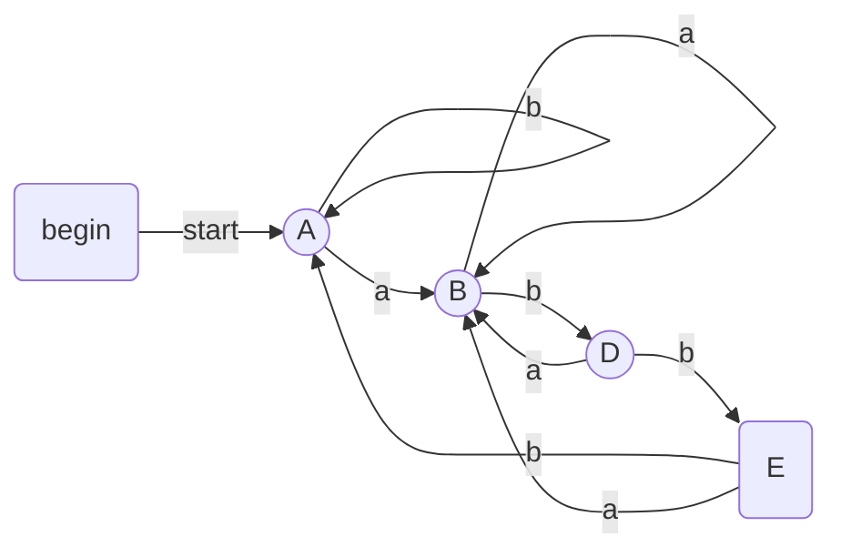

|DFA 状态|a|b|
|:---|:---|:---|
|A|B|A|
|B|B|D|
|D|B|E|
|E|B|A|

> 最小化算法有时会产生带有一个死状态的DFA。所谓死状态就是在所有输入符号上都转向自己的非接受状态。从技术上来讲，这个状态是必须的，因为在一个DFA中，从每个状态出发在每个输入符号上都必须有一个转换。我们需要知道在什么时候已经不存在被这个DFA接受的可能性了，这样我们才能知道已经识别到了正确的词素。因此，我们希望消除死状态，并使用一个缺少某些转换的自动机。这个自动机的状态比状态最少DFA的状态少一个，但是因为缺少了一些到达死状态的转换，所以严格地讲它并不是一个DFA。

死状态其实是指某个状态在对应输入字符，没有对应调整状态时的默认调整，可以理解为跳转到空集。


### 正则表达式直接构造DFA

要从一个正则表达式直接构造出DFA，我们要首先构造它的抽象语法树，然后计算如下四个函数：nullable、firstpos、lastpos和followpos。

- nullable（n）对于一个抽象语法树结点n为真当且仅当此结点代表的子表达式的语言中包含空串 $\epsilon$ 。也就是说，这个子表达式可以"生成空串"或者本身就是空串。
    - 当结点n是叶子结点并且取值为空，此时以n为根结点推导出的子表达式肯定为空，所以此时nullable(n)为true。
    - 结点n是叶子结点并且取值为id，此时以n推导出的句子有非空值id，所以此时nullable(n)为false。
    - 当结点n是or结点，此时n结点肯定为内部结点。由于是或运算，当结点n的左子树(c1)或者右子树(c2)能推导出空串时，结点n也能推导出空串。即nullable(n)=nullable(c1) or nullable(c2)。
    - 当结点n是cat结点，此时n结点肯定为内部结点。由于是连接运算，当结点n的左子树（c1）和右子树（c2）能同时推导出空串，则结点n能推导出空串，即nullable(n)=nullable(c1) and nullable(c2)。
    - 当结点n是star结点，此时n结点肯定为内部结点，由闭包运算的定义可知结点n推导出的子集合包括空串，因此nullable(n)=true。
- firstpos（n）定义了以结点n为根的子树中的位置集合。这些位置对应于以n为根的子表达式的语言中某个串的第一个符号。
    - 当结点n为叶子结点并且为空串，因为是空串，所以此时没有第一个符号，即firstpos(n)= $\varnothing$ 。
    - 当结点n为位置i的叶子结点。此时结点n只能推导出位置i的终结符，因此firstpos(n)={i}
    - 当结点n为or结点（内部结点），此时进行or运算，左子树(c1)推导出的第一个位置的集合firstpos(c1)包含于firstpos(n)，同样右子树(c1)推导出的第一个位置的集合firstpos(c2)包含于firstpos(n)。因此firstpos(n)等于左右子树firstpos的并集。
    - 当结点n为cat结点（内部结点），此时进行连接运算，若左子树不能推导出空串，那么结点n推导出的某个子表达式的第一个符号一定在firstpos(n)中。若左子树能推导出空串，那么第一个符号就有可能出现在右子树推导出的子表达式中。
    - 当结点n为star结点（内部结点），结点n只有一个棵子树(c1)，无论结点n的能不能推导出空串，firstpos(n)=firstpos(c1)。


- lastpos（n）定义了以结点n为根的子树中的位置集合。这些位置对应于以n为根的子表达式的语言中某个串的最后一个符号。计算lastpos的规则在本质上和计算firstpos的规则相同，但是在针对cat结点的规则中，子结点c1和c2的角色需要对调。

正则表达式转化为DFA，DFA有多个状态（对应本文的位置），而在一个状态n上，followpos(n)能告诉我们在当前状态下，能到达的下一个状态的集合。由此，只要知道起始的状态集合，我们就可以通过计算followpos构造出正则表达式的DFA了。

> 只有结点n为cat结点或者star结点会使得一个正则表达式的某个位置会跟在另外一个位置之后。or结点最终只会选择其中一棵子树来推导句子，所以两子树位置之间不存在依赖关系。

- 当n是一个cat结点，且其左右子树分别为c1、c2，那么对于lastpos(c1)中的所有位置i，firstpos(c2)中的所有位置都在followpos(i)中。
- 当n是一个star结点，且i是lastpos(n)中的一个位置，那么firstpos(n)中的所有位置都在followpos(i)中。

下面来举个例子，对于表达式 $(a|b)^*a$ 。

```
              ┌─────┐
              │ cat │
              └┬───┬┘
               │   │
        ┌──────┤   ├────┐
        │ star │   │a 3 │
        └┬─────┘   └────┘
         │
   ┌─────┴┐
   │  or  │
   └┬────┬┘
    │    │
┌───┤    ├───┐
│a 1│    │b 2│
└───┘    └───┘
```

-  对于cat节点n。
    - $nullable(n)= false$，因为这个结点生成所有以a结尾的由a、b组成的串；它不生成空串。
    - $firstpos(n)=\lbrace 1,2,3 \rbrace$。在由n对应的正则表达式生成的像aa这样的串中，该串的第一个位置对应于树中的位置1；在像ba这样的串中，串的第一个位置来自于树中的位置2。然而，当由n代表的正则表达式生成的串仅包含a时，这个a来自于位置3。
    - $lastpos(n)=\lbrace 3 \rbrace$ 。也就是说，不管结点n的表达式生成什么串，该串的最后一个位置总是来自位置3上的a。
    - $followpos(1)=\lbrace 1,2,3 \rbrace$ 。考虑一个串…ac…，其中c代表`a或b`，且a来自位置1。也就是说，这个a是由表达式`(a|b)*`中的a生成的多个a之一。这个a后面可以跟随由同一表达式`(a|b)*`生成的a或b，此时c来自位置1或位置2，也有可能这个a是表达式（a|b）*生成的串的最后一个字符，那么c一定是来自位置3的a。因此，1、2、3就是可以跟在位置1后的位置。

对于正则表达式 $(a|b)^*abb\#$ ,我们可以计算出其所有节点的firstpos和lastpos。

> 在一个正则表达式r的右端连接一个独特的右端结束标记符#，使得r的接受状态增加一个在#上的转换，使之成为(r)#的NFA的重要状态。换句话说，通过使用扩展的正则表达式(r)#，我们可以在构造过程中不考虑接受状态的问题。当构造过程结束后，任何在#上有离开转换的状态必然是一个接受状态。

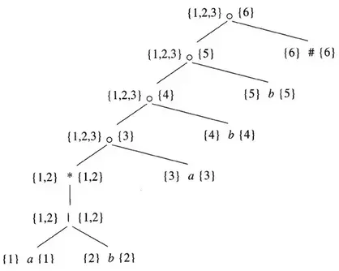

其followpos如下:

|位置n|followpos(n)|
|:---|:---|
|1|$\lbrace 1,2,3 \rbrace$|
|2|$\lbrace 1,2,3 \rbrace$|
|3|$\lbrace 4 \rbrace$|
|4|$\lbrace 5 \rbrace$|
|5|$\lbrace 6 \rbrace$|
|6|$\varnothing$|

根据上面的followpos表可以绘制有向图:

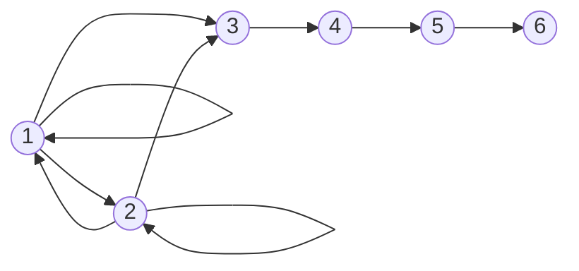

表示followpos函数的有向图几乎就是相应的正则表达式的不包含 $\epsilon$ 转换的NFA。

如果我们进行下面的处理，这个图就变成了这样的一个NFA。

- 将根结点的firstpos中的所有位置设为开始状态。
- 在每条从i到j的有向边上添加位置i上的符号作为标号。
- 把和结尾#相关的位置当作唯一的接受状态。

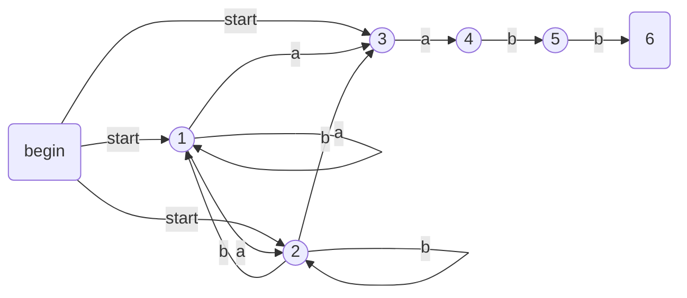

DFA构造:

- 初始化D(状态集,D的状态就是语法树中的位置集合。), 只包含未标记的状态 $firstpos(n_0)$ ,其中 $n_0$ 是 (r)# 正则表达式的根节点。
- 当Dstates中存在未标记状态S时:
    - 标记S
    - 对于每个输入符号a:
        - 令 U 为 S中和a对应的所有位置p的followpos(p)的并集
        - 如果 U 不在Dstates中，将U作为未标记的状态加入Dstates中。
        - Dran[S,a] = U; (Dran是状态转换函数)

对于正则表达式 `(a|b)*abb`,语法树的根结点的firstpos的值是 $\lbrace 1,2,3 \rbrace$，因此D的开始状态就是这个集合。我们称这个集合为A。我们必须计算 $Dtran[A,a]$ 和 $Dtran[A,b]$。在A的位置中，1和3对应于a，而2对应于b。因此
$$
Dtran[A,a]=followpos(1) \cup followpos(3)= \lbrace 1,2,3,4 \rbrace
$$ 
$$
Dtran[A,b]= followpos(2)= \lbrace 1,2,3 \rbrace 
$$

后一个集合就是A，因此不需要加入到Dstates中。但是前一个状态集 $B=\lbrace 1,2,3,4 \rbrace$ 是新状态，因此我们将它加入到Dtrans中并计算它的转换。

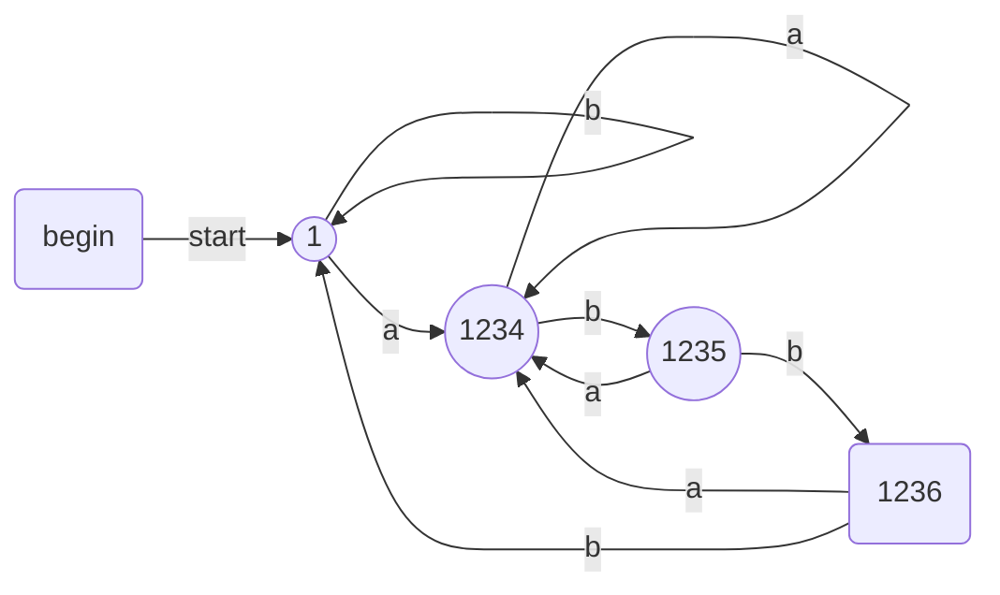

## NFA模拟执行

$s_0$ 为开始状态, 接受状态集为 F，转换函数为move。我们可以通过下面的算法模拟NFA的执行。


优化算法:

- 两个堆栈，其中每一个堆栈都存放了一个NFA状态集合。其中的一个堆栈oldStates存放“当前状态集合”，即图中第4行中右边的S的值。另一个堆栈newStates存放了`下一个`状态集合，即第4行中左边的S的值。在我们运行第3行到第6行的循环时，中间的一个步骤没有在图中列出，即把newStates的值转移到oldStates中去的步骤。
- 一个以NFA状态为下标的布尔数组alreadyOn。它指示出哪个状态已经在newStates中。虽然这个数组存放的信息和栈中存放的信息相同，但查询`alreadyOn[s]`要比在栈newStates中查询s快很多。我们同时保持两种表示方法的原因就是为了获得这个效率。
- 一个二维数组`move[s，a]`，它保存这个NFA的转换表。这个表中的条目是状态的集合，它们用链表表示。

为了实现图中第一行，我们需要将alreadyOn数组中的所有条目都设置为FALSE，然后对于S中的每个状态s，将s压入oldStates并设置`alreadyOn[s]` 为TRUE。对状态s的操作以及图中第4行中的操作，都可以使用函数`addState(s)`来实现。


> 为了避免重复工作，我们必须小心，不要对一个已经在栈newStates中的状态调用addState。

通过查看oldStates中的每个状态s来更新oldStates。我们首先找出状态集合`move[s，c]`，其中c是下一个输入字符。对于那些不在newStates栈中的状态，我们应用函数addState。


假定一个NFA N 有n个状态和m个转换，即m是离开各个状态的转换数的总和。如果不包括第19行中对addState的调用，在第16行到第21行的循环上花费的时间是O(N)。也就是说，我们最多需要运行这个循环n遍，且如果不考虑调用addState所花费的时间，每一遍的工作量都是常数。对于第22行到第26行的循环，这个结论也成立。

更新oldStates的逻辑对于任意给定的状态最多只能调用addState一次。原因在于每次调用addState时都会把`alreadyOn[s]`置为TRUE。一旦`alreadyOn[s]`设为TRUE，后续不会在调用addState。

上述的状态集跳转方式模拟只能处理简单NFA，如果涉及到look-ahead(正则中也称为断言)需要通过回溯的方式来模拟执行。

## DFA 模拟执行

最简单和最快捷的表示一个DFA的转换函数的方法是使用一个以状态和字符为下标的二维表。给定一个状态和下一个输入字符，我们访问这个数组就可以找出下一个状态以及我们必须执行的特殊动作，比如将一个词法单元返回给语法分析器。由于词法分析器的DFA中通常包含数百个状态，并且涉及ASCII字母表中的128个输入字符，因此这个数组需要的空间少于一兆字节。

但是，在一些小型的设备中也可能使用编译器。对于这些设备来说，即使一兆内存也显得太大了。对于这种情况，可以应用很多方法来压缩转换表。比如，我们可以用一个转换链表来表示每个状态，这个转换链表由字符-状态对组成。我们在链表的最后存放一个默认状态(死状态)：对于没有出现在这个链表中的字符，我们总是选择这个状态作为目标状态。

DFA的模拟执行较为简单，实质上是单状态调整。

## 词法分析器

词法规则记录着 Token=> Regex。我们可以将所有的Regex先转换为NFA，然后创建一个公共的NFA起点，将所有Regex-NFA通过Or方式拼接为一个大的NFA。同时记录下每个Regex-NFA的Token和其接受状态。当字符匹配上NFA时，我们可以通过最后一个节点判断字符所命中的Token规则。如果命中多个Token规则，选取状态ID最小的token规则(状态越小说明，规则越靠前)。在NFA转DFA后，也会出现命中多个Token规则的情况，依然是选取状态ID最小的token规则。

## 参考

- [1] 编译原理-龙书
- [2] [汤普森构造法](https://en.wikipedia.org/wiki/Thompson%27s_construction)

