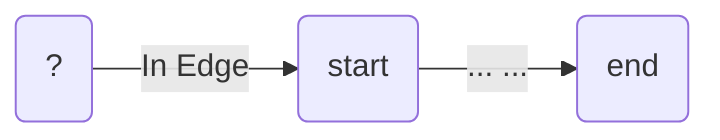
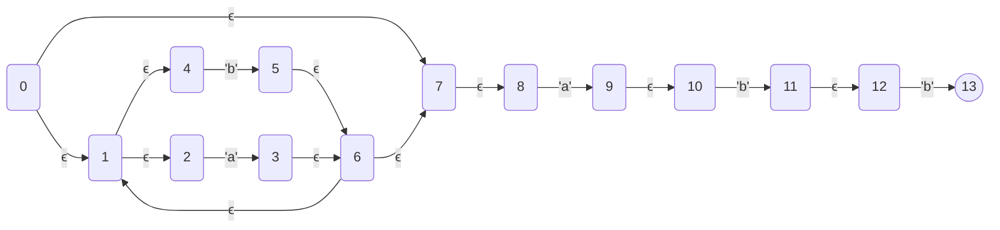
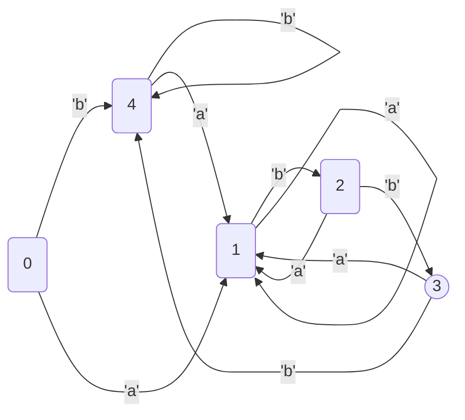
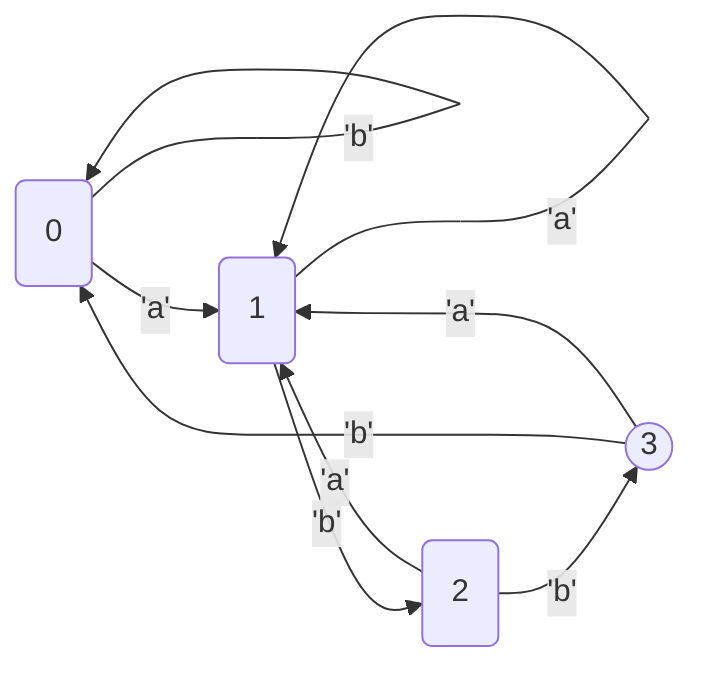

# 自制正则表达式引擎

在前面的[编译原理-词法分析](/posts/2021/11/118b8ca3/)一文中，我们介绍了基于正则表达式方式构建NFA和DFA进行词法分析的方案。本文将基于该方案，扩展一些功能，实现一个正则表达式执行引擎[JRegex - alpha版本](https://github.com/chutian0610/JRegex/tree/toy)。

<!--more-->

## 语法解析

正则表达式的语法如下:

```bnf
<regex>         := <unionexp>
<unionexp>      := <concatexp> '|'  <unionexp>
                 | <concatexp>                 
<concatexp>     := <repeatexp>  <concatexp>
                 | <repeatexp>
<concatexp>     := <repeatexp> ('*' | '+' |'?')
                 | <repeatexp> '{'  <number> '}'
                 | <repeatexp> '{'  <number> ',' '}'
                 | <repeatexp> '{'  <number> ','  <number> '}'
                 | <charclassesexp>
<charclassesexp>:= '['  <charclasses> ']'
                 | '[' '^'  <charclasses> ']'
                 | <atomexp>
<charclasses>   := <charclass>  <charclasses>
                 | <charclass>
<charclass>     := <charexp> '-'  <charexp>
                 | <charexp>
<atomexp>       := <charexp>
                 | '('  <unionexp> ')'
<charexp>       :=  <Meta character>
                 |  <Unicode character>
                 | '\'  <Unicode character>
```

通过手写递归下降的[RegexParser](https://github.com/chutian0610/JRegex/blob/toy/src/main/java/info/victorchu/jregex/ast/RegexParser.java)可以将字符串转为对应的语法树结构, 例如:

```java
RegexExp regexExp=RegexParser.parse("(a|b)*abb");
log.info(RegexExpTreeFormatter.format(regexExp));
```
得到的语法树如下:

```text
[Concat]
├──[Repeat:*]
│  └──[Or]
│     ├──[Char:a]
│     └──[Char:b]
└──[Concat]
   ├──[Char:a]
   └──[Concat]
      ├──[Char:b]
      └──[Char:b]
```
### 语法节点

RegexExp是所有语法节点的父类。

```java
public abstract class RegexExp
{

    /**
     * 访问者模式, 子类实现具体的 accept 方法
     *
     * @param visitor 访问者
     * @return 返回 T
     */
    public abstract <T, C> T accept(RegexExpVisitor<T, C> visitor, C context);
}
```

语法树节点还支持访问者模式方式遍历:

```java
public interface RegexExpVisitor<T, C>
{
    // --------------- 基于 RegexNode 具体类型分发 ------------------------

    // 单个字符
    T visitChar(CharExp node, C context);
    T visitCharRange(CharRangeExp node, C context);
    T visitCharClass(CharClassExp node, C context);
    T visitConcat(ConcatExp node, C context);
    T visitOr(OrExp node, C context);
    T visitRepeat(RepeatExp node, C context);
    T visitMetaChar(MetaCharExp node, C context);

    // 泛型入口
    default T process(RegexExp node, C context)
    {
        return node.accept(this, context);
    }
}
```

## 自动机模型

Graph 描述了一个状态转移图，其中 getStart返回图的起点。

```java
public interface Graph
{
    State getStart();
}
```

State 表示状态，每个状态都有一个uniqueId。此外每个状态都有转移表。

```java
public interface State
{
  /**
  * 状态ID(Unique).
  *
  * @return
  */
  int getStateId();

 /**
  * 获取状态的转换
  *
  * @return
  */
  Set<Transition> getTransitions();

  /**
    * 状态是否是接受状态
    *
    * @return
    */
  boolean isAccept();

  /**
   * 是否确定性状态
   */
  boolean isDeterministic();
  ... ...
}
```

Transition表示状态转移，edge是转移的条件边，state是转移的结果。

```java
public class Transition
{
    private Transition(Edge edge, State state)
    {
        this.edge = edge;
        this.state = state;
    }

    private final Edge edge;
    private final State state;
}
```


### 汤普森构造NFA

在词法分析一文中，介绍了多种从正则表达式构建NFA的方法。本文使用NFAGraphBuilder(汤普森构造法)从语法树构建NFA Graph。NFAGraphBuilder是接口RegexExpVisitor的实现，每个RegexExp都会在遍历过程中生成一个对应的SubGraph。

```java
public class SubGraph
{
    private Edge inEdge;
    private State start;
    private State end;
}
```

SubGraph的结构如下(... ...代表若干个状态):



如果我们将所有的SubGraph首尾相连，得到的Graph就是NFA graph。例如,对于正则表达式`"(a|b)*abb"`，

```java
NFAGraph nfaGraph=NFAGraph.build(regexExp);
log.info(nfaGraph.toMermaidJsChart());
```
得到如下的NFA Graph(0是起点，13是接受节点)。


### NFA -> DFA

接下来是使用子集构造法，从NFA生成DFA:

```java
    /**
     * 子集构造法从NFA生成DFA.
     *
     * @return DFAGraph
     */
    public DFAGraph toDFA()
    {
        // 计算 ϵ−closure(0)
        Set<Integer> startSet = computeEpsilonClosure(this.start.getStateId());
        // 子集构造法
        State state = createDFAState(startSet);
        // 构建DFA Graph, stateManager是状态管理器
        return DFAGraph.of(state, stateManager, false);
    }
```

对于正则表达式`"(a|b)*abb"`, 可以得到DFA图。

```java
DFAGraph dfa=nfa.toDFA();
log.info(dfa.toMermaidJsChart());
```



NFA和DFA状态之间的映射关系如下:

```java
log.info(dfa.printStateMapping());
/**
<<<<<<<<<<<< NFA -> DFA >>>>>>>>>>>>>
s_0<==>(s_7,s_8,s_0,s_1,s_2,s_4)
s_4<==>(s_5,s_6,s_7,s_8,s_1,s_2,s_4)
s_1<==>(s_6,s_7,s_8,s_9,s_10,s_1,s_2,s_3,s_4)
s_2<==>(s_5,s_6,s_7,s_8,s_11,s_12,s_1,s_2,s_4)
s_3<==>(s_5,s_6,s_7,s_8,s_13,s_1,s_2,s_4)
*/
```

### DFA 化简

上面得到的DFA图还可以使用Hopcroft算法进一步化简:

```java
    /**
     * DFA 化简 (Hopcroft)算法
     *
     * @return
     */
    public DFAGraph simplify()
    {
        // DFA 状态和DFA状态所在集合
        Map<Integer, Set<Integer>> dfaStateSetIndexMap = new HashMap<>();
        // 将所有DFA 状态分为 终结状态集合和非终结状态集合
        Set<Set<Integer>> sets = initSplitedSet(start.getStateId(), dfaStateSetIndexMap);
        // 分割DFA状态集进行化简
        trySplitSet(sets, dfaStateSetIndexMap);
        Set<Integer> stateSet = searchDFAIndexMap(this.start.getStateId(), dfaStateSetIndexMap);
        State start = createMinimizationDFAState(stateSet, dfaStateSetIndexMap);
        return new DFAGraph(start, stateManager, true);
    }
```

对于正则表达式`"(a|b)*abb"`, 可以得到化简后的DFA图。

```java
DFAGraph minDfa=dfa.simplify();
log.info(minDfa.toMermaidJsChart());
```



最小DFA和DFA之间的状态映射:

```java
log.info(minDfa.printStateMapping());
/**
<<<<<<<<<<<< mini DFA -> DFA >>>>>>>>>>>>>
s_0<==>(s_0,s_4)
s_1<==>(s_1)
s_2<==>(s_2)
s_3<==>(s_3)
*/
```

## 模拟执行

DFA的模型执行比较简单,直接遍历graph, 判断是否能找到字符对应的transition即可:

```java
    public boolean matches(String str)
    {
        State state = dfaGraph.getStart();
        for (int i = 0, length = str.length(); i < length; i++) {
            char ch = str.charAt(i);
            Optional<State> to = state.getTransitionsOfInputEdge(Edge.character(ch)).stream().findFirst().map(Transition::getState);
            if (!to.isPresent()) {
                return false;
            }
            state = to.get();
        }
        return state.isAccept();
    }
```

NFA的模拟执行较为复杂，简单地，可以每次获取字符对应的状态转移集合，判断最终的结果是否接受状态。如果需要实现捕获组的功能，还需要通过栈的方式记录匹配历史。

```java
    public boolean matches(String str)
    {
      Set<Integer> set= nfaGraph.computeEpsilonClosure(nfaGraph.getStart().getStateId());
      for (int i = 0, length = str.length(); i < length; i++) {
          char ch = str.charAt(i);
          set = nfaGraph.findDFAMoveSet(set,Edge.character(ch));
      }
        return nfaGraph.isNFASetAccept(set);
    }
```

