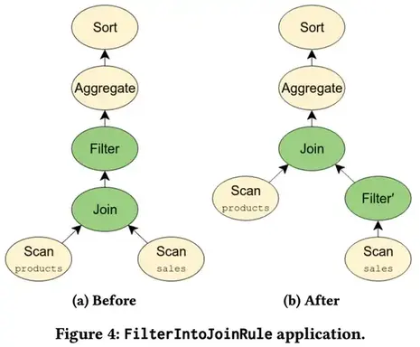

# Apache Calcite


本篇是论文[Apache Calcite: A Foundational Framework for Optimized
Query Processing Over Heterogeneous Data Sources](https://arxiv.org/pdf/1802.10233.pdf)的中文简单翻译
<!--more-->

## 摘要

Apache Calcite 是一个基础软件框架，可提供查询处理，优化和查询语言支持，目前已支持多种流行的开源数据处理系统，例如Apache Hive，Apache Storm，Apache Flink，Druid和MapD。Calcite 的体系结构包括具有数百种内置优化规则的模块化可扩展查询优化器，能够处理多种查询语言的查询处理器，为可扩展性设计的适配器体系结构以及对异构数据模型和存储（关系，半 结构化，流式传输和地理空间）。这种灵活，可嵌入和可扩展的架构使 Calcite 在大数据框架中采用更具有吸引力。这是一个活跃的项目，正持续引入对新型数据源，查询语言以及查询处理和优化方法的支持。

**CCS概念**:

信息系统 → DBMS引擎体系结构；

**关键词**: 

Apache Calcite, Relational Semantics, Data Management, Query
Algebra, Modular Query Optimization, Storage Adapters（Apache Calcite，关系语义学，数据管理，查询
代数，模块化查询优化，存储适配器）

## 介绍

继开创性的 System R之后，常规关系数据库引擎主导了数据处理领域。 然而，早在2005年，Stonebraker 和Çetintemel 预测我们会看到一系列专业引擎的兴起，例如列存储，流处理引擎、文本搜索引擎等。他们认为，专用引擎可以提供更具成本效益的性能，并且它们将终结“one size fits all”的范式。今天，他们的愿景似乎比以往任何时候都更加有意义。实际上，许多专门的开源数据系统已经开始流行。例如Storm和Flink（流处理），Elasticsearch（文本搜索）,Apache Spark,Druid等。

随着组织投资于针对其特定需求的数据处理系统时，出现了两个问题：

* 这种专用系统的开发人员遇到了相关问题，例如查询优化或需要支持查询语言（例如SQL）和相关扩展（例如流查询）以及受语言集成的查询的启发（LINQ）。 如果没有统一的架构，让多个工程师独立开发相似的优化逻辑和语言支持就导致了人工浪费。
* 一个组织可能同时使用 Elasticsearch，Apache Spark和Druid，当我们需要构建能够支持跨异构数据源的优化查询的系统时，就需要程序员将这些技术框架集成在一起。

开发Apache Calcite 就是为了解决这些问题。 它是一个完整的查询处理系统，可提供任何数据库管理系统所需的许多常用功能（查询执行，优化和查询语言），但数据存储和数据管理除外，这些功能留给了专业的技术引擎进行处理。Hive，Drill，Storm和许多其他数据处理引擎都采用了Calcite，从而为它们提供了高级查询优化和查询语言。例如，Hive是建立在Apache Hadoop之上的数据仓库项目。随着Hive从批处理转向交互式SQL查询平台，很明显，该项目的核心需要强大的优化器。因此，Hive选择了 Calcite 作为优化器，并且自那时以来，它们的集成度一直在增长。许多其他项目和产品也纷纷效仿，包括Flink，MapD等。

此外，Calcite可通过将公共接口公开给多个系统的方式实现跨平台优化。 为了提高效率，优化器需要进行全局推行，例如跨不同系统做出有关物化视图选择的决策。

建立一个共同的框架并非没有挑战。特别是，该框架需要具有足够的可扩展性和灵活性，以适应需要集成的不同类型的系统。

我们相信以下功能有助于Calcite在开源社区和行业中得到广泛采用：

* 开源友好：过去十年中，许多主要的数据处理平台都是开源的，或者主要基于开源。Calcite 是一个开放源代码框架，由Apache软件基金会（ASF）支持，它提供了协作开发项目的方法。此外，该软件是用Java编写的，因此可以轻松地与许多最新的数据处理系统互操作，这些系统通常是用Java（或基于JVM的Scala）编写的，尤其是Hadoop生态系统。
* 多种数据模型：Calcite使用流技术和常规数据处理范例为查询优化和查询语言提供支持。 Calcite将流视为按时间顺序排列的记录或事件集，这些记录或事件不会像传统数据处理系统中那样保留在磁盘上。
* 灵活的查询优化器：优化器的每个组件都是可插拔和可扩展的，范围从规则到成本模型。 此外，Calcite 还支持多个计划引擎，因此，各个阶段会选择最合适的优化引擎来处理当前阶段的工作。
* 跨系统支持：Calcite框架可以跨多个查询处理系统和数据库，运行和优化查询。
* 可靠性：Calcite 是可靠的，因为多年来的广泛采用已对该平台进行了详尽的测试.Calcite 还包含一个广泛的测试套件，可验证系统的所有组件，包括查询优化器规则以及与后端数据源的集成。
* 支持SQL及其扩展：许多系统不提供自己的查询语言，而是更喜欢依赖现有的查询语言，例如SQL。 为此，Calcite 提供了对ANSI标准SQL以及各种SQL方言的支持，例如，用于在流式处理或
嵌套数据。 另外，Calcite 包含符合标准Java API（JDBC）的驱动程序。

其余部分如下，

- 第2节讨论相关工作。
- 第3部分介绍了Calcite的体系结构及其主要组件。
- 第4节描述了核心的关系代数。
- 第5节介绍了 Calcite 的适配器，它是如何读取外部数据源。
- 第6节介绍了Calcite的优化器及其主要功能。
- 第7节则介绍了用于处理不同查询处理范例的扩展。
- 第8节概述了已经在使用Calcite的数据处理系统。
- 第9节讨论了该框架将来可能的扩展。
- 第10节总结内容。

## 相关工作

尽管 Calcite 是目前使用最广泛的优化器，Hadoop 生态系统中的大数据分析，许多想法显得不是那么的新颖。 例如，查询优化器将构建关于 Volcano和 Cascades框架的想法，结合其他广泛使用的优化技术，例如 物化视图重写。 还有其他系统试图扮演 Calcite 的类似角色。

Orca是用于数据管理产品（例如Greenplum和HAWQ）的模块化查询优化器。Orca通过实现一种用于在两者之间交换信息的框架（称为数据交换语言）来将优化器与查询执行引擎分离。 Orca还提供了用于验证所生成查询计划的正确性和性能的工具。 与Orca相比，Calcite 可以用作独立的查询执行引擎，该引擎联合多个存储和处理后端，包括可插拔计划程序和优化程序。

Spark SQL扩展了Apache Spark 以支持SQL查询执行，该查询还可以像 Calcite 中一样在多个数据源上执行查询。 但是，尽管Spark SQL中的 Catalyst 优化器也试图最小化查询执行成本，但它缺乏 Calcite 使用的动态编程方法，并且存在陷入局部最小值的风险。

Algebricks是一种查询编译器体系结构，为大数据查询处理提供了不可知的数据模型代数层和编译器框架。 高级语言被编译为Algebricks逻辑代数。然后，Algebricks生成针对Hyracks并行处理后端的优化作业。尽管Calcite与Algebricks共享一种模块化方法，但Calcite还包括对基于成本的优化的支持。在当前版本的Calcite中，查询优化器体系结构使用基于动态编程的计划，该计划基于Volcano，并具有与Orca中一样的多阶段优化扩展。尽管原则上Algebricks可以支持多个处理后端（例如Apache Tez，Spark），但多年来Calcite为各种后端提供了经过良好测试的支持。

Garlic是一个异构数据管理系统，在统一对象模型下表示来自多个系统的数据。但是，Garlic不支持跨不同系统的查询优化，而是依赖于每个系统来优化自己的查询。FORWARD是一种联合查询处理器，实现了称为SQL ++的SQL超集。 SQL ++具有将JSON和关系数据模型集成在一起的半结构化数据模型，而Calcite通过在查询计划期间将它们表示在关系数据模型中来支持半结构化数据模型。
FORWARD将用SQL ++编写的联合查询分解为子查询，并根据查询计划在基础数据库上执行这些查询。数据合并发生在FORWARD引擎内部。

另一个联邦数据存储和处理系统是BigDAWG，它抽象了各种各样的数据模型，包括关系，时间序列和流式传输。BigDAWG中的抽象单元称为信息孤岛。每个信息孤岛都有一种查询语言，数据模型，并连接到一个或多个存储系统。 在单个信息孤岛的范围内支持跨存储系统查询。 相反，Calcite 提供了统一的关系抽象，该抽象允许跨具有不同数据模型的后端进行查询。

Myria 是大数据分析的通用引擎，它对Python语言提供了高级支持。 它为其他后端引擎（例如Spark和PostgreSQL）生成查询计划。

## 架构

Calcite 包含许多组成典型数据库管理系统的部分。 但是，它省略了一些关键组件，例如，数据存储，处理数据的算法以及用于存储元数据的存储库。 这些遗漏是有意为之的：它使 Calcite 成为在具有一个或多个数据存储位置的应用程序之间以及使用多个数据处理引擎的应用程序之间进行调解的绝佳选择。 它也是构建定制数据处理系统的坚实基础。


图1概述了 Calcite 体系结构的主要组成部分。Calcite的优化程序使用关系运算符树作为其内部表示形式。优化引擎主要由三个组件组成：规则，元数据提供程序和计划程序引擎。我们将在第6节中更详细地讨论这些组件。在图中，虚线表示可能与框架进行的外部交互。 与 Calcite 互动的方式有很多。

首先，Calcite 包含一个查询解析器和验证器，可以将SQL查询转换为关系运算符树。 由于 Calcite 没有保留存储层，它提供了一种机制，可通过适配器在外部存储引擎中定义表模式和视图，因此可以在这些引擎之上使用它。其次，尽管 Calcite 为数据库语言支持的系统提供了优化SQL支持，但它也为已经具有自己的语言解析和解释的系统提供了优化支持：

某些系统支持SQL查询，但没有或仅有有限的查询优化。 例如，Hive和Spark最初都为SQL语言提供了支持，但是它们不包含优化器。 对于这种情况，查询经过优化后，Calcite 可以将关系表达式转换回SQL。 此功能使 Calcite 可以在具有SQL接口但没有优化程序的任何数据管理系统之上作为独立系统运行。
Calcite体系结构不仅针对优化SQL查询而定制。 数据处理系统通常选择使用自己的解析器作为自己的查询语言。 Calcite 也可以帮助优化这些查询。实际上，Calcite 还允许通过直接实例化关系运算符来轻松构造运算符树。 可以使用内置的关系表达式构建器接口。例如，假设我们要使用表达式构建器来表达以下Apache Pig脚本：

```pig
emp = LOAD 'employee_data ' AS ( deptno , sal );
emp_by_dept = GROUP emp by ( deptno );
emp_agg = FOREACH emp_by_dept GENERATE GROUP as deptno ,
COUNT ( emp . sal ) AS c , SUM ( emp . sal ) as s ;
dump emp_agg ;
```

等效表达式如下所示：

```java
final RelNode node = builder
  .scan (" employee_data ")
  .aggregate ( builder . groupKey (" deptno ") ,
builder.count (false , "c") ,
builder.sum (false , "s", builder . field ("sal" )))
  .build ();
```

该接口公开了构建关系表达式所需的主要构造。 优化阶段完成后，应用程序可以检索优化的关系表达式，然后可以将其映射回系统的查询处理单元。

## 查询代数

- 运算符：关系代数是方解石的核心。 除了表达最常见的数据操作（例如filter, project, join等）的运算符外，Calcite 还包含满足不同目的的其他运算符，例如，能够简洁地表示复杂的操作或更有效地识别优化机会。例如，对于OLAP，决策和流式应用程序来说，使用窗口定义来表达复杂的分析功能（例如某个时间段或数量或行的数量的移动平均值）已变得很普遍。 因此，Calcite 引入了一个窗口运算符，该运算符封装了窗口定义（即上限和下限，分区等）以及要在每个窗口上执行的聚合函数。

- 特质：Calcite 不使用不同的实体来表示逻辑和物理运算符。相反，它使用特征描述与操作符关联的物理属性。 这些特征有助于优化者评估不同替代方案的成本。更改特征值不会更改要评估的逻辑表达式，即，给定运算符产生的行仍将相同。在优化过程中，Calcite 尝试对关系表达式强制执行某些特征，例如，某些列的排序顺序。 关系运算符可以实现一个转换器接口，该接口指示如何将表达式的特征从一个值转换为另一个值。

Calcite 包括描述由关系表达式产生的数据的物理属性的常见特征，例如排序，分组和分区。类似于SCOPE优化器，Calcite 优化器可以对这些属性进行推理，并利用它们避免不必要的操作。 例如，如果排序运算符的输入已经正确排序，可能是因为这与后端系统中的行使用的顺序相同，那么可以删除排序操作。

除这些特性外，Calcite 的主要特征之一是 calling convention（调用约定特征）。本质上，此特征表示执行表达式的数据处理系统。将调用约定作为一个特性，使 Calcite 能够明确其优化透明查询的目标，这些查询的执行可能跨越不同的引擎，即，该约定将被视为物理属性。


例如，将MySQL中的 Products 表连接到Splunk中的 Orders 表（参见图2）。 最初，对 Orders 的扫描是在splunk约定中进行的，而对 Products 的扫描是在jdbc-mysql约定中进行的。
这些表必须在其各自的引擎内进行扫描。 该连接符合逻辑约定，这意味着尚未选择任何实现。 此外，图2中的SQL查询包含一个过滤器（where子句），该过滤器由适配器特定的规则压入splunk（请参阅第5节）。一种可能的实现方式是使用 Apache Spark 作为外部引擎：将 join 转换为 spark 约定，并且其输入是从 jdbc-mysql 和 splunk 到 spark 约定的转换器。但是有一个更有效的实现：利用Splunk可以通过ODBC执行对MySQL的查询，一个计划规则通过 splunk-to-spark 转换器下推Join，Join现在处于Splunk 约定中，在Splunk引擎中运行。

## 适配器

适配器是一种架构模式，定义了Calcite如何合并各种数据源以进行常规访问。 图3描绘了它的组件。 本质上，适配器由模型，模式和模式工厂组成。该 model 是正在访问的数据源的物理属性的规范。schema 是对 model 中数据的定义（格式和布局），数据本身可以通过表进行物理访问。 Calcite 与适配器中定义的表接口，以便在执行查询时读取数据。适配器可以定义添加到计划程序的一组规则。例如，它通常包含将各种类型的逻辑关系表达式转换为适配器约定的对应关系表达式的规则。模式工厂（schema factory）组件从模型获取元数据信息并生成模式。


如第4节中所述，Calcite 使用一种称为调用约定的物理特征来识别与特定数据库后端相对应的关系运算符。 这些物理操作为每个适配器中的基础表实现访问路径。当查询被解析并转换为关系代数表达式时，将为每个表创建一个运算符，表示对该表上数据的扫描。 它是适配器必须实现的最小接口。 如果适配器实现了表扫描运算符，则Calcite优化器将能够使用客户端运算符（例如排序 sorting，过滤filtering 和联接 joins）对这些表执行任意SQL查询。

该表扫描运算符包含适配器向适配器的后端数据库发出扫描所需的必要信息。 为了扩展适配器提供的功能，Calcite 定义了可枚举的调用约定。 具有可枚举调用约定的关系运算符仅通过迭代器接口对元组进行操作。 此调用约定使Calcite可以实现每个适配器的后端可能不可用的运算符。 例如，EnumerableJoin运算符通过从其子节点收集行并在所需属性上进行联接（join）来实现联接（join）。

对于仅涉及表中数据的一小部分的查询，Calcite 无法枚举所有元组。 幸运的是，可以使用相同的基于规则的优化器来实现特定于适配器的规则以进行优化。 例如，假设查询涉及对表进行过滤和排序。 可以在后端执行过滤的适配器可以实现与LogicalFilter匹配的规则，并将其转换为适配器的调用约定。 此规则将LogicalFilter转换为另一个Filter实例。 这个新的Filter节点具有较低的关联成本，这使得Calcite可以优化跨适配器的查询。

适配器的使用是一种强大的抽象，不仅可以优化针对特定后端的查询，而且还可以跨多个后端优化查询。 通过将所有可能的逻辑下推到每个后端，然后对结果数据执行联接和聚合，Calcite 能够处理涉及多个后端的表的查询。 实现适配器可以像提供表扫描操作符一样简单，也可以涉及许多高级优化的设计。 关系代数中表示的任何表达式都可以使用优化器规则下推到适配器。

## 查询处理和优化

查询优化器是框架中的主要组件。 Calcite 通过将计划程序规则重复应用于关系表达式来优化查询。 成本模型指导处理流程，而计划程序引擎尝试生成与原始语义相同但成本较低的替代表达式。优化器中的每个组件都是可扩展的。 用户可以添加关系运算符，规则，成本模型和统计信息。

计划器规则（Planner rules） Calcite 包括一组计划程序规则以转换表达式树。 特别是，规则匹配树中的给定模式，并执行保留该表达式语义的转换。 Calcite 包括数百个优化规则。 但是，依靠 Calcite 进行优化的数据处理系统通常会包含自己的规则以允许特定的重写，这是很常见的。

例如，Calcite 为Apache Cassandra [29]提供了一个适配器，这是一个宽列存储，它按表中列的子集对数据进行分区，然后在每个分区内，根据另一列子集对行进行排序。 如第5节所述，对于适配器来说，将尽可能多的查询处理下推到每个后端对提高效率是有益的。 将排序（Sort）下推到 Cassandra 的规则必须满足两个条件：

- 该表先前已过滤到单个分区（因为仅在一个分区内对行进行了排序）  
- Cassandra中的分区排序具有一些必需的通用前缀。

这要求将LogicalFilter 重写为CassandraFilter，以确保将分区过滤器下推到数据库中。 规则的效果很简单（将LogicalSort转换为CassandraSort），规则匹配的灵活性使后端即使在复杂的情况下也能下推运算符。

有关更复杂的规则示例，如以下查询：

```sql
SELECT products . name , COUNT (*)
FROM sales JOIN products USING ( productId )
WHERE sales . discount IS NOT NULL
GROUP BY products . name
ORDER BY COUNT (*) DESC ;
```



该查询对应于图4a中所示的关系代数表达式。 因为WHERE子句仅适用于sales表，所以我们可以将过滤器移到联接之前，如图4b所示。 由于我们不需要为与谓词匹配的行执行联接，因此这种优化可以大大减少查询的执行时间。 此外，如果sales和product表包含在单独的后端中，则在联接之前移动过滤器还可能使适配器将过滤器下推到后端。 Calcite通过FilterIntoJoinRule 实现此优化，该匹配将过滤节点与以父节点为父节点的过滤节点匹配，并检查过滤是否可以通过联接执行。 此优化说明了 Calcite 优化方法的灵活性。

元数据提供者（Metadata providers） 元数据是Calcite优化器的重要组成部分，它具有两个主要目的：（i）指导计划者实现降低总体查询计划成本的目标，以及（ii）在应用规则时向规则提供信息。

元数据提供者负责将信息提供给优化器。 特别是，Calcite中的默认元数据提供程序实现包含一些函数，这些函数返回在运算符树中执行子表达式的总成本，该表达式结果的行数和数据大小，以及与之并行的最大并行度。 继而，它也可以提供关于计划结构的信息，例如，存在于某个树节点下方的过滤条件。

Calcite 提供的接口允许数据处理系统将其元数据信息插入框架。 这些系统可以选择重写现有功能的provider，或者提供在优化阶段使用新的元数据功能。 但是，对于其中许多人而言，提供有关其输入数据的统计信息就足够了，例如，行数和表的大小，给定列的值是否唯一等，而Calcite将使用其默认实现完成其余工作。

由于元数据提供程序（ metadata providers）是可插入的，因此可以使用Java轻量级编译器Janino [27]在运行时对其进行编译和实例化。
它们的实现包括用于元数据结果的缓存，可显着提高性能，例如，当我们需要计算多种类型的元数据时，例如基数，平均行大小和给定join的选择性，并且所有这些计算都依赖于基数的基数。

规划器引擎（Planner engines） 规划器引擎的主要目标是触发提供给引擎的规则，直到达到给定目标为止。 目前，方解石提供了两种不同的引擎。 新的引擎可以在框架中插入。

第一个是基于成本的计划器引擎（COB），其触发输入规则的目的是降低总体表达成本。该引擎使用类似于Volcano [20]的动态编程算法来创建和跟踪通过触发提供给引擎的规则而创建的不同替代计划。 最初，每个表达式都会与计划程序一起注册，并与基于表达式的属性和输入二者的摘要一起注册。当在表达式e1上触发规则并且该规则生成新表达式e2时，计划者（planner）会将e2添加到e1所属的等价表达式Sa集中。 此外，计划者（planner ）会为新表达式生成摘要，并将其与计划者中先前注册的摘要进行比较。如果找到与属于集合Sb的表达式e3相关联的相似摘要，则计划者已找到重复项，因此会将Sa和Sb合并为新的等价集合。 该过程一直持续到计划者到达可配置的修复点为止。 特别是，它可以（i）详尽地探索搜索空间，直到所有规则都应用到所有表达式上为止；或者（ii）当计划成本的改善幅度不超过给定阈值δ时，使用基于启发式的方法停止搜索。通过元数据提供程序提供了允许优化程序决定选择哪个计划的成本函数。 默认成本函数实现组合了给定表达式使用的CPU，IO和内存资源的估计。

第二个引擎是详细的计划程序，它会循环地触发规则，直到它生成不再被任何规则修改的表达式为止。 该计划程序对快速执行规则很有用，而无需考虑每个表达式的成本。

用户可以根据自己的具体需求选择使用现有的计划器引擎中的一种，并且在系统需求发生变化时可以轻松地从一个计划器切换到另一个计划器。 或者，用户可以选择生成多阶段优化逻辑，其中在优化过程的连续阶段中应用不同的规则。 重要的是，两个规划器的存在允许 Calcite 用户通过使用不同的查询计划来减少总体优化时间。

物化视图（Materialized views） 对数据摘要或物化视图进行预计算是加速数据仓库中查询处理的最强大技术之一。 依赖于Calcite的多个Calcite适配器和项目都有其自己的物化视图概念。 例如，Cassandra允许用户根据系统自动维护的现有表定义实例化视图。这些引擎将其物化视图展示给 Calcite。 然后，优化器就有机会重写传入的查询以使用这些视图而不是原始表。 特别是，Calcite 提供了两种不同的基于物化视图的重写算法的实现。

第一种方法基于视图替换。 目的是用一个物化视图的等效表达式替换关系代数树的一部分，算法如下进行：（i）将物化视图上的扫描算子和物化视图定义计划注册到规划器，以及（ii）试图统一计划中表达式的转换规则。 视图不需要完全匹配要替换的查询中的表达式，因为 Calcite 中的重写算法可以产生部分重写，其中包括用于计算所需表达式的其他运算符，例如带有残留谓词条件的过滤器。

第二种方法是基于格子（lattices）。 一旦声明了数据源形成一个网格，Calcite 就将每个实例表示为一个tile，而该tile又可以被优化器用来处理传入的查询。 一方面，重写算法在匹配以星形模式组织的数据源上的表达式时特别有效，这在OLAP应用程序中很常见。 另一方面，它比视图替换更具限制性，因为它对基础架构施加了限制。

## CALCITE 扩展

如前几节所述，Calcite 不仅仅针对SQL处理量身定制。 实际上，Calcite 提供了对SQL的扩展，该SQL表示了对其他数据抽象（例如半结构化，流式和地理空间数据）的查询。 其内部运算符可适应这些查询。 除了对SQL的扩展之外，Calcite 还包括一种语言集成的查询语言。 我们将在本节中描述这些扩展，并提供一些示例。

### 半结构化数据（ Semi-structured）

Calcite 支持多种复杂的列数据类型，这些类型的数据使关系数据和半结构化数据混合存储在表中。 具体来说，列的类型可以为ARRAY，MAP或MULTISET。 此外，这些复杂类型可以嵌套，因此例如可以有一个MAP，其中值是ARRAY类型。 可以使用[]运算符提取ARRAY和MAP列中的数据（以及其中的嵌套数据）。 无需预定义以任何复杂类型存储的值的特定类型。

例如，Calcite 包含一个用于MongoDB的适配器，这是一个文档存储，其中存储的文档与JSON文档大致相同的数据组成。 要将MongoDB数据公开给Calcite，将为每个文档集合创建一个表，其中只有一个名为_MAP的列：从文档标识符到其数据的映射。 在许多情况下，可以认为文档具有共同的结构。 代表邮政编码的文档集合可能每个都包含带有城市名称，纬度和经度的列。 将这些数据公开为关系表可能很有用。 在 Calcite 中，这是通过在提取所需值并将其转换为适当的类型后创建视图来实现的：

```
SELECT CAST ( _MAP ['city '] AS varchar (20)) AS city ,
CAST ( _MAP ['loc '][0] AS float ) AS longitude ,
CAST ( _MAP ['loc '][1] AS float ) AS latitude
FROM mongo_raw . zips ;
```

通过以这种方式定义的半结构化数据视图，可以更轻松地与关系数据一起处理来自不同半结构化的数据。

### 流（Streaming）

Calcite 基于标准SQL的一组特定于流的扩展，即STREAM扩展，窗口扩展，通过 join 中的窗口表达式对流的隐式引用等，为流查询提供了一流的支持。 这些扩展是受 Continuous Query Language的启发，同时还试图与标准SQL有效集成。 主要扩展是STREAM指令，它告诉系统用户对传入记录感兴趣，而不是现有记录。

```sql
SELECT STREAM rowtime , productId , units
FROM Orders
WHERE units > 25;
```

在查询流时，如果没有STREAM关键字，该查询将成为常规的关系查询，指示系统应处理已从流中接收到的现有记录，而不是输入的记录。

由于流固有的无限特性，因此使用窗口来解除阻塞诸如聚合和联接之类的运算符。 Calcite的流媒体扩展使用SQL分析功能来表达滑动和级联窗口聚合，如以下示例所示。

```sql
SELECT STREAM rowtime ,
productId ,
units ,
SUM( units ) OVER ( ORDER BY rowtime
PARTITION BY productId
RANGE INTERVAL '1' HOUR PRECEDING ) unitsLastHour
FROM Orders ;
```

TUMBLE，HOPPING，SESSION 函数和相关的实用程序功能（例如TUMBLE_END和HOP_END）可启用滚动、跳跃、会话窗口，它们可分别在GROUP BY子句和投影中使用。

```sql
SELECT STREAM
TUMBLE_END ( rowtime , INTERVAL '1' HOUR ) AS rowtime ,
productId ,
COUNT (*) AS c ,
SUM( units ) AS units
FROM Orders
GROUP BY TUMBLE ( rowtime , INTERVAL '1' HOUR ), productId ;
```

涉及窗口聚合的流查询要求在滑动和级联窗口查询的情况下，在GROUP BY子句或ORDER BY子句中存在单调或准单调表达式。可以使用JOIN子句中的隐式（时间）窗口表达式来表达涉及更复杂的流间 join 的流查询。

```sql
SELECT STREAM o . rowtime , o . productId , o . orderId ,
s . rowtime AS shipTime
FROM Orders AS o
JOIN Shipments AS s
ON o . orderId = s . orderId
AND s . rowtime BETWEEN o . rowtime AND
o . rowtime + INTERVAL '1' HOUR ;
```

如果是隐式窗口，则Calcite的查询计划器会验证该表达式是单调的。

### 地理空间查询（ Geospatial Queries）

地理空间支持是 Calcite 的初步支持，但正在使用Calcite的关系代数实现。 此实现的核心在于添加一个新的GEOMETRY数据类型，该数据类型封装了不同的几何对象，例如点，曲线和多边形。 预计Calcite将完全符合OpenGIS Simple Feature Access规范，该规范定义了SQL接口访问地理空间数据的标准。 一个示例查询查找包含阿姆斯特丹市的国家：

```sql
SELECT name FROM (
SELECT name ,
ST_GeomFromText ('POLYGON ((4.82 52.43 , 4.97 52.43 , 4.97 52.33 ,
4.82 52.33 , 4.82 52.43)) ') AS " Amsterdam ",
ST_GeomFromText ( boundary ) AS " Country "
FROM country
) WHERE ST_Contains (" Country ", " Amsterdam ");
```

### Java语言集成查询

Calcite 可以用于查询多种数据源，而不仅仅是关系数据库。 但是，它的目的还不仅仅是支持SQL语言。 尽管SQL仍然是主要的数据库语言，但是许多程序员还是喜欢LINQ等语言集成的语言。 与Java或C ++代码中嵌入的SQL不同，语言集成的查询语言允许程序员使用一种语言编写所有代码。 Calcite 提供Java语言集成查询（简称LINQ4J），该查询紧密遵循Microsoft LINQ为.NET语言制定的约定。

## 工业和学术采用

Calcite 得到了广泛的采用，特别是在工业上使用的开源项目中。 由于Calcite提供了某些集成灵活性，因此这些项目选择（i）将Calcite嵌入其核心中，即，将其用作库，或者（ii）实现适配器以允许Calcite联合查询处理。 此外，我们看到研究方越来越多地希望将方解石用作数据管理项目开发的基石。 在下文中，我们描述了不同系统如何使用 Calcite。

### 嵌入Calcite

表1提供了将Calcite作为库引用的软件列表，包括（i）他们向用户公开的查询语言界面，（ii）是否使用Calcite的JDBC驱动程序（称为Avatica），（iii）是否使用SQL Calcite 中包含的解析器和验证器，（iv）是否使用Calcite的查询代数表示对数据的操作，以及（v）他们依赖于执行的引擎，例如，他们自己的本机引擎，Calcite的运算符或其他任何项目。


Drill 是基于Dremel系统的灵活数据处理引擎，该引擎内部使用无模式的JSON文档数据模型。 Drill使用自己的SQL方言，其中包括扩展来表达对半结构化数据的查询，类似于SQL ++ 。

Hive 首先作为MapReduce编程模型之上的SQL接口而流行。 从那以后，它已成为一种交互式SQL查询应答引擎，采用Calcite作为其规则和基于成本的优化器。 Hive不再依赖Calcite的JDBC驱动程序，SQL解析器和验证器，而是使用自己的这些组件实现。 然后将查询转换为Calcite运算符，经过优化后，运算符将转换为Hive的物理代数。 Hive运算符可以由多个引擎执行，最流行的是Apache Tez 和Apache Spark 。

Apache Solr 是建立在Apache Lucene库之上的流行的全文分布式搜索平台。 Solr向用户提供了多个查询接口，包括类似REST的HTTP / XML和JSON API。 此外，Solr与Calcite集成以提供SQL兼容性。

Apache Phoenix 和Apache Kylin 都在Apache HBase 之上工作，Apache HBase 是模仿Bigtable 的分布式键值存储。 尤其是，Phoenix提供了一个SQL接口和业务流程层来查询HBase。 Kylin专注于OLAP风格的SQL查询，而是构建声明为实例化视图并存储在HBase中的多维数据集，从而允许Calcite的优化器
重写要使用这些多维数据集回答的输入查询。在Kylin中，查询计划是通过结合Calcite本机运算符和HBase执行的。

最近，Calcite 在流系统中也变得很流行。 诸如Apache Apex ，Flink ，Apache Samza 和Storm 之类的项目已选择与Calcite集成，并使用其组件为用户提供流式SQL接口。 最后，其他商业系统也采用了 Calcite，例如MapD ，Lingual 和Qubole Quark。

### Calcite 适配器

不同于使用Calcite作为库，其他系统通过读取其数据源的适配器与Calcite集成。 表2提供了 Calcite 中可用适配器的列表。这些适配器实现的主要关键组件之一是转换器，负责将要推送到系统的代数表达式转换为该系统支持的查询语言。表2还显示了这些适配器中Calcite转换成的语言。


DBC适配器支持多种SQL方言的生成，包括流行的RDBMS（如PostgreSQL和MySQL）所支持的方言。 反过来，Cassandra的适配器生成自己的类似于SQL的语言，称为CQL，而Apache Pig的适配器生成以Pig Latin 表示的查询。 Apache Spark 的适配器使用Java RDD API。 最后，通过REST HTTP API请求查询Druid ，Elasticsearch 和Splunk。 Calcite为这些系统生成的查询以JSON或XML表示。

### 研究用途

在研究环境中，Calcite 已被视为作为精密医学和临床分析场景的多元替代品。 在那些情况下，必须根据综合病史和患者的基因组概况，合理地整理和调整异构医疗数据，以评估最佳治疗方案。 数据来自代表患者电子病历的关系源，代表各种报告（肿瘤学，精神病学，实验室检查，放射学等）的结构化和半结构化源，成像，信号和序列数据，这些数据存储在科学数据库中。 在这种情况下，Calcite 凭借统一的查询界面和灵活的适配器体系结构奠定了良好的基础，但正在进行的研究工作旨在（i）引入用于数组和文本源的新适配器，以及（ii）支持有效的连接 异构数据源。

## 未来的工作

Calcite 的未来工作将集中在新功能的开发以及其适配器体系结构的扩展上：

- 改进 Calcite 的设计以进一步支持其使用独立引擎，这将需要对数据定义语言（DDL），物化视图，索引和约束的支持。
- 不断改进计划程序的设计和灵活性，包括使其更具模块化，从而使用户Calcite可以提供计划程序（计划阶段中组织的规则集合）以供执行。
- 将新的参数方法纳入优化器的设计。
- 支持扩展的SQL命令，功能和实用程序集，包括完全符合OpenGIS。
- 用于非关系数据源的新适配器，例如用于科学计算的阵列数据库。
- 改进性能分析和检测。

### 性能测试与评估
尽管 Calcite 包含性能测试模块，但它不评估查询执行。 评估使用Calcite构建的系统的性能将非常有用。 例如，我们可以将 Calcite 与类似框架的性能进行比较。 不幸的是，可能难以进行公平的比较。 例如，像Calcite 一样，Algebricks优化了Hive的查询、Borkar等。 在对Hive进行重大工程和架构更改之前，将Algebricks与Hyracks调度程序与Hive版本0.12（无Calcite）进行了比较。 在时间安排上以一种公平的方式比较 Calcite 与Algebricks似乎是不可行的，因为人们需要确保每个人都使用相同的执行引擎。 Hive应用程序主要依赖Apache Tez或Apache Spark作为执行引擎，而Algebricks则依赖于其自己的框架（包括Hyracks）。

此外，要评估基于 Calcite 的系统的性能，我们需要考虑两个不同的用例。 Calcite 既可以用作单个系统的一部分，也可以用作加速构建该系统的工具，也可以用作将多个不同系统组合在一起的更艰巨的任务，作为公用层。 前者与数据处理系统的特性有关，并且由于 Calcite 是如此通用且广泛使用，因此需要许多不同的基准。 后者受到现有异构基准的可用性的限制。 BigDAWG 已用于将PostgreSQL与Vertica集成，并且在一个标准基准上，该集成系统优于将整个表从一个系统复制到另一个系统以回答特定查询的基线。 根据实际经验，我们认为集成多个系统可以实现更宏伟的目标：它们应该优于各个部分的总和

## 结论

新兴的数据管理实践和相关的数据分析用途继续朝着越来越多样化和异构的场景发展。同时，通过SQL访问的关系数据源仍然是企业处理数据的基本手段。在这个有点二分法的空间中，Calcite 发挥了独特的作用，不仅对传统的传统数据处理提供了强大的支持，而且对包括半结构化，流式和地理空间模型在内的其他数据源的支持。此外，Calcite注重灵活性，适应性和可扩展性的设计理念，也是Calcite成为在众多开源框架中使用最广泛的查询优化器的另一个因素。Calcite的动态灵活查询优化器及其适配器体系结构允许它通过各种数据管理框架（例如Hive，Drill，MapD和Flink）选择性地嵌入。 Calcite对异构数据处理以及扩展的关系功能集的支持在功能和性能上都将继续提高。

**致谢**

我们要感谢Calcite社区，贡献者和用户，他们构建，维护，使用，测试，编写并继续推动Calcite项目。 


## 参考

- [1] [Apex. Apache Apex.](https://apex.apache.org) (Nov. 2017).

- [2] Arvind Arasu, Shivnath Babu, and Jennifer Widom. 2003. The CQL Continuous Query Language: Semantic Foundations and Query Execution. Technical Report 2003-67. Stanford InfoLab.

- [3] Michael Armbrust et al. 2015. Spark SQL: Relational Data Processing in Spark. In Proceedings of the 2015 ACM SIGMOD International Conference on Management of Data (SIGMOD ’15). ACM, New York, NY, USA, 1383–1394.

- [4] Michael Armbrust, Reynold S. Xin, Cheng Lian, Yin Huai, Davies Liu, Joseph K. Bradley, Xiangrui Meng, Tomer Kaftan, Michael J. Franklin, Ali Ghodsi, and Matei Zaharia. 2015. Spark SQL: Relational Data Processing in Spark. In Proceedings of the 2015 ACM SIGMOD International Conference on Management of Data (SIGMOD ’15). ACM, New York, NY, USA, 1383–1394.

- [5] ASF. The Apache Software Foundation. (Nov. 2017). Retrieved November 20, 2017 [from](http://www.apache.org/)

- [6] Vinayak Borkar, Yingyi Bu, E. Preston Carman, Jr., Nicola Onose, Till Westmann, Pouria Pirzadeh, Michael J. Carey, and Vassilis J. Tsotras. 2015. Algebricks: A Data Model-agnostic Compiler Backend for Big Data Languages. In Proceedings of the Sixth ACM Symposium on Cloud Computing (SoCC ’15). ACM, New York, NY, USA, 422–433.

- [7] M. J. Carey et al. 1995. Towards heterogeneous multimedia information systems: the Garlic approach. In IDE-DOM ’95. 124–131.

- [8] Cassandra. Apache Cassandra. (Nov. 2017). Retrieved November 20, 2017 [from](http://cassandra.apache.org/)

- [9] Fay Chang, Jeffrey Dean, Sanjay Ghemawat, Wilson C. Hsieh, Deborah A. Wallach, Michael Burrows, Tushar Chandra, Andrew Fikes, and Robert Gruber. 2006. Bigtable: A Distributed Storage System for Structured Data. In 7th Symposium on Operating Systems Design and Implementation (OSDI ’06), November 6-8, Seattle, WA, USA. 205–218.

- [10] Surajit Chaudhuri, Ravi Krishnamurthy, Spyros Potamianos, and Kyuseok Shim. 1995. Optimizing Queries with Materialized Views. In Proceedings of the Eleventh International Conference on Data Engineering (ICDE ’95). IEEE Computer Society, Washington, DC, USA, 190–200.

- [11] E. F. Codd. 1970. A Relational Model of Data for Large Shared Data Banks. Commun. ACM 13, 6 (June 1970), 377–387.

- [12] Alex Şuhan. Fast and Flexible Query Analysis at MapD with Apache Calcite. (feb 2017). Retrieved November 20, 2017 [from](https://www.mapd.com/blog/2017/02/08/fast-and-flexible-query-analysis-at-mapd-with-apache-calcite-2/)

- [13] Drill. Apache Drill. (Nov. 2017). Retrieved November 20, 2017 [from](http://drill.apache.org/)

- [14] Druid. Druid. (Nov. 2017). Retrieved November 20, 2017 [from](http://druid.io/)

- [15] Elastic. Elasticsearch. (Nov. 2017). Retrieved November 20, 2017 [from](https://www.elastic.co)

- [16] [Flink. Apache Flink](https://flink.apache.org). (Nov. 2017).

- [17] Yupeng Fu, Kian Win Ong, Yannis Papakonstantinou, and Michalis Petropoulos. 2011. The SQL-based all-declarative FORWARD web application development framework. In CIDR.


- [18] Jonathan Goldstein and Per-Åke Larson. 2001. Optimizing Queries Using Materialized Views: A Practical, Scalable Solution. SIGMOD Rec. 30, 2 (May 2001), 331–342.

- [19] Goetz Graefe. 1995. The Cascades Framework for Query Optimization. IEEE Data Eng. Bull. (1995).

- [20] Goetz Graefe and William J. McKenna. 1993. The Volcano Optimizer Generator: Extensibility and Efficient Search. In Proceedings of the Ninth International Conference on Data Engineering. IEEE Computer Society, Washington, DC, USA, 209–218.

- [21] Daniel Halperin, Victor Teixeira de Almeida, Lee Lee Choo, Shumo Chu, Paraschos Koutris, Dominik Moritz, Jennifer Ortiz, Vaspol Ruamviboonsuk, Jingjing Wang, Andrew Whitaker, Shengliang Xu, Magdalena Balazinska, Bill Howe, and Dan Suciu. 2014. Demonstration of the Myria Big Data Management Service. In Proceedings of the 2014 ACM SIGMOD International Conference on Management of Data (SIGMOD ’14). ACM, New York, NY, USA, 881–884.

- [22] Venky Harinarayan, Anand Rajaraman, and Jeffrey D. Ullman. 1996. Implementing Data Cubes Efficiently. SIGMOD Rec. 25, 2 (June 1996), 205–216.

- [23] HBase. Apache HBase. (Nov. 2017). Retrieved November 20, 2017 [from](http://hbase.apache.org/)

- [24] Hive. Apache Hive. (Nov. 2017). Retrieved November 20, 2017 [from](http://hive.apache.org/)

- [25] Yin Huai, Ashutosh Chauhan, Alan Gates, Gunther Hagleitner, Eric N. Hanson, Owen O’Malley, Jitendra Pandey, Yuan Yuan, Rubao Lee, and Xiaodong Zhang.
2014. Major Technical Advancements in Apache Hive. In Proceedings of the 2014 ACM SIGMOD International Conference on Management of Data (SIGMOD ’14). ACM, New York, NY, USA, 1235–1246.

- [26] Julian Hyde. 2010. Data in Flight. Commun. ACM 53, 1 (Jan. 2010), 48–52.

- [27] Janino. Janino: A super-small, super-fast Java compiler. (Nov. 2017). Retrieved November 20, 2017 [from](http://www.janino.net/)

- [28] Kylin. Apache Kylin. (Nov. 2017). Retrieved November 20, 2017 [from](http://kylin.apache.org/)

- [29] Avinash Lakshman and Prashant Malik. 2010. Cassandra: A Decentralized Structured Storage System. SIGOPS Oper. Syst. Rev. 44, 2 (April 2010), 35–40.

- [30] Lingual. Lingual. (Nov. 2017). Retrieved November 20, 2017 [from](http://www.cascading.org/projects/lingual/)

- [31] Lucene. Apache Lucene. (Nov. 2017). Retrieved November 20, 2017 [from](https://lucene.apache.org/)

- [32] MapD. MapD. (Nov. 2017). Retrieved November 20, 2017 [from](https://www.mapd.com)

- [33] Erik Meijer, Brian Beckman, and Gavin Bierman. 2006. LINQ: Reconciling Object, Relations and XML in the .NET Framework. In Proceedings of the 2006 ACM SIGMOD International Conference on Management of Data (SIGMOD ’06). ACM, New York, NY, USA, 706–706.

- [34] Sergey Melnik, Andrey Gubarev, Jing Jing Long, Geoffrey Romer, Shiva Shivakumar, Matt Tolton, and Theo Vassilakis. 2010. Dremel: Interactive Analysis of Web-Scale Datasets. PVLDB 3, 1 (2010), 330–339. [from](http://www.comp.nus.edu.sg/~vldb2010/proceedings/files/papers/R29.pdf)

- [35] Marcelo RN Mendes, Pedro Bizarro, and Paulo Marques. 2009. A performance study of event processing systems. In Technology Conference on Performance Evaluation and Benchmarking. Springer, 221–236.

- [36] Mongo. MongoDB. (Nov. 2017). Retrieved November 28, 2017 [from](https://www.mongodb.com/)

- [37] Christopher Olston, Benjamin Reed, Utkarsh Srivastava, Ravi Kumar, and Andrew Tomkins. 2008. Pig Latin: a not-so-foreign language for data processing. In SIGMOD.

- [38] Kian Win Ong, Yannis Papakonstantinou, and Romain Vernoux. 2014. The SQL++ query language: Configurable, unifying and semi-structured. arXiv preprint arXiv:1405.3631 (2014).

- [39] Open Geospatial Consortium. OpenGIS Implementation Specification for Geographic information - Simple feature access - Part 2: SQL option. [from](http://portal.opengeospatial.org/files/?artifact_id=25355). (2010).

- [40] Phoenix. Apache Phoenix. (Nov. 2017). Retrieved November 20, 2017 [from](http://phoenix.apache.org/)

- [41] Pig. Apache Pig. (Nov. 2017). Retrieved November 20, 2017 [from](http://pig.apache.org/)

- [42] Qubole Quark. Qubole Quark. (Nov. 2017). Retrieved November 20, 2017 [from](https://github.com/qubole/quark)

- [43] Bikas Saha, Hitesh Shah, Siddharth Seth, Gopal Vijayaraghavan, Arun C. Murthy, and Carlo Curino. 2015. Apache Tez: A Unifying Framework for Modeling and Building Data Processing Applications. In Proceedings of the 2015 ACM SIGMOD International Conference on Management of Data, Melbourne, Victoria, Australia, May 31 - June 4, 2015. 1357–1369. [from](https://doi.org/10.1145/2723372.2742790)

- [44] Samza. Apache Samza. (Nov. 2017). Retrieved November 20, 2017 [from](http://samza.apache.org/)

- [45] Mohamed A. Soliman, Lyublena Antova, Venkatesh Raghavan, Amr El-Helw, Zhongxian Gu, Entong Shen, George C. Caragea, Carlos Garcia-Alvarado, Foyzur Rahman, Michalis Petropoulos, Florian Waas, Sivaramakrishnan Narayanan, Konstantinos Krikellas, and Rhonda Baldwin. 2014. Orca: A Modular Query Optimizer Architecture for Big Data. In Proceedings of the 2014 ACM SIGMOD International Conference on Management of Data (SIGMOD ’14). ACM, New York, NY, USA, 337–348.

- [46] Solr. Apache Solr. (Nov. 2017). Retrieved November 20, 2017 [from](http://lucene.apache.org/solr/)

- [47] Spark. Apache Spark. (Nov. 2017). Retrieved November 20, 2017 [from](http://spark.apache.org/)

- [48] Splunk. Splunk. (Nov. 2017). Retrieved November 20, 2017 [from](https://www.splunk.com/]

- [49] Michael Stonebraker and Ugur Çetintemel. 2005. “One size fits all”: an idea whose time has come and gone. In 21st International Conference on Data Engineering (ICDE’05). IEEE Computer Society, Washington, DC, USA, 2–11.

- [50] Storm. Apache Storm. (Nov. 2017). Retrieved November 20, 2017 [from](http://storm.apache.org/)

- [51] Tez. Apache Tez. (Nov. 2017). Retrieved November 20, 2017 [from](http://tez.apache.org/)

- [52] Ashish Thusoo, Joydeep Sen Sarma, Namit Jain, Zheng Shao, Prasad Chakka,Suresh Anthony, Hao Liu, Pete Wyckoff, and Raghotham Murthy. 2009. Hive: a warehousing solution over a map-reduce framework. VLDB (2009), 1626–1629.

- [53] Immanuel Trummer and Christoph Koch. 2017. Multi-objective parametric query optimization. The VLDB Journal 26, 1 (2017), 107–124.

- [54] Ashwin Kumar Vajantri, Kunwar Deep Singh Toor, and Edmon Begoli. 2017. An Apache Calcite-based Polystore Variation for Federated Querying of Heterogeneous Healthcare Sources. In 2nd Workshop on Methods to Manage Heterogeneous Big Data and Polystore Databases. IEEE Computer Society, Washington, DC, USA.

- [55] Katherine Yu, Vijay Gadepally, and Michael Stonebraker. 2017. Database engine integration and performance analysis of the BigDAWG polystore system. In 2017 IEEE High Performance Extreme Computing Conference (HPEC). IEEE Computer Society, Washington, DC, USA, 1–7.

- [56] Matei Zaharia, Mosharaf Chowdhury, Michael J. Franklin, Scott Shenker, and Ion Stoica. 2010. Spark: Cluster Computing with Working Sets. In HotCloud.

- [57] Jingren Zhou, Per-Åke Larson, and Ronnie Chaiken. 2010. Incorporating partitioning and parallel plans into the SCOPE optimizer. In 2010 IEEE 26th International Conference on Data Engineering (ICDE 2010). IEEE Computer Society, Washington.DC , USA , 1060-1071.

