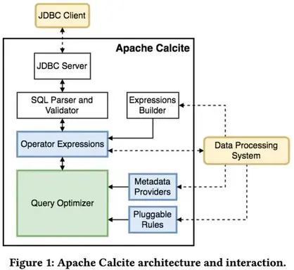
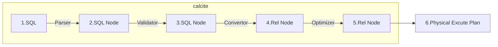
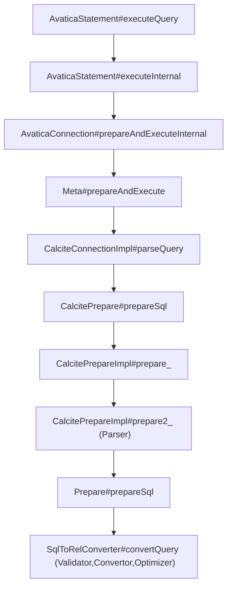

# Apache Calcite Quick Start

Apache Calcite是一个动态的数据管理框架，从功能上看它有很多数据库管理系统的典型功能，比如 SQL 解析、SQL 校验、SQL 查询优化、SQL 生成、数据连接查询等等，但省略了一些关键功能：数据存储，处理数据的算法以及用于存储元数据的存储库。从另一方面看，正因为 Calcite  这种与数据处理和存储的无关的设计，才使它成为在多个数据源和数据处理引擎之间进行协调的绝佳选择。它也是构建数据库的完美基础：只需添加数据即可。

Calcite 的主要功能是 SQL 语法解析(parse)和优化(optimazation)。首先它会把 SQL 语句解析成抽象语法树（AST Abstract Syntax Tree），并基于一定规则或成本对 AST 的算法与关系进行优化，最后推给各个数据处理引擎进行执行。

一般来说 Calcite 解析 SQL 有下面几步:



1. 解析（Parser），Calcite 通过Java CC 将 SQL 解析成未经校验的的 AST
2. 验证（Validate），该步主要作用是校验上一步中的 AST 是否合法，比如如验证 SQL scheme、字段、函数等是否存在，SQL 语句是否合法等等，此步完成之后就生成了 RelNode 树。
3. 优化（Optimize），该步主要作用是优化 RelNode 树，把它转化成物理执行计划。涉及的 SQL 规则优化一般有两种：基于规则的优化（RBO）、基于成本的优化（CBO）这一步原则上说是可选的，经过 Validate 后的 RelNode 树实际就可以直接转化物理执行计划，但现代的 SQL 解析器基本上都有这一步，目的是优化 SQL 执行计划。该步骤得到的结果是物理执行计划。
4. 执行（Execute），这一步主要做的是把物理执行计划转换成可在特定平台执行的程序。如 Hive 、Flink 都在此阶段将物理执行计划 CodeGen 生成相应的可执行代码。

<!--more-->
## quick start demo

下面是 Calcite 的一个查询 [Demo 的例子](https://github.com/chutian0610/calcite-demos/tree/master/tutorials/quickstart/src/main/java/info/victorchu/calcite/tutorials/quickstart/CalciteMain.java)(来自官方文档 background)，我们仿照 SQL 写一条查询语句，但内部数据存储并没有用任何 DB，而是用的 JVM 内存存放的数据。

```java
public class CalciteMain {
    public static Logger logger = LoggerFactory.getLogger(CalciteMain.class);
    public static void main(String[] args) throws SQLException {
        // 创建连接
        Properties info = new Properties();
        info.setProperty("lex", "JAVA");
        Connection connection = DriverManager.getConnection("jdbc:calcite:", info);
        CalciteConnection calciteConnection = connection.unwrap(CalciteConnection.class);
        // 注册schema
        final SchemaPlus rootSchema = calciteConnection.getRootSchema();
        rootSchema.add("hr", new ReflectiveSchema(new HrSchema()));

        // 创建语句
        Statement statement = calciteConnection.createStatement();
        // 执行语句
        ResultSet resultSet =
                statement.executeQuery("select d.deptno, min(e.empid) as min_empid \n"
                        + "from hr.emps as e\n"
                        + "join hr.depts as d\n"
                        + "  on e.deptno = d.deptno\n"
                        + "group by d.deptno\n"
                        + "having count(*) > 1");
        logger.info(new ResultSetFormatter().resultSet(resultSet).string());
        resultSet.close();
        statement.close();
        connection.close();
    }
}
```
示例中定义了一个叫 [HrSchema](https://github.com/chutian0610/calcite-demos/tree/master/tutorials/quickstart/src/main/java/info/victorchu/calcite/tutorials/quickstart/HrSchema.java) 的 schema ，可以把它类比成数据库里面的一个 DB 实例。该 Schema 内有 Employee 和 Department 两张 table ，在内存里给这两张表初始化了一些数据。

```java
public class HrSchema {
    public final Employee[] emps = {
            new Employee(100, 10, "Bill", 10000, 1000),
            new Employee(200, 20, "Eric", 8000, 500),
            new Employee(150, 10, "Sebastian", 7000, null),
            new Employee(110, 10, "Theodore", 11500, 250),
    };
    public final Department[] depts = {
            new Department(10, "Sales", Arrays.asList(emps[0], emps[2]),
                    new Location(-122, 38)),
            new Department(30, "Marketing", ImmutableList.of(), new Location(0, 52)),
            new Department(40, "HR", Collections.singletonList(emps[1]), null),
    };
}
```

运行结果:

```
2021-12-21  14:24:21.738 [main] INFO  info.victorchu.calcite.quickstart.CalciteMain 47  - deptno=10; min_empid=100
```

## 构建

```sh
## use jdk 11
$ git clone git://github.com/apache/calcite.git
$ cd calcite

## 使用代理构建
## ./gradlew -Dhttps.proxyHost=127.0.0.1  -Dhttps.proxyPort=7890 -Dhttp.proxyHost=127.0.0.1  -Dhttp.proxyPort=7890 assembleassemble
$ ./gradlew assemble  # build the artifacts

#./gradlew build 会默认执行Test. 可以使用 -x test ,跳过测试
$ ./gradlew build -x test
```

> 本文及后续系列涉及源码部分的描述，均基于 calcite 1.40.0 版本

### 集成测试

运行集成测试需要先启动外部依赖。

1. 首先安装 Vagrant和VirtualBox。
2. 然后clone https://github.com/vlsi/calcite-test-dataset.git 到calcite的同级目录
3. 构建和启动vm: `cd calcite-test-dataset && mvn install -DskipTests`

## quick look inside

Calcite主要有以下概念[^1]：

- SQL parser: 主要是把SQL转化成AST.
- SQL validator: 通过Catalog来校证AST.
- Query optimizer: 将AST转化成物理执行计划、优化物理执行计划.
- SQL generator: 反向将物理执行计划转化成SQL语句.
- Catalog(Metadata): 主要定义SQL语义相关的元数据与命名空间。




上面的 Sql 解析，验证和优化，均发生在QuickStart例子中的`ResultSet resultSet = statement.executeQuery()`函数中:



## 参考

- [1] [Apache Calcite.howto](https://calcite.apache.org/docs/howto.html#building-from-git)
- [2] [Apache Calcite.Background](https://calcite.apache.org/docs/index.html)

[^1]:在后面的文章中会详细介绍这几部分

