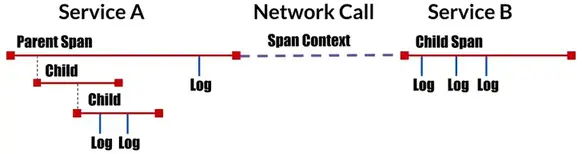
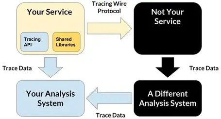
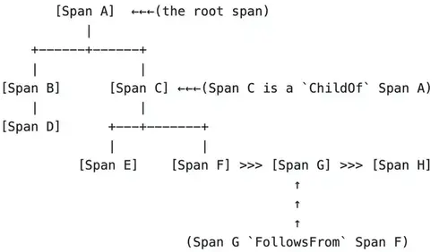
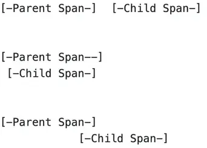
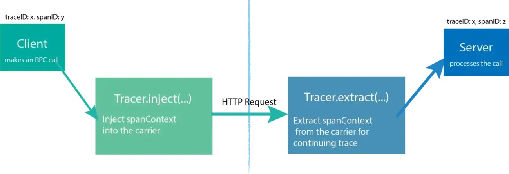
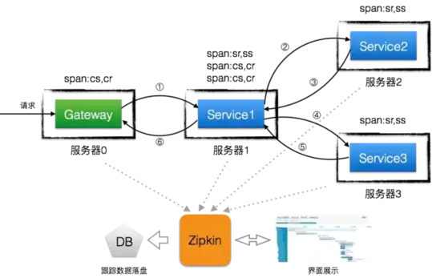
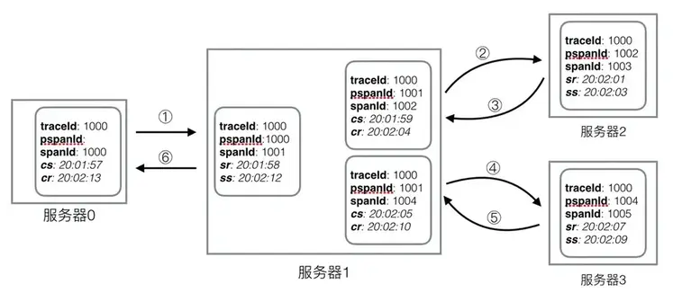
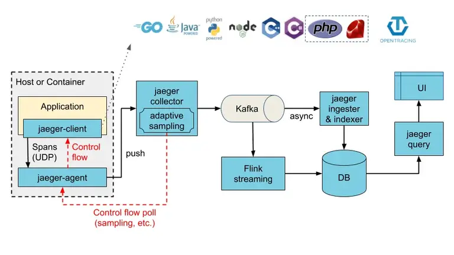

# 分布式追踪系统

随着微服务和云原生开发的兴起，越来越多应用基于分布式进行开发，大型应用拆分为微服务后，服务之间的依赖和调用变得越来越复杂。微服务提供了一个强大的体系结构，但也有面临了一些挑战，例如：

* 如何调试和观察跨复杂网络的分布式调用？
*  如何分析服务链路的瓶颈并对其进行调优？
* 如何快速进行服务链路的故障发现？
* ......

为了更好地维护这些服务，软件领域出现了 Observability 思想。

<!--more-->

## Observability


日志、指标和追踪通常称为可观察性的三大支柱。虽然可以访问日志，指标和跟踪并不一定使系统更易于观察，但这些都是功能强大的工具，如果理解得当，可以解锁构建更好系统的能力。

### 事件日志

事件日志是随时间推移发生的不可变、带时间戳的记录的离散事件，事件日志通常有三种形式，但基本上是相同的：时间戳和某些上下文的信息。这三种形式是：

* 明文:  日志记录是自由格式的文本，也是最常见的日志格式。
* 结构化:  日志是结构化的文本，通常是json格式发送的。
* 二进制:  例如protobuf格式的日志，用于复制和时间点恢复的mysql二进制日志，systemd journal日志。

复杂分布式系统中的故障很少出现，因为系统中的某个特定组件中发生了一个特定事件。通常，涉及到高度互连的组件图中的各种可能的触发原因。通过简单地查看任何给定系统中在某个时间点发生的离散事件，就不可能确定所有此类触发因素。要确定不同的触发因素，需要能够执行以下操作：

* 从特定系统的高级指标或日志事件中的确定症状开始
* 推断分布式系统的不同组件的请求生命周期
* 迭代地询问有关系统各个部分之间交互的问题

除了在请求整个生命周期（通常是短暂的生命周期）中推断，还必须能够在整个系统中推断（在比单个请求的生命周期长几个数量级的持续时间内测量）。发生时上下文信息通常也带有一些信息。

日志是最容易生成的。可以轻松地以日志行的形式表示任何数据。大多数语言、应用程序框架和库都支持日志记录。日志也很容易检测，因为添加日志行与添加 print 语句一样简单。日志在显示具有丰富本地上下文的高粒度信息方面表现得非常好，只要搜索空间本地化为单个服务中发生的事件即可。但是日志也有一些问题:

* 由于日志记录的开销，整个应用程序变得容易受到次优性能的影响
* 日志消息也可能丢失，当日志数据用于计费或付款目的时，这一点变得尤为重要。
* 除非日志记录库可以动态地对日志进行采样，否则过度日志记录可能会对整个应用程序的性能产生负面影响。如果日志记录不是异步的，并且在将日志行写入磁盘时阻止请求处理，则会加剧这种情况。

对于记录的成本开销，通常提出的解药是智能采样。采样是一种技术，用于选取要处理和存储的事件日志总总体的一小部分。这个子集应该是系统中生成的事件语料库的缩影。抽样并非没有公平的问题。首先，采样数据集的功效取决于数据集的所选键或特征，采样决策基于该键或特征。此外，对于大多数在线服务，有必要确定如何动态采样，以便采样率根据传入流量的形状进行自我调整。许多对延迟敏感的系统对发出可观察性数据可以花费的 CPU 时间量有严格的限制。在这种情况下，采样可能被证明是计算昂贵的。

在处理方面，原始日志几乎总是由 Logstash、fluentd、Scribe 或 Heka 等工具进行规范化、过滤和处理，然后再将其持久化在 Elasticsearch 或 BigQuery 等数据存储中。如果应用程序生成了大量日志，则日志可能需要在像 Kafka 这样的代理中进一步缓冲，然后 Logstash 才能处理它们。

> 日志还可以用于商业分析。事件数据不专门用于应用程序性能和调试用例。它还构成了所有分析数据的来源。

### 指标

指标是在时间间隔内测量的数据的数值表示形式。指标可以利用数学建模和预测的力量来获取系统在当前和未来时间间隔内的行为知识。

由于数字针对存储、处理、压缩和检索进行了优化，因此指标可以延长数据保留期，并且更易于查询。这使得指标非常适合构建反映历史趋势的仪表板。指标还允许逐步降低数据分辨率。经过一段时间后，数据可以聚合为每日或每周的频率。

Prometheus 中的指标使用指标名称和标签进行标识。存储在时间序列中的实际数据称为样本，它由两个部分组成：value(float64)和毫秒级精度时间戳。


总的来说，基于指标的日志监视的最大优点是，与日志生成和存储不同，指标传输和存储具有恒定的开销。与日志不同，指标的成本不会与用户流量或任何其他可能导致数据急剧上升的系统活动同步增加。使用指标，应用程序流量的增加不会像日志那样显著提高磁盘利用率、处理复杂性、可视化速度和运营成本。指标存储随着标签值排列的更多而增加（例如，当更多的主机或容器被启动时，或者当添加新服务或当现有服务被更多地检测时），但客户端聚合可以确保指标流量不会随用户流量成比例地增加(边缘计算)。

>像 Prometheus 这样的系统的客户端库会聚合进程中的时间序列样本，并在成功抓取后将它们提交给 Prometheus 服务器（默认情况下，每隔几秒钟发生一次，并且可以进行配置）。

指标一旦收集，对数学、概率和统计转换（如抽样、聚合、汇总和相关性）更具可塑性。这些特征使指标更适合报告系统的整体运行状况。指标也更适合触发警报，因为对内存中的时间序列数据库运行查询比对分布式系统（如 Elasticsearch）运行查询，然后再决定是否需要触发警报之前聚合结果要高效得多，且更可靠了(规整化的指标比日志更可信，也更计算高效)。

应用程序日志和应用程序指标的最大缺点是它们是系统范围的，因此很难理解除特定系统内发生的情况之外的任何其他内容。当然，指标也可以按请求范围限定，但这会导致标签扇出的相应增加，从而导致指标存储的增加。对于没有奇特联接的日志，单个行不会提供有关系统所有组件中请求发生的情况的太多信息。虽然可以构造一个跨地址空间或 RPC 边界关联指标和日志的系统，但此类系统需要一个指标用 UID 作为标签。

使用高基数值（如 UID）作为指标标签可能会使时序数据库不堪重负。尽管新的 Prometheus 存储引擎已经过优化以处理时间序列改动，但较长的时间范围查询仍然会很慢。普罗米修斯只是一个例子。所有流行的现有时序数据库解决方案在高基数标记下的性能都受到影响。当以最佳方式使用时，日志和指标使我们完全无所不知地进入孤岛，但仅此而已。虽然这些可能足以理解单个系统（包括有状态和无状态）的性能和行为，但它们不足以理解遍历多个系统的请求的生存期。

### Tracing

分布式trace是一种技术，可解决跨多个系统将可见性引入请求生存期的问题。trace是一系列因果相关的分布式事件的表示形式，这些事件对分布式系统的端到端请求流进行编码。trace是日志的表示形式，数据结构看起来几乎与事件日志的结构相似。单个trace可以提供对请求路径以及请求结构的可见性。

trace背后的基本思想很简单 - 在应用程序、代理、框架、库、运行时、中间件以及请求路径中表示以下内容的任何其他内容中标识特定点（函数调用或 RPC 边界或并发段，如线程、延续或队列）：

- 执行流中的分叉（操作系统线程或绿色线程）
- 跨网络或进程边界的跳跃点或扇出


trace用于标识每层完成的工作量，同时通过使用发生前语义来保留因果关系。上图显示了分布式系统中单个请求的流。此请求流的trace表示形式如下图所示。trace是span的有向无环图 （DAG），其中span之间的边称为引用。


当请求开始时，会为其分配一个全局唯一 ID，然后在整个请求路径中传播该 ID，以便每个检测点都能够插入或丰富元数据，然后将 ID 传递到请求流中的下一个跳跃点。流的每个跃点都表示为一个span。当执行流到达这些服务之一的检测点时，将发出一条记录以及元数据。这些记录通常先异步记录到磁盘，然后再提交到旁路收集器，然后收集器可以根据系统不同部分发出的不同记录重建执行流。


收集此信息并重建执行流程，同时保留因果关系以进行回顾性分析和故障排除，使人们能够更好地了解请求的生命周期。最重要的是，了解整个请求生命周期让调试跨多个服务的请求成为可能，这可以查明延迟或资源利用率增加的根源。例如，上图表明服务 C 和服务 D 之间的交互花费的时间最长。因此，trace在很大程度上可以帮助人们理解问题的产生点，有时甚至是为什么会产生问题（例如，在请求的生命周期中甚至触及了系统的哪个组件，并且正在减慢响应速度？）。

分布式trace的用例很多。虽然trace主要用于服务间依赖关系分析、分布式分析和调试稳态问题，但trace还有助于按存储容量使用计费和容量规划。Zipkin和Jaeger是两个最流行的符合OpenTracing标准的开源分布式跟踪解决方案，OpenTracing 是用于分布式跟踪 API 的供应商中立规范和检测库。

到目前为止，trace是最难改装到现有基础架构中的，因为要使trace真正有效，需要修改请求路径中的每个组件以传播跟踪信息。trace检测的第二个问题是，开发人员仅检测其代码是不够的。大量应用程序是使用开源框架或库构建的，这些框架或库可能需要额外的检测。在具有多语言架构的地方，这变得更加具有挑战性。实际上，trace最成功地部署场景是在整个公司统一使用一组核心语言和框架。

trace的成本并不像日志记录那样具有灾难性，主要是因为trace几乎总是被大量采样，以减少运行时开销和存储成本。可以做出抽样决策的时候：

* 在生成任何跟踪之前，在请求开始时
* 最后，在所有参与系统都记录了整个请求执行过程的跟踪之后
* 在请求流中途，只有下游服务才会报告跟踪

所有方法都有自己的优点和缺点，甚至可能想要全部使用它们。虽然trace很难实现，但服务网格的兴起使得集成trace功能几乎毫不费力。服务网格在代理级别实现跟踪和统计信息收集，这允许将单个服务视为黑匣子，但仍然可以在整个网格中获得统一和彻底的可观察性。作为网格一部分的应用程序只需要将标头转发到网格中的下一跃点，但不需要其他检测。

## OpenTracing

分布式追踪，也称为分布式请求追踪，是一种用于分析和监视应用程序的方法，特别是那些使用微服务体系结构构建的应用程序，IT和DevOps团队可以使用分布式追踪来监视应用程序; 分布式追踪有助于查明故障发生的位置以及导致性能低下的原因，开发人员可以使用分布式跟踪来帮助调试和优化他们的代码。

大多数分布式追踪系统的思想模型都来自Google's Dapper论文，OpenTracing也使用相似的术语.



1. Trace:  事务在分布式系统中移动时的描述.
2. Span 一种命名的、定时的操作，表示工作流的一部分。Spans接受key:value标签以及附加到特定Span实例的细粒度、带时间戳的结构化日志.
3. Span Contenxt: 携带分布式事务的跟踪信息，包括当它通过网络或消息总线将服务传递给服务时。SPAN上下文包含Trace标识符、SPAN标识符和跟踪系统需要传播到下游服务的任何其他数据.

### 四大块

从应用层分布式跟踪系统的角度来看，现代软件系统如下图所示:



对现代软件系统中的组件可以分为三类

- 应用程序和业务逻辑 你的代码
- 广泛的共享库 其他人的代码
- 广泛共享的服务 其他人的基础设施

这三类组件有着不同的需求，驱动着监控应用程序的分布式追踪系统的设计。最终的设计产生了四个重要的部分

- 追踪监测API: 修饰应用程序代码
- 有线协议: 在RPC请求中与应用程序数据一起发送内容
- 数据协议: 异步(带外)发送到分析系统的内容
- 分析系统: 用于处理追踪数据的数据库和交互式用户界面

OpenTracing API提供了一个标准的、与供应商无关的框架，这意味着如果开发者想要尝试一种不同的分布式追踪系统，开发者只需要简单地修改Tracer配置即可，而不需要替换整个分布式追踪系统.

> OpenTracing由API规范(描述了语言无关的数据模型和Opentracing API指南)、实现该规范的框架和库以及项目文档组成，OpenTracing不是一个标准，OpenTracing API项目正致力于为分布式跟踪创建更加标准化的API和工具

### 数据模型

OpenTracing中的Trace是有Span隐式定义的，Trace可以认为是Span的有向无环图，其中Span之间的边成为引用。下图是由8个Spans构成的一个Trace.



有时，使用时间轴来可视化Trace会更容易，如下图


每一个Span封装以下状态: 

- 操作名称
- 起始时间戳
- 完成时间戳
- 一组零个或多个key:value的Span Tags，keys必须是字符串，values可以是strings,bools,numeric类型。tag应用于整个Span，[semantic_conventions.md](https://github.com/opentracing/specification/blob/master/semantic_conventions.md)上有一个列表，列出了常见方案的常规 span 标记
- 一组零个或多个Span Logs，日志自身是与时间戳匹配的key:value对。键必须是字符串，尽管值可以是任何类型。并非所有的opentracing实现都必须支持每种值类型,日志可用于记录Span内的特定时刻或事件（与无论时间如何都应应用于整个Span的标记相反）。
- 一个SpanContext
- 对零个或多个因果相关 Span 的引用（通过这些相关 Span 的 SpanContext)

每个 SpanContext 都封装了以下状态：

- 任何依赖于 OpenTracing 实现的状态（例如，TraceId和 SpanId）都需要指定引用的Span以区分不同Span的进程边界
- Baggage Items，跨越流程边界的键值对；对于在整个跟踪中提供一些可供访问的数据可能很有用。

示例span：

```
t=0            operation name: db_query               t=x
+-----------------------------------------------------+
| ---------------------  Span ---------------------------|
+-----------------------------------------------------+

Tags:
- db.instance:"customers"
- db.statement:"SELECT * FROM mytable WHERE foo='bar'"
- peer.address:"mysql://127.0.0.1:3306/customers"

Logs:
- message:"Can't connect to mysql server on '127.0.0.1'(10061)"

SpanContext:
- trace_id:"abc123"
- span_id:"xyz789"
- Baggage Items:
  - special_id:"vsid1738"
```

### span之间的引用

Span 可以引用零个或多个与因果相关的其他 SpanContext。OpenTracing 目前定义了两种类型的引用ChildOf 和 FollowsFrom，两种引用类型都特别模拟了父Span和子Span之间的直接因果关系。将来，OpenTracing 还可能支持具有非因果关系的 Span 的引用类型(例如，一起批处理的 Span、卡在同一队列中的 Span 等)。

ChildOf引用:一个Span可以是父Span的子Span，满足以下条件可构成父子关系。

- 表示RPC服务端的Span可以是表示该RPC客户端Span的Child
- 表示SQL插入的Span可以是表示ORM保存方法的Child
- 许多并发(或分布式)工作的Span可能都是单个父 Span，父Span在截止日期内合并了返回的所有子Span的结果


FollowsFrom引用: 某些父Span在任何方面都不依赖子Span的结果。在这些情况下，我们只是说孩子在因果意义上跨越了父级。




### opentracing api

OpenTracing规范中三个关键且互连的类型Tracer、Span和SpanContext。为了在分布式系统中跨进程边界进行跟踪，服务需要能够继续由发送每个请求的客户端注入的跟踪。OpenTracing 通过提供将span的上下文编码到载体中的注入和提取方法来允许这种情况发生。Inject方法允许将SpanContext传递给运营商。例如，将跟踪信息传递到客户端的请求中，以便将其发送到的服务器可以继续跟踪。Extract方法的作用恰恰相反。它从载体中提取SpanContext。例如，如果客户端上有一个活动请求，则开发人员必须使用Extract方法提取 。



## Zipkin

Zipkin是一款开源的分布式实时数据追踪系统（Distributed Tracking System），基于 Google Dapper的论文设计而来，由 Twitter 公司开发贡献。其主要功能是聚集来自各个异构系统的实时监控数据。

跟踪器位于您的应用程序中，并记录有关所发生操作的时间和元数据。它们通常提供库，以便它们的使用对用户是透明的。检测应用中向 Zipkin 发送数据的组件称为报告器。报告器通过几种传输之一将跟踪数据发送到 Zipkin 收集器，Zipkin 收集器将跟踪数据保存到存储中。稍后，API 会查询存储以向 UI 提供数据。


```json
{
      "traceId": "5982fe77008310cc80f1da5e10147517",
      "name": "query",
      "id": "be2d01e33cc78d97",
      "parentId": "ebf33e1a81dc6f71",
      "timestamp": 1458702548786000,
      "duration": 13000,
      "localEndpoint": {
        "serviceName": "zipkin-query",
        "ipv4": "192.168.1.2",
        "port": 9411
      },
      "remoteEndpoint": {
        "serviceName": "spanstore-jdbc",
        "ipv4": "127.0.0.1",
        "port": 3306
      },
      "annotations": [
        {
          "timestamp": 1458702548786000,
          "value": "cs"
        },
        {
          "timestamp": 1458702548799000,
          "value": "cr"
        }
      ],
      "tags": {
        "jdbc.query": "select distinct `zipkin_spans`.`trace_id` from `zipkin_spans` join `zipkin_annotations` on (`zipkin_spans`.`trace_id` = `zipkin_annotations`.`trace_id` and `zipkin_spans`.`id` = `zipkin_annotations`.`span_id`) where (`zipkin_annotations`.`endpoint_service_name` = ? and `zipkin_spans`.`start_ts` between ? and ?) order by `zipkin_spans`.`start_ts` desc limit ?",
        "sa": "true"
      }
}
```

Zipkin的Span模型几乎完全仿造了Dapper中Span模型的设计，我们知道，Span用来描述一次RPC调用，所以一个RPC调用只应该关联一个spanId（不算父spanId），Zipkin中的Span主要包含三个数据部分：

- 基础数据：用于跟踪树中节点的关联和界面展示，包括traceId、spanId、parentId、name、timestamp和duration，其中parentId为null的Span将成为跟踪树的根节点来展示，当然它也是调用链的起点，为了节省一次spanId的创建开销，让顶级Span变得更明显，顶级Span中spanId将会和traceId相同。timestamp用于记录调用的起始时间，而duration表示此次调用的总耗时，所以timestamp+duration将表示成调用的结束时间，而duration在跟踪树中将表示成该Span的时间条的长度。需要注意的是，这里的name用于在跟踪树节点的时间条上展示。
- Annotation数据：用来记录关键事件，只有四种，cs（Client Send）、sr（Server Receive）、ss（Server Send）、cr（Client Receive），所以在Span模型中，Annotation是一个列表，长度最多为4。每种关键事件包含value、timestamp和endpoint，value就是cs、sr、ss和cr中的一种，timestamp表示发生的时间，endpoint用于记录发生的机器（ip）和服务名称（serviceName）。可以很自然的想到，cs和cr、sr和ss的机器名称是相同的，为了简单起见，cs和cr的服务名称可以一样，sr和ss的服务名称可以一样。Annotation数据主要用于用户点击一个Span节点时展示具体的Span信息。
- BinaryAnnotation数据：我们并不满足在跟踪树上只展示调用链的时间信息，如果需要绑定一些业务数据（日志）的话，可以将数据写入BinaryAnnotation中，它的结构和Annotation数据一模一样，在Span中也是一个列表，这里就不再阐述，但BinaryAnnotation中不宜放太多数据，不然将导致性能和体验的下降。

```
cs: Clent Sent 客户端发起请求的时间。
cr: Client Receive 客户端收到处理完请求的时间。
ss: Server Receive 服务端处理完逻辑的时间。
sr: Server Receive 服务端收到调用端请求的时间。

sr - cs = 请求在网络上的耗时
ss - sr = 服务端处理请求的耗时
cr - ss = 回应在网络上的耗时
cr - cs = 一次调用的整体耗时
```

zipkin 示例: 



spinId 的变化规则:

- 收到请求时，生成新的span，上游spanId 变成 pspanId。
- 发起请求时，生成新的span，本地spanId 变成 pspanId。



## Jaeger

Jaeger遵循OpenTracing标准中描述的数据模型。下图是Jaeger的架构。

- Jaeger Client - 为不同语言实现了符合 OpenTracing 标准的 SDK。应用程序通过 API 写入数据，client library 把 trace 信息按照应用程序指定的采样策略传递给 jaeger-agent。
- Agent - 它是一个监听在 UDP 端口上接收 span 数据的网络守护进程，它会将数据批量发送给 collector。它被设计成一个基础组件，部署到所有的宿主机上。Agent 将 client library 和 collector 解耦，为 client library 屏蔽了路由和发现 collector 的细节。
- Collector - 接收 jaeger-agent 发送来的数据，然后将数据写入后端存储。Collector 被设计成无状态的组件，因此您可以同时运行任意数量的 jaeger-collector。
- Data Store - 后端存储被设计成一个可插拔的组件，支持将数据写入 cassandra、elastic search。
- Query - 接收查询请求，然后从后端存储系统中检索 trace 并通过 UI 进行展示。Query 是无状态的，您可以启动多个实例，把它们部署在 nginx 这样的负载均衡器后面。



## TraceId 和 SpanId 生成规则

TraceId 一般由接收请求经过的第一个服务器产生(类似雪花ID)，产生来源通常有： 

- 服务器IP(或唯一性HostName)
- 产生 ID 时候的时间戳
- 自增序列
- 当前进程号
- 随机数
- Mac 地址

以SOFATracer为例，产生规则是： 服务器 IP + 产生 ID 时候的时间 + 自增序列 + 当前进程号 ，比如：

```
0ad1348f1403169275002100356696
```
- 前 8 位 0ad1348f 即产生 TraceId 的机器的 IP，这是一个十六进制的数字，每两位代表 IP 中的一段，我们把这个数字，按每两位转成 10 进制即可得到常见的 IP 地址表示方式 10.209.52.143，大家也可以根据这个规律来查找到请求经过的第一个服务器。
- 后面的 13 位 1403169275002 是产生 TraceId 的时间。
- 之后的 4 位 1003 是一个自增的序列，从 1000 涨到 9000，到达 9000 后回到 1000 再开始往上涨。
- 最后的 5 位 56696 是当前的进程 ID，为了防止单机多进程出现 TraceId 冲突的情况，所以在 TraceId 末尾添加了当前的进程 ID。

大部分的spanId 生成规则和TraceId一样。这里介绍下 SOFATracer的特殊之处:

SOFATracer 中的 SpanId 代表本次调用在整个调用链路树中的位置，假设一个 Web 系统 A 接收了一次用户请求，那么在这个系统的 SOFATracer MVC 日志中，记录下的 SpanId 是 0，代表是整个调用的根节点，如果 A 系统处理这次请求，需要通过 RPC 依次调用 B，C，D 三个系统，那么在 A 系统的 SOFATracer RPC 客户端日志中，SpanId 分别是 0.1，0.2 和 0.3，在 B，C，D 三个系统的 SOFATracer RPC 服务端日志中，SpanId 也分别是 0.1，0.2 和 0.3；如果 C 系统在处理请求的时候又调用了 E，F 两个系统，那么 C 系统中对应的 SOFATracer RPC 客户端日志是 0.2.1 和 0.2.2，E，F 两个系统对应的 SOFATracer RPC 服务端日志也是 0.2.1 和 0.2.2。根据上面的描述，我们可以知道，如果把一次调用中所有的 SpanId 收集起来，可以组成一棵完整的链路树。

我们假设一次分布式调用中产生的 TraceId 是 0a1234（实际不会这么短），那么根据上文 SpanId 的产生过程，有下图：


## 异步问题

如果在代码中通过新启动了线程或者采用了线程池去异步地处理一些业务，那么需要将Span在线程间传递， 这里假设 span 信息存储在 MDC(threadLocal)中，可以使用类似下面的代码逻辑来处理:

```java
public class TraceRunable implements Runnable {
    private final Map<String, String> parentMDCMap;
    private final Runnable runnable;

    private TraceRunable(Runnable runnable) {
        this.runnable = runnable;
        this.parentMDCMap = MDC.getCopyOfContextMap();
    }

    public static TraceRunable wrap(Runnable runnable) {
        return new TraceRunable(runnable);
    }

    public void run() {
        if (this.parentMDCMap == null) {
            MDC.setContextMap(new HashMap());
        } else {
            MDC.setContextMap(this.parentMDCMap);
        }

        try {
            this.runnable.run();
        } finally {
            MDC.clear();
        }

    }
}
```

- 异步场景: 异步调用，以 RPC 调用为例，每次 RPC 调用请求出去之后不会等待到结果返回之后才去发起下一次处理，这里有个时间差，在前一个 RPC 调用的 callback 回来之前，又一个新的 RPC 请求发起，此时当前线程中的 Context 没有被清理，则 spanId 会自增，tracerId 相同。对于上面这种情况，在对于异步情况处理时，不要等到 callback 回来之后，调用 cr 阶段才会清理，而是提前就清理当前线程的 Context 上下文，从而来保证链路的正确性。

- 线程池:
  - 同步调用，线程池中分配一个线程用于处理 RPC 请求，在请求结束之前会一直占用线程；此种情况下不会造成下一个 RPC 请求错拿上一个请求的 Context 数据问题
  - 异步调用，由于异步回调并非是在 callback 中来清理上下文，而是提前清理的，所以也不会存在数据串用问题。callback 异步回调，这个本质上就是异步调用，所以处理情况和异步调用相同。


## 参考

<div id="refer-anchor-1"></div>

- [1] [Distributed Systems Observability](https://www.oreilly.com/library/view/distributed-systems-observability/9781492033431/)
- [2] [Metrics Tracing and Logging](https://peter.bourgon.org/blog/2017/02/21/metrics-tracing-and-logging.html)
- [3] [opentracing overview](https://opentracing.io/docs/overview/)
- [4] [opentracing specification](https://opentracing.io/specification/)
- [5] [SOFA](https://help.aliyun.com/document_detail/151840.html)

