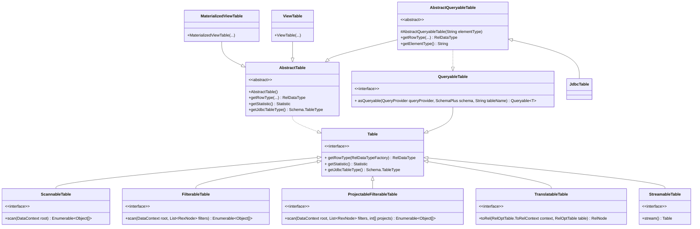

# 深入理解 Apache Calcite-Catalog

Calcite 支持管理底层数据库的元数据信息和根据元数据优化查询 SQL。但是 Calcite 不直接存储底层系统中的元数据信息，用户需要先将元数据注册到 Calcite Catalog 中，才可以使用Calcite提供的能力。

<!--more-->

## Catalog

在 Caclite 中，Catalog 主要用来定义 SQL 查询过程中所需要的元数据和命名空间,主要包含以下内容:

- Schema: 表和函数的命名空间。也支持任意级别的嵌套子schema。
- Table: 代表一个数据集，其中所有字段的类型由RelDataType定义。
- RelDataType: 代表一个数据集中的所有字段。简单的说，描述了表中一行数据的类型。
- Function: 代表注册在 Schema 中的一个函数，接收参数并返回类型。
- Lattice: 晶格,用于定义多维数据模型和自动化管理物化视图（Materialized View）的核心概念。

Catalog的基础实现是抽象类 CalciteSchema。CalciteSchema 有 CachingCalciteSchema 和 SimpleCalciteSchema 两个子类，他们的区别主要是是否查找、函数和类型。

```mermaid
classDiagram
    class CalciteSchema {
        - CalciteSchema parent
        + Schema schema
        + Sring name
        # NameMap~CalciteSchema~ subSchemaMap
        + add(String name, Schema schema) CalciteSchema
        + add(String tableName, Table table) TableEntry
        + add(String name, RelProtoDataType type) TypeEntry
        - add(String name, Function function) FunctionEntry
        + getSubSchema(String schemaName, boolean caseSensitive) CalciteSchema
        + getTable(String tableName, boolean caseSensitive) TableEntry
        + getType(String name, boolean caseSensitive) TypeEntry
        + getFunctions(String name, boolean caseSensitive) Collection~Function~
        + isCacheEnabled() boolean
        + setCache(boolean cache)
    }
    CalciteSchema o--	Schema
    &lt;&lt;Abstract>> CalciteSchema
    class CachingCalciteSchema
    CalciteSchema <|--CachingCalciteSchema
    note for CachingCalciteSchema "支持查询缓存的Catalog 实现"
    class SimpleCalciteSchema
    CalciteSchema <|--SimpleCalciteSchema
    note for SimpleCalciteSchema "简单的Catalog 实现"
```

CalciteSchema 实际上是 Schema的 Wrapper，两者间是 1:1 的关系。由于 Schema 支持嵌套，CalciteSchema也支持了嵌套关系:

- Parent 字段就指向了父节点
- schema 字段是内部的 Schema

### entry

CalciteSchema 使用下面的字段存储 name 和 entry(table,type,function,lattice) 的映射关系，支持通过 `add*()`方法添加 ,`get*()`查找和`remove*()` 删除。

> 注意, 上述的修改方法不会影响内部的 Schema。

```java
public abstract class CalciteSchema {
  ... ... 
  /** Tables explicitly defined in this schema. Does not include tables in
   * {@link #schema}. */
  protected final NameMap<TableEntry> tableMap;
  private final LazyReference<Lookup<TableEntry>> tables = new LazyReference<>();
  protected final NameMultimap<FunctionEntry> functionMap;
  protected final NameMap<TypeEntry> typeMap;
  protected final NameMap<LatticeEntry> latticeMap;
  protected final NameSet functionNames;
  protected final NameMap<FunctionEntry> nullaryFunctionMap;
  ... ...
  public abstract static class Entry {
    public final CalciteSchema schema;
    public final String name;

    protected Entry(CalciteSchema schema, String name) {
      this.schema = requireNonNull(schema, "schema");
      this.name = requireNonNull(name, "name");
    }

    /** Returns this object's path. For example ["hr", "emps"]. */
    public final List<String> path() {
      return schema.path(name);
    }
  }
}
```
- `NameMap<V>`内部有一个NavigableMap`<String,V>`(继承自SortedMap)，支持返回子视图，支持范围查询。
- `NameMultimap<V>`内部是一个`NameMap<List<V>>`。
- `NameSet`内部是一个 `NameMap<Object>`,其中 value 都是默认值`Object DUMMY = new Object();`。

Entry的子类有4类

```mermaid
classDiagram
  class Entry{
    + CalciteSchema schema
    + String name
    + path() List~String~ 
  }
  class TableEntry{
    + getTable() Table
  }
  &lt;&lt;Abstract>> TableEntry
  class TableEntryImpl
  TableEntry <|.. TableEntryImpl
  Entry <|-- TableEntry

  class TypeEntry{
    + getType() RelProtoDataType
  }
  &lt;&lt;Abstract>> TypeEntry
  class TypeEntryImpl
  TypeEntry <|.. TypeEntryImpl
  Entry <|-- TypeEntry

  class FunctionEntry{
    + getFunction() Function
    + isMaterialization() boolean
  }
  &lt;&lt;Abstract>> FunctionEntry
  class FunctionEntryImpl
  FunctionEntry <|.. FunctionEntryImpl
  Entry <|-- FunctionEntry

  class LatticeEntry{
    + getLattice() Lattice
    + getStartTable() TableEntry
  }
  &lt;&lt;Abstract>> LatticeEntry
  class LatticeEntryImpl
  LatticeEntry <|.. LatticeEntryImpl
  Entry <|-- LatticeEntry
```

### Lookup

Lookup 代表 Catalog 中的一次(大小写敏感/不敏感)查询。

```java
public interface Lookup<T> {
  // 根据名称查找值
  @Nullable T get(String name);
  // 根据名称查找值(忽略大小写)
  @Nullable Named<T> getIgnoreCase(String name);
  // 查找符合模式的名字(大小写敏感)
  // LikePattern sql like 风格。
  Set<String> getNames(LikePattern pattern);
  // =============== 工厂方法 ===============
  // 空 Lookup
  static <T> Lookup<T> empty() {
    return (Lookup<T>) EmptyLookup.INSTANCE;
  }
  // 基于 NameMap的 LookUp
  static <T> Lookup<T> of(NameMap<T> map) {
    return new NameMapLookup<>(map);
  }
  // 多个 Lookup 拼接
  static <T> Lookup<T> concat(Lookup<T>... lookups) {
    return new ConcatLookup<>(lookups);
  }
```

Lookup 有以下实现:

```mermaid
classDiagram
  class Lookup~T~
  &lt;&lt;Interface>> Lookup
  class IgnoreCaseLookup~T~
  &lt;&lt;Abstract>> IgnoreCaseLookup
  Lookup <|.. IgnoreCaseLookup
  class CompatibilityLookup~T~
  IgnoreCaseLookup <|-- CompatibilityLookup
  class ConcatLookup~T~
  Lookup <|.. ConcatLookup
  class EmptyLookup~T~
  Lookup <|.. EmptyLookup
  class LoadingCacheLookup~T~{
    - Lookup~T~ delegate
    - LoadingCache~String, T~ cache
    - LoadingCache~String, Named~ cacheIgnoreCase
  }
  Lookup <|.. LoadingCacheLookup
  class NameMapLookup~T~
  Lookup <|.. NameMapLookup
  class SnapshotLookup~T~{
   - Lookup~T~ delegate
   - LazyReference~Lookup~ cachedDelegate
   - boolean enabled
  }
  Lookup <|.. SnapshotLookup
  class TransformingLookup~S,T~{
    - Lookup~S~ delegate
    - BiFunction~S, String, T~ transform
  }
```

- IgnoreCaseLookup: 是忽略大小写的 Lookup
  - CompatibilityLookup: 支持外部注入的 Lookup 逻辑
- EmptyLookup: 空 Lookup
- ConcatLookup: 多个 Lookup 结果合并(数组顺序是优先级)
- LoadingCacheLookup: 支持缓存的 Lookup
- NameMapLookup: 基于 NameMap的 LookUp
- SnapshotLookup: 存储 Lookup 结果的查询快照
- TransformingLookup: 支持结果变换的 Lookup。

## schema

schema是表和函数的命名空间。也支持任意级别的嵌套子schema。大多数数据库的实现是有层级限制的，例如，大部分的 JDBC 仅支持:

- 一级 Schema
- 二级 database+catalog


```java
public interface Schema {
  /*根据表名返回对应表，或null*/
  @Nullable Table getTable(String name);
  /*返回所有表名*/
  Set<String> getTableNames();
  /*根据表名返回对应的类型，或null*/
  @Nullable RelProtoDataType getType(String name);
  /*返回所有表的行类型名*/
  Set<String> getTypeNames();
  /*返回函数名对应的所有函数，或空集*/
  Collection<Function> getFunctions(String name);
  /*返回所有函数名*/
  Set<String> getFunctionNames();
  /*返回名称对应的子schema*/
  @Nullable Schema getSubSchema(String name);
  /*返回所有子schema的名称*/
  Set<String> getSubSchemaNames();
  /* 返回schema 在代码中调用的表达式 */
  Expression getExpression(SchemaPlus parentSchema, String name);
  /**
   * 这个schema是否可以创建新的表，函数和子Schema，
   * 注意，即使这个方法返回了true，schema 内部的map(存储)也不会被修改，
   * Calcite 将定义的对象存储在包装类里面
   */
  boolean isMutable();
  /*返回当前schema的快照*/
  Schema snapshot(SchemaVersion version);
}
```

下图是 `calcite-core` 包中的Schema类图。

```mermaid
classDiagram
  class Schema
  &lt;&lt;Interface>> Schema
  class AbstractSchema
  Schema <|.. AbstractSchema
  class ReflectiveSchema
  AbstractSchema <|-- ReflectiveSchema
  class MetadataSchema
  AbstractSchema <|-- MetadataSchema
  class CloneSchema
  AbstractSchema <|-- CloneSchema
  class JdbcBaseSchema
  &lt;&lt;Abstract>> JdbcBaseSchema
  Schema <|.. JdbcBaseSchema
  class JdbcCatalogSchema
  JdbcBaseSchema <|-- JdbcCatalogSchema
  class JdbcSchema
  JdbcBaseSchema <|-- JdbcSchema
  class DelegatingSchema
  Schema <|.. DelegatingSchema
  class SchemaPlus
  &lt;&lt;Interface>> SchemaPlus
  class SchemaPlusImpl
  Schema <|.. SchemaPlusImpl
  class MySchemaPlus
  Schema <|.. MySchemaPlus
  class SemiMutableSchema
  &lt;&lt;Interface>> SemiMutableSchema
```

- AbstractSchema: 
  - ReflectiveSchema: 通过反射对象获取Java类的schema.
  - MetadataSchema: 适配avatica Meta的schema
  - CloneSchema: 支持在内存中从JDBC schema拷贝tables.
- JdbcBaseSchema: 从JDBC数据源中获取Schema信息。
  - JdbcSchema: 由JDBC数据源支持的Schema的实现。
  - JdbcCatalogSchema: 基于JDBC catalog的 Schema 实现。
- DelegatingSchema: 代理Schema，简单的包装器。
- SchemaPlus:  Schema接口的扩展。是Calcite包装schema实现的包装器。
  - SchemaPlusImpl: SchemaPlus接口的实现类。将CalciteSchema(wrapper)适配到SchemaPlus接口。
  - MySchemaPlus: 执行计划中使用。
- SemiMutableSchema: 支持新增物化视图的schema(在calcite 中未被使用)。

AbstractSchema 对 Schema 接口的方法进行了实现，并提供了可重写的 getTableMap、getFunctionMultimap 和 getSubSchemaMap 方法，用于向 Schema 中注册表、函数和子 ReflectiveSchema 和 JdbcCatalogSchema 都是继承了 AbstractSchema 完成 Schema 注册。

在calcite的其他包中还有其他的实现，例如 CsvSchema，FileSchema等。

### SchemaPlus

SchemaPlus 是对 Schema接口的扩展，用户自定义的schema不需要实现这个接口，但是schema在系统实际传递中，会被这个接口包装。换句话说，就是用户只需要创建schema，而在Calcite系统的其他地方使用schema时，是通过SchemaPlus来访问的。Calcite 内部提供了 SchemaPlus 的生成方法，例如：`CalciteSchema#plus()` 方法。

```java
public interface SchemaPlus extends Schema {

  @Nullable SchemaPlus getParentSchema();
  String getName();
  @Override @Nullable SchemaPlus getSubSchema(String name);
  /** 添加一个schema 作为子 schema ，并返回包装后的 SchemaPlus */
  SchemaPlus add(String name, Schema schema);
  /** Adds a table to this schema. */
  void add(String name, Table table);
  /** Adds a function to this schema. */
  void add(String name, Function function);
  /** Adds a type to this schema.  */
  void add(String name, RelProtoDataType type);
  /** Adds a lattice to this schema. */
  void add(String name, Lattice lattice);
  @Override boolean isMutable();
  /** Returns an underlying object. */
  <T extends Object> @Nullable T unwrap(Class<T> clazz);
  void setPath(ImmutableList<ImmutableList<String>> path);
  void setCacheEnabled(boolean cache);
  boolean isCacheEnabled();
}
```

## Table

Table代表一个数据集，其中所有字段的类型由RelDataType定义。Table的典型创建方法是Calcite从schema中调用getTable方法。一个表不需要知道自己的name。这是为了表的重用(有多个名字或在多个schema中)，这个概念和UNIX文件系统中的Inode有相似之处。

```java
public interface Table {
  /* 返回表一行的类型(字段的名字和其类型) */
  RelDataType getRowType(RelDataTypeFactory typeFactory);

  /** 返回表的统计 */
  Statistic getStatistic();

  /** 返回表的类型，例如: table, view, index, join, stream 等*/
  Schema.TableType getJdbcTableType();

  /** 给定的列是否可以上卷 */
  boolean isRolledUp(String column);

  /** 判断给定的上卷列能不能用于给定的聚合函数。 */
  boolean rolledUpColumnValidInsideAgg(String column, SqlCall call,
      @Nullable SqlNode parent, @Nullable CalciteConnectionConfig config);
}
```

下图是 `calcite-core` 包中的部分Table类图。



| 类/接口 | 角色与核心作用 |
|---|---|
| Table (接口) | 最顶层的表抽象。定义了获取行类型(RowType)、统计信息(Statistic)和表类型(JdbcTableType)等元数据的基本方法。 |
| ScannableTable (接口) | 可扫描表。表示可以直接枚举所有行的最基础表类型。scan方法返回一个Enumerable对象。 |
| FilterableTable (接口) | 可过滤表。在ScannableTable基础上增强，允许在扫描时将过滤条件下推，减少数据读取量。 |
| ProjectableFilterableTable (接口) | 可投影和过滤的表。进一步允许将列选择(projects)条件下推，是最强大的基础表类型之一。 |
| TranslatableTable (接口) | 可翻译的表。这是Calcite优化的核心。实现此接口的表可以将自己“翻译”成一个关系代数表达式(RelNode)，让优化器能对其进行完整的规则优化（如谓词下推、聚合计算等）。很多高级适配器（如JDBC、Cassandra）都实现此接口。 |
| StreamableTable (接口) | 可流的表。表示可以产生流式数据的表。 |
| AbstractTable (抽象类) | 基础的骨架实现。提供了getRowType, getStatistic等方法的简单默认实现。自定义简单表时通常直接继承此类。ViewTable和MaterializedViewTable就继承自它。 |
| AbstractQueryableTable (抽象类) | 用于实现可查询的表，与Calcite的查询能力集成。|
| ViewTable(类) |用于视图处理，通过将视图定义语句 viewSql 转化为 AST 及关系代数，并在 toRel 处理过程中将原有的视图查询语句展开，变换为对原始表的查询，从而实现视图语义。
| MaterializedViewTable (类)|物化视图表|


## RelDataType
RelDataType 代表了关系表达式返回的数据行类型或者标量表达式的类型，Calcite 支持了所有的 SQL 数据类型，也包括结构和数组类型。RelDataType 接口中的主要方法如下：

```java
public interface RelDataType {
  ... ...
  // 获取结构类型中的字段，Calcite 中关系表达式返回的数据行类型使用 RelDataType 表示，每一列的类型通过 RelDataTypeField 表示
  // RelDataTypeField 内部仍然封装了 RelDataType 表示字段类型
  List<RelDataTypeField> getFieldList();
  // 当前类型是否支持为空
  boolean isNullable();
  RelDataType getComponentType();
  RelDataType getKeyType();
  RelDataType getValueType();
  // 当前类型的字符集编码
  Charset getCharset();
  // 当前类型的排序规则
  SqlCollation getCollation();
  // 获取该类型的 JDBC 精度（字段长度，例如：-4.75，precision 为 3）
  int getPrecision();
  // 获取该类型的范围（小数位数，例如：-4.75，scale 为 2）
  int getScale();
  // 获取 SQL 类型
  SqlTypeName getSqlTypeName();
  ... ...
}
```

RelDataTypeField 代表了struct类型中的一个字段.
```java
public interface RelDataTypeField extends Map.Entry<String, RelDataType> {
  /* 返回字段对应的名称*/
  String getName();
  /*返回字段的Index*/
  int getIndex();
  /*返回字段的类型*/
  RelDataType getType();
  /** Returns true if this is a dynamic star field. */
  boolean isDynamicStar();
}
```

## Function

Calcite 对函数的定义是：接受参数并返回结果的命名表达式。函数通过 Schema 进行注册，可以通过 `Schema#getFunctions`获取函数，然后根据参数类型获取对应的函数。下面是 Function 接口声明：

```java
public interface Function {   
  	// 获取函数参数
    List<FunctionParameter> getParameters();
}
```

Function 接口提供了 getParameters 获取函数参数的方法，Function 接口有 ScalarFunction、AggregateFunction、TableFunction 和 TableMarco 等几个主要的子接口。

- ScalarFunction 对应标量函数，也就是函数返回的结果为一个标量- AggregateFunction 对应聚合函数，会将多个值聚合计算为一个标量返回。
- TableFunction 和 TableMacro 都对应了表函数，会返回一个表，他们的区别是:
  - TableMacro 会在编译期间进行调用，编译期展开表达式允许 Calcite 实现更加强大的查询优化，例如我们可以对视图在编译期进行展开。
  - 相比于 TableMacro，TableFunction 则需要在执行阶段才能知道表的结果。

以上介绍了 Calcite Catalog 体系中涉及到的类及其主要作用，下面将介绍Calcite 如何注入Catalog。

## Catalog 注入

以上篇[Apache Calcite Quick Start](/posts/351c6aee/)中的[quick start demo](https://github.com/chutian0610/calcite-demos/blob/master/tutorials/quickstart/src/main/java/info/victorchu/calcite/tutorials/quickstart/CalciteMain.java)为例。

### 加载Jdbc Driver

`calcite-core`包中的`META-INF/services`文件夹中有文件`java.sql.Driver`

```
org.apache.calcite.jdbc.Driver
```

JVM 启动时，会通过 ServiceLoader加载Driver服务。

```java
public class Driver extends UnregisteredDriver {
  public static final String CONNECT_STRING_PREFIX = "jdbc:calcite:";

  protected final @Nullable Supplier<CalcitePrepare> prepareFactory;

  static {
    new Driver().register();
  }
  
  /** Creates a Driver. */
  public Driver() {
    this(null);
  }
  ... ...
} 

// org.apache.calcite.avatica.UnregisteredDriver
/**
 * Registers this driver with the driver manager.
 */
protected void register() {
  try {
    DriverManager.registerDriver(this);
  } catch (SQLException e) {
    System.out.println(
        "Error occurred while registering JDBC driver "
        + this + ": " + e.toString());
  }
}
```

### CalciteConnection

当我们使用`Connection connection = DriverManager.getConnection("jdbc:calcite:", info);`获取连接时，DriverManager会使用上面注册的Driver 生成连接，最终生成的连接是`CalciteConnectionImpl`。

```java
// org.apache.calcite.avatica.UnregisteredDriver
public Connection connect(String url, Properties info) throws SQLException {
  if (!acceptsURL(url)) {
    return null;
  }
  final String prefix = getConnectStringPrefix();
  assert url.startsWith(prefix);
  final String urlSuffix = url.substring(prefix.length());
  final Properties info2 = ConnectStringParser.parse(urlSuffix, info);
  // CalciteConnectionImpl
  final AvaticaConnection connection =
      factory.newConnection(this, factory, url, info2);
  handler.onConnectionInit(connection);
  return connection;
}
```

CalciteConnectionImpl在初始化时会主动创建 rootSchema。

```java
// CalciteConnectionImpl#<init>
this.rootSchema = 
        requireNonNull(rootSchema != null
            ? rootSchema
            : CalciteSchema.createRootSchema(true));

// CalciteSchema#createRootSchema
if (addMetadataSchema) {
  rootSchema.add("metadata", MetadataSchema.INSTANCE);
}
```

`CalciteSchema.createRootSchema`方法会根据参数传递的标识决定是否创建 metadata Schema，metadata Schema 会注册 COLUMNS、TABLES 等系统表以提供相关的查询。

### 注入Catalog

注入 Catalog 有两种方式:

- 编程API
- Json配置文件

#### 编程 API

上面的 Demo 就是通过编程 API 方式注入 Catalog。

```java
// 获取Calcite的根Schema
Connection connection = DriverManager.getConnection("jdbc:calcite:", info);
CalciteConnection calciteConnection = connection.unwrap(CalciteConnection.class);
// 注册schema
final SchemaPlus rootSchema = calciteConnection.getRootSchema();
rootSchema.add("hr", new ReflectiveSchema(new HrSchema()));
```

#### Json 配置文件

[官方CSV Catalog](https://github.com/chutian0610/calcite-demos/blob/master/tutorials/quickstart/src/test/java/info/victorchu/calcite/tutorials/csv/CsvTest.java)就是使用 Json 配置方式注入 Catalog。下面是CSV Catalog 配置文件的一个例子。

```json
{
  "version": "1.0",
  "defaultSchema": "SALES", // 默认 Schema
  "schemas": [ // Schema 列表
    {
      "name": "SALES",
      "type": "custom", // 类型， MAP, JDBC 或者 CUSTOM
      "factory": "info.victorchu.calcite.tutorials.csv.CsvSchemaFactory", // custom 类型需要 Factory
      "operand": { // Factory 的参数
        "directory": "sales"
      }
    }
  ]
}
```

然后将配置文件路径放到 创建连接时的Properties属性中:

```java
Properties info = new Properties();
info.put("model", "/resource/SALES.json");
```

`org.apache.calcite.jdbc.Driver`在创建完 Connection 后,会通过钩子函数注入 Catalog:

```java

@Override protected Handler createHandler() {
  return new HandlerImpl() {
    @Override public void onConnectionInit(AvaticaConnection connection_)
        throws SQLException {
      final CalciteConnectionImpl connection =
          (CalciteConnectionImpl) connection_;
      super.onConnectionInit(connection);
      // 获取属性中的 model 参数
      final String model = model(connection);
      if (model != null) {
        // 注入 Catalog
        try {
          ModelHandler h = new ModelHandler(connection.getRootSchema(), model);
          String defaultName = h.defaultSchemaName();
          if (defaultName != null) {
            connection.setSchema(defaultName);
          }
        } catch (IOException e) {
          throw new SQLException(e);
        }
      }
      connection.init();
    }
    ... ...
  };
}
```

