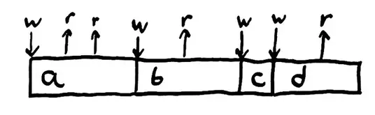
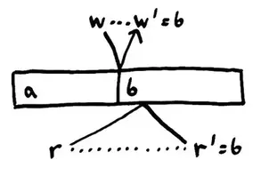
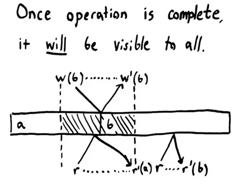

# 分布式一致性模型

在前面的分布式系统理论中，我们了解到网络分区是大概率会发生的。分布式系统需要考虑在面临分区分区问题时，选择一致性还是高可用。本文将展开介绍分布式一致性模型(并行计算不涉及事务)。

<!--more-->

## 一致性

一个系统是由状态和一些导致状态转移的操作组成的。在系统运行期间，它将随着操作的演进从一个状态转移到另一个状态。

这里我们引入嵌入式领域中的寄存器 register. 寄存器是一种具有两种操作的数据结构:

- set(X) 将寄存器的值设为 X
- get() 返回寄存器中最新的值

> 寄存器看起来非常简单, 但它体现了分布式系统做的事情本质 - 写入数据和读取数据.



对于寄存器，一旦我们把变量写为某个值，比如a，那么读操作就应该返回a，直到我们再次改变变量。读到的值应该总是返回最近写入的值。

给定一些涉及操作与状态的规则，随着操作的演进，系统将一直遵循这些规则。我们把这样的规则称为一致性模型。


### 并发操作

假设我们用2个进程运行一个并发程序，每个进程都对同一个寄存器进行访问（读和写），那么我们之前认为的寄存器系统的不变性（指顺序不变性）就会被改写。


两个工作进程分别称为“Top”和“Bottom”。Top进程尝试执行写a，读，读。Bottom进程同时尝试执行读，写b，读。因为程序是并发的，所以两个进程之间互相交错的操作将导致多个执行顺序——而在单核场景下，执行顺序总是程序里指定的那一个逻辑顺序。

但是并发会让一切表现的不同。我们可以默认地认为每个并发的程序——一旦执行，操作能以任意顺序发生。一个线程，或者说是一个逻辑进程，在执行记录层面的做了一个约束：属于同一个线程的操作一定会按顺序发生。逻辑线程对允许操作集合中的操作强加了部分顺序保证。（一个逻辑线程即一个执行实体，即使编译器重排了指令，单个线程中的同步workflow顺序是不会颠倒的。但是不同线程之间的事件顺序无法保证。）

即使有了以上的保证，从独立进程的角度来看，我们的寄存器不变性也被破坏了。Top写入a，读到a，接着读到b——这不再是它写入的值。 我们必须使一致性模型更宽松来有效描述并发。现在，进程可以从其他任意进程读到最近写入的值。寄存器变成了两个进程之间协调的地方：它们共享了状态。

### 延时

现实系统中的操作不是瞬时的。

- 我们对一个变量执行写操作
- 写操作传播到内存，或其他计算机；
- 内存改变状态；
- 一个确认信息回传；

这样我们才知道这个操作真实的发生了。



传送消息的延迟会在操作记录中造成歧义。消息传播的快慢会导致预期外的事件顺序发生。上图中，Top发起一个读请求的时候，值为a，但在读请求的传播过程中，Bottom将值写为b——写操作偶然地比读请求先到达寄存器。 Top最终读到了b而不是a。

Bottom进程在调用读取时没有读取当前值。我们可能会尝试使用完成时间，而不是调用时间，作为操作的“真实时间”，但这也因对称性而失败；如果读取在写入之前到达，当当前值为a时，进程将收到b。

这一记录破坏了我们的寄存器并发一致性模型。在分布式系统中，操作的耗时被放大了，我们必须使一致性模型更宽松：允许这些有歧义的顺序发生。

## 线性一致性(Linearizability)/严格一致性

如果我们假设有一个全局的状态与每个进程通信；继续假设与这个全局状态交互的操作都是原子的；那我们可以排除很多可能发生的记录。每个操作会在它调用和完成之间的某个时间点原子地生效。

我们把这样的一致性模型称为线性一致性模型。尽管操作都是并发且耗时的，但每一个操作都会在某地以严格的线性顺序发生。



“全局单点状态”并不一定是一个单独的节点，同样的，操作也并不一定全是原子的，状态也可以被分片成横跨多台机器，或者分多步完成——只要从进程的角度看来，外部记录的表现与一个原子的单点状态等效。通常一个可线性化的系统由一些更小的协调进程组成，这些进程本身就是线性的，并且这些进程又是由更细粒度的协调进程组成，直到硬件提供[可线性化](https://en.wikipedia.org/wiki/Compare-and-swap)的操作。

线性化是强大的武器。一旦一个操作完成，它或它之后的某一状态将对所有参与者可见。因为每个操作一定发生在它的完成时间之前，且任何之后被调用的操作一定发生在调用时间之后，也就是在原操作本身之后。 一旦我们成功写入b，每个之后调用的读请求都可以读到b，如果有更多的写操作发生的话，也可以是b之后的某个值。

我们可以利用线性一致性的原子性约束来安全地修改状态。我们定义一个类似CAS（compare-and-set）的操作，当且仅当寄存器持有某个值的时候，我们可以往它写入新值。线性一致性保证了变更的安全交错。

此外，线性一致性的时间界限保证了操作完成后，所有变更都对其他参与者可见。于是线性一致性禁止了过时的读。每次读都会读到某一介于调用时间与完成时间的状态，但永远不会读到读请求调用之前的状态。线性一致性同样禁止了非单调的读，比如一个读请求先读到了一个新值，后读到一个旧值。

线性一致性模型提供了这样的保证：

1.对于观察者来说，所有的读和写都在一个单调递增的时间线上串行地向前推进。  
2.所有的读总能返回最近的写操作的值。

### 原子一致性

原子一致性类似线性一致性，区别是读操作未能立即读到此前最近一次写操作的结果，但多读几次还是获得了正确结果。所有对数据的修改操作都是原子的，不会产生竞态冲突。

## 顺序一致性（Sequential consistency）

如果我们允许进程在时间维度发生偏移，从而它们的操作可能会在调用之前或是完成之后生效，但仍然保证一个约束——任意进程中的操作必须按照进程中定义的顺序（即编程的定义的逻辑顺序）发生。这样我们就得到了一个稍弱的一致性模型：顺序一致性。


顺序一致性允许比线性一致性产生更多的记录，但它仍然是一个很有用的模型。举个例子，当一个用户上传一段视频到Youtube，Youtube把视频放入一个处理队列，并立刻返回一个此视频的网页。我们并不能立刻看到视频，上传的视频会在被充分处理后的几分钟内生效。队列会以入队的顺序同步地（取决于队列的具体实现）删除队列中的项。

顺序一致性放松了对一致性的要求:

1.不要求操作按照真实的时间序发生。
2.不同进程间的操作执行先后顺序也没有强制要求，但必须是原子的。
3.单个进程内的操作顺序必须和编码时的顺序一致。

## 因果一致性（Casual consistency）

我们不必对一个进程中的每个操作都施加顺序约束。只有因果相关的操作必须按顺序发生。同样拿帖子举例子：一篇帖子下的所有评论必须以同样的顺序展示给所有人，并且只有帖子可见后，帖子下的回复才可见（也就是说帖子和帖子下的评论有因果关系）。如果我们将这些因果关系编码成类似“我依赖于操作X”的形式，作为每个操作明确的一部分，数据库就可以将这些操作延迟直到它们的依赖都就绪后才可见。

因果一致性比同一进程下对每个操作严格排序的一致性（即顺序一致性）来的更宽松——属于同一进程但不同因果关系链的操作能以相对的顺序执行（也就是说按因果关系隔离，无因果关系的操作可以并发执行），这能防止许多不直观的行为发生。

## 最终一致性（Eventual consistency）

最终一致性，指对于已改变写的数据的读取，最终都能获取已更新的数据，但不完全保证能立即获取已更新的数据。这种模型通常可以实现较高的可用性。最终一致性，通过乐观复制，或称延迟复制（lazy replication）实现，达到最终一致性的分布式系统被称为副本达到了“收敛（converged）”状态。

## 可序列化（Serializable consistency）


如果我们说操作的历史等价于发生在某个单一原子顺序中的操作历史，但不说调用和完成时间，我们就得到了一个称为可序列化的一致性模型。这个模型比你想象的要强得多，也比你想象的要弱得多。

可序列化一致性很弱，因为它允许许多类型的历史，因为它没有时间或顺序的界限。在上边的图表中，好像消息可以任意发送到过去或未来，因果线被允许交叉。在可序列化数据库中，像`read x`这样的事务总是被允许在时间0执行，此时`x`还没有初始化。或者它可能会被无限延迟到未来！事务`write 2 to x`可以现在执行，也可以永远不执行。

举个例子，在一个系统中，有这么一段程序

```ruby
x = 1
x = x + 1
puts x
```
这段程序可以输出nil，1或2，因为操作能以任意顺序发生。 这是十分弱的约束！这里可以把每一行代码看作是单个操作，所有操作都成功执行了。

另一方面，可序列化一致性也是强约束的，当它要求一个线性顺序时，它能拦截很大一部分操作记录。看以下程序

```ruby
print x if x = 3
x = 1 if x = nil
x = 2 if x = 1
x = 3 if x = 2
```

这段程序只有一种输出可能。它并不按我们编写的顺序输出，但x会从nil开始变化：nil -> 1 -> 2 -> 3，最终输出3。

因为可序列化一致性允许对操作顺序执行任意的重排（只要操作顺序是原子序的）， 它在实际的场景中并不是十分有用。很多声称提供可序列化一致性的数据库实际上都提供了强可序列化一致性，它有着和线性一致性一样的时间限制。更复杂的是，大多数SQL数据库所说的可序列化一致性级别实际上意味着较弱的一致性级别，例如可重复读取、游标稳定性或快照隔离。

注意: 可序列化一致性是数据库领域的概念，是针对事务而言的，描述对一组事务的执行效果等同于某种串行的执行，没有ordering的概念，而线性一致性来自并行计算领域，描述了针对某种数据结构的操作所表现出的顺序特征。

串行一致性是对多操作，多对象的保证，对总体的操作顺序无要求；线性一致性是对单操作，单对象的保证，所有操作遵循真实时间序 ^[[线性化与序列化](http://www.bailis.org/blog/linearizability-versus-serializability/)]。

## 客户端视角的一致性

前面我们提到的几种一致性模型，都属于面向服务端的一致性模型：它们都是从服务端的视角出发，要求系统对不同节点/并发访问的客户端提供特定的一致性保证。

除了面向服务端的一致性模型以外，还有 面向客户端的一致性模型：它们是从单个客户端的视角出发，要求系统对同一个客户端先后发起的读写操作提供特定的一致性保证。

面向客户端的一致性模型包括:

- 单调读一致（Monotonic Reads）：客户端后续发起的读操作,能够感知到先前读取到的或更新的版本。
- 写读一致（Read Your Writes）：客户端后续发起的读操作,能够感知到先前写入的或更新的版本。
- 读写一致（Writes Follow Reads）：客户端后续发起的写操作,能够感知到先前读取到或更新的版本
- 单调写一致（Monotonic Writes）：客户端后续发起的写操作,能够感知到先前写入的或更新的版本。

与面向服务端一致性模型不同的是，上述面向客户端的一致性模型在定义上互无交集，分布式系统可以选择提供上述的任意多个面向客户端一致性保证。

> 此外客户端还有一致前缀读模型，即如果一系列写入按某个顺序发生，那么任何人读取这些写入时，也会看见它们以同样的顺序出现。一致前缀读实际上需要服务端实现**因果一致性**。

### Read Your Writes

以Read Your Writes为例进行介绍，在最常见的基于领导者的复制系统中，如果用户在写入后马上就查看数据，则新数据可能尚未到达副本。对用户而言，看起来好像是刚提交的数据丢失了。在这种情况下我们需要Read Your Writes一致性。


实现Read Your Writes一致性，有几种方案:

- 读用户可能已经修改过的内容时，都从主库读；这就要求有一些方法，不用实际查询就可以知道用户是否修改了某些东西。举个例子，社交网络上的用户个人资料信息通常只能由用户本人编辑，而不能由其他人编辑。因此一个简单的规则是：从主库读取用户自己的档案，在从库读取其他用户的档案。
- 如果应用中的大部分内容都可能被用户编辑，那这种方法就没用了，因为大部分内容都必须从主库读取（扩容读就没效果了）。在这种情况下可以使用其他标准来决定是否从主库读取。例如可以跟踪上次更新的时间，在上次更新后的一分钟内，从主库读。还可以监控从库的复制延迟，防止任向任何滞后超过一分钟到底从库发出查询。
- 客户端可以记住最近一次写入的时间戳，系统需要确保从库为该用户提供任何查询时，该时间戳前的变更都已经传播到了本从库中。如果当前从库不够新，则可以从另一个从库读，或者等待从库追赶上来。
- 时间戳可以是逻辑时间戳（指示写入顺序的东西，例如日志序列号）或实际系统时钟（在这种情况下，时钟同步变得至关重要；参阅“不可靠的时钟”）。
- 如果您的副本分布在多个数据中心（出于可用性目的与用户尽量在地理上接近），则会增加复杂性。任何需要由领导者提供服务的请求都必须路由到包含主库的数据中心。

### Monotonic Reads

如果用户从不同从库进行多次读取，就可能发生时光倒流的情况。例如用户首先从新副本读取，然后从旧副本读取。从旧副本中读到的数据可能会比新副本读到的数据更旧。


单调读（Monotonic reads）是这种异常不会发生的保证。这是一个比强一致性（strong consistency）更弱，但比最终一致性（eventually consistency）更强的保证。

单调读取仅意味着如果一个用户顺序地进行多次读取，则他们不会看到时间后退，即，如果先前读取到较新的数据，后续读取不会得到更旧的
数据。

实现单调读取的一种方式是确保每个用户总是从同一个副本进行读取（不同的用户可以从不同的副本读取）。例如，可以基于用户ID的散列来选择副本，而不是随机选择副本。但是，如果该副本失败，用户的查询将需要重新路由到另一个副本。

## 一致性的代价


CAP定理说我们不能构建完全可用的线性化系统。有其他证明告诉我们，你不能构建具有顺序、可序列化、可重复读取、快照隔离或游标稳定性的完全可用系统——或者任何比这些更强的模型。在Peter Bailis的高可用事务论文中^[[Highly Available Transactions: Virtues and Limitations](http://www.vldb.org/pvldb/vol7/p181-bailis.pdf)]的这张地图中，红色阴影的模型不可能完全可用。

> 注意，以单调读举例，这里的 Total Available, 实际上是允许读取到不同新值的，如果需要读取到一致的值，需要考虑粘性可用性。

如果我们放松可用性的概念，例如客户端节点必须始终与同一台服务器通信，某些类型的一致性就可以实现。我们可以提供因果一致性、PRAM和读写一致性。

如果我们要求完全可用，那么我们可以提供单调读取、单调写入、读取提交、单调原子视图等。这些是分布式存储提供的一致性模型。

## 参考

- [1] [强一致性模型](https://aphyr.com/posts/313-strong-consistency-models)
- [2] [Consistency Models](https://jepsen.io/consistency/models)
- [3] [内存一致性模型](https://zh.wikipedia.org/wiki/%E5%86%85%E5%AD%98%E4%B8%80%E8%87%B4%E6%80%A7%E6%A8%A1%E5%9E%8B)

