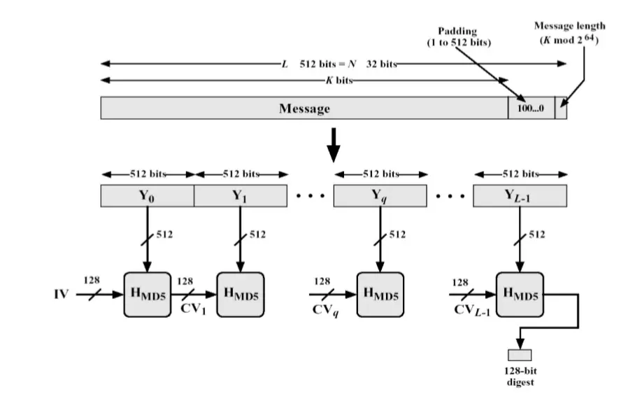

# 算法之MD5

MD5 即Message-Digest Algorithm 5 (信息-摘要算法5)。MD5 使用little-endian(小端模式)，输入任意不定长度信息，以 512-bit 进行分组，生成四个32-bit 数据，最后联合输出固定 128-bit 的信息摘要。

MD5 不是足够安全的。Hans Dobbertin在1996年找到了两个不同的512-bit 块,它们 在MD5 计算下产生相同的hash 值。至今还没有真正找到两个不同的消息，它们的MD5 的hash 值相等。

<!--more-->

## 基本流程




MD5 算法的基本过程为：

### 填充padding

在长度为Kbits 的原始消息数据尾部填充长度为Pbits 的标识 100…0，1< P <=512 (即至少要填充1个bit)，使得填充后的消息位 数为：(K + P) mod 512=448。注意到当K mod 512 =448时，需要P= 512。

### 填充长度

再向上述填充好的消息尾部附加K 值的低64位 (即K mod 2^64)， 最后得到一个长度位数为K + P+ 64= 0 (mod 512) 的消息。

把填充后的消息结果分割为L个512-bit 分组：Y0, Y1, …, YL-1。分组结果也可表示成N个32-bit 字M0, M1, …, MN-1，N= L * 16。

### 缓冲区初始化 

初始化一个128-bit 的MD 缓冲区，记为CVq，表示成4个32-bit 寄存器(A, B, C,D)；CV0= IV。迭代在MD 缓冲区进行，最后一 步的128-bit 输出即为算法结果。

初始状态为:

```
word A: 01 23 45 67
word B: 89 ab cd ef
word C: fe dc ba 98
word D: 76 54 32 10
```

16进制数：
```
int a := 0x67452301
int b := 0xEFCDAB89
int c := 0x98BADCFE
int d := 0x10325476
```

### 循环压缩 

我们首先定义了四个辅助函数，每个函数都输入三个 32 位数字并产生一个 32 位数字作为输出。

```
F = (B and C) or ((not B) and D)
G= (D and B) or ((not D) and C)
H= B xor C xor D
I= C xor (B or (not D))
```

然后使用正弦函数构建64元素的表K: 

```
for i from 0 to 63
    K[i] = floor(232 × abs (sin(i + 1)))
```

计算结果:

```
K[ 0.. 3] := { 0xd76aa478, 0xe8c7b756, 0x242070db, 0xc1bdceee }
K[ 4.. 7] := { 0xf57c0faf, 0x4787c62a, 0xa8304613, 0xfd469501 }
K[ 8..11] := { 0x698098d8, 0x8b44f7af, 0xffff5bb1, 0x895cd7be }
K[12..15] := { 0x6b901122, 0xfd987193, 0xa679438e, 0x49b40821 }
K[16..19] := { 0xf61e2562, 0xc040b340, 0x265e5a51, 0xe9b6c7aa }
K[20..23] := { 0xd62f105d, 0x02441453, 0xd8a1e681, 0xe7d3fbc8 }
K[24..27] := { 0x21e1cde6, 0xc33707d6, 0xf4d50d87, 0x455a14ed }
K[28..31] := { 0xa9e3e905, 0xfcefa3f8, 0x676f02d9, 0x8d2a4c8a }
K[32..35] := { 0xfffa3942, 0x8771f681, 0x6d9d6122, 0xfde5380c }
K[36..39] := { 0xa4beea44, 0x4bdecfa9, 0xf6bb4b60, 0xbebfbc70 }
K[40..43] := { 0x289b7ec6, 0xeaa127fa, 0xd4ef3085, 0x04881d05 }
K[44..47] := { 0xd9d4d039, 0xe6db99e5, 0x1fa27cf8, 0xc4ac5665 }
K[48..51] := { 0xf4292244, 0x432aff97, 0xab9423a7, 0xfc93a039 }
K[52..55] := { 0x655b59c3, 0x8f0ccc92, 0xffeff47d, 0x85845dd1 }
K[56..59] := { 0x6fa87e4f, 0xfe2ce6e0, 0xa3014314, 0x4e0811a1 }
K[60..63] := { 0xf7537e82, 0xbd3af235, 0x2ad7d2bb, 0xeb86d391 }
```

还有偏移量 s数组:

```
// rotation constants
private static final int S11 = 7;
private static final int S12 = 12;
private static final int S13 = 17;
private static final int S14 = 22;
private static final int S21 = 5;
private static final int S22 = 9;
private static final int S23 = 14;
private static final int S24 = 20;
private static final int S31 = 4;
private static final int S32 = 11;
private static final int S33 = 16;
private static final int S34 = 23;
private static final int S41 = 6;
private static final int S42 = 10;
private static final int S43 = 15;
private static final int S44 = 21;
```

#### 伪码


```
// 上述填充后的消息长度为N
For i = 0 to N/16-1 do

     /* Copy block i into X. */
     For j = 0 to 15 do
       Set X[j] to M[i*16+j].
     end /* of loop on j */

     /* Save A as AA, B as BB, C as CC, and D as DD. */
     AA = A
     BB = B
     CC = C
     DD = D

     /* Round 1. */
     /* Let [abcd k s i] denote the operation
          a = b + ((a + F(b,c,d) + X[k] + T[i]) <<< s). */
     /* Do the following 16 operations. */
     [ABCD  0  7  1]  [DABC  1 12  2]  [CDAB  2 17  3]  [BCDA  3 22  4]
     [ABCD  4  7  5]  [DABC  5 12  6]  [CDAB  6 17  7]  [BCDA  7 22  8]
     [ABCD  8  7  9]  [DABC  9 12 10]  [CDAB 10 17 11]  [BCDA 11 22 12]
     [ABCD 12  7 13]  [DABC 13 12 14]  [CDAB 14 17 15]  [BCDA 15 22 16]

     /* Round 2. */
     /* Let [abcd k s i] denote the operation
          a = b + ((a + G(b,c,d) + X[k] + T[i]) <<< s). */
     /* Do the following 16 operations. */
     [ABCD  1  5 17]  [DABC  6  9 18]  [CDAB 11 14 19]  [BCDA  0 20 20]
     [ABCD  5  5 21]  [DABC 10  9 22]  [CDAB 15 14 23]  [BCDA  4 20 24]
     [ABCD  9  5 25]  [DABC 14  9 26]  [CDAB  3 14 27]  [BCDA  8 20 28]
     [ABCD 13  5 29]  [DABC  2  9 30]  [CDAB  7 14 31]  [BCDA 12 20 32]

     /* Round 3. */
     /* Let [abcd k s t] denote the operation
          a = b + ((a + H(b,c,d) + X[k] + T[i]) <<< s). */
     /* Do the following 16 operations. */
     [ABCD  5  4 33]  [DABC  8 11 34]  [CDAB 11 16 35]  [BCDA 14 23 36]
     [ABCD  1  4 37]  [DABC  4 11 38]  [CDAB  7 16 39]  [BCDA 10 23 40]
     [ABCD 13  4 41]  [DABC  0 11 42]  [CDAB  3 16 43]  [BCDA  6 23 44]
     [ABCD  9  4 45]  [DABC 12 11 46]  [CDAB 15 16 47]  [BCDA  2 23 48]

     /* Round 4. */
     /* Let [abcd k s t] denote the operation
          a = b + ((a + I(b,c,d) + X[k] + T[i]) <<< s). */
     /* Do the following 16 operations. */
     [ABCD  0  6 49]  [DABC  7 10 50]  [CDAB 14 15 51]  [BCDA  5 21 52]
     [ABCD 12  6 53]  [DABC  3 10 54]  [CDAB 10 15 55]  [BCDA  1 21 56]
     [ABCD  8  6 57]  [DABC 15 10 58]  [CDAB  6 15 59]  [BCDA 13 21 60]
     [ABCD  4  6 61]  [DABC 11 10 62]  [CDAB  2 15 63]  [BCDA  9 21 64]

     /* Then perform the following additions. (That is increment each
        of the four registers by the value it had before this block
        was started.) */
     A = A + AA
     B = B + BB
     C = C + CC
     D = D + DD

   end /* of loop on i */
```

### 得出结果。

以 A 的低字节开始，以D的高字节结束的 ABCD 就是产出的消息摘要。

## MD5的碰撞概率

在分析MD5的碰撞概率前先介绍下生日问题：

在随机选择的一群人当中有两人的生日相同的概率。如果一个房间里有23个或23个以上的人，那么至少有两个人的生日相同的概率要大于50%；对于60或者更多的人，这种概率要大于99%。计算与此相关的概率被称为生日问题，在这个问题之后的数学理论已被用于设计著名的密码攻击方法：生日攻击。

假设有n个人在同一房间内，不考虑特殊因素，例如闰年、双胞胎，并且假设一年365日出生概率是均匀分布的。首先计算每个人的生日日期都不同的概率为：

```
(365 * 364 *... *(635-n+1)) /(365^n)
```

当n=23时，p(23,365)大约是0.507。

对于MD5 碰撞问题：平均而言，如果不尝试故意创建冲突，则需要对大约 2^64 个值进行哈希处理才能获得它们之间的单个冲突。如果看两个任意值，碰撞概率只有2^128。

但是已经有密码学家编写了[MD5 碰撞生成器的例子](https://github.com/brimstone/fastcoll)。虽然这个生成器仅仅用于构造两个文件, MD5相同但内容不同,不是从MD5值逆推出的,但是说明MD5碰撞不可靠已经足以了。(也就是说，单纯的将MD5(PassWord) 作为验证手段是不安全的。此时在工程角度来看，这正说明了加盐MD5(Password+salt)的重要作用)。


## 参考资料

- [1] [RFC 1321](https://www.ietf.org/rfc/rfc1321.txt)
- [2] [生日问题](https://zhuanlan.zhihu.com/p/123341996)

