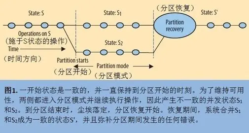

# 分布式系统理论-CAP

CAP定理(CAP theorem)，又被称作布鲁尔定理(Brewer's theorem)，它指出对于一个分布式计算系统来说，不可能同时满足以下三点:

- 一致性 (Consistency): 一个写操作返回成功，那么之后的读请求都必须读到这个新数据；如果返回失败，那么所有读操作都不能读到这个数据。所有节点访问同一份最新的数据。
- 可用性 (Availability): 保证每个请求都会收到关于它是成功还是失败的响应。无论您是要读取还是写入，您都会得到一些响应。
- 分区容错性 (Partition tolerance): 能容忍网络分区，在网络断开(不是延迟)的情况下，被分隔的节点仍能正常对外提供服务。

<!--more-->

## CAP理论介绍

网络分区: 分布式系统中，多个节点之间的网络本来是连通的，但是因为某些故障（比如部分节点网络出了问题）某些节点之间不连通了，整个网络就分成了几块区域。

当发生网络分区的时候，如果我们要继续服务，那么强一致性和可用性只能 2 选 1。也就是说当网络分区之后 P 是前提，决定了 P 之后才有 C 和 A 的选择。也就是说分区容错性(Partition tolerance)我们是必须要实现的。简而言之就是：CAP 理论中分区容错性 P 是一定要满足的，在此基础上，只能满足可用性 A 或者一致性 C。

分布式系统理论上不可能选择 CA 架构，只能选择 CP 或者 AP 架构。 举个例子：若系统出现“分区”，系统中的某个节点在进行写操作。为了保证 C， 必须要禁止其他节点的读写操作，这就和 A 发生冲突了。如果为了保证 A，其他节点的读写操作正常的话，那就和 C 发生冲突了。

选择 CP 还是 AP 的关键在于当前的业务场景，没有定论，比如对于需要确保强一致性的场景如银行一般会选择保证 CP 。另外，需要补充说明的一点是：如果网络分区正常的话（系统在绝大部分时候所处的状态），也就说不需要保证 P 的时候，C 和 A 能够同时保证。

## CAP理论扩展

CAP三种性质都可以在程度上衡量，并不是非黑即白的有或无。可用性显然是在0%到100%之间连续变化的，一致性分很多级别，连分区也可以细分为不同含义，如系统内的不同部分对于是否存在分区可以有不一样的认知。所以一致性和可用性并不是水火不容，非此即彼的。

### CAP 和延迟

CAP 理论的经典解释，是忽略网络延迟的，但在实际中延迟和分区紧密相关。CAP的本质是在超时期间发生的，在此期间程序必须做出一个基本决策——分区决策：

- 取消操作因而降低系统的可用性，还是
- 继续操作，以冒险损失系统一致性为代价

依靠多次尝试通信的方法来达到一致性，比如 Paxos 算法或者两阶段事务提交，仅仅是推迟了决策的时间。系统终究要做一个决定；无限期地尝试下去，本身就是选择一致性牺牲可用性的表现。

因此以实际效果而言，**分区相当于对通信的时限要求**。系统如果不能在时限内达成数据一致性，就意味着发生了分区的情况，必须就当前操作在 C 和 A 之间做出选择。这就从延迟的角度抓住了设计的核心问题：分区两侧是否在无通信的情况下继续其操作？

从这个实用的观察角度出发可以导出若干重要的推论。

- 第一，分区并不是全体节点的一致见解，因为有些节点检测到了分区，有些可能没有。
- 第二，检测到分区的节点即进入分区模式——这是优化 C 和 A 的核心环节。
- 最后，这个观察角度还意味着设计师可以根据期望中的响应时间，有意识地设置时限；时限设得越短，系统进入分区模式越频繁，其中有些时候并不一定真的发生了分区的情况，可能只是网络变慢而已。

> 有时候在跨区域的系统，放弃强一致性来避免保持数据一致所带来的高延迟是非常有意义的。

### ACID

Consistency常被认为就是数据库系统中提到的ACID的另一种表述，但其实ACID 的 C 和 A 字母所代表的概念不同于 CAP 的 C 和 A，此外选择可用性只部分地影响 ACID 约束。：

- Atomic: 一个用户请求要么成功、要么失败，不能处于中间状态。当我们考虑可用性的时候，没有理由去改变分区两侧操作的原子性。而且满足 ACID 定义的、高抽象层次的原子操作，实际上会简化分区恢复。
- Consistent: 一旦一个事务完成，将来的所有事务都必须基于这个完成后的状态。ACID 的 C 指的是事务不能破坏任何数据库规则，如键的唯一性。与之相比，CAP 的 C 仅指单一副本这个意义上的一致性，因此只是 ACID 一致性约束的一个严格的子集。ACID 一致性不可能在分区过程中保持，因此分区恢复时需要重建 ACID 一致性。推而广之，分区期间也许不可能维持某些不变性约束，所以有必要仔细考虑哪些操作应该禁止，分区后又如何恢复这些不变性约束。
- Isolated: 未完成的事务不会互相影响。隔离是 CAP 理论的核心：如果系统要求 ACID 隔离性，那么它在分区期间最多可以在分区一侧维持操作。事务的可串行性（serializability）要求全局的通信，因此在分区的情况下不能成立。只要在分区恢复时进行补偿，在分区前后保持一个较弱的正确性定义是可行的。
- Durable: 一旦一个事务完成，就是持久的。牺牲持久性没有意义，理由和原子性一样，虽然开发者有理由（持久性成本太高）选择 BASE 风格的软状态来避免实现持久性。这里有一个细节，分区恢复可能因为回退持久性操作，而无意中破坏某项不变性约束。但只要恢复时给定分区两侧的持久性操作历史记录，破坏不变性约束的操作还是可以被检测出来并修正的。通常来讲，让分区两侧的事务都满足 ACID 特性会使得后续的分区恢复变得更容易，并且为分区恢复时事务的补偿工作奠定了基本的条件。

### 一致性的作用范围

在一定的边界内状态是一致的，但超出了边界就无从谈起。比如在一个主分区内可以保证完备的一致性和可用性，而在分区外服务是不可用的。

分区期间，独立且能自我保证一致性的节点子集合可以继续执行操作，只是无法保证全局范围的不变性约束不受破坏。数据分片(sharding)就是这样的例子，设计师预先将数据划分到不同的分区节点，分区期间单个数据分片多半可以继续操作^[例如mysql的水平分表]。

相反，如果被分区的是内在关系密切的状态，或者有某些全局性的不变性约束非保持不可，那么最好的情况是只有分区一侧可以进行操作，最坏情况是操作完全不能进行。

考虑到跨区域时出现的高延迟，**在数据一致性上让步来换取更好性能的做法相对比较常见**。但是放弃一致性其实有隐藏负担，即需要明确了解系统中存在的不变性约束。满足一致性的系统有一种保持其不变性约束的自然倾向，即便设计师不清楚系统中所有的不变性约束，相当一部分合理的不变性约束会自动地维持下去。相反，当设计师选择可用性的时候，因为需要在分区结束后恢复被破坏的不变性约束，显然必须将各种不变性约束一一列举出来，

### 管理分区

怎样缓和分区对一致性和可用性的影响是对设计师的挑战。其关键是以非常明确、公开的方式去管理分区，不仅需要主动察觉分区的发生，还需要为分区期间所有可能受侵害的不变性约束预备专门的恢复过程和计划。管理分区有三个步骤：

- 检测到分区开始
- 明确进入分区模式，限制某些操作
- 当通信恢复后启动分区恢复过程

最后一步的目的是恢复一致性，以及补偿在系统分区期间程序产生的错误。

普通的操作都是顺序的原子操作，因此分区总是在两笔操作之间开始。一旦系统在操作间歇检测到分区发生，检测方一侧即进入分区模式。如果确实发生了分区的情况，那么一般分区两侧都会进入到分区模式，不过单方面完成分区也是可能的。

单方面分区要求在对方按需要通信的时候，本方要么能正确响应，要么不需要通信；总之操作不得破坏一致性。但不管怎么样，由于检测方可能有不一致的操作，它必须进入分区模式。采取了 quorum 决定机制的系统即为单方面分区的例子。其中一方拥有“法定通过节点数”，因此可以执行操作，而另一方不可以执行操作。

当系统进入到分区模式，它有两种可行的策略。其一是限制部分操作，因此会削弱可用性。其二是额外记录一些有利于后面分区恢复的操作信息。系统可通过持续尝试恢复通信来察觉分区何时结束。

#### 哪些操作可以执行？

决定限制哪些操作，主要取决于系统需要维持哪几项不变性约束。在给定了不变性约束条件之后，设计师需要决定在分区模式下，是否坚持不触动某项不变性约束，抑或以事后恢复为前提去冒险触犯它。

例如，对于“表中键的惟一性”这项不变性约束，设计师一般都选择在分区期间放宽要求，容许重复的键。重复的键很容易在恢复阶段检查出来，假如重复键可以合并，那么设计师不难恢复这项不变性约束。

对于分区期间必须维持的不变性约束，设计师应当禁止或改动可能触犯该不变性约束的操作。信用卡扣费等具有外部化特征的事件常以这种方式工作。适合这种情况的策略，是记录下操作意图，然后在分区恢复后再执行操作。

对分区两侧跟踪操作历史的最佳方式是使用版本向量，版本向量可以反映操作间的因果依赖关系。向量的元素是（节点, 逻辑时间）数值对，分别对应一个更新了对象的节点和它最后更新的时间。对于同一对象的两个给定的版本 A 和 B，当所有节点的版本向量一致有 A 的时间大于或等于 B 的时间，且至少有一个节点的版本向量有 A 的时间较大，则 A 新于 B。

如果不可能对版本向量排序，那么更新操作是并发的，而且有可能出现不一致的情况。只要知道分区两侧版本向量，系统不难判断哪些操作的执行顺序是确定的，哪些操作是并发的。当设计师选择可用性优先，一般最多只能将一致性收紧到这样的程度。

#### 分区恢复

到了某个时刻，通信恢复，分区结束。由于每一侧在分区期间都是可用的，其状态仍继续向前进展，但是分区会推迟某些操作并侵犯一些不变性约束。分区结束的时刻，系统知道分区两侧的当前状态和历史记录，因为它在分区模式下记录了详尽的日志。当前状态不如历史记录有价值，因为通过历史记录，系统可以判断哪些操作违反了不变性约束，产生了何种外在的后果（如发送了响应给用户）。在分区恢复过程中，设计师必须解决两个问题：

- 分区两侧的状态最终必须保持一致，
- 并且必须补偿分区期间产生的错误。

通常矫正当前状态最简单的解决方法是回退到分区开始时的状态，以特定方式推进分区两侧的一系列操作，并在过程中一直保持一致的状态。大部分系统都存在不能自动合并的冲突。比如，CVS 时不时有些冲突需要手动介入，带离线模式的 wiki 系统总是把冲突留在产生的文档里给用户处理。

还有一种办法是让操作可以交换顺序，这种办法最接近于形成一种解决自动状态合并问题的通用框架[Conflict-free Replicated Data Types](https://readpaper.com/paper/1516319412)。此类系统将线性合并各日志并重排操作的顺序，然后执行。操作满足交换率，意味着操作有可能重新排列成一种全局一致的最佳顺序。只允许满足交换率的操作这个想法实现起来没那么容易。比如加法操作可以交换顺序，但是加入了越界检查的加法就不行了。

##### 补偿错误

比计算分区后状态更难解决的问题是如何弥补分区期间造成的错误。跟踪和限制分区模式下的操作，这两种措施足以使设计师确知哪些不变性约束可能被违反，然后分别为它们制定恢复策略。一般系统在分区恢复期间检查违反情况，修复工作也必须在这段时间内完成。

恢复不变性约束的方法有很多，粗陋一点的办法如“最后写入者胜”（因此会忽略部分更新），聪明一点的办法如合并操作和人为跟进事态（human escalation）。人为跟进事态的例子如飞机航班“超售”的情形：可以把乘客登机看作是对之前售票情况的分区恢复，必须恢复“座位数不少于乘客数”这项不变性约束。那么当乘客太多的时候，有些乘客将失去座位，客服最好能设法补偿他们。

曾经有人正式研究过将补偿性事务作为处理长寿命事务（long-lived transactions）的一种手段。长时间运行的事务会面临另一种形态的分区决策：是长时间持有锁来保证一致性比较好呢？还是及早释放锁向其他事务暴露未提交的数据，提高并发能力比较好呢？比如在单笔事务中更新所有的员工记录就是一个典型例子。按照一般的方式串行化这笔事务，将导致所有的记录都被锁定，阻止并发。而补偿性事务采取另一种方式，它将大事务拆成多个分别提交的子事务。如果要中止大事务，系统必须发起一笔新的、起纠正作用的事务，逐一撤销所有已经提交的子事务，这笔新事务就是所谓的补偿性事务。

总的来说，补偿性事务的目的是避免中止其他用了未正确提交数据的事务（即不允许级联取消）。这种方案不依赖串行化或隔离的手段来保障正确性，其正确性取决于事务序列对状态和输出所产生的净影响。那么，经过补偿，数据库的状态究竟是不是相当于那些子事务根本没执行过一样呢？考虑等价必须连外在行为也包括在内；举个例子，把重复扣取的交易款退还给顾客，很难说成等于一开始就没多收顾客的钱，但从结果上看勉强算扯平了。分区恢复也延续同样的思路。虽然服务不一定总能直接撤销其错误，但起码承认错误并做出新的补偿行为。怎样在分区恢复中运用这种思路效果最好，这个问题没有固定的答案。

## BASE 理论

BASE 是 Basically Available（基本可用）、Soft-state（软状态） 和 Eventually Consistent（最终一致性） 三个短语的缩写。BASE 理论是对 CAP 中一致性 C 和可用性 A 权衡的结果，是对CAP中 AP的一个延伸，其来源于对大规模互联网系统分布式实践的总结，是基于 CAP 定理逐步演化而来的，它大大降低了我们对系统的要求。

BASE 理论的核心思想是即使无法做到强一致性，但每个应用都可以根据自身业务特点，采用适当的方式来使系统达到最终一致性。也就是牺牲数据的一致性来满足系统的高可用性，系统中一部分数据不可用或者不一致时，仍需要保持系统整体“主要可用”。

BASE 理论本质上是对 CAP 的延伸和补充，更具体地说，是对 CAP 中 AP 方案的一个补充。AP 方案只是在系统发生分区的时候放弃强一致性，而不是永远放弃一致性。在分区故障恢复后，系统应该达到最终一致性。这一点其实就是 BASE 理论延伸的地方。

### 基本可用

基本可用是指分布式系统在出现不可预知故障的时候，允许损失部分可用性。但是，这绝不等价于系统不可用。

基本可用的核心特性：
- 部分功能降级：在高负载或部分节点失败的情况下，系统可能关闭次要功能，保障主要功能的正常运行。例如：关闭用户评论、推荐算法等非核心功能，确保支付流程可用。
- 性能退化：系统在负载过大时可能会牺牲响应速度，优先保证在线服务的可用性（例如请求延迟增加，但不宕机）。
- 容错能力：系统通过冗余和分布式架构提升容错性，即便部分组件出问题，整体服务仍能继续运行。

基本可用的实现方式：

- 降级服务（Graceful Degradation）：在资源紧张时优先保障核心功能，并动态关闭非核心功能。
- 读写分离：优化读操作性能，通过缓存或异步写操作降低负载。
- 数据冗余：使用多节点数据复制保证数据可访问性，即使个别节点失效也不会影响整体服务。
- 负载均衡：自动分流请求至健康的节点，避免资源耗尽导致服务不可用。

### 软状态

软状态指允许系统中的数据存在中间状态（CAP 理论中的数据不一致），并认为该中间状态的存在不会影响系统的整体可用性，即允许系统在不同节点的数据副本之间进行数据同步的过程存在延时。

Soft State 的核心特性：

- 状态的临时性：系统在运行过程中，某些数据状态可能为暂时的、不稳定的。例如缓存中的数据在某一时刻可能与主数据库不一致，但短时间后会自动进行更新。
- 允许数据不一致：系统不同节点间的状态可以暂时不一致。不同节点上的数据依赖同步协议在后台异步执行。
- 动态变化：数据可能由于外部输入、定时任务或同步协议而动态更新。数据的软状态能够降低系统的一致性压力。
- 最终一致性：软状态支持“最终一致性原则”，即经过一段时间后，整个系统最终达到一致状态，而不需要强制性实时同步。

Soft State 的实现方式：

- 临时缓存 (Temporary Cache)：用于确保数据请求提高性能，允许缓存中数据短时间内过期或不一致。
- 分布式协作协议：系统内部使用如 Gossip 协议，节点间交换更新信息，逐步传播状态。
- 超时机制 (Timeout Mechanisms)：设置数据的有效期或一致性检查时限。
- 后台数据同步 (Background Sync)：通过异步方式完成节点间的数据修复与更新工作。

### 最终一致性

最终一致性强调的是系统中所有的数据副本，在经过一段时间的同步后，最终能够达到一个一致的状态。因此，最终一致性的本质是需要系统保证最终数据能够达到一致，而不需要实时保证系统数据的强一致性。

最终一致性的核心特性：

- 延迟收敛：数据同步和修复处理可能需要一定的时间，但只要没有新的数据更改，系统最终会达到一致状态（即全局一致性）。
- 弱实时一致性：数据更新后，读操作可能一段时间内返回旧数据，但会随着时间的推移返回最新数据。
- 依赖同步机制：系统之间通过异步消息传递、增量数据更新或日志回放等机制，实现数据传播和同步。

最终一致性的实现方式：

- 版本控制 (Version Control)：使用数据的版本号或时间戳，标记最新更新，确保多节点之间更新顺序一致。
- 日志复制 (Log Replication)：节点间通过日志机制传播数据变更，确保所有节点最终拥有相同的日志。
- 冲突检测与解决 (Conflict Resolution)：在多节点写入冲突的情况下，通过算法（如最后写入优先、数据合并等）解决冲突并统一数据。
- Gossip 协议：节点使用类似“流言传播”的方式互相同步状态，逐渐到达一致。

## 参考

- [1] [CAP 理论十二年回顾："规则"变了](https://www.infoq.com/articles/cap-twelve-years-later-how-the-rules-have-changed/)

