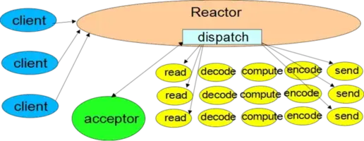
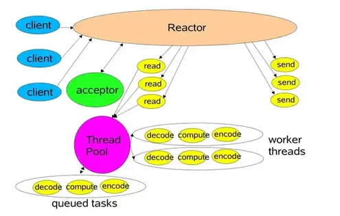
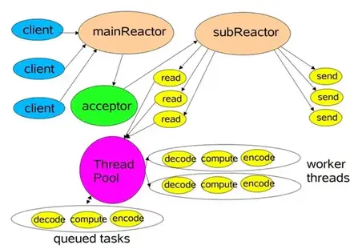

# Scalable IO in Java

本文是 Doug Lea 的 "Scalable IO in Java" 读书笔记

<!--more-->

## 可扩展的网络服务

在一般的网络或分布式服务等应用程序中，大都具备一些相同的处理流程，例如：

1. 读取请求数据;
2. 对请求数据进行解码;
3. 对数据进行处理;
4. 对回复数据进行编码;
5. 发送回复;

当然在实际应用中每一步的运行效率都是不同的，例如其中可能涉及到xml解析、文件传输、web页面的加载、计算服务等不同功能。

### 经典服务设计


每一个处理程序(上图中的handler)都拥有自己的线程。

```java
public class ClassicServerSocketLoop {

    private static final int PORT = 1992;
    private static final int MAX_INPUT = 1024;

    class Server implements Runnable {

        @Override
        public void run() {
            try (ServerSocket ss = new ServerSocket(PORT)) {
                while (!Thread.interrupted()) {
                    // 这里可使用单线程处理，或者线程池管理多个线程
                    new Thread(new Handler(ss.accept())).start();
                }
            } catch (IOException ignored) {
                // ignored
            }
        }
    }

    static class Handler implements Runnable {
        final Socket socket;

        Handler(Socket socket) {
            this.socket = socket;
        }

        @Override
        public void run() {
            try {
                byte[] input = new byte[MAX_INPUT];
                socket.getInputStream().read(input);
                byte[] output = process(input);
                socket.getOutputStream().write(output);
            } catch (IOException ignored) {
                // ignored
            }
        }

        private byte[] process(byte[] input) {
            // 业务处理逻辑
            return new byte[0];
        }
    }
}
```

### 构建高性能可伸缩的IO服务

在构建高性能可伸缩IO服务的过程中，我们希望达到以下的目标：

1. 能够在海量负载连接情况下优雅降级；
2. 能够随着硬件资源的增加，性能持续改进；
3. 具备低延迟、高吞吐量、可调节的服务质量等特点；

而分而治之(Divide and Conquer)通常是实现可伸缩目标的最有效方式。

分治具有以下几个机制：

1. 将一个完整处理过程分解为一个个细小的任务；
2. 每个任务执行相关的动作且不产生阻塞；
3. 在任务执行状态被触发时才会去执行，例如只在有数据时才会触发读操作；

在一般的服务开发当中，IO事件通常被当做任务执行状态的触发器使用，在hander处理过程中主要针对的也就是IO事件；

java.nio包就很好的实现了上述的机制：

1. 非阻塞的读和写
2. 通过感知IO事件分发任务的执行

所以结合一系列基于事件驱动模式的设计，给高性能IO服务的架构与设计带来丰富的可扩展性；

## 事件驱动处理

事件驱动设计通常比其他同类的可选设计更加有效:

* 所需资源更少: 无需为每个客户端分配一个线程
* 更少的开销: 更少的上下文切换, 更少的同步操作
* 但是分发会更慢: 必须手动将事件和处理程序绑定

事件驱动设计在编码上更加复杂:

* 必须将一个完整的任务切分为简单的非阻塞任务
    * 与GUI事件启动动作相似
    * 不能消除所有的阻塞, 比如: GC, 页错误等
* 必须持续跟踪服务的逻辑状态

下图是AWT中事件驱动设计的一个简单示意图，可以看到，在不同的架构设计中的基于事件驱动的IO操作使用的基本思路是一致的；


## reactor模式

响应IO事件时, reactor将事件分发给合适的处理器处理——与AWT线程相似

* 处理器执行非阻塞操作——与AWT的ActionListeners相似
* 将事件处理器绑定到具体事件——与AWT的 addActionListener操作相似

> 参考 Schmidt et al, Pattern-Oriented Software Architecture, Volume 2 (POSA2), 或者Richard Stevens's的网络编程书籍, 以及Matt Welsh's的SEDA架构等.

### 基础版本



以上是单线程版本的Reactor设计模式。首先我们明确下java.nio中相关的几个概念：

* 渠道channel: channel是文件, socket等的连接, 支持非阻塞读
* 缓冲buffer: buffer是数组一样的对象, 可直接被channel读写
* 选择器selector: select可监控注册在其上的channel集合IO事件的发生
* selectionKey: selectionKey维护IO事件的状态以及事件和处理器的绑定关系(原本的selection并不支持维护绑定关系的功能, 只是reactor模式利用selectionKey的attachment特性实现了这一功能而已)

接下来我们一步步看下基于Reactor模式的服务端设计代码示例：

首先是Rector线程的初始化。
```java
class Reactor implements Runnable { 
    final Selector selector;
    final ServerSocketChannel serverSocket;
    // 初始化
    Reactor(int port) throws IOException {
        selector = Selector.open();
        serverSocket = ServerSocketChannel.open();
        serverSocket.socket().bind(new InetSocketAddress(port));
        serverSocket.configureBlocking(false);
        SelectionKey sk = serverSocket.register(selector, SelectionKey.OP_ACCEPT); //注册accept事件
        sk.attach(new Acceptor()); //调用Acceptor()为回调方法
    }
    
    public void run() { 
        try {
            while (!Thread.interrupted()) {//循环
                selector.select();
                Set selected = selector.selectedKeys();
                Iterator it = selected.iterator();
                while (it.hasNext())
                    dispatch((SelectionKey)(it.next()); //dispatch分发事件
                selected.clear();
            }
        } catch (IOException ex) { /* ... */ }
    }
    
    void dispatch(SelectionKey k) {
        Runnable r = (Runnable)(k.attachment()); //调用SelectionKey绑定的调用对象
        if (r != null)
            r.run();
    }
    
    // Acceptor 连接处理类
    class Acceptor implements Runnable { // inner
        public void run() {
            try {
                SocketChannel c = serverSocket.accept();
                if (c != null)
                new Handler(selector, c);
            }
            catch(IOException ex) { /* ... */ }
        }
    }
}
```

然后是Handler处理类的初始化;

```java
final class Handler implements Runnable {
    final SocketChannel socket;
    final SelectionKey sk;
    ByteBuffer input = ByteBuffer.allocate(MAXIN);
    ByteBuffer output = ByteBuffer.allocate(MAXOUT);
    static final int READING = 0, SENDING = 1;
    int state = READING;
    
    Handler(Selector sel, SocketChannel c) throws IOException {
        socket = c;
        c.configureBlocking(false);
        // Optionally try first read now
        sk = socket.register(sel, 0);
        sk.attach(this); //将Handler绑定到SelectionKey上
        sk.interestOps(SelectionKey.OP_READ);
        sel.wakeup();
    }
    boolean inputIsComplete() { /* ... */ }
    boolean outputIsComplete() { /* ... */ }
    void process() { /* ... */ }
    
    public void run() {
        try {
            if (state == READING) read();
            else if (state == SENDING) send();
        } catch (IOException ex) { /* ... */ }
    }
    
    void read() throws IOException {
        socket.read(input);
        if (inputIsComplete()) {
            process();
            state = SENDING;
            // Normally also do first write now
            sk.interestOps(SelectionKey.OP_WRITE);
        }
    }
    void send() throws IOException {
        socket.write(output);
        if (outputIsComplete()) sk.cancel(); 
    }
}
```

另一种handler实现,使用GoF设计模式, 状态模式: 再绑定合适的处理器作为selectionKey的attchment.

```java
final class Handler implements Runnable {
    final SocketChannel socket;
    final SelectionKey sk;

    static final int MAX_IN = 1024;
    static final int MAX_OUT = 1024;
    ByteBuffer input = ByteBuffer.allocate(MAX_IN);
    ByteBuffer output = ByteBuffer.allocate(MAX_OUT);
    static final int READING = 0, SENDING = 1;
    int state = READING;

    public Handler(Selector sel, SocketChannel c) throws IOException {
        socket = c;
        c.configureBlocking(false);
        // 也可以注解注册SelectionKey.OP_READ; 这里先不关心任何事件， 后面注册读事件
        sk = socket.register(sel, 0);
        sk.attach(this);
        sk.interestOps(SelectionKey.OP_READ);
        sel.wakeup();
    }

    boolean inputIsComplete() { /* ... */ }
    boolean outputIsComplete() { /* ... */ }
    void process() { /* ... */ }

    @Override
    public void run() {
        try {
            socket.read(input);
            if (inputIsComplete()) {
                process();
                sk.attach(new Sender());
                sk.interestOps(SelectionKey.OP_WRITE);
                sk.selector().wakeup();
            }
        } catch (IOException ignored) {
            // ignored
        }
    }

    class Sender implements Runnable {

        @Override
        public void run() {
            try {
                socket.write(output);
                if (outputIsComplete()) {
                    sk.cancel();
                }
            } catch (IOException ignored) {
                // ignored.
            }
        }
    }
}
```

### 多线程版本

在多处理器场景下，为实现服务的高性能我们可以有目的的采用多线程模式：

* 增加Worker线程，专门用于处理非IO操作，因为通过上面的程序我们可以看到，反应器线程需要迅速触发处理流程，而如果处理过程也就是process()方法产生阻塞会拖慢反应器线程的性能，所以我们需要把一些非IO操作交给Woker线程来做；

* 拆分并增加反应器Reactor线程，一方面在压力较大时可以饱和处理IO操作，提高处理能力；另一方面维持多个Reactor线程也可以做负载均衡使用；线程的数量可以根据程序本身是CPU密集型还是IO密集型操作来进行合理的分配；

#### 工作线程

* 卸载非IO处理, 以此加速reactor线程: 类似于 POSA2 Proactor设计
* 比将计算密集型处理重构为事件驱动形式更为简单
    * 还应该是纯非阻塞计算, 足够的任务逻辑来抵消开销
* 但是与IO处理同时发生会更难
    * 最好能在第一时间将所有输入读入缓冲区（这里我理解的是最好一次性读取缓冲区数据，方便异步非IO操作处理数据）
* 使用线程池, 便于调整和控制
    * 一般情况下所需的线程数少于客户端数量

下面是Reactor多线程设计模式的一个示意图与示例代码（我们可以看到在这种模式中在Reactor线程的基础上把非IO操作放在了Worker线程中执行）



```java
// 使用线程池的handler
static class PoolHandler implements Runnable {

    final SocketChannel socket;
    final SelectionKey sk;

    static ExecutorService pool = Executors.newFixedThreadPool(100);
    static final int PROCESSING = 3;
    static final int MAX_IN = 1024;
    static final int MAX_OUT = 1024;
    ByteBuffer input = ByteBuffer.allocate(MAX_IN);
    ByteBuffer output = ByteBuffer.allocate(MAX_OUT);
    static final int READING = 0, SENDING = 1;
    int state = READING;

    public PoolHandler(Selector sel, SocketChannel c) throws IOException {
        socket = c;
        c.configureBlocking(false);
        // 也可以注解注册SelectionKey.OP_READ; 这里先不关心任何事件， 后面注册读事件
        sk = socket.register(sel, 0);
        sk.attach(this);
        sk.interestOps(SelectionKey.OP_READ);
        sel.wakeup();
    }

    boolean inputIsComplete() {
        // 加入实现
        return true;
    }

    boolean outputIsComplete() {
        // 加入实现
        return true;
    }

    void process() {
        // 加入实现
    }

    synchronized void read() throws IOException {
        socket.read(input);
        if (inputIsComplete()) {
            state = PROCESSING;
            // 使用线程池处理业务
            pool.execute(new Processor());
        }
    }

    synchronized void write() throws IOException {
        socket.write(output);
        if (outputIsComplete()) {
            sk.cancel();
        }
    }

    synchronized void processAndHandOff() {
        process();
        // or rebind attachment
        state = SENDING;
        sk.interestOps(SelectionKey.OP_WRITE);
    }


    @Override
    public void run() {
        try {
            if (SENDING == state) {
                write();
            } else if (READING == state) {
                read();
            }
        } catch (IOException ignored) {
            // ignored.
        }
    }

    class Processor implements Runnable {
        @Override
        public void run() {
            processAndHandOff();
        }
    }
}
```

当你把非IO操作放到线程池中运行时，你需要注意以下几点问题：

1. 任务之间的协调与控制，每个任务的启动、执行、传递的速度是很快的，不容易协调与控制；
2. 每个hander中dispatch的回调与状态控制；
3. 不同线程之间缓冲区的线程安全问题；
4. 需要任务返回结果时，任务线程等待和唤醒状态间的切换；

为解决上述问题可以使用PooledExecutor线程池框架，这是一个可控的任务线程池，主函数采用execute(Runnable r)，它具备以下功能，可以很好的对池中的线程与任务进行控制与管理：

1. 可设置线程池中最大与最小线程数；
2. 按需要判断线程的活动状态，及时处理空闲线程；
3. 当执行任务数量超过线程池中线程数量时，有一系列的阻塞、限流的策略；

### 基于多个反应器的多线程模式

这是对上面模式的进一步完善，使用反应器线程池，一方面根据实际情况用于匹配调节CPU处理与IO读写的效率，提高系统资源的利用率，另一方面在静态或动态构造中每个反应器线程都包含对应的Selector,Thread,dispatchloop,下面是一个简单的代码示例与示意图（Netty就是基于这个模式设计的，一个处理Accpet连接的mainReactor线程，多个处理IO事件的subReactor线程）

```java
Selector[] selectors; // also create threads
int next = 0;
class Acceptor { // ...
    public synchronized void run() { ...
        Socket connection = serverSocket.accept();
        if (connection != null)
            new Handler(selectors[next], connection);
        if (++next == selectors.length) next = 0;
    }
}
```



在服务的设计当中，我们还需要注意与java.nio包特性的结合：

* 注意线程安全，每个selectors 对应一个Reactor 线程，并将不同的处理程序绑定到不同的IO事件，在这里特别需要注意线程之间的同步；
* java nio中文件传输的方式：
    * Memory-mapped files 内存映射文件的方式，通过缓存区访问文件；
    * Direct buffers直接缓冲区的方式，在合适的情况下可以使用零拷贝传输，但同时这会带来初始化与内存释放的问题（需要池化与主动释放）;


## proactor模式


介绍一下 Proactor 模式的工作流程：

- Proactor Initiator 负责创建 Proactor 和 Handler 对象，并将 Proactor 和 Handler 都通过Asynchronous Operation Processor 注册到内核；
- Asynchronous Operation Processor 负责处理注册请求，并处理 I/O 操作；
- Asynchronous Operation Processor 完成 I/O 操作后通知 Proactor；
- Proactor 根据不同的事件类型回调不同的 Handler 进行业务处理；
- Handler 完成业务处理；

> Proactor关注的不是就绪事件，而是完成事件，这是区分Reactor模式的关键点。

Proactor 性能确实非常强大，效率也高，但是同样存在以下缺点：

1. 内存的使用：缓冲区在读或写操作的时间段内必须保持住，可能造成持续的不确定性，并且每个并发操作都要求有独立的缓存，相比Reactor模型，在Socket已经准备好读或写前，是不要求开辟缓存的；
2. 操作系统的支持：Windows 下通过一套完整的支持 socket 的异步编程接口，也就是通过 IOCP 实现了真正的异步，但 Linux 系统下的异步 IO 还不完善，aio 系列函数是由 POSIX 定义的异步操作接口，不是真正的操作系统级别支持的，而是在用户空间模拟出来的异步，并且仅仅支持基于本地文件的 aio 异步操作，网络编程中的 socket 是不支持的。因此，Linux 系统下高并发网络编程都是以 Reactor 模型为主

## 基于连接的扩展

非单次服务请求场景
1. 客户端连接
2. 客户端发送一系列请求/消息
3. 客户端断开连接

例如，数据库和事务监控；多个参与者的游戏, 聊天服务等。可以扩展基本的网络服务模式。有以下常见模式:

- 服务端处理大量长期连接的客户端
- 记录客户端和会话状态
- 跨主机分布式服务

## Java NIO 非阻塞IO API 一览

* Buffer: ByteBuffer/CharBuffer/LongBuffer等
* Channel: 
    * SelectableChannel
    * SocketChannel
    * ServerSocketChannel
    * FileChannel
* Selector & SelectionKey

> 这一部分后面会有一个系列介绍。


## 参考

- [1] [Scalable IO in Java](http://gee.cs.oswego.edu/dl/cpjslides/nio.pdf)

