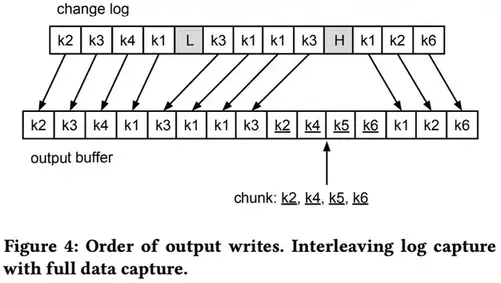

# DBLog:一款通用的变化数据捕获框架

本篇是论文[DBLog: A Watermark Based Change-Data-Capture Framework](https://arxiv.org/pdf/2010.12597.pdf)的中文简单翻译
<!--more-->

应⽤程序使⽤多个异构数据库是⼀种常⻅的模式，其中每个数据库都⽤于满⾜特定需求，例如存储规范形式的数据或提供⾼级搜索功能。因此，对于应⽤程序来说，需要保持多个数据库同步。我们观察到了⼀系列试图解决这个问题的不同模式，例如双写和分布式事务。然⽽，这些⽅法在可行性、稳健性和维护⽅⾯存在局限性。最近出现的另⼀种⽅法是利⽤变更数据捕获 (CDC) 从数据库的事务⽇志中捕获更改的行，并最终以低延迟将它们传递到下游。为了解决数据同步问题，还需要复制数据库的完整状态，⽽事务⽇志通常不包含完整的更改历史记录。同时，有些⽤例需要事务⽇志事件的⾼可⽤性，以便数据库尽可能保持同步。

为了应对上述挑战，我们开发了⼀种新颖的 CDC数据库框架，即 DBLog。 DBLog 利⽤基于⽔印的⽅法，允许我们将事务⽇志事件与我们直接从表中选择的行交错以捕获完整状态。我们的解决⽅案允许⽇志事件继续进行，⽽不会在处理选择时停⽌。可以随时在所有表、特定表或表的特定主键上触发选择。 DBLog 以块的形式执行选择并跟踪进度，允许它们暂停和恢复。⽔印⽅法不使⽤锁，对源的影响最⼩。 DBLog⽬前被 Netflix 的数⼗个微服务⽤于⽣产。

关键字: 
- databases
- replication
- change-data-capture
## 引言 

Netfix 使⽤数百个微服务，每天在数据层执行数万亿次操作。由于没有⼀款数据库设计适合所有的需求，因此每个微服务都可能利⽤多个异构的数据库。例如，⼀项服务可以使⽤MySQL、PostgreSQL、Aurora 或 Cassandra 来处理操作数据，并使⽤ Elasticsearch 来提供索引功能。为了能够使多个数据库保持同步，我们开发了⼀个数据丰富和同步平台，即 Delta [7](#refer-anchor-7)。关键要求之⼀是从源到派⽣存储的传播延迟低，并且事件流⾼可⽤。实现这⼀⽬标的⼀个关键要求是拥有变更数据捕获(CDC)，它允许从数据库中近乎实时地捕获更改的行，并最终将这些行传播给下游消费者[11](#refer-anchor-11)。在需要在多个异构数据库间保持同步的用例中和解决双写，分布式事务带来的挑战[13](#refer-anchor-13)的⽤例中，CDC 变得越来越流行。

在数据库系统中，事务⽇志通常具有有限的保留期，并且不能保证包含完整的更改历史记录。因此，还需要捕获数据库的完整状态。在Netflix 的⽣产中操作数据同步时，我们确定了与完整状态捕获有关的⼀些要求。我们想要

- (a) 在任何时间点触发完整的状态捕获。这是因为完整状态可能不仅在最初需要，⽽且可能在之后的任何时间都需要。例如，如果数据库是从备份中恢复的，或者在下游存在数据丢失或损坏时进行修复。在某些情况下，只需要修复⼀部分数据，例如，如果⼀组特定的行已被识别为下游损坏。
- (b) 随时暂停或恢复，以便在重新启动进程后，对于⼤型表来说，完整状态捕获不需要从头开始。 
- (c) 并排捕获事务⽇志事件和完整状态，⽽不会停⽌其中之⼀。有些⽤例需要事务⽇志事件的⾼可⽤性，以便将到源的复制滞后保持在最低限度。
- (d) 通过在将事件传输到派⽣数据存储时保留历史顺序来防⽌时间穿越。这样，较早版本的行（如会员帐⼾的住址）不会在较新版本之后交付。因此，解决⽅案必须以保留更改历史的⽅式结
合事务⽇志事件和完整状态。 
- (e) 将此作为⼀个平台。因此，最⼤限度地减少对源数据库的影响⾄关重要。否则，这可能会影响平台的采⽤，尤其是对于具有⾼流量的⽤例。在这⽅⾯，我们希望避免使⽤可能阻塞应⽤程序写⼊流量的表锁等SQL原语。 
- (f) 跨平台支持我们在⽣产中使⽤的各种关系数据库系统 (RDMBS) 的功能，例如 MySQL、PostgreSQL、Aurora [19](#refer-anchor-19)等。为了实现这⼀点，我们希望避免使⽤供应商特定的功能。

基于这些需求，我们开发了 DBLog。 DBLog作为⼀个进程运行，并利⽤基于⽔印的⽅法，允许将事务⽇志事件与我们直接从表中选择的行交错，以捕获数据库的完整状态。我们的解决⽅案允许⽇志事件继续进行，⽽不会在执行选择时停⽌。可以随时在所有表、特定表或表的特定主键上触发选择。

DBLog 处理块的选择并跟踪进度且存储在状态中(当前为 Zookeeper)，允许它们暂停并从最后⼀个完成的块恢复。⽔印⽅式不使⽤表锁，因此对源数据库的影响最⼩。 DBLog 使⽤相同的格式将捕获的事件传递到输出中，⽆论来源是事务⽇志还是表查询。输出可以是像 Kafka [21](#refer-anchor-21)这样的流，如果有多个事件消费者，这是⼀种常⻅的选择。但是 DBLog 也可以直接写⼊数据存储或API. DBLog 它的设计还考虑了⾼可⽤性（HA），使⽤了主备架构，其中同一时间⼀个 DBLog 进程处于活动状态，多个备进程处于待机状态，如果需要恢复⼯作，可以接管。因此，下游消费者有信⼼在源发⽣更改后⽴即接收行。图 1 描述了 DBLog 的⾼级架构。

## 相关工作

我们评估了⼀系列现有产品，例如： Databus[8](#refer-anchor-8)、Debezium [10](#refer-anchor-10)、Maxwell[22](#refer-anchor-22)、 MySQLStreamer[15](#refer-anchor-15)、 SpinalTapr[6](#refer-anchor-6)和Wormholer[16](#refer-anchor-16)。现有的解决⽅案在从事务⽇志中捕获事件⽅⾯是相似的，并且使⽤相同的底层协议和 API，例如 MySQL 的 binlog 复制协议或PostgreSQL 的复制槽。捕获的事件被序列化为专有的事件格式并发送到通常是Kafka 的输出。SpinalTap 和 Wormhole 等⼀些解决⽅案仅提供⽇志处理，⽽没有内置的捕获数据库完整状态的能力，在这种情况下，需要在外部处理完整状态捕获。现有的解决⽅案具有捕获完整状态的内置功能。由于事务⽇志通常保留有限，因此不能⽤于重建完整的源数据集。现有产品通过不同的权衡以不同的⽅式解决这个问题：

Databus[8](#refer-anchor-8)有⼀个引导服务，它从源读取事务⽇志事件并将它们存储在⼀个单独的数据库中。如果下游消费者需要初始化或进行恢复，则可以访问引导服务。在引导之后，消费者开始处理数据源引导之前的时间的⽇志事件，以便有重叠并且不会丢失任何事件。来⾃⽇志的追赶可能导致时间穿越，其中来⾃引导程序的行状态可能具有更新的行状态，之后从⽇志中捕获较旧的状态。最终将从事务⽇志中发现最新状态。

Debezium[10](#refer-anchor-10)通过使⽤表锁和在⼀个事务中对所有表运行查询来捕获 MySQL 和 PostgreSQL 的⼀致快照。⼀旦查询完了所有现有行，然后从事务之后的时间开始捕获事务⽇志中的事件。取决于实现和数据库，这种锁定的持续时间可以很短，也可以持续整个查询过程。例如 MySQL RDS[10](#refer-anchor-10)。在后⼀种情况下，写⼊流量被阻塞，直到所有行都被查询完成，这对于⼤型数据库来说可能是⼀个延⻓的时间段。

在 Maxwell[22](#refer-anchor-22)中，通过暂停事务⽇志处理来执行转储，然后从所需的表中查询行。之后，⽇志事件处理恢复。这种⽅法容易发⽣时间穿越，其中查询有可能返回行的更新版本值。

MySQLStreamer[15](#refer-anchor-15)在源头创建每个表的副本，即副本表。然后，原始表中的行以块的形式插⼊到复制表中，从⽽形成插⼊的事务⽇志条⽬。复制表是使⽤ MySQL黑洞引擎创建的，因此插⼊不会占⽤表空间，同时仍会⽣成事务⽇志事件。锁定⽤于确保不违反历顺序。 MySQLStreamer 服务然后使⽤来⾃事务⽇志的事件并且能够检测源⾃复制表的事件，将它们标记为原始表的事件。这样，下游消费者接收每个表的事件，这些事件要么源⾃实际的应⽤程序更改，要么源⾃复制表。

表 1 捕获了我们在第1 节中列举的⽤于捕获完整状态的要求，并将它们与现有产品进行了⽐较。我们发现没有现有的⽅法可以满⾜所有要求。设计暗⽰了⼀些限制，例如尝试⾸先选择⼀致的快照并随后捕获⽇志事件。供应商特定功能（如 MySQL 黑洞引擎）的选择是另⼀个观察到的问题，它禁⽌跨数据库重⽤代码。⼀些解决⽅案还利⽤表锁，可以在短时间内或较⻓时间内阻⽌应⽤程序写⼊流量。鉴于这些观察结果，我们决定实施⼀种处理转储的新⽅法，该⽅法可以满⾜我们的所有要求。

## DBLog

DBLog 是⼀个基于 Java 的框架，能够从数据库的事务⽇志中捕获更改的行，并通过对表执行查询来捕获数据库的完整状态。查询以块的形式执行并与⽇志事件交错，因此⽇志事件处理不会⻓时间停⽌。这是通过利⽤基于⽔印的⽅法来实现的。查询可以通过 API 在运行时执行。这允许开始时或稍后以完整状态引导 DBLog 的输出以进行修复。如果输出是启⽤了⽇志压缩的 Kafka，则可以通过从 Kafka 读取包含完整数据集的事件来引导下游消费者，并在从源捕获这些更改的行时不断更新它们。对于只有⼀个消费者的⽤例，DBLog 还可以将事件直接发送到数据存储或 API。

我们设计的框架使得对数据库的影响最⼩。如果需要，可以暂停和恢复查询。这对于故障恢复和在数据库遇到瓶颈时停⽌处理都是有意义的。我们还避免了使用表锁，所以应⽤程序写⼊不会被阻⽌。我们使⽤ Zookeeper[1](#refer-anchor-1)来存储与⽇志事件处理和块查询相关的进度。我们还使⽤ Zookeeper 进行领导者选举以确定活动进程，⽽其他进程作为备⽤进程保持空闲。

我们选择 Zookeeper 是因为它很成熟，它的低延迟读取和写⼊，它⽀持线性化读取[20](#refer-anchor-20)，【注:这里应该是指Zookeeper的分布式强一致性特性】，和当法定个数节点可达时系统可写入。我们在构建 DBLog 时考虑到了可插拔性，允许根据需要交换实现，允许替换Zookeeper与另⼀个数据存储。

> 注：线性化性,如果操作 B 在操作 A 成功完成后启动，则操作 B 必须看到系统处于与操作 A 完成时相同的状态或更新状态。

> zookeeperr中的线性化读取是通过在读取前调⽤sync(path)来提供的.

以下⼩节解释了事务⽇志捕获和更详细的完整状态捕获。
### 事务日志补获

该框架需要⼀个数据库为每个行更改按提交顺序发出事件。在 MySQL 和 PostgreSQL 中，存在⼀个复制协议，数据库在提交变更不久之后会通过 TCP 套接字向 DBLog 提交事件。⼀个事件可以是一下类型: 创建, 删除和更新。对于我们的用例，假设一个事件包含操作发生时所有列的值，尽管，DBLog也可以在一部分列值被补获时使用。对于每条事件，我们假设存在一个日志序列号(Log-Sequence-Number),该序号是事件在事务日志中的偏移量，并且被编码为8字节长的单调递增数字。

每个事件都被序列化为 DBLog 事件格式，并且被追加到一个输出缓冲区。该缓冲区在内存中，是DBLog进程的一部分。然后，另一个线程消费来自输出缓冲区的事件, 并将它们按顺序发送到实际输出。这个输出是个简单的接口，允许插入任何目的地，例如流，数据存储或者通常是任何一个有API的服务。

我们还能补获表结构的变更，补获表结构变更的本质因数据库而异。所以，可能在事务日志中存在表结构变更的增量信息，或者数据库在每个发出的事件中包含表结构，由于篇幅限制，我们不在此处展开DBLog中获取表结构变更的方式。

### 全量状态补获

由于事务日志通常具有有限的保留期，因此不能用于重建完整的源数据集。当尝试去解决这个问题时，两个主要的挑战是确保日志处理不要暂停，同时历史顺序被保存。一个已有的解决方案是对源数据集中的每个表创建一个副本，并以块的方式填充它。所以复制的行会以正确的顺序出现在事务日志中。然后可以消费事务日志事件，并可以接收所以行的最新值与修改的行[15](#refer-anchor-15)。但是这个解决方案会消耗源端的写入I/O，同时需要额外的磁盘存储空间。当然，也可以通过供应商的特定功能来防⽌占⽤额外的表空间，例如Mysql的**黑洞引擎**。

我们针对这个问题开发了⼀种解决⽅案，该解决⽅案仅⽤于常⽤的数据库功能且尽可能降低对源数据库的影响。实际上我们没有将行的最新状态写入事务日志，而是按块从表中查询行，并将内存中的块放置在我们从事务日志捕获的事件旁边，这样就保存了日志事件的历史。

我们的解决方案可以通过API随时调度针对所有表、特定表或表的特定主键的转储。查询是按表执行的，并以配置的块的大小执行。通过按主键升序对表进行排序来选择块，块包含了⽐前⼀个块的最后⼀个主键更大的行。这个查询必须高效执行以减少对源数据库的影响。由于这些原因，DBLog 需要数据库来提供⾼效的主键范围扫描，并且我们只允许对有主键的表查询。图 2 是一个块选择的简单例子。

我们将完成的块的最后⼀行存储在 Zookeeper 中，这样我们就可以在最新完成的块之后暂停和恢复。块需要以保留日志修改历史的⽅式进行处理，因此返回旧值的块选择不能覆盖从事务⽇志中捕获的新状态，反之亦然。为此，我们在事务⽇志中创建可识别的⽔印事件，以便我们可以对块选择进行排序。⽔印是通过我们在源数据库中创建的表实现的。该表存储在专⽤命名空间中，因此不会与应⽤程序表发⽣冲突。在存储通⽤唯⼀标识符 (UUID) 值的表中仅插⼊⼀行。然后通过更新该行的 UUID 值⽣成⽔印。行更新产生最终由 DBLog 捕获的更改事件。

算法1 描述了基于⽔印的⽅法来选择特定表的下⼀个块。只要表有剩余的块，算法就会重复执行。

- 步骤1: 暂停日志事件处理。
- 步骤2: 通过更新水印表生成低水印。
- 步骤3: 为下一个块运行SELECT语句，并将结果集存储在内存中，按主键索引。
- 步骤4: 通过更新水印表生成高水印。
- 步骤5: 恢复⽇志事件处理，继续将接收到的日志事件发送到输出。监视日志中的高低水印事件。
- 步骤6: 接收到低水印事件后，开始从结果集中删除所有在低水印之后接收到的日志事件主键的条目。
- 步骤7: 接收到高水印事件后，将所有剩余的结果集条目发送到输出，然后以顺序⽅式再次处理⽇志事件。
- 步骤8: 如果出现更多的块，请转到步骤1。

步骤 3 的块查询需要返回状态，该状态表示历史上某个特定点之前提交的更改。或者说：考虑到到那时为止的事务提交，在事务日志的特定位置上执行查询。数据库通常不公开与select语句执行相对应的事务日志位置(MariaDB是一个例外[9](#refer-anchor-9))。

我们⽅法的核⼼思想是在事务⽇志上确定⼀个窗⼝，保证包含块查询。通过写⼊低⽔印打开窗⼝，然后运行查询，并通过写⼊⾼⽔印关闭窗⼝。由于选择的确切位置未知，所有与该窗⼝内的⽇志事件发⽣冲突的块中查询行都被删除。这确保了块查询不会覆盖⽇志更改的历史记录。为了让它奏效，我们
必须从低⽔位写⼊时读取表状态，或者稍后（可以包括在低⽔位写⼊之后和读取之前提交的更改）。更⼀般地，要求块查询在其执行之前看到提交的更改。我们将此功能定义为“⾮陈旧读取”。此外，由于⾼⽔位线是在之后写⼊的，因此我们要求在此之前执行查询。

图 3a 和 3b 说明了⽤于块查询的⽔印算法。我们提供了⼀个包含主键 k1 到 k6的表的⽰例。每个更改⽇志条⽬代表⼀个主键的创建、更新或删除事件。图中的步骤对应于算法 1 的标签。在图 3a 中，我们展⽰了⽔印⽣成和块选择(步骤 1 到 4)。在第 2 步和第 4 步更新⽔印表会创建两个更改事件(高亮并加粗)。最终可以通过变更⽇志接收。在图 3b 中，我们专注于从结果集中删除的选定块行，这些行主键出现在⽔印之间(步骤 5 到 7)。

请注意，如果⼀个或多个事务在两者之间提交了⼤量的行更改，则⼤量⽇志事件可能会出现在低⽔位线和⾼⽔位线之间。⽇志事件处理在第 4 步之后逐个恢复，最终发现⽔印并且⽆需缓存⽇志事件条⽬。日志处理暂停的时间很短，因为步骤2-4预计会比较快：水印更新是单个的写操作，而块查询操作在具有限制的主键索引上运行。⼀旦在步骤 7 接收到⾼⽔位线，⾮冲突的块行按顺序追加到输出缓冲区并最终传递到输出。。附加到输出缓冲区是⼀个⾮阻塞操作，因为输出传递在单独的线程中运行，允许在第 7 步之后恢复常规⽇志处理。

在图4中，我们使⽤与图 3a 和 3b 相同的⽰例来描述将事件写⼊输出的顺序。出现在高水位之前的日志事件首先被写入。然后是块查询结果的剩余行（带下划线的元素）。最后是在高水位之后发生的日志事件。这说明了⽇志和完整数据提取事件的交错。

### 数据库支持

为了使用DBLog，数据库需要按照提交顺序从线性历史中发出更改的行，并⽀持⾮陈旧读取。这些条件由系统支持例如MySQL，PostgreSQL，MariaDB等，所以框架可以在这些引擎上使用。到⽬前为⽌，DBLog ⽀持 MySQL、PostgreSQL 和 Aurora。在所有案例⽇志事件由数据库按提交顺序提供[2](#refer-anchor-2)[4](#refer-anchor-4)，同时，对于单查询事务，⾮陈旧读取在read-committed 隔离级别下是可行的[3](#refer-anchor-3)[5](#refer-anchor-5)。要集成日志事件，对于MySQL，我们使用MySQL Binary Log Connector[17](#refer-anchor-17)，这个Connector实现了Binlog 复制协议。对于PostgreSQL，我们使用带有wal2json插件的复制槽。变更通过流复制协议接收，协议的实现是PostgreSQL的JDBC驱动。在MySQL和PostgreSQL之间确定表的每个变更补获是不同的。在PostgreSQL中，wal2json包含了列名，类型和列的值。在MySQL中，表的变更增量会被当做日志事件接收。

使用SQL和JDBC集成了全量状态补获，仅需要实现块查询和⽔印更新。MySQL和PostgreSQL使⽤相同的代码，也可以用于支持JDBC的其他数据库。转储处理本身不依赖于SQL或JDBC，允许集成满⾜ DBLog 框架要求的数据库，即使它们不是 RDBMS 数据库。

## 生产中的DBLog

DBLog 是Netflix 的 MySQL 和 PostgreSQL 连接器的基础。它们都⽤于我们的数据同步和富集平台称为 Delta[7](#refer-anchor-7)。DBLog⾃ 2018 年开始投⼊⽣产，截⾄本⽂撰写之时，它已经部署在 Netflix 的⼤约 30 个⽣产使⽤服务中。那些使用案例跨越异构数据复制、数据库活动⽇志记录和表迁移。

- 异构数据复制：为了跟踪制作，搜索与电影相关的所有数据至关重要。这涉及由不同团队管理的数据，每个团队都拥有不同的业务实体，例如剧集、人才和交易。这些服务使用 AWS RDS 中的 MySQL 或 PostgreSQL 来存储其数据。 DBLog 部署到每个涉及的数据存储中，并将完整的数据集和实时更改捕获到输出流中。然后将流加入并摄取到 ElasticSearch 中的公共搜索索引中，提供跨所有相关实体的搜索。
- 数据库活动日志记录：DBLog 还用于记录数据库活动，因此可以用来检查数据库发生了什么样的变化。在这种情况下，会捕获更改的行并将其传递到流中。然后流处理器将事件传播到 ElasticSearch（用于短期存储）和 Hive（用于长期存储）。 Kibana 在 ElasticSearch 中用于构建活动仪表板，以便团队可以检查每个表发生的操作量。这用于检查数据突变模式，并且对于检测意外模式至关重要，例如在出现错误的新服务代码推出后将插入删除到表中。
- 架构迁移：当团队将一个 MySQL 数据库迁移到另一个数据库并且在第二个数据库中使用新的表结构时。 DBLog 部署在旧数据库上，以捕获完整状态以及发生的新更改并将它们写入流。然后，Flink 作业会使用该数据，将它们转换为新的表模式格式并将它们写入新数据库。这样，可以通过在填充的新模式上运行来预先验证对新数据库的读取，而对旧模式的写入仍然发生。在后续步骤中，新模式也可能发生写入流量，并且可以停止旧数据库上的流量。

## 结论

在本文中，我们提出了一种新颖的基于水印的 CDC 框架。 DBLog 功能扩展了从数据库事务日志中实时捕获更改的行，以提取数据库的完整状态作为集成产品的一部分。此外，DBLog 为用户提供了端点来请求完整状态并随时执行它，而不会停止日志事件处理。这是通过在块中对表执行选择并将获取的行与日志事件交错来实现的，以便两者都可以进行。同时，由于基于水印的方法，历史的原始顺序始终被保留，并且不使用源数据库上的锁。此外，还设置了控件，允许限制块选择，或者在需要时暂停和恢复。这在捕获非常大的表上的完整状态并且进程崩溃时尤其重要，因此不需要从头开始重复该过程。 DBLog 旨在将事件传递到任何输出，无论它是数据库、流还是 API。这些功能为同步多个数据系统开辟了新途径。由于 Netflix 运营了数百个具有独立数据需求的微服务，DBLog 成为了 Netflix 数据同步和丰富平台的基础。它消除了应用程序开发人员维护多个数据存储的复杂性。 DBLog 及其基于水印的方法设计用于 RDBMS 类型的数据库。作为下一步，我们正在开发其他 CDC 框架以支持不属于 DBLog 框架的数据库，例如多主 NoSQL 数据库，如 Apache Cassandra [14](#refer-anchor-14)。目标是支持与 DBLog 类似的功能，即：随时捕获完整状态、与日志事件交错以及对源的影响最小的能力。

## 参考

- [1] [2010. Apache Zookeeper](https://zookeeper.apache.org/)

- [2] [2020. MySQL 5.7 Reference Manual - 5.4.4 The Binary Log](https://dev.mysql.com/doc/refman/5.7/en/binary-log.html)

- [3] [2020. MySQL 5.7 Reference Manual - Consistent Nonlocking Reads](https://dev.mysql.com/doc/refman/5.7/en/innodb-consistent-read.html)

- [4] [2020. PostgreSQL 9.6 Documentation - Logical Decoding Output Plugins](https://www.postgresql.org/docs/9.6/logicaldecoding-output-plugin.html)

- [5] [2020. PostgreSQL 9.6 Documentation - Transaction Isolation](https://www.postgresql.org/docs/9.6/transaction-iso.html#XACT-READ-COMMITTED)

- [6] [Airbnb. 2018. Change Data Capture (CDC) service](https://github.com/airbnb/SpinalTap)

- [7] [Andreas Andreakis, Falguni Jhaveri, Ioannis Papapanagiotou, Mark Cho, PoornaReddy, and Tongliang Liu. 2019. Delta: A Data Synchronization and Enrich-ment Platform](https://netflixtechblog.com/delta-a-data-synchronization-and-enrichment-platform-e82c36a79aee)

- [8] [Shirshanka Das, Chavdar Botev, Kapil Surlaker, Bhaskar Ghosh, Balaji Varadarajan, Sunil Nagaraj, David Zhang, Lei Gao, Jemiah Westerman, Phanindra Ganti,Boris Shkolnik, Sajid Topiwala, Alexander Pachev, Naveen Somasundaram, and Subbu Subramaniam. 2012. All aboard the Databus!: Linkedin’s scalable consistent change data capture platform.. In SoCC, Michael J. Carey and Steven Hand (Eds.). ACM, 18](http://dblp.uni-trier.de/db/conf/cloud/socc2012.html#DasBSGVNZGWGSTPSS12)

- [9] [Maria DB. 2020. Enhancements for START TRANSACTION WITH CONSISTENT SNAPSHOT](https://mariadb.com/kb/en/enhancements-for-start-transaction-with-consistent-snapshot/)

- [10] [Debezium documentation. 2020. Debezium Connector for MySQL. Snapshots section](https://debezium.io/documentation/reference/1.2/connectors/mysql.html#how-the-mysql-connector-performs-database-snapshots_debezium)

- [11] [Martin Kleppmann. 2017. Designing Data-Intensive Applications. O’Reilly,Beijing](https://www.safaribooksonline.com/library/view/designing-data-intensive-applications/9781491903063/)

- [12] [Martin Kleppmann, Alastair R. Beresford, and Boerge Svingen. 2019. Online event processing. Commun. ACM 62, 5 (2019), 43–49](https://doi.org/10.1145/3312527)

- [13] [Kleppmann, Martin. 2015. Using logs to build a solid data infrastructure (or: why dual writes are a bad idea)](https://www.confluent.io/blog/using-logs-to-build-a-solid-data-infrastructure-or-why-dual-writes-are-a-bad-idea)

- [14] Avinash Lakshman and Prashant Malik. 2010. Cassandra: a decentralized structured storage system. ACM SIGOPS Operating Systems Review 44, 2 (2010), 35–40

- [15] [Prem Santosh Udaya Shankar. 2016. Streaming MySQL tables in real-time to Kafka](https://engineeringblog.yelp.com/2016/08/streaming-mysql-tables-in-real-time-to-kafka.html)

- [16] [Yogeshwer Sharma, Philippe Ajoux, Petchean Ang, David Callies, Abhishek Choudhary, Laurent Demailly, Thomas Fersch, Liat Atsmon Guz, Andrzej Kotulski, Sachin Kulkarni, Sanjeev Kumar, Harry Li, Jun Li, Evgeniy Makeev, Kowshik Prakasam, Robbert Van Renesse, Sabyasachi Roy, Pratyush Seth, Yee Jiun Song,Benjamin Wester, Kaushik Veeraraghavan, and Peter Xie. 2015. Wormhole: Reliable Pub-Sub to Support Geo-replicated Internet Services. In 12th USENIX Symposium on Networked Systems Design and Implementation (NSDI 15). USENIX Association, Oakland, CA, 351–366](https://www.usenix.org/conference/nsdi15/technical-sessions/presentation/sharma)

- [17] [Stanley Shyiko. 2010. MySQL Binary Log Connector.](https://github.com/shyiko/mysql-binlog-connector-java)

- [18] [Euler Taveira. 2014. wal2json - JSON output plugin for changeset extraction](https://https://github.com/eulerto/wal2json)

- [19] Alexandre Verbitski, Anurag Gupta, Debanjan Saha, Murali Brahmadesam,Kamal Gupta, Raman Mittal, Sailesh Krishnamurthy, Sandor Maurice, Tengiz Kharatishvili, and Xiaofeng Bao. 2017. Amazon aurora: Design considerations for high throughput cloud-native relational databases. In Proceedings of the 2017 ACM International Conference on Management of Data. 1041–1052

- [20] [Paolo Viotti and Marko Vukoliundefined. 2016. Consistency in Non-Transactional Distributed Storage Systems. ACM Comput. Surv. 49, 1, Article 19 (June 2016),34 pages](https://doi.org/10.1145/2926965)

- [21] [Guozhang Wang, Joel Koshy, Sriram Subramanian, Kartik Paramasivam,Mammad Zadeh, Neha Narkhede, Jun Rao, Jay Kreps, and Joe Stein. 2015. Building a Replicated Logging System with Apache Kafka. Proc. VLDB Endow. 8, 12 (Aug.2015), 1654–1655](https://doi.org/10.14778/2824032.2824063)

- [22] [Zendesk. 2014. Maxwell’s daemon, a MySQL-to-JSON Kafka producer](https://github.com/zendesk/maxwell)

