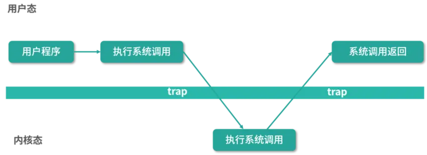
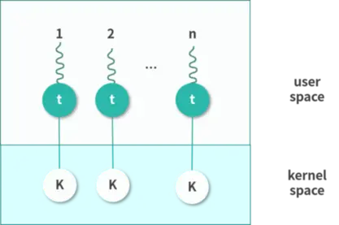
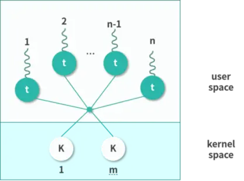
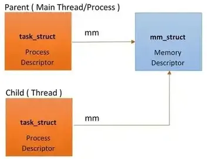
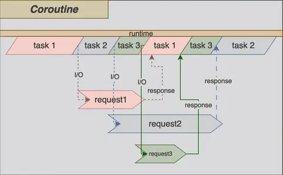

# 操作系统:进程&线程&协程

本文会介绍操作系统中的进程,线程和协程。


<!--more-->

## 进程

计算机的核心是CPU，它承担了所有的计算任务；而操作系统是计算机的管理者，它负责任务的调度、资源的分配和管理，统领整个计算机硬件；应用程序则是具有某种功能的程序，程序是运行于操作系统之上的。进程是一个具有一定独立功能的程序在一个数据集上的一次动态执行的过程，是操作系统进行资源分配和调度的一个独立单位，是应用程序运行的载体。进程是一种抽象的概念，从来没有统一的标准定义。

进程一般由程序、数据集合和进程控制块三部分组成。

- 程序用于描述进程要完成的功能，是控制进程执行的指令集；
- 数据集合是程序在执行时所需要的数据和工作区；
- 程序控制块(Program Control Block，简称PCB)，包含进程的描述信息和控制信息，是进程存在的唯一标志。

进程具有的特征：

- 动态性：进程是程序的一次执行过程，是临时的，有生命期的，是动态产生，动态消亡的；
- 并发性：任何进程都可以同其他进程一起并发执行；
- 独立性：进程是系统进行资源分配和调度的一个独立单位；
- 结构性：进程由程序、数据和进程控制块三部分组成。

在早期的操作系统中并没有线程的概念，进程是能拥有资源和独立运行的最小单位，也是程序执行的最小单位。任务调度采用的是时间片轮转的抢占式调度方式，而**进程是任务调度的最小单位**^[也就是说同一时刻，一个 cpu 核心只能运行一个进程]，每个进程有各自独立的一块内存，使得各个进程之间内存地址相互隔离。

操作系统管理所有进程的方法，就是对每一个进程建立一个PCB (Process Control Block)，记录该进程的相关状态。在切换不同进程时，会先保存当前执行状态，再切换到下一个进程，并恢复切换后进程的存储状态，继续执行。

- 优点：相对比较稳定安全，因为每一个进程都拥有独立的系统资源，进程间不容易相互影响，而且因为不会共享 data 的问题，所以不须对进程作互斥存取之机制。
- 缺点：进程的建立及切换 (context switching) 的开销都比较大，因为涉及到 OS 资源的切换，彼此进程间要通信也比较复杂及耗时。

## 线程

随着计算机的发展，对CPU的要求越来越高，进程之间的切换开销较大，已经无法满足越来越复杂的程序的要求了。于是就有了线程。线程又被称为轻量级进程，线程是程序执行中一个单一的顺序控制流程，是程序执行流的最小单元，是处理器调度和分派的基本单位。一个进程可以有一个或多个线程，各个线程之间共享程序的内存空间(也就是所在进程的内存空间)。

一个CPU核心同一时刻只能执行一个线程，一个有两个线程的进程在单核处理器上的执行顺序如下图:


一个标准的线程由以下部分组成,多个线程共享进程内的内存空间: 代码、数据、系统资源(例如文件).

- 线程ID
- 当前指令指针(PC),也被称为程序计数器。
- 寄存器
- 堆栈。


线程的实现可以分为 2 类: 用户级线程和内核级线程。Kernel 运行在超级权限模式（Supervisor Mode）下，所以拥有很高的权限。按照权限管理的原则，多数应用程序应该运行在最小权限下。因此，很多操作系统，将内存分成了两个区域：

- 内核空间（Kernal Space），这个空间只有内核程序可以访问。
- 用户空间（User Space），这部分内存专门给应用程序使用。

用户空间中的代码被限制了只能使用一个局部的内存空间，我们说这些程序在用户态（User Mode） 执行。内核空间中的代码可以访问所有内存，我们称这些程序在内核态（Kernal Mode） 执行。如果用户态程序需要执行系统调用，就需要切换到内核态执行。



内核程序执行在内核态（Kernal Mode），用户程序执行在用户态（User Mode）。当发生系统调用时，用户态的程序发起系统调用。因为系统调用中牵扯特权指令，用户态程序权限不足，因此会中断执行，也就是 Trap。发生中断后，当前 CPU 执行的程序会中断，跳转到中断处理程序。内核程序开始执行，也就是开始处理系统调用。内核处理完成后，主动触发 Trap，这样会再次发生中断，切换回用户态工作。

进程可以分成用户态进程和内核态进程两类。用户态进程通常是应用程序的副本，内核态进程就是内核本身的进程。如果用户态进程需要申请资源，比如内存，可以通过系统调用向内核申请。进程可以通过 API 创建用户态的线程，也可以通过系统调用创建内核态的线程。

### 用户态线程

用户态线程也称作用户级线程（User Level Thread）。操作系统内核并不知道它的存在，它完全是在用户空间中创建。用户级线程有很多优势:

- 管理开销小：创建、销毁不需要系统调用。
- 切换成本低：用户空间程序可以自己维护，不需要走操作系统调度。

但是这种线程也有很多的缺点。

- 与内核协作成本高：比如这种线程完全是用户空间程序在管理，当它进行 I/O 的时候，无法利用到内核的优势，需要频繁进行用户态到内核态的切换。
- 线程间协作成本高：设想两个线程需要通信，通信需要 I/O，I/O 需要系统调用，因此用户态线程需要支付额外的系统调用成本。
- 无法利用多核优势：比如操作系统调度的仍然是这个线程所属的进程，所以无论一个进程有多少用户态的线程，都只能并发执行一个线程，因此一个进程的多个线程无法利用多核的优势。
- 操作系统无法针对线程调度进行优化：当一个进程的一个用户态线程阻塞（Block）了，操作系统无法及时发现和处理阻塞问题，它不会更换执行其他线程，从而造成资源浪费。

### 内核态线程

内核态线程也称作内核级线程（Kernel Level Thread）。这种线程执行在内核态，可以通过系统调用创造一个内核级线程。内核级线程有很多优势。

- 可以利用多核 CPU 优势：内核拥有较高权限，因此可以在多个 CPU 核心上执行内核线程。
- 操作系统级优化：内核中的线程操作 I/O 不需要进行系统调用；一个内核线程阻塞了，可以立即让另一个执行。

当然内核线程也有一些缺点。

- 创建成本高：创建的时候需要系统调用，也就是切换到内核态。
- 扩展性差：由一个内核程序管理，不可能数量太多。
- 切换成本较高：切换的时候，也同样存在需要内核操作，需要切换内核态。

### 用户态线程和内核态线程的区别

用户态线程工作在用户空间，内核态线程工作在内核空间。用户态线程调度完全由进程负责，通常就是由进程的主线程负责。相当于进程主线程的延展，使用的是操作系统分配给进程主线程的时间片段。内核线程由内核维护，由操作系统调度。

用户态线程无法跨核心，一个进程的多个用户态线程不能并发，阻塞一个用户态线程会导致进程的主线程阻塞，直接交出执行权限。这些都是用户态线程的劣势。内核线程可以独立执行，操作系统会分配时间片段。因此内核态线程更完整，也称作轻量级进程。内核态线程创建成本高，切换成本高，创建太多还会给调度算法增加压力，因此不会太多。

实际操作中，往往结合两者优势，将用户态线程附着在内核态线程中执行。

### 用户线程和内核线程的映射

用户态线程创建成本低，问题明显，不可以利用多核。内核态线程，创建成本高，可以利用多核，切换速度慢。因此通常我们会在内核中预先创建一些线程，并反复利用这些线程。这样，用户态线程和内核态线程之间就构成了下面 4 种可能的关系:

- 一对一
- 多对一
- 多对多
- 组合

这些模型各有优缺点，适用于不同的应用场景。

#### 一对一

该模型为每个用户态的线程分配一个单独的内核态线程，在这种情况下，每个用户态都需要通过系统调用创建一个绑定的内核线程，并附加在上面执行。 这种模型允许所有线程并发执行，能够充分利用多核优势，Windows NT 内核采取的就是这种模型。但是因为线程较多，对内核调度的压力会明显增加。




#### 多对一

用户态进程中的多线程复用一个内核态线程。这样，极大地减少了创建内核态线程的成本，但是线程不可以并发。因此，这种模型现在基本上用的很少。


#### 多对多(Many To Many)

这种模式下会为 n 个用户态线程分配 m 个内核态线程。m 通常可以小于 n。一种可行的策略是将 m 设置为核数。这种多对多的关系，减少了内核线程，同时也保证了多核心并发。Linux 目前采用的就是该模型。




#### 组合

这种模型混合了多对多和一对一的特点。多数用户态线程和内核线程是 n 对 m 的关系，少量用户线程可以指定成 1 对 1 的关系。


### linux 中的线程

Linux(Kernel 2.6.34) 并没有一个明确的 Thread 或是 Process 的概念，取而代之为 Task (也可以称做 light-weight process),task_structs 就是 Task 的结构体现， 也被称做为 process descriptor (类似 PCB 的概念)，记录了这个 Process 所有的context。



```c
struct task_struct {
  volatile long state; // -1 unrunnable, 0 runnable, >0 stopped
  void *stack; // point to kernel stack
  struct mm_struct *mm // point to memory descriptor
  struct thread_struct thread; // context switch info
};
```
- task_struct 记录目前Process 的状态
- 每个 task_structs 都会有一个 kernel stack ，提供在 Kernel mode 时进行运算时，可存放临时变量的地方。
- Process 都会拥有一个唯一的 mm_struct ，让 Process 有抽象的独立 memory (32 or 64 bits address space) 可以使用。Linux 中，如果共享 mm_struct ，则称为 Thread。
- task_struct 通过 thread_struct 记录用户空间 user_stack的信息

> 如果task_struct 有自己的 mm_struct，称为 Process，其实本身就是个 Main Thread (CPU scheduling的基本单位)。如果task_struct 共用别人的 mm_struct，称为 Thread。

mm_struct 也称做为 Memory descriptor， mm_struct 描述了属于这 Process 的整个 virtual address space 。

```c
struct mm_struct {
  unsigned long start_stack // user stack start address
};
```


在 mm_struct 中，会有一个 start_stack (user stack 起始位置)，提供在 User mode 运算的存放空间。如果是一个 Thread，因为共享 parent 的 mm_struct ，为了不影响到 mm_struct 裡的 stack 空间，会在heap 或 mmap 内找一个空间作为 Thread 的 stack。

不论哪种方式产生的 user stack，都会初始化 task_struct->thread->sp ，让其存放 user stack 信息。thread_struct 保留了大部分的 CPU registers 的信息，context switch 主要就是恢复保存在 thread_struct 里的信息。

```c
struct thread_struct {
  unsigned long  sp0; // 存放 kernel stack base address  
  unsigned long  sp;  // 存放 kernel stack (current)top address
};
```

建立 process/thread (task_struct) 会得到两个 stack:

- user stack:
  - 建立在 address space (mm_struct)，在 user mode 使用
  - process (mm_struct 的 stack) 或 thread (mm_struct 的 heap/mmap)
- kernel stack :
  - 建立在 kernel address space ^[所有kernel stack 共用的空间]，在 kernel mode 使用
  - task_struct 指向的 stack (thread_info^[放在 struct thread_union 里与 context switch 有关])

综上，Linux 的线程模型是 one-to-one 模式。

## 协程

协程，英文Coroutines，是一种基于线程之上，但又比线程更加轻量级的存在，这种由程序员自己写程序来管理的轻量级线程叫做『用户空间线程』，具有对内核来说不可见的特性。因为是自主开辟的异步任务，所以很多人也更喜欢叫它们纤程（Fiber），或者绿色线程（GreenThread）。正如一个进程可以拥有多个线程一样，一个线程也可以拥有多个协程。

### 协程的目的

在传统的web系统中都是基于每个请求占用一个线程去完成完整的业务逻辑。所以系统的吞吐能力取决于每个线程的操作耗时。如果遇到很耗时的I/O行为，则整个系统的吞吐立刻下降，因为这个时候线程一直处于阻塞状态，如果线程很多的时候，会存在很多线程处于空闲状态（等待该线程执行完才能执行），造成了资源应用不彻底。

最常见的例子就是JDBC（它是同步阻塞的），这也是为什么很多人都说数据库是瓶颈的原因。这里的耗时其实是让CPU一直在等待I/O返回，说白了线程根本没有利用CPU去做运算，而是处于空转状态。而另外过多的线程，也会带来更多的ContextSwitch开销。


我们可以将任务分为 I/O bound和CPU bound

- 任务本身是通过过IO去执行，这时就会受到写入/读取的速度限制，比如到远端的Server获取股票价格、上传文件到云端会根据电脑的网络速度、以及其他任何牵涉到IO读取和写入，都属于I/O bound的一种。
- 任务本身涉及大量CPU、GPU计算，比如3D制图、AI模型训练、本地解压缩等都属于CPU bound的一种。

而协程的目的就是当出现I/O bound操作时，通过让出目前的协程调度，执行下一个任务的方式，来消除ContextSwitch上的开销。协程适用于被阻塞的，且需要大量并发的场景。但不适用于大量计算的多线程，遇到此种情况，更好实用线程去解决。



### 协程类型

协程可以被划分为两大类，一类是有栈（stackful）协程，例如 goroutine；一类是无栈（stackless）协程，例如 async/await。

有栈是指协程是否可以在其任意嵌套函数中被挂起，有栈协程是可以的，而无栈协程则不可以。

#### 有栈协程

实现一个协程的关键点在于如何保存、恢复和切换上下文。已知函数运行在调用栈上；如果将一个函数作为协程，我们很自然地联想到，

- 保存上下文即是保存从这个函数及其嵌套函数的（连续的）栈帧存储的值，以及此时寄存器存储的值；
- 恢复上下文即是将这些值分别重新写入对应的栈帧和寄存器；
- 而切换上下文无非是保存当前正在运行的函数的上下文，恢复下一个将要运行的函数的上下文。

有栈协程便是这种思想下的产物。很显然有栈协程被挂起时的自由度要比无栈协程高 ^[可以认为有栈协程实现了类似操作系统的线程上下文切换功能] ，所以有栈协程可以很方便地兼容现有的同步代码 ^[JVM的 loom 就选择实现有栈协程]。

#### 无栈协程

相比于有栈协程直接切换栈帧的思路，无栈协程在不改变函数调用栈的情况下，采用计算续体的思路实现了上下文切换^[例如 rust 和 kotlin 的实现]。

当一个计算过程在中间被打断，其剩余部分可以使用一个对象进行表示，这个对象就是计算续体。大多数编程语言会提供相关的关键词进行修饰，最常见的就是 async 和 await。一般 async 用于声明一个异步函数，await 用于挂起（执行）一个异步函数。事实上，计算续体就是异步函数的底层实现技术。当使用 await 调用一个异步函数时，那么编译器会 将后续部分的代码转换成续体，当异步任务执行完毕之后，再将值传递至续体中继续执行，有点类似于方法回调。

事实上，计算续体与函数栈帧有着非常紧密的关系，前者是保存和恢复栈帧的一种机制。在函数调用时，每个函数都会创建一个栈帧，其包含函数的局部变量、参数以及返回地址等信息。栈帧被存放在进程空间的栈区，当函数返回时，对应的栈帧会从栈中弹出，程序恢复到调用该函数的地方。

计算续体则是将 当前栈帧 以及 程序计算器 等信息保存至一个对象中，然后将该对象传递给一个续体函数。续体函数可以在需要时将保存的状态恢复，从而继续执行程序。

因此，从运行时层面看，计算续体就是当前函数的栈帧与现场状态；从代码层面看，计算续体就是等待异步操作完成的后续代码。

注意，计算续体不会改变函数调用栈，在无栈协程中，你（几乎）不可能在任意一个嵌套函数中挂起协程。不过由于不需要切换栈帧，无栈协程的性能倒是比有栈协程普遍要高一些。

#### Kotlin CPS Transformation

CPS 变换（Continuation-Passing Style Transformation）是无栈协程实现的常见方案，它将挂起函数转换为continuation 传递风格的函数，本质上是一种将同步代码转换为异步代码的回调风格的转换方式。以 kotlin 代码为例:

```kotlin
fun postItem(item: Item) {
    val token = generateToken()         // step1
    val post = createPost(token, item)  // step2
    processPost(post)                   // step3
}
```
将上述代码进行CPS转化后(CPS转化其实是将下一步变成了回调):

```kotlin
fun postItem(item: Item) {
    generateToken { token ->              // step1
        createPost(token, item) { post -> // step2
            processPost(post)             // step3
        }
    }
}
```

在 kotlin 中增加 suspend 关键字来标记异步方法实现协程。

```kotlin
suspend fun postItem(item: Item) {
    val token = generateToken() // suspend 方法
    val post = createPost(token, item) // suspend 方法
    processPost(post)
}
```
带suspend的方法在编译后方法签名都会增加一个续体参数。续体负责将当前步骤结果传递给下个步骤，同时移交下一步的调用权。
```kotlin
// 编译前：Kotlin
suspend fun createPost(token: Token, item: Item): Post { … }
// 编译后：Java/JVM（cont其实是一个callback，Post为结果）
Object createPost(Token token, Item item, Continuation<Post> cont) { … }
```
##### 续体在 kotlin 中定义

```kotlin
public interface Continuation<in T> {
  public val context: CoroutineContext
  public fun resume(value: T)
  public fun resumeWithException(exception: Throwable)
}
```

- CoroutineContext：是一个链表结构，可以使用「+」操作符，其中包含协程执行时需要的一些参数：名称/ID、调度器 Dispatcher、控制器 Job、异常 Handler等（把 Job 称为「控制器」感觉好理解一些）
- resumeWith：触发下一步的方法，参数 result 是当前步骤的结果（上面说到了调用权，resumeWith就是调用入口）

##### StateMachine

每个 suspend 函数都会生成出一个内部类 StateMachine，用于保存函数的局部变量与执行点位，所有的暂停点位，都是调用 suspend 函数的位置。

```kotlin
fun postItem(item: Item, cont: Continuation) {
    // cont是父协程的续体，在当前协程结束时会触发cont的resume
    val sm = object : CoroutineImpl(cont) { 
        fun resume(...) {
            postItem(null, this)    // 续体回调入口
        }
    }
    switch (sm.label) {
        case 0:
            sm.item = item      // 初始参数，执行过程中传递的一些参数
            sm.label = 1        // 状态控制
            generateToken(sm)    // step1，传入续体
            // 执行完成后调用resume，并将结果传递下去
        case 1:
            val token = sm.result as Token  // 从续体中拿取上一步的结果
            val item = sm.item              // 从续体中拿取初始参数
            sm.label = 2                    // 状态控制
            createPost(token, item, sm)     // step2，传入续体&参数
            // 执行完成后调用resume，并将结果传递下去
        case 2:
            val post = sm.result as Post    // 从续体中拿取上一步的结果
            processPost(post, sm)           // spte3
    }
}
```
每个 StateMachine 对象也是 Continuation 接口的实现。每当 suspend 函数执行到 suspend 点位时，实际上会退出执行，函数的执行上下文会完整记录在 StateMachine 中。

调用的异步方法有响应时，会回调 StateMachine 的 resume 方法，而 resume 方法的执行，相当于使用记录在 StateMachine 中的上下文作为参数，再执行一次该函数。

##### 总结

- kotlin 的协程支持是 CPS 变换和 StateMachine 两部分，CPS 变换使同步代码异步化，增加额外的 Continuation 类型的参数，用于函数结果值的返回；
- 通过 switch / case 配合 label，做到执行点位的记录与暂停；
- 每个 suspend 方法都会生成一个内部的 StateMachine 类，StateMachine 类中包含函数的所有局部变量，以及暂定点的返回值与异常值，扮演了 yield 语句的功能，即暂停函数的执行，为此需要记录下函数当前的局部变量上下文与执行点位。
- 被暂停函数的恢复执行，实现上等于将函数的局部变量上下文与点位作为参数，重新调用一次这个函数。

### 协程调度

以 Go Coroutine 调度为例介绍下协程的调度:


- G: 协程任务(goroutine)
- P: 任务处理器(Processor),包含了运行goroutine的资源，如果线程想运行goroutine，必须先获取P，P中还包含了可运行的G队列。
- M: 线程

在Go中，线程是运行goroutine的实体，调度器的功能是把可运行的goroutine分配到工作线程上。

- 全局队列（Global Queue）：存放等待运行的G。
- P的本地队列：同全局队列类似，存放的也是等待运行的G，存的数量有限，不超过256个。新建G时，G优先加入到P的本地队列，如果队列满了，则会把本地队列中一半的G移动到全局队列。
- P列表：所有的P都在程序启动时创建，并保存在数组中，最多有GOMAXPROCS(可配置)个。
- M：线程想运行任务就得获取P，从P的本地队列获取G，P队列为空时，M也会尝试从全局队列拿一批G放到P的本地队列，或从其他P的本地队列偷一半放到自己P的本地队列。M运行G，G执行之后，M会从P获取下一个G，不断重复下去。

调度器的设计策略
- work stealing机制: 当本线程无可运行的G时，尝试从其他线程绑定的P偷取G，而不是销毁线程。
- hand off机制: 当本线程因为G进行系统调用阻塞时，线程释放绑定的P，把P转移给其他空闲的线程执行。
- 抢占：在coroutine中要等待一个协程主动让出CPU才执行下一个协程，在Go中，一个goroutine最多占用CPU 10ms，防止其他goroutine被饿死，这就是goroutine不同于coroutine的一个地方^[kotlin 和 Rust 之类的无栈协程无法实现抢占]。

