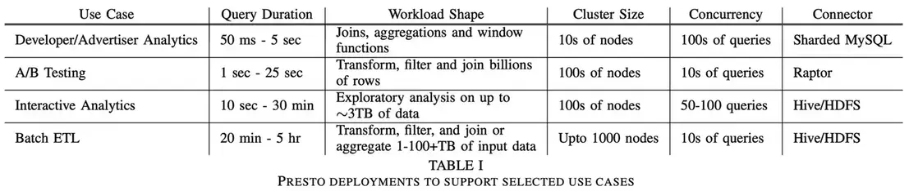
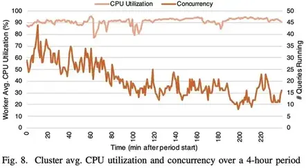

# Presto: SQL on EveryThing

本篇是论文[Presto: SQL on EveryThing](https://trino.io/Presto_SQL_on_Everything.pdf)的中文简单翻译
<!--more-->

## 摘要

Presto是一个开源分布式查询引擎，支撑了Facebook内部大部分的SQL分析工作。Presto的设计目标是具有适应性、灵活性和可扩展性。它支持具有不同特征的各种各样的用例。这些用例的范围从要求亚秒级延迟的面向用户的报表应用到花费数小时的聚合或关联数TB数据的ETL任务。Presto的连接器API允许以插件的方式为数十个数据源提供高性能I/O接口，包括Hadoop数据仓库、RDBMS数据库、NoSQL系统和流处理系统。在本论文中，我们概述了Presto在Facebook内部支撑的一系列用例。然后，我们描述了它的架构和实现，并阐述了使其能够支持这些用例的功能和性能优化。最后，我们展示了性能结果，从而论证了我们主要的设计决策的影响。

关键词: SQL，查询引擎，大数据，数据仓库

## 引言

从大量数据中快速轻松地获取洞察的能力对于技术驱动的组织来说越来越重要。随着收集和存储大量数据的成本越来越低，使查询这些数据的工具变得更快、更易于使用和更灵活就变得很重要。使用像SQL这样通用的查询语言可以使组织内的更多人可以进行数据分析。然而，当组织被迫部署多个不兼容的类 SQL 的系统来解决不同类别的分析问题时，易用性就会大打折扣。

Presto 是一种开源分布式 SQL 查询引擎，自 2013 年以来一直在 Facebook的生产环境使用，并且如今已被多家大公司使用，包括 Uber、Netflix、Airbnb、彭博社和 LinkedIn。例如Qubole、Treasure Data 和 Starburst Data 等组织都拥有基于 Presto 的商业产品。[Amazon Athena](https://aws.amazon.com/athena) 交互式查询服务就是基于 Presto 构建的。Presto 在 GitHub 上有一百多名贡献者，拥有强大的开源社区。

Presto的设计目标是具有适应性、灵活性和可扩展性。它提供了一个ANSI标准SQL接口来查询存储在Hadoop环境、开源和专有 RDBMS数据库、NoSQL系统和Kafka等流处理系统中的数据。“通用 RPC”（使用 Thrift，一种接口定义语言和 RPC 协议，用于定义和创建跨多种语言的服务。）连接器使得向专有系统添加SQL接口就像实现几个RPC接口一样简单。Presto 暴露了一个开放的 HTTP API，附带 JDBC 支持，并且与多个行业标准的商业智能 (BI) 和查询创作工具兼容。内置的 Hive 连接器可以本地地读取和写入分布式文件系统，例如 HDFS 和 Amazon S3；并支持多种流行的开源文件格式，包括 ORC、Parquet 和 Avro。

截至 2018 年底，Presto 负责支持 Facebook中的大部分 SQL 分析工作，包括交互式/BI 查询和长时间运行的批量提取-转换-加载 (ETL) 作业。此外，Presto 支持多个面向终端用户的分析工具，提供高性能仪表盘，为多个内部 NoSQL 系统提供 SQL 接口，并支撑 Facebook 的 A/B 测试基础架构。总的来说，Presto 每天在Facebook中处理了数百 PB 的数据和千万亿的行。

Presto 有几个显著的特点：

- 它是一个自适应多租户系统，能够同时运行数百个内存、I/O 和 CPU 密集型查询，并可在有效利用集群资源的同时扩展到数千个工作节点。
- 其可扩展的联邦设计允许管理员搭建即使在单个查询中也可以处理来自多个不同数据源数据的集群。这降低了集成多个系统的复杂度。
- 它很灵活，并且可以配置为支持具有非常不同的约束和性能特征的非常广泛的用例。
- 它是为高性能而构建的，具有几个关键的相关功能和优化，包括代码生成。多个正在运行的查询在工作节点上共享一个长期存在的 Java 虚拟机 (JVM) 进程，这减少了响应时间，但要求集成调度、资源管理和隔离能力。

本文的主要贡献是描述 Presto 引擎的设计，讨论实现我们上述特性所需的特定优化和权衡。次要贡献是一些关键设计决策和优化的性能结果，以及在开发和维护 Presto 过程中学到的经验教训的描述。

Presto 最初的开发目的是实现对 Facebook 数据仓库的交互式查询。它随着时间的推移不断演进从而可以支持一些不同的用例，我们会在第二节中描述其中的一些用例。我们没有研究这种演进，而是描述了目前已经存在的引擎和用例，并在与这些用例关联时列出了主要特性和功能。本文剩余部分的结构如下。在第三节中，我们呈现了架构概述，然后在第四节中深入研究了系统设计。然后，我们在第五部分描述了一些重要的性能优化，在第六部分展示了性能结果，并在第七部分描述了开发 Presto 时学到的工程经验。最后，我们在第八节概述了关键的相关工作，并在第九节中进行总结。Presto 正在积极开发中，并且经常添加重要的新功能。在本文中，我们将基于2018 年 9 月发布的 0.211 版 Presto进行描述。

## 用例

在 Facebook，我们运营着大量 Presto 集群（最多 1000 个节点）并支持多种不同的用例。在本节中，我们选取了四个具有大型部署集群的不同用例并描述了它们的要求。

### 交互式分析

Facebook 运营一个庞大的多租户数据仓库作为内部服务，其中多个业务职能和组织单位共享一组较小的托管集群。数据存储在分布式文件系统中，元数据存储在单独的服务中。这些系统分别具有类似于 HDFS 存储和 Hive 元数据服务的 API。我们将其称为“Facebook 数据仓库”，并使用 Presto 的“Hive”连接器的变体对其进行读取和写入。

Facebook的工程师和数据科学家通常会分析少量数据（压缩后约50GB-3TB）、验证假设并构建可视化组件或仪表盘。用户通常依赖查询创作工具、BI 工具或 Jupyter 笔记本。单个集群需要支持 50-100 个形式多样的并发查询，并在几秒或几分钟内返回结果。用户对端到端处理时间高度敏感，但可能对查询资源需求感受不直观。在执行探索性分析时，用户可能不需要返回整个结果集。查询通常在返回初始结果后被取消，或者使用 LIMIT 子句来限制系统应该产生的结果数据量。

### 批处理 ETL

我们上面描述的数据仓库使用 ETL 查询定期生成新数据。查询任务由工作流管理系统调度，该系统确定任务之间的依赖关系并相应地调度它们。Presto 支持用户从旧的批处理系统迁移过来，从CPU消耗来看，在Facebook中ETL 查询现在占据了 Presto 工作负载的很大一部分。这些查询通常由数据工程师编写和优化。和交互式分析用例中的查询相比，它们往往占用更多资源，并且通常涉及执行 CPU 密集型转换和内存密集型（多 TB 的分布式内存）聚合或与其他大型表的关联。与资源效率和整体集群吞吐量相比，查询延迟相对没那么重要。

### A/B 测试

在Facebook中使用 A/B 测试通过统计假设检验来评估产品变更的影响。在Facebook中的大部分 A/B 测试基础设施都是建立在 Presto 上的。用户期望在数小时（而不是数天）内提供测试结果，并且数据完整准确。对于用户而言，能够以交互性延迟（约5-30 秒）对其结果执行任意切片和切块以获得更深入的洞察也很重要。通过预聚合数据很难满足这一要求，因此必须即时计算结果。生成结果需要关联多个大型数据集，其中包括用户、设备、测试和事件属性。由于查询是以编程方式生成的，因此查询样式仅限于一个小集合。

### 开发者/广告主分析

Presto 为外部开发者和广告主构建了多个自定义报表工具。此用例的一个示例部署是 Facebook Analytics，它为使用 Facebook 平台构建应用的开发人员提供高级分析工具。这些部署通常会暴露一个 Web 界面，该界面可以生成一组受限的查询样式。数据总量很大，但查询的选择性很高，因为用户只能访问自己的应用或广告的数据。大多数查询样式包含关联、聚合或窗口函数。数据摄取延迟是分钟级别。由于该工具是交互式的，因此有非常严格的查询延迟要求（约50ms-5s）。集群必须具有 99.999% 的可用性，并在给定用户数的情况下支持数百个并发查询。

## 架构概览

Presto 集群由单个协调器节点和一个或多个工作节点组成。协调器负责接收、解析、生成和优化查询以及查询分发。工作节点负责查询处理。图 1 展示了 Presto 架构的简化图。


客户端向协调器发送一个包含 SQL 语句的 HTTP 请求。协调器通过评估队列策略、解析和分析 SQL 文本、创建和优化分布式执行计划来处理请求。

协调器将执行计划分发给工作节点，开始执行任务，然后开始遍历分片，这些分片是外部存储系统中可寻址数据块的不透明句柄。将分片分配给负责读取此数据的任务。

运行这些任务的工作节点通过从外部系统获取数据或处理其他工作节点产生的中间结果来处理这些分片。工作节点使用协作式多任务处理的方式来同时处理来自多个查询的任务。执行尽可能流水线化，并且一旦数据可用时就在任务之间流动。对于某些查询样式，Presto 能够在处理完所有数据之前返回结果。中间数据和状态尽可能存储在内存中。当在节点之间shuffle数据时，缓存被调整以达到最小延迟。

Presto 被设计为可扩展的；并提供了一个通用的插件接口。插件可以提供自定义数据类型、函数、访问控制实现、事件消费者、排队策略和配置属性。更重要的是，插件还提供了连接器，使 Presto 能够通过连接器 API 与外部数据存储进行通信，连接器 API 由四部分组成：元数据 API、数据位置 API、数据源 API 和数据接收器 API。这些 API 旨在允许在物理分布式执行引擎的环境中实现连接器的高性能实现。开发人员已经为主要的 Presto 存储仓库贡献了十多个连接器，我们知道其中有几个专有连接器。

## 系统设计

在本节中，我们将介绍 Presto 引擎的一些关键设计决策和功能。我们描述了 Presto 支持的 SQL 方言，然后是从客户端到分布式执行的整个查询生命周期。我们还描述了一些在 Presto 中启用多租户的资源管理机制。最后，我们简要讨论容错。

### SQL 方言

Presto 严格遵循 ANSI SQL 规范 [<sup>2</sup>](#refer-anchor-2)。虽然引擎没有实现标准的每个特性，但实现的特性尽可能符合该规范。我们已经对该语言进行了一些精心挑选的扩展，以提高可用性。例如，在 ANSI SQL 中很难操作复杂的数据类型，例如映射和数组。为了简化对这些常见数据类型的操作，Presto 语法支持匿名函数（lambda 表达式）和内置高阶函数（例如，transform、filter、reduce）。

### 客户端接口、解析和计划

#### 客户端接口

Presto 协调器主要向客户端暴露 RESTful HTTP 接口，并附带了非常好的命令行接口。Presto 还附带了一个 JDBC 客户端，它可以与各种 BI 工具兼容，包括 Tableau 和 Microstrategy。

#### 解析

Presto 使用基于 ANTLR 的解析器将 SQL 语句转换为语法树。解析器使用此语法树来确定类型和强制转换，解析函数和作用域，并提取逻辑组件，例如子查询、聚合和窗口函数。

#### 逻辑计划

逻辑计划器使用语法树和分析信息来生成以计划节点树的形式编码的中间表示 (IR)。每个节点代表一个物理或逻辑操作，计划节点的子节点是它的输入。计划器生成纯逻辑的节点，即它们不包含有关如何执行计划的任何信息。参考一个简单的查询：

```sql
SELECT
  orders.orderkey, SUM(tax)
FROM orders
LEFT JOIN lineitem
  ON orders.orderkey = lineitem.orderkey
WHERE discount = 0
GROUP BY orders.orderkey
```

此查询的逻辑计划的概述如图2所示。


### 查询优化

计划优化器将逻辑计划转换为进一步的物理的结构，代表该查询的高效执行策略。该过程的工作原理是贪婪式地评估一组转换规则，直到达到稳定点。每个规则都有一个模式，可以匹配查询计划的一个子树并确定是否应该应用该转换。结果是生成了一个替换匹配目标的逻辑等效子计划。Presto 包含一些规则，包括众所周知的优化，例如谓词和limit下推、列修剪和去相关。

我们正在使用基于 Cascades 框架 [<sup>13</sup>](#refer-anchor-13)引入的技术增强优化器，基于成本的计划评估来对搜索空间进行更全面的探索。但是，Presto 已经支持两种考虑表和列的统计信息的基于成本的优化——关联策略选择和关联重排序。我们将只讨论优化器的几个功能； 详细的处理超出了本文的范围。

#### 数据布局

当连接器数据布局 API 可以提供数据时，优化器可以利用数据的物理布局。连接器报告位置信息和其他数据属性，例如分区、排序、分组和索引。连接器可以为单个表返回多个布局，每个布局具有不同的属性，优化器可以为查询选择最有效的布局 [<sup>15</sup>](#refer-anchor-15),[<sup>19</sup>](#refer-anchor-19)。此功能在开发人员/广告主 Analytics 系统这个用例中由管理员操作集群使用；它使他们能够通过添加物理布局来优化新的查询样式。我们将在后续部分中看到引擎可以利用这些属性的一些方式。

#### 谓词下推

优化器可以与连接器一起工作来决定何时通过连接器下推范围和相等谓词条件，以提高过滤效率。

例如，开发人员/广告主 Analytics 这个用例利用构建在分片的 MySQL 之上的专有连接器。连接器将数据分成存储在单个 MySQL 实例中的多个分片，并且可以将范围或相等谓词一直下推到单个分片上，确保只从 MySQL 读取匹配的数据。如果存在多个布局，引擎会选择在谓词列上建立了索引的布局。基于索引的高效过滤对于开发人员/广告主 Analytics 工具中使用的高选择性过滤器非常重要。对于交互式分析和批处理 ETL 用例，Presto 利用 Hive 连接器中的分区裁剪和文件格式功能（第 5.3节）以类似的方式提高性能。

#### 节点间并行性

优化过程部分涉及确定可以跨工作节点并行执行的计划部分。这些部分被称为“阶段”，每个阶段分发给一个或多个任务，每个任务对不同的输入数据集执行相同的计算。引擎在阶段之间插入缓冲的内存数据传输（shuffle）从而进行数据交换。Shuffle 会增加延迟、耗尽缓冲内存并具有高 CPU 开销。因此，优化器必须谨慎考虑引入计划的shuffle的总数。图 3 展示了一个简单的实现如何将计划划分为多个阶段并使用 shuffle 将它们连接起来。


- 数据布局属性: 优化器可以使用物理的数据布局来最小化计划中的 shuffle 数。这在 A/B 测试用例中非常有用，其中几乎每个查询都需要一个大型关联来生成实验明细或人口信息。该引擎利用参与关联的两个表都在同一列上进行分区这一事实，并使用基于位置协作的关联策略来消除资源密集型 shuffle。如果连接器暴露一个数据布局，其中关联列被标记为索引，优化器能够确定使用索引嵌套循环关联是否是一个合适的策略。这可以通过关联线上数据存储（键值对或其他）来非常高效地对存储在数据仓库中的规范化数据进行操作。这是交互式 Analytics 用例中的常用功能。

- 节点属性: 像连接器一样，计划树中的节点可以表达其输出的属性（即数据的分区、排序、分桶和分组特征） [<sup>24</sup>](#refer-anchor-24)。这些节点还能够表达所需的和偏好的属性，在引入 shuffle 时会考虑到这些属性。冗余 shuffle 被简单地取消掉，但在其他情况下，可以更改 shuffle 的属性以减少所需的 shuffle 次数。Presto 贪婪地选择满足尽可能多的所需属性的分区，以减少shuffle。这意味着优化器可能会选择在更少的列上进行分区，这在某些情况下会导致更大的分区倾斜。例如，应用于图 3 中的计划的这种优化导致它合并到单个数据处理阶段。

#### 节点内并行

优化器使用类似的机制来识别计划阶段中的部分，这些部分可以从单个节点上的多线程并行化中受益。节点内的并行化比节点间的并行化要高效得多，因为延迟开销很小，并且可以在线程之间有效地共享状态（例如，哈希表和字典）。增加节点内并行性可以显著提高速度，特别是对于并发限制下游阶段吞吐量的查询样式：

- 交互式 Analytics 涉及运行许多简短的一次性查询，用户通常不会花时间尝试优化这些查询。因此，分区倾斜很常见，要么是由于数据的固有属性，要么是由于常见的查询模式（例如，按用户国家分组，同时过滤到一小组国家）。这通常表现为大量数据被哈希分区到少量节点上。
- 批处理 ETL 作业通常在很少或没有过滤的情况下转换大型数据集。在这些场景中，计划树的越高层次所涉及的节点数量越少，可能不足以快速处理叶子阶段生成的数据量。任务调度在第 4.4.2 节中讨论。
在这两类场景下，每个工作节点执行计算的多个线程可以在一定程度上缓解这种并发瓶颈。引擎可以在多个线程中运行单个运算符序列（或流水线）。图 4 展示了优化器如何能够并行化关联的一个部分。


### 调度

协调器以可执行任务的形式将计划阶段分发给工作节点，可以将执行任务视为单个处理单元。然后，协调器将一个阶段的任务链接到其他阶段的任务，形成一个通过 shuffle 相互链接的处理器树。数据一旦可用，就会从一个阶段流到另一个阶段。

一个任务中可能有多个流水线。流水线由一系列操作符组成，每个操作符对数据执行单个、明确定义的计算。例如，一个执行哈希关联的任务必须至少包含两个流水线； 一个用于构建哈希表（构建流水线），另一个用于从探测端流式传输数据并执行关联（探测流水线）。当优化器确定流水线的一部分将受益于增加的局部并行性时，它可以拆分该流水线并独立地并行化该部分。图 4 显示了如何将构建侧流水线拆分为两个流水线，一个用于扫描数据，另一个用于构建哈希表的分区。流水线通过本地内存 shuffle 关联在一起。

为了执行查询，引擎做出两组调度决策。第一组确定调度阶段的顺序，第二组确定应该调度多少个任务，以及应该将它们放置在哪些节点上。

#### 阶段调度

Presto 支持两种阶段调度策略：整体一次性策略和分阶段策略。整体一次性策略通过同时调度所有阶段执行来最大限度地减少处理器时间；数据一旦可用就会被处理。这种调度策略有利于对延迟敏感的用例，例如交互式 Analytics 、开发人员/广告主 Analytics 和 A/B 测试。分阶段执行识别必须同时启动以避免死锁的有向数据流图的所有强连接组件，并按拓扑顺序执行这些组件。例如，如果在分阶段模式下执行哈希关联，则在构建散列表完成之前不用调度关联左侧流的任务。这极大地提高了批处理 Analytics 用例的内存效率。

当调度器确定应该根据策略调度某个阶段时，它开始将该阶段的任务分配给工作节点。

#### 任务调度
任务调度器检查计划树并将阶段分为叶子阶段和中间阶段。叶子阶段从连接器读取数据；而中间阶段只处理来自其他阶段的中间结果。

##### 叶子阶段 

对于叶子阶段，任务调度程序在将任务分配给工作节点时会考虑网络和连接器施加的限制。例如，无共享部署要求工作节点与存储节点位于同一位置。在这些情况下，调度器使用连接器数据布局 API 来决定任务放置。A/B 测试用例需要可预测的高吞吐量、低延迟数据读取，Raptor 连接器可以满足这些要求。Raptor 是一个针对 Presto 优化的存储引擎，采用无共享架构，将 ORC 文件存储在闪存盘上，元数据存储在 MySQL 中。

分析显示，我们生产集群中的大部分 CPU 时间都用于解压缩、解码、过滤和应用转换以处理从连接器读取的数据。这项工作是高度并行化的，在尽可能多的节点上运行这些阶段通常会产生最短的处理器时间。因此，如果没有限制，并且可以将数据分成足够多的分片，则可在集群中的每个工作节点上调度一个叶子阶段任务。对于在共享存储模式下运行的 Facebook 数据仓库部署（即所有数据都是远程的），集群中的每个节点通常都参与处理叶子阶段。这种执行策略可能是网络密集型的。

调度器还可以推测网络拓扑以使用插件提供的层次结构优化读取。Facebook 中的网络受限部署可以使用这种机制向引擎表达对机架本地读取而不是机架远程读取的偏好。

##### 中间阶段

中间阶段的任务可以放置在任何工作节点上。但是，引擎仍然需要决定每个阶段应该调度多少任务。此决定基于连接器配置、计划的属性、所需的数据布局和其他部署配置。在某些情况下，引擎可以在执行期间动态更改任务数。第 4.7.3 节描述了一种这样的场景。

### 分片调度

当叶子阶段的任务开始在工作节点上执行时，该节点使自己可以接收一个或多个分片（在第 III 节中所描述）。分片包含的信息因连接器而不同。从分布式文件系统读取时，分片信息可能包含文件路径和文件区域的偏移量。对于 Redis 键值存储，分片信息包括表信息、键和值的格式以及要查询的主机列表等。

叶子阶段中的每个任务都必须分配一个或多个分片才能有资格运行。处于中间阶段的任务始终有资格运行，并且只有在它们中止或所有上游任务完成时才能完成。

#### 分片分配

随着任务在工作节点上启动，协调器开始为这些任务分配分片。Presto 要求连接器遍历小批量的分片，并将它们懒分配给任务。这是 Presto 的一个重要功能，并提供了几个好处：

- 将查询响应时间与连接器遍历大量分片所需的时间分离。例如，Hive 连接器可能需要几分钟时间来遍历分区并列出每个分区目录中的文件。
- 查询无需处理所有数据即可开始生成结果（例如，简单地使用过滤器选择数据），它通常会在满足 LIMIT 子句后快速取消或提前完成。在交互式 Analytics 用例中，查询甚至在所有分片被遍历完之前完成是很常见的。
- 工作节点维护一个分配给他们处理的分片队列。协调器简单地将新的分片分配给队列最短的任务。保持这些队列较小允许系统适应处理不同分片的 CPU 成本差异和工作节点之间的性能差异。
- 允许查询执行时不必将其所有元数据保存在内存中。这对于 Hive 连接器很重要，其中查询可能会访问数百万个分片，可能轻松消耗掉所有可用的协调器内存。

这些功能对于在 Facebook Hive 兼容数据仓库上运行的交互式 Analytics 和批处理 ETL 用例特别有用。但值得注意的是，懒遍历分片会导致难以准确估计和报告查询进度。

### 查询执行

#### 本地数据流

一旦将分片分配给线程，它就会由驱动程序循环执行。Presto 驱动程序循环比递归迭代器中流行的 Volcano（拉）模型更复杂  [<sup>1</sup>](#refer-anchor-1)，但提供了重要的功能。它更适合协作多任务处理，因为操作符可以在放弃线程之前快速进入确定状态，而不是无限期地阻塞。此外，驱动程序可以通过在无需额外输入即可取得进展的运算符之间移动数据（例如，恢复资源密集型或爆炸性转换的计算）来最大化在每个单位中执行的工作。循环的每次迭代在所有可以取得进展的运算符对之间移动数据。

驱动程序循环操作的数据单元称为页，它是列式编码的一系列行。连接器数据源 API 在传递分片时返回页，操作符通常使用输入页、执行计算并生成输出页。图 5 显示了页在内存中的结构。驱动程序循环在操作符之间不断遍历页，直到调度量完成（在第 4.6.1节中讨论），或者直到操作符无法取得进展。

#### Shuffles

Presto 旨在最大限度地减少端到端延迟，同时最大限度地提高资源利用率，我们的节点间数据流机制反映了这种设计选择。Presto 通过 HTTP 使用内存缓冲的 shuffle 来交换中间结果。任务产生的数据存储在缓冲区中供其他工作节点使用。工作节点使用 HTTP 长轮询从其他工作节点请求中间结果。服务器会保留数据，直到客户端使用前一个响应中发送的令牌请求下一个段数据。这使得确认隐含在传输协议中。长轮询机制最大限度地缩短了响应时间，尤其是在传输少量数据时。与其他将 shuffle 数据持久化到磁盘 [<sup>4</sup>](#refer-anchor-4) [4]、 [<sup>21</sup>](#refer-anchor-21) 的系统相比，这种机制提供的延迟要低得多，并允许 Presto 支持延迟敏感的用例，例如开发人员/广告主 Analytics 。

引擎调整并行性以维持输出和输入缓冲区的目标利用率。完整的输出缓冲区会导致分片执行停滞并耗尽宝贵的内存，而未充分利用的输入缓冲区会增加不必要的处理开销。

引擎持续监控输出缓冲器利用率。当利用率一直很高时，它会通过减少符合运行条件的分片数量来降低有效并发性。这具有提高网络资源共享公平性的效果。在处理无法以生成数据的速度使用数据的客户端（终端用户或其他工作节点）时，这也是一项重要的效率优化。如果没有此功能，运行复杂多阶段查询的慢速客户端可能会长时间持有数十 GB 的缓冲内存。即使在交互式 Analytics 用例中，BI 或查询创作工具通过慢速连接下载少量结果数据 (约10-50MB) 时，这种情况也很常见。

在接收方，引擎监控每个请求传输的数据的动态平均值，以计算目标 HTTP 请求并发量，该并发量保持输入缓冲区充分填充，同时不超过其容量。这种背压会导致上游任务在缓冲区填满时变慢。

#### 写

ETL 作业通常会生成必须写入其他表的数据。远程存储环境的写入性能的一个重要因素是执行写入的并发性（即通过连接器数据接收器 API 写入数据的线程总数）。

参考为使用 Amazon S3 进行存储而配置的 Hive 连接器的示例。对 S3 的每次并发写入都会创建一个新文件，而对少量数据的数百次写入可能会创建众多小文件。除非这些小数据单元可以稍后合并，否则它们可能会在读取时产生令人无法接受的高开销（许多缓慢的元数据操作，以及受延迟限制的读取性能）。但是，使用太少的并发性会将总写入吞吐量降低到不可接受的水平。Presto 再次采用自适应方法，当引擎确定为写入生成数据的阶段超过缓冲区利用率阈值（以及可配置的每次写入数据的写入阈值）时，通过在更多工作节点上添加任务来动态增加写入器并发性。这对写入密集型的批处理 ETL 用例来说是一个重要的效率优化。

### 资源管理

使 Presto 非常适合多租户部署的关键特性之一是它包含一个完全集成的细粒度资源管理系统。单个集群可以并发执行数百个查询，并可最大限度地利用 CPU、IO 和内存资源。

#### CPU调度

Presto 主要针对整体集群吞吐量进行优化，如用于处理数据的总 CPU。本地（节点级）调度器还优化了计算成本低的查询的低周转时间，以及在具有类似 CPU 资源要求的查询之间公平共享 CPU 资源。任务的资源使用情况是分配给其每个分片的线程 CPU 时间的总和。为了最大限度地减少协调开销，Presto 在任务级别跟踪 CPU 资源使用情况并在本地做出调度决策。

Presto 在每个工作节点上调度许多并发任务以实现多租户并使用协作多任务模型。任何给定的分片只允许在一个线程上运行最多一秒，之后它必须放弃线程并回到队列中。当输出缓冲区已满（下游阶段不能足够快地消耗数据）、输入缓冲区为空（上游阶段不能足够快地产生数据）或系统内存不足时，本地调度器甚至在单位调度时间完成之前就简单地切换到处理另一个任务。这为可运行的分片释放了线程，帮助 Presto 最大化 CPU 使用率，并且高度适应不同的查询样式。我们所有的用例都受益于这种精细的资源效率。

当分片放弃一个线程时，引擎需要决定接下来运行哪个任务（与一个或多个分片相关联的）。Presto 不是提前预测完成新查询所需的资源，而是简单地使用任务的总 CPU 时间将其分类到共五个级别的多级反馈队列 [<sup>8</sup>](#refer-anchor-8) 。随着任务积累更多的 CPU 时间，它们会移动到更高的级别。每个级别都分配了可配置的一部分的可用 CPU 时间。在实践中，实现具有任意工作负载的公平协作多任务调度是具有挑战性的。分片的 I/O 和 CPU 特性变化很大（有时甚至在同一任务中），复杂的函数（例如，正则表达式）相对于其他分片可能会消耗过多的线程时间。一些连接器不提供异步 API，工作线程可能保持连接几分钟时间。

调度器在处理这些约束时必须是自适应的。该系统提供了低成本的放弃信号，因此可以在一个操作符内停止长时间运行的计算。如果操作符超过了单位调度时间，调度器会向任务“收取”实际线程时间，并暂时减少未来的执行次数。这种自适应行为使我们能够处理交互式 Analytics 和批处理 ETL 用例中多样的查询样式，其中 Presto 为资源消耗最低的查询提供更高的优先级。这种选择反映了这样一种认知，即用户希望快速完成廉价查询，并且不太关心大型、计算成本高的作业的周转时间。并发运行更多的查询，即使以更多的上下文切换为代价，也会导致更短的总排队时间，因为较短的查询会快速退出系统。

#### 内存管理

在像 Presto 这样的多租户系统中，内存是主要的资源管理挑战之一。在本节中，我们将描述引擎控制整个集群内存分配的机制。

##### 内存池

Presto 中所有复杂的内存分配都必须归类为用户或系统内存，以及在相应的内存池中的保留内存。用户内存是用户可以仅根据系统或输入数据的基本知识推测确定的内存使用情况（例如，总内存使用量与其基数成正比）。另一方面，系统内存主要是实现决策（例如，shuffle 缓冲区）的副产品的内存使用情况，可能与查询样式和输入数据量无关。

引擎分别对用户和总（用户+系统）内存施加了限制；超过全局限制（跨工作节点的总和）或每个节点限制的查询将被终止。当节点内存不足时，将通过暂停任务处理来阻止预留查询内存。总内存限制通常设置为远高于用户限制，生产环境中只有少数查询超过总限制。

针对查询的每个节点和全局用户内存限制通常是不同的；这实现了最大程度的允许使用倾斜。考虑一个 500 个节点的集群，每个节点有 100GB 的可用查询内存，并且要求单个查询在全局范围内最多可以使用 5TB 内存。 在这种情况下，10 个查询可以同时分配达到总内存量上限。但是，如果我们希望允许 2:1 的倾斜（即查询的一个分区消耗中位数内存的 2 倍），则每个节点的查询内存限制必须设置为 20GB。这意味着只有 5 个查询可以保证在不耗尽可用节点内存的情况下运行。

我们能够在 500 个节点的交互式 Analytics 或批处理 ETL 集群上同时运行 5 个以上的查询，这一点很重要。鉴于这些集群中的查询在其内存特征（倾斜、分配率和分配时间局部性）方面差异很大，因此在任何给定时间点，所有五个查询都不太可能在同一工作节点上分配达到其最大限制。因此，只要存在当节点内存不足时保持集群健康的机制，过量使用集群的内存通常是安全的。Presto 中有两种这样的机制——溢出和保留池。

- 溢出：当节点内存不足时，引擎会按照任务执行时间的升序对符合条件的任务调用内存回收过程，并在有足够内存来满足上一个请求时停止。回收是通过将状态溢出到磁盘来处理的。Presto 支持哈希关联和聚合时的溢出。但是，我们不会将任何 Facebook 中部署集群配置为可溢出。集群大小通常足以支持数 TB 的分布式内存，用户喜欢全内存执行的可预测延迟，并且本地磁盘会增加硬件成本（尤其是在 Facebook 的共享存储部署中）。
- 保留池：如果某个节点内存不足且集群未配置为可溢出，或者没有剩余可回收的内存，则使用保留内存机制来解除集群的阻塞。每个节点上的查询内存池进一步细分为两个池：通用池和保留池。当工作节点上的通用池耗尽时，使用该工作节点上最多内存的查询将“提升”到所有工作节点上的保留池。在这种状态下，分配给该查询的内存计入保留池而不是通用池。为了防止死锁（不同的工作节点停止不同的查询），只有一个查询可以进入整个集群的保留池。如果一个节点上的通用池耗尽而保留池被占用，则该节点上其他任务的所有内存请求都将停止。该查询在保留池中运行，直到它完成，此时集群解除阻止所有未完成的内存请求。这有点浪费，因为必须调整每个节点上的保留池的大小以适应针对本地内存限制运行的查询。可以将集群配置为以终止查询来代替解除阻止大多数节点的查询。

### 容错

Presto 能够使用低级重试从许多短暂错误中恢复。然而，截至 2018 年底，Presto 没有任何有效的内置容错功能来处理协调器或工作节点崩溃故障。协调器故障会导致集群变得不可用，而工作节点崩溃故障会导致在该节点上运行的所有查询都失败。Presto 依赖客户端自动重试失败的查询。

在 Facebook 的生产环境中，我们使用外部编排机制根据用例要求以不同的可用性模式运行集群。交互式 Analytics 和批处理 ETL 用例运行备用协调器，而 A/B 测试和开发人员/广告主 Analytics 用例运行多个活跃集群。外部监控系统识别产生异常数量故障的节点并将其从集群中删除，同时修复后的节点会自动重新加入集群。这些机制中的每一个都在不同程度上减少了不可用的持续时间，但不能完全避免故障。

标准检查点或部分恢复技术是计算成本很高的，并且难以在旨在将结果一可用就将结果流式传输回客户端的系统中实现。基于副本的容错机制 [<sup>6</sup>](#refer-anchor-6)  也会消耗大量资源。考虑到成本，此类技术的预期价值尚不清楚，尤其是考虑到节点平均故障时间、约1000 个节点的集群大小以及显示大多数查询在几小时内完成的遥测数据（包括批处理 ETL）时。其他研究人员也得出了类似的结论 [<sup>17</sup>](#refer-anchor-17)。

但是，我们正在积极致力于改进运行时间很长的查询的容错能力。我们正在评估添加可选的检查点并有限地重启无法以流水线方式运行的计划的子树。

## 查询处理优化

在本节中，我们将描述一些有益于大多数用例的重要的查询处理优化。

### 使用 JVM
Presto 是用 Java 实现的，并在 Hotspot Java 虚拟机 (JVM) 上运行。从实现中获取最佳性能需要利用底层平台的优势和局限性。对性能敏感的代码（例如数据压缩或校验和算法）可以从特定优化或 CPU 指令中受益。虽然没有应用级机制来控制 JVM 即时 (JIT) 编译器如何生成机器代码，但可以构造代码以便它可以利用 JIT 编译器提供的优化，例如方法的内联、循环展开和内置函数。我们正在探索在 JVM 无法生成最佳机器代码（例如 128 位数学运算）的场景中使用 Graal  [<sup>22</sup>](#refer-anchor-22)。

垃圾收集 (GC) 算法的选择会对应用程序性能产生巨大影响，甚至会影响应用程序实现方案的选择。Presto 使用 G1 收集器，它无法很好地处理大于特定大小的对象。为了限制这些对象的数量，Presto 避免分配大于“巨大”阈值的对象或缓冲区，并在必要时使用分段数组。由于 G1  [<sup>10</sup>](#refer-anchor-10) 中维护记忆集（RSet）结构，大型和高度链接的对象图也可能存在问题。查询执行关键路径中的数据结构是基于线性内存数组实现的，以减少引用和对象计数，并使 GC 的工作更容易。例如， HISTOGRAM 聚合将所有分组的桶键和计数值存储在一组线性数组和哈希表中，而不是为每个直方图维护独立的对象。

### 代码生成

该引擎的主要性能特性之一是代码生成，即是生成 JVM 字节码。这有两种形式：

- 表达式计算: 查询引擎的性能取决于它计算复杂表达式的速度。Presto 包含一个表达式解释器，它可以计算我们测试的任意复杂的表达式，但对于计算数十亿行的线上使用场景来说太慢了。为了加快速度，Presto 生成字节码来本地处理常量、函数调用、变量引用以及延迟或短路操作。
- 针对 JIT 优化器的启发式方法: Presto 为几个关键运算符和运算符组合生成字节码。生成器利用引擎在计算语义方面的先验知识来生成字节码，该字节码比常规处理循环更适合 JIT 优化。生成器针对三种主要行为：
  - 由于引擎在每个单元（第 4.6.1 节）的不同任务数据流的不同分片之间切换，JIT 将无法优化基于通用循环的实现，因为为紧密处理循环收集的分析信息会被其他任务或查询污染。
  - 即使在单个任务数据流的处理循环中，引擎也知道每个计算中涉及的类型，并且可以在列上生成展开的循环。消除循环体中的目标类型差异会导致分析器得出调用栈是单态的结论，从而允许它内联虚拟方法。
  - 由于为每个任务生成的字节码被编译成一个单独的 Java 类，每个任务都可以由 JIT 优化器独立分析。实际上，JIT 优化器进一步使为查询生成的自定义程序适应实际处理的数据。这种分析在每个任务中独立进行，这提高了在每个任务处理不同数据分区的环境中的性能。此外，性能分析可以随着数据的变化（例如，时间序列数据或日志）在任务的整个生命周期内发生变化，从而导致生成的代码被更新。
生成的字节码也受益于内联的二阶效应。JVM 能够扩大优化范围，自动向量化计算的更大部分，并且可以利用基于频率的基本块布局来最小化分支。CPU 分支预测也变得更加有效  [<sup>7</sup>](#refer-anchor-7)。字节码生成提高了引擎将中间结果存储在寄存器或缓存中而不是内存中的能力  [<sup>16</sup>](#refer-anchor-16)。

### 文件格式特性

扫描操作符调用带有叶子分片信息的连接器 API 并以页的形式接收列数据。一个页由一个块列表组成，每个块都是一个具有线性内存形式的列。使用线性内存数据结构对性能很重要，尤其是对于复杂类型。指针追踪、拆箱和虚方法调用为紧密循环增加了大量开销。

Hive 和 Raptor 等连接器在可能的情况下利用特定的文件格式功能  [<sup>20</sup>](#refer-anchor-20)。Presto 为文件格式提供了自定义读取器，可以通过使用文件头/尾中的统计信息（例如，最小最大值范围的头和布隆过滤器）有效地跳过数据块。读取器可以将某些形式的压缩数据直接转换为块，从而引擎可以有效地对其进行操作（第5.5节）。

图 5 显示了每列具有压缩编码格式的页的布局。字典编码的块在压缩低基数的数据部分时非常有效，而游程编码 (RLE) 块则在压缩重复数据时非常有效。多个页可以共享一个字典，从而大大提高了内存效率。ORC 文件中的一列可以对整个“条带”（最多数百万行）使用单个字典。


### 数据懒加载
Presto 支持数据的延迟物化。此功能可以利用 ORC、Parquet 和 RCFile 等文件格式的列压缩特性。连接器可以生成懒加载块，仅在实际访问单元格时才读取、解压缩和解码数据。考虑到大部分 CPU 时间都花在解压和解码上，而且过滤器通常具有高度选择性，因此当列不常访问时，这种优化非常有效。对来自批处理 ETL 用例的生产环境工作负载样本的测试表明，延迟加载将获取的数据量减少了 78%，将加载的单元格减少了 22%，将总 CPU 时间减少了 14%。

### 基于压缩数据进行操作

Presto 尽可能对来自连接器的压缩数据（即字典和游程编码块）进行操作。图 5 显示了这些块在页中的结构。当计算转换或过滤器的页处理器遇到字典块时，它会处理字典中的所有值（或游程编码块中的单个值）。这允许引擎在快速无条件循环中处理整个字典。在某些情况下，字典中存在的值多于块中的行数。在这种情况下，页处理器推测未引用的值将在后续块中使用。页处理器会跟踪生成的实际行数和字典的大小，这有助于衡量处理字典与处理所有索引相比的有效性。如果行数大于字典的大小，则处理字典可能更有效。当页处理器遇到块序列中的新字典时，它使用此启发式方法来确定是否继续推测。

Presto 在构建哈希表（例如，关联或聚合）时还利用了字典块结构。在处理索引时，运算符会记录数组中每个字典条目的哈希表位置。如果为后续索引重复该条目，则它只是重新使用该位置而不是重新计算它。当连续的块共享同一个字典时，页处理器保留数组以进一步减少必要的计算。

Presto 还在执行期间产生中间压缩结果。例如，关联处理器会在更有效的情况下生成字典或流程编码的块。对于哈希关联，当关联的探测端在散列表中查找键时，它会将值索引记录到数组中，而不是复制实际数据。该运算符只是生成一个字典块，其中索引列表是该数组，而字典是对哈希表中块的引用。

## 性能

在本节中，我们展示了性能结果，展示了本文中描述的一些主要设计决策的影响。

### 适应性

在 Facebook 中，我们在生产环境中运行多个不同的连接器，以允许用户处理存储在各种内部系统中的数据。表 1 概述了用于支持第二节中概述的用例的连接器和集群部署。

为了演示 Presto 如何适应连接器特性，我们比较了在数据规模为 30TB 上运行来自 TPC-DS 基准测试的查询的时间。Presto 能够运行所有 TPC-DS 查询，但是对于这个实验，我们选择了一个不需要溢写数据的低内存的查询子集。

我们使用带有 Hive/HDFS 和 Raptor 连接器的内部变体的 Presto 版本 0.211。Raptor 是专为 Presto 设计的无共享存储引擎。它使用 MySQL 作为元数据，并以 ORC 格式将数据存储在本地闪存磁盘上。Raptor 支持复杂的数据结构（排序、分桶和时间列），但对于这个实验，我们的数据是随机分区的。Hive 连接器使用类似于 Hive Metastore 的内部服务，并访问功能类似于 HDFS（即共享存储架构）的远程分布式文件系统上以类似 ORC 格式编码的文件。这些连接器变体的性能特征类似于公共云提供商上的部署。

每个查询都在 100 个节点的测试集群上分别以如下三类配置运行：

- (1)数据存储在 Raptor 中，表分片随机分布在节点之间。
- (2) 数据存储在 Hive/HDFS 中，表及列没有统计信息。 
- (3) 数据存储在 Hive/HDFS 中，表和列具有统计信息。

当这些统计信息可用时，Presto 的优化器可以对关联顺序和关联策略做出基于成本的决策。每个节点都配置了一个运行频率为 2.40GHz 的 28 核 IntelTM XeonTM E5-2680 v4 CPU，1.6TB 闪存和 256GB DDR4 RAM。

图6显示 Presto 查询运行时间受连接器特性的影响很大。在不更改查询或集群配置的情况下，Presto 能够通过利用其特性（包括吞吐量、延迟和统计信息的可用性）来适应连接器。它还演示了单个 Presto 集群如何既可以用作传统的企业数据仓库（必须将数据加载到其中），也可以用作 Hadoop 数据仓库上的查询引擎。Facebook 的数据工程师经常使用 Presto 对 Hadoop 仓库执行探索性分析，然后将汇总结果或经常访问的数据加载到 Raptor 中，以实现更快的分析和低延迟仪表盘。


### 灵活性

Presto 的灵活性在很大程度上归功于其低延迟数据 shuffle 机制以及支持高性能处理大规模数据的连接器 API。图 7 显示了来自所选用例的生产部署的查询运行时间分布。我们只包括成功并实际从存储中读取数据的查询。结果表明，Presto 可以配置为有效地为具有严格延迟要求（20-100 毫秒）的 Web 用例以及运行数小时的以编程方式调度的 ETL 作业提供服务。


### 资源管理

Presto 集成的细粒度资源管理系统使其能够在查询之间快速移动 CPU 和内存资源，从而最大限度地提高多租户集群中的资源效率。图 8 显示了来自我们的交互式分析集群之一的 CPU 和并发性指标的四小时跟踪数据。即使需求从 44 个查询的峰值下降到 8 个查询的低点，Presto 仍继续在工作节点上保持平均 90% 的 CPU 利用率。还值得注意的是，调度程序会在新的廉价工作负载到达时对其进行优先级排序，以保持响应能力（第 4.6.1 节）。它通过在新查询被允许的几毫秒内将大部分集群范围的 CPU 分配给新查询来实现这一点。

## 工程的经验教训

自 2013 年以来，Presto 一直由 Facebook 的一个小团队开发和运营为一项服务。我们观察到，一些工程理念通过快速发展环境中的反馈循环对 Presto 的设计产生了巨大影响：






### 可配置的适应性

作为执行任意用户自定义计算的复杂多租户查询引擎，Presto 不仅必须适应不同的查询特征，还必须适应各特征的组合。例如，在 Presto 拥有端到端自适应背压（第 4.7.2 节）之前，大量内存和 CPU 被慢客户端的少量作业使用，这对并发运行的延迟敏感作业产生了不利影响。如果没有适应性，就需要对工作负载进行狭义分区并独立调整每个分区工作负载的配置。狭义分区的方法无法扩展到我们在生产中看到的各种各样的查询样式。

### 方便的仪表盘

Presto 在查询和节点级别公开了细粒度的性能统计信息。我们维护自己的库以进行高效的统计收集，这些库使用线性内存来存储近似数据结构。鼓励可观察的系统设计并允许工程师检测和了解其代码的性能非常重要。我们的库使添加统计数据像注释方法一样简单。因此，Presto 工作节点中位数暴露约 10,000 个实时性能计数器，我们收集和存储每个查询的操作符级别统计信息（并合并到任务和阶段级别）。我们对遥测工具的投资使我们能够在优化系统时以数据为导向。

#### 静态配置

像 Presto 这样的复杂系统中的操作问题很难找到根源并快速缓解。配置属性会以难以推理的方式影响系统性能，我们优先考虑能够了解集群的状态而不是快速更改配置的能力。与 Facebook 的其他几个系统不同，Presto 尽可能使用静态而不是动态配置。我们开发了自己的配置库，如果有任何警告，它会在启动时崩溃，从而“大声地”失败；这包括未使用、重复或冲突的属性。该模型提出了自己的一系列挑战。但是，对于大量集群和配置集，将复杂性从运营性研究转移到部署过程/工具会更有效。

#### 垂直整合

与其他工程团队一样，我们为性能和效率很重要的组件设计自定义库。例如，自定义文件格式读取器允许我们端到端地使用 Presto-native 数据结构并避免转换开销。然而，我们观察到，在操作一个在长期活跃的进程中执行任意计算的高度多线程系统时，轻松调试和控制库行为的能力同样重要。

考虑最近的一个线上问题的例子。Presto 使用 Java 内置的 gzip 库。 在调试一系列进程崩溃的问题时，我们发现 glibc 和 gzip 库（调用本地代码）之间的交互导致了内存碎片。对于特定的工作负载组合，这会导致大量本地内存泄漏。为了解决这个问题，我们改变了使用库的方式来影响正确的缓存刷新行为，但在其他情况下，我们甚至为压缩格式编写了自己的库。

自定义库还可以提高开发人员的效率——通过仅实现必要的功能、统一配置管理和支持详细的工具来匹配我们的用例从而减少错误的影响面。

## 相关工作
在过去十年中，针对大型数据集运行 SQL 的系统变得流行起来。这些系统中的每一个都呈现出一组独特的权衡。对该领域的全面检查超出了本文的范围。相反，我们专注于该领域一些更显著的工作。

Apache Hive [<sup>21</sup>](#refer-anchor-21)最初是在 Facebook 开发的，旨在为存储在 HDFS 中的数据提供类似 SQL 的接口，并通过将查询编译为 MapReduce [<sup>9</sup>](#refer-anchor-9) 或 Tez [<sup>18</sup>](#refer-anchor-18)作业来执行查询。Spark SQL [<sup>4</sup>](#refer-anchor-4) 是一个基于流行的 Spark 引擎  [<sup>23</sup>](#refer-anchor-23) 的更现代的系统，它解决了 MapReduce 的许多限制。Spark SQL 可以在多个分布式数据存储上运行大型查询，并且可以对内存中的中间结果进行操作。然而，这些系统不支持端到端流水线，并且通常在阶段间 shuffle 期间将数据持久化到文件系统。尽管这提高了容错能力，但额外的延迟导致此类系统不适合交互式或低延迟用例。

Vertica  [<sup>15</sup>](#refer-anchor-15)、Teradata、Redshift 和 Oracle Exadata 等产品可以不同程度地读取外部数据。但是，它们是围绕内部数据存储构建的，并在对加载到系统中的数据进行操作时实现了最佳性能。一些系统采用集成 RDBMS 样式和 MapReduce 执行的混合方法，例如 Microsoft SQL Server Polybase  [<sup>11</sup>](#refer-anchor-11)（用于非结构化数据）和 Hadapt  [<sup>5</sup>](#refer-anchor-5)（用于性能）。Apache Impala  [<sup>14</sup>](#refer-anchor-14) 可以提供交互延迟，但在 Hadoop 生态系统中运行。相比之下，Presto 与数据源无关。管理员可以使用垂直集成的数据存储（如 Raptor）部署 Presto，但也可以将 Presto 配置为以低开销从各种系统（包括关系/NoSQL 数据库、专有内部服务和流处理系统）查询数据，即使在单个 Presto 集群。

Presto 建立在系统和数据库社区开发的创新技术的丰富历史之上。它使用的技术类似于 Neumann  [<sup>16</sup>](#refer-anchor-16) 和 Diaconu 等人  [<sup>12</sup>](#refer-anchor-12) 所描述的技术。关于编译查询计划以显著加快查询处理速度。它使用 Abadi 等人  [<sup>3</sup>](#refer-anchor-3) 的技术在可能的情况下对压缩数据进行操作，并生成压缩的中间结果。它可以从 l`a Vertica 和 C-Store  [<sup>19</sup>](#refer-anchor-19)多个方案中选择最佳布局，并使用类似于 Zhou 等人  [<sup>24</sup>](#refer-anchor-24) 的策略以通过推理计划属性来最小化 shuffle 数。

## 总结

在本文中，我们介绍了 Presto，这是 Facebook 开发的开源 MPP SQL 查询引擎，用于快速处理大型数据集。Presto 的设计非常灵活；它可以配置为在各种用例中进行高性能 SQL 处理。其丰富的插件接口和连接器 API 使其具有可扩展性，使其能够与各种数据源集成并在许多环境中有效。该引擎还具有自适应性；它可以利用连接器特性来加速执行，并且可以根据系统中运行的查询的特性自动调整读写并行性、网络 I/O、启发式运算符和调度。Presto 的架构使其能够为需要极低延迟的工作负载提供服务，并且还能高效地处理昂贵的、长时间运行的查询。

Presto 允许像 Facebook 这样的组织部署单个 SQL 系统来处理多个常见的分析用例并轻松查询多个存储系统，同时还可以扩展达到 1000 个节点。它的架构和设计在拥挤的 SQL-on-Big-Data 空间中找到了一席之地。在 Facebook 和业界中的使用率正在快速增长，我们的开源社区继续保持参与。

## 参考

<div id="refer-anchor-1"></div>

- [1] Volcano - An Extensible and Parallel Query Evaluation System. IEEE Transactions on Knowledge and Data Engineering, 6(1):120–135, 1994.

<div id="refer-anchor-2"></div>

- [2] SQL – Part 1: Framework (SQL/Framework). ISO/IEC 9075-1:2016, International Organization for Standardization, 2016.
- [3] D. Abadi, S. Madden, and M. Ferreira. Integrating Compression and Execution in Column-Oriented Database Systems. In SIGMOD, 2006.

<div id="refer-anchor-4"></div>

- [4] M. Armbrust, R. S. Xin, C. Lian, Y. Huai, D. Liu, J. K. Bradley, X. Meng, T. Kaftan, M. J. Franklin, A. Ghodsi, and M. Zaharia. Spark SQL: Relational Data Processing in Spark. In SIGMOD, 2015.

<div id="refer-anchor-5"></div>

- [5] K. Bajda-Pawlikowski, D. J. Abadi, A. Silberschatz, and E. Paulson.Efficient Processing of Data Warehousing Queries in a Split Execution Environment. In SIGMOD, 2011.


<div id="refer-anchor-6"></div>

- [6] M. Balazinska, H. Balakrishnan, S. Madden, and M. Stonebraker. Faulttolerance in the borealis distributed stream processing system. In SIGMOD, 2005.


<div id="refer-anchor-7"></div>

- [7] B. Chattopadhyay, L. Lin, W. Liu, S. Mittal, P. Aragonda, V. Lychagina,Y. Kwon, and M. Wong. Tenzing A SQL Implementation On The MapReduce Framework. In PVLDB, volume 4, pages 1318–1327, 2011.


<div id="refer-anchor-8"></div>

- [8] F. J. Corbato, M. Merwin-Daggett, and R. C. Daley. An Experimental Time-Sharing System. In Proceedings of the Spring Joint Computer Conference, 1962.

<div id="refer-anchor-9"></div>

- [9] J. Dean and S. Ghemawat. MapReduce: Simplified Data Processing on Large Clusters. In OSDI, 2004.

<div id="refer-anchor-10"></div>

- [10] D. Detlefs, C. Flood, S. Heller, and T. Printezis. Garbage-first Garbage Collection. In ISMM, 2004.

<div id="refer-anchor-11"></div>

- [11] D. J. DeWitt, A. Halverson, R. V. Nehme, S. Shankar, J. Aguilar-Saborit,A. Avanes, M. Flasza, and J. Gramling. Split Query Processing in Polybase. In SIGMOD, 2013.

<div id="refer-anchor-12"></div>

- [12] C. Diaconu, C. Freedman, E. Ismert, P.-A. Larson, P. Mittal, R. Stonecipher, N. Verma, and M. Zwilling. Hekaton: SQL Server’s Memory-Optimized OLTP Engine. In SIGMOD, 2013.

<div id="refer-anchor-13"></div>

- [13] G. Graefe. The Cascades Framework for Query Optimization. IEEE Data Engineering Bulletin, 18(3):19–29, 1995.

<div id="refer-anchor-14"></div>

- [14] M. Kornacker, A. Behm, V. Bittorf, T. Bobrovytsky, C. Ching, A. Choi,J. Erickson, M. Grund, D. Hecht, M. Jacobs, I. Joshi, L. Kuff, D. Kumar, A. Leblang, N. Li, I. Pandis, H. Robinson, D. Rorke, S. Rus, J. Russell, D. Tsirogiannis, S. Wanderman-Milne, and M. Yoder. Impala: A Modern, Open-Source SQL Engine for Hadoop. In CIDR, 2015.

<div id="refer-anchor-15"></div>

- [15] A. Lamb, M. Fuller, R. Varadarajan, N. Tran, B. Vandiver, L. Doshi, and C. Bear. The Vertica Analytic Database: C-Store 7 Years Later. PVLDB, 5(12):1790–1801, 2012.

<div id="refer-anchor-16"></div>

- [16] T. Neumann. Efficiently Compiling Efficient Query Plans for Modern Hardware. PVLDB, 4(9):539–550, 2011.
- [17] A. Rasmussen, M. Conley, G. Porter, R. Kapoor, A. Vahdat, et al. Themis: An I/O-Efficient MapReduce. In SoCC, 2012.

<div id="refer-anchor-18"></div>

- [18] B. Saha, H. Shah, S. Seth, G. Vijayaraghavan, A. Murthy, and C. Curino.Apache Tez: A Unifying Framework for Modeling and Building Data Processing Applications. In SIGMOD, 2015.

<div id="refer-anchor-19"></div>

- [19] M. Stonebraker, D. J. Abadi, A. Batkin, X. Chen, M. Cherniack, M. Ferreira, E. Lau, A. Lin, S. Madden, E. O’Neil, et al. C-Store: A Column-oriented DBMS. In VLDB, 2005.

<div id="refer-anchor-20"></div>

- [20] [D. Sundstrom. Even faster: Data at the speed of Presto ORC, 2015. ](https://code.facebook.com/posts/370832626374903/even-faster-data-at-the-speed-of-presto-orc/)

<div id="refer-anchor-21"></div>

- [21] A. Thusoo, J. S. Sarma, N. Jain, Z. Shao, P. Chakka, N. Zhang, S. Anthony, H. Liu, and R. Murthy. Hive A Petabyte Scale Data Warehouse Using Hadoop. In ICDE, 2010.

<div id="refer-anchor-22"></div>

- [22] T. Wurthinger, C. Wimmer, A. W ¨ oß, L. Stadler, G. Duboscq, C. Humer, ¨ G. Richards, D. Simon, and M. Wolczko. One VM to Rule Them All. In ACM Onward! 2013, pages 187–204. ACM, 2013.
- [23] M. Zaharia, M. Chowdhury, T. Das, A. Dave, J. Ma, M. McCauly, M. J. Franklin, S. Shenker, and I. Stoica. Resilient Distributed Datasets: A Fault-Tolerant Abstraction for In-Memory Cluster Computing. In NSDI, 2012.

<div id="refer-anchor-24"></div>

- [24] J. Zhou, P. A. Larson, and R. Chaiken. Incorporating partitioning and parallel plans into the scope optimizer. In ICDE, 2010

