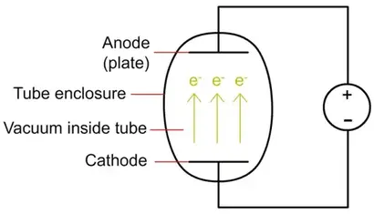
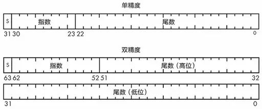

# What Every Programmer Should Know Computer 001


本文的目的是快速了解计算机系统。文章标题模仿了《What Every Programmer Should Know About Memory》

<!--more-->

## 早期计算机

计算机即计算工具，最早是用于辅助计算的。在计算机出现之前，人们使用了很多计算工具：手指，结绳，筹码，算盘，计算尺等用于处理越来越复杂的计算任务。随着计算工作越来越繁重，计算工具也在不断改进。

早期的计算机是基于10进制的机械计算机(莱布尼茨制造)，即通过齿轮基于十进制计算加减，通过持续的加减法计算乘除，以此支持四则运算。其中有一种名叫“步进轮”的装置，步进轮是一个有9个齿的长圆柱体，9个齿依次分布于圆柱表面；旁边另有个小齿轮可以沿着轴向移动，以便逐次与步进轮啮合。每当小齿轮转动一圈，步进轮可根据它与小齿轮啮合的齿数，分别转动1/10、2/10圈……，直到9/10圈，这样一来，它就能够连续重复地做加法。

> 莱布尼茨率先系统提出了二进制的运算法则，也是现代计算机的基础。

计算机发展到现在还是人去操作机器，还没有实现人与机器的对话。1790年法国机械师杰卡德设计了打孔纸带的交互方式来进行编织机的自定提花。在后来电子计算机开始发展的最初几年中，在多款著名计算机中我们均能找到自动提花机的身影。

巴贝奇后来提出了差分机，所谓“差分”的含义，是把函数表的复杂算式转化为差分运算，用简单的加法代替平方运算。在构建差分机的过程中，巴贝奇又设计出了分析机。巴贝奇首先为分析机构思了一种齿轮式的“存贮库”，每一齿轮可贮存10个数，总共能够储存1000个50位数。分析机的第二个部件是所谓“运算室”，其基本原理与帕斯卡的转轮相似，但他改进了进位装置，使得50位数加50位数的运算可完成于一次转轮之中。此外，巴贝奇也构思了送入和取出数据的机构、以及在“存储库”和“运算室”之间运输数据的部件。他甚至还考虑到如何使这台机器处理依条件转移的动作。一个多世纪过去后，现代电脑的结构几乎就是巴贝奇分析机的翻版，只不过它的主要部件被换成了大规模集成电路而已。阿达基于分析机为计算机编出了程序，其中包括计算三角函数的程序、级数相乘程序、伯努利函数程序等等。

1944年，机电计算机马克1号完成建造，这台机器的大脑是机械继电器(不再是纯机械了，而是机械/电动方式)，继电器是用电控制的机械开关。下图中左侧的线圈是控制电路，当电流通过线圈，产生磁场。会吸引右侧的金属臂，从而闭合电路。当控制电流断开时，金属臂断开，右侧电流断开。继电器接通电路表示“1”，继电器断开则表示“0”。


马克1号上安装了大约3000个继电器。继电器能在大约1/100秒内接通或断开电路, 控制速度限制了马克1号的计算速度。同时机械设备的磨损也带来了许多问题。为马克1号编制计算程序的也是一位女数学家格雷斯·霍波（G.Hopper）。有一天，她在调试程序时出现了故障，拆开继电器后，发现有只飞蛾被夹扁在触点中间，从而“卡”住了机器的运行。于是，霍波恢谐地把程序故障统称为“臭虫”（bug，现在表示电脑系统或程序中的一些缺陷或问题）。

## 现代计算机

1906年，美国的德福雷斯特发明了电子管，为计算机的发展奠定了基础。1907年，德福雷斯特向美国专利局申报了真空三极管(电子管)的发明专利。真空三极管可通过控制电路分别处于“饱和”与“截止”状态。“饱和”即从阴极到屏极的电流完全导通，相当于开关开启；“截止”即从阴极到屏极没有电流流过，相当于开关关闭。其控制速度要比继电器快成千上万倍。



真空管的基本工作原理是一种称为热离子发射的现象。它的工作原理是这样的：你加热一种金属，热能会把一些电子敲松。真空二极管由两个电极组成，一个阴极(cathnode)和一个阳极(anode)，放置在封装玻璃管的两端。当阴极被加热时，它通过热离子发射释放电子。然后，通过向阳极（也称为板）施加正电压，这些电子被吸引到板上并可以流过间隙。通过从管中除去空气以产生真空，电子具有从阴极到阳极的清晰路径，并产生电流。


真空三极管。在二极管的基础上添加了第三个电极，第三个电极称为控制网格，使真空管不仅可以用作整流器，还可以用作电信号的放大器。控制网格放置在阴极和阳极之间，呈网格形状（空穴允许电子通过它）。通过调整施加到网格的电压，可以控制从阴极流向阳极的电子数量。如果电网被赋予强烈的负电压，它会排斥阴极上的电子并阻塞电流。你增加的电网电压越多，通过它的电子就越多，电流就越高。通过这种方式，三极管可以用作电流的开/关开关，以及信号放大器。

第一台电子计算机，阿塔纳索夫-贝瑞计算机（Atanasoff–Berry Computer，通常简称ABC计算机）在1937年设计，不可编程，仅仅设计用于求解线性方程组，并在1942年成功进行了测试。然而，这台计算机用纸卡片读写器实现的中间结果存储机制是不可靠的。而且，在发明者约翰·文森特·阿塔纳索夫因为二战任务而离开爱荷华州立大学之后，这台计算机的工作就没有继续进行下去。ABC计算机开创了现代计算机的重要元素，包括二进制算术和电子开关。但是因为缺乏通用性、可变性与存储程序的机制，将其与现代计算机区分开来。这台计算机在1990年被认定为IEEE里程碑之一。

在1946年2月14日，世界上第二台电子计算机，世界上第一台通用计算机 （多个行业都可以使用）埃历阿克”（ENIAC，译成中文是“电子数字积分和计算机”）诞生于美国宾夕法尼亚大学。ENIAC长30.48米，宽6米，高2.4米，占地面积约170平方米，30个操作台，重达30英吨，耗电量150千瓦，造价48万美元。它包含了17,468根真空管（电子管）7,200根晶体二极管，1,500 个中转，70,000个电阻器，10,000个电容器，1500个继电器，6000多个开关。每秒能进行5000次加法运算（据测算，人最快的运算速度每秒仅 5次加法运算），每秒400次乘法运算，是使用继电器运转的机电式计算机的1000倍、手工计算的20万倍。。它还能进行平方和立方运算，计算正弦和余弦等三角函数的值及其它一些更复杂的运算。

1945年6月，冯·诺依曼与戈德斯坦、勃克斯等人，为埃德瓦克方案联名发表了一篇长达101页纸洋洋万言的报告，即计算机史上著名的“101页报告”。这份报告奠定了现代电脑体系结构坚实的根基，直到今天，仍然被认为是现代电脑科学发展里程碑式的文献。报告明确规定出计算机的五大部件（输入系统、输出系统、存储器、运算器、控制器），并用二进制替代十进制运算，大大方便了机器的电路设计。埃德瓦克方案的革命意义在于“存储程序”──程序也被当作数据存进了机器内部，以便电脑能自动依次执行指令，再也不必去接通什么线路。 

冯·诺依曼架构基于三个关键概念: 
- 数据和指令存储在一个读写存储器中。 
- 这个内存的内容可以通过位置寻址，不用考虑到其中包含的数据类型。 
- 执行以顺序的方式(从一条指令到下一条指令)发生,除非显式修改。


### 总结

* 第一代电子管计算机(1946~1958)：
    * 特点： 操作指令是为特定任务而编制的，每种机器有各自不同的机器语言，功能受到限制，速度也慢。另一个明显特征是使用真空电子管和磁鼓储存数据。
* 第二代晶体管计算机 (1956-1963)：
    * 特点： 晶体管代替了体积庞大电子管，使用磁芯存储器。体积小、速度快、功耗低、性能更稳定。还有现代计算机的一些部件:打印机、磁带、磁盘、内存、操作系统等。在这一时期出现了更高级的COBOL和FORTRAN等编程语言，使计算机编程更容易。新的职业(程序员、分析员和计算机系统专家)和整个软件产业由此诞生。
* 第三代集成电路计算机 (1964-1971)：
    * 以中小规模集成电路，来构成计算机的主要功能部件。主存储器采用半导体存储器。运算速度可达每秒几十万次至几百万次基本运算。在软件方面，操作系统日趋完善。
* 第四代大规模集成电路计算机 (1971-至今)：
    * 从1970年以后采用大规模集成电路（LSI）和超大规模集成电路（VLSI）为主要电子器件制成的计算机，重要分支是以大规模、超大规模集成电路为基础发展起来的微处理器和微型计算机。

|发展阶段|逻辑元件|主存储器|运算速度（每秒）|软件|应用|
|:---|:---|:---|:---|:---|:---|
|第一代（1946-1958）|电子管|电子射线管|几千次到几万次|机器语言、汇编语言|军事研究、科学计算
|第二代（1958-1964）|晶体管|磁芯|几十万次|监控程序、高级语言|数据处理、事务处理
|第三代（1964-1971）|中小规模集成电路|半导体|几十万次到几百万次|操作系统、编辑系统、应用程序|有较大发展开始广泛应用
|第四代（1971-至今）|大规模超大规模集成电路|集成度更高的半导体|上千万次到上亿次|操作系统完善、数据库系统、高级语言发展、应用程序发展|渗入社会各级领域

## 布尔逻辑

可以看到虽然现代计算机硬件的不断优化，但是其核心仍是从硬件层抽象出二进制值（电路的通断或高低电平）并映射到true和false(也被称为bit值)。

> 早期的计算机也有基于3进制的设计，即有3种状态。甚至是更多的进制和状态。但是问题是状态越多，越难以区分信号，如果再存在感扰，那么问题更复杂了。二进制可以较好的避开这一问题。

英国数学家George Boole在19世纪提出的布尔代数，是一组对bit进行运算的规则。与普通代数一样，结合律、交换律和分配律也适用于布尔代数。

有三个基本的布尔运算: NOT（非）、AND（与）和OR（或），以及一个复合运算 XOR（异或），四个布尔运算描述如下：

* NOT：NOT运算表示“取反”。例如，如果一个比特是假的，对该比特进行NOT运算，结果为真。如果一个比特是真，那么对该比特进行NOT运算，结果为假。
* AND：此运算涉及2个比特或更多的比特。在2比特运算中，只有第一个和第二个比特均为真的时候，结果才能是真。当涉及超过2个比特时，只有当所有的比特都为真时，结果才是真。
* OR：OR运算也涉及2个比特或更多的比特。在2比特运算中，如果第一个或第二个比特为真，结果为真；否则，结果为假。在超过2个比特的情况下，只要有比特为真，则结果为真。
* XOR：如果第一个和第二个比特具有不同的值，则异或运算的结果为真。2个比特a和b的XOR运算与(a OR b) AND NOT (a AND b) 是一样的。

### AND

and 通常表示为:


AND真值表:

|输入\输入|True|False|
|:---|:---|:---|
|True|True|False|
|False|False|False|


A处输入高电平，B处输入高电平，则两个三极管均导通，则out处近似为高电平。A或者B为低电平，则导致A或者B一定有一段未导通，out处为低电平。更多的实现方式参考[<sup>1</sup>](#refer-anchor-1)。

### OR

or 通常表示为:


OR 真值表:

|输入\输入|True|False|
|:---|:---|:---|
|True|True|True|
|False|True|False|


A或者B为高电平则A或者B均会导通，Q处的电压近似于高电平。更多的实现方式参考[<sup>2</sup>](#refer-anchor-2)。

### NOT 

or 通常表示为:


NOT真值表：

|输入|输出|
|:---|:---|
|True|False|
|False|True|


在上图中A输入0时三极管截止，NOTA处的电压为高电平。当A输入高电平时，三极管导通，NotA处输出低电平。这也和上面的真值表对应上。上面的电路是对布尔逻辑的抽象，现实中有多种实现方式[<sup>3</sup>](#refer-anchor-3)。

#### NAND

NAND 是and 和 not 组合，表示时在 and 前面加个小圆圈


#### NOR

NOR 是or 和 not 组合，表示时在 or 前面加个小圆圈:


### XOR

XOR 通常表示为:


XOR 真值表:

|输入\输入|True|False|
|:---|:---|:---|
|True|False|True|
|False|True|False|

### 计算律

#### 结合律

```
(a OR b) OR c=a OR (b OR c) ，
(a AND b) AND c=a AND (b AND c).
```

#### 交换律

```
a OR b=b OR a
a AND b=b AND a.
```

#### 分配律

```
a AND (b OR c) = (a AND b) OR (a AND c)
(a OR b) AND c=(a AND c) OR (b AND c)
```

#### 吸收律

```
a OR (a AND b)=a
a AND (a OR b)=a
```

#### 幂等律

```
a OR a=a
a AND a=a
```
#### 德摩根定律

```
a AND b = NOT(NOT a OR NOT b)
```

这意味着只要有足够的NOT运算，我们就可以用OR运算代替AND运算（反之亦然）。

#### 对合律(双重否定律)

```
NOT ( NOT a)=a
```

#### 互补律

```
a OR (NOT a)=1
a  AND NOT(a)=0
```

#### 零一律

```
a OR 0=a
a AND 1=a
a OR 1=1 
a AND 0=0
```

## 二进制数

如果将真和假表示为1和0, 上述的布尔运算可以表示为二进制数0，1的运算。同时，二进制数和10进制数一样也可以表示整数。

5028是5个1 000、0个100、2个10、8个1的总和，即5×10^3+0×10^2+2×10^1+8×10^0。将它转为二进制表示:

```
5028= 1×2^12 + 0×2^11 + 0×2^10 + 1×2^9 + 1×2^8 + 1×2^7 + 0×2^6 + 1×2^5 + 0×2^4 + 0×2^3 +1×2^2 + 0×2^1 + 0×2^0 
---
1001110100100
```

> 二进制的每一位被称为bit(比特), 8bit 被称为byte(字节)

### 二进制加法

二进制的加法和十进制是相同的，区别在于进位是2.

|A|B|A+B|
|:---|:---|:---|
|0|0|00|
|0|1|01|
|1|0|01|
|1|1|10|

```
1 :    001
5:     101
----------
6:     110
```

> 我们似乎是把每列中的2个比特相加，但实际上是把3个比特相加，因为进位也需参与加法运算

### 二进制数表示整数

4个比特可以表示0～15的16个数字。用4个比特可以表示16个数字并不意味着这些数字必须位于0～15。语言是通过意义和语境来发挥作用的，这意味着我们可以设计出新的语境来解释比特。

#### 原码表示法

符号常用来区分负数和正数。符号有两个值，即正号和负号，所以可以用比特来表示。我们将使用最左边的位（MSB）来表示符号，剩下的3个位可以表示0～7之间的数字。如果符号位为0，则将其视为正数。如果符号位为1，则将其视为负数。这样，我们总共可以表示15个而不是16个不同的正数和负数，因为正0和负0是相等的。

|符号位|$2^0$|$2^1$|$2^2$|十进制|
|:---|:---|:---|:---|:---|
|0|1|1|1|+7|
|0|1|1|0|+6|
|0|1|0|1|+5|
|0|1|0|0|+4|
|0|0|1|1|+3|
|0|0|1|0|+2|
|0|0|0|1|+1|
|0|0|0|0|+0|
|1|0|0|0|-0|
|1|0|0|1|-1|
|1|0|1|0|-2|
|1|0|1|1|-3|
|1|1|0|0|-4|
|1|1|0|1|-5|
|1|1|1|0|-6|
|1|1|1|1|-7|

原码表示法并不常用，原因有两个：

- 第一，位的建立需要成本，所以我们不想因为用两种不同的方法表示0而增加成本，我们更愿意用这个位组合来表示另一个数字；
- 第二，使用XOR和AND的运算不能用这种表示方法。假设我们想把+1与–1相加。我们期望得到的结果是0，但使用原码表示法，我们却得不到该结果，0001在二进制中代表正数1，因为它的符号位是0；1001在二进制中代表–1，因为它的符号位是1。用XOR和AND运算把它们加在一起，就得到了1010。而1010表示十进制的–2，显然并非+1和–1之和。


#### 反码表示法

另一种得到负数的方法是取正数并翻转它所有的位，这就是所谓的反码表示法。我们以类似于原码的方式对位进行划分。

|符号位|$2^0$|$2^1$|$2^2$|十进制|
|:---|:---|:---|:---|:---|
|0|1|1|1|+7|
|0|1|1|0|+6|
|0|1|0|1|+5|
|0|1|0|0|+4|
|0|0|1|1|+3|
|0|0|1|0|+2|
|0|0|0|1|+1|
|0|0|0|0|+0|
|1|1|1|1|-0|
|1|1|1|0|-1|
|1|1|0|1|-2|
|1|1|0|0|-3|
|1|0|1|1|-4|
|1|0|1|0|-5|
|1|0|0|1|-6|
|1|0|0|0|-7|

可以看到，翻转0111（+7）的每个位，可以得到1000（–7）。为了解决这个问题，我们使用循环进位，使最低有效位增加1，如果在最高有效位之外还有进位，那我们就可以得到正确的结果。

要将用反码表示的+2与–1相加，可以按正常情况对0010和1110进行二进制加法。因为最高有效位（符号位）的数字相加结果是10，我们把0保留，将1作为循环进位。但是我们只有4个位，所以当到达最高有效位时，我们把进位值带回第一个位，得到0001，即+1，也就是+2和–1之和的正确值。可以看到，这样做过于复杂。

|十进制|进位|符号位|$2^0$|$2^1$|$2^2$|
|:---|:---|:---|:---|:---|:---|
|+2||0|0|1|0|
|-1||1|1|1|0|

---

|十进制|进位|符号位|$2^0$|$2^1$|$2^2$|
|:---|:---|:---|:---|:---|:---|
||1|0|0|0|0|

---

|十进制|进位|符号位|$2^0$|$2^1$|$2^2$|
|:---|:---|:---|:---|:---|:---|
|+1||0|0|0|1|


#### 补码表示法

果不添加任何特殊的硬件，只使用XOR和AND运算，会有什么结果？让我们想一想，当与+1相加的时候，什么位型会计算得到0，并称其为–1。如果我们坚持用4个比特表示，+1就是0001。1111与它相加，结果是0000，所以我们用这个位型来表示–1。

这就是所谓的补码表示法，它是有符号整数最常用的二进制表示法。对正数求反码（即对每个位进行NOT运算），然后加1，舍弃MSB的任何进位，就可以得到这个数字的负数。表示+1的0001的反码是1110，加1就可以得到表示–1的1111。同理，+2是0010，它的反码是1101，再加1就可以得到表示–2的1110。

我们用0来试一下，看看补码表示法是否解决了0的重复表示问题。取0000并翻转每个位，我们得到它的反码1111。将1加到1111，得到\[1\]0000，但由于这是一个5位的数字，超过了我们可用的位数，所以我们可以忽略掉进位位中的1。这样就只剩下0000，也就是刚开始的0，所以0在补码表示法中只有一个表示形式。

|符号位|$2^0$|$2^1$|$2^2$|十进制|
|:---|:---|:---|:---|:---|
|0|1|1|1|+7|
|0|1|1|0|+6|
|0|1|0|1|+5|
|0|1|0|0|+4|
|0|0|1|1|+3|
|0|0|1|0|+2|
|0|0|0|1|+1|
|0|0|0|0|+0|
|1|1|1|1|-1|
|1|1|1|0|-2|
|1|1|0|1|-3|
|1|1|0|0|-4|
|1|0|1|1|-5|
|1|0|1|0|-6|
|1|0|0|1|-7|
|1|0|0|0|-8

n位数下可以用补码表示的数字范围: $-2^{n-1}  \space to \space 2^{n-1}-1$

### 二进制数表示实数

实数在十进制中包括一个小数点。我们需要一些方法来表示等价二进制点。同样，这可以通过在不同语境解释二进制位来实现。

### 定点表示法

用二进制表示分数的一种方法是任意选择一个二进制点（小数点的二进制等价物）位置。比如，如果有4个位，我们可以假设其中两个位在二进制点的右边，表示4个小数，而另外两个位在左边，表示4个整数。这就是所谓的定点表示法，因为二进制点的位置是固定的。 例如 01 11 = $1 + \frac{1}{2}+\frac{1}{4}$ = 5/4 。

虽然这种方法很好用，但在通用型计算机中并不常用，因为它需要太多的位来表示有用的数字范围。

#### 浮点表示法

我们用二进制版本的科学记数法来解决这个问题，科学记数法常用于表示包括普朗克常数和阿伏伽德罗常数在内的大量级的数字。科学记数法创造了一个新的解释语境，以表示巨大范围内的数字。它使用小数点左边是个位的数字（称为尾数）乘以10的幂（称为指数）来表示。计算机也使用与这类似的表示方法，不过尾数和指数是二进制数，而底数10变成了2。注意按照浮点数标准，尾数的整数部分在 `[0~2)`之间。

请注意，我们无须使用任何比特来表示底数2，因为浮点定义默认底数为2。通过将有效数字和指数分开，浮点表示法可以表示非常小或非常大的数字，无须存储所有数字中含有的零。以4位的浮点表示法为例，其中前2位为尾数，后2位为指数。11 11 = $(1+\frac{1}{2})*2^3$

#### IEEE浮点标准

IEEE（Instituteof Electrical and Electronic Engineer）代表美国电气电子工程师协会，它是一个专业组织，其业务包括制作标准。我们希望在可用的位数下，最大限度地提高精度。有个巧妙的技巧叫作归一化，它可以调整尾数，所以不需要前导（即在左边）的零。每次调整尾数都需要对指数进行相应的调整。第二种技巧来自数字设备公司（Digital Equipment Corporation,DEC），它扔掉了尾数最左边的那一位（因为我们知道最左边那一个位永远是1），将精度提高了一倍，也多了一个位的空间。



这两种格式都有一个符号位，即图中的S。可以看到，双精度浮点数比单精度浮点数多了3个指数位，范围是单精度的8倍。双精度浮点数也比单精度浮点数多了29个尾数位，精度更高。然而，代价是双精度浮点数要比单精度浮点数多占一倍的位数。

指数值没有明确的符号位。IEEE 754的设计者将所有0和所有1的指数值都设计为有特殊意义，所以实际的指数值必须被压缩到剩余的位型中。他们使用偏置（偏移）指数值来实现这点。对于单精度浮点数，偏移值是127，这意味着127（01111111）的位型代表指数值为0。1（00000001）的位型代表指数值为–126，254（11111110）的位型代表指数值+127。双精度浮点数也类似，只不过它的偏移值为1 023。IEEE 754的另一个方便之处是，它有特殊的位组合，可以表示除以0之类的东西，它的值为正负无穷大。它还指定了一个叫作NaN的特殊值，代表“不是数字”，所以如果你发现处于NaN状态，可能意味着你做了一些不合理的算术运算。这些特殊的位组合使用了前面讨论过的保留指数值。

### 二进制和十进制的转换

* 由二进制数转换成十进制数的基本做法是，把二进制数首先写成加权系数展开式，然后按十进制加法规则求和。这种做法称为"按权相加"法。
* 十进制数转换为二进制数时，由于整数和小数的转换方法不同，所以先将十进制数的整数部分和小数部分分别转换后，再加以合并。
  * 十进制整数转换为二进制整数采用"除2取余，逆序排列"法。具体做法是：用2去除十进制整数，可以得到一个商和余数；再用2去除商，又会得到一个商和余数，如此进行，直到商为零时为止，然后把先得到的余数作为二进制数的低位有效位，后得到的余数作为二进制数的高位有效位，依次排列起来。
  * 十进制小数转换成二进制小数采用"乘2取整，顺序排列"法。具体做法是：用2乘十进制小数，可以得到积，将积的整数部分取出(判断是否大于1，大于1就取1，小于1就取0)，再用2乘余下的小数部分，又得到一个积，再将积的整数部分取出，如此进行，直到积中的小数部分为零，或者达到所要求的精度为止。然后把取出的整数部分按顺序排列起来，先取的整数作为二进制小数的高位有效位，后取的整数作为低位有效位。 


## 参考

<div id="refer-anchor-1"></div>

- [1] [AND gate - Wikipedia](https://en.wikipedia.org/wiki/AND_gate)

<div id="refer-anchor-2"></div>

- [2] [OR gate - Wikipedia](https://en.wikipedia.org/wiki/OR_gate)


<div id="refer-anchor-3"></div>

- [3] [Inverter (logic gate) - Wikipedia](https://en.wikipedia.org/wiki/Inverter_(logic_gate))

- [4] [electrical4u. NOT Gate: What is it? (Working Principle & Circuit Diagram)](https://www.electrical4u.com/not-gate/)

