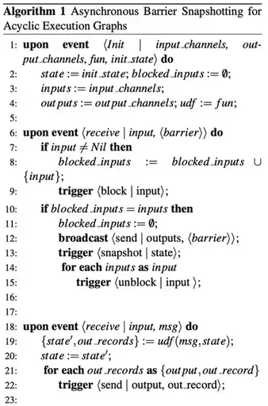
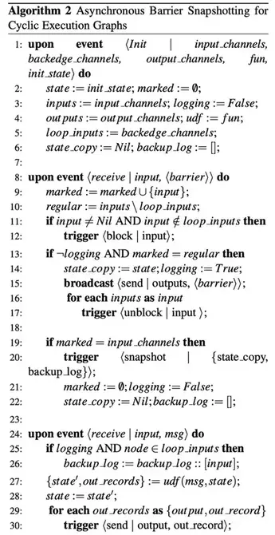
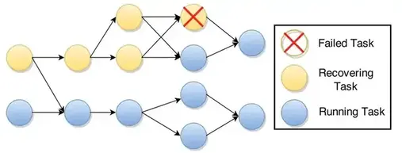
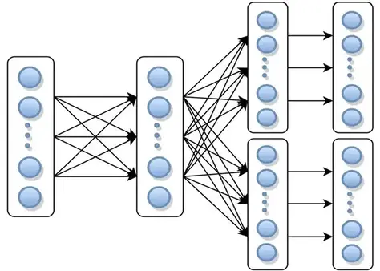
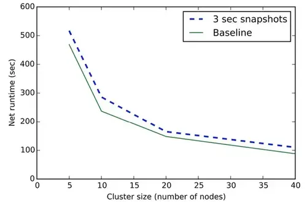

# Lightweight Asynchronous Snapshots for Distributed Dataflows

本篇是论文[Lightweight Asynchronous Snapshots for Distributed Dataflows](https://arxiv.org/abs/1506.08603)的中文简单翻译

<!--more-->

## 概述

分布式有状态的流处理允许在云上部署和执行大规模的流数据计算，并且要求低延迟和高吞吐。这种模式一个比较大的挑战，就是其容错能力，能够应对潜在的 failure。现有的方案都是依赖周期性地全局状态的快照做失败恢复。 这些方法有两个主要的缺点:

1. 通常会停止分布式计算，影响流的摄入(为了获得全局的一致性状态，需要停止流处理程序，直到快照的完成)。
2. 快照的内容包含传输过程中所有的内容，这导致快照的大小过大。

本篇论文中提出了一个适用于现代数据流执行引擎，并最大限度减少空间需求的轻量级算法 Asynchronous Barrier Snapshot（ABS）。ABS在无环的拓扑结构中只对有状态的operator进行快照，对于有环的执行拓扑只保存最小化的record日志。在Apache Flink（一个支持有状态的分布式流处理分析引擎）中实现了ABS。通过评估表明，这种算法对程序执行没有很重的影响，并且保持了线性的可扩展性，在频繁的快照情况下也表现良好。

**关键词**: 容错，分布式计算，流处理，数据流，云计算，状态管理

## 介绍

分布式数据流处理是⼀种数据密集计算的新兴方式，它允许基于大量数据的持续计算，致力于在保证高吞吐时，实现端到端的低延迟。有一些时间敏感的框架系统，例如Apache Flink [<sup>1</sup>](#refer-anchor-1) 和 Naiad [<sup>11</sup>](#refer-anchor-11) 受益于数据流处理架构，特别是在实时处理领域(例如，预测分析和复杂事件处理)。容错在这类系统中是最重要的，因为在⼤多数现实世界的⽤例中⽆法承受故障。目前已知的，在有状态系统中实现精准一次语义的方法依赖于全局的，一致性的状态快照。然而，有两个主要的缺点，使得这类应用在实时流处理场景效率低下。

1. 同步快照技术，会停止整个分布式计算，以获得整个状态的一致性视图。
2. 此外，据我们所知，目前所有的分布式快照算法都会把未处理和正在传输过程中的事件作为执行图的快照的一部分持久化，通常这会导致快照比实际更大。

本文中，我们专注于提供轻量级快照，专门针对有状态的分布式实时流系统，对性能影响极小。我们的解决方案提供了异步状态快照，低空间成本，仅包含有向无环图中算子的状态。此外，我们还涵盖了有环的执行情况，且保持快照最小。我们的技术不会停止流的执行，且只会引入少量的运行时开销。本文内容概括如下:

1. 我们提出并实现了⼀种异步快照算法，可以在有向无环图上实现最小快照。
2. 我们描述并实现了适⽤于有环图的算法
3. 我们展⽰了我们⽅法的优势，使用Apache Flink Streaming 作为最先进的技术，用于比较。

本文其余部分组织如下:

1. 第二节概述了现有的有状态数据流系统中的分布式全局快照的⽅法。
2. 第三节提供了Apache Flink 实时流处理的概述和执行模型。
3. 第四节描述对全局快照的主要⽅法细节。
4. 在第五节中对恢复⽅案进行了简要描述
5. 第六节总结了我们的实现，
6. 在第7节是我们的评估
7. 第八节中的未来⼯作和结论。

## 相关工作

在过去的十年中，出现了很多种关于连续处理系统的恢复机制的解决办法[<sup>4</sup>](#refer-anchor-4)<sup>,</sup>[<sup>11</sup>](#refer-anchor-11)。有一些系统如 Discretized Streams[<sup>15</sup>](#refer-anchor-15)和 Comet[<sup>6</sup>](#refer-anchor-6) 会把连续处理当作无状态的分布式批处理计算，通过重新计算来做状态恢复。另一方面，有状态的数据流系统，例如，Naiad[<sup>11</sup>](#refer-anchor-11),SDGS[<sup>5</sup>](#refer-anchor-5),Piccolo[<sup>12</sup>](#refer-anchor-12)和SEEP[<sup>3</sup>](#refer-anchor-3),是本文中我们主要关注的，它们使用checkpoint来获取全局一致的快照用于失败恢复。

分布式环境的一致性全局快照问题，自从在 Chandy 和 Lamport 的论文[<sup>4</sup>](#refer-anchor-4)中提出来后，过去二十多年一直在被广泛地研究[<sup>7</sup>](#refer-anchor-7)<sup>,</sup>[<sup>8</sup>](#refer-anchor-8)。一个全局快照，理论上反映了作业执行的总体状态以及operator实例的可能状态。对于全局一致性快照算法，Naiad[<sup>11</sup>](#refer-anchor-11)中提出了一个简单但代价非常高昂的实现方案：

1. 首先停止整个执行图的计算
2. 然后执行快照
3. 最后，如果快照完成了，每个task再恢复之前的计算

这个实现方案对吞吐和空间占用都有很大的影响，因为需要停止整个计算，且还依赖上游生产者的事件备份能力。另一个实现方案，就是 Chandy-Lamport 算法[<sup>4</sup>](#refer-anchor-4),当前它已经应用在很多的系统[<sup>5</sup>](#refer-anchor-5)<sup>,</sup>[<sup>10</sup>](#refer-anchor-10)中，它是异步地执行快照，并且要求上游数据源可以回溯。它是通过在数据流中发送 marker 来触发算子和通道的状态。但这种算法还需要额外的存储空间用于上游数据量恢复，且备份事件的重新计算也会导致恢复时间较长。我们的方法扩展了Chandy和Lamport最初的异步快照思想，对于无环拓扑图 它不会备份未处理及通道中正在传输的record，对于有环的拓扑图，也只需要很少量的record备份。

## 背景: Apache Flink 系统

我们所做的工作是以Apache Flink Streaming的容错需求为导向的，Apache Flink Streaming是一个分布式流分析系统，是Apache Flink 技术栈的一部分(以前是stratosphere[<sup>2</sup>](#refer-anchor-2))。Apache Flink 围绕通用运行时引擎架构，统一处理批处理和流式作业，这些作业由有状态的相互关联的任务组成。Flink中的分析任务会被编译成基于task的有向图。数据从外部源获取，以管道的方式通过有向图在Task间传输。Task根据收到的输入，持续操作自身内部状态，并生成新的输出。

### 流处理模型

Apache Flink的流处理API允许复杂流分析作业的组合，这个能力是通过将无界分区数据流(部分排序的记录序列)暴露为其核心数据抽象-`DataStreams`(数据流)。DataStreams可以由外部数据源产生(例如消息队列，socket流和自定义生成器等)，也可以通过其他的DataStreams转换而来。DataStreams以高阶函数的形式支持多种算子，例如map,filter,reduce等，这些算子被每条记录按序应用同时生成新的DataStreams。每个算子支持并行执行，通过将算子的并行实例运行在相应流的不同分区上，从而允许分布式执行流的转换。

下面的示例是在Apache Flink 上实现一个简单的增量wordCount程序。在这个程序里，单词从文本文件中读取,每个单词当前出现的次数会被打印到标准输出。这是一个有状态的流处理程序,因为数据源需要感知到文件当前的偏移量，计数器需要维护每个单词当前出现的次数作为它们的内部状态。

```scala
var env: StreamExecutionEnvironment = _
env.setParallelism(2)

val wordStream = env.readTextFile(path)
val countStream = wordStream.groupBy(_).count
countStream.print
```

### 分布式数据流执行

当用户执行应用程序的时候，所有的DataStream 算子被编译成一个有向图`G=(T,E)`，类似于Naiad[<sup>11</sup>](#refer-anchor-11)。其中顶点T代表任务，边E代表任务间的数据管道。图-就是一个增量wordCount的执行图。正如所示，每个算子的实例都被封装在相应的任务中。


task可以被进一步分类，没有输入的可以看做是Source，没有输出的可以看作为Sink。更进一步，M代表了task并行执行阶段所有传输的记录，每一个task, $t \in T$ 封装了独立执行的operator实例。由以下部分组成:

- 输入输出管道的集合: $I_{t},O_{t} \subset E$;
- 操作符状态: $s_{t}$;
- 用户定义函数: $f_{t}$;

数据的摄取是基于拉取: 在task的执行期间，每个task消费输入记录，更新自己的算子状态并更加用户定义函数生成新的记录。更具体地说，一个task, $t \in T$ 每接收的每一条数据 $r \in M$，会产生新的输出集合 $D \in M$ 和 新的状态 $s'_{t}$。上述过程是根据UDF生成的:

$$
f_{t}: s_{t},r \to \lbrack s'_{t},D \rbrack
$$

## 异步屏障快照(ABS)

为了提供一致性的结果，分布式处理系统要能容忍任务失败(从错误中恢复)，一种提供容错性的方法是周期性的获取执行图的快照，用于后面从故障中恢复。快照是执行图的全局状态，要求具备从当前状态重启计算的所有必需信息。

### 问题定义

我们定义执行图 $G=(T,E)$ 的全局快照为 $G^{*}=(T^{*},E^{*})$，它是一个集合包含所有task和edge的状态。更进一步，$T^{*}$ 包含了所有算子的状态 $s^{*}_{t} \in T^{*} ,\forall t \in T$ ，$E^{*}$ 是通道状态的集合 $e^{*} \in E^{*}$, $e^{*}$ 由e中传输的记录组成。

我们要求每个快照G保持某些属性，以保证恢复后的正确结果。例如Tel[<sup>14</sup>](#refer-anchor-14)中所述的最终性(termination)与可行性(feasibility)。

最终性(termination)保证了一个快照算法在所有处理流程都处于活动状态的情况下，在其启动后的有限时间内最终完成。可行性(feasibility)表示一个快照的意义，即在快照过程中没有丢失有关计算的信息。形式上，这意味着在快照中维护因果顺序[<sup>9</sup>](#refer-anchor-9)，以便任务中传递的记录也从快照的⻆度发送。

### 无环数据流拓扑的ABS

当执行被划分为多个阶段(Stages)时，在不持久化通道状态(channel state)的情况下执行快照是可行的。Stages将注入的数据流和所有相关的计算划分为一系列可能的执行。其中所有先前的输入和生成的输出都已完全处理完毕。一个stage结束时的operator状态的集合反映了整个执行的历史。因此，它可以单独用于快照。我们算法的核心思想是**在保持连续数据摄取的同时，使用分段快照创建相同的快照**。

我们的⽅法是在连续的数据流执⾏中模拟出了阶段。这是通过在执行图的源中周期性注入特殊的屏障(barrier)标记来实现的，这些特殊的barrier标记会随着整个DAG图被推送到下游，最终到sink端。随着每个任务收到暗示执⾏阶段开始的屏障(barrier)事件，全局快照被增量的构建。我们进一步的对算法作出如下假设:

- 网络通道是相对可靠的，遵循FIFO先进先出的顺序，且可以是阻塞和非阻塞。当通道被阻塞时，所有消息都被缓存到buffer。直到通道不阻塞后，消息才开始分发。
- 任务可以触发对其通道组件的操作，例如阻塞、解除阻塞和发送消息。对于一个task的所有输出管道，还支持广播操作。
- 源任务注⼊的消息(例如阶段屏障）被解析为"Nil"输⼊通道。



ABS算法一执行过程如下:


- 中心协调器周期性的向所有的source注入阶段性的屏障(stage barriers)。当source收到一个barrier时，它会做当前状态的一个快照。然后将这个barrier广播到它的全部输出(图二中a)。
- 当一个非source的task从它的一个输入端收到barrier时，它会阻塞这个输入通道直到它从所有输入端收到barrier为止(图中b，算法第9行)。
- 当收齐所有的barrier后，该task就会生成其当前状态的快照并广播barrier给所有output(图中c，算法第12-13行)。
- 然后，这个task会unblock它的所有输入通道继续计算(图中d，算法15行)。

最终的全局快照 $G^{*} = (T^{*},E^{*})$ 是所有 $E^{*}=\emptyset$ 的operator的状态 $T^*$ 组成的。

#### 简要证明

如前所述，快照算法应保证最终性和可⾏性。最终性由通道和无环执行图属性保证。通道的可靠性保证只要task存活最终会收到之前的每一个barrier，DAG图中的每一个task都会从它所有的输入通道收到barrier并生成快照。

在可行性方面，全局快照中operator的状态只反映到最后一个stage处理的数据的历史。由管道的FIFO(先进先出)顺序属性和barrier事件到来时的队列阻塞保证。这确保了快照生成前没有post-shot记录(跟在barrier后的记录)被处理。

### 有环数据流拓扑的ABS

在执行图存在环的情况下，上面的ABS算法不会停止，会导致死锁，因为task会无限等待来自所有输入的barrier。此外，环中任意传输的records将不包含在快照中，违反了可行性,数据准确性有误。因此，为了可行性需要一致地将一个周期内生成的所有记录包括在快照中，并在恢复时将这些记录放回传输。处理有环图的方法(如下图算法二)扩展了基本算法，并且没有引入额外的通道阻塞。



首先通过静态分析在执行图的循环中定义一个back-edges集合 L，根据控制流图理论，一个有向图中，一个back-edge是一个指向已经在深度优先搜索中被访问的点(vertex)和边(edge)。定义执行图G(T,E\L)是一个包含拓扑中所有task的有向无环图(DAG)。从这个 DAG 的⻆度来看，算法像以前⼀样运⾏，但是，我们还在快照期间对从已识别的back-edges接收到的记录进⾏下游备份。对于 $L_{t} \subset I_{t}$  ,$L_t$ 的每个消费者任务 t 实现了上述逻辑，从 $L_{t}$ 转发barrier的那⼀刻起，直到从 $L_{t}$ 接收到它们,它创建从 $L_t$ 接收到的所有记录的⽇志备份。屏障将循环传输中的所有记录推送到下游⽇志中，因此它们在⼀致快照中包含⼀次。

算法二的执行过程如下图所示:


- 有back-edge作为输入通道的task，当它们的普通(regular)输入通道(e∉L)都接受到了barrier，该task会生成一个本地的备份(图中b，算法14行)。
- 从这个时间点开始，这个节点将从back-edges收到的所有record记录下来，直到收到来自相应的barrier(算法26行)。
- 如图中c，所有循环中的pre-shot records和状态的备份都被作为快照的一部分。意味着最终的全局状态 $G^{*} = (T^{*},L^{*})$ 包含所有task状态和仅在传输中的back-edge records $L^{*} \subset E^{*}$

#### 简要证明

现在我们需要在这个版本的算法中再次证明最终性和可行性。

最终性(termination)与无环图一样，因为每个task最终接收所有输入通道(包含back-end通道)的barrier，并且完成快照。一旦接收到了所有常规输入的barrier,就广播它，从而避免了前面提到的死锁。

FIFO的顺序属性仍然适用于back-edges,以下属性证明了可行性(feasibility) 

- 快照中包含的每个task的状态，是在处理regular输入接收的post-shot record之前执行的task状态副本。- 快照中包含的下游日志是完整的，由于FIFO保证，包含back-edge接收的所有barrier之前的所有pending的post-shot record。

## 故障恢复

虽然不是这项⼯作的主要焦点，但⼯作故障恢复⽅案激发了我们快照⽅法的应⽤。因此，我们在此提供有关其操作的简要说明。有⼏种使⽤⼀致快照的故障恢复⽅案。

最简单的形式是，可以从最后一个全局快照重新启动整个执行图。例如每个task t:

- 从持久化存储中获取快照st的状态并设置为初始状态.
- 恢复其备份日志并处理其中包含的所有records。
- 开始摄取数据从输入通道。

部分图恢复方案也是可行的，通过仅重新调度上游依赖task。以及它们各自的上游task，直到source。一个恢复计划的例子如图所示。为了提供exactly-once语义。重复的记录应该被忽略在下游节点，避免重复计算。可以按SDG类似的方案。使用来自source的序列号标记记录，每个下游节点可以丢弃序列号小于已处理数据的记录。



## 实现

我们将 ABS 算法的实现贡献给 Apache Flink，以便提供精准⼀次的流式运⾏时的处理语义。在我们的当前实现中，阻塞的通道将所有即将到来的记录存储在磁盘上，⽽不是将它们保存在内存中以增加可扩展性。虽然这种技术确保了健壮性，但是，它增加了运⾏时对ABS的影响。

为了区分算⼦状态和数据，我们引⼊了⼀个显式的 OperatorState 接⼝，该接⼝包含状态的更新和状态的检查点的相关⽅法。我们为Apache Flink⽀持的有状态运⾏时算子(例如，基于偏移的数据源或聚合)提供了OperatorState 实现。

快照协调被实现为⼀个作业管理器上的actor进程，用于保持单个作业的执⾏图的全局状态。协调器定期向执行图的所有数据源注入stage barriers(阶段屏障事件)。除非重新配置，最后⼀个全局快照状态在算子们中从分布式内存持久存储中恢复。

## 性能评估

我们评估的目标是将ABS的运行时开销与Naiad[<sup>11</sup>](#refer-anchor-11)中采用的全局同步快照算法比较，并测试算法在大量节点上的扩展性。

### 实验设置

⽤于评估的执⾏拓扑由6个不同的运算符组成(如下图)。



并⾏度与集群节点数相同，task点的数量是6倍集群节点数量。这个执行有三个shuffle，这样可以尽量增大channel block的影响。Source会生成10亿条数据，均匀分布在Source实例中，拓扑图中operator的状态是key的聚合的中间结果和source的offsets，这个测试跑在Amazon EC2集群，使用40个m3.medium instances。

我们测试了不同方案的快照运行时开销，ABS与同步方式快照。在Apache Flink上实现了Naiad中采用的同步快照算法，为了让这个比较有相同的执行后端。这个实验跑在10节点集群上。为了评估算法的可扩展性 我们处理固定数量的数据。同时将并行度从5个增加到40个。

### 结论

图中我们展示了两种算法对基线的运行时影响，当快照的时间间隔很短，同步快照的性能影响很明显，因为程序花费更多时间没有处理数据，为了获得全局快照。ABS对运行时的影响要小很多。因为它不会阻塞整个执行过程的持续运行。并且保持相当稳定的吞吐率，对于较大的快照间隔，同步算法的影响较小，同时让系统在剩余的执行期间以正常的吞吐量运行。


然而对于延迟很敏感的应用来说，突发的快照会影响SLA，例如入侵检测，因此这些应用将进一步受益于ABS的性能提升。下图中我们将运行ABS的拓扑的可扩展性(并行度从5增加到40)与基线的3秒快照间隔进行了比较，很明显，基线和ABS都实现了线性可扩展性。



## 未来的⼯作和结论

在未来的⼯作中，我们计划通过解耦快照状态和操作状态来探索进⼀步降低 ABS 影响的可能性。那将允许纯粹的异步状态管理，任务可以在持久化快照的同时持续处理记录。在这样的⽅案中，还需要同步快照前和快照后的记录，相应的状态可以通过标记记录它们所属的快照来解决。这种⽅法将增加计算空间和算法的⽹络 I/O 要求，我们计划将其性能与我们当前的ABS实现进⾏⽐较。最后，我们计划研究不同的恢复技术，这些技术可以保持精确⼀次的语义，同时通过以下⽅式最⼤限度地减少在每个任务的粒度上重新配置的需要。

综上所述，我们关注的是在分布式数据流系统上执行周期性全局快照的问题，我们介绍了一种新的快照技术ABS，有很好的吞吐量。ABS是第一个考虑无环的执行拓扑可能的最小化状态的算法。此外，通过只存储需要在恢复时重新处理的记录，我们扩展了ABS来处理有环执行拓扑图。我们在Apache Flink上实现了ABS算法，并和同步快照作了对比，测试了我们的方法。ABS显示出良好的效果，对整体执行吞吐量的影响很小，具有线性可扩展性。

## 参考

<div id="refer-anchor-1"></div>

- [1] [Apache flink](https://flink.apache.org/)

<div id="refer-anchor-2"></div>

- [2] A. Alexandrov, R. Bergmann, S. Ewen, J.-C. Freytag, F. Hueske, A. Heise, O. Kao, M. Leich, U. Leser,V. Markl, et al. The stratosphere platform for big data analytics. The VLDB JournalThe International Journal on Very Large Data Bases, 23(6):939–964, 2014.

<div id="refer-anchor-3"></div>

- [3] R. Castro Fernandez, M. Migliavacca, E. Kalyvianaki, and P. Pietzuch. Integrating scale out and fault tolerance in stream processing using operator state management. In Proceedings of the 2013 ACM SIGMOD international conference on Management of data, pages
725–736. ACM, 2013.

<div id="refer-anchor-4"></div>

- [4] K. M. Chandy and L. Lamport. Distributed snapshots: determining global states of distributed systems. ACM Transactions on Computer Systems (TOCS), 3(1):63– 75, 1985.

<div id="refer-anchor-5"></div>

- [5] R. C. Fernandez, M. Migliavacca, E. Kalyvianaki, and P. Pietzuch. Making state explicit for imperative big data processing. In USENIX ATC, 2014.

<div id="refer-anchor-6"></div>

- [6] B. He, M. Yang, Z. Guo, R. Chen, B. Su, W. Lin, and L. Zhou. Comet: batched stream processing for data intensive distributed computing. In Proceedings of the 1st ACM symposium on Cloud computing, pages 63–74.
ACM, 2010.

<div id="refer-anchor-7"></div>

- [7] A. D. Kshemkalyani, M. Raynal, and M. Singhal. An introduction to snapshot algorithms in distributed computing. Distributed systems engineering, 2(4):224,1995.

<div id="refer-anchor-8"></div>

- [8] T. H. Lai and T. H. Yang. On distributed snapshots. Information Processing Letters, 25(3):153–158, 1987.

<div id="refer-anchor-9"></div>

- [9] L. Lamport. Time, clocks, and the ordering of events in a distributed system. Communications of the ACM, 21(7):558–565, 1978.

<div id="refer-anchor-10"></div>

- [10] Y. Low, D. Bickson, J. Gonzalez, C. Guestrin, A. Kyrola, and J. M. Hellerstein. Distributed graphlab: a framework for machine learning and data mining in the cloud. Proceedings of the VLDB Endowment, 5(8):716–727, 2012.

<div id="refer-anchor-11"></div>

- [11] D. G. Murray, F. McSherry, R. Isaacs, M. Isard, P. Barham, and M. Abadi. Naiad: a timely dataflow system. In Proceedings of the Twenty-Fourth ACM Symposium on Operating Systems Principles, pages 439–455. ACM, 2013.

<div id="refer-anchor-12"></div>

- [12] R. Power and J. Li. Piccolo: Building fast, distributed programs with partitioned tables. In OSDI, volume 10, pages 1–14, 2010.

<div id="refer-anchor-13"></div>

- [13] Z. Qian, Y. He, C. Su, Z. Wu, H. Zhu, T. Zhang, L. Zhou, Y. Yu, and Z. Zhang. Timestream: Reliable stream computation in the cloud. In Proceedings of the 8th ACM European Conference on Computer Systems, pages 1–14. ACM, 2013.

<div id="refer-anchor-14"></div>

- [14] G. Tel. Introduction to distributed algorithms. Cambridge university press, 2000.

<div id="refer-anchor-15"></div>

- [15] M. Zaharia, T. Das, H. Li, S. Shenker, and I. Stoica. Discretized streams: an efficient and fault-tolerant model for stream processing on large clusters. In Proceedings of the 4th USENIX conference on Hot Topics in Cloud Ccomputing, pages 10–10. USENIX Association, 2012.

