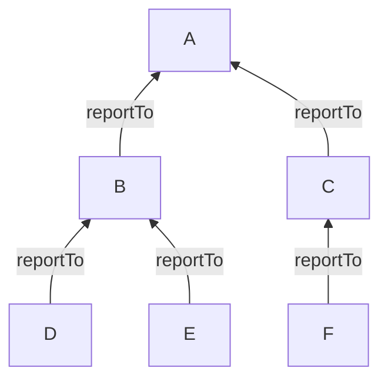

# Mysql存储树结构

通常在mysql中存储树形结构的方案，是通过在子节点上存储父节点编号的方案来实现的。这种方案可以很直观的体现各个节点之间的关系，通常可以满足大多数需求。

但是当数据量变大和层级关系变深后，对于部分需求(例如，判断节点是否其他节点的子节点)这样的存储方式很难满足要求。这类需求实质上需要在内存中构建一棵树，通过遍历树来给出答案。如果还是使用parent_id这种存储模型，显然需要按照树的层级关系递归向下搜索。

<!--more-->

例如，以mysql数据库样例Employees表为例。

```
+----------------+
| employees      |
+----------------+
| employeeNumber |
| lastName       |
| firstName      |
| extension      |
| email          |
| officeCode     |
| reportsTo      |
| jobTitle       |
+----------------+
```

employees表有reportsTo字段引用employeeNumber字段。描述employee之间的层级关系。

上述的存储方式，获取树的流程为:

```java
List<Employee> employees;
List<Employee> records;
List<String> reportsTos;
do {
    // getEmployeesByReportsTos 每次调用都要连接数据库，查询数据库
    // select * from employees where reportsTo in ${reportsTos};
    employee= getEmployeesByReportsTos(reportsTos);
    reportsTos = getReportsTos(employee);
    records.addAll(employees);
}while(employees.isNotEmpty())
```

上述操作是递归方式查询，查询效率仍会随着树层级深度的提高而变差。

## cte

在不改变存储方式的情况下，我们可以使用Mysql8的新功能CTE。递归公用表表达式  （CTE）是一个CTE，它有一个子查询，它引用CTE名称本身。以下说明了递归CTE的语法:

```
WITH RECURSIVE cte_name AS (
    initial_query  -- anchor member
    UNION ALL
    recursive_query -- 引用CTE名称的递归成员
SELECT * FROM cte_name; 
```

递归CTE由三个主要部分组成：

- 初始查询，形成CTE结构的基本结果集。初始查询部分称为锚成员。
- 递归查询部分是引用CTE名称的查询，因此，它被称为递归成员。递归成员由UNION ALL或UNION DISTINCT运算符与锚成员连接。
- 终止条件，确保递归成员不返回任何行时停止递归。

递归CTE的执行顺序如下：

- 首先，将成员分为两部分：锚点和递归成员。
- 接下来，执行锚成员以形成基本结果集 $R_0$，并将此基本结果集用于下一次迭代。
- 然后，执行带有 $R_i$ 结果集作为输入的递归成员并将其( $R_{i+1}$)作为输出。
- 之后，重复第三步，直到递归成员返回空结果集，换句话说，满足终止条件。
- 最后，使用UNION ALL运算符将结果集从 $R_0$ 到 $R_n$ 组合。

递归成员不得包含以下结构：

- 聚合函数，例如MAX，MIN，SUM，AVG，COUNT等。
- GROUP BY子句
- ORDER BY子句
- LIMIT 子句
- DISTINCT(禁止DISTINCT仅在您使用UNION时适用。如果您使用UNION DISTINCT，DISTINCT则允许。)

> 注意：上述约束不适用于锚点成员。

### 例子

```sql
WITH RECURSIVE employee_paths AS
  ( SELECT employeeNumber,
           reportsTo managerNumber,
           officeCode, 
           1 lvl
   FROM employees
   WHERE reportsTo IS NULL
     UNION ALL
     SELECT e.employeeNumber,
            e.reportsTo,
            e.officeCode,
            lvl+1
     FROM employees e
     INNER JOIN employee_paths ep ON ep.employeeNumber = e.reportsTo )
SELECT employeeNumber,
       managerNumber,
       lvl,
       city
FROM employee_paths ep
INNER JOIN offices o USING (officeCode)
ORDER BY lvl, city; 
```

我们将查询分解为更小的部分，以便更容易理解。

首先，使用以下查询形成锚点成员：

```sql
SELECT 
    employeeNumber, reportsTo managerNumber, officeCode
FROM
    employees
WHERE
    reportsTo IS NULL 
```
这个查询（锚定件）返回顶级经理，其reportsTo是NULL。

其次，通过引用CTE名称来创建递归成员，employee_paths在这种情况下：

```sql
SELECT 
    e.employeeNumber, e.reportsTo, e.officeCode
FROM
    employees e
        INNER JOIN
    employee_paths ep ON ep.employeeNumber = e.reportsTo 
```

此查询（递归成员）返回管理者的所有汇报下属，直到没有更多的汇报下属(递归停止)。

第三，使用employee_pathsCTE 的查询将CTE返回的结果集与offices表连接，以生成最终结果集。

## 为树设计的存储结构



- Value初始值为0。
- 从根节点左侧开始,每经过一个节点，Value+1,给节点左值设为Value，以此类推地沿着树开始遍历。
- 遇到叶子节点，Value+1，给节点右值设为Value，再继续向上沿着边缘继续遍历
- 遍历结束回到根节点右侧。


遍历完后每一个节点都有与之对应的左右值。这个时候可以去除parent_id字段，添加lft,rgt，来存储左右值（同时增加一个level字段作为层级）。

- 查出所有子孙节点: 只要查左值在"根节点"的左\右值之间的节点，查出来都是他的子节点。
- 查询子孙节点总数: `总数 = (右值 - 左值 - 1) / 2`
- 判断是否叶子节点: `右值 - 1 == 左值`那他就是叶子节点，反之则不是叶子节点。
- 新增节点: 当新增一节点门时，需要对新增节点位置的后续边缘进行加2操作，因为每一个节点有左右两个数值。这个操作通常需要放到事务中进行处理。

```sql
SET @lft := 7;/*新部门的左值*/
SET @rgt := 8;/*新部门的左值*/
/*将插入的后续边缘的节点左右数+2*/
UPDATE employees SET lft=lft+2 WHERE lft > @lft;
UPDATE employees SET rgt=rgt+2 WHERE rgt >= @lft;
/*插入数据*/
INSERT INTO employees(name,lft,rgt，level) VALUES('xxx',@lft,@rgt,level);
```

- 删除与新增类似，不同的是需要对删除节点的后续边缘节点减2操作。

```sql
SET @lft := 7;/*要删除的节点左值*/
SET @rgt := 8;/*要删除的节点右值*/
begin;
UPDATE employees SET lft=lft-2 WHERE lft > @lft;
UPDATE employees SET rgt=rgt-2 WHERE rgt > @lft;
/*删除节点*/
DELETE FROM employees WHERE lft=@lft AND rgt=@rgt
```
- 查询直接子节点: 

```sql
SELECT * FROM employees WHERE lft > @lft AND rgt < @rgt AND level = @level+1;
```

- 查询所有父节点: 

```sql
SELECT * FROM department WHERE lft < @lft AND rgt > @rgt ORDER BY lft ASC;
```


## 参考

- [1] [Employees Sample Database](https://dev.mysql.com/doc/employee/en/sakila-structure.html)

