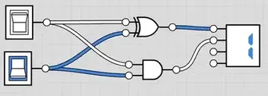
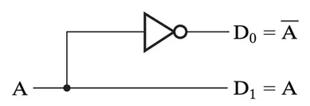
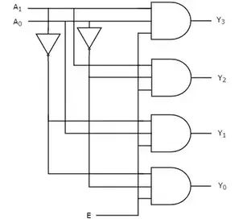

# What Every Programmer Should Know Computer 002


持续更新中...


上一篇我们介绍了早期计算机和现代计算机构成位的不同硬件，计算机最底层的抽象“从硬件层抽象出二进制值”，以及二进制值的简单计算(和对应的门电路)。这一篇文章，将介绍一些更复杂的门电路(Gate Combinations )。

> 复杂门电路的重要设计思想：Design small circuits to be used in a bigger circuit。

<!--more-->

## 加法器

上一篇我们介绍了二进制数的加法，将两个比特相加时，实际上**当前位的计算结果是两个比特的XOR值，进位值是2个比特的AND值**。

### 半加器

|A|B|A+B|XOR|AND|
|:---|:---|:---|:---|:---|
|0|0|00|0|0|
|0|1|01|1|0|
|1|0|01|1|0|
|1|1|10|0|1|

根据上述表格，我们基于门电路实现ALU的两个bit相加的逻辑。

上图所示电路被称为半加器，有两个输入(A和B)，和两个输出(半加和数，进位数); 所谓半加就是不考虑进位的加法.半加器虽能产生进位值，但半加器本身并不能处理进位值(上图右边接了一个数值显示器，这个显示器是支持进位的)，抽象表示如下图。

### 全加器

如果要计算超过1位的加法，由于涉及进位，因此有3个输入(C是进位)，真值表如下:

|A|B|C|Carry(进位)|Sum(和)|
|:---|:---|:---|:---|:---|
|0|0|0|0|0|
|0|0|1|0|1|
|0|1|0|0|1|
|1|0|0|0|1|
|0|1|1|1|0|
|1|0|1|1|0|
|1|1|0|1|0|
|1|1|1|1|1|

电路组件示意图如下:

全加器逻辑上可以由2个半加器和or门组合而成。原理图如下

对于全加器来说，它有3个输入，A，B,C（下级进位）和2个输出，SUM(总和)和Carry(进位)

### 多位全加器

接下来我们可以通过半加器和全加器的组合来实现多位加法器，这里我们以4位加法器举例(如果不需要连接其他进位信号-这里指C0，则最低位的全加器可以用半加器替换)。

在上图中A0-A3(低位到高位)代表4位二进制数A，B0-B3(低位到高位)代表4位二进制数B。S0-S3(低位到高位)代表A+B的总和，C4代表A+B的进位，如果C4没有得到处理，那么C4也常被称为溢出，为了处理溢出，可以考虑增加位数。

上图所示的多位加法器，也被成为4位行波进位加法器。行波进位加法器得名于从一个位进位到下一个位的方式，两位之间进位的方式就像波浪一样。可以看到每个位都有两个门发生延迟，如果构建一个32位或64位的加法器，延迟会增加很多。于是有了超前进位加法器。

行波进位加法器的高位的运算必须等待低位的进位输出信号，超前进位加法器(Lookahead Carry Adder)的优化思路就是"能否提前计算出「进位输出信号」？".

#### 超前进位加法器

对于每一位全加器的输入: $c_{i-1}$, $a_i$ ,$b_i$ 和输出 $s_i$,$c_i$ 有以下公式.

$$
s_i = a_i \oplus b_i \oplus c_i
$$

$$
c_{i+1} = a_i b_i +  c_i \oplus ( a_i \oplus b_i )
$$

其中，
- $a \oplus b$ 表示 a异或b
- $ab$ 表示 a与b
- $a+b$ 表示 a或b

假设我们有如下定义:

$$
P_i = a_i \oplus b_i
$$

$$
G_i = a_i b_i
$$

注意，P和G实际上刚好是半加器。对于N比特超前进位加法器，进位与和公式将重新书写如下：

$$
s_i = P_i \oplus c_{i} , i= 0...N-1
$$

$$
c_{i+1} = G_i + P_i c_i  , i= 0...N-1
$$

以4比特LCA加法器为例，其进位链与和公式分别计算如下：

$$
c_1 = G_0 + P_0 c_0
$$

$$
c_2 = G_1 + P_1 c_1 = G_1 + P_1(G_0 + P_0c_0)= G_1+G_0P_1+P_1P_0c_0
$$

$$
c_3 = G_2 + P_2 c_2 = G_2 +G_1P_2+G_0P_2P_1+P_2P_1P_0c_0
$$

$$
c_4 = G_3 + P_3 c_3 = G_3 +G_2P_3+G_1P_3P_2+G_0P_3P_2P_1+P_3P_2P_1P_0c_0
$$

$$
s_0=P_0 \oplus c_0
$$

$$
s_1=P_1 \oplus c_1
$$

$$
s_2=P_2 \oplus c_2
$$

$$
s_3=P_3 \oplus c_3
$$

可以发现，$c_4$ 和 $s_0$~ $s_3$ 这些参数，全部已知。由此我们得到了提前计算进位输出的方法， 用这样的方法实现了加法器就被称为超前进位加法器。

如上图所示电路，可以直接从输入计算出S1-S3以及C4。

- 先从Ai和Bi生成Pi和Gi
- 利用LCA,生成对应的Ci
- 通过Ai,Bi和Ci生成Si

对于位宽更大的LCA如16，32，64bitLCA等可以并行生成所有的PG和进位C，但这会造成电路极大的扇入和扇出；另外可以根据4bitLCA级联而成，如16bitLCA可由4个bit级联而成(这也被成为递归超前进位加法器-RLCA)。

## Enabler(开关)

Enabler有两个输入:

- 开关(标识着开启和关闭，1bit)
- data(数据部分，可能是多个bit)

当开关开启时，输出是data;当开关关闭时，输出为0。

## Decoder(解码器)

解码器的作用是将编码后的二进制值解码为一组独立的位，是一种具有N路输入和 $2^N$ 路输出的复杂门电路。最小的解码器是1线-2线解码器:

下图是2线-4线Decoder的电路图。

可以发现电路实质上是输出了输入的所有最小项表达式。上面的每个输出都分别对应了一个最小项表达式。

> 最小项：n个变量的逻辑乘，即与形式，每个变量以原变量或者反变量的形式出现一次.

解码器还包括3线－8线解码器或4线－16线解码器等等。我们可以通过小的解码器去组合成大解码器。下图通过两个1线-2线解码器组成2线-4线解码器。

当然，我们也可以使用一个1线-2线解码器和一个2线-4线解码器以及一些门电路元件组成3-8线解码器。

一种通用的电路设计方案是: 在有使能信号输入的情况下，2个2线－4线解码器可以组成1个3线－8线解码器，同样，2个3线－8线解码器可以组成1个4线－16线解码器。

在这类电路设计中，2个2线－4线解码器的使能输入都来自于第3个输入端，这一输入在2个2线－4线解码器间起到了选择器的作用。这使得第3个输入端可以使2个解码器中的任何一个工作，其中第一个解码器产生输出D(0)至D(3)，第二个解码器产生输出D(4)至D(7)。因此，将第3个输入端作为2个解码器共享的输出就能组成1个3线－8线解码器，能产生8个输出。包含使能输入的解码器又称解码器－多路分配器。

## Encoder(解码器)

编码器是一种能将多个二进制输入压缩成更少数目输出的电路。encoder和decoder的输入输出刚好相反。简单编码器电路可以接受 $2^n$ 条中的一个有效输入，并在n条并行输出线上生成一个二进制码。

例如，下图是4线－2线编码器的真值表:

|I3|I2|I1|I0|O1|O0|
|:---|:---|:---|:---|:---|:---|
|0|0|0|1|0|0|
|0|0|1|0|0|1|
|0|1|0|0|1|0|
|1|0|0|0|1|1|

我们可以用两个或门实现4线－2线编码器：

$$
O1 = I3+I2
$$

$$
O0 = I3+I1 
$$

上面描述的编码器被称为简单编码器，它仍有不少局限性：

1. 普通编码器的输入端只能同时存在一个高电平信号，当我们不小心输入了多个高电平信号，就会得到错误的结果。
2. 如果想设计8线-3线编码器，当前的4线－2线编码器并不能派上用场，不符合门电路模块化和层次化的设计思想。

因此产生了一种新的编码器设计，解决了上述的局限性，这种编码也被称为优先编码器。4线－2线编码器的真值表如下：

|I3|I2|I1|I0|O1|O0|v|
|:---|:---|:---|:---|:---|:---|:---|
|0|0|0|0|x|x|0|
|0|0|0|1|0|0|1|
|0|0|1|x|0|1|1|
|0|1|x|x|1|0|1|
|1|x|x|x|1|1|1|

如果同时有两个或以上的输入作用于优先编码器，优先级最高的输入将会被优先输出。上表中最高优先级的输入在表左侧，而`x`代表无关项，即可是1也可是0，不论无关项的值是什么，都不影响输出，只有最高优先级的输入有变化时，输出才会改变。`v`输出指示输入是否有效，该输出用于构建更大的编码器。

## Multiplexer(多路复用器)

多路复用器，也称为数据选择器，用于从 $2^N$ 个输入信号中通过N个选择行选择一个信号用于输出。多路复用器的基本功能：将多个输入组合成一个数据流。例如下图是一个 2-1 多路复用器。

## 参考资料

- [1] [half adder - Wikipedia](https://zh.wikipedia.org/wiki/%E5%8A%A0%E6%B3%95%E5%99%A8)
- [2] [Design of 4 to 16 Decoder Using 3 to 8 Decoder](https://www.elprocus.com/designing-4-to-16-decoder-using-3-to-8-decoder/)

