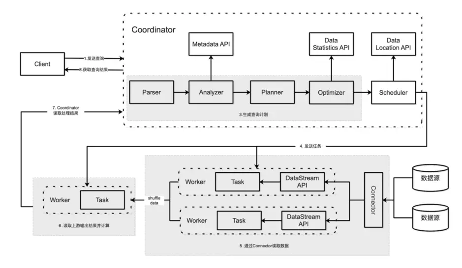
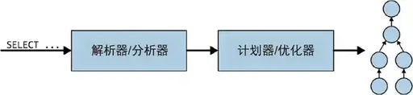
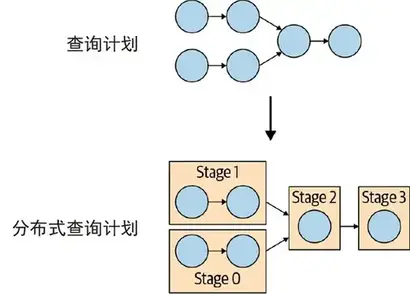
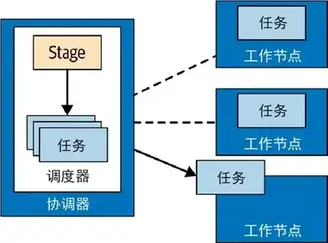
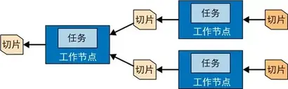
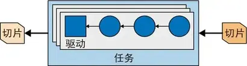

# Trino源码学习-架构Overview

Trino 是一种旨在使用分布式查询高效查询大量数据的工具。通常用在数据仓储、数据分析、海量数据聚合和报表生成等任务上，这些任务通常被归类为联机分析处理(online analytical processing，OLAP)。

<!--more-->

- 数据孤岛: 随着大数据的不断增多，和数据存储机制的日益多样: 关系数据库、NoSQL 数据库、文档数据库、键值存储和对象存储系统等。数据分散在各个孤岛上。
- 查询能力: 其中有些系统甚至不能提供满足分析所需的查询性能
- 横向扩展: 其他一些系统则将数据存储在单一庞大的系统上。因而不能像现代的云应用程序一样横向扩展。

通过支持不同系统上的联邦查询、并行查询和横向集群扩展等功能，Trino解决了上述问题。

- 联邦查询: Trino的设计初衷是用来查询 HDFS 上的数据,也可以从对象存储系统、关系数据库管理系统（RDBMS）、NoSQL 数据库和其他系统中查询数据(只要提供了对应系统的Connector)。
- 并行查询: Trino使用了很多技术来执行分布式查询，这些技术包括内存并行处理、跨集群节点管线执行、多线程执行模型（以充分利用所有 CPU 核心）、高效的扁平内存数据结构（以最小化 Java 的垃圾回收）和 Java 字节码生成等。借助上述技术，可以更快地获得查询结果。
- 横向集群扩展: Trino存算分离的，可以各自独立地扩展。Trino代表计算层，底层的数据源代表存储层。Trino 可以通过动态扩展计算集群的规模来扩展查询能力，并可以在数据源中数据所在的位置查询数据。借助这一特性，你可以极大地优化硬件资源需求并降低成本。

## 服务类型

Trino 集群中有两种类型的Trino服务进程：Coordinator和Worker。

### Coordinator

Trino 协调器是负责解析语句、规划查询和管理 Trino 工作节点的节点。它是整个Trino集群的管理节点-大脑，也是负责接收客户端连接的节点。每个Trino集群都必须有一个Trino 协调器和多个Trino Worker。出于开发或测试目的，可以将Trino的单个服务器实例同时配置为这两个角色。

协调器跟踪每个Worker的活动并协调查询的执行。协调器创建涉及一系列阶段的查询的逻辑模型，然后将其转换为在Trino Worker集群上运行的一系列互相连接的任务。

协调器使用REST API与Worker和客户端通信。Trino 使用节点发现服务来发现集群中的所有节点。

每个Trino 实例在启动时都会注册到发现服务并定期发送心跳信号。这样一来，协调器就能够维护一个可用工作节点的最新列表，并用它来调度查询执行。如果无法接收到一个工作节点的心跳信号，节点发现服务就会触发错误检测器，此后该工作节点不会再参与新的任务

### Worker

Trino Worker是集群中工作节点，负责执行任务和处理数据。Worker从连接器获取数据并相互交换中间数据。协调器负责从Worker获取结果并将最终结果返回给客户端。

当Trino Worker进程启动时，会定时将心跳发送到协调器中的发现服务，从而使 Trino 协调器可将存活的worker节点用于任务执行。

Worker 使用 REST API 与其他Worker和 Trino 协调员进行通信。

### 客户端

一旦接收到一条 SQL 语句，协调器就负责解析、分析、优化和调度查询任务在 Trino 工作节点上的执行。查询语句被翻译成一系列相连的任务（Task），这些任务被分发到各个工作节点上执行。

在工作节点处理数据的同时，协调器会将结果抽取出来放到输出缓冲区中，并将缓冲区的内容暴露给客户端。一旦客户端读完输出缓冲区的内容，协调器就会代表客户端向工作节点请求更多的数据。另外，工作节点也在不断地与数据源交互并从中读取数据。最终，客户端不断地请求数据，工作节点则不断地从数据源读取数据并提供给客户端，直到查询执行结束。

协调器、工作节点和客户端基于 HTTP 进行通信。

## 基于连接器的架构

Trino 存储与计算分离的核心是基于连接器的架构。连接器为Trino 提供了连接任意数据源的接口。每个连接器在底层数据源上提供了一个基于表的抽象。只要数据可以用 Trino 支持的数据类型表示成表、列和行，就可以创建连接器并让查询引擎使用这些数据进行查询处理。

### connector

连接器使 Trino 适应数据源，例如 Hive 或关系数据库。可以像考虑数据库驱动程序一样考虑连接器。它是Trino的SPI的实现，它允许Trino使用标准API与资源进行交互。

Trino 包含多个内置连接器：JMX 连接器、提供对内置系统表访问的系统连接器、Hive 连接器和旨在提供 TPC-H 基准数据的 TPCH 连接器。许多第三方开发人员都贡献了连接器，以便Trino可以访问各种数据源中的数据。

每个catalog都与特定的连接器相关联。如果检查catalog配置文件，则会看到每个配置文件都包含一个必需属性`connector.name` ，catalog管理器使用该属性为给定catalog创建连接器。可以让多个catalog使用相同的连接器来访问类似数据库的两个不同实例。例如，如果有两个 Hive 集群，则可以在单个Trino 集群中配置两个都使用 Hive 连接器的catalog，从而允许您从两个 Hive 集群查询数据，即使在同一个 SQL 中。

### catalog & schema & table

Trino中的Catalog类似Mysql中的一个数据库实例，而Schema就类似Mysql数据库实例中的一个DataBase。通过特定的连接器访问Catalog中指定的数据源，一个Catalog中可以包含多个Schema。Catalog在Trino的配置文件定义，例如`$TRINO_HOME/etc/catalog/hive.properties`,文件名就是catalog的名字，文件类型必须是`.properties`。

一个Catalog和一个Schema唯一确定了一个表的集合，Presto中的Schema通常和数据库的Database是一致的(例如，hive，mysql等)。

Trino中的table和传统数据库中表的含义是一致的，在Trino中访问表时，总是以全限定名的方式访问，即 `catalog.schema.table`。

## Trino 查询执行模型

Trino 执行 SQL 语句并将这些语句转换为查询，这些查询在协调器和工作线程的分布式集群中执行。

### statement

statement指我们输入的SQL语句, Trino 执行与 ANSI SQL 标准兼容的语句。在Trino中语句和查询是单独的概念，语句只是引用用SQL编写的语句的文本表示。执行语句时，Trino 会创建一个查询和一个查询计划，然后将该计划分布在一系列 Trino 工作线程中。

### query

当Trino解析语句时，它会将其转换为查询并创建分布式查询计划，然后将其实现为在Trino工作线程上运行的一系列互连阶段。当您在 Trino 中检索有关查询的信息时，您会收到生成响应语句的结果集所涉及的每个组件的快照。

语句和查询之间的区别很简单。可以将语句视为传递给 Trino 的 SQL 文本，而查询是指为执行该语句而实例化的配置和组件。查询包含阶段、任务、拆分、连接器以及其他协同工作以生成结果的组件和数据源。

### stage

当 Trino 执行查询时，它会通过将执行分解为阶段层次结构来实现。例如，如果 Trino 需要聚合存储在 Hive 中的 10 亿行的数据，它通过创建一个根阶段来聚合其他几个阶段的输出来实现，所有这些阶段都旨在实现分布式查询计划的不同部分。

包含查询的阶段层次结构类似于树。每个查询都有一个根阶段，负责聚合其他阶段的输出。阶段是协调器用来对分布式查询计划进行建模的阶段，但阶段本身不会在 Trino 工作线程上运行。

### task

阶段对分布式查询计划的特定部分进行建模，但阶段本身不会在 Trino 工作线程上执行。要了解阶段是如何执行的，您需要了解阶段是作为分布在Trino工作线程网络上的一系列任务实现的。

任务是Trino查询架构中的主力，因为分布式查询计划被解构为一系列阶段，然后将其转换为任务，然后执行操作或处理拆分。Trino任务具有输入和输出，就像阶段可以由一系列任务并行执行一样，任务由一系列驱动程序并行执行。

### split

任务在分片上运行，分片是数据集的部分。分布式查询计划最低级别的阶段通过分片从连接器获取数据，分布式查询计划较高级别的中间阶段从其他阶段获取数据。

当 Trino 计划查询时，协调器会向连接器查询可用于表的所有分片的列表。协调器跟踪哪些机器正在运行哪些任务，以及哪些任务正在处理哪些分片。

对于Hive中的表，一个Split就是HDFS文件的一个分片。根据文件格式是否分片（如ORC,Parquet），该Split可能是一个Block的大小，也可能是整个文件。

### Page

Presto 中处理的最小数据单元。一个 Page 对象包括多个 Block 对象，而每个 Block 对象是一个字节数组，存储一个字段的若干行。多个 Block 的横切的一行表示真实的一行数据。一个 Page 最大 1MB，最多 16 * 1024 行数据。

### driver

任务包含一个或多个并行驱动程序。驱动程序对数据进行操作，并组合运算符以生成输出，然后由任务聚合，接着在另一个阶段交付到另一个任务。驱动程序是算子实例的序列，或者可以将驱动程序视为内存中的一组物理算子。它是Trino 架构中最低级别的并行。驱动程序有一个输入和一个输出。

### operator

算子消费、转换和生成数据。在连接器的帮助下，源任务使用数据源 SPI 从底层数据源获取数据。这些数据以page 的形式在 Trino 的查询引擎之中传递。算子根据它们的语义处理接收到的page 并产生新 page。例如，表扫描算子从连接器提取数据并生成可供其他算子使用的数据，筛选器算子消费数据并通过对输入数据应用谓词来生成子集。

包含在一个任务里的一串算子(并行度相同的)叫作流水线(pipeline)。由于不同的operator并行度不同，所以一个stage里面可能会有多个pipeline, pipeline之间通过LocalExchange交互数据。

stage中的最后一个算子通常会将它输出的 page 放置在任务的输出缓冲区中。下游任务的 Exchange 算子会从上游任务的输出缓冲区中消费 page。

### exchange

exchange在Trino 节点之间传输查询不同阶段的数据。任务将数据生成到输出缓冲区中，并使用exchange客户端消费来自其他任务的数据。

源 Stage 的任务以 page 的形式生产数据，每个 page 都是以列式存储格式表示的一系列行。这些 page 传输到下游的中间 Stage。Exchange 算子从上游 Stage 中读取数据，从而在不同 Stage 之间传输 page。

> 这里的 page与一般操作系统语义下的 page不同

