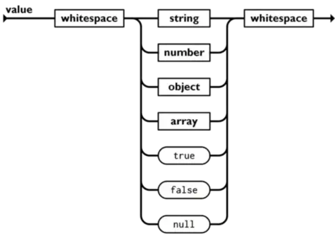
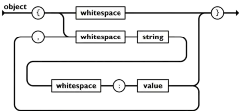
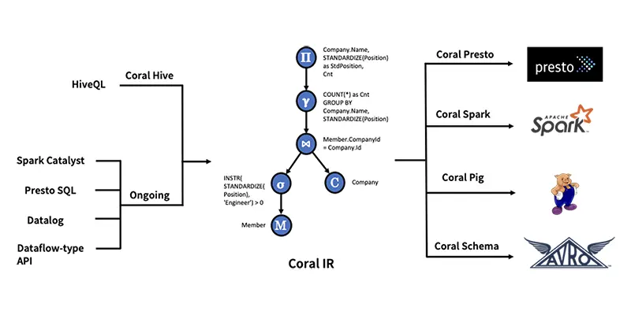
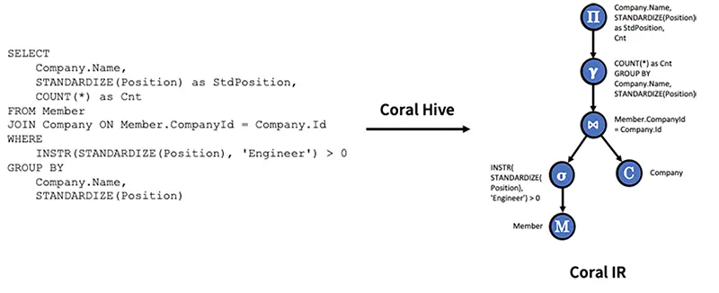

# Parser解析重写SQL

最近在做SQL方面的工作，主要是SQL语法解析和改写。因此打算记录下解析的技术&工具。

文本解析一般首推使用正则表达式。对于大多数的文本，正则都可以很好的解析。以ELK套件中的Logstash为例，其内置的Grok插件支持了120+种常用Pattern，可以很好的用于解析多种形式的文本。但是。正则不是文本解析的万能钥匙，由于正则表达式的自身实现约束，大多数正则表达式引擎不能较好的处理嵌套结构的数据。此外，对于脚本语言或编程语言，正则表达式也是无能为力。

举个例子，如果想替换SQL中的某个字段名，如果只是简单的使用正则替换，那么很可能会错误修改其他位置的文本。例如想修改下面SQL中的order_cnt别名时，就很有可能错误修改其他位置的order_cnt，要避免这类问题需要对正则添加很多断言和约束，由于实际场景中可能会对SQL的列名，表名，条件等各个位置进行改写，场景十分复杂。所以正则这种方式不能从根本上解决问题。由此，引出了接下来要介绍的技术--语法解析器(Parser)。

```sql
select 
  dt,
  sum(order_cnt) as order_cnt
  from(
   select order_cnt
   from order_info
   where dt between xxx and xxx
  )group by dt
```

<!--more-->

## SQL解析 

### 先来看Parser是什么？

> 语法分析（英语：syntactic analysis，也叫 parsing）是根据某种给定的形式文法对由单词序列（如英语单词序列）构成的输入文本进行分析并确定其语法结构的一种过程。-- from wikipedia

好吧，wikipedia说的很抽象。我们来举个最常见的例子，Parser将我们写的代码解析成了符合语法规范的编译器可识别的语法结构。这也是我们最常见的 parser; 也有简单一些的 parser，用于处理 CSV，JSON，XML 之类的格式。

一般来说，一个parser（也称编译器前端）会由两部分组成：

- 词法分析器（lexer/scanner/tokenizer）
- 语法解析器（parser）

在解释代码的时候，先由词法解释器将代码段转化成一个一个的词组流（token），再交由解释器对词组流进行语法解释，转化为对应语法的抽象解释，即是AST了。我们举个例子来进行说明上述的过程：

```
437 + 734
```
在parser解析如上的计算表达式时，词法分析器首先依次扫描到“4”、“3”、“7”直到一个空白符，这时，词法分析器便将之前扫描到的数字组成一个类型为“NUM”的词符（token）；接下来，词法分析器继续向下扫描，扫描到了一个“+”，对应输出一个类型为“PLUS”的词符（token）；最后，扫描“7”、“3”、“4”输出另一个类型为“NUM”的词组（token）。 
语法解释器在拿到词法分析器输出的词符流后，根据词组流的“NUM”，“PLUS”，“NUM”的排列顺序，解析成为加法表达式语法树。


  
在拿到AST抽象语法树后。我们就可以对其做更多处理，例如，分析元信息，优化执行逻辑或执行表达式等处理。
 
### Parser的使用

上面是一个关于编译器前端的简单介绍，更多的描述可以参考《编译原理》。接下来就是介绍下如何来使用Parser。最常见的Parser应用场景有JSON解析，SQL解析等。这里我们以JSON解析为例，介绍下Parser的使用方式。

在介绍之前，我们先用Parser的视角来分析下JSON协议。

* 首先一个json值可以分为两种类型：基础值和结构。细分下基础值可以分为字符串，数字，布尔值和空值；而结构可以分为对象和数组。json和json之间可以有任意的空白字符。



* object对象以 `{`开始，`}`结束，对象内是一组未排序的键值对的集合，键值对之间以逗号隔开，键是字符串，而值可以是任意的json值。键和值之间，键值对之间可以有任意的空白字符。



* array是一组排序json值的集合，数组以`[`开头，以`]`结尾，数组内是以逗号隔开的值。


上面就是JSON中的全部语法结构，下面我们再看json的词法定义：

1. String 是 包在双引号之间的的0个或多个 unicode 字符。
2. number 是支持正负号和科学计数法的数字
3. boolean 是 true 或false
4. null 就是null 
5. 空白字符指 `\t`, `\n` ,`\r`。

基于上面的分析，就可以提炼出json的词法规则和语法规则：

```bnf
json = element
value = object | array | string | number | "true" |"false" | "null"

object = '{' ws '}' | '{' members '}'
members =  member ',' members | member
member =  ws string ws ':' element

array = '[' ws ']' | '[' elements ']'
elements = element | element ',' elements
element = ws value ws

string = '"' characters '"'
characters = "" | character characters
character =  '0020' . '10FFFF' - '"' - '\' | '\' escape
escape = '"'| '\'|'/'|'b'|'f'|'n'|'r'|'t'| 'u' hex hex hex hex
hex = digit | 'A' . 'F' | 'a' . 'f'

number= integer fraction exponent
integer= digit| onenine digits| '-' digit| '-' onenine digits
digits= digit| digit digits
digit= '0'| onenine
onenine='1' . '9'
fraction= ""| '.' digits
exponent=""|'E' sign digits|'e' sign digits
sign=""|'+'|'-'

ws= ""|'0020' ws|'000A' ws|'000D' ws|'0009' ws
```

### ParserGenerator

ParserGenerator 顾名思义，就是生成Parser的工具，例如生成将文本解析成json的代码。ParserGenerator可以根据我们自己书写的词法规则和语法规则，生成规则对应的代码。

#### AntlrV4的使用例子

下面是Antlrv4的JSON语法规则。

```antlr
grammar JSON;

json
   : value EOF
   ;

obj
   : '{' pair (',' pair)* '}'
   | '{' '}'
   ;

pair
   : STRING ':' value
   ;

arr
   : '[' value (',' value)* ']'
   | '[' ']'
   ;

value
   : STRING
   | NUMBER
   | obj
   | arr
   | 'true'
   | 'false'
   | 'null'
   ;

STRING
   : '"' (ESC | SAFECODEPOINT)* '"'
   ;

fragment ESC
   : '\\' (["\\/bfnrt] | UNICODE)
   ;
fragment UNICODE
   : 'u' HEX HEX HEX HEX
   ;
fragment HEX
   : [0-9a-fA-F]
   ;
fragment SAFECODEPOINT
   : ~ ["\\\u0000-\u001F]
   ;


NUMBER
   : '-'? INT ('.' [0-9] +)? EXP?
   ;


fragment INT
   : '0' | [1-9] [0-9]*
   ;

// no leading zeros

fragment EXP
   : [Ee] [+\-]? INT
   ;

// \- since - means "range" inside [...]

WS
   : [ \t\n\r] + -> skip
   ;
```
当完成上面的规则文件编写后，就可以使用antlrv4生成代码。

```java
JSONLexer lexer = new JSONLexer(CharStreams.fromString(json));
JSONParser parser = new JSONParser(new CommonTokenStream(lexer));
JSONParser.JsonContext context = parser.json();
```
 使用上述代码可以将如下的JSON解析成ASTTree.

```json
{
    "id": 123,
    "list":[
        "hangzhou",
        "shanghai"
    ],
    "name": "cityName"
}
```


 
 
常见的ParserGenerator有 LEX & YACC(两者常搭配使用)， JavaCC 和 AntlrV4等。

|比较项\方案|LEX & YACC|JavaCC|AntlrV4|
|:---|:---|:---|:---|
|支持的平台|C，C++(不支持Java平台，排除)|C，Java|C，C++，Java，Python，JavaScript...|
|社区|老牌开源|社区维护不是很积极，文档较少|社区较活跃，且有很多文档|
|解析算法|支持LL和LR|递归下降 LL(1)/LL(k)解析器，需要手动指定LookAhead的值|采用自适应 LL(*)解析算法|
|规则书写||需要手写递归下降|规则自动支持递归下降，而不需要手动书写递归下降，这会降低书写规则的数量和大小|
|支持的功能||只有Parse生成，需要其他工具如JJTree辅助|有丰富的工具，可以图形化显示语法树，可以测试Rule的覆盖度....|
|OLAP支持|无，需要查找开源实现|支持Mysql。CK，SR需要查找开源实现|CK，SR等OLAP基本上都提供了AntlrV4的官方语法规则文件|
 

因此我们最终将AntlrV4作为我们SQL解析重写的ParserGenerator工具选型。 

### 手工编写

除了使用ParserGenerator，还有一种场景的方案是手工编写，手工编写相对于ParserGenerator来说，弊端是工作量会比较大，需要较多的测试保证正确性，但是也有其优势，例如易于调试，方便定位问题，性能更加优秀等。

针对手工编写Parser的工作量和正确性困扰，一般来说就是使用一些开源parser的基础代码，例如alibaba-druid的SQLParser就常被使用于解析SQL。但是这并没有带来很大的帮助，可以复用的代码大多是针对字符流的操作。

#### ParseCombinator

在函数式编程的思潮不断普及下，lisp和haskell中开始出现了ParseCombinator这种思路，ParseCombinator简单来说是利用函数式编程的思想，将parser设计为monad，并基于monad实现了大量的开箱即用的高阶函数，极大的简化了手工编写Parser的工作量。下面就是使用Scala ParseCombinator解析json的一个例子。

```scala
import scala.util.parsing.combinator._

sealed trait Json

case object JsonNull extends Json
final case class JsonBoolean(b: Boolean) extends Json
final case class JsonString(s: String) extends Json
final case class JsonNumber(x: BigDecimal) extends Json
final case class JsonArray(elems: List[Json]) extends Json
final case class JsonObject(entries: List[(String, Json)]) extends Json

object Json extends JavaTokenParsers {

  def value: Parser[Json] = (
    obj
  | arr
  | stringLiteral ^^ JsonString
  | floatingPointNumber ^^ (s => JsonNumber(BigDecimal(s)))
  | "null" ^^ (_ => JsonNull)
  | "true" ^^ (_ => JsonBoolean(true))
  | "false" ^^ (_ => JsonBoolean(false))
  )

  def obj: Parser[JsonObject] = "{"~> repsep(member, ",") <~"}" ^^ JsonObject

  def arr: Parser[JsonArray] = "["~> repsep(value, ",") <~"]" ^^ JsonArray

  def member: Parser[(String, Json)] = stringLiteral~":"~value ^^ {
    case k~":"~v => k -> v
  }

  def parseAll(in: CharSequence): ParseResult[Json] = parseAll(value, in)
}
```

可以发现使用ParseCombinator的工作量几乎和generator差不多。
 
|比较项\方案|AntlrV4|ParseCombinator|
|:---|:---|:---|
|社区|社区较活跃，且有很多文档，在多个开源项目中使用|有很多开源实现， spark曾使用过scala的parse-combinator。|
|parser可维护性|大部分OLAP引擎的社区提供了规则文件，易于升级维护|需要自己维护项目，不太易于升级维护|
|问题修复|生成的代码，不易于定位问题|易于维护和调试|
|支持的功能|常用的Parser功能都支持|自由支持新的高阶函数|
|性能|性能一般，不易优化|性能较好，可以通过不断优化，来维持较好的性能|

通过上面的比较，AntlrV4可以很好地支持我们对SQL改写和解析的需求，且在大多数OLAP引擎提供官方规则文件的前提下，规则的正确性得到较好的保障。对于解析SQL性能一般的问题:

- 对于SQL重写优化，设置了优化前提Pattern，仅在Pattern满足的时候才进行优化。
- 对于单纯的SQL优化有降级功能，
   - 将太长耗时的SQL优化规则，降级为不优化。
   - 对于重复多次执行的SQL优化规则，达到阈值后中断优化。

## SQL重写

上面介绍了解析SQL的一些方案，下面介绍下SQL重写，SQL重写目的是将传入的SQL，适配查询时的指定的引擎（SQL翻译），然后优化SQL。我们将其拆分成几个阶段。

- SQL -> AST: 将SQL 文本解析为AST，例如Antlr生成的ASTNode。
- AST -> AST IR (AST 中间表示形式): 上面从SQL 直接生成的AST是从Antlr Parser产生的语法树。将从Antlr Parser产生的语法树按照语法节点的逻辑进行规整(例如，对于函数参数节点，将二叉树转换为数组)，得到中间表示形式AST。
- AST IR -> Dialect AST: SQL 重写将对AST IR 进行方言适配操作
- Dialect AST -> Optimized Dialect AST: SQL 重写将对 Dialect AST 执行SQL优化操作
- Optimized Dialect AST ->  Dialect SQL: 遍历语法树打印出SQL文本。

### Coral : SQL  Translator



Coral的SQL翻译主要在下面3个方面展开:

- 视图虚拟化: 访问视图定义并将其转换为内部表示的过程，称为 Coral IR（中间表示）。此步骤还涉及推断某些引擎可以利用的视图级元数据，例如字段可空性、大小写保留和非 SQL 标准数据类型。
- 视图转换和重写: 将 Coral IR 重写为适合目标引擎（例如 Presto、Spark、Pig）的表示形式的过程，以便引擎可以使用其自己的方言和UDF查询.
- 将 Coral 集成到目标引擎: 必要的 API 和与各种引擎的集成点，以使 Coral 适合整体计算引擎架构及其各种读取 API。

Coral支持了Hive，Spark，Trino，Pig等。

#### 视图虚拟化

- 访问数据库、表和视图信息：Hive 元存储组织数据库中的表和视图。每个表或视图都有一个架构，用于描述该表或视图的列名和类型。Coral Hive 模块的职责之一是访问表或视图信息，例如数据库名称、数据库中的表或视图名称、表或视图架构、HiveQL 视图定义，以及它们的 UDF 属性，例如“函数”和“依赖项”。此信息对于启用视图解析、验证和转换为中间表示形式是必需的。
- 解析、验证和转换为 HiveQL 视图定义的中间表示形式： 同一模块包含一个解析器（基于 HiveQL 解析器）、一个验证器和一个中间表示的转换器。解析器将 HiveQL 转换为抽象语法树 （AST），验证器验证 AST 并确保其语义正确性。中间表示转换器将 AST 转换为 Coral IR，后者基于 Apache Calcite 的关系代数表达式。关系代数表达式是对数据库中的关系进行操作的表达式。它由标准运算符组成，例如扫描、过滤器、投影、连接、联合、聚合等。




#### 查询翻译和重写

Coral将视图定义重写为许多符合引擎的语言和SQL方言。此外，在重写期间，它将函数映射到目标引擎中的等效函数，因此它们在语义上是等效的。

SQL 中有两种类型的函数：内置函数和用户定义函数。Coral利用两种类型的翻译方法来实现这些类型：

- 内置函数转换：这种类型的转换重写了内置函数，其语义在 SQL（或类SQL）方言之间不直接匹配。例如，HiveQL 中的 INSTR 功能由 Presto 中的函数 STRPOS 执行。因此，Coral定义了一个通用的内置重写转换框架，其中HiveQL中的一个函数`f(a1，a2,..an)`被重写为另一种方言中的另一个函数`g(h1(a1,..an),h2(a1,..an),..hn(a1,..an))。这样的转换框架允许输入值调整、函数重命名和输出值调整等转换。Coral还实现了一个更通用的框架，将自定义行表达式运算符从一个实现直接映射到另一个实现。
- 用户自定义函数转换： 不同的引擎公开不同的 API 来定义用户定义的函数。例如，在 Hive 中，用户定义的函数扩展了 GenericUDF API。在Presto中，标量用户定义函数扩展了SqlScalarFunction API。同样，可以通过扩展表达式接口来定义 Spark 用户定义函数。鉴于 UDF API 的这种差异，为一个引擎编写的函数通常不能在另一个引擎上执行。从 Coral 的角度来看，使 UDF 可移植意味着将视图的“依赖项”属性转换为指向专门为目标引擎实现 UDF 的正确工件。Coral利用Transport，一个在统一API中编写用户定义函数的框架。虽然Transport用户只编写一次 UDF，但Transport会生成许多工件，每个工件都是为引擎定制的，就好像 UDF 最初是在该引擎的 API 中编写的一样。

下面以Presto为例，展示了从Coral IR 到 Presto SQL 的 Coral Presto 转换过程。


## 参考

- [1] [coral](https://github.com/linkedin/coral)
- [2] [transport](https://github.com/linkedin/transport)
- [3] [Coral: A SQL translation, analysis, and rewrite engine for modern data lakehouses](https://engineering.linkedin.com/blog/2020/coral)
- [4] [Transport: Towards Logical Independence Using Translatable Portable UDFs](https://engineering.linkedin.com/blog/2018/11/using-translatable-portable-UDFs)
- [5] [Direct Style Monadic Parser Comninators For The Real World](https://www.microsoft.com/en-us/research/wp-content/uploads/2016/02/parsec-paper-letter.pdf)
- [6] [Monadic Paraer Combinators](https://people.cs.nott.ac.uk/pszgmh/monparsing.pdf)
- [7] [Parsec, a fast combinator parser](https://users.cecs.anu.edu.au/~Clem.Baker-Finch/parsec.pdf)
- [8] [PARSER COMBINATORS](https://www.scala-exercises.org/fp_in_scala/parser_combinators)
- [9] [Building a lexer and parser with Scala's Parser Combinators](https://enear.github.io/2016/03/31/parser-combinators/)

