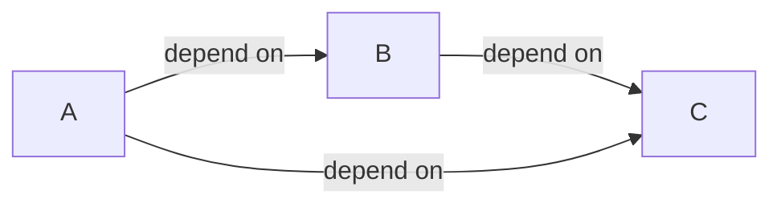
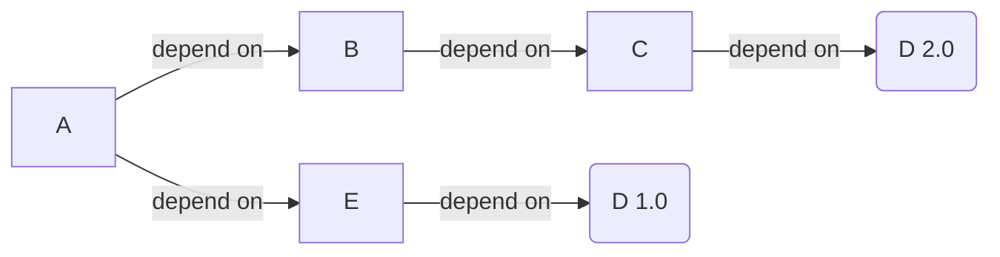
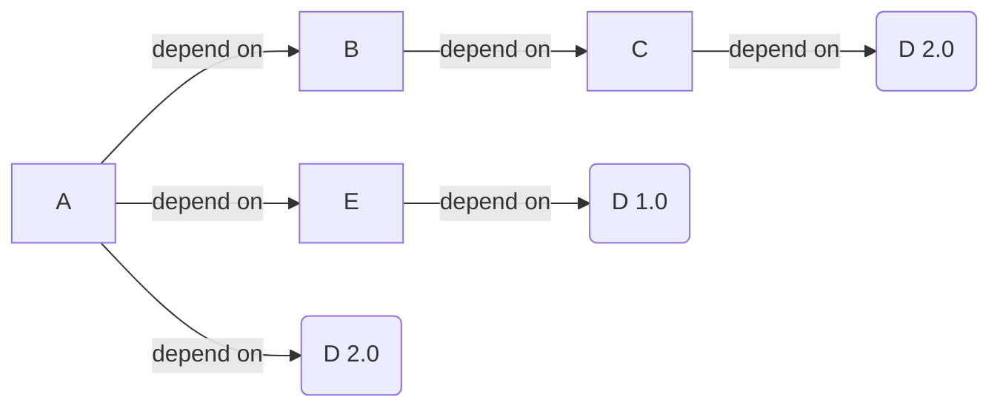
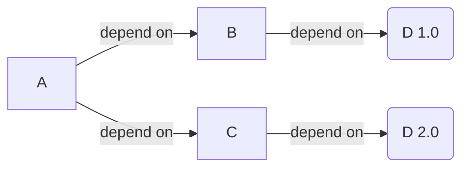

# Maven依赖机制

Maven依赖传递是Maven的核心机制之一，它能够一定程度上简化Maven的依赖配置。

<!--more-->



如上图所示，模块A依赖模块B，模块B依赖模块C。此时B是A的直接依赖，C是A的间接依赖。

Maven的依赖传递机制是指，不管Maven项目存在多少间接依赖，POM中都只需要定义其直接依赖，而不需要定义任何间接依赖。Maven 会动读取当前项目各个直接依赖的 POM，将那些必要的间接依赖以传递性依赖的形式引入到当前项目中。Maven 的依赖传递机制能够帮助用户一定程度上简化POM的配置。

基于 A、B、C  三者的依赖关系，根据 Maven 的依赖传递机制，我们只需要在模块 A 的 POM 中定义其直接依赖 B，在模块 B 的 POM 中定义其直接依赖 C，Maven会解析A的直接依赖 B 的POM，将间接依赖 C 以传递性依赖的形式引入到模块 A 中。通过这种依赖传递关系，可以使依赖关系树迅速增长到一个很大的量级，很有可能会出现依赖重复，依赖冲突等情况，Maven 针对这些情况提供了如下功能进行处理:

- 依赖关系传递
  - 可选依赖
  - 排除依赖
- 依赖关系范围
- 依赖关系管理

## 依赖关系传递

Maven 的依赖传递机制可以简化依赖的声明，用户只需要关心项目的直接依赖，而不必关心这些直接依赖会引入哪些间接依赖。但当一个间接依赖存在多条引入路径时，为了避免出现依赖重复的问题，Maven 通过"最近的定义"来确定间接依赖的引入路径。

"最近的定义"遵循以下两条原则：

- 引入路径短者优先
- 先声明者优先

以上两条原则，优先使用第一条原则解决，第一条原则无法解决，再使用第二条原则解决。

### 引入路径短者优先



在上面的例子中，A、B 和 C 的依赖项定义为 A -> B -> C -> D 2.0 和 A -> E -> D 1.0，然后在构建 A 时使用 D 1.0，因为从 A 到 D 到 E 的路径更短。可以在 A 中显式添加对 D 2.0 的依赖项，以强制使用 D 2.0。



### 先声明者优先

```xml
<dependencies>
    <dependency>
        ...
        <artifactId>B</artifactId>       
        ...
    </dependency>
    <dependency>
        ...
        <artifactId>C</artifactId>
        ...
    </dependency>
</dependencies>
```

```
Your project A dependencies
  +-B
    +-D-1.0 
  +-C
    +-D-2.0
```



注意此时，D 2.0 和 D 1.0 的深度是相同的，由于在POM中B是比C优先定义的，所以在构建 A 时使用 D 1.0。

> *最接近的定义*可能会导致项目使用具有意外版本和运行时错误的情况。
例如，A 需要 D-2.0。但是*最接近的定义*将 D解析为 D-1.0，而 A 无法调用自 D-2.0 以来添加的功能.

### 排除依赖

A 依赖于 B，B 依赖于 C，在不考虑依赖范围等因素的情况下，Maven 会根据依赖传递机制，将间接依赖 C 引入到 A 中。但如果 A 出于某种原因，希望将间接依赖 C 排除。我们可以使用排除依赖来解决这个问题。

排除依赖是通过在 A 中使用 exclusions 元素实现的，该元素下可以包含若干个 exclusion 子元素，用于排除若干个间接依赖，示例如下:

```xml
<!--spring boot 不使用tomcat作为容器-->
<dependencies>
     <dependency>
        <groupId>org.springframework.boot</groupId>
        <artifactId>spring-boot-starter-web</artifactId>
        <exclusions>
            <exclusion>
                <groupId>org.springframework.boot</groupId>
                <artifactId>spring-boot-starter-tomcat</artifactId>
            </exclusion>
        </exclusions>
    </dependency>
</dependencies>
```

关于 exclusions 元素及排除依赖说明如下：

- 排除依赖是控制当前项目是否使用其直接依赖传递下来的间接依赖；
- exclusions 元素下可以包含若干个 exclusion 子元素，用于排除若干个间接依赖；
- exclusion 元素用来设置具体排除的间接依赖，该元素包含两个子元素：groupId 和 artifactId，用来确定需要排除的间接依赖的坐标信息；
- exclusion 元素中只需要设置 groupId 和 artifactId 就可以确定需要排除的依赖，无需指定版本 version。
### 可选依赖

与上文的应用场景相同，也是 A 希望排除间接依赖 C，除了在 B 中设置排除依赖外，我们还可以在 B 中将 C 设置为可选依赖。

在 **B的POM文件中** 关于 X 的依赖声明中使用 optional 元素，将其设置成可选依赖，示例配置如下。

```xml
<dependencies>
    <dependency>
        <groupId>org.springframework.boot</groupId>          
        <artifactId>spring-boot-devtools</artifactId>
        <optional>true</optional>
    </dependency>
</dependencies>
```

关于 optional 元素及可选依赖说明如下：

- 可选依赖用来控制当前依赖是否向下传递成为间接依赖；
- optional 默认值为 false，表示可以向下传递称为间接依赖；
- 若 optional 元素取值为 true，则表示当前依赖不能向下传递成为间接依赖。

排除依赖和可选依赖都能在项目中将间接依赖排除在外，但两者实现机制却完全不一样。

- 排除依赖是控制当前项目是否使用其直接依赖传递下来的接间依赖；
- 可选依赖是控制当前项目的依赖是否向下传递；
- 可选依赖的优先级高于排除依赖；
  - 若对于同一个间接依赖同时使用排除依赖和可选依赖进行设置，那么可选依赖的取值必须为 false，否则排除依赖无法生效。

## 依赖关系范围

Maven 在对项目进行编译、测试和运行时，会分别使用三套不同的 classpath。Maven 项目构建时，在不同阶段引入到 classpath 中的依赖时不同的。例如编译时，Maven 会将与编译相关的依赖引入到编译 classpath 中;测试时，Maven 会将与测试相关的的依赖引入到测试 classpath 中;运行时，Maven 会将与运行相关的依赖引入到运行 classpath 中。我们可以在 POM 的依赖声明使用 scope 元素来控制依赖与三种 classpath(编译 classpath、测试 classpath、运行 classpath)之间的关系，这就是依赖范围。

|依赖范围|描述|
|:---|:---|
|compile|编译依赖范围，scope 元素的缺省值。使用此依赖范围的 Maven 依赖，对于三种 classpath 均有效，即该 Maven 依赖在上述三种 classpath 均会被引入。例如，log4j 在编译、测试、运行过程都是必须的。|
|test|测试依赖范围。使用此依赖范围的 Maven 依赖，只对测试 classpath 有效。例如，Junit 依赖只有在测试阶段才需要。|
|provided|已提供依赖范围。使用此依赖范围的 Maven 依赖，只对编译 classpath 和测试 classpath 有效。例如，servlet-api 依赖对于编译、测试阶段而言是需要的，但是运行阶段，由于外部容器已经提供，故不需要 Maven 重复引入该依赖。|
|runtime|运行时依赖范围。使用此依赖范围的Maven依赖，只对测试classpath、运行 classpath有效。例如，JDBC 驱动实现依赖，其在编译时只需 JDK 提供的 JDBC 接口即可，只有测试、运行阶段才需要实现了 JDBC 接口的驱动。|
|system|系统依赖范围，其效果与 provided 的依赖范围一致。其用于添加非 Maven 仓库的本地依赖，通过依赖元素 dependency 中的 systemPath 元素指定本地依赖的路径。鉴于使用其会导致项目的可移植性降低，一般不推荐使用。|
|import|导入依赖范围，该依赖范围只能与 dependencyManagement 元素配合使用，其功能是将目标 pom.xml 文件中 dependencyManagement的配置导入合并到当前pom.xml的 dependencyManagement 中。|

依赖范围与三种 classpath 的关系一览表，如下所示。

|依赖范围|编译classpath|测试 classpath|运行 classpath|例子|
|:---|:---|:---|:---|:---|
|compile|included|included|included|log4j|
|test|-|included|-|junit|
|provided|included|included|-|servlet-api|
|runtime|-|-|included|JDBC-driver|
|system|included|included|-|非 Maven仓库的本地依赖|

> `-` 表示不被包含

### 依赖范围对传递依赖的影响

模块 A 依赖于模块 B，B 又依赖于模块 C, 此时我们可以将 A 对于 B 的依赖称之为第一直接依赖，B 对于 C 的依赖称之为第二直接依赖。B 是 A 的直接依赖，C 是 A 的间接依赖，根据 Maven 的依赖传递机制，间接依赖 C 会以传递性依赖的形式引入到 A 中，但这种引入并不是无条件的，它会受到依赖范围的影响。

传递性依赖的依赖范围受第一直接依赖和第二直接依赖的范围影响，如下表所示。

|第一直接依赖\第二直接依赖|compile|test|provided|runtime|
|:---|:---|:---|:---|:---|
|compile|compile|-|-|runtime|
|test|test|-|-|test|
|provided|provided|-|provided|provided|
|runtime|runtime|-|-|runtime|

> 交叉部分的单元格的取值为传递性依赖的依赖范围，若交叉单元格取值为`-`，则表示该传递性依赖不能被传递。

- 当第二直接依赖的范围是 compile 时，传递性依赖的范围与第一直接依赖的范围一致;
- 当第二直接依赖的范围是 test 时，传递性依赖不会被传递;
- 当第二直接依赖的范围是 provided 时，只传递第一直接依赖的范围也为 provided 的依赖，且传递性依赖的范围也为 provided;
- 当第二直接依赖的范围是 runtime 时，传递性依赖的范围与第一直接依赖的范围一致，但 compile 例外，此时传递性依赖的范围为 runtime;

## 依赖关系管理

依赖关系管理部分是一种用于集中管理依赖关系信息的机制。

### 父模块

当多个模块都有公共的父模块时，可以通过使用父模块中的依赖管理来统一管理依赖版本。例如:

```xml
 <!-- module A -->
<project>
  <modelVersion>4.0.0</modelVersion>
  <groupId>maven</groupId>
  <artifactId>A</artifactId>
  <version>1.0</version>
  <dependencies>
    <dependency>
      <groupId>group-a</groupId>
      <artifactId>artifact-a</artifactId>
      <version>1.0</version>
      <exclusions>
        <exclusion>
          <groupId>group-c</groupId>
          <artifactId>excluded-artifact</artifactId>
        </exclusion>
      </exclusions>
    </dependency>
    <dependency>
      <groupId>group-a</groupId>
      <artifactId>artifact-b</artifactId>
      <version>1.0</version>
      <type>bar</type>
      <scope>runtime</scope>
    </dependency>
  </dependencies>
</project>
 <!-- module B -->
<project>
  <modelVersion>4.0.0</modelVersion>
  <groupId>maven</groupId>
  <artifactId>B</artifactId>
  <version>1.0</version>
  <dependencies>
    <dependency>
      <groupId>group-c</groupId>
      <artifactId>artifact-b</artifactId>
      <version>1.0</version>
      <type>war</type>
      <scope>runtime</scope>
    </dependency>
    <dependency>
      <groupId>group-a</groupId>
      <artifactId>artifact-b</artifactId>
      <version>1.0</version>
      <type>bar</type>
      <scope>runtime</scope>
    </dependency>
  </dependencies>
</project>
```

对于上面的模块A，模块B，可以将依赖信息放入它们的父模块pom中:

```xml
<project>
  <modelVersion>4.0.0</modelVersion>
  <groupId>maven</groupId>
  <artifactId>P</artifactId>
  <version>1.0</version>
  <dependencyManagement>
    <dependencies>
      <dependency>
        <groupId>group-a</groupId>
        <artifactId>artifact-a</artifactId>
        <version>1.0</version>
        <exclusions>
          <exclusion>
            <groupId>group-c</groupId>
            <artifactId>excluded-artifact</artifactId>
          </exclusion>
        </exclusions>
      </dependency>
      <dependency>
        <groupId>group-c</groupId>
        <artifactId>artifact-b</artifactId>
        <version>1.0</version>
        <type>war</type>
        <scope>runtime</scope>
      </dependency>
      <dependency>
        <groupId>group-a</groupId>
        <artifactId>artifact-b</artifactId>
        <version>1.0</version>
        <type>bar</type>
        <scope>runtime</scope>
      </dependency>
    </dependencies>
  </dependencyManagement>
</project>
```

然后，两个子 POM 变得更加简单：

```xml
<project>
  <modelVersion>4.0.0</modelVersion>
  <groupId>maven</groupId>
  <artifactId>A</artifactId>
  <version>1.0</version>
  <!-- 定义父模块 -->
  <parent>
    <artifactId>P</artifactId>
    <groupId>maven</groupId>
    <version>1.0</version>
  </parent>
  <dependencies>
    <dependency>
      <groupId>group-a</groupId>
      <artifactId>artifact-a</artifactId>
    </dependency>
    <dependency>
      <groupId>group-a</groupId>
      <artifactId>artifact-b</artifactId>
      <!-- This is not a jar dependency, so we must specify type. -->
      <type>bar</type>
    </dependency>
  </dependencies>
</project>
<project>
  <modelVersion>4.0.0</modelVersion>
  <groupId>maven</groupId>
  <artifactId>B</artifactId>
  <version>1.0</version>
  <!-- 定义父模块 -->
  <parent>
    <artifactId>P</artifactId>
    <groupId>maven</groupId>
    <version>1.0</version>
  </parent>
  <dependencies>
    <dependency>
      <groupId>group-c</groupId>
      <artifactId>artifact-b</artifactId>
      <!-- This is not a jar dependency, so we must specify type. -->
      <type>war</type>
    </dependency>
    <dependency>
      <groupId>group-a</groupId>
      <artifactId>artifact-b</artifactId>
      <!-- This is not a jar dependency, so we must specify type. -->
      <type>bar</type>
    </dependency>
  </dependencies>
</project>
```

> 注意，dependency的type如果不是默认jar，需要手动指定。不能复用dependencyManagement中的配置


### 导入依赖

由于maven模块只能从单个父模块继承，对于较大的项目，会比较麻烦。对于这种情况，项目可以从其他模块导入托管依赖项。

首先我们声明如下的依赖管理模块A。

```xml
<!-- 版本管理 pom-->
<project>
 <modelVersion>4.0.0</modelVersion>
 <groupId>maven</groupId>
 <artifactId>A</artifactId>
 <packaging>pom</packaging>
 <version>1.0</version>
 <dependencyManagement>
   <dependencies>
     <dependency>
       <groupId>test</groupId>
       <artifactId>a</artifactId>
       <version>1.2</version>
     </dependency>
     <dependency>
       <groupId>test</groupId>
       <artifactId>b</artifactId>
       <version>1.0</version>
       <scope>compile</scope>
     </dependency>
     <dependency>
       <groupId>test</groupId>
       <artifactId>c</artifactId>
       <version>1.0</version>
       <scope>compile</scope>
     </dependency>
     <dependency>
       <groupId>test</groupId>
       <artifactId>d</artifactId>
       <version>1.2</version>
     </dependency>
   </dependencies>
 </dependencyManagement>
</project>
```

然后可以像下面这样来使用:

```xml
<project>
  <modelVersion>4.0.0</modelVersion>
  <groupId>maven</groupId>
  <artifactId>B</artifactId>
  <packaging>pom</packaging>
  <name>B</name>
  <version>1.0</version>
 
  <dependencyManagement>
    <dependencies>
      <dependency>
        <groupId>maven</groupId>
        <artifactId>A</artifactId>
        <version>1.0</version>
        <type>pom</type>
        <scope>import</scope>
      </dependency>
      <dependency>
        <groupId>test</groupId>
        <artifactId>d</artifactId>
        <version>1.0</version>
      </dependency>
    </dependencies>
  </dependencyManagement>
  <dependencies>
    <dependency>
      <groupId>test</groupId>
      <artifactId>a</artifactId>
      <version>1.0</version>
      <scope>runtime</scope>
    </dependency>
    <dependency>
      <groupId>test</groupId>
      <artifactId>c</artifactId>
      <scope>runtime</scope>
    </dependency>
  </dependencies>
</project>
```

模块B中的依赖版本:

- a,将会使用1.0版本。因为在B中有直接定义。
- b,将会使用1.0版本。因为A中的dependencyManagement中定义了b的版本。
- c,将会使用1.0版本。因为A中的dependencyManagement中定义了c的版本。
- d,将会使用1.2版本。因为import的A的dependencyManagement更早定义了版本是1.2。

### 依赖关系管理对依赖版本的影响

用下面的例子来介绍依赖关系管理对依赖版本的影响。

父模块A:

```xml
<project>
 <modelVersion>4.0.0</modelVersion>
 <groupId>maven</groupId>
 <artifactId>A</artifactId>
 <packaging>pom</packaging>
 <name>A</name>
 <version>1.0</version>
 <dependencyManagement>
   <dependencies>
     <dependency>
       <groupId>test</groupId>
       <artifactId>a</artifactId>
       <version>1.2</version>
     </dependency>
     <dependency>
       <groupId>test</groupId>
       <artifactId>b</artifactId>
       <version>1.0</version>
       <scope>compile</scope>
     </dependency>
     <dependency>
       <groupId>test</groupId>
       <artifactId>c</artifactId>
       <version>1.0</version>
       <scope>compile</scope>
     </dependency>
     <dependency>
       <groupId>test</groupId>
       <artifactId>d</artifactId>
       <version>1.2</version>
     </dependency>
   </dependencies>
 </dependencyManagement>
</project>
```

依赖import:

```xml
<project>
 <modelVersion>4.0.0</modelVersion>
 <groupId>maven</groupId>
 <artifactId>X</artifactId>
 <packaging>pom</packaging>
 <name>X</name>
 <version>1.0</version>
 
 <dependencyManagement>
   <dependencies>
     <dependency>
       <groupId>test</groupId>
       <artifactId>a</artifactId>
       <version>1.1</version>
     </dependency>
   </dependencies>
 </dependencyManagement>
</project>
```


模块B:

```xml
<project>
  <parent>
    <artifactId>A</artifactId>
    <groupId>maven</groupId>
    <version>1.0</version>
  </parent>
  <modelVersion>4.0.0</modelVersion>
  <groupId>maven</groupId>
  <artifactId>B</artifactId>
  <packaging>pom</packaging>
  <name>B</name>
  <version>1.0</version>
 
  <dependencyManagement>
    <dependencies>
     <dependency>
        <groupId>maven</groupId>
        <artifactId>X</artifactId>
        <version>1.0</version>
        <type>pom</type>
        <scope>import</scope>
      </dependency>
      <dependency>
       <groupId>test</groupId>
       <artifactId>a</artifactId>
       <version>1.2</version>
     </dependency>
      <dependency>
        <groupId>test</groupId>
        <artifactId>d</artifactId>
        <version>1.0</version>
      </dependency>
    </dependencies>
  </dependencyManagement>
 
  <dependencies>
    <dependency>
      <groupId>test</groupId>
      <artifactId>a</artifactId>
      <scope>runtime</scope>
    </dependency>
    <dependency>
      <groupId>test</groupId>
      <artifactId>c</artifactId>
      <version>1.2</version>
      <scope>runtime</scope>
    </dependency>
  </dependencies>
</project>
```

模块B中的依赖版本:

- a将使用版本1.1,父模块定义了版本为1.0，因为当前POM的声明优先于其父级的声明，且因为 X 首先声明，所以a会使用版本1.1.
- b将使用版本1.0,父模块定义了版本为1.0.并且由于依赖项管理优先于传递依赖项的依赖项中介，因此如果在a或c的POM中引用b，则将选择版本1.0.
- c将使用版本1.2，由于当前模块直接依赖了c 1.2.
- d将使用版本1.0，由于 d 是在 B 的依赖关系管理部分中指定的，如果d是a或c的依赖关系(或传递依赖关系)，则将选择版本 1.0.

## requireUpperBoundDeps

由于maven版本的最近选择原则，可能会导致项目使用具有意外版本和运行时错误的情况。对于这个问题，可以使用Maven-enforcer-plugin的requireUpperBoundDeps规则，该规则要求在生成期间解析的每个依赖项的版本等于或高于所有可传递依赖项声明。

例如下面这个例子，将会导致插件运行失败。

```xml
<dependencies>
    <dependency>
      <groupId>org.slf4j</groupId>
      <artifactId>slf4j-api</artifactId>
      <version>1.4.0</version>
    </dependency>
    <dependency>
      <groupId>ch.qos.logback</groupId>
      <artifactId>logback-classic</artifactId>
      <version>0.9.9</version>
      <!-- Depends on org.slf4j:slf4j-api:1.5.0 -->
    </dependency>
  </dependencies>
```

错误信息:

```
Failed while enforcing RequireUpperBoundDeps. The error(s) are [
RequireUpperBoundDeps error for org.slf4j:slf4j-api:1.4.0 paths to dependency are:
+-test:TestParent:1.0-SNAPSHOT
  +-org.slf4j:slf4j-api:1.4.0
and
+-test:TestParent:1.0-SNAPSHOT
  +-ch.qos.logback:logback-classic:0.9.9
    +-org.slf4j:slf4j-api:1.5.0
]
```

对于上述的异常处理方法:

- 如果报错的依赖已经在模块里直接声明了，那么只要将模块中依赖的版本更新为报错中的最新版本。
- 如果报错的依赖没有在模块中声明，有下面几种方法
  - 【推荐】将报错中的最新版本添加到dependencyManagement版本管理中。
  - 将依赖高版本显式定义在当前模块中。
  - 将一些旧的依赖项排除掉。
  - 重新调整依赖项的排序，即将高版本依赖调整成最近的依赖。


## 参考资料

- [1] [Maven依赖机制](https://maven.apache.org/guides/introduction/introduction-to-dependency-mechanism.html)
- [2] [How to fix RequireUpperBoundDeps](https://wiki.jenkins.io/JENKINS/How-to-fix-RequireUpperBoundDeps.html)
- [3] [Maven-enforcer-plugin](https://maven.apache.org/enforcer/enforcer-rules/requireUpperBoundDeps.html)

