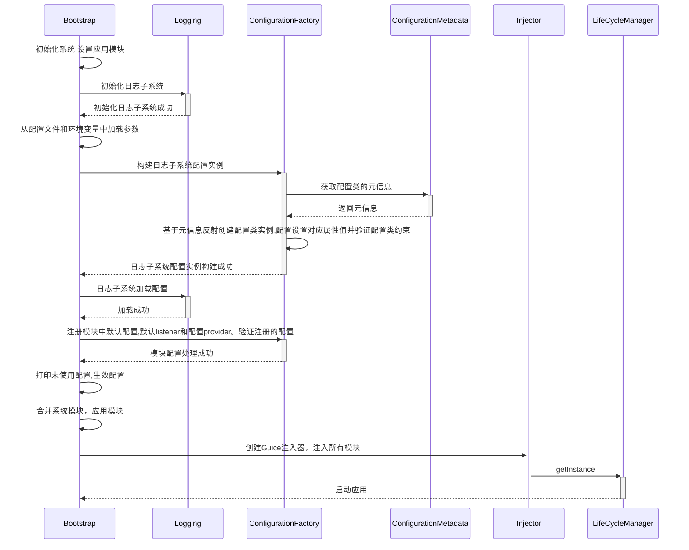
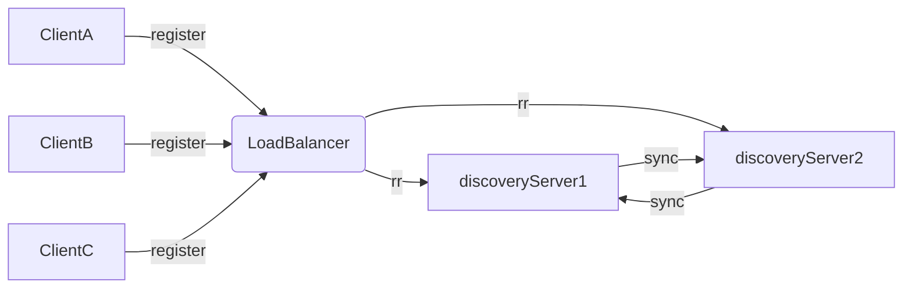

# Trino源码学习-Airlift源码分析

上一篇文章了解了 Trino 的基础 Airlift 框架。本篇将深入 Airlift 源码进行学习，Airlift中的服务都通过guice注入。

<!--more-->

## 从 Bootstrap 开始启动



从上面的时序图中，可以发现 Bootstrap 的主要工作:

1. 初始化和配置日志子系统
2. 应用配置加载和注册模块配置类
3. 创建 Guice 注入器，注入所有模块
4. 启动 LifeCycleManager

到此为止，Bootstrap 的工作就做完了。下面来看下 LifeCycleManager

## 生命周期管理-LifeCycleManager

LifeCycleManager 用于管理所有标记 PostConstruct and PreDestroy 的绑定的生命周期。Manager 本身有下面几种状态:


- 初始化，manager 初始化时会:
  - 被注入所有 PostConstruct and PreDestroy 的绑定
  - 调用所有 PostConstruct 方法
- start，manager start 时会:
  - 修改自身状态为 STARTING
  - 注册 JVM shutdownhook，当 jvm shutdown 时调用 stop 方法。
  - 修改自身状态为 STARTED
- stop，manager stop 时会:
  - 修改自身状态为 STOPPING
  - 移除 JVM shutdownhook(否则会递归调用)
  - 调用所有 PreDestroy 方法
  - 修改自身状态为 STOPPED

## http

### Rest

使用`jaxrsBinder()`方法绑定的 Resource 都会被绑定到`@JaxrsResource`上。

然后会被`io.airlift.jaxrs.JaxrsModule.JaxRsApplication`进一步处理。

### Static

使用 httpServerBinder(binder).bindResource() 方法绑定的 Resource 都会被绑定到HttpServerBinder.HttpResourceBinding.class + `@TheServlet`上。然后会在HttpServerProvider 内用于创建 HttpServer。

> HttpServerModule 中的 Servlet 就是`io.airlift.jaxrs.JaxrsModule`中创建的 ServletContainer。

## 日志

airlift日志相关的模块有两个:

- io.airlift.log
- io.airlift.log-manager

io.airlift.log中只有一个门面类`io.airlift.log.Logger`, 内部封装了`java.util.logging.Logger`。所有的日志格式都必须符合`String.format()`的格式。


io.airlift.log-manager模块用于管理日志后端。通过`io.airlift.log.Logging`初始化日志子系统。

```java
// 系统自带的ROOT Logger
private static final java.util.logging.Logger ROOT = java.util.logging.Logger.getLogger("");
private Logging() {
  ROOT.setLevel(Level.INFO.toJulLevel());
  for (Handler handler: ROOT.getHandlers()) {
    // 去除已有的handler
    ROOT.removeHandler(handler);
  }

  enableConsole();
  log.info("Logging to stderr");
  // 重定向标准输出
  redirectStdStreams();
}
```

然后通过`ROOT.addHandler(handler)`的方式增加日志后端handler，分别支持socket和文件。

下面是以Trino为例的日志架构图。

```
+------------------------------------------------------------------------------+
|Trino Core                                                                    |
|                                                       +-------------------+  |
|  Trino  +-------> Airlift Log API                     |            Airlift|  |
|  code                    +                            |              Log  |  |
|                          |                            |            Backend|  |
|                          |                            |                   |  |
|                          v                            |                   |  |
|  Third party +--> java.util.logging +------------------>   Handler        |  |
|  code        |                                        |       ^           |  |
|              |                                        |       |           |  |
|              |                                              slf4j-jdk14   |  |
|              |   +jcl-over-slf4j                      |       |           |  |
|              |   |                                            +           |  |
|              +-->+log4j-over-slf4j +------------------+-->  slf4j         |  |
|                  |                                    |                   |  |
|                  +log4j2-to-slf4j                     +-------------------+  |
|                                                                              |
+------------------------------------------------------------------------------+
```

> log-manager 中还包含了`*-over-slf4j`可以将使用commons-logging，log4j，log4j2日志桥接到slf4j-api，然后通过slf4j-jdk使用jul打印日志(和io.airlift.log.Logger一致)。

## 服务发现

airlift 的服务发现通过自身的 discovery 模块(服务发现客户端)和`https://github.com/airlift/discovery`项目(服务发现服务端)一起实现。

### 服务注册客户端

- 服务注册地址通过`discovery.uri`属性或者ServiceInventory配置。
  - `discovery.uri`配置绑定到 DiscoveryClientConfig 的 discoveryServiceURI 属性上。io.airlift.discovery.client.DiscoveryModule 中的 getDiscoveryUriSupplier 会提供 DiscoveryUri 并标记上 @ForDiscoveryClient
- HttpDiscoveryAnnouncementClient 构造时会注入 DiscoveryUri。然后会调用 announce 和 unannounce 注册服务。

```java
public class HttpDiscoveryAnnouncementClient
        implements DiscoveryAnnouncementClient
{
    @Inject
    public HttpDiscoveryAnnouncementClient(
            @ForDiscoveryClient Supplier<URI> discoveryServiceURI,
            NodeInfo nodeInfo,
            JsonCodec<Announcement> announcementCodec,
            @ForDiscoveryClient HttpClient httpClient)
    {
        requireNonNull(discoveryServiceURI, "discoveryServiceURI is null");
        requireNonNull(nodeInfo, "nodeInfo is null");
        requireNonNull(announcementCodec, "announcementCodec is null");
        requireNonNull(httpClient, "httpClient is null");

        this.nodeInfo = nodeInfo;
        this.discoveryServiceURI = discoveryServiceURI;
        this.announcementCodec = announcementCodec;
        this.httpClient = httpClient;
    }
    // 注册节点
    @Override
    public ListenableFuture<Duration> announce(Set<ServiceAnnouncement> services)
    {
        requireNonNull(services, "services is null");

        URI uri = discoveryServiceURI.get();
        if (uri == null) {
            return immediateFailedFuture(new DiscoveryException("No discovery servers are available"));
        }
        // 注册信息
        Announcement announcement = new Announcement(nodeInfo.getEnvironment(), nodeInfo.getNodeId(), nodeInfo.getPool(), nodeInfo.getLocation(), services);
        Request request = preparePut()
                .setUri(createAnnouncementLocation(uri, nodeInfo.getNodeId()))
                .setHeader("User-Agent", nodeInfo.getNodeId())
                .setHeader("Content-Type", MEDIA_TYPE_JSON.toString())
                .setBodyGenerator(jsonBodyGenerator(announcementCodec, announcement))
                .build();
        return httpClient.executeAsync(request, new DiscoveryResponseHandler<Duration>("Announcement", uri)
        {
            @Override
            public Duration handle(Request request, Response response)
                    throws DiscoveryException
            {
                int statusCode = response.getStatusCode();
                if (!isSuccess(statusCode)) {
                    throw new DiscoveryException(String.format("Announcement failed with status code %s: %s", statusCode, getBodyForError(response)));
                }

                Duration maxAge = extractMaxAge(response); //抽取超时时间，默认是10s
                return maxAge;
            }
        });
    }
    // 注册服务URL
    @VisibleForTesting
    static URI createAnnouncementLocation(URI baseUri, String nodeId)
    {
        return uriBuilderFrom(baseUri)
                .appendPath("/v1/announcement")
                .appendPath(nodeId)
                .build();
    }
    // 取消注册
    @Override
    public ListenableFuture<Void> unannounce()
    {
        URI uri = discoveryServiceURI.get();
        if (uri == null) {
            return immediateFuture(null);
        }

        Request request = prepareDelete()
                .setUri(createAnnouncementLocation(uri, nodeInfo.getNodeId()))
                .setHeader("User-Agent", nodeInfo.getNodeId())
                .build();
        return httpClient.executeAsync(request, new DiscoveryResponseHandler<>("Unannouncement", uri));
    }
    ... ...
}
```

Client 通过向`/v1/announcement/{node_id}`发送 PUT/DELETE 请求来向服务器注册/取消注册自己。从上面的代码可以看到每次注册会返回超时时间，如果没有返回，按照约定 maxAge 是 10s。

### 客户端注册定时调度

客户端使用 Announcer 进行周期性的服务状态更新。

```java

// io.airlift.discovery.client.Announcer
// announce 准备开始
public void start()
{
    checkState(!executor.isShutdown(), "Announcer has been destroyed");
    if (started.compareAndSet(false, true)) {
        // announce immediately, if discovery is running
        ListenableFuture<Duration> announce = announce(System.nanoTime(), new Duration(0, SECONDS));
        try {
            announce.get(30, SECONDS); // 30秒的最大等待时间
        }
        catch (Exception ignored) {
        }
    }
}
// announce 异步发送，在回调函数中进行延迟等待，然后准备下一次的announce
private ListenableFuture<Duration> announce(long delayStart, Duration expectedDelay)
{
    // log announcement did not happen within 5 seconds of expected delay
    if (System.nanoTime() - (delayStart + expectedDelay.roundTo(NANOSECONDS)) > SECONDS.toNanos(5)) {
        log.error("Expected service announcement after %s, but announcement was delayed %s", expectedDelay, Duration.nanosSince(delayStart));
    }

    long requestStart = System.nanoTime();
    // 在announcementClient中发起请求
    ListenableFuture<Duration> future = announcementClient.announce(getServiceAnnouncements());

    // 通过future的回调函数异步获得结果
    Futures.addCallback(future, new FutureCallback<Duration>()
    {
        @Override
        public void onSuccess(Duration expectedDelay)
        {
            errorBackOff.success();

            // wait 80% of the suggested delay，防止超出maxAge
            expectedDelay = new Duration(expectedDelay.toMillis() * 0.8, MILLISECONDS);
            scheduleNextAnnouncement(expectedDelay); // 下一次的announce
        }

        @Override
        public void onFailure(Throwable t)
        {
            Duration duration = errorBackOff.failed(t);
            scheduleNextAnnouncement(duration); // 下一次的announce
        }
    }, executor);
    return future;
}
// 下一次的announce
private void scheduleNextAnnouncement(Duration expectedDelay)
{
    // already stopped?  avoids rejection exception
    if (executor.isShutdown()) {
        return;
    }
    long delayStart = System.nanoTime();
    executor.schedule(() -> announce(delayStart, expectedDelay), expectedDelay.toMillis(), MILLISECONDS);
}
```

### 服务发现 Server

```java
// io.airlift.discovery.server.DynamicAnnouncementResource 服务端接收注册的代码
@PUT
@Consumes(MediaType.APPLICATION_JSON)
public Response put(@PathParam("node_id") Id<Node> nodeId, @Context UriInfo uriInfo, DynamicAnnouncement announcement)
{
  if (!nodeInfo.getEnvironment().equals(announcement.getEnvironment())) {
    return Response.status(BAD_REQUEST)
            .entity(format("Environment mismatch. Expected: %s, Provided: %s", nodeInfo.getEnvironment(), announcement.getEnvironment()))
            .build();
    }

  String location = firstNonNull(announcement.getLocation(), "/somewhere/" + nodeId.toString());

  DynamicAnnouncement announcementWithLocation = DynamicAnnouncement.copyOf(announcement)
    .setLocation(location)
    .build();

  dynamicStore.put(nodeId, announcementWithLocation);

  return Response.status(ACCEPTED).build();
}
```

服务端从注册接口收到注册信息后，会存入到 store 中。

```java
@Override
public void put(Id<Node> nodeId, DynamicAnnouncement announcement)
{
  List<Service> services = FluentIterable.from(announcement.getServiceAnnouncements())
  .transform(toServiceWith(nodeId, announcement.getLocation(), announcement.getPool()))
                .toList();

  byte[] key = nodeId.getBytes();
  byte[] value = codec.toJsonBytes(services);

  store.put(key, value, maxAge); // 设置注册的超时时间
  // maxAge 可以通过 discovery.max-age 配置，默认是30S
}
```

#### 服务发现Server模式

服务发现Server有两种启动模式:

1. EmbeddedDiscoveryModule: discovery作为某个服务的内嵌模块启动。
2. DiscoveryServer: discovery独立部署。

服务发现Server支持两种部署模式:
1. 单点部署
2. 集群部署

这两种方式均是通过ServiceInventory来实现的,service inventory可以是文件或者一个http链接，但是其内容结构都如下:

```json
{
   "environment":"test",
   "services":[
      {
         "id":"C8A9EE64-0476-452C-8638-8E72F3EE3CA6",
         "nodeId":"597A741E-9968-40E2-BB4D-7AF26DE18689",
         "type":"discovery",
         "pool":"general",
         "location":"/172.17.31.245",
         "state":"RUNNING",
         "properties":{
            "http":"http://172.17.31.245:8411"
         }
      },
      {
         "id":"370AF416-5F44-47D3-BFB6-D93A92676D49",
         "nodeId":"0BA42FDB-5DBA-4A2C-BE26-9596B7B4368E",
         "type":"discovery",
         "pool":"general",
         "location":"/172.17.31.246",
         "state":"RUNNING",
         "properties":{
            "http":"http://172.17.31.246:8411"
         }
      }
   ]
}
```

服务发现Server会查找ServiceInventory中type为discovery的服务，如果是一个就是单点部署，如果是多个就是集群模式。也可以不配置ServiceInventory，也是单点部署。

集群模式支持HA:

1. 前置LoadBalancer
2. discoveryServer之间互相同步



### DistributedStore

看代码，dynamicStore 内部的 store 是一个分布式 kv 存储(DistributedStore)。信息在存储在本地的localStore同时，会存储到远程的remoteStore。不同启动模式下localStore实例不同

1. EmbeddedDiscoveryModule: localStore是InMemoryStore，内部是ConcurrentMap
2. DiscoveryServer: localStore是PersistentStore，内部是leveldb

```java
//io.airlift.discovery.store.DistributedStore
public void put(byte[] key, byte[] value, Duration maxAge)
{
  ... ...

  long now = timeSupplier.get().getMillis();

  Entry entry = new Entry(key, value, new Version(now), now, maxAge.toMillis());

  localStore.put(entry);
  remoteStore.put(entry);
}
```

在启动这个分布式 kv 存储时，会启动一个过期检查，定时检查 PUT 过来的注册信息，根据里面的生命周期条件来判断是否进行过期释放。

```java
//io.airlift.discovery.store.DistributedStore
@PostConstruct
public void start(){
  garbageCollector.scheduleAtFixedRate(new Runnable(){
    @Override
    public void run()
    {
      removeExpiredEntries();
    }
  }, 0, garbageCollectionInterval.toMillis(), TimeUnit.MILLISECONDS);
}

@Managed
public void removeExpiredEntries(){
  for (Entry entry : localStore.getAll()) {
    if (isExpired(entry)) {
        localStore.delete(entry.getKey(), entry.getVersion());
    }
  }

  lastGcTimestamp.set(System.currentTimeMillis());
}
```

#### 节点间同步

节点间同步分为两种方式:

1. 定时同步(Replicator):定时同步(Replicator)比较简单就是本地启动一个线程，定时(store.remote.update-interval)从其他节点同步数据。
2. 主备复制(remoteStore):
  1. HttpRemoteStore内部维护了远程的服务的BatchProcessor
  2. 写入HttpRemoteStore的数据会先写入每个BatchProcessor的queue中
  3. BatchProcessor的queue中的数据会不断写入远程服务

### 注册信息查询

DiscoveryModule 使用 CachingServiceSelector 获取有关在发现服务器上注册的服务的信息。加载 DiscoveryModule 模块时，会继续加载 CachingServiceSelectorFactory 与 MergingServiceSelectorFactory 来实现缓存刷新。

```java
// io.airlift.discovery.client.DiscoveryModule
@Override
public void configure(Binder binder)
{
    ...
    // bind selector factory
    binder.bind(CachingServiceSelectorFactory.class).in(Scopes.SINGLETON);
    binder.bind(ServiceSelectorFactory.class).to(MergingServiceSelectorFactory.class).in(Scopes.SINGLETON);
    ...
}
```

CachingServiceSelector 定时向发现服务器发送一个请求以更新节点列表缓存。

```java
// io.airlift.discovery.client.CachingServiceSelector
@Override
public ListenableFuture<List<ServiceDescriptor>> refresh()
{
    ServiceDescriptors oldDescriptors = this.serviceDescriptors.get();
    ListenableFuture<ServiceDescriptors> future;
    if (oldDescriptors == null) {
        future = lookupClient.getServices(type, pool);
    }
    else {
        future = lookupClient.refreshServices(oldDescriptors);
    }
    future = chainedCallback(future, new FutureCallback<ServiceDescriptors>()
    {
        @Override
        public void onSuccess(ServiceDescriptors newDescriptors)
        {
            serviceDescriptors.set(newDescriptors);
            errorBackOff.success();
            Duration delay = newDescriptors.getMaxAge();
            if (delay == null) {
                delay = DEFAULT_DELAY; // 这个变量的默认是10秒
            }
            scheduleRefresh(delay); // 刷新
        }
        @Override
        public void onFailure(Throwable t) { ... }
    }, executor);
    ...
}
```
同样我们也可以在日志里看到更新缓存的日志。


## 参考资料

- [1] [airlift.discovery](https://github.com/airlift/discovery)

