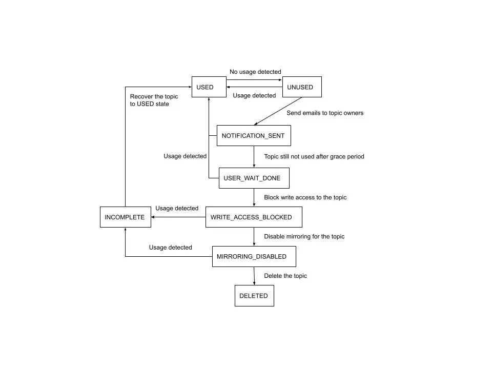
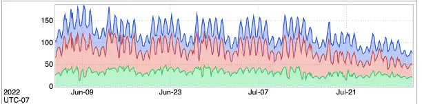

# TopicGC: How LinkedIn cleans up unused metadata for its Kafka clusters


- 原作者: Hao Geng
- 转载自: [https://www.linkedin.com/blog/engineering/infrastructure/topicgc_how-linkedin-cleans-up-unused-metadata-for-its-kafka-clu](https://www.linkedin.com/blog/engineering/infrastructure/topicgc_how-linkedin-cleans-up-unused-metadata-for-its-kafka-clu)


Apache Kafka 是一个开源的事件流平台，用户可以在其中创建 Kafka 主题作为数据传输单元，然后与生产者和消费者一起发布或订阅该主题。虽然大多数 Kafka 主题都在积极使用，但由于业务需求发生变化或主题本身是短暂的，因此不再需要一些主题。Kafka 本身没有自动检测未使用主题并删除它们的机制。这通常不是一个大问题，因为 Kafka 集群可以容纳相当多的主题，数百到数千个。但是，如果主题数量持续增长，最终会遇到一些瓶颈，并对整个 Kafka 集群产生破坏性影响。TopicGC服务的诞生就是为了解决这个确切的问题。事实证明，它通过删除~20%的主题来减轻Kafka的压力，并将Kafka的生产和消费性能提高了至少30%。

<!--more-->

## 动机

作为第一步，我们需要了解未使用的主题如何给 Kafka 带来压力。与许多其他存储系统一样，所有 Kafka 主题都有一个保留期，这意味着对于任何未使用的主题，数据将在一段时间后清除，并且主题将变为空。这里常见的问题是，空的主题如何影响卡夫卡？

### 元数据压力

出于主题管理目的，Kafka 将主题的元数据存储在多个位置，包括 Apache ZooKeeper 和每个代理上的元数据缓存。主题元数据包含分区和副本分配的信息。

让我们在这里做一些简单的计算：主题 A 可以有 25 个分区，复制因子为 3，这意味着每个分区有三个副本。即使不再使用主题 A，Kafka 仍然需要将所有 75 个副本的位置信息存储在某个位置。

元数据压力的影响对于单个主题来说可能不是那么明显，但如果有很多主题，它可以产生很大的不同。元数据可能会消耗来自 Kafka 代理和 ZooKeeper 节点的内存，并且可以向元数据请求添加有效负载。

### 抓取请求

在 Kafka 中，追随者副本定期向领导者副本发送获取请求，以与领导者保持同步。即使对于空洞的主题和分区，追随者仍然试图与领导者同步。因为卡夫卡不知道一个话题是否永远闲置，所以它总是迫使追随者从领导者那里获取。这些冗余的提取请求将进一步导致创建更多的读取线程，这可能会导致额外的网络、CPU 和内存利用率，并可能主导请求队列，导致其他请求延迟甚至丢弃。

### 控制器初始化

Kafka 控制器是协调和管理 Kafka 集群中其他代理的代理。许多 Kafka 请求必须由控制器处理，因此控制器可用性对 Kafka 至关重要。

在控制器故障转移时，必须选择一个新的控制器并接管管理群集的角色。新控制器需要一些时间从 ZooKeeper 加载整个集群的元数据，然后才能充当控制器，这称为控制器初始化时间。如本文前面所述，未使用的主题可能会生成额外的元数据，使控制器初始化速度变慢，并威胁到 Kafka 可用性。当 ZooKeeper 响应大于 1MB 时，可能会出现问题。对于我们最大的集群之一，ZooKeeper 的响应已经达到 0.75MB，我们预计在两到三年内它将遇到瓶颈。

## 服务设计

在设计TopicGC时，我们牢记了许多要求。功能方面，我们确定系统必须设置条件来确定是否应删除主题，不断运行垃圾回收器（GC）进程以删除未使用的主题，并在删除主题之前通知用户。

此外，我们还确定了系统的非功能性需求。这些要求包括确保在删除主题期间不会丢失数据，在删除之前从未使用的主题中删除所有依赖项，以及能够从服务故障中恢复主题状态。

为了满足这些要求，我们基于状态机模型设计了 TopicGC，我们将在以下各节中更详细地讨论。

### 主题状态机

为了实现所有功能要求，TopicGC 在内部运行状态机。每个主题实例都与一个状态相关联，并且有几个后台作业会根据需要定期运行和传输主题状态。表 1 描述了 TopicGC 中的所有可能状态。

|状态名称|描述|
|:---|:---|
|USED|正在使用该主题。|
|UNUSED|主题未被使用，并且为空。|
|NOTIFICATION_SENT|已向主题所有者发送电子邮件通知，通知主题将在一定时间后被删除。|
|USER_WAIT_DONE|在给定的时间内向用户发送电子邮件后，该主题仍未使用。|
|WRITE_ACCESS_BLOCKED|该主题上的写入访问权限被阻止，这意味着无法再向主题写入任何数据。|
|MIRRORING_DISABLED|主题的镜像服务已禁用。|
|DELETED|该主题已从 Kafka 集群中删除|
|INCOMPLETE|在主题删除过程中检测到使用情况。|

## 主题GC工作流程

在内部状态的帮助下，TopicGC 遵循一定的工作流程来删除未使用的主题。

### 检测主题使用情况

TopicGC 有一个后台作业来查找未使用的主题。在内部，我们使用以下标准来确定主题是否未使用：

- 主题为空
- 没有字节输入/字节输出
- 过去 60 天内没有读/写访问事件
- 该主题不是在过去 60 天内新创建的

TopicGC 服务从 ZooKeeper 和各种内部数据源（例如我们的指标报告系统）获取上述信息。

### 发送电子邮件通知

如果主题处于未使用状态，TopicGC 将触发邮件发送服务，查找主题所有者的 LDAP 用户信息并发送电子邮件通知。这很重要，因为我们不知道主题是暂时空闲还是永久未使用。在前一种情况下，主题所有者收到电子邮件后，他们可以采取措施防止删除主题。

### 阻止写入访问

这是 TopicGC 工作流程中最重要的步骤。想一想一个案例：如果用户在删除主题前的最后一秒生成了一些数据，则数据将随着主题删除而丢失。因此，避免数据丢失是TopicGC面临的关键挑战。为了确保 TopicGC 服务不会删除最后一分钟写入的主题，我们在删除主题之前引入了块-写入-访问步骤。阻止对主题的写入访问后，TopicGC 不可能导致数据丢失。

请注意，Kafka 没有“密封”主题的机制。在这里，我们利用LinkedIn的内部方法来阻止主题访问。在LinkedIn中，我们可以访问服务，以允许我们控制对所有数据资源的访问，包括 Kafka 主题。为了密封主题，TopicGC 会向访问服务发送请求，以阻止对该主题的任何读写访问。

### 禁用镜像

一个主题的数据可以通过布鲁克林镜像到其他集群。Brooklin 由 LinkedIn 开源，作为在各种异构源和目标系统之间流式传输数据的框架，具有高可靠性和大规模吞吐量。在删除主题之前，我们需要禁用主题的布鲁克林镜像。布鲁克林可以被视为所有卡夫卡主题的通配符使用者。如果在未通知 Brooklin（布鲁克林）的情况下删除该主题，Brooklin 将抛出有关从不存在的主题中消费的异常。出于同样的原因，在删除主题之前，如果有任何其他服务从所有主题消费，TopicGC 应该告诉这些服务在删除主题之前停止从垃圾主题消费。

### 删除主题

完成所有准备工作后，TopicGC 服务将通过调用 Kafka 管理员客户端触发主题删除。主题删除过程可以自定义，在我们的例子中，我们批量删除主题。由于主题删除会给 Kafka 集群带来额外的负载，因此我们将并发主题删除数的上限设置为 3。

### 最后一分钟使用情况检查

在对主题进行任何实际更改（包括阻止写入访问、禁用镜像和主题删除）之前，我们会对主题运行最后一分钟的使用情况检查。这是为了添加一个额外的安全层以防止数据丢失。如果 TopicGC 在整个删除过程中检测到使用情况，它会将主题标记为未完成状态，并开始将主题恢复到 USED 状态。

## 主题GC的影响

我们在最大的数据管道之一中启动了 TopicGC，并将主题数量减少了近 20%。在图中，每种颜色表示管道中不同的 Kafka 群集。

主题删除有助于减少 Kafka 集群中的总提取请求，因此，删除未使用的主题后，CPU 使用率会显著下降。Kafka CPU的总使用率减少了约30%。

由于 CPU 使用率降低，Kafka 代理能够更有效地处理请求。结果，Kafka 的请求处理性能得到了提高，请求延迟下降了 40%。图 4 显示了元数据请求延迟的减少。

## 结论

在我们推出 TopicGC 删除 Kafka 未使用的主题后，它删除了近 20% 的主题，并显著降低了我们 Kafka 集群的元数据压力。根据我们的指标，客户端请求性能提高了约 40%，CPU 使用率降低了多达 30%。

## 未来计划

由于 TopicGC 已经展示了其清理 Kafka 集群和提高 Kafka 性能的能力，我们决定向所有内部 Kafka 集群推出该服务。我们希望看到 TopicGC 可以帮助LinkedIn更有效地利用 Kafka 的资源。

## 确认
非常感谢Joseph Lin和Lincong Li提出TopicGC的想法并实现原始设计。我们也感谢我们的经理Rohit Rakshe和Adem Efe Gencer，他们为这个项目提供了重要的支持。最后但并非最不重要的一点是，我们要向Kafka SRE团队和Brooklin SRE团队致敬，让他们成为乐于助人的合作伙伴。在他们的帮助下，我们顺利启动了TopicGC，并能够看到这些令人兴奋的结果。

