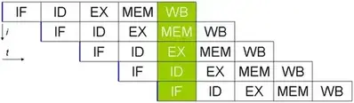
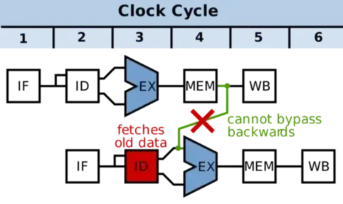
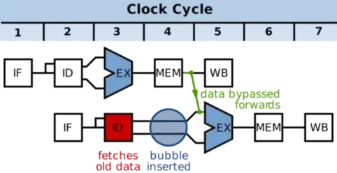
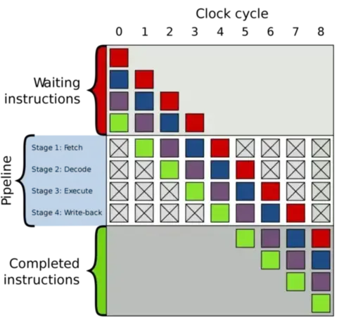
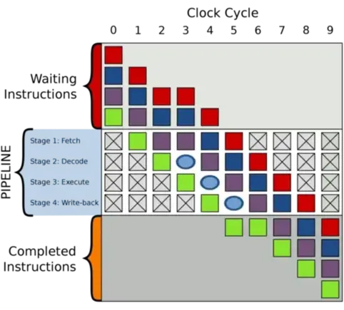
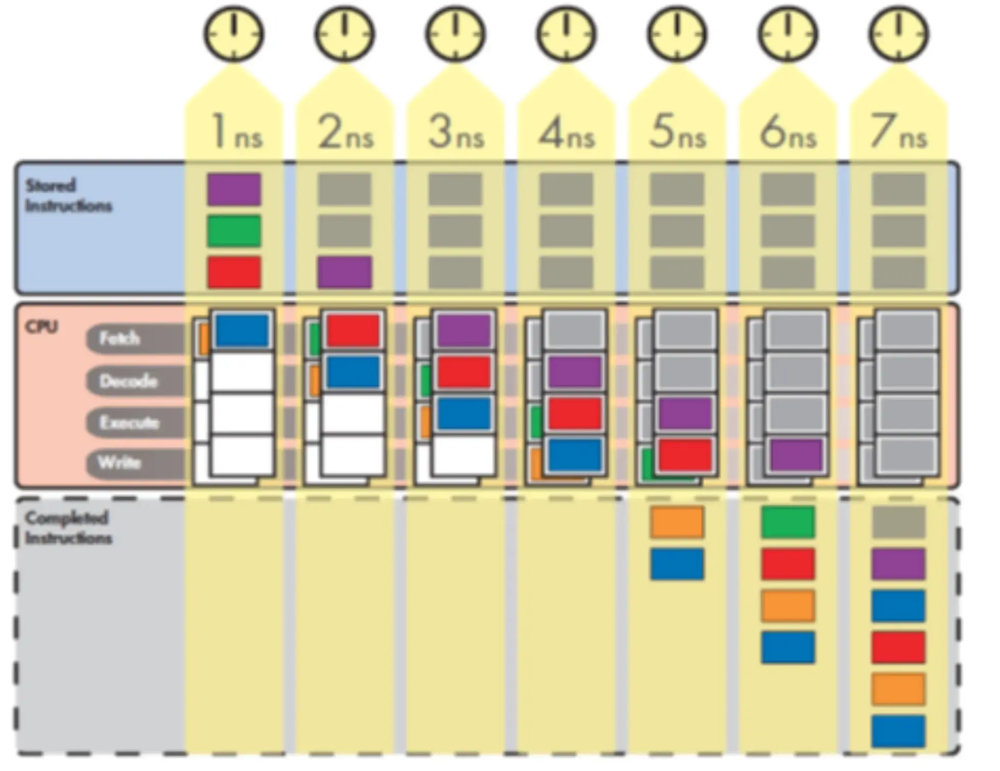
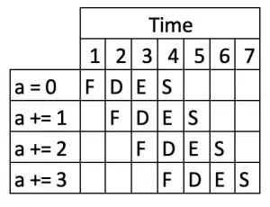
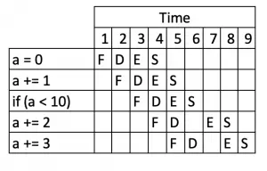

# CPU流水线简介

本文是CPU 流水线的简介。

<!--more-->

## 指令的生命周期

任何微处理器在指令流中移动时的基本动作都可以分解为一系列5个简单的步骤，代码流中的每个指令都要经过这些步骤才能执行：

1. IF 指令获取: 从程序计数器中存储的内存地址获取下一条指令（这里的内存可以指高速缓存，也可以是专用的SRAM)。
2. ID 指令解码: 将该指令存储在指令寄存器中并对其进行解码，并在程序计数器中递增地址。
3. EX 执行: 执行指令寄存器中的当前指令。如果指令不是分支指令，而是算术指令，请将其发送到正确的 ALU。
    - 读取输入寄存器的内容。
    - 添加输入寄存器的内容。
4. MEM 内存访问: 如果需要访问数据存储器，在这个阶段完成 
5. WB 写回:将该指令的结果从 ALU 写回目标寄存器。

在现代处理器中，上述5个步骤会一遍又一遍地重复，直到程序完成执行。事实上，这些是经典RISC流水线中的5个阶段。可以暂时将管道视为执行代码流时代码流中每条指令必须经过的一系列阶段。

上述每个阶段都可以说代表指令“生命周期”中的一个阶段。指令从获取阶段开始，进入解码阶段，然后进入执行阶段，中间可能会访问内存，最后进入写入阶段。 每个阶段都需要固定但绝不相等的时间。在本文的示例中，所有阶段花费的时间相等;在实际处理器中通常不是这种情况。在任何情况下，如果一个简单的示例处理器需要1纳秒才能完成每个阶段，那么该处理器可以每5纳秒完成一条指令。

## 流水线基础知识：一个类比

本节使用工厂流水线类比来解释。假设我和我的朋友决定进入汽车制造业务，我们的第一个产品是运动型多功能车（SUV）。经过一番研究，我们确定SUV制造过程有五个阶段：

第 1 阶段：构建机箱。
第 2 阶段：将发动机放入底盘中。
第 3 阶段：在机箱上安装门、引擎盖和覆盖物。
第 4 阶段：安装轮子。
第 5 阶段：给 SUV 上漆。

上述每个阶段都需要使用训练有素的工人，这些工人具有非常专业的技能，结果是擅长制造底盘的工人对发动机、车身、车轮或油漆知之甚少，发动机制造商、油漆工和其他工作人员也是如此。因此，当我们第一次尝试组建SUV工厂时，我们雇用并培训了五名专家，每个阶段为SUV制造过程。有一个工作人员来制造底盘，一个工作人员负责发动机，另一个工作人员负责车轮，还有一个喷漆团队。最后，由于工作人员非常专业和高效，SUV建造过程的每个阶段都需要一个小时才能完成。

现在，由于我和我的朋友是计算机类型，而不是工业工程师，我们在有效利用工厂资源方面有很多东西要学。我们的第一个工厂的运作基于以下计划：将所有五个工作人员安排在工厂车间排成一行，并让第一批工作人员在第一阶段启动SUV。第 1 阶段完成后，第 1 阶段的工作人员将部分完成的 SUV 交给第 2 阶段的工作人员，然后进入休息室玩一些桌上足球，而第 2 阶段的工作人员则制造发动机并将其放入。一旦第二阶段的工作人员完成，SUV将向下移动到第3阶段，第3阶段的工作人员接管，而第二阶段的工作人员在休息室加入第一阶段的工作人员。

SUV以这种方式在所有五个阶段中继续前进，在任何给定时间只有一个工作人员在一个阶段工作，而其他工作人员则闲置。一旦完成的SUV完成第5阶段，第1阶段的乘员就会开始乘坐另一辆SUV。按照这个速度，完成一辆SUV正好需要五个小时，而我们的工厂每五个小时完成一辆SUV。

快进一年。我们的SUV卖得非常好，我们希望找到一种方法来增加我们工厂每小时可以完成的 SUV 数量（即我们工厂的 SUV 完成率）。通过每小时完成更多的SUV，我们可以赚更多的钱。

提高我们工厂SUV完成率的最直观方法是尝试减少每辆SUV的生产时间。如果我们能让工作人员以两倍的速度工作，那么我们的工厂可以在相同的时间内生产两倍的SUV。不过，我们的工作人员已经在尽其所能地工作，所以除非有技术突破来提高他们的生产力，否则这个选项目前不在考虑范围之内。

由于我们无法加快我们的工作人员速度，我们总是可以使用蛮力方法，并通过建造第二条装配线来解决问题。如果我们雇用和培训五名新员工来组建第二条装配线，也能够每五个小时生产一辆汽车，我们可以每五个小时从工厂车间完成两辆 SUV，这是我们目前工厂的 SUV 完成率的两倍。不过，这似乎不是对工厂资源的非常有效的利用，因为我们不仅同时会有两倍的工作人员工作，而且我们也会同时在休息室里有两倍的工作人员。必须有更好的方法。

面对缺乏选择，我们聘请了一个顾问团队来找出一种聪明的方法来提高工厂的整体生产力，而无需增加两倍的工作人员数量或提高每个工作人员的生产力。一年后，数千小时的计费时间，顾问们找到了解决方案。为什么要让我们的工作人员在休息室里度过五分之四的工作，而他们本可以在这段时间里做有用的工作？通过适当安排现有的五个工作人员，我们的工厂每小时可以完成一辆SUV，从而大大提高了我们装配线的效率和产量。修改后的工作流程如下所示：第一阶段工作人员构建底盘。底盘完成后，他们将其发送给第 2 阶段的工作人员。第 2 阶段机组人员收到底盘并开始放入发动机，而第 1 阶段机组人员开始使用新底盘。当阶段 1 和阶段 2 机组人员都完成后，阶段 2 机组人员的工作将进入第 3 阶段，阶段 1 机组人员的工作将进入第 2 阶段，第 1 阶段机组人员将在新的底盘上开始。

因此，随着装配线开始装满处于不同生产阶段的 SUV，更多的工作人员同时投入工作，直到所有工作人员都在不同的生产阶段从事不同的车辆工作。（当然，这就是后福特时代我们大多数人期望一条良好、高效的装配线能够工作的方式。如果我们能够保持装配线满员，并让所有五个工作人员同时工作，那么我们可以每小时生产一辆 SUV：SUV 完成率比以前每五小时一辆 SUV 的完成率提高了五倍。简而言之，这就是流水线。

虽然每辆SUV的生产时间与原来的5小时相比没有变化，但整个工厂完成SUV的速度大大加快了。流水线通过优化利用现有资源来发挥其魔力。我们不需要加快生产过程的每个阶段，也不需要大幅增加我们投入到问题上的资源量;所有必要的是，我们从已经存在的资源中获得更多的工作。

回到微处理器，应该很容易看出这个概念如何应用于指令生命周期的5个阶段。就像我们类比中的工厂所有者希望增加工厂在给定时间段内可以完成的 SUV 数量一样，微处理器设计人员一直在寻找增加 CPU 在给定时间段内可以完成的指令数量的方法。当我们回想起程序是一个有序的指令序列时，很明显，增加每单位时间执行的指令数量是减少执行程序所需总时间的一种方法。提高处理器的指令完成率（即每单位时间内完成的指令数）使我们能够更快地运行程序。

## 非流水线示例

早期，非流水线处理器一次处理一条指令，在一个时钟周期内将每条指令移动到其生命周期的所有四个阶段。因此，非流水线处理器也称为单周期处理器，因为所有指令都需要一个时钟周期才能完全执行（或者通过其生命周期的所有四个阶段）。


由于处理器以每个时钟周期一个的速率完成指令，我们希望CPU的时钟尽可能快地运行，以便处理器的指令完成率（即每纳秒完成的指令数）可以尽可能高。因此，我们需要计算完成一条指令所需的最短时间，并使时钟周期时间等同于该时间长度。碰巧的是，在我们假设的示例 CPU 上，指令生命周期的5个阶段总共需要 5 纳秒才能完成。因此，我们应该将 CPU 时钟周期的持续时间设置为5纳秒，以便 CPU 可以在单个时钟中完成指令的生命周期，从提取到写回。（CPU 时钟周期通常简称为“时钟”)。

指令离开代码存储区域，进入处理器，然后在5纳秒时钟周期内通过其生命周期的各个阶段，直到第5纳秒结束时它完成最后一个阶段并且其生命周期结束。第5纳秒的结束也是第一个时钟周期的结束，所以现在第一个时钟周期已经完成，指令已经完成其执行，新的指令可以在新时钟周期开始时进入处理器并经历相同的过程。重复这个5纳秒的步骤序列，直到总共20ns（或四个时钟周期）后，处理器以 0.2条指令/秒（= 4 条指令/20 ns）的完成率完成了所有四条指令。

单周期处理器设计简单，但它们浪费了大量硬件资源。通过对上面的处理器进行流水线化，我们可以让更多的硬件每纳秒工作一次，从而提高处理器的效率及其执行程序的性能。

## 流水线示例

由于指令的生命周期由5个相当不同的阶段组成，因此我们可以首先将单周期处理器的指令执行过程分解为5个离散的流水线阶段，其中每个流水线阶段对应于标准指令生命周期中的一个阶段：

- IF：（指令获取）从内存读取指令
- ID：（指令解码）解码指令并从寄存器读取操作数
- EX：（执行）执行语句
- MEM：（内存）内存访问（仅适用于某些指令）
- WB：（回写）将结果写入相应的日志

请注意，管道阶段数称为管道深度。因此，我们的5级管道的管道深度为5级。

为了方便起见，假设上述5个流水线阶段中的每一个都恰好需要一纳秒才能完成指令的工作，就像我们装配线类比中的每个工作人员需要 1 小时才能完成其在 SUV 上的工作一样。因此，我们原来的单周期处理器的5纳秒执行过程现在被分解为5个离散的顺序流水线阶段，每个阶段的长度为一纳秒。



在第6纳秒开始时，管道已满，处理器可以开始以每纳秒一条指令的速率完成指令。这 1 条指令/ns 的完成率比单周期处理器的 0.2 条指令/秒（或每 20 纳秒 4 条指令）的完成率提高了5倍。

### 缩短时钟

与单周期处理器相比，流水线处理器中 CPU 时钟的作用略有变化。由于所有管道阶段现在必须同时协同工作，并在每个新纳秒开始时准备好将其工作结果移交给下一个管道阶段，因此需要时钟来协调整个管道的活动。完成此操作的方法很简单：缩短时钟周期时间以匹配每个阶段完成其工作所需的时间，以便在每个时钟周期开始时，每个管道阶段将其正在处理的指令移交给管道中的下一阶段。由于示例处理器中的每个流水线阶段都需要 1 纳秒才能完成其工作，因此我们可以将时钟周期的持续时间设置为 1 纳秒。

### 缩短程序执行时间

请注意，每条指令的总执行时间不会因流水线而改变。它仍然需要一条指令 5ns 才能完全通过处理器;5ns可以分成5个时钟周期，每个周期1ns，或者它可以覆盖一个更长的时钟周期，但它仍然是相同的5ns。因此，流水线不会加快指令执行时间，但它确实通过增加每单位时间内完成的指令数来加快程序执行时间（即执行整个程序所需的纳秒数）。就像我们假设的SUV装配线允许我们在更短的时间内完成一样，即使每辆SUV仍然在装配线上总共花费了五个小时，流水线也允许处理器在更短的时间内执行程序，即使每个单独的指令仍然花费相同的时间通过CPU。流水线通过使其所有单元同时工作来更有效地利用 CPU 的现有资源，从而允许它每纳秒完成更多的总工作。

## 流水线加速

通常，与单周期实现相比，完成率的加速理想情况下等于管道阶段的数量。与单周期相比，四级管道的完成率提高了四倍，五级管道的加速提高了五倍，十二级管道的加速提高了十二倍，依此类推。这种加速是可能的，因为处理器中的流水线级越多，处理器可以同时处理的指令就越多，并且在给定时间段内可以完成的指令就越多。因此，您对指令生命周期的这四个阶段进行切分得越精细，用于实现这些阶段的硬件就越多，您可以在任何时刻开始加速。

回到我们的装配线类比，假设每个船员由六名工人组成，每个船员执行的每个小时任务可以很容易地细分为两个更短的 30 分钟任务。因此，我们可以将每个工作人员分成两个更小、更专业的团队，每个团队有三名工人，然后让每个较小的团队每 30 分钟在一辆 SUV 上执行一项较短的任务，从而使工厂的吞吐量翻倍。

- 第 1 阶段：构建机箱。
    - 机组人员 1a：将底盘的部件组装在一起并点焊连接。
    - 机组人员 1b：完全焊接机箱的所有部件。
- 第 2 阶段：将发动机放入底盘中。
    - 机组人员 2a：将发动机放入底盘并将其安装到位。
    - 乘员2b：将发动机连接到汽车的运动部件。
- 第 3 阶段：在机箱上安装门、引擎盖和覆盖物。
    - 机组人员 3a：将车门和引擎盖放在底盘上。
    - 乘员 3b：将其他覆盖物放在机箱上。
- 第 4 阶段：安装轮子。
    - 乘员4a：安装两个前轮。
    - 乘员4b：安装两个后轮。
- 第 5 阶段：给 SUV 上漆。
    - 乘员5a：给SUV的侧面上漆。
    - 乘员5b：给SUV的顶部涂漆。

经过上述修改后，我们工厂的十个较小的工作人员现在在任何给定的 30 分钟内总共有 10 辆 SUV 在进行中。此外，我们的工厂现在可以每 30 分钟完成一辆新 SUV，比我们第一家工厂每 5 小时完成一辆 SUV 的速度提高了 10 倍。因此，通过更深入地流水线，我们让更多的工人同时工作，从而增加了可以同时工作的SUV数量，并增加了在给定时间内可以完成的SUV数量。

深化我们5阶段处理器的管道的工作原理类似，对完成率也有类似的影响。就像我们的SUV装配线中的五个阶段可以进一步分解为更长的更专业的阶段序列一样，我们可以将每条指令所经历的执行过程分解为一系列不仅仅是5个谨慎的阶段。通过将处理器的5级流水线分解为一系列更长的更短、更专业的级，我们可以将处理器的更多专用硬件同时处理更多指令，从而增加流水线每纳秒完成的指令数量。

我们首先从单周期处理器转向流水线处理器，方法是将指令通过处理器所花费的4纳秒时间段，并将其切成4个离散的流水线阶段，每个阶段的长度为一纳秒。这4个离散的管道阶段对应于指令生命周期的4个阶段。但是，处理器的管道阶段并不总是与处理器生命周期的4个阶段完全对应。一些具有六阶段管道，许多处理器的管道深度超过十或二十个阶段。在这种情况下，CPU 设计人员必须将指令的生命周期划分为所需数量的阶段，以使所有阶段的长度相等。

> 备注: CPU阶段也有被认为是4个，因为内存访问仅限于某些指令
> 1. 获取
> 2. 解码
> 3. 执行
> 4. 写入（或“回写”）
 
现在，让我们将4纳秒的执行过程分为8个阶段。由于所有8个流水线级必须具有完全相同的持续时间才能使流水线工作，因此4个流水线级的长度必须分别为 4ns/8 = 0.5ns。由于我们目前正在使用一个理想化的示例，让我们假设将处理器的4阶段生命周期分成8个同样长（0.5ns）的流水线阶段是一件微不足道的事情，（实际上，这项任务并非微不足道，需要权衡取舍。作为对这一现实的让步，我选择在下图中使用现实世界管道的八个阶段，即 MIPS 管道，而不是将四个传统阶段中的每一个一分为二。)


我们的单周期处理器每四纳秒可以完成一条指令，完成率为0.25条指令/秒，而我们的四级流水线处理器每纳秒可以完成一条指令，完成率为1条指令/秒。上面描述的八级处理器通过每0.5ns完成一条指令来改进这两个方面，完成率为2条指令/ns。请注意，由于每条指令仍需要 4ns 才能执行，因此八级处理器的前 4 纳秒仍专用于填充管道。但是一旦流水线已满，处理器就可以开始完成指令，速度是四级处理器的两倍，是单级处理器的八倍。

与单周期设计相比，完成率提高了八倍，这意味着我们的八级处理器可以比单周期或四级处理器更快地执行程序。但是，完成率的八倍提高是否意味着程序执行时间减少了八倍？不完全是。

## 完成率和程序执行时间

单周期处理器正在运行的程序仅包含所示的四条指令，则该程序的程序执行时间为 16 ns，或 4 ns/指令 x 4 条指令。如果程序由七条指令组成，则程序执行时间为 4 ns/指令 x 7 条指令 = 28 ns。通常，程序的执行时间等于处理器的指令完成率（每纳秒完成的指令数）乘以程序中的指令总数。

> 程序执行时间 = 指令完成率 x 程序中的指令数。

对于非流水线单周期处理器，指令完成率（每 1 条指令 X ns）只是指令执行时间（每 X ns 1 条指令）的倒数。对于流水线处理器，情况并非如此。

流水线处理器最初需要四纳秒才能填满指令;流水线处理器直到第四纳秒结束才完成其第一条指令。因此，它在程序执行的前 8 ns 内完成的指令比管道在整个 8 ns 内已满时要少。当处理器执行由数千条指令组成的程序时，随着纳秒数扩展到数千秒，这四个初始纳秒（在此期间只完成一条指令）对程序执行时间的影响开始消失，流水线处理器的优势开始接近四倍标记。例如，在 1000 纳秒之后，非流水线处理器将完成 250 条指令`(1000ns*0.25 条指令/ns = 250 条指令)`，而流水线处理器将完成 996 条指令`((1000ns-4ns）*1 条指令/ns)` 提高了 3.984 倍。

总而言之，流水线处理器只有在每个时钟周期都充满流水线的情况下长时间运行才能接近其理想的完成率。

## 指令吞吐量和流水线停滞

流水线并不是完全“免费的”。流水线增加了微处理器控制逻辑的复杂性，因为所有这些阶段都必须保持同步。然而，对于我们目前的讨论来说，更重要的是，流水线增加了微处理器设计和我们评估处理器性能的方式的复杂性。

到目前为止，我们只从指令完成率或处理器的管道每纳秒可以完成的指令数来讨论微处理器性能。现实世界中更常见的性能指标是管道的指令吞吐量，即处理器每个时钟周期完成的指令数。您可能会认为流水线的指令吞吐量应始终为 1 条指令/时钟，因为我在上面说过，流水线处理器在写入阶段处于活动状态的每个时钟周期结束时完成一条新指令。但是请注意该定义的强调部分如何使它有所限定;我们已经看到，在填充管道的时钟周期中，写入阶段处于非活动状态，因此在这些时钟周期中，处理器的指令吞吐量为 0 条指令/时钟。相反，当指令的流水线已满且写入阶段处于活动状态时，流水线处理器的指令吞吐量为 1 条指令/时钟。

因此，就像处理器的最大理论完成率与其平均完成率之间存在差异一样，处理器的最大理论指令吞吐量和平均指令吞吐量也存在差异。

1. 指令吞吐量：处理器在每个时钟周期内完成执行的指令数。您还将看到指令吞吐量，称为每时钟指令数 （IPC）。
2. 最大理论指令吞吐量：处理器在每个时钟周期内可以完成执行的理论最大指令数。对于到目前为止描述的简单类型的流水线和非流水线处理器，此数字始终是每个周期一条指令（1 条指令/周期或 1 个 IPC）。
3. 平均指令吞吐量：处理器在一定周期数内实际完成的每时钟平均指令数 （IPC）

处理器的指令吞吐量与其指令完成率密切相关。处理器每个时钟周期完成的指令越多，它每纳秒完成的指令就越多。我们稍后将详细讨论这两个指标之间的关系，但现在只需记住，更高的指令吞吐量转化为更高的指令完成率，从而获得更好的性能。

### 管道失速

在现实世界中，处理器的管道不仅仅是到目前为止描述的两个(完整的管道或正在填充的管道)。有时，指令会在一个管道阶段中挂起多个周期。

发生这种情况的原因有很多，例如在解码阶段，控制单元将确定解码指令是否从当前执行的指令写入的寄存器中读取。如果此条件成立，控制单元将使指令停止一个时钟周期。它还会在获取阶段停止指令，以防止该阶段的指令被程序中的下一条指令覆盖。

在下面的例子中，第一条指令的MEM级（第4级）之后的可用数据需要作为第二条指令的EX级（第3级）的输入。如果没有气泡，EX级（第3级）只能访问前一个EX级的输出。因此，添加气泡可以解决时间依赖性，而无需在时间上向后传播数据（这是不可能的）。





当发生这种情况时，管道不会停滞不前。当流水线在某个阶段停滞或挂起时，停滞发生的阶段下方的所有指令继续正常推进，而停滞的指令只是坐在它的阶段并备份它后面的所有指令。假设指令在获取阶段停止了两个额外的周期。由于指令处于停滞状态，因此对于它停止的每个周期，在管道中会打开一个新的气泡。一旦指令再次开始通过管道前进，气泡在以前停止的指令之前沿着管道向下移动，直到它们最终离开管道。



下图在周期#2中获取紫色指令的延迟会导致创建一个气泡，延迟其后的所有指令



气泡会降低管道的平均指令吞吐量，因为它们会阻止管道在每个周期达到一条已完成指令的最大吞吐量。（同样，气泡只是一种表示气泡所在的管道阶段在该周期中不做任何工作的方式。气泡下方的指令完成后，处理器将不会完成任何新指令，直到气泡移出管道。因此，在时钟周期结束时，不会向已完成指令区域添加新指令;管道中出现的气泡越多，处理器的实际指令吞吐量与其最大指令吞吐量的距离就越远。

处理器的架构特性中有很大一部分都致力于防止管道停滞。特别是分支预测，因为它是防止处理器在获取阶段停滞大量周期的重要工具。

### 指令延迟和管道停滞

指令的延迟是指令通过管道所需的时钟周期数。对于单周期处理器，所有指令的延迟为一个时钟周期。相比之下,对于四阶段流水线，所有指令都有四个周期的延迟。同样，指令在八级管道上的延迟为 8 个周期，在 12 阶段管道上具有 12 个周期的延迟，依此类推。

在实际处理器中，指令延迟不一定是等于管道级数的固定数字。由于指令可能会在一个或多个管道阶段中挂起多个周期，因此它们在管道阶段中等待的每个额外周期都会增加一个周期。因此，上面给出的指令延迟，即四阶段流水线的四个周期，八态流水线的八个周期等，表示最小指令延迟。任何长度的管道中的实际指令延迟都可能长于管道的深度，具体取决于指令是否在一个或多个阶段中停止。

## 流水线的限制

正如您可能猜到的那样，在从流水线中获得的实际完成率加速开始明显低于您可能期望的理想加速之前，装配线或处理器的管道深度存在一些实际限制。在现实世界中，指令生命周期的不同阶段不容易分解为任意数量的持续时间完全相同的较短阶段。有些阶段本质上比其他阶段更复杂，需要更长的时间。但是，由于每个流水线级必须正好需要一个时钟周期才能完成，因此协调所有级的时钟脉冲不能比流水线最慢的级快。换句话说，管道中最慢的阶段完成所需的时间将决定CPU时钟周期的长度，从而决定每个管道阶段的长度。这意味着管道最慢的阶段将花费整个时钟周期工作，而较快的阶段将花费部分时钟周期空闲。这不仅浪费资源，而且通过拖出生命周期的某些阶段来占用比处理器未流水线更多的时间，从而增加每条指令的整体执行时间？所有其他阶段必须在每个周期多等待一点时间，而最慢的阶段则追赶。

因此，当您更精细地切片管道以添加阶段并提高吞吐量时，各个阶段的长度和复杂性越来越不均匀，结果处理器的整体指令执行时间变长。由于流水线的这一特性，CPU设计人员面临的最困难和最重要的挑战之一是平衡流水线，以便没有一个阶段需要比其他任何阶段做更多的工作。设计人员必须将处理指令的工作均匀地分配给每个阶段，这样就不会有一个阶段占用太多时间，从而减慢整个管道的速度。

### 时钟周期和完成率

如果流水线处理器的时钟周期时间或时钟周期长于其理想长度（即非流水线指令执行时间/流水线深度），并且始终如此，则处理器的完成率将受到影响。如果指令吞吐量保持固定，例如 1 条指令/时钟，则随着时钟周期的增加，完成率会降低。由于新指令只能在每个时钟周期结束时完成，因此较长的时钟周期转化为每纳秒完成的指令更少，这反过来又转化为更长的程序执行时间。

例如八阶段流水线，我们将其时钟周期时间增加到1ns而不是 0.5ns。指令执行时间现在已从原来的 4 纳秒时间增加到新的 8 纳秒时间，这意味着八阶段流水线直到第八纳秒结束才完成其第一条指令。一旦管道已满，处理器开始以每纳秒一条指令的速度完成指令。该完成速率是时钟周期时间为0.5ns的理想八级流水线完成速率的一半。它也与理想四阶段流水线的 1 条指令/ns 完成率完全相同。简而言之，我们新的八级管道更长的时钟周期时间剥夺了更深管道的完成率优势。此外，八级管道现在需要两倍的时间才能填充。

## 超标量计算和流水线

超标量计算允许微处理器将它完成的每个时钟的指令数增加到 1 条指令/时钟以上。回想一下，如上所述，1 条指令/时钟是流水线处理器的最大理论指令吞吐量。由于超标量机器在每个时钟周期的多个写入阶段可以有多个指令，因此超标量机器每个周期可以完成多条指令。


在上图中，一旦管道已满，每个周期的“已完成指令”框中都会添加两条指令。处理器并行运行的 ALU 流水线越多，它可以在每个周期内添加到该框中的指令就越多。因此，超标量计算允许我们通过添加更多硬件来增加处理器的 IPC。


并行执行的指令数量存在一些实际限制，因此处理器并不总是达到每个时钟两条指令的理想完成率。有时，处理器找不到两个指令在特定周期上并行执行，这意味着它必须在该周期的其中一个管道中插入管道气泡，从而降低完成率。

## 同时进行多线程和流水线

在超标量流水线机器上保持处理器的平均完成率涉及找到安排指令在每个周期并行执行的方法。但是，由于代码流被设计为顺序的，因此处理器可以从中提取的并行度存在一些固有的限制。



英特尔、IBM 和 AMD 的最新处理器解决此问题的方法之一是在其处理器中包含对同时多线程（也称为超线程或“SMT”）的支持，然后要求程序员和/或编译器使代码流尽可能显式并行。只有多线程应用程序才能充分利用 SMT，而多线程只能由设计应用程序的一方完成。

多线程应用程序设计涉及识别应用程序中可以拆分为离散和独立任务的部分，并将这些任务分配给单独的执行线程。这种对应用程序进行多线程处理的过程实际上将单个顺序代码流转换为可以并行执行的两个或多个相关代码流的捆绑包。当两个并发执行的线程是同一程序的一部分时，该程序的平均完成率将增加，因为每个周期将完成更多的指令。从这个意义上说，SMT可以通过更好地利用超标量硬件来提高程序的平均完成率。

通过将代码流从头开始设计为一组较小的同时执行的代码流，提取指令级并行性的一些负担从处理器转移到程序员/编译器。请注意，编译器在这种并行化方面是出了名的差，因此通常由程序员来设计应用程序，以便将其分解为多个线程。

并非所有应用程序都适合多线程实现。在这种情况下，SMT几乎没有优势。不过，一会儿再说为什么会这样。现在，让我们看看 SMT 可以提高应用程序性能的另一种方式。

SMT 不仅可以通过在正常情况下（即所有指令都在 L1 缓存中找到）提高多线程应用程序的平均完成率来提高应用程序性能，还可以防止由于缓存未命中和内存延迟而导致完成率降至零。当处理器同时执行两个线程，并且其中一个线程在获取阶段停止（即，存在缓存未命中，因此线程必须从主内存获取指令或数据）时，处理器可以继续正常执行非停止线程。在非 SMT 处理器中，流水线气泡会在停滞的指令下方出现并传播到执行内核中，从而扼杀应用程序的平均完成率。另一方面，SMT 处理器可以调度来自非停滞线程的指令，以便在这些可用的管道插槽中执行。

如果上述方案中的两个线程来自同一应用程序，则 SMT 通过继续从未停止的线程执行代码来防止多线程应用程序的完成率在停止期间降至零。这有助于保持应用程序的平均完成率，并减少执行应用程序所需的时间。另一方面，如果两个线程来自两个单独的单线程应用程序，则具有停滞线程的应用程序的完成率将降至零，而具有非停滞线程的应用程序的完成率可能会保持不变或有所提高。在未停止的应用程序的完成率提高的情况下，这是因为停止的线程不再占用非停止线程需要访问的处理器资源。

最后，两个单线程应用程序在 SMT 处理器上的执行速度可能会稍慢，具体取决于应用程序的类型和其他条件，因为它们可能会相互争用共享资源（例如，缓存、执行单元、队列条目等）。大多数 SMT 设计使用各种技术来最大程度地减少此类争用及其影响，但这始终是一个因素。

## 分支预测

分支预测器[<sup>4</sup>](#refer-anchor-4)是一种数字电路，在分支指令执行前，猜测哪一个分支会被执行，能显著提高pipelines的性能。

双路分支通常用条件跳转指令来实现，not taken,跳过JUMP指令，继续执行下一条指令，taken时，执行JUMP指令，跳转到另一块程序内存去执行。

对于下面的程序:



```java
int a = 0;
a += 1;
a += 2;
a += 3;
```

我们增加一行分支代码:

```java
int a = 0;
a += 1;
if (a < 10) {
  a += 2;
}
a += 3;
```

如果没有分支预测器，处理器会等待分支指令通过了pipeline的执行阶段(execuate stage)才能把下一条指令送入pipeline的fetch stage。即在流水线停滞(上面介绍的气泡)。


为避免pipeline停顿，分支预测器会猜测两路分支哪一路最有可能执行，然后投机执行，如果猜错，则流水线中投机执行中间结果全部抛弃，重新获取正确分支路线上的指令执行。可见，错误的预测会导致程序执行的延迟。

对于上面的程序，处理器可能会预测 `if(< 10)`可能为真，因此它将表现得好像指令a += 2是下一个要执行的指令。



如果分支预测出错，那么计算机将需要将它们扔掉并重新开始。


> 现代CPU流水线级数非常长，分支预测失败可能会损失20个左右的时钟周期，因此对于复杂的流水线，好的分支预测器非常重要。

### 静态预测

静态预测（Static prediction）是最简单的分支预测技术，因为它不依赖于代码执行的动态历史信息。相反，它仅依赖于分支指令自身。

- 单方向静态分支预测：总是预测条件跳转不发生，因此总是顺序取下一条指令推测执行。仅当条件跳转指令确实发生了跳转时，加载执行非顺序的代码地址。通常在解码阶段评价分支指令，取指令占用1个周期。因此分支目标需要两个周期（即经过了取指令、解码两个周期）才能确定。**在分支指令进入流水线的执行阶段时，插入一个分支延迟间隙**。分支指令完成流水线的执行阶段，就已经能确定是否跳转，这时就可以决定是后续的顺序出现的指令被继续执行还是跳转到的新指令进入流水线。
- 更复杂的静态预测假定向后分支将会发生，向前的分支不会发生。向后分支，是指跳转到的新地址比当前地址要低。这有助于配合经常出现的程序的循环控制结构。
- 静态预测也用于某些处理器分支动态预测没有任何可用信息时的一个最后的办法。

### 动态预测

动态预测: 利用分支指令发生转移的历史来进行预测，并根据实际执行情况动态调整预测位，准确率可达90%，现在几乎所有处理器都采用动态预测。

#### 饱和计数器

饱和计数器（saturating counter）或者称双模态预测器（bimodal predictor）是一种有4个状态的状态机：
    - 强不选择（Strongly not taken）
    - 弱不选择（Weakly not taken）
    - 弱选择（Weakly taken）
    - 强选择（Strongly taken）


当一个分支命令被求值，对应的状态机被修改。分支不采纳，则向“强不选择”方向降低状态值；如果分支被采纳，则向“强选择”方向提高状态值。这种方法的优点是，该条件分支指令必须连续选择某条分支两次，才能从强状态翻转，从而改变了预测的分支。

## 总结

最后，流水线带来的性能提升取决于两件事：

- 必须避免管道停滞。正如我们之前看到的，管道停滞会导致处理器的完成率和性能下降。
- 必须不惜一切代价避免管道填充。填满处理器的管道会对完成率和性能造成严重影响。当管道很长但时钟频率与具有较短管道的处理器相当时，尤其如此。


## 参考

- [1] [arstechnica.pipelining,Part-1](https://arstechnica.com/features/2004/09/pipelining-1/)

- [2] [arstechnica.pipelining,Part-2](https://arstechnica.com/features/2004/09/pipelining-2/)

- [3] [wikibooks.Pipeline](https://it.wikibooks.org/wiki/Architetture_dei_processori/Pipeline)

<div id="refer-anchor-4"></div>

- [4] [wikibooks.Branch_predictor](https://en.wikipedia.org/wiki/Branch_predictor)

