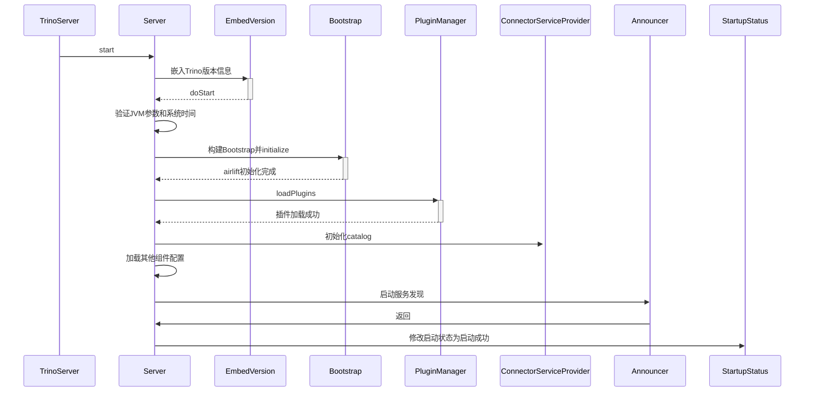
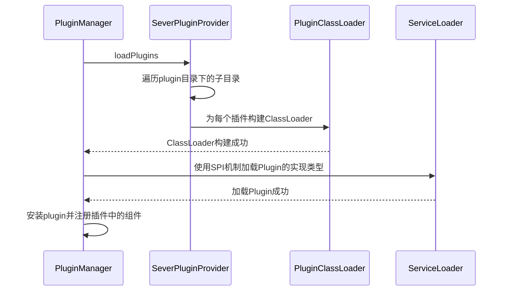
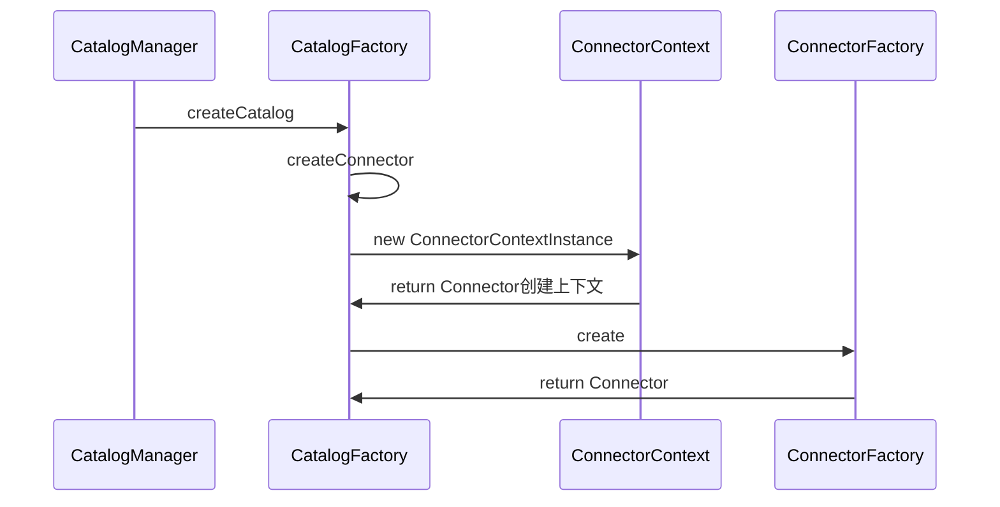
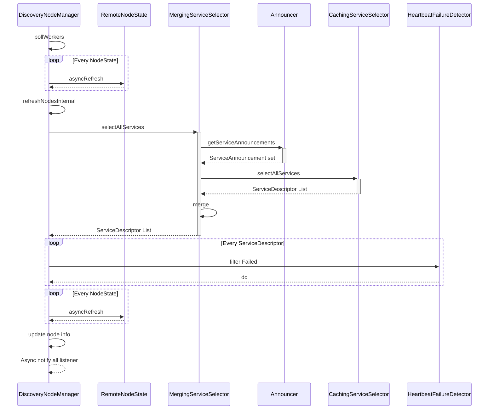

# Trino源码学习-Trino启动

本篇文章开始，我们将进行Trino的源码分析，一切还是从启动开始看起。

<!--more-->

## 启动流程



### EmbedVersion

EmbedVersion会动态生成一个类，类名会带上当前的版本:

- DevelopmentServer是dev
- TrinoServer是Jar包中`META-INF/MANIFEST.MF`文件里的`Implementation-Version`属性

生成的类是Runnable, Callable 的包装类，代码结构如下:

```java
package io.trino.$gen;

import java.util.concurrent.Callable;

public final class Trino_dev____20230412_024612_1 implements Runnable, Callable 
{
    private Runnable runnable;
    private Callable callable;

    public Trino_dev____20230412_024612_1(Runnable runnable) {
        this.runnable = runnable;
    }

    public void run() {
        this.runnable.run();
    }

    public Trino_dev____20230412_024612_1(Callable callable) {
        this.callable = callable;
    }

    public Object call() {
        return this.callable.call();
    }
}
```

### BootStrap

Trino使用Airlift框架，所以整个系统是通过BootStrap启动起来的。这里就不赘述了，可以查看前面的Airlift源码分析。

### PluginManager

在查看Plugin加载的源码前，我们先回顾下trino server的代码结构:

```sh
.
├── bin
├── lib # 存放Trino 的 jar
└── plugin
    └── tpch # 存放tpch 插件的 jar 
```

PluginManager加载插件的时序图如下:



> 在PluginManager installPlugin的过程中，会注册ConnectorFactory。后面会在Catalog初始化中使用。

### Catalog

Catalog通过CatalogManagerModule配置。

```java
public class CatalogManagerModule
        extends AbstractConfigurationAwareModule
{
    @Override
    protected void setup(Binder binder)
    {
        binder.bind(DefaultCatalogFactory.class).in(Scopes.SINGLETON);
        binder.bind(LazyCatalogFactory.class).in(Scopes.SINGLETON);
        binder.bind(CatalogFactory.class).to(LazyCatalogFactory.class).in(Scopes.SINGLETON);

        CatalogManagerConfig config = buildConfigObject(CatalogManagerConfig.class);
        switch (config.getCatalogMangerKind()) {
            case STATIC -> install(new StaticCatalogManagerModule());
            case DYNAMIC -> install(new DynamicCatalogManagerModule());
        }

        install(new CatalogServiceProviderModule());
    }
}
```

有上面可知CatalogManager 有两类:
- Static(默认): Catalog是静态的，修改需重启服务
- Dynamic: 支持动态的Catalog管理

我们先来看下StaticCatalogManager的逻辑:

- 初始化实例
    - 注入StaticCatalogManagerConfig配置和CatalogFactory
    - 从配置中获取catalog目录地址，默认是`etc/catalog/`目录
    - 遍历目录获取所有Properties文件,文件名就是catalog名(`system`被用作内部使用,不能使用)
    - 过滤所有禁用的catalog，然后将所有catalog配置保存
- loadInitialCatalogs(Server启动时触发)
    - 对于所有catalog配置，使用catalogFactory(由plugin加载)创建catalogConnector
    - 将创建的catalogConnector存储在内部的ConcurrentMap中
- stop(生命周期方法)
    - 关闭所有catalogConnector

StaticCatalogManager的逻辑很简单。下面我们来看下DynamicCatalogManager的逻辑。

```java
public class DynamicCatalogManagerModule
        extends AbstractConfigurationAwareModule
{
    @Override
    protected void setup(Binder binder)
    {
        if (buildConfigObject(ServerConfig.class).isCoordinator()) {
            binder.bind(CoordinatorDynamicCatalogManager.class).in(Scopes.SINGLETON);
            CatalogStoreConfig config = buildConfigObject(CatalogStoreConfig.class);
            switch (config.getCatalogStoreKind()) {
                case NONE -> binder.bind(CatalogStore.class).toInstance(NO_STORED_CATALOGS);
                case FILE -> {
                    configBinder(binder).bindConfig(StaticCatalogManagerConfig.class);
                    binder.bind(CatalogStore.class).to(FileCatalogStore.class).in(Scopes.SINGLETON);
                }
            }
            binder.bind(ConnectorServicesProvider.class).to(CoordinatorDynamicCatalogManager.class).in(Scopes.SINGLETON);
            binder.bind(CatalogManager.class).to(CoordinatorDynamicCatalogManager.class).in(Scopes.SINGLETON);
            binder.bind(CoordinatorLazyRegister.class).asEagerSingleton();
        }
        else {
            binder.bind(WorkerDynamicCatalogManager.class).in(Scopes.SINGLETON);
            binder.bind(ConnectorServicesProvider.class).to(WorkerDynamicCatalogManager.class).in(Scopes.SINGLETON);
            // catalog manager is not registered on worker
            binder.bind(WorkerLazyRegister.class).asEagerSingleton();
        }
    }
    ...
}
```

DynamicCatalogManager有两种:

- CoordinatorDynamicCatalogManager
- WorkerDynamicCatalogManager

根据节点的角色是Coordinator还是Worker分别初始化。

- CoordinatorDynamicCatalogManager
    - 初始化时注入CatalogStore和catalogFactory
    - 从注入的CatalogStore中获取catalog配置信息。
    - loadInitialCatalogs时，对于CatalogStore中的所有catalog配置，使用catalogFactory(由plugin加载)创建catalogConnector，然后将创建的catalogConnector存储在内部的ConcurrentMap中。
    - 支持动态创建Catalog(createCatalog方法)
- WorkerDynamicCatalogManager
    - 初始化时注入catalogFactory
    - loadInitialCatalogs时什么都不做
    - 在执行任务时，会通过ensureCatalogsLoaded方法检查CatalogProperties有没有被加载，如果没有加载会通过catalogFactory创建catalogConnector，然后将创建的catalogConnector存储在内部的ConcurrentMap中。(实现了从Coordinator中分发catalog配置)。

当然当前Dynamic catalog的实现还不是很完善。后续的进度可以通过[github issue](https://github.com/trinodb/trino/issues/12709)追踪。


### Connector

Connector的ConnectorFactory由Plugin加载并注册，然后在catalog加载时会创建对应的connector。



## 服务发现

Trino的服务发现是基于Airlift的服务发现。由于Trino只有一个Coordinator，默认是内嵌方式部署，服务发现会有单点问题，可以考虑使用独立部署。

### HeartbeatFailureDetector

除了Airlift的服务发现外，Trino还是实现了心跳检测器(HeartbeatFailureDetector)用作故障检测。

```java
// io.trino.server.CoordinatorModule
    @Override
    protected void setup(Binder binder)
    {
        ...
        
        // failure detector
        binder.install(new FailureDetectorModule());
        jaxrsBinder(binder).bind(NodeResource.class);
        jaxrsBinder(binder).bind(WorkerResource.class);
        httpClientBinder(binder).bindHttpClient("workerInfo", ForWorkerInfo.class);
        
        ...
    }

// io.trino.failuredetector.FailureDetectorModule
public class FailureDetectorModule
        implements Module
{
    @Override
    public void configure(Binder binder)
    {
        httpClientBinder(binder)
                .bindHttpClient("failure-detector", ForFailureDetector.class)
                .withTracing();

        configBinder(binder).bindConfig(FailureDetectorConfig.class); // 获取健康检查相关配置

        binder.bind(HeartbeatFailureDetector.class).in(Scopes.SINGLETON);

        binder.bind(FailureDetector.class)
                .to(HeartbeatFailureDetector.class)
                .in(Scopes.SINGLETON);

        ExportBinder.newExporter(binder)
                .export(HeartbeatFailureDetector.class)
                .withGeneratedName();
    }
}
```

FailureDetector 主要是定义了状态的一些枚举，具体健康检查是在 HeartbeatFailureDetector 中。HeartbeatFailureDetector 会以一定的间隔向 worker nodes 发送 HEAD 请求来进行健康检查。

```java
// io.trino.failuredetector
public class HeartbeatFailureDetector
        implements FailureDetector
{
    ...
    private class MonitoringTask
    {
        ...
        private void ping()
        {
            try {
                stats.recordStart();
                httpClient.executeAsync(prepareHead().setUri(uri).build(), new ResponseHandler<Object, Exception>(){...};
            }
            catch(...)
        }
    }
    ...
}
```

默认情况下，健康检查的间隔是500ms, 1分钟的失败率超过0.1就视为异常，这些都写在 FailureDetectorConfig 配置中了。

```java
public class FailureDetectorConfig
{
    private boolean enabled = true;
    private double failureRatioThreshold = 0.1; // ~6secs of failures, given default setting of heartbeatInterval = 500ms
    private Duration heartbeatInterval = new Duration(500, TimeUnit.MILLISECONDS);
    private Duration warmupInterval = new Duration(5, TimeUnit.SECONDS);
    private Duration expirationGraceInterval = new Duration(10, TimeUnit.MINUTES);
    
    ...
}
```

判断是否出现异常的逻辑

```java
private synchronized void updateState()
{
    // is this an over/under transition?
    if (stats.getRecentFailureRatio() > failureRatioThreshold) {
        successTransitionTimestamp = null;
    }
    else if (successTransitionTimestamp == null) {
        successTransitionTimestamp = System.nanoTime();
    }
}

...

public double getRecentFailureRatio()
{
    return recentFailures.getCount() / recentRequests.getCount();
}
```

### DiscoveryNodeManager

在 DiscoveryNodeManager 类中实现了管理 Coordinator 使用的 worker 节点列表。DiscoveryNodeManager 每 5 秒运行一次 pollWorkers 来更新节点列表和每个节点的状态。

```java
//ServerMainModule中会绑定DiscoveryNodeManager

// io.trino.metadata.DiscoveryNodeManager
@PostConstruct
public void startPollingNodeStates()
{
    nodeStateUpdateExecutor.scheduleWithFixedDelay(() -> {
        try {
            pollWorkers();
        }
        catch (Exception e) {
            log.error(e, "Error polling state of nodes");
        }
    }, 5, 5, TimeUnit.SECONDS);
    pollWorkers();
}
```

pollWorkers的流程

```java
// io.trino.metadata.DiscoveryNodeManager

// 由一个ConcurrentHashMap来维护集群中所有node的状态
// RemoteNodeState类中主要有2个成员方法，获得节点状态getNodeState，异步刷新asyncRefresh，
private final ConcurrentHashMap<String, RemoteNodeState> nodeStates = new ConcurrentHashMap<>();

private void pollWorkers()
{
    // 构建一个节点集合，活跃宕机的都收集了
    AllNodes allNodes = getAllNodes();
    Set<InternalNode> aliveNodes = ImmutableSet.<InternalNode>builder()
            .addAll(allNodes.getActiveNodes())
            .addAll(allNodes.getShuttingDownNodes())
            .build();
            
    // 获得活跃节点的id
    ImmutableSet<String> aliveNodeIds = aliveNodes.stream()
            .map(InternalNode::getNodeIdentifier)
            .collect(toImmutableSet());
    
    // 删除不存在的节点，这里对两个集合做差集。
    // Remove nodes that don't exist anymore
    // Make a copy to materialize the set difference
    Set<String> deadNodes = difference(nodeStates.keySet(), aliveNodeIds).immutableCopy();
    nodeStates.keySet().removeAll(deadNodes);
    
    // 把新的节点又添加回去
    // Add new nodes
    for (InternalNode node : aliveNodes) {
        nodeStates.putIfAbsent(node.getNodeIdentifier(),
                new RemoteNodeState(httpClient, uriBuilderFrom(node.getInternalUri()).appendPath("/v1/info/state").build()));
    }
    
    // 开始刷新，更新每个节点的状态
    nodeStates.values().forEach(RemoteNodeState::asyncRefresh);
    
    // 刷新内部节点，首先会打印一些日志来显示不活跃的节点，然后使用当前新的节点状态等信息，活跃、非活跃、宕机、协调组成新的allNode信息
    refreshNodesInternal();
}
```

pollWorkers的时序逻辑如下:



当先前注册的节点消失时，DiscoveryNodeManager 会将以前的活动节点丢失记录到日志。这种情况，会有以下几种可能性：

- discovery server 已经超过 30 秒没有收到来自 Worker 的 PUT 请求。
- Worker 节点最后一分钟健康检查失败的概率超过 10%

在第一种情况下，应该检查 Coordinator 的 http-request.log，看看是否有worker节点对/v1/announcement/{node_id}的请求。如果没有来自该 Worker 节点的请求日志，则 Worker 节点很可能已经出现了问题。第二种情况，可以查看 Worker 节点的 http-request.log，看是否有HEAD /的请求。

