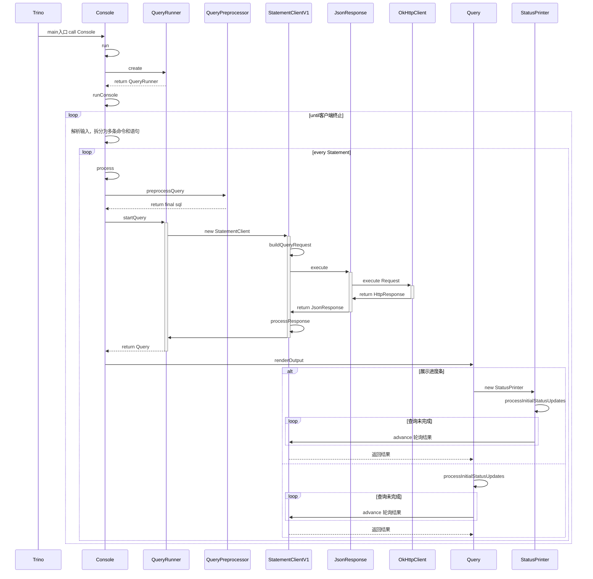
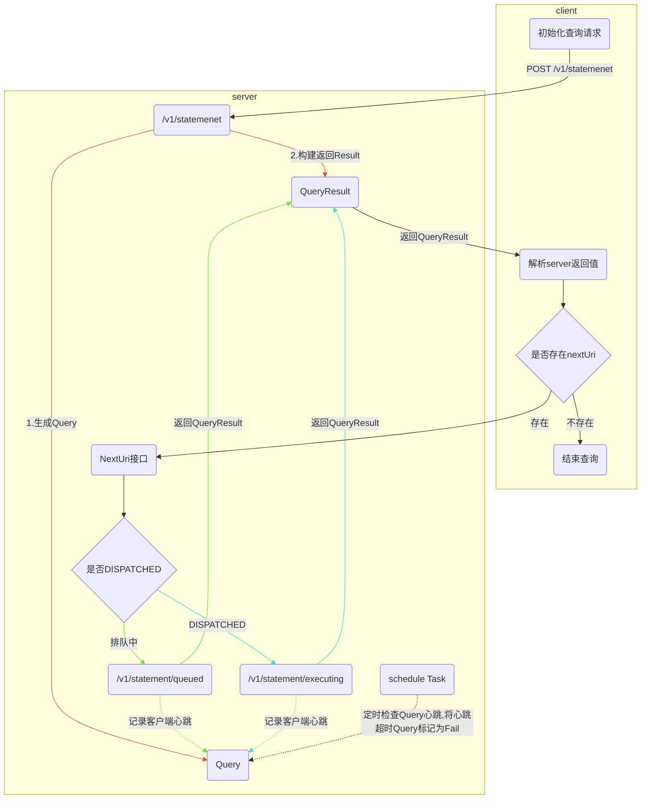

# Trino源码学习-查询提交

[上篇](/posts/2023/01/5707b8da/)介绍了Trino的启动流程，这篇我们来学习下查询提交的流程。

<!--more-->

## 从客户端提交开始

通常来说，向Trino提交查询可以通过两种方式: JDBC或者是Trino-Cli。本节将对Trino-Cli进行分析。

首先Trino-Cli是一个可执行jar包，因此我们可以从pom文件中找到main-class的定义:`io.trino.cli.Trino`。这也就是Trino-Cli的启动入口。下面是客户端提交查询的时序图:



结合代码可以发现，客户端提交查询分为两个步骤:

1. 初次提交查询。客户端将查询构建成post请求，通过StatementClientV1发送到Coordinator的`/v1/statement`接口。
2. 轮询查询状态直至查询结束。如果服务端查询没有结束，会进行轮询(processInitialStatusUpdates)，轮询通过StatementClientV1的advance方法获取结果。advance每次会获取上次返回值中的nextUri，向该地址发送GET请求。


## 服务端Restful入口

前面说了客户端会将查询提交到Coordinator的`/v1/statement`接口。

每个Coordinator启动时，会加载CoordinatorModule。

```java
public class CoordinatorModule
        extends AbstractConfigurationAwareModule
{
    @Override
    protected void setup(Binder binder)
    {
        install(new WebUiModule());

        // coordinator announcement
        discoveryBinder(binder).bindHttpAnnouncement("trino-coordinator");

        // statement resource
        jsonCodecBinder(binder).bindJsonCodec(TaskInfo.class);
        jaxrsBinder(binder).bind(QueuedStatementResource.class);
        jaxrsBinder(binder).bind(ExecutingStatementResource.class);
        ... ...
    }
}
```
- QueuedStatementResource提供的接口:
  - 提交查询
  - 获取排队查询状态
  - cancel查询
- ExecutingStatementResource提供的接口:
  - 获取运行中的结果(轮询)
  - cancel查询
  - partialCancel，终止查询stage


CoordinatorModule中会绑定QueuedStatementResource和ExecutingStatementResource。而QueuedStatementResource就是处理我们上面说的接口的类。

```java
//  io.trino.dispatcher.QueuedStatementResource
    @ResourceSecurity(AUTHENTICATED_USER)
    @POST
    @Produces(APPLICATION_JSON)
    public Response postStatement(
            String statement,
            @Context HttpServletRequest servletRequest,
            @Context HttpHeaders httpHeaders,
            @Context UriInfo uriInfo)
    {
        if (isNullOrEmpty(statement)) {
            throw badRequest(BAD_REQUEST, "SQL statement is empty");
        }

        Query query = registerQuery(statement, servletRequest, httpHeaders);

        return createQueryResultsResponse(query.getQueryResults(query.getLastToken(), uriInfo));
    }
    // 注册查询
    private Query registerQuery(String statement, HttpServletRequest servletRequest, HttpHeaders httpHeaders)
    {
        //... ...
        MultivaluedMap<String, String> headers = httpHeaders.getRequestHeaders();
        // 创建查询Session
        SessionContext sessionContext = sessionContextFactory.createSessionContext(headers, alternateHeaderName, remoteAddress, identity);
        // 初始化Query
        Query query = new Query(statement, sessionContext, dispatchManager, queryInfoUrlFactory);
        queryManager.registerQuery(query);
        // let authentication filter know that identity lifecycle has been handed off
        servletRequest.setAttribute(AUTHENTICATED_IDENTITY, null);
        return query;
    }
```

此时，服务端已经生成了一个Query,且将Query放到了`io.trino.dispatcher.queryManager`中。在返回值QueryResult中会包含几个关键信息:

1. queryId: 例如`20230414_061323_00001_m4k5f`。
2. infoUri: 例如`http://localhost:8080/ui/query.html?20230414_061323_00001_m4k5f`
3. nextUri: 例如`http://localhost:8080/v1/statement/queued/20230414_061323_00001_m4k5f/yb95760d187a727ebe067670fcfbdc1a98c8371fe/1`
4. state: 例如`QUEUED`

注意，此时返回后，查询会处于排队状态。然后客户端会对nextUri发起GET请求。

```java
//  io.trino.dispatcher.QueuedStatementResource
    @ResourceSecurity(PUBLIC)
    @GET
    @Path("queued/{queryId}/{slug}/{token}")
    @Produces(APPLICATION_JSON)
    public void getStatus(
            @PathParam("queryId") QueryId queryId,
            @PathParam("slug") String slug,
            @PathParam("token") long token,
            @QueryParam("maxWait") Duration maxWait, // 查询最大等待时间
            @Context UriInfo uriInfo,
            @Suspended AsyncResponse asyncResponse)
    {
        // 从queryManager中获取Query信息
        Query query = getQuery(queryId, slug, token);
        // 获取query的状态
        ListenableFuture<Response> future = getStatus(query, token, maxWait, uriInfo);
        // 使用 DispatchExecutor中的Executor异步处理response
        bindAsyncResponse(asyncResponse, future, responseExecutor);
    }
    
    private ListenableFuture<Response> getStatus(Query query, long token, Duration maxWait, UriInfo uriInfo)
    {
        long waitMillis = WAIT_ORDERING.min(MAX_WAIT_TIME, maxWait).toMillis();

        return FluentFuture.from(query.waitForDispatched())
                // wait for query to be dispatched, up to the wait timeout
                .withTimeout(waitMillis, MILLISECONDS, timeoutExecutor)
                .catching(TimeoutException.class, ignored -> null, directExecutor())
                // when state changes, fetch the next result
                .transform(ignored -> query.getQueryResults(token, uriInfo), responseExecutor)
                .transform(this::createQueryResultsResponse, directExecutor());
    }
```

在 Query的waitForDispatched方法中。会触发Query的真正提交。

```java
//  io.trino.dispatcher.QueuedStatementResource.Query
private ListenableFuture<Void> waitForDispatched()
{
  submitIfNeeded();
  if (!creationFuture.isDone()) {
    return nonCancellationPropagating(creationFuture);
  }
  // otherwise, wait for the query to finish
  // submitIfNeeded 不成功下，会继续等待 Dispatch
  return dispatchManager.waitForDispatched(queryId);
}

private void submitIfNeeded()
{
  // submissionGate 是个flag 表示Query有没有被提交
  if (submissionGate.compareAndSet(null, true)) {
    // 如果没有被提交过，会设置为true。并执行dispatch
    // 此时creationFuture is done
    creationFuture.setFuture(dispatchManager.createQuery(queryId, slug, sessionContext, query));
  }
}
// io.trino.dispatcher.DispatchManager
public ListenableFuture<Void> waitForDispatched(QueryId queryId)
{
  return queryTracker.tryGetQuery(queryId)
    .map(dispatchQuery -> {
      dispatchQuery.recordHeartbeat(); // 此处记录了心跳
      return dispatchQuery.getDispatchedFuture();
    })
    .orElseGet(Futures::immediateVoidFuture);
}
```

我们再回过头来看下getQueryResults方法:

```java
//  io.trino.dispatcher.QueuedStatementResource.Query
public QueryResults getQueryResults(long token, UriInfo uriInfo)
{
  ... ...
  // if query submission has not finished, return simple empty result
  if (!creationFuture.isDone()) {
    return createQueryResults(
      token + 1,uriInfo, DispatchInfo.queued(NO_DURATION, NO_DURATION));
  }
  DispatchInfo dispatchInfo = dispatchManager.getDispatchInfo(queryId)
    // query should always be found, but it may have just been determined to be abandoned
    .orElseThrow(() -> new WebApplicationException(Response
    .status(NOT_FOUND)
    .build()));
  return createQueryResults(token + 1, uriInfo, dispatchInfo);
}
private QueryResults createQueryResults(long token, UriInfo uriInfo, DispatchInfo dispatchInfo)
{
  URI nextUri = getNextUri(token, uriInfo, dispatchInfo); // 生成下次轮询的Uri
  ... ...
}

private URI getNextUri(long token, UriInfo uriInfo, DispatchInfo dispatchInfo)
{
  // if failed, query is complete
  if (dispatchInfo.getFailureInfo().isPresent()) {
    return null;
  }
  // if dispatched, redirect to new uri
  return dispatchInfo.getCoordinatorLocation()
    .map(coordinatorLocation -> getRedirectUri(coordinatorLocation, uriInfo))
    .orElseGet(() -> getQueuedUri(queryId, slug, token, uriInfo));
}
private URI getRedirectUri(CoordinatorLocation coordinatorLocation, UriInfo uriInfo)
{
  URI coordinatorUri = coordinatorLocation.getUri(uriInfo);
  return UriBuilder.fromUri(coordinatorUri)
        .replacePath("/v1/statement/executing")
        .path(queryId.toString())
        .path(slug.makeSlug(EXECUTING_QUERY, 0))
        .path("0")
        .build();
  }
private static URI getQueuedUri(QueryId queryId, Slug slug, long token, UriInfo uriInfo)
{
  return uriInfo.getBaseUriBuilder()
      .replacePath("/v1/statement/queued/")
      .path(queryId.toString())
      .path(slug.makeSlug(QUEUED_QUERY, token))
      .path(String.valueOf(token))
      .replaceQuery("")
      .build();
  }
```

此时我们可以发现一个Query是分为三种不同状态的: QUEUED，DISPATCHED和DISPATCH_FAILED

1. 如果是QUEUED,返回的nextUri是`/v1/statement/queued/`
2. 如果是DISPATCHED，返回的nextUri是`/v1/statement/executing/`
3. 如果是DISPATCH_FAILED，不返回nextUri，表示查询完成

### 获取查询结果

当Query被提交后，轮询的地址会改为`/v1/statement/executing/{queryId}/{slug}/{token}`(ExecutingStatementResource)。ExecutingStatementResource使用asyncQueryResults方法获取最终结果。

```java
// io.trino.server.protocol.ExecutingStatementResource
private void asyncQueryResults(
            Query query,
            long token,
            Duration maxWait,
            DataSize targetResultSize,
            UriInfo uriInfo,
            AsyncResponse asyncResponse)
{
    // 带超时时间等待结果
    ListenableFuture<QueryResults> queryResultsFuture = query.waitForResults(token, uriInfo, wait, targetResultSize);
    // 构建Response
    ListenableFuture<Response> response = Futures.transform(queryResultsFuture, queryResults -> toResponse(query, queryResults), directExecutor());
    // 构建异步Response
    bindAsyncResponse(asyncResponse, response, responseExecutor);
}
// io.trino.server.protocol.Query
public synchronized ListenableFuture<QueryResults> waitForResults(long token, UriInfo uriInfo, Duration wait, DataSize targetResultSize)
{
    // before waiting, check if this request has already been processed and cached
    Optional<QueryResults> cachedResult = getCachedResult(token);
    if (cachedResult.isPresent()) {
        return immediateFuture(cachedResult.get());
    }

    // wait for a results data or query to finish, up to the wait timeout
    ListenableFuture<Void> futureStateChange = addTimeout(
            getFutureStateChange(),
            () -> null,
            wait,
            timeoutExecutor);

    // when state changes, fetch the next result
    // 当QueryState变化，或者Query中的exchange client已经打开在等待数据
    // 会触发getNextResult方法获取QueryResult
    return Futures.transform(futureStateChange, ignored -> getNextResult(token, uriInfo, targetResultSize), resultsProcessorExecutor);
}

private synchronized QueryResults getNextResult(long token, UriInfo uriInfo, DataSize targetResultSize)
{
    ... ...
    // 终结状态关闭 Exchange client
    closeExchangeIfNecessary(queryInfo);

    // fetch result data from exchange
    QueryResultRows resultRows = removePagesFromExchange(queryInfo, targetResultSize.toBytes());
    ... ...
  
    // advance next token only return a next url if
    // (1) the query is not done AND the query state is not FAILED
    // OR
    // (2) there is more data to send (due to buffering)
    // OR
    // (3) cached query result needs client acknowledgement to discard
    if (queryInfo.getState() != FAILED && (!queryInfo.isFinalQueryInfo() || !exchangeDataSource.isFinished() || (queryInfo.getOutputStage().isPresent() && !resultRows.isEmpty()))) {
        // 增加Token 下次继续轮询
        nextToken = OptionalLong.of(token + 1);
    }
    else {
        nextToken = OptionalLong.empty();
        // the client is not coming back, make sure the exchange is closed
        exchangeDataSource.close();
    }

    URI nextResultsUri = null;
    URI partialCancelUri = null;
    if (nextToken.isPresent()) {
        // 有nextToken的情况下，更新nextResultsUri
        long nextToken = this.nextToken.getAsLong();
        nextResultsUri = createNextResultsUri(uriInfo, nextToken);
        // 终止某个stage的url
        // /v1/statement/executing/partialCancel/{queryId}/{stage}/{slug}/{token}
        partialCancelUri = findCancelableLeafStage(queryInfo)
                .map(stage -> createPartialCancelUri(stage, uriInfo, nextToken))
                .orElse(null);
    }
    ... ...

    // 构建QueryResults
    QueryResults queryResults = new QueryResults(
            queryId.toString(),
            getQueryInfoUri(queryInfoUrl, queryId, uriInfo),
            partialCancelUri,
            nextResultsUri,
            resultRows.getColumns().orElse(null),
            resultRows.isEmpty() ? null : resultRows, // client excepts null that indicates "no data"
            toStatementStats(queryInfo),
            toQueryError(queryInfo, typeSerializationException),
            mappedCopy(queryInfo.getWarnings(), ProtocolUtil::toClientWarning),
            queryInfo.getUpdateType(),
            updateCount);
  ... ...

    return queryResults;
}
// 这是从Exchange中获取数据的方法
private synchronized QueryResultRows removePagesFromExchange(QueryInfo queryInfo, long targetResultBytes)
{
    if (!resultsConsumed && queryInfo.getOutputStage().isEmpty()) {
        return queryResultRowsBuilder(session)
                .withColumnsAndTypes(ImmutableList.of(), ImmutableList.of())
                .build();
    }
    // 尽可能的获取更多的page(不超过DESIRED_RESULT_BYTES)
    // 因为当Page被remove掉的时候，query状态会切换为Finished。
    // 所以此处在创建QueryResultRows时需要获取锁
    // 用来防止其他线程观察到状态变化, 从而导致最后的page丢失
    QueryResultRows.Builder resultBuilder = queryResultRowsBuilder(session)
            // Intercept serialization exceptions and fail query if it's still possible.
            // Put serialization exception aside to return failed query result.
            .withExceptionConsumer(this::handleSerializationException)
            .withColumnsAndTypes(columns, types);

    try {
        long bytes = 0;
        while (bytes < targetResultBytes) {
            // 循环拉取数据
            Slice serializedPage = exchangeDataSource.pollPage();
            if (serializedPage == null) {
                break;
            }

            Page page = serde.deserialize(serializedPage);
            bytes += page.getLogicalSizeInBytes();
            resultBuilder.addPage(page);
        }
        if (exchangeDataSource.isFinished()) {
            exchangeDataSource.close();
        }
    }
    catch (Throwable cause) {
        queryManager.failQuery(queryId, cause);
    }
    return resultBuilder.build();
}
```

### 交互流程

查询接口层交互流程



## 提交DispatchQuery 


### DispatchManager

下面来关注下DispatchManager的CreateQuery:

```java
// io.trino.dispatcher.DispatchManager
public ListenableFuture<Void> createQuery(QueryId queryId, Slug slug, SessionContext sessionContext, String query)
{
  requireNonNull(queryId, "queryId is null");
  requireNonNull(sessionContext, "sessionContext is null");
  requireNonNull(query, "query is null");
  checkArgument(!query.isEmpty(), "query must not be empty string");
  checkArgument(queryTracker.tryGetQuery(queryId).isEmpty(), "query %s already exists", queryId);

  // It is important to return a future implementation which ignores cancellation request.
  // Using NonCancellationPropagatingFuture is not enough; it does not propagate cancel to wrapped future
  // but it would still return true on call to isCancelled() after cancel() is called on it.
  DispatchQueryCreationFuture queryCreationFuture = new DispatchQueryCreationFuture();
  dispatchExecutor.execute(() -> {
      try {
          // 提交查询
          createQueryInternal(queryId, slug, sessionContext, query, resourceGroupManager);
      }
      finally {
         queryCreationFuture.set(null);
      }
  });
  return queryCreationFuture;
}
/**
  * Creates and registers a dispatch query with the query tracker.  This method will never fail to register a query with the query
  * tracker.  If an error occurs while creating a dispatch query, a failed dispatch will be created and registered.
  */
private <C> void createQueryInternal(QueryId queryId, Slug slug, SessionContext sessionContext, String query, ResourceGroupManager<C> resourceGroupManager)
{
  Session session = null;
  PreparedQuery preparedQuery = null;
  try {
      ... ...
      // decode session
      session = sessionSupplier.createSession(queryId, sessionContext);

      // check query execute permissions
      accessControl.checkCanExecuteQuery(sessionContext.getIdentity());

      // prepare query
      // 使用Parser将Query解析成Statement语法节点，并对于Execute类型的节点做验证
      preparedQuery = queryPreparer.prepareQuery(session, query);

      // select resource group
      Optional<String> queryType = getQueryType(preparedQuery.getStatement()).map(Enum::name);
      // 选择一个资源组用于执行Query,根据配置的group和selector进行match
      SelectionContext<C> selectionContext = resourceGroupManager.selectGroup(new SelectionCriteria(
        sessionContext.getIdentity().getPrincipal().isPresent(),
        sessionContext.getIdentity().getUser(),
        sessionContext.getIdentity().getGroups(),
        sessionContext.getSource(),
        sessionContext.getClientTags(),
        sessionContext.getResourceEstimates(),
        queryType));

      // apply system default session properties (does not override user set properties)
      session = sessionPropertyDefaults.newSessionWithDefaultProperties(session, queryType, selectionContext.getResourceGroupId());
      // 构造 LocalDispatchQuery
      DispatchQuery dispatchQuery = dispatchQueryFactory.createDispatchQuery(
                  session,
                  sessionContext.getTransactionId(),
                  query,
                  preparedQuery,
                  slug,
                  selectionContext.getResourceGroupId());
      // queryTracker中记录下查询的query
      boolean queryAdded = queryCreated(dispatchQuery);
      if (queryAdded && !dispatchQuery.isDone()) {
          try {
            // 此处使用resourceGroupManager提交查询
            resourceGroupManager.submit(dispatchQuery, selectionContext, dispatchExecutor);
          }
          catch (Throwable e) {
            // dispatch query has already been registered, so just fail it directly
            dispatchQuery.fail(e);
          }
      }
    }
    catch (Throwable throwable) {
    // creation must never fail, so register a failed query in this case
    if (session == null) {
      session = Session.builder(sessionPropertyManager)
              .setQueryId(queryId)
              .setIdentity(sessionContext.getIdentity())
              .setSource(sessionContext.getSource().orElse(null))
              .build();
            }
    Optional<String> preparedSql = Optional.ofNullable(preparedQuery).flatMap(PreparedQuery::getPrepareSql);
    DispatchQuery failedDispatchQuery = failedDispatchQueryFactory.createFailedDispatchQuery(session, query, preparedSql, Optional.empty(), throwable);
    queryCreated(failedDispatchQuery);
  }
}
```

createDispatchQuery方法中构造了QueryStateMachine，queryMonitor和queryExecutionFuture

```java
public DispatchQuery createDispatchQuery(
            Session session,
            Optional<TransactionId> existingTransactionId,
            String query,
            PreparedQuery preparedQuery,
            Slug slug,
            ResourceGroupId resourceGroup)
{
  WarningCollector warningCollector = warningCollectorFactory.create();
  // 此时状态机状态为QUEUED
  QueryStateMachine stateMachine = QueryStateMachine.begin(... ...);

  // It is important that `queryCreatedEvent` is called here. Moving it past the `executor.submit` below
  // can result in delivering query-created event after query analysis has already started.
  // That can result in misbehaviour of plugins called during analysis phase (e.g. access control auditing)
  // which depend on the contract that event was already delivered.
  //
  // Note that for immediate and in-order delivery of query events we depend on synchronous nature of
  // QueryMonitor and EventListenerManager.
  queryMonitor.queryCreatedEvent(stateMachine.getBasicQueryInfo(Optional.empty()));
  // Query执行future
  ListenableFuture<QueryExecution> queryExecutionFuture = executor.submit(() -> {
    QueryExecutionFactory<?> queryExecutionFactory = executionFactories.get(preparedQuery.getStatement().getClass());
    // 根据不同的语句获取不同的工厂
    if (queryExecutionFactory == null) {
      throw new TrinoException(NOT_SUPPORTED, "Unsupported statement type: " + preparedQuery.getStatement().getClass().getSimpleName());
    }

    try {
      return queryExecutionFactory.createQueryExecution(preparedQuery, stateMachine, slug, warningCollector);
    }
    catch (Throwable e) {
      if (e instanceof Error) {
        if (e instanceof StackOverflowError) {
          log.error(e, "Unhandled StackOverFlowError; should be handled earlier; to investigate full stacktrace you may need to enable -XX:MaxJavaStackTraceDepth=0 JVM flag");
        }
        else {
          log.error(e, "Unhandled Error");
        }
        // wrapping as RuntimeException to guard us from problem that code downstream which investigates queryExecutionFuture may not necessarily handle
        // Error subclass of Throwable well.
        RuntimeException wrappedError = new RuntimeException(e);
        stateMachine.transitionToFailed(wrappedError);
        throw wrappedError;
      }
      stateMachine.transitionToFailed(e);
      throw e;
    }
  });

  return new LocalDispatchQuery(
                stateMachine,
                queryExecutionFuture,
                queryMonitor,
                clusterSizeMonitor,
                executor,
                queryManager::createQuery // QueryExecution的消费者，内部调用queryExecution.start();
    );
}
```
#### QueryTracker

上面代码中创建Query时会将Query加入到QueryTracker。我们来看下QueryTracker有什么作用。QueryTracker中会存储dispatched的Query(存储在queries中)和expired的Query(存储在expirationQueue中):

```java
private final ConcurrentMap<QueryId, T> queries = new ConcurrentHashMap<>();
private final Queue<T> expirationQueue = new LinkedBlockingQueue<>();
```

当dispatchManager执行生命周期start方法时，会调用QueryTracker的Start方法:

```java
public synchronized void start(){
  checkState(backgroundTask == null, "QueryTracker already started");
  backgroundTask = queryManagementExecutor.scheduleWithFixedDelay(() -> {
    try {
      failAbandonedQueries(); // 客户端心跳超时就认为是Abandoned，将Query设置为Fail
    }
    catch (Throwable e) {
      log.error(e, "Error cancelling abandoned queries");
    }

    try {
      enforceTimeLimits(); //将所有执行超时的Query设置为Fail
    }
    catch (Throwable e) {
      log.error(e, "Error enforcing query timeout limits");
    }

    try {
      removeExpiredQueries(); // 当完成的Query存放条数超过上限且，Query完成时间达到阈值，删除历史数据
    }
    catch (Throwable e) {
      log.error(e, "Error removing expired queries");
    }

    try {
      pruneExpiredQueries(); // 减少ExpiredQueries的存储信息
    }
    catch (Throwable e) {
      log.error(e, "Error pruning expired queries");
    }
    }, 1, 1, TimeUnit.SECONDS); // 1秒执行一次
    }
```

### ResourceGroup

DispatchQuery的提交是通过ResourceGroupManager的submit方法进行的。

```java
// io.trino.execution.resourcegroups.InternalResourceGroupManager
@Override
public void submit(ManagedQueryExecution queryExecution, SelectionContext<C> selectionContext, Executor executor)
{
  checkState(configurationManager.get() != null, "configurationManager not set");
  // InternalResourceGroupManager 会缓存ResourceGroup，如果groupId不存在，此处会创建一个新的
  createGroupIfNecessary(selectionContext, executor);
  // 使用ResourceGroup的run方法执行查询
  groups.get(selectionContext.getResourceGroupId()).run(queryExecution);
}
```

在ResourceGroup的run方法中会先判断当前查询能不能直接查询或者入队。

```java
public void run(ManagedQueryExecution query)
{
  // 这里的root是每个group树的根节点
  synchronized (root) {
    if (!subGroups.isEmpty()) {
      throw new TrinoException(INVALID_RESOURCE_GROUP, format("Cannot add queries to %s. It is not a leaf group.", id));
    }
    // Check all ancestors for capacity
    InternalResourceGroup group = this;
    boolean canQueue = true;
    boolean canRun = true;
    while (true) {
      // 检查是否运行和排队，从子group一路上溯检查
      canQueue = canQueue && group.canQueueMore(); // 检测自己和后代排查长度
      canRun = canRun && group.canRunMore();// 检测自己和后代运行队列长度，cpu和memory使用
      if (group.parent.isEmpty()) {
          break;
      }
      group = group.parent.get();
    }
    if (!canQueue && !canRun) {
      query.fail(new QueryQueueFullException(id));
      return;
    }
    if (canRun) {
      startInBackground(query); // 如果资源满足就后台运行
    }
    else {
      enqueueQuery(query); // 可以排队，就入队
    }
    query.addStateChangeListener(state -> {
      if (state.isDone()) {
        queryFinished(query); //触发finish回调，注意这个方法
      }
    });
  }
}
```

当资源满足时，通过StartInBackground方法运行:

```java
private void startInBackground(ManagedQueryExecution query)
{
// 锁重入检测
checkState(Thread.holdsLock(root), "Must hold lock to start a query");
  synchronized (root) {
    // 将查询放入 runningQueries Map中,初始化资源cpu和memory使用
    runningQueries.put(query, new ResourceUsage(0, 0));
    InternalResourceGroup group = this;
    while (group.parent.isPresent()) {
        group.parent.get().descendantRunningQueries++; // 增加父group的后代运行查询数
        group.parent.get().dirtySubGroups.add(group); // 将group加到有sql运行的dirtySubGroups
        group = group.parent.get();
    }
    updateEligibility(); // 更新队列和上游节点的资格
    executor.execute(query::startWaitingForResources); // 异步执行查询，query状态改为等待资源
  }
}
```

当资源不够，但是排队长度还够的情况下，查询会进入资源组的排队队列:

```java
private void enqueueQuery(ManagedQueryExecution query)
{
  checkState(Thread.holdsLock(root), "Must hold lock to enqueue a query");
  synchronized (root) {
    // 将查询放入优先级队列排队
    queuedQueries.addOrUpdate(query, getQueryPriority(query.getSession()));
    InternalResourceGroup group = this;
    while (group.parent.isPresent()) {
      group.parent.get().descendantQueuedQueries++; // 增加父group的后代排队查询数
      group = group.parent.get();
    }
    updateEligibility();// 更新队列和上游节点的资格
  }
}
```

那么什么时候开始执行排队的查询呢？在QueryFinish()方法中最后会执行root.triggerProcessQueuedQueries();

```java
public void triggerProcessQueuedQueries()
{
  updateGroupsAndProcessQueuedQueries();
}
public void updateGroupsAndProcessQueuedQueries()
{
  synchronized (root) {
    updateResourceUsageAndGetDelta();

    while (internalStartNext()) {
      // start all the queries we can
    }
  }
}
```

在internalStartNext方法中会尽量启动能执行的查询。

```java
protected boolean internalStartNext()
{
  checkState(Thread.holdsLock(root), "Must hold lock to find next query");
  synchronized (root) {
    if (!canRunMore()) {
      return false;
    }
    ManagedQueryExecution query = queuedQueries.poll();
    if (query != null) {
      startInBackground(query); // 启动查询
      return true;
    }

    // Remove even if the sub group still has queued queries, so that it goes to the back of the queue
    InternalResourceGroup subGroup = eligibleSubGroups.poll();
    if (subGroup == null) {
      return false;
    }
    boolean started = subGroup.internalStartNext(); // 启动子group的query
    checkState(started, "Eligible sub group had no queries to run");

    long currentTime = System.currentTimeMillis();
    if (lastStartMillis != 0) {
      timeBetweenStartsSec.update(Math.max(0, (currentTime - lastStartMillis) / 1000));
    }
    lastStartMillis = currentTime;

    descendantQueuedQueries--;
    // Don't call updateEligibility here, as we're in a recursive call, and don't want to repeatedly update our ancestors.
    if (subGroup.isEligibleToStartNext()) { // 如果subGroup还能继续运行Query，再次加入到eligibleSubGroups
      addOrUpdateSubGroup(subGroup); 
    }
    return true;
  }
}
```

### LocalDispatchQuery

从上面InternalResourceGroup.startInBackground()方法代码可知，在资源组提交DispatchQuery后，会在后台线程中调用LocalDispatchQuery.startWaitingForResources()方法。


```java
// io.trino.dispatcher.LocalDispatchQuery
// startWaitingForResources => waitForMinimumWorkers =>startExecution
@Override
public void startWaitingForResources()
{
  // 查询状态机切换到 WAITING_FOR_RESOURCES
  if (stateMachine.transitionToWaitingForResources()) {
    waitForMinimumWorkers();
  }
}

private void waitForMinimumWorkers()
{
  // wait for query execution to finish construction
  // 当queryExecution创建成功后触发回调
  addSuccessCallback(queryExecutionFuture, queryExecution -> {
    Session session = stateMachine.getSession();
    int executionMinCount = 1; // always wait for 1 node to be up
    if (queryExecution.shouldWaitForMinWorkers()) {
      executionMinCount = getRequiredWorkers(session);
    }
    ListenableFuture<Void> minimumWorkerFuture = clusterSizeMonitor.waitForMinimumWorkers(executionMinCount, getRequiredWorkersMaxWait(session));
    // when worker requirement is met, start the execution
    addSuccessCallback(minimumWorkerFuture, () -> startExecution(queryExecution));
    addExceptionCallback(minimumWorkerFuture, throwable -> queryExecutor.execute(() -> stateMachine.transitionToFailed(throwable)));

    // cancel minimumWorkerFuture if query fails for some reason or is cancelled by user
    stateMachine.addStateChangeListener(state -> {
      if (state.isDone()) {
        minimumWorkerFuture.cancel(true);
      }
    });
  });
}
// 开始执行查询
private void startExecution(QueryExecution queryExecution)
{
  queryExecutor.execute(() -> {
    // 改变状态为DISPATCHING
    if (stateMachine.transitionToDispatching()) {
      try {
        querySubmitter.accept(queryExecution); 
        // querySubmitter -> queryManager::createQuery -> queryExecution.start
        if (notificationSentOrGuaranteed.compareAndSet(false, true)) {
          queryExecution.addFinalQueryInfoListener(queryMonitor::queryCompletedEvent);
        }
      }
      catch (Throwable t) {
        // this should never happen but be safe
        stateMachine.transitionToFailed(t);
        log.error(t, "query submitter threw exception");
        throw t;
      }
      finally {
        submitted.set(null); // SettableFuture,通知状态变更
      }
    }
  });
}
```

querySubmitter实质上是queryManager::createQuery

### QueryExecution

queryManager::createQuery中调用了queryExecution.start(). queryExecution表示一次SQL查询执行，用于启动，停止，管理查询和统计查询相关信心。在queryExecution.start()后，查询开始执行，执行相关源码分析将在后面的文章中进行分析。

```java
// io.trino.execution.SqlQueryManager
@Override
public void createQuery(QueryExecution queryExecution)
{
  requireNonNull(queryExecution, "queryExecution is null");

  if (!queryTracker.addQuery(queryExecution)) {
    throw new TrinoException(GENERIC_INTERNAL_ERROR, format("Query %s already registered", queryExecution.getQueryId()));
  }

  queryExecution.addFinalQueryInfoListener(finalQueryInfo -> {
    // execution MUST be added to the expiration queue or there will be a leak
    queryTracker.expireQuery(queryExecution.getQueryId());
  });

  queryExecution.start(); // 执行查询
}
```

QueryExecution的创建是通过queryExecutionFactory.createQueryExecution方法实现的。在QueryExecutionFactoryModule中定义了不同Statement子类所对应的QueryExecutionFactory:

- DataDefinitionExecutionFactory: DDL命令对应的Factory
- SqlQueryExecutionFactory: 其他命令的Factory

> Statement子类命令存储在io.trino.util.StatementUtils#STATEMENT_QUERY_TYPES中。

