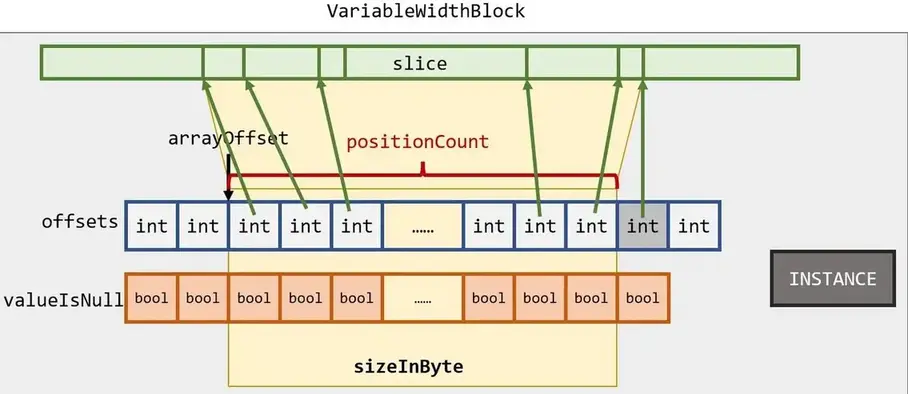
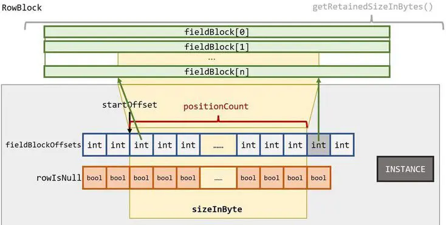

# Trino源码学习-Page数据结构

本篇来看下在查询执行的过程中，底层的数据结构是什么样的。

<!--more-->

## Page

Trino中处理的最小数据单元是一个Page对象。

```java
public final class Page
{
    public static final int INSTANCE_SIZE = toIntExact(ClassLayout.parseClass(Page.class).instanceSize());
    private static final Block[] EMPTY_BLOCKS = new Block[0];
    private final Block[] blocks;
    // positionCount是指page中的数据行数
    private final int positionCount; 
    private volatile long sizeInBytes = -1;
    private volatile long retainedSizeInBytes = -1;
    private volatile long logicalSizeInBytes = -1;
    ... ...
}
```
一个Page对象中，有一组Block对象组成的数组，每一列对应一个Block，channelCount指的是一个Page中的Block数量，positionCount指的是Page中的数据行数，多个Block横切的一行是真实的一行数据, 一个Page表示的是二维表的多条记录。


### PageBuilder

Page在trino中通过PageBuilder构建。Page默认的最大大小是`PageBuilderStatus.DEFAULT_MAX_PAGE_SIZE_IN_BYTES = 1024*1024`(1M).

### 序列化

Page 有 header meta 信息用于标记长度等信息，用于反序列化的时候识别单个 Page 的长度。在序列化多个 Page 的时候，并没有记录 Page 的个数，需要逐个 Page 反序列化返回，直到读完所有数据。

Page 的序列化格式分为两个部分：Header 和 Block Data，下面分别介绍其格式。

Header:

|positionCount|codec marker|UncompressedSize|Size|checksum|
|:---|:---|:---|:---|:---|
|int|byte|int|int|long|

Block Data:

|block count|BLOCK 0|BLOCK 1|…|
|:---|:---|:---|:---|
|int|Block|Block|	…|

- Page 支持对 block data 的部分进行压缩，支持多种算法：lz4、snappy、gzip、zstd
- Header 中有 UncompressedSize 表示未压缩前的大小，这个主要是用于解压的时候使用，lz4 算法是需要知道未压缩大小的
- codec marker 是一个标记 byte，用 bit 的 0 和 1 来标记某个信息是否存在，用于标记三个信息：是否压缩、是否加密、是否有 checksum，代码 PageCodecMarker
- Page 的 header 信息参考代码 PagesSerdeUtils.writeSerializedPageMetadata

## Block

Block在Trino中以接口形式出现，Trino定义了几个基本的实现类， 作为基础的Block结构，然后再定义其他更加高层的Block结构，其内部是其他Block的组合。

Block基本实现类是指内部包含直接真实数据，不是以嵌套其他Block对象的形式出现的数据类型。其内部的数据以基本类型数组或者Slice对象出现。

Block的基本实现类有

- IntArrayBlock
- ShortArrayBlock
- ByteArrayBlock
- LongArrayBlock 
- Int96ArrayBlock
- Int128ArrayBlock
- VariableWidthBlock

### BlockBuilder

Block的构建是通过BlockBuilder完成，每种数据类型都有自己的BlockBuidler，例如LongArrayBlockBuidler, IntArrayBlockBuidler等，PageBuilder在构建的时候根据传入的types参数确认需要创建的BlockBuidler类型。

BlockBuilder在初始化的时候会通过PageBuilder计算自己的初始化空间大小，具体公式为

```java
min(DEFAULT_MAX_BLOCK_SIZE_IN_BYTES, maxBlockSizeInBytes)
// 其中参数maxBlockSizeInBytes为
maxBlockSizeInBytes = (int) (1.0 * DEFAULT_MAX_PAGE_SIZE_IN_BYTES / types.size());
```

有了大小，在开辟具体空间的时候还是需要精确到大小，而根据类型的不同，估算方式也有差别，对于定长类型(例如Long/Int)而言，计算公式为

```java
expectedEntries = maxBlockSizeInBytes / fixedSize
```

对于varchar这种变长类型，由于不知道每次写入的大小，暂且预估为32bytes，后续写入的时候，再根据需要进行扩容。


### BlockEncoding

```java
public interface BlockEncoding
{
    String getName();
    Block readBlock(BlockEncodingSerde blockEncodingSerde, SliceInput input);
    void writeBlock(BlockEncodingSerde blockEncodingSerde, SliceOutput sliceOutput, Block block);
}
```

不同类型的 Block 都有其对应的BlockEncoding实现。

### IntArrayBlock

IntArrayBlock 内部以整型数组存放该Block的真实底层数据。

```java
public class IntArrayBlock implements Block
{
    private static final int INSTANCE_SIZE = toIntExact(ClassLayout.parseClass(IntArrayBlock.class).instanceSize());
    public static final int SIZE_IN_BYTES_PER_POSITION = Integer.BYTES + Byte.BYTES;
    // 偏移量
    private final int arrayOffset;
    // 长度
    private final int positionCount;
    @Nullable
    private final boolean[] valueIsNull;
    private final int[] values;
}
```

IntArrayBlock 的底层数据其实就是`int[] values` 和`boolean[] valueIsNull`这两个数组，这里`boolean[] valueIsNull`的出现是为了表示某个位置上的值是否为null，毕竟values 是一个基本类型数组，而不是包装类型Integer数组，所以还是需要有个额外的布尔类型数组表示某个位置是否是null。values 数组和 valueIsNull 数组的长度不一定相同，因为IntArrayBlock只会使用其中的一部分数据，即索引为`[arrayOffset, arrayOffset+positionCount]`的区域。所以这个Block在计算其底层数据大小（sizeInByte）的时候，只会统计自己使用的那一部分。

在计算整个类型占用的字节大小（retainedSizeInByte）时，会计算values 和valueIsNull占用的全部内存，然后再加上这个类自身使用的内存大小（这里要注意，数组是引用类型，在类中只保存了一个引用标记，所以需要额外计算）。

```java
retainedSizeInBytes = INSTANCE_SIZE + sizeOf(valueIsNull) + sizeOf(values);
```

与IntArrayBlock类型类似， ShortArrayBlock、ByteArrayBlock 和 LongArrayBlock 就是把`int[]`换成了`short[]`,`byte[]`和`Long[]`, 这几个类型此处就不再赘述了。

### Int96ArrayBlock和Int128ArrayBlock

由于java中的整型长是64字节，即long类型，那么如何表示更长字节的整型呢？trino使用Int96ArrayBlock和Int128ArrayBlock来表示。

对于Int96ArrayBlock，trino使用了long+int来表示一个96位的整数(high部分和low部分)。

```java
public class Int96ArrayBlock
        implements Block
{
    private static final int INSTANCE_SIZE = toIntExact(ClassLayout.parseClass(Int96ArrayBlock.class).instanceSize());
    public static final int INT96_BYTES = Long.BYTES + Integer.BYTES;
    public static final int SIZE_IN_BYTES_PER_POSITION = INT96_BYTES + Byte.BYTES;
    // 偏移量
    private final int positionOffset;
    // 长度
    private final int positionCount;
    @Nullable
    private final boolean[] valueIsNull;
    private final long[] high;
    private final int[] low;
}
```

由于没有基本类型可以表示96位的整型，所以从Int96ArrayBlock获取数据需要调用getLong()和getInt() 两个方法，才能将一个完整的数据取出。并且由于high 和 low表示的数据高低位不一样，所以在获取数据时要有明确的offset。

```java
high[nonNullPositionCount] = block.getLong(i, 0);
low[nonNullPositionCount] = block.getInt(i, 8);
```

对于Int128ArrayBlock，trino使用long+long表示一个128位的整型。


```java
public class Int128ArrayBlock
        implements Block
{
    private static final int INSTANCE_SIZE = toIntExact(ClassLayout.parseClass(Int128ArrayBlock.class).instanceSize());
    public static final int INT128_BYTES = Long.BYTES + Long.BYTES;
    public static final int SIZE_IN_BYTES_PER_POSITION = INT128_BYTES + Byte.BYTES;

    private final int positionOffset;
    private final int positionCount;
    @Nullable
    private final boolean[] valueIsNull;
    // values数组中的两个元素表示Block底层数据的一个元素，对应一个valueIsNull的值
    private final long[] values;
}
```

使用时，需要调用两次getlong方法(注意offset)。
```java
valuesWithoutNull[nonNullPositionCount] = block.getLong(i, 0);
valuesWithoutNull[nonNullPositionCount + 1] = block.getLong(i, 8);
```

### VariableWidthBlock

VariableWidthBlock使用的底层数据是Slice类型，Slice类型是一个内存切片，Slice底层是一段连续的内存空间， 有点像python中列表的切片。Trino使用Slice来高效地操作内存。Slice中可以存储各类基本数据，不过主要使用场景是用来存储字符串。VariableWidthBlock 实际上是一段内存切片，然后通过offsets数组，分位postionCount个小的内存切片。与前面一样，offsets数组 和 valueIsNull数组 的长度也是可以不等的，VariableWidthBlock 只会使用其一部分。



由于VariableWidthBlock的内部元素（即一小段Slice）的字节长度不定，所以offsets的实际可用元素要比positionCount多一个，用于确定后一个元素的末尾偏移量。后面的嵌套类型也是如此，元素的字节长度不定，offsets的可用长度必须比positionCount多一个。

```java
// 计算slice的起始位置
int offset = arrayOffset[i];
// 计算slice长度
int length = arrayOffset[i + 1] - offset;
```

### 嵌套类型-Array

ArrayBlock表示的是一个Block数组。

```java
public class ArrayBlock
        extends AbstractArrayBlock
{
    private static final int INSTANCE_SIZE = toIntExact(ClassLayout.parseClass(ArrayBlock.class).instanceSize());

    private final int arrayOffset;
    private final int positionCount;
    private final boolean[] valueIsNull;
    // 内嵌Block
    private final Block values;
    // 内部Block的起始位置
    // offsets的可用长度必须比positionCount多一个
    private final int[] offsets;

    private volatile long sizeInBytes;
    private final long retainedSizeInBytes;
    // 由于采用了Block嵌套结构，其内部保存的retainedSizeInByte不再包含其内嵌Block占用的内存大小
    // 需要调用getRetainedSizeInBytes()方法，然后该方法会调用其内嵌Block的getRetainedSizeInBytes()，直到终的计算完成。
    @Override
    public long getRetainedSizeInBytes()
    {
        return retainedSizeInBytes + values.getRetainedSizeInBytes();
    }
}
```


ArrayBlock将一个完整的内嵌Block通过offsets数组分隔成一个个小的Block块，可以当成一个Block[]。其存储方式类似于slice。


```java
// 计算slice的起始位置
int offset = arrayOffset[i];
// 计算slice长度
int length = arrayOffset[i + 1] - offset;
```

### 嵌套类型-Map

MapBlock 表示的是一个 `Block -> Block` 的映射结构.MapBlock将两个Block分别存储映射类型的 key 和 value，并且一一对应。


MapBlock将两个Block分别存储映射类型的 key 和 value，并且一一对应。那么，根据外部输入，如何找到对应的键值对呢？总不能每次都扫描一遍keyBlock吧？

这里就要提到MapBlock 的一个包装类型了—— SingleMapBlock.SingleMapBlock 将 MapBlock 的hashTables利用起来了。由于SingleMapBlock在内部面对的是整个`AbstractMapBlock(MapBlock的基类)`，而不是单独的 keyBlock 和 valueBlock , 所以positionCount是其嵌套的AbstractMapBlock的两倍。

SingleMapBlock 利用hashTables找到该映射类型的键值对，具体步骤如下：

- SingleMapBlock 会根据外部输入，从hashTable 中找到keyposition的位置
- 由于然后再指示出得到的键值对在SingleMapBlock中的位置
  - 键的位置是 2 * keyPosition，
  - 值的位置是 2 * keyPosition + 1

### 嵌套类型-Row

RowBlock 将多个具有相同大小（即positionCount相同）的Block对象组合在一起。



SingleRowBlock 的结构与RowBlock 结构类似，同样是内部嵌套了一个Block数组，但是不同的是，SingleRowBlock使用其内部嵌套数组各个元素的一个小单元。SingleRowBlock内部存有一个整数——rowIndex，表示SingleRowBlock只使用其嵌套的fieldBlock数组中偏移量位rowIndex的一小段，而不是像其他Block类型那样有个offsets数组表示使用了嵌套Block的一长段。

### 嵌套类型-Dictionary

DictionaryBlock 是一个非常重要的Block类型。首先概览 DistionaryBlock的内存结构：


DistionaryBlock 有两个非常重要的状态——sequential 和 compacted。

- sequential 表示内嵌Block和ids数组指向的偏移量是依序的.
- compacted表示ids的大小和内嵌Block的positionCount不一致.

下面有几条重要的规则：
- 若当前的DictionaryBlock是compacted，那么其嵌套类型不能是DictionaryBlock;
- 若当前的DictionaryBlock是sequential，那么该Block必须是compacted的（同时也表明其嵌套类型不会是DictionaryBlock类型）；
- 若当前的DictionaryBlock是compacted，那么其sizeInBytes和uniqueIds都可以直接获取了，否则，需要调用calculateCompactedSize()方法才能计算。

## Type

trino 定义了一系列的类型类用于描述内部使用的数据类型(这些类型都实现了`io.trino.spi.type.Type`)。上面介绍的Block作为数据的存储，而 Type中实现了从 Block 中读写实际数据的逻辑(序列化和反序列)。^[复用Block,扩展出更多的数据类型。]

以IntegerType为例，可以看到Integer 是通过IntArrayBlock存储的。

```java
public final int getInt(Block block, int position)
{
    return readInt((IntArrayBlock) block.getUnderlyingValueBlock(), block.getUnderlyingValuePosition(position));
}
public BlockBuilder writeInt(BlockBuilder blockBuilder, int value)
{
    return ((IntArrayBlockBuilder) blockBuilder).writeInt(value);
}
```

## 参考

- [1] [Trino中的Block类型](https://z.itpub.net/article/detail/84E58DEECD94246A08DBB18CD438ABEE)

