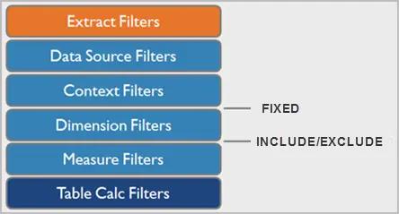

# LOD表达式

详细级别表达式(LOD Expression)是处理在一个可视化视图中包含多个级别粒度的问题的方法。

<!--more-->

## 详细级别

详细级别指的是数据不同粒度(聚合度)，共有3种不同的详细级别:

- 行级别表达式(聚合度最低)
- 视图级别表达式
- 表级别表达式(聚合度最高)

行级别表达式是直接引用基础表的未聚合数据列的表达式。此时，表达式的维度是行级别的(如果表有主键的话，维度即主键)。例如:

```
[Profit Ratio]=[Sales] / [Profit]
```

通过将每行的销量除以利润，可以得到利润率[ProfitRatio]的新列。

视图级别表达式是引用聚合数据源列的表达式。此时，表达式的维度是当前SQL视图的维度。例如:

```
SUM(Sales)/SUM(Profit)
```

表级别表达式是指不使用任何范围关键字的表达式。例如以下表达式返回整个表的最早订单日期:

```
{MIN([Order Date])}
```

在 Tableau 支持详细级别表达式之前，无法在视图级别以外的详细级别创建计算。例如，用户的意图是将每个商店的商店销售额与所有商店的平均销售额进行比较，如果您尝试保存以下表达式，Tableau 将显示错误消息：“无法使用此函数混合聚合和非聚合参数”：

```
[Sales] – AVG([Sales])
```

在这种情况下，详细级别表达式就派上了用场。详细级别表达式提供了对视图详细级别之外的数据计算聚合的简单方法，实现在可视化中以任意的方式组合这些数据。

## LOD Expression

LOD Expression 有3种:

- FIXED
- INCLUDE
- EXCLUDE

FIXED 详细级别表达式使用指定的维度计算值，而不引用视图中的维度。

和fixed不同，include和exclude是相对聚合，也就是说，它们如何影响视图详细级别，是受视图中的维度影响的

INCLUDE LOD，使用指定的维度和视图维度进行计算聚合。由于是在视图维度中增加新维度，因此该表达式返回的结果聚合度比视图级别更低(没有新维度，级别相同)。

EXCLUDE LOD，在现有视图维度基础上，排除指定的维度进行聚合计算。由于晒视图维度排除指定维度，因此返回的结果聚合度比视图级别更高(没有新维度，级别相同)。

LOD表达式语法如下:

```BNF
{[FIXED | INCLUDE | EXCLUDE] <dimension declaration > : <aggregate expression>}
```

- 整个详细级别表达式都括在大括号`{ }`中。
- 左大括号后的第一个元素是以下范围关键字之一：
  - FIXED 
    - FIXED 详细级别表达式使用指定的维度计算值，而不参考视图详细级别，即不引用视图中的任何其他维度。
    - FIXED 详细级别表达式还会忽略视图中除上下文筛选器、数据源筛选器和数据提取筛选器之外的所有筛选器。
    - 例子: `{ FIXED [Region] : SUM([Sales]) }`
  - INCLUDE 
    - INCLUDE 详细级别表达式使用指定的维度以及视图中的任何维度来计算值。
    - 包含详细级别表达式在包含不在视图中的维度时最有用
    - 例子: `{ INCLUDE [Customer Name] : SUM([Sales]) }`
  - EXCLUDE	
    - 排除详细级别表达式显式地从表达式中删除维度，也就是说，它们从视图详细级别中减去维度。
    - 排除详细级别表达式对于消除视图中的维度最有用。
    - 例子: `{EXCLUDE [Region]: SUM([Sales])}`
- 维度声明指定聚合表达式要联接到的一个或多个维度。使用逗号分隔维度。例如：`[Segment], [Category], [Region]`
- 聚合表达式是为定义目标维度而执行的计算。

## 过滤器



Tableau 中有几种不同类型的筛选器，它们按以下顺序从上到下执行。右侧的文本显示了在此序列中计算详细级别表达式的位置。提取筛选器（橙色）仅在从数据源创建 Tableau 数据提取时才相关。表计算筛选器（深蓝色）在执行计算后应用。可以将度量值筛选器视为等效于查询中的 HAVING 子句，将维度筛选器视为等效于 WHERE 子句。

- FIXED 计算在维度筛选器之前应用，因此，除非将筛选器功能区上的字段提升为“使用上下文筛选器”，否则将忽略这些字段。
- “包括”和“排除”详细级别表达式在维度筛选器之后考虑。因此，如果您希望筛选器应用于 FIXED 详细级别表达式，但不想使用上下文筛选器，请考虑将它们重写为 INCLUDE 或 EXCLUDE 表达式。

## LOD 的等效SQL

以 FIXED LOD为例的等效SQL如下所示。

### 详细层次表达式比视图详细层次表达式更粗糙

`FIXED_LOD_SALES = { FIXED [category]: AVG(sales) }` 等效表示

```sql
SELECT global_superstore.segment,
       global_superstore.category,
       round(sum(global_superstore.sales)) AS sales,
       LOD_SALES.sales_avg
FROM global_superstore
  (SELECT segment,
          category,
          round(sum(sales)) AS sales,
   FROM global_superstore
   GROUP BY segment,
            category) gs
INNER JOIN
  (SELECT segment,
          AVG(sales) AS sales_avg
   FROM global_superstore
   GROUP BY segment) LOD_SALES
   ON LOD_SALES.segment = gs.segment
```

如果FIXED 没有维度那么就没有ON条件:

```sql
SELECT global_superstore.segment,
       global_superstore.category,
       round(sum(global_superstore.sales)) AS sales,
       LOD_SALES.sales_avg
FROM global_superstore
  (SELECT segment,
          category,
          round(sum(sales)) AS sales,
   FROM global_superstore
   GROUP BY segment,
            category) gs
CROSS JOIN
  (SELECT AVG(sales) AS sales_avg
   FROM global_superstore
  ) LOD_SALES
```


在这种情况下，表达式的详细程度比视图更粗糙。它的值基于一个维度，而视图基于两个维度。在视图中使用详细级别表达式会导致复制某些值，即多次出现。


### 详细层次表达式比视图详细层次更精细

当表达式引用视图中维度的超集时，表达式具有比视图更精细的详细级别。当您在视图中使用此类表达式时，Tableau 会将结果聚合到视图级别。例如，以下详细级别表达式引用两个维度：

```
{FIXED [Segment], [Category] : SUM([Sales])}
```

在仅将`[Segment]`作为其详细级别的视图中使用此表达式时，必须聚合值。

```
AVG([{FIXED [Segment]], [Category]] : SUM([Sales]])}])
```


等效SQL如下:

```sql
SELECT gs.segment,
       gs.sales,
      LOD_SALES.sales_avg
FROM
  (SELECT segment,
          round(sum(sales)) AS sales,
   FROM global_superstore
   GROUP BY segment) gs 
INNER JOIN
  (SELECT segment, avg(sales) AS sales_avg
   FROM
     (SELECT segment, category, sum(sales) AS sales
      FROM global_superstore
      GROUP BY segment, category) LOD_SALES_CATEGORY
   GROUP BY segment)LOD_SALES_SEGMENT 
   ON LOD_SALES_SEGMENT.segment = gs.segment
```

### 详细层次表达式维度存在视图不存在的维度且互不包含

如果详细层次表达式维度存在视图不存在的维度且互不包含，那么等效SQL如下:

1. 详细层次表达式(order_date,category)和视图维度(segment,category)有交集

```sql
SELECT global_superstore.segment,
       global_superstore.category,
       round(sum(global_superstore.sales)) as sales,
       max(LOD_SALES.sales_max) as sales_max
FROM global_superstore
INNER JOIN
  (SELECT 
      global_superstore.category AS category,
      global_superstore.order_date AS order_date,
      MAX(global_superstore.sales) as sales_max
    FROM global_superstore
    GROUP BY category,order_date
  )LOD_SALES
  ON LOD_SALES_SEGMENT.category = global_superstore.category
  AND  LOD_SALES_SEGMENT.order_date = global_superstore.order_date
GROUP BY segment,category
```

> order_date 也可以是基于维度列的表达式，例如 SubString(order_date,4);

2. 详细层次表达式(order_date)和视图维度(segment,category)没有交集

```sql
SELECT gs.segment,
       gs.category,
       gs.sales,
       LOD_SALES.sales_avg
FROM
  (SELECT segment,
          category,
          round(sum(sales)) AS sales,
   FROM global_superstore
   GROUP BY segment,category) gs 
INNER JOIN
  (SELECT segment,
          category,
          max(sales) AS sales_avg
   FROM
     (  SELECT 
          segment, category, order_date
        FROM global_superstore
        GROUP BY segment, category,order_date
     ) t1 -- 粒度打平表
     INNER JOIN
     (SELECT 
        global_superstore.order_date AS order_date,
        MAX(global_superstore.sales) as sales_max
      FROM global_superstore
      GROUP BY order_date
     ) t2 
     ON t1.order_date = t2.order_date
   GROUP BY segment,category
  )LOD_SALES_SEGMENT 
  ON LOD_SALES_SEGMENT.segment = gs.segment
  AND LOD_SALES_SEGMENT.category = gs.category
```


### 上下文过滤器

当把segment的过滤条件加到上下文过滤器时,`FIXED_LOD_SALES = { FIXED [category]: AVG(sales) }` 的等效SQL:

```sql
SELECT gs.segment,
       gs.category,
       gs.sales,
       LOD_SALES.sales_avg
FROM
  (SELECT segment,
          category,
          round(sum(sales)) AS sales,
   FROM global_superstore
   GROUP BY segment,
            category) gs
INNER JOIN
  (SELECT segment,
          AVG(sales) AS sales_avg
   FROM global_superstore
   where segment='Consumer'
   GROUP BY segment) LOD_SALES
   ON LOD_SALES.segment = gs.segment
```

> LOD表达式可以嵌套使用，例如 `{EXCLUDE [Country]:MAX({ INCLUDE [Order ID]:SUM([Shipping Cost])})}`。嵌套 LOD 可以理解成 由内层LOD 和 外层LOD维度表join后的结果。


## 参考

- [1] [Create Level of Detail Expressions in Tableau](https://help.tableau.com/current/pro/desktop/en-us/calculations_calculatedfields_lod.htm)

- [2] [tableau 公开数据集](https://public.tableau.com/app/resources/sample-data?qt-overview_resources=1)

- [3] [在 SQL 中复制 LOD 计算](https://community.tableau.com/s/question/0D54T00000CWcniSAD/replicating-lod-calculations-in-sqlansi-standard)

- [4] [15 大详细级别表达式](https://www.tableau.com/zh-cn/blog/LOD-expressions)

- [5] [了解详细级别表达式](https://www.tableau.com/zh-cn/learn/whitepapers/understanding-lod-expressions)

