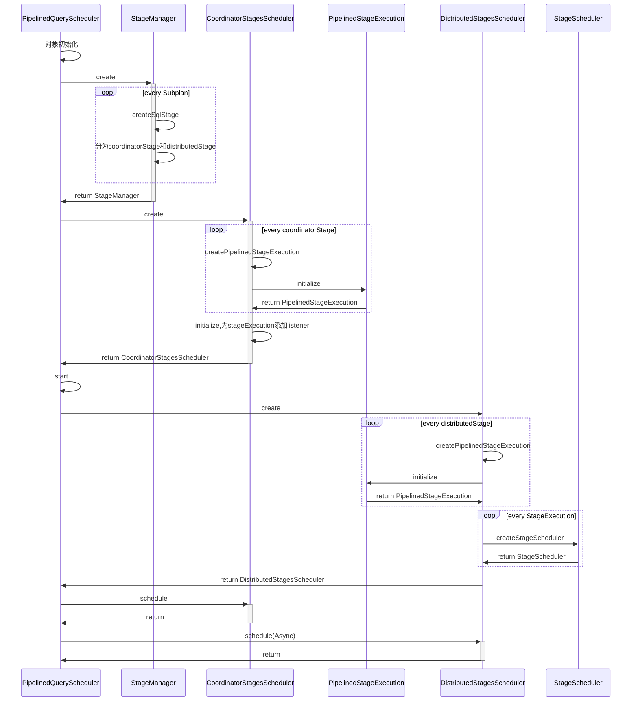
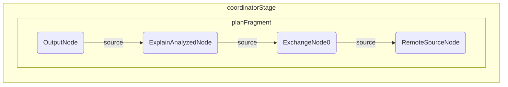
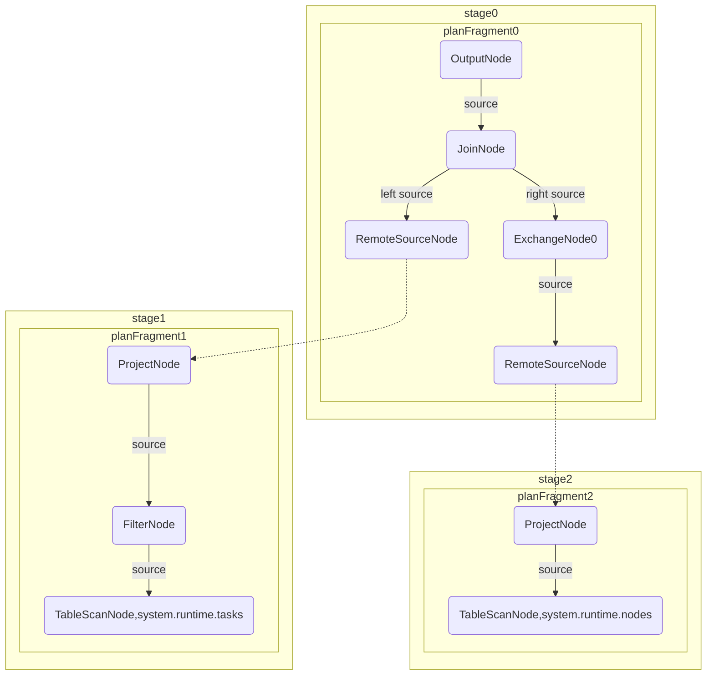

# Trino源码学习-查询调度

[上篇](/posts/2023/02/9fa3672f/)分析了SQL逻辑执行计划的生成，本篇将继续分析逻辑计划是如何在进行调度的。

<!--more-->

## 查询调度

首先回顾下调度的入口:

```java
public void start()
{
  try (SetThreadName ignored = new SetThreadName("Query-%s", stateMachine.getQueryId())) {
    try {
        if (!stateMachine.transitionToPlanning()) {
          // query already started or finished
          return;
        }
        ... ...

        try {
          // 生成逻辑执行计划
          PlanRoot plan = planQuery();
          registerDynamicFilteringQuery(plan);
          // 构建查询调度器
          planDistribution(plan);
        }
        finally {
          ... ... 
        }
        // 初始化 Query对应的TableExecuteContext
        tableExecuteContextManager.registerTableExecuteContextForQuery(getQueryId());
        if (!stateMachine.transitionToStarting()) {
          // query already started or finished
          return;
        }

        // if query is not finished, start the scheduler, otherwise cancel it
        QueryScheduler scheduler = queryScheduler.get();

        if (!stateMachine.isDone()) {
          scheduler.start(); // 启动调度器
        }
      }
      catch (Throwable e) {
        fail(e);
        throwIfInstanceOf(e, Error.class);
      }
    }
}
```
### 构建查询调度器

```java
//io.trino.execution.SqlQueryExecution
private void planDistribution(PlanRoot plan)
{
  // if query was canceled, skip creating scheduler
  if (stateMachine.isDone()) {
    return;
  }

  // record output field
  PlanFragment rootFragment = plan.getRoot().getFragment();
  stateMachine.setColumns(
    ((OutputNode) rootFragment.getRoot()).getColumnNames(),
    rootFragment.getTypes());
  // 获取重试策略，Query 表示重试整个Query，Task表示只重试部分Task
  RetryPolicy retryPolicy = getRetryPolicy(getSession());
  QueryScheduler scheduler;
  switch (retryPolicy) {
    case QUERY:
    case NONE:
      scheduler = new PipelinedQueryScheduler(
                        stateMachine,
                        plan.getRoot(),
                        nodePartitioningManager,
                        nodeScheduler,
                        remoteTaskFactory,
                        plan.isSummarizeTaskInfos(),
                        scheduleSplitBatchSize,
                        queryExecutor,
                        schedulerExecutor,
                        failureDetector,
                        nodeTaskMap,
                        executionPolicy,
                        schedulerStats,
                        dynamicFilterService,
                        tableExecuteContextManager,
                        plannerContext.getMetadata(),
                        splitSourceFactory,
                        coordinatorTaskManager);
      break;
    case TASK:
      if (isFaultTolerantExecutionEventDriverSchedulerEnabled(stateMachine.getSession())) {
        scheduler = new EventDrivenFaultTolerantQueryScheduler(... ...);
      }
      else {
        scheduler = new FaultTolerantQueryScheduler(... ...)
      }
      break;
    default:
      throw new IllegalArgumentException("Unexpected retry policy: " + retryPolicy);
    }
      queryScheduler.set(scheduler);
}
```
### QueryScheduler

QueryScheduler是Trino中的查询调度器，其定义如下:

```java
public interface QueryScheduler
{   
    // 开始调度
    void start(); 
    // 终止Stage
    void cancelStage(StageId stageId); 
    // 将Task设置为失败
    void failTask(TaskId taskId, Throwable failureCause); 
    // 获取基本的Stage统计信息
    BasicStageStats getBasicStageStats();
    // 获取Stage信息
    StageInfo getStageInfo();
    // 获取查询使用的内存
    long getUserMemoryReservation();
    // 整体内存的使用，包含 userMemory和RevocableMemory(可撤销内存)
    long getTotalMemoryReservation(); 
    // 获取整体CPU使用
    Duration getTotalCpuTime(); 
}
```

调度器将分段好的逻辑执行计划转化为分布式物理stage，然后用于执行。


### NodeScheduler

NodeScheduler是节点调度器，用于为各个Stage的task分配执行节点。在前面的[架构overview](/posts/4aaf9f12/#task)一文中有介绍，Task是执行计划的最小组成。一个stage对应一个或多个Task。

NodeScheduler内部有NodeSelectorFactory，并对外提供createNodeSelector方法。

```java
public NodeSelector createNodeSelector(Session session, Optional<CatalogHandle> catalogHandle)
{
    return nodeSelectorFactory.createNodeSelector(requireNonNull(session, "session is null"), requireNonNull(catalogHandle, "catalogHandle is null"));
}
```

#### NodeSelector

NodeSelector提供了对应节点的分配算法.有两个实现类:

- TopologyAwareNodeSelector: 基于网络拓扑距离的选择器
  - 如果split不能任意调度，那么会从split返回的节点中选择
  - 对于可以任意调度的split，根据split的节点和NetworkPath获取节点列表。
  - 根据Node上所有Split权重，或是Node上排队Split的权重平衡选择节点。
  - 如果仍然没有找到，那么返回等待split空间的Future。
- UniformNodeSelector: 默认的均衡选择器
  - 如果开启了本地调度优化尽量将split放在本地节点上，否则(无法任意调度的split只能从自己返回的节点中选择)随机选取若干节点(count>=minCandidates)
  - 每次选取有最小权重的Node。即尽量使不同Node上所有Split权重的平衡，或是不同Node上排队Split的权重平衡(默认策略)。
  - 如果仍然没有找到，那么返回等待split空间的Future。

```java
//io.trino.execution.scheduler.NodeSelector
public interface NodeSelector
{
    void lockDownNodes();

    List<InternalNode> allNodes();

    InternalNode selectCurrentNode();

    default List<InternalNode> selectRandomNodes(int limit)
    {
        return selectRandomNodes(limit, ImmutableSet.of());
    }

    List<InternalNode> selectRandomNodes(int limit, Set<InternalNode> excludedNodes);

    // 分配算法
    SplitPlacementResult computeAssignments(Set<Split> splits, List<RemoteTask> existingTasks);
    // 通过预先分配好的BucketNodeMap，选择节点。如果仍然没有找到，那么返回等待split空间的Future。
    // split -> bucket -> node 
    SplitPlacementResult computeAssignments(Set<Split> splits, List<RemoteTask> existingTasks, BucketNodeMap bucketNodeMap);
}
```

### NodePartitioningManager

NodePartitioningManager#getNodePartitioningMap提供了基于分区和节点的映射关系。

```java
public class NodePartitionMap
{
    // Partition->Node
    private final List<InternalNode> partitionToNode;
    // Bucket -> Partition
    private final int[] bucketToPartition;
    // Split->Bucket
    private final ToIntFunction<Split> splitToBucket;
    ... ...
    public InternalNode getNode(Split split)
    {
        int bucket = splitToBucket.applyAsInt(split);
        int partition = bucketToPartition[bucket];
        return requireNonNull(partitionToNode.get(partition));
    }
}
// bucket -> node
public final class ConnectorBucketNodeMap
{
    private final int bucketCount;
    private final Optional<List<Node>> bucketToNode;
}
```

getNodePartitionMap的具体逻辑如下:

```java
private NodePartitionMap getNodePartitioningMap(
            Session session,
            PartitioningHandle partitioningHandle,
            Map<Integer, List<InternalNode>> bucketToNodeCache,
            AtomicReference<List<InternalNode>> systemPartitioningCache)
{
    requireNonNull(session, "session is null");
    requireNonNull(partitioningHandle, "partitioningHandle is null");

    if (partitioningHandle.getConnectorHandle() instanceof SystemPartitioningHandle) {
        // 如果是系统分区Handle
        return systemNodePartitionMap(session, partitioningHandle, systemPartitioningCache);
    }

    if (partitioningHandle.getConnectorHandle() instanceof MergePartitioningHandle mergeHandle) {
        // 如果是merge 分区Handle，递归调用
        return mergeHandle.getNodePartitioningMap(handle -> getNodePartitioningMap(session, handle, bucketToNodeCache, systemPartitioningCache));
    }
    // 如果不是Trino提供的分区Handle，那就是Connector提供的。

    // 尝试获取 分桶到节点的映射关系
    Optional<ConnectorBucketNodeMap> optionalMap = getConnectorBucketNodeMap(session, partitioningHandle);
    if (optionalMap.isEmpty()) {
        // 如果connector没有提供 分桶到节点的映射关系, 使用FIXED_HASH_DISTRIBUTION分区方案
        return systemNodePartitionMap(session, FIXED_HASH_DISTRIBUTION, systemPartitioningCache);
    }
    ConnectorBucketNodeMap connectorBucketNodeMap = optionalMap.get();

    // safety check for crazy partitioning，太多分桶异常
    checkArgument(connectorBucketNodeMap.getBucketCount() < 1_000_000, "Too many buckets in partitioning: %s", connectorBucketNodeMap.getBucketCount());

    List<InternalNode> bucketToNode;
    if (connectorBucketNodeMap.hasFixedMapping()) {
        // hasFixedMapping,那么 bucketToNode不为空，已经存在了Bucket到Node的预分配关系
        bucketToNode = getFixedMapping(connectorBucketNodeMap);
    }
    else {
        CatalogHandle catalogHandle = requiredCatalogHandle(partitioningHandle);
        // 在对应的bucket的index处放入Node节点。
        // createArbitraryBucketToNode中将NodeList洗牌，然后循环分配个每个bucket。
        bucketToNode = bucketToNodeCache.computeIfAbsent(
                connectorBucketNodeMap.getBucketCount(),
                bucketCount -> createArbitraryBucketToNode(getAllNodes(session, catalogHandle), bucketCount));
    }
    // 基于bucket-> node.生成 node -> partition和bucket -> partition
    int[] bucketToPartition = new int[connectorBucketNodeMap.getBucketCount()];
    BiMap<InternalNode, Integer> nodeToPartition = HashBiMap.create();
    int nextPartitionId = 0;
    for (int bucket = 0; bucket < bucketToNode.size(); bucket++) {
        InternalNode node = bucketToNode.get(bucket);
        Integer partitionId = nodeToPartition.get(node);
        if (partitionId == null) {
            partitionId = nextPartitionId;
            nextPartitionId++;
            nodeToPartition.put(node, partitionId);
        }
        bucketToPartition[bucket] = partitionId;
    }
    // 将Map映射转化为数组映射
    List<InternalNode> partitionToNode = IntStream.range(0, nodeToPartition.size())
            .mapToObj(partitionId -> nodeToPartition.inverse().get(partitionId))
            .collect(toImmutableList());

    return new NodePartitionMap(partitionToNode, bucketToPartition, getSplitToBucket(session, partitioningHandle));
}
// 系统分区的处理
private NodePartitionMap systemNodePartitionMap(Session session, PartitioningHandle partitioningHandle, AtomicReference<List<InternalNode>> nodesCache)
{
    SystemPartitioning partitioning = ((SystemPartitioningHandle) partitioningHandle.getConnectorHandle()).getPartitioning();

    NodeSelector nodeSelector = nodeScheduler.createNodeSelector(session, Optional.empty());

    List<InternalNode> nodes = switch (partitioning) {
        case COORDINATOR_ONLY -> ImmutableList.of(nodeSelector.selectCurrentNode()); 
        // currentNode，就是COORDINATOR
        case SINGLE -> nodeSelector.selectRandomNodes(1); 
        // 随机选择一个
        case FIXED -> {
            List<InternalNode> value = nodesCache.get();
            if (value == null) {
                // 根据Session配置，随机选取若干节点
                value = nodeSelector.selectRandomNodes(getHashPartitionCount(session));
                nodesCache.set(value);
            }
            yield value;
        }
        default -> throw new IllegalArgumentException("Unsupported plan distribution " + partitioning);
    };
    checkCondition(!nodes.isEmpty(), NO_NODES_AVAILABLE, "No worker nodes available");

    return new NodePartitionMap(nodes, split -> {
        throw new UnsupportedOperationException("System distribution does not support source splits");
    });
}
```

注意，对于SOURCE_DISTRIBUTION和SCALED_WRITER_ROUND_ROBIN_DISTRIBUTION，并不是通过NodePartitioningManager处理。而是通过StageScheduler的实现类进行处理。

## PipelinedQueryScheduler

由于默认的RetryPolicy是NONE，按照上面构建查询调度器的逻辑，会构建PipelinedQueryScheduler。

PipelinedQueryScheduler会在初始化的时候通过StageManager将SubPlan生成SqlStage。其中SqlStage会被分为两类

- coordinatorStage
- distributedStage

这两类Stage会分别由CoordinatorStagesScheduler和DistributedStagesScheduler 调度。

调度流程如下:




### 生成SqlStage

```java
//io.trino.execution.scheduler.StageManager
static StageManager create(... ...)
{
  ... ...
  // 广度优先遍历
  for (SubPlan planNode : Traverser.forTree(SubPlan::getChildren).breadthFirst(planTree)) {
    PlanFragment fragment = planNode.getFragment();
    // 构建SqlStage
    SqlStage stage = createSqlStage(
              getStageId(session.getQueryId(), fragment.getId()),
              fragment,
              TableInfo.extract(session, metadata, fragment),
              taskFactory,
              session,
              summarizeTaskInfo,
              nodeTaskMap,
              executor,
              schedulerStats);
    StageId stageId = stage.getStageId();
    stages.put(stageId, stage);
    // 拓扑排序
    stagesInTopologicalOrder.add(stage);
    if (fragment.getPartitioning().isCoordinatorOnly()) {
      // 在coordinator上调度的plan
      // 内部判断逻辑是SystemPartitioning类型是否是COORDINATOR_ONLY
      // 在前文提到的PlanFragmenter.Fragmenter中会将一些fragment属性设置为CoordinatorOnlyDistribution
      coordinatorStagesInTopologicalOrder.add(stage);
    }
    else {
      // 分布式调度节点
      distributedStagesInTopologicalOrder.add(stage);
    }
    if (rootStageId == null) {
      rootStageId = stageId; // 设置root stage
    }
    Set<StageId> childStageIds = planNode.getChildren().stream()
      .map(childStage -> getStageId(session.getQueryId(), childStage.getFragment().getId()))
      .collect(toImmutableSet());
    children.put(stageId, childStageIds);
    // 存储Stage的子-父映射关系
    childStageIds.forEach(child -> parents.put(child, stageId));
  }
  StageManager stageManager = new StageManager(... ...);
  return stageManager;
}
```

#### 从Subplan创建SqlStage

```java
//io.trino.execution.scheduler.StageManager
public static SqlStage createSqlStage(... ...)
{
  // validate params
  ... ... 

  SqlStage sqlStage = new SqlStage(
          session,
          // 开始Stage状态机，状态:io.trino.execution.StageState
          new StageStateMachine(stageId, fragment, tables, executor, schedulerStats),
          remoteTaskFactory,
          nodeTaskMap,
          summarizeTaskInfo);
  sqlStage.initialize();
  return sqlStage;
}
```

#### 从SqlStage创建StageExecution

```java
//io.trino.execution.scheduler.PipelinedStageExecution
public static PipelinedStageExecution createPipelinedStageExecution(
        SqlStage stage,
        Map<PlanFragmentId, PipelinedOutputBufferManager> outputBufferManagers,
        TaskLifecycleListener taskLifecycleListener,
        FailureDetector failureDetector,
        Executor executor,
        Optional<int[]> bucketToPartition,
        int attempt)
{
    PipelinedStageStateMachine stateMachine = new PipelinedStageStateMachine(stage.getStageId(), executor);
    ImmutableMap.Builder<PlanFragmentId, RemoteSourceNode> exchangeSources = ImmutableMap.builder();
    for (RemoteSourceNode remoteSourceNode : stage.getFragment().getRemoteSourceNodes()) {
        for (PlanFragmentId planFragmentId : remoteSourceNode.getSourceFragmentIds()) {
            exchangeSources.put(planFragmentId, remoteSourceNode); 
            // 记录执行计划中的远程输入节点
        }
    }
    PipelinedStageExecution execution = new PipelinedStageExecution(
            stateMachine,
            stage,
            outputBufferManagers,
            taskLifecycleListener,
            failureDetector,
            bucketToPartition,
            exchangeSources.buildOrThrow(),
            attempt);
    execution.initialize();
    return execution;
}
```

### coordinatorStage 调度

coordinatorStage是在 coordinator上执行的Stage。 例如，使用 `EXPLAIN ANALYZE`命令时,coordinatorStage结构如下图所示。



coordinatorStage处理流程如下:

- coordinatorStage是COORDINATOR_ONLY分区的Stage。
- 在create CoordinatorStagesScheduler时会从SqlStage构建StageExecution
- 在CoordinatorStagesScheduler初始化(initialize)的时候会给StageExecution设置listener
  - 给每个StageExecution设置自己的状态Listener
  - 每个StageExecution done时，终止其child StageExecution
  - root(first) StageExecution状态变化时，同步到QueryState
  - last StageExecution结束时，终止distributedStagesScheduler
- CoordinatorStagesScheduler 执行schedule方法时会执行StageExecution#scheduleTask方法，创建RemoteTask用于执行。

### distributedStage

distributedStage是指不在 coordinator上执行的Stage，其处理流程如下:

- distributedStage是非COORDINATOR_ONLY分区的Stage。
- 在create DistributedStagesScheduler时会从SqlStage构建StageExecution
- 构建StageExecution完成后，会为每个Stage和其children构建StageScheduler用于Stage调度。
- 在DistributedStagesScheduler初始化(initialize)的时候会给StageExecution设置listener
  - 给每个StageExecution设置自己的状态Listener
  - 每个StageExecution done时，终止其child StageExecution
- DistributedStagesScheduler执行schedule方法时
  - 启动所有的StageScheduler
  - 根据执行调度策略循环获取可以执行的StageExecution和对应的StageScheduler，直到所有StageExecution均完成。
    - 使用StageScheduler执行schedule
    - 如果有blockedStage，且原因是WRITER_SCALING，WAITING_FOR_SOURCE和SPLIT_QUEUES_FULL加入列表，否则抛出异常
    - 对于所有的blockedStage，等待1s，对所有blockedStage调用cancel方法(google AbstractFuture该方法默认是donothing)。


### ExecutionSchedule

ExecutionSchedule 是指StageExecution的调度策略。

```java
public interface ExecutionSchedule
{
    // 获取用于调度的stage
    StagesScheduleResult getStagesToSchedule();

    boolean isFinished();
}
```

ExecutionSchedule有两个实现类。

- AllAtOnceExecutionSchedule: 每次返回所有可以调度的StageExecution
- PhasedExecutionSchedule: 默认调度模式，根据StageExecution的依赖顺序返回可以执行的stage，防止由于stage间的依赖造成的阻塞。

对于带join的查询:

```sql
select 
    t.*,n.*
from
    system.runtime.tasks t
left join 
    system.runtime.nodes n
on 
    t.node_id = n.node_id
where 
    t.state = 'FINISHED'
```

生成的查询结构如下:



PhasedExecutionSchedule会计算出以下依赖关系

```sh
## dependency
Fragment2 -> Fragment1 # 1依赖于2
```

Trino中会将join执行分为构建侧和探针侧，其中构建侧是小表(Trino中的右表)，会加载到内存中，探针侧是大表，用于遍历。所以会存在隐式依赖关系，构建侧的Stage和其上游任务需要在探针侧Stage前调度。所以有了上面的依赖关系。

由于依赖关系的存在，首次调度的stage将是 stage0和stage2。


### StageScheduler


从上面的distributedStage处理流程可以知道，最终StageExecution的调度是通过StageScheduler来进行调度的。

```java
public interface StageScheduler
        extends Closeable
{
    /**
     * Called by the query scheduler when the scheduling process begins.
     * This method is called before the ExecutionSchedule takes a decision
     * to schedule a stage but after the query scheduling has been fully initialized.
     * Within this method the scheduler may decide to schedule tasks that
     * are necessary for query execution to make progress.
     * For example the scheduler may decide to schedule a task without
     * assigning any splits to unblock dynamic filter collection.
     */
    default void start() {}

    /**
     * Schedules as much work as possible without blocking.
     * The schedule results is a hint to the query scheduler if and
     * when the stage scheduler should be invoked again.  It is
     * important to note that this is only a hint and the query
     * scheduler may call the schedule method at any time.
     */
    ScheduleResult schedule();

    @Override
    default void close() {}
}
```

StageScheduler的实现有4个:

- newSourcePartitionedSchedulerAsStageScheduler中的内部类: 如果分区格式是SOURCE_DISTRIBUTION使用这种调度器
- ScaledWriterScheduler: 如果分区格式是SCALED_WRITER_ROUND_ROBIN_DISTRIBUTION，使用这种调度器
- FixedCountScheduler: 如果没有本地Source，都是remote Source，使用这种调度器
- FixedSourcePartitionedScheduler: 如果有本地Source，使用这种调度器。

> FixedCountScheduler和FixedSourcePartitionedScheduler会使用上面提到的NodePartitioningManager进行分区设置。

我们先来看看FixedCountScheduler。

#### FixedCountScheduler

```java
public class FixedCountScheduler
        implements StageScheduler
{
    public interface TaskScheduler
    {
        Optional<RemoteTask> scheduleTask(InternalNode node, int partition);
    }

    private final TaskScheduler taskScheduler;
    private final List<InternalNode> partitionToNode;

    public FixedCountScheduler(StageExecution stageExecution, List<InternalNode> partitionToNode)
    {
        requireNonNull(stageExecution, "stage is null");
        this.taskScheduler = (node, partition) -> stageExecution.scheduleTask(node, partition, ImmutableMultimap.of());
        this.partitionToNode = requireNonNull(partitionToNode, "partitionToNode is null");
    }

    @Override
    public ScheduleResult schedule()
    {   // 对每个分区，通过 stageExecution.scheduleTask 启动一个TASK.
        List<RemoteTask> newTasks = IntStream.range(0, partitionToNode.size())
                .mapToObj(partition -> taskScheduler.scheduleTask(partitionToNode.get(partition), partition))
                .filter(Optional::isPresent)
                .map(Optional::get)
                .collect(toImmutableList());

        return new ScheduleResult(true, newTasks, 0);
    }
}
```

#### FixedSourcePartitionedScheduler

FixedSourcePartitionedScheduler是针对有本地Source的情况。

```java
public FixedSourcePartitionedScheduler(... ...)
{
   ... ... 

    BucketedSplitPlacementPolicy splitPlacementPolicy = new BucketedSplitPlacementPolicy(nodeSelector, nodes, bucketNodeMap, stageExecution::getAllTasks);
    // 注意split的放置策略: BucketedSplitPlacementPolicy
    // public SplitPlacementResult computeAssignments(Set<Split> splits){
    //   return nodeSelector.computeAssignments(splits, remoteTasks.get(), bucketNodeMap);
    // }

    ArrayList<SourceScheduler> sourceSchedulers = new ArrayList<>();

    partitionIdAllocator = new PartitionIdAllocator();
    scheduledTasks = new HashMap<>();
    for (PlanNodeId planNodeId : schedulingOrder) {
        // 对于每个SplitSource 构建一个 SourceScheduler
        SplitSource splitSource = splitSources.get(planNodeId);
        // TODO : change anySourceTaskBlocked to accommodate the correct blocked status of source tasks
        //  (ref : https://github.com/trinodb/trino/issues/4713)
        SourceScheduler sourceScheduler = newSourcePartitionedSchedulerAsSourceScheduler(
                stageExecution,
                planNodeId,
                splitSource,
                splitPlacementPolicy,
                splitBatchSize,
                dynamicFilterService,
                tableExecuteContextManager,
                () -> true,
                partitionIdAllocator,
                scheduledTasks);

        sourceSchedulers.add(sourceScheduler);
    }
    this.sourceSchedulers = new ArrayDeque<>(sourceSchedulers);
}
```


- 如果所有的RemoteSource的ExchangeType都是REPLICATE(一般只有小表join时才会有REPLICATE类型的Exchange，即该stage都是本地Source，Trino中小表用于构建)。会根据输入的bucket确定和节点的映射(nodePartitioningManager#getBucketNodeMap)
- 否则，对于有remoteSource的会使用nodePartitioningManager#getNodePartitioningMap进行分区。

```java
 public ScheduleResult schedule()
{
    // schedule a task on every node in the distribution
    List<RemoteTask> newTasks = ImmutableList.of();
    if (scheduledTasks.isEmpty()) {
        ImmutableList.Builder<RemoteTask> newTasksBuilder = ImmutableList.builder();
        for (InternalNode node : nodes) { // nodes partition -> node
            // 此处调度TASK
            Optional<RemoteTask> task = stageExecution.scheduleTask(node, partitionIdAllocator.getNextId(), ImmutableMultimap.of());
            if (task.isPresent()) {
                scheduledTasks.put(node, task.get());
                newTasksBuilder.add(task.get());
            }
        }
        newTasks = newTasksBuilder.build();
    }

    ListenableFuture<Void> blocked = immediateFuture(null);
    ScheduleResult.BlockedReason blockedReason = null;
    int splitsScheduled = 0;
    while (!sourceSchedulers.isEmpty()) {
        SourceScheduler scheduler = sourceSchedulers.peek();
        // 调度Source
        ScheduleResult schedule = scheduler.schedule();
        splitsScheduled += schedule.getSplitsScheduled();
        blocked = schedule.getBlocked();

        if (schedule.getBlockedReason().isPresent()) {
            // 如果有Block记录block原因
            blockedReason = schedule.getBlockedReason().get();
        }
        else {
            blockedReason = null;
        }

        // if the source is not done scheduling, stop scheduling for now
        if (!blocked.isDone() || !schedule.isFinished()) {
            break;
        }

        stageExecution.schedulingComplete(scheduler.getPlanNodeId());
        sourceSchedulers.remove().close(); // 关闭成功的调度器
    }

    if (blockedReason != null) {
        return new ScheduleResult(sourceSchedulers.isEmpty(), newTasks, blocked, blockedReason, splitsScheduled);
    }
    checkState(blocked.isDone(), "blockedReason not provided when scheduler is blocked");
    return new ScheduleResult(sourceSchedulers.isEmpty(), newTasks, splitsScheduled);
}
```

注意ScheduleResult返回如果不是finished，那么stageExecution的状态是不会被变到Scheduled。那么在下一次循环时，还是能获取到这个stageExecution

```java
// io.trino.execution.scheduler.PipelinedQueryScheduler.DistributedStagesScheduler.schedule
// modify parent and children based on the results of the scheduling
if (result.isFinished()) {
    stageExecution.schedulingComplete();
}
// io.trino.execution.scheduler.PipelinedStageExecution
public void schedulingComplete()
{
    if (!stateMachine.transitionToScheduled()) {
        return;
    }

    if (isStageFlushing()) {
        stateMachine.transitionToFlushing();
    }
    if (isStageFinished()) {
        stateMachine.transitionToFinished();
    }

    for (PlanNodeId partitionedSource : stage.getFragment().getPartitionedSources()) {
        schedulingComplete(partitionedSource);
    }
}
```

#### ScaledWriterScheduler

```java
public ScheduleResult schedule()
{
    List<RemoteTask> writers = scheduleTasks(getNewTaskCount());

    future.set(null);
    future = SettableFuture.create();
    executor.schedule(() -> future.set(null), 200, MILLISECONDS);
    // 注意返回finished
    return new ScheduleResult(done.get(), writers, future, WRITER_SCALING, 0);
}
// 之后返回0或1
private int getNewTaskCount()
{
    if (scheduledNodes.isEmpty()) {
        return 1;
    }

    double fullTasks = sourceTasksProvider.get().stream()
            .filter(task -> !task.getState().isDone())
            .map(TaskStatus::getOutputBufferStatus)
            .map(OutputBufferStatus::isOverutilized)
            .mapToDouble(full -> full ? 1.0 : 0.0)
            .average().orElse(0.0);

    long writtenBytes = writerTasksProvider.get().stream()
            .map(TaskStatus::getPhysicalWrittenDataSize)
            .mapToLong(DataSize::toBytes)
            .sum();

    if ((fullTasks >= 0.5) && (writtenBytes >= (writerMinSizeBytes * maxTaskWriterCount * scheduledNodes.size()))) {
        return 1;
    }

    return 0;
}

private List<RemoteTask> scheduleTasks(int count)
{
    if (count == 0) {
        return ImmutableList.of();
    }

    List<InternalNode> nodes = nodeSelector.selectRandomNodes(count, scheduledNodes);

    checkCondition(!scheduledNodes.isEmpty() || !nodes.isEmpty(), NO_NODES_AVAILABLE, "No nodes available to run query");

    ImmutableList.Builder<RemoteTask> tasks = ImmutableList.builder();
    for (InternalNode node : nodes) {
        Optional<RemoteTask> remoteTask = stage.scheduleTask(node, scheduledNodes.size(), ImmutableMultimap.of());
        remoteTask.ifPresent(task -> {
            tasks.add(task);
            scheduledNodes.add(node);
        });
    }

    return tasks.build();
}
```

默认情况下，写出任务的数量是静态的。启用写出器扩展允许 Presto 动态扩展写出器任务的数量，而不是分配固定数量的任务。当每个写出器的平均物理数据量高于最小阈值时，会添加其他任务，但前提是查询在写出时遇到瓶颈。

动态添加的原因，也是因为stageExecution未处于scheduled状态，从而会重复进入schedule方法。

```java
if (partitioningHandle.equals(SCALED_WRITER_ROUND_ROBIN_DISTRIBUTION)) {
        Supplier<Collection<TaskStatus>> sourceTasksProvider = () -> childStageExecutions.stream()
        .map(StageExecution::getTaskStatuses)
        .flatMap(List::stream)
        .collect(toImmutableList());
Supplier<Collection<TaskStatus>> writerTasksProvider = stageExecution::getTaskStatuses;

ScaledWriterScheduler scheduler = new ScaledWriterScheduler(
        stageExecution,
        sourceTasksProvider,
        writerTasksProvider,
        nodeScheduler.createNodeSelector(session, Optional.empty()),
        executor,
        getWriterMinSize(session),
        isTaskScaleWritersEnabled(session) ? getTaskScaleWritersMaxWriterCount(session) : getTaskWriterCount(session));
// 当childStageExecutions都完成时，会触发ScaledWriterScheduler的finish，从而终止ScaledWriterScheduler的多次调度
whenAllStages(childStageExecutions, StageExecution.State::isDone)
        .addListener(scheduler::finish, directExecutor());

return scheduler;
}
```

#### newSourcePartitionedSchedulerAsStageScheduler

newSourcePartitionedSchedulerAsStageScheduler是用于处理SplitSource的调度器。

```java
//io.trino.execution.scheduler.SourcePartitionedScheduler
public static StageScheduler newSourcePartitionedSchedulerAsStageScheduler(
            StageExecution stageExecution,
            PlanNodeId partitionedNode,
            SplitSource splitSource,
            SplitPlacementPolicy splitPlacementPolicy,
            int splitBatchSize,
            DynamicFilterService dynamicFilterService,
            TableExecuteContextManager tableExecuteContextManager,
            BooleanSupplier anySourceTaskBlocked)
{
    SourcePartitionedScheduler sourcePartitionedScheduler = new SourcePartitionedScheduler(
            stageExecution,
            partitionedNode,
            splitSource,
            splitPlacementPolicy,
            splitBatchSize,
            dynamicFilterService,
            tableExecuteContextManager,
            anySourceTaskBlocked,
            new PartitionIdAllocator(),
            new HashMap<>());

    return new StageScheduler()
    {
        @Override
        public void start()
        {
            sourcePartitionedScheduler.start();
        }

        @Override
        public ScheduleResult schedule()
        {
            return sourcePartitionedScheduler.schedule();
        }

        @Override
        public void close()
        {
            sourcePartitionedScheduler.close();
        }
    };
}
```

该Stage调度器的调度方法，实际上是调用了SourcePartitionedScheduler实现。SourcePartitionedScheduler的状态有4种:

```java
private enum State
{
    /**
     * No splits have been added to pendingSplits set.
     */
    INITIALIZED,

    /**
     * At least one split has been added to pendingSplits set.
     */
    SPLITS_ADDED,

    /**
     * All splits from underlying SplitSource have been discovered.
     * No more splits will be added to the pendingSplits set.
     */
    SPLITS_SCHEDULED,

    /**
     * All splits have been provided to caller of this scheduler.
     * Cleanup operations are done
     */
    FINISHED
}
```

SplitSource是支持Split的Source，一般是ConnectorAwareSplitSource，调度器会从SplitSource中获取SplitBatch(表示一批Split)。然后将其中所有的Split加入到pendingSplits。

```java
else if (pendingSplits.isEmpty()) {
    // try to get the next batch
    if (nextSplitBatchFuture == null) {
        nextSplitBatchFuture = splitSource.getNextBatch(splitBatchSize);

        long start = System.nanoTime();
        addSuccessCallback(nextSplitBatchFuture, () -> stageExecution.recordGetSplitTime(start));
    }

    if (nextSplitBatchFuture.isDone()) {
        SplitBatch nextSplits = getFutureValue(nextSplitBatchFuture);
        nextSplitBatchFuture = null;
        pendingSplits.addAll(nextSplits.getSplits());
        if (nextSplits.isLastBatch()) {
            if (state == State.INITIALIZED && pendingSplits.isEmpty()) {
                // 此处通过 EmptySplit 兜底
                // Add an empty split in case no splits have been produced for the source.
                // For source operators, they never take input, but they may produce output.
                // This is well handled by the execution engine.
                // However, there are certain non-source operators that may produce output without any input,
                // for example, 1) an AggregationOperator, 2) a HashAggregationOperator where one of the grouping sets is ().
                // Scheduling an empty split kicks off necessary driver instantiation to make this work.
                pendingSplits.add(new Split(
                        splitSource.getCatalogHandle(),
                        new EmptySplit(splitSource.getCatalogHandle())));
            }
            log.debug("stage id: %s, node: %s; transitioning to SPLITS_SCHEDULED", stageExecution.getStageId(), partitionedNode);
            state = State.SPLITS_SCHEDULED;
        }
    }
    else {
        // 将调度结果设置为阻塞状态。
        blockedFuture = Optional.of(asVoid(nextSplitBatchFuture));
        blockedOnNextSplitBatch = true;
        log.debug("stage id: %s, node: %s; blocked on next split batch", stageExecution.getStageId(), partitionedNode);
    }
}
```

当pendingSplits不为空时。调度器状态为SPLITS_ADDED。

```
 if (!pendingSplits.isEmpty() && state == State.INITIALIZED) {
    log.debug("stage id: %s, node: %s; transitioning to SPLITS_ADDED", stageExecution.getStageId(), partitionedNode);
    state = State.SPLITS_ADDED;
}
```

然后是对于所有的Split，计算其放置策略。根据计算出来的策略设置Split

```java
SplitPlacementResult splitPlacementResult = splitPlacementPolicy.computeAssignments(pendingSplits);
// 这里的策略是DynamicSplitPlacementPolicy，内部使用前面介绍的NodeSelector选择最佳节点。
splitAssignment = splitPlacementResult.getAssignments(); // remove splits with successful placements
splitAssignment.values().forEach(pendingSplits::remove); // AbstractSet.removeAll performs terribly here.
overallSplitAssignmentCount += splitAssignment.size(); // if not completed placed, mark scheduleGroup as blocked on placement
if (!pendingSplits.isEmpty()) {
    placementFuture = splitPlacementResult.getBlocked();
    blockedFuture = Optional.of(placementFuture);
    blockedOnPlacements = true;
}
// assign the splits with successful placements
overallNewTasks.addAll(assignSplits(splitAssignment));

private Set<RemoteTask> assignSplits(Multimap<InternalNode, Split> splitAssignment)
{
    ImmutableSet.Builder<RemoteTask> newTasks = ImmutableSet.builder();

    ImmutableSet<InternalNode> nodes = ImmutableSet.copyOf(splitAssignment.keySet());
    for (InternalNode node : nodes) {
        // source partitioned tasks can only receive broadcast data; otherwise it would have a different distribution
        ImmutableMultimap<PlanNodeId, Split> splits = ImmutableMultimap.<PlanNodeId, Split>builder()
                .putAll(partitionedNode, splitAssignment.get(node))
                .build();
        RemoteTask task = scheduledTasks.get(node);
        if (task != null) {
            task.addSplits(splits);
        }
        else {
            // 调度Split Task
            scheduleTask(node, splits).ifPresent(newTasks::add);
        }
    }
    return newTasks.build();
}
```

当pendingSplits为空，且状态为SPLITS_SCHEDULED时，会将状态设置为FINISH，并将调度器设置为scheduled。其他情况都会让调度器继续执行调度方法。

