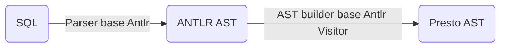

# Trino源码学习-SQL语法树解析

Trino在查询提交时，会将SQL文本解析成语法树。Trino将这一动作分为2个部分:


<!--more-->

## Antlr Parser

Antlr的使用在Trino中就不多做介绍了，简单来说，Antlr基于类似巴斯卡范式(BNF)的语法规则和词法规则文件，动态生成Parser和Lexer。

在Trino项目中，该文件位于
- `core/trino-parser/src/main/antlr4/io/trino/sql/parser/SqlBase.g4`

通过使用Antlr的mave插件，在generate source阶段，会动态生成SqlBaseLexer和SqlBaseParser
- `core/trino-parser/target/generated-sources/antlr4/io/trino/sql/parser/`目录下

## io.trino.sql.parser.SqlParser

trino在实际使用过程中并没有直接使用Antlr的Parser，而是统一使用门面类SqlParser用于执行语法解析。SqlParser的解析方法内部都是通过调用invokeParser来实现的。

```java
private Node invokeParser(String name, String sql, Function<SqlBaseParser, ParserRuleContext> parseFunction, ParsingOptions parsingOptions)
    {
        try {
            //CaseInsensitiveStream 忽略大小写
            SqlBaseLexer lexer = new SqlBaseLexer(new CaseInsensitiveStream(CharStreams.fromString(sql)));
            CommonTokenStream tokenStream = new CommonTokenStream(lexer);
            SqlBaseParser parser = new SqlBaseParser(tokenStream);
            // 此处优化是由于antlr的内存泄漏
            // https://github.com/antlr/antlr4/issues/499
            initializer.accept(lexer, parser); 
           


            // Override the default error strategy to not attempt inserting or deleting a token.
            // Otherwise, it messes up error reporting
            parser.setErrorHandler(new DefaultErrorStrategy()
            {
                @Override
                public Token recoverInline(Parser recognizer)
                        throws RecognitionException
                {
                    if (nextTokensContext == null) {
                        throw new InputMismatchException(recognizer);
                    }
                    throw new InputMismatchException(recognizer, nextTokensState, nextTokensContext);
                }
            });
            // 流式遍历方式的listenner。进行后置处理
            parser.addParseListener(new PostProcessor(Arrays.asList(parser.getRuleNames()), parser));

            lexer.removeErrorListeners();
            lexer.addErrorListener(LEXER_ERROR_LISTENER);

            parser.removeErrorListeners();
            parser.addErrorListener(PARSER_ERROR_HANDLER);

            ParserRuleContext tree;
            try {
                // first, try parsing with potentially faster SLL mode
                parser.getInterpreter().setPredictionMode(PredictionMode.SLL);
                tree = parseFunction.apply(parser); // 此时解析为Antlr树
            }
            catch (ParseCancellationException ex) {
                // if we fail, parse with LL mode
                tokenStream.seek(0); // rewind input stream
                parser.reset();
                // SLL不行的话，使用降级模式LL
                parser.getInterpreter().setPredictionMode(PredictionMode.LL);
                tree = parseFunction.apply(parser);
            }

            return new AstBuilder(parsingOptions).visit(tree); // 访问者模式，生成Presto自定义的语法树
        }
        catch (StackOverflowError e) {
            throw new ParsingException(name + " is too large (stack overflow while parsing)");
        }
    }
```

Presto 自定义的语法节点类存放在`core/trino-parser/src/main/java/io/trino/sql/tree`包下。

> antlr内存泄漏问题，详细内容可见 [AntlrV4 的内存泄漏问题](https://www.victorchu.info/posts/fb60a93e/)

