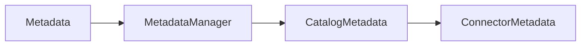
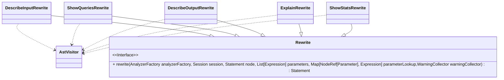
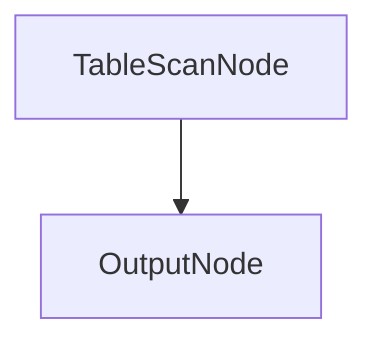
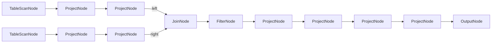
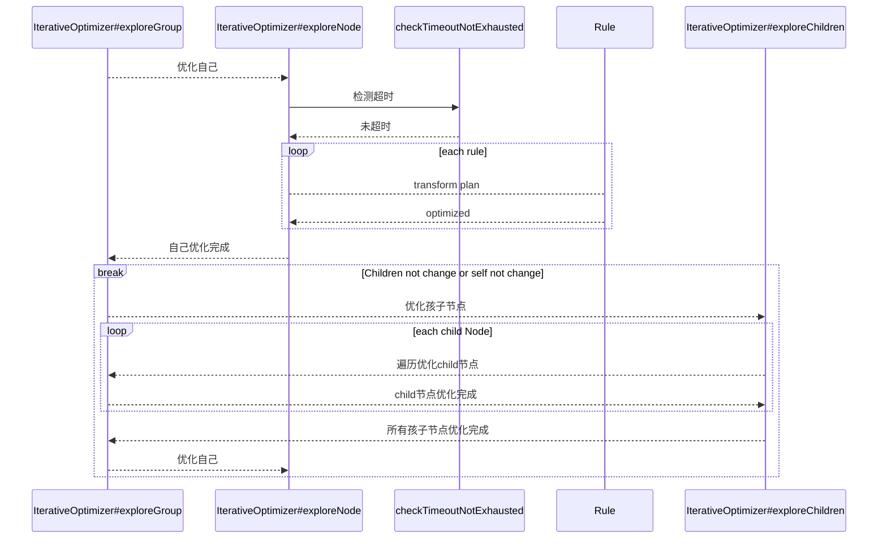
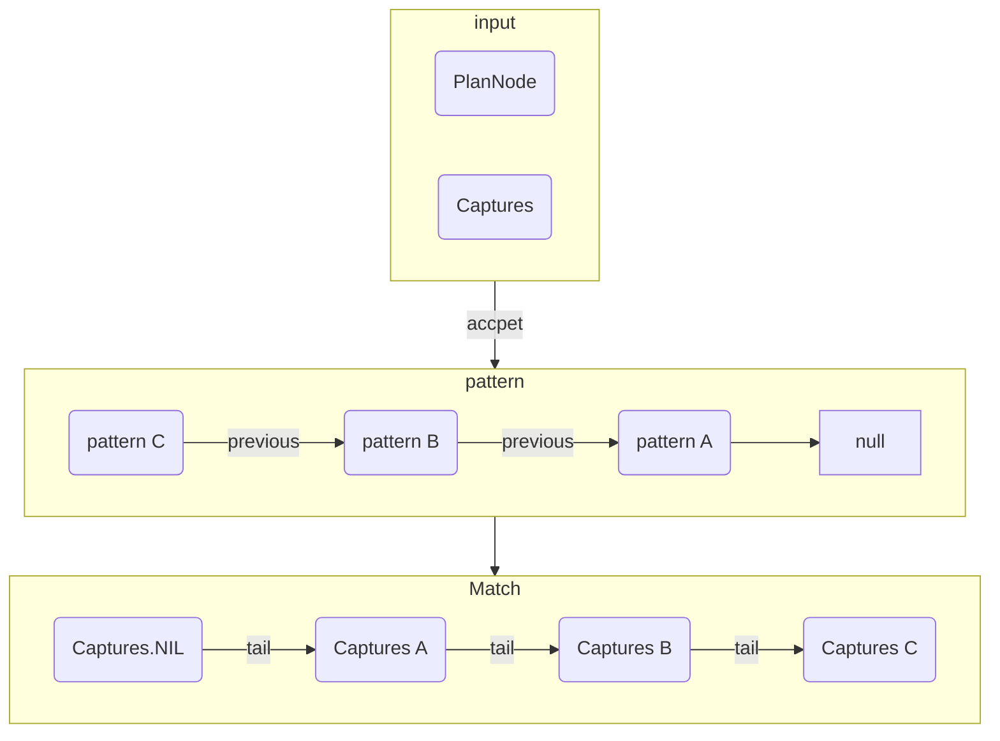
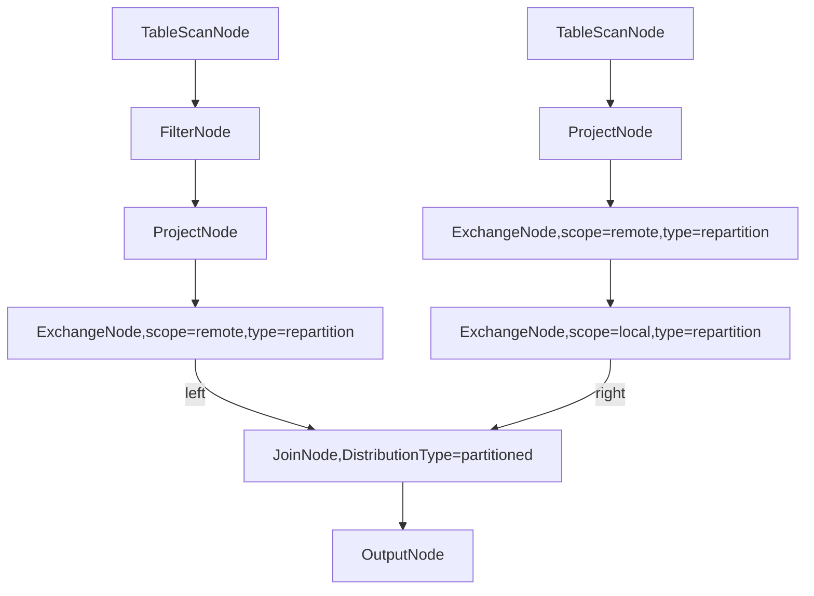
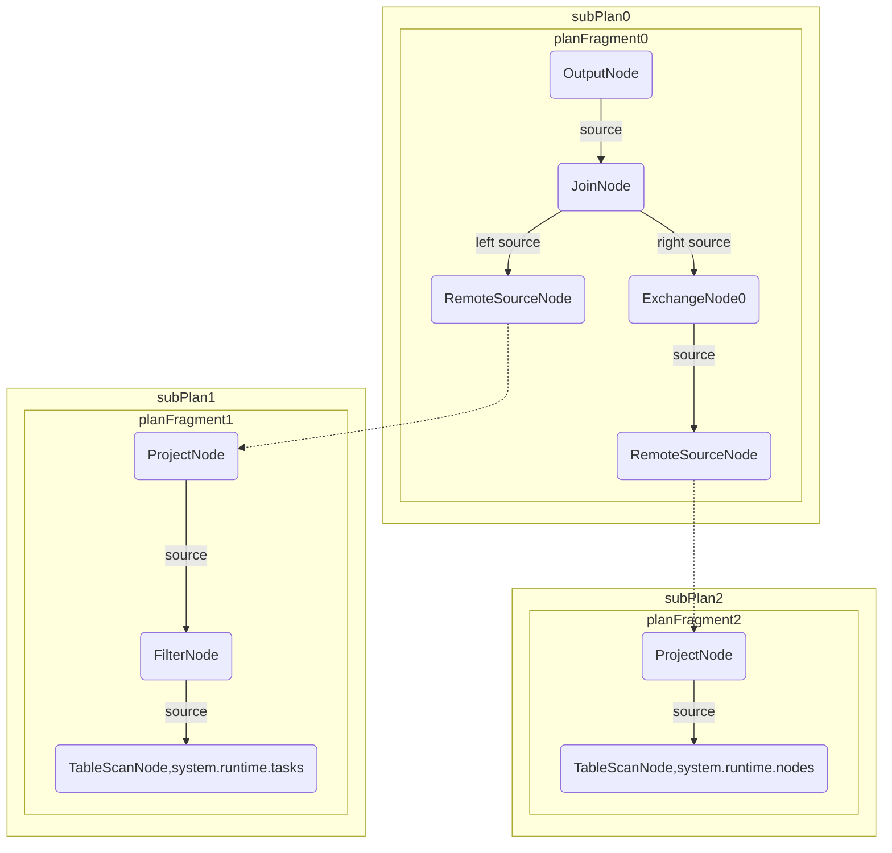

# Trino源码学习-执行计划生成

[上篇](/posts/2023/01/e7bc0170/)分析了trino提交查询部分的源码，本篇来分析下，构建执行计划部分的源码。

<!--more-->
## DDL执行

DDL执行通过QueryExecution的子类DataDefinitionExecution实现。

```java
public void start()
{
    try {
        // transition to running
        if (!stateMachine.transitionToRunning()) {
            // query already running or finished
            return;
        }
        // DataDefinitionExecution直接执行，不需要经过执行计划构建(planning)和查询调度(STARTING)。
        ListenableFuture<Void> future = task.execute(statement, stateMachine, parameters, warningCollector);
        Futures.addCallback(future, new FutureCallback<>()
        {
            @Override
            public void onSuccess(@Nullable Void result)
            {
                stateMachine.transitionToFinishing();
            }

            @Override
            public void onFailure(Throwable throwable)
            {
                fail(throwable);
            }
        }, directExecutor());
    }
    catch (Throwable e) {
        fail(e);
        throwIfInstanceOf(e, Error.class);
    }
}
```

DDL执行较为简单，通过内部的DataDefinitionTask执行，一般都是通过Metadata接口进行操作。Metadata提供了对元数据的操作API，其实现基于Connector的ConnectorMetadata实现提供。对于部分Task(例如createTable)，也会调用Analyzer进行分析。


## sql执行

sql执行是通过QueryExecution的子类SqlQueryExecution实现的。
### sql执行前的语法树分析

在SqlQueryExecution的构造器中会通过Analyzer分析语法树。

```java
// io.trino.execution.SqlQueryExecution
public SqlQueryExecution(){
    ... ...
    this.analysis = analyze(preparedQuery, stateMachine, warningCollector, analyzerFactory);
    ... ...
}
private static Analysis analyze(
            PreparedQuery preparedQuery,
            QueryStateMachine stateMachine,
            WarningCollector warningCollector,
            AnalyzerFactory analyzerFactory)
    {
        stateMachine.beginAnalysis(); // 开始为Analysis计时

        requireNonNull(preparedQuery, "preparedQuery is null");
        // 创建分析器
        Analyzer analyzer = analyzerFactory.createAnalyzer(
                stateMachine.getSession(),
                preparedQuery.getParameters(),
                bindParameters(preparedQuery.getStatement(), preparedQuery.getParameters()),
                warningCollector);
        Analysis analysis;
        try {
            // 执行分析
            analysis = analyzer.analyze(preparedQuery.getStatement());
        }
        catch (StackOverflowError e) {
            throw new TrinoException(STACK_OVERFLOW, "statement is too large (stack overflow during analysis)", e);
        }

        stateMachine.setUpdateType(analysis.getUpdateType());
        stateMachine.setReferencedTables(analysis.getReferencedTables());
        stateMachine.setRoutines(analysis.getRoutines());

        stateMachine.endAnalysis();
        // analysis中存储着分析的结果
        return analysis;
    }
```

下面来关注下analyzer中做了什么。

```java
public Analysis analyze(Statement statement, QueryType queryType)
{
    // 重写部分语句
    Statement rewrittenStatement = statementRewrite.rewrite(analyzerFactory, session, statement, parameters, parameterLookup, warningCollector);
    Analysis analysis = new Analysis(rewrittenStatement, parameterLookup, queryType);
    StatementAnalyzer analyzer = statementAnalyzerFactory.createStatementAnalyzer(analysis, session, warningCollector, CorrelationSupport.ALLOWED);
    analyzer.analyze(rewrittenStatement, Optional.empty());

    // check column access permissions for each table
    analysis.getTableColumnReferences().forEach((accessControlInfo, tableColumnReferences) ->
            tableColumnReferences.forEach((tableName, columns) ->
                accessControlInfo.getAccessControl().checkCanSelectFromColumns(
                            accessControlInfo.getSecurityContext(session.getRequiredTransactionId(), session.getQueryId()),
                            tableName,
                            columns)));
    return analysis;
}
```

statementRewrite.Rewrite接口的rewrite方法会重写部分语句(例如将show tables命令，改为从元信息表information_schema.tables中查询)。在Rewrite接口的每个实现类中，都有AstVisitor的子类。Rewrite接口的Rewrite方法实际上是通过遍历语法树的visitor实现的。



重写完的Statement将通过StatementAnalyzer进一步分析。在StatementAnalyzer分析中会用到Metadata。

StatementAnalyzer对每个Statement实现子类分析后会得到Scope.

```java
public class Scope
{
    private final Optional<Scope> parent; // 父scope
    private final boolean queryBoundary; // 如果没有父scope，为true
    private final RelationId relationId; // 关系ID
    private final RelationType relation; // 关系类型
    private final Map<String, WithQuery> namedQueries; // 包含的命名With查询
}
// RelationType 描述了一个relation的类型
public class RelationType
{
    private final List<Field> visibleFields; // 可见字段
    private final List<Field> allFields; // 所有字段

    private final Map<Field, Integer> fieldIndexes; // 字段的索引
}
// Field 描述了一个列
public class Field
{
    private final Optional<QualifiedObjectName> originTable;
    private final Optional<String> originColumnName;
    private final Optional<QualifiedName> relationAlias;
    private final Optional<String> name;
    private final Type type;
    private final boolean hidden;
    private final boolean aliased;
}
```

对于Select和Show 语句，返回的是结果视图结构，对于insert，delete和create table as select语句返回的字段只有一列(语句操作的行数)。

此外在StatementAnalyzer中还会调用AggregationAnalyzer和ExpressionAnalyzer的方法。

- AggregationAnalyzer会分析表达式和group的关系
- ExpressionAnalyzer会返回表达式的返回值类型。


### sql执行计划入口

Sql查询的入口是start方法

```java
// io.trino.execution.SqlQueryExecution
@Override
public void start(){
    // QueryExecution 运行在DispatchExecutor.getExecutor上，默认线程名是dispatcher-query-%s
    try (SetThreadName ignored = new SetThreadName("Query-%s", stateMachine.getQueryId())) {
        try {
            if (!stateMachine.transitionToPlanning()) { // 尝试更新状态为构建执行计划中
            // query already started or finished
                return;
            }
            ... ...

            try {
                PlanRoot plan = planQuery();
                // DynamicFilterService needs plan for query to be registered.
                // Query should be registered before dynamic filter suppliers are requested in distribution planning.
                // 注册动态过滤，见文档 https://trino.io/docs/current/admin/dynamic-filtering.html
                registerDynamicFilteringQuery(plan);
                planDistribution(plan);
            }
            finally {
                synchronized (this) {
                    planningThread.set(null);
                    // Clear the interrupted flag in case there was a race condition where
                    // the planning thread was interrupted right after planning completes above
                    Thread.interrupted();
                }
            }
            ... ...
        }
        catch (Throwable e) {
            fail(e);
            throwIfInstanceOf(e, Error.class);
        }
    }
}
```

### 生成sql执行计划

SqlQueryExecution通过planQuery(),生成Query的执行计划。

```java
// io.trino.execution.SqlQueryExecution
private PlanRoot planQuery()
{
    try {
        return doPlanQuery();
    }
    catch (StackOverflowError e) {
        throw new TrinoException(STACK_OVERFLOW, "statement is too large (stack overflow during analysis)", e);
    }
}
private PlanRoot doPlanQuery()
{
    // 用于分配plan节点的ID，从0开始
    PlanNodeIdAllocator idAllocator = new PlanNodeIdAllocator();
    // 生成逻辑计划
    LogicalPlanner logicalPlanner = new LogicalPlanner(... ...);
    Plan plan = logicalPlanner.plan(analysis);
    queryPlan.set(plan);

    // fragment the plan
    SubPlan fragmentedPlan = planFragmenter.createSubPlans(stateMachine.getSession(), plan, false, stateMachine.getWarningCollector());

    // 抽取输入
    List<Input> inputs = new InputExtractor(plannerContext.getMetadata(), stateMachine.getSession()).extractInputs(fragmentedPlan);
    stateMachine.setInputs(inputs);
    // 设置输出
    stateMachine.setOutput(analysis.getTarget());
    // 如果是 explain语句,执行计划需要统计 task执行信息
    boolean explainAnalyze = analysis.getStatement() instanceof ExplainAnalyze;
    return new PlanRoot(fragmentedPlan, !explainAnalyze);
}
```

### 逻辑计划

LogicalPlanner类会根据分析后的SQL语句，生成逻辑执行计划Plan。逻辑执行计划是一个有向图，图中的每个节点都是一个PlanNode。

```java
public abstract class PlanNode
{
    private final PlanNodeId id;

    protected PlanNode(PlanNodeId id)
    {
        requireNonNull(id, "id is null");
        this.id = id;
    }

    @JsonProperty("id")
    public PlanNodeId getId()
    {
        return id;
    }
    // planNode的输入
    public abstract List<PlanNode> getSources();

    // planNode输出
    public abstract List<Symbol> getOutputSymbols();
    // 替换子节点，生成新节点
    public abstract PlanNode replaceChildren(List<PlanNode> newChildren);
    // 访问者模式
    public <R, C> R accept(PlanVisitor<R, C> visitor, C context)
    {
        return visitor.visitPlan(this, context);
    }
}
```

可以看到，每个planNode都有输入和输出，如果将输入和输出的planNode分别一一对应连接起来就构成了一个有向图。planNode的所有实现类都在`io.trino.sql.planner.plan`包下。这里就不一一赘述了。

下面来看下逻辑计划是如何生成的。

```java
public Plan plan(Analysis analysis, Stage stage, boolean collectPlanStatistics)
{
    // 生成逻辑执行计划
    PlanNode root = planStatement(analysis, analysis.getStatement());
    ... ...
    // 快速验证逻辑执行计划
    planSanityChecker.validateIntermediatePlan(root, session, plannerContext, typeAnalyzer, symbolAllocator.getTypes(), warningCollector);

    TableStatsProvider tableStatsProvider = new CachingTableStatsProvider(metadata, session);

    if (stage.ordinal() >= OPTIMIZED.ordinal()) {
        for (PlanOptimizer optimizer : planOptimizers) {
            // 优化执行计划
            root = optimizer.optimize(root, session, symbolAllocator.getTypes(), symbolAllocator, idAllocator, warningCollector, tableStatsProvider);
            requireNonNull(root, format("%s returned a null plan", optimizer.getClass().getName()));
            ... ...
            }
        }
    }

    if (stage.ordinal() >= OPTIMIZED_AND_VALIDATED.ordinal()) {
        // make sure we produce a valid plan after optimizations run. This is mainly to catch programming errors
        // 验证最终的执行计划
        planSanityChecker.validateFinalPlan(root, session, plannerContext, typeAnalyzer, symbolAllocator.getTypes(), warningCollector);
    }

    TypeProvider types = symbolAllocator.getTypes();

    StatsAndCosts statsAndCosts = StatsAndCosts.empty();
    if (collectPlanStatistics) {
        // 收集统计和开销
        StatsProvider statsProvider = new CachingStatsProvider(statsCalculator, session, types, tableStatsProvider);
        CostProvider costProvider = new CachingCostProvider(costCalculator, statsProvider, Optional.empty(), session, types);
        statsAndCosts = StatsAndCosts.create(root, statsProvider, costProvider);
    }
    return new Plan(root, types, statsAndCosts);
}
```


#### 生成逻辑计划

```java
// io.trino.sql.planner.LogicalPlanner
public PlanNode planStatement(Analysis analysis, Statement statement)
{
    if ((statement instanceof CreateTableAsSelect && analysis.getCreate().orElseThrow().isCreateTableAsSelectNoOp()) ||
        statement instanceof RefreshMaterializedView && analysis.isSkipMaterializedViewRefresh()) {
        // 对于CreateTableAsSelect和RefreshMaterializedView的特殊处理
        Symbol symbol = symbolAllocator.newSymbol("rows", BIGINT);
        // 行数没有变化
        PlanNode source = new ValuesNode(idAllocator.getNextId(), ImmutableList.of(symbol), ImmutableList.of(new Row(ImmutableList.of(new GenericLiteral("BIGINT", "0"))))); 
        return new OutputNode(idAllocator.getNextId(), source, ImmutableList.of("rows"), ImmutableList.of(symbol));
    }
    return createOutputPlan(planStatementWithoutOutput(analysis, statement), analysis);
}
// 根据SQL语句类型的不同，走不同的创建执行计划分支。
private RelationPlan planStatementWithoutOutput(Analysis analysis, Statement statement)
{
    if (statement instanceof CreateTableAsSelect) {
        if (analysis.getCreate().orElseThrow().isCreateTableAsSelectNoOp()) {
            throw new TrinoException(NOT_SUPPORTED, "CREATE TABLE IF NOT EXISTS is not supported in this context " + statement.getClass().getSimpleName());
        }
        // 在外层包装一个outputNode
        return createTableCreationPlan(analysis, ((CreateTableAsSelect) statement).getQuery());
    }
    if (statement instanceof Analyze) {
        return createAnalyzePlan(analysis, (Analyze) statement);
    }
    if (statement instanceof Insert) {
        checkState(analysis.getInsert().isPresent(), "Insert handle is missing");
        return createInsertPlan(analysis, (Insert) statement);
    }
    if (statement instanceof RefreshMaterializedView) {
        return createRefreshMaterializedViewPlan(analysis);
    }
    if (statement instanceof Delete) {
        return createDeletePlan(analysis, (Delete) statement);
    }
    if (statement instanceof Update) {
        return createUpdatePlan(analysis, (Update) statement);
    }
    if (statement instanceof Merge) {
        return createMergePlan(analysis, (Merge) statement);
    }
    if (statement instanceof Query) {
        return createRelationPlan(analysis, (Query) statement);
    }
    if (statement instanceof ExplainAnalyze) {
        return createExplainAnalyzePlan(analysis, (ExplainAnalyze) statement);
    }
    if (statement instanceof TableExecute) {
        return createTableExecutePlan(analysis, (TableExecute) statement);
    }
    throw new TrinoException(NOT_SUPPORTED, "Unsupported statement type " + statement.getClass().getSimpleName());
}
```

对于上面的分支，我们主要分析下Query对应的createRelationPlan分支。

```java
// io.trino.sql.planner.LogicalPlanner
private RelationPlan createRelationPlan(Analysis analysis, Query query)
{
    return getRelationPlanner(analysis).process(query, null);
}
private RelationPlanner getRelationPlanner(Analysis analysis)
{
    return new RelationPlanner(analysis, symbolAllocator, idAllocator, buildLambdaDeclarationToSymbolMap(analysis, symbolAllocator), plannerContext, Optional.empty(), session, ImmutableMap.of());
}
```

RelationPlanner继承自AstVisitor，覆写了下面几个方法:

- visitTable:
- visitTableFunctionInvocation
- visitAliasedRelation
- visitPatternRecognitionRelation
- visitSampledRelation
- visitLateral
- visitJoin
- visitTableSubquery
- visitQuery:使用QueryPlanner分析
- visitQuerySpecification:使用QueryPlanner分析
- visitValues
- visitUnnest
- visitUnion
- visitIntersect
- visitExcept
- visitSubqueryExpression

除了最后的SubqueryExpression(里面包含了Query节点)，其他类型都是Relation的子类。

以简单`SELECT * FROM system.runtime.nodes`为例:

该查询会通过RelationPlanner.visitTable方法处理，生成如下逻辑计划:



对于带join的查询:

```sql
select 
    t.*,n.*
from
    system.runtime.tasks t
left join 
    system.runtime.nodes n
on 
    t.node_id = n.node_id
where 
    t.state = 'FINISHED'
```

会生成如下逻辑计划:



#### 逻辑计划优化

在生成逻辑计划后，会遍历所有的PlanOptimizer来优化逻辑执行计划。

```java
public interface PlanOptimizer
{
    PlanNode optimize(
            PlanNode plan,
            Session session,
            TypeProvider types,
            SymbolAllocator symbolAllocator,
            PlanNodeIdAllocator idAllocator,
            WarningCollector warningCollector,
            TableStatsProvider tableStatsProvider);
}

// io.trino.server.CoordinatorModule 中绑定PlanOptimizersFactory
binder.bind(PlanOptimizersFactory.class).to(PlanOptimizers.class).in(Scopes.SINGLETON);
```

Trino支持的优化器从类型上来看有两种，Rule-Based和Cost-Based。当前Trino的[Cost-Based优化器](https://trino.io/blog/2019/07/04/cbo-introduction.html)支持并不[全面](https://trino.io/docs/current/optimizer/cost-based-optimizations.html).本篇主要介绍Rule-Based优化器的架构，对于Cost-Based优化器将在后面的文章中介绍。

Rule-Based的优化器从实现上分为两种:

- io.trino.sql.planner.plan.SimplePlanRewriter: PlanOptimizer内置一个SimplePlanRewriter，SimplePlanRewriter继承自PlanVisitor，通过一次遍历(大多数情况下是一次遍历)重写Plan(例如PredicatePushDown 谓词下推)。
- io.trino.sql.planner.iterative.Rule: PlanOptimizer是IterativeOptimizer，支持传入多个Rule。Rule中包含Pattern和查询match上Pattern后的重写逻辑(例如PruneProjectColumns 删除无用投影字段 )。

IterativeOptimizer 驱动rule。IterativeOptimizer内部存储了Rule列表。 

- 通过递归的方式(类似深度优先遍历)去驱动Rule
- 先优化自己，然后再优化孩子节点
- 如果孩子节点发生了变化，会再次尝试对自身进行优化。
- 如果节点不再发生变化则返回。
- 支持超时检测。


IterativeOptimizer的驱动时序图如下:



接下来我们看看Rule的实现：

```java
public interface Rule<T>
{
    Pattern<T> getPattern();

    default boolean isEnabled(Session session)
    {
        return true;
    }

    Result apply(T node, Captures captures, Context context);
}
public abstract class Pattern<T>
{
    private final Optional<Pattern<?>> previous;
    public abstract <C> Stream<Match> accept(Object object, Captures captures, C context);
    ... ...
}
public class Captures
{
    private static final Captures NIL = new Captures(null, null, null);

    private final Capture<?> capture;
    private final Object value;
    private final Captures tail;
}
```

- pattern是一个链表结构，previous指针指向 上一个Pattern。
- pattern使用accept进行匹配，匹配时的入参是 Node和Captures，返回的参数是Node和Captures
    - Node 是指plan节点。
- Captures是一个链表，内部包含了每个pattern节点捕获的信息和一个尾指针。



对于上面带join的查询:

```sql
select 
    t.*,n.*
from
    system.runtime.tasks t
left join 
    system.runtime.nodes n
on 
    t.node_id = n.node_id
where 
    t.state = 'FINISHED'
```

优化后的语法树节点如下:



值得注意的是Exchange节点是通过AddExchanges等优化规则加入语法树节点的，后续将通过Exchange节点拆分执行计划。

> Trino目前支持的Join有两种，partitioned(Hash join)和replicated(broadcast join)

#### 逻辑计划分段

执行计划分段的实现方法是PlanFragmenter#createSubPlans。PlanFragmenter会将PlanNode树构建为SubPlan树。

```java
//io.trino.sql.planner.SubPlan
public class SubPlan // 子计划
{
    private final PlanFragment fragment; // 计划片段
    private final List<SubPlan> children; // 子节点
}
// 计划片段
public class PlanFragment
{
    private final PlanFragmentId id; // 计划片段ID
    private final PlanNode root;  // 片段内部PlanNode的根节点
    private final Map<Symbol, Type> symbols;
    private final PartitioningHandle partitioning;
    private final List<PlanNodeId> partitionedSources;
    private final Set<PlanNodeId> partitionedSourcesSet;
    private final List<Type> types;
    private final Set<PlanNode> partitionedSourceNodes;
    private final List<RemoteSourceNode> remoteSourceNodes;
    private final PartitioningScheme partitioningScheme;
    private final StatsAndCosts statsAndCosts;
    private final List<CatalogProperties> activeCatalogs;
    private final Optional<String> jsonRepresentation;
}
```

PlanFragmenter中内置了一个Fragmenter，Fragmenter是SimplePlanRewriter的实现类。主要的片段拆分逻辑依靠ExchangeNode。

```java
public PlanNode visitExchange(ExchangeNode exchange, RewriteContext<FragmentProperties> context)
{
    if (exchange.getScope() != REMOTE) { // 本地Exchange不拆分片段
        return context.defaultRewrite(exchange, context.get());
    }

    PartitioningScheme partitioningScheme = exchange.getPartitioningScheme();

    if (exchange.getType() == ExchangeNode.Type.GATHER) { 
        // 一些聚合操作会有GATHER ExchangeNode，例如topN, union
        context.get().setSingleNodeDistribution();
    }
    else if (exchange.getType() == ExchangeNode.Type.REPARTITION) {
        // 设置分区Handler
        context.get().setDistribution(partitioningScheme.getPartitioning().getHandle(), metadata, session);
    }

    ImmutableList.Builder<FragmentProperties> childrenProperties = ImmutableList.builder();
    ImmutableList.Builder<SubPlan> childrenBuilder = ImmutableList.builder();
    for (int sourceIndex = 0; sourceIndex < exchange.getSources().size(); sourceIndex++) {
         FragmentProperties childProperties = new FragmentProperties(partitioningScheme.translateOutputLayout(exchange.getInputs().get(sourceIndex)));
        childrenProperties.add(childProperties);
        // 将exchange节点的每个上游source递归处理，并生成SubPlan
        childrenBuilder.add(buildSubPlan(exchange.getSources().get(sourceIndex), childProperties, context));
    }

    List<SubPlan> children = childrenBuilder.build();
    context.get().addChildren(children);

    List<PlanFragmentId> childrenIds = children.stream()
            .map(SubPlan::getFragment)
            .map(PlanFragment::getId)
            .collect(toImmutableList());
    // 将Subplan中的ExchangeNode及后续node断开，换成RemoteSourceNode
    return new RemoteSourceNode(
            exchange.getId(),
            childrenIds,
            exchange.getOutputSymbols(),
            exchange.getOrderingScheme(),
            exchange.getType(),
            isWorkerCoordinatorBoundary(context.get(), childrenProperties.build()) ? getRetryPolicy(session) : RetryPolicy.NONE);
}
```

对于上面带join的查询:

```sql
select 
    t.*,n.*
from
    system.runtime.tasks t
left join 
    system.runtime.nodes n
on 
    t.node_id = n.node_id
where 
    t.state = 'FINISHED'
```

生成的Subplan结构如下:



详细执行计划可以通过explain关键字返回:

```
Fragment 0 [HASH]
    Output layout: [node_id, task_id, stage_id, query_id, state, splits, queued_splits, running_splits, completed_splits, split_scheduled_time_ms, split_cpu_time_ms, split_blocked_time_ms, raw_input_bytes, raw_input_rows, processed_input_bytes, processed_input_rows, output_bytes, output_rows, physical_input_bytes, physical_written_bytes, created, start, last_heartbeat, end, node_id_0, http_uri, node_version, coordinator, state_1]
    Output partitioning: SINGLE []
    Output[columnNames = [node_id, task_id, stage_id, query_id, state, splits, queued_splits, running_splits, completed_splits, split_scheduled_time_ms, split_cpu_time_ms, split_blocked_time_ms, raw_input_bytes, raw_input_rows, processed_input_bytes, processed_input_rows, output_bytes, output_rows, physical_input_bytes, physical_written_bytes, created, start, last_heartbeat, end, node_id, http_uri, node_version, coordinator, state]]
    │   Layout: [node_id:varchar, task_id:varchar, stage_id:varchar, query_id:varchar, state:varchar, splits:bigint, queued_splits:bigint, running_splits:bigint, completed_splits:bigint, split_scheduled_time_ms:bigint, split_cpu_time_ms:bigint, split_blocked_time_ms:bigint, raw_input_bytes:bigint, raw_input_rows:bigint, processed_input_bytes:bigint, processed_input_rows:bigint, output_bytes:bigint, output_rows:bigint, physical_input_bytes:bigint, physical_written_bytes:bigint, created:timestamp(3) with time zone, start:timestamp(3) with time zone, last_heartbeat:timestamp(3) with time zone, end:timestamp(3) with time zone, node_id_0:varchar, http_uri:varchar, node_version:varchar, coordinator:boolean, state_1:varchar]
    │   Estimates: {rows: ? (?), cpu: 0, memory: 0B, network: 0B}
    │   node_id := node_id_0
    │   state := state_1
    └─ LeftJoin[criteria = (""node_id"" = ""node_id_0""), hash = [$hashvalue, $hashvalue_3], distribution = PARTITIONED]
       │   Layout: [node_id:varchar, task_id:varchar, stage_id:varchar, query_id:varchar, state:varchar, splits:bigint, queued_splits:bigint, running_splits:bigint, completed_splits:bigint, split_scheduled_time_ms:bigint, split_cpu_time_ms:bigint, split_blocked_time_ms:bigint, raw_input_bytes:bigint, raw_input_rows:bigint, processed_input_bytes:bigint, processed_input_rows:bigint, output_bytes:bigint, output_rows:bigint, physical_input_bytes:bigint, physical_written_bytes:bigint, created:timestamp(3) with time zone, start:timestamp(3) with time zone, last_heartbeat:timestamp(3) with time zone, end:timestamp(3) with time zone, node_id_0:varchar, http_uri:varchar, node_version:varchar, coordinator:boolean, state_1:varchar]
       │   Estimates: {rows: ? (?), cpu: ?, memory: ?, network: 0B}
       │   Distribution: PARTITIONED
       ├─ RemoteSource[sourceFragmentIds = [1]]
       │      Layout: [node_id:varchar, task_id:varchar, stage_id:varchar, query_id:varchar, state:varchar, splits:bigint, queued_splits:bigint, running_splits:bigint, completed_splits:bigint, split_scheduled_time_ms:bigint, split_cpu_time_ms:bigint, split_blocked_time_ms:bigint, raw_input_bytes:bigint, raw_input_rows:bigint, processed_input_bytes:bigint, processed_input_rows:bigint, output_bytes:bigint, output_rows:bigint, physical_input_bytes:bigint, physical_written_bytes:bigint, created:timestamp(3) with time zone, start:timestamp(3) with time zone, last_heartbeat:timestamp(3) with time zone, end:timestamp(3) with time zone, $hashvalue:bigint]
       └─ LocalExchange[partitioning = HASH, hashColumn = [$hashvalue_3], arguments = [""node_id_0""]]
          │   Layout: [node_id_0:varchar, http_uri:varchar, node_version:varchar, coordinator:boolean, state_1:varchar, $hashvalue_3:bigint]
          │   Estimates: {rows: ? (?), cpu: ?, memory: 0B, network: 0B}
          └─ RemoteSource[sourceFragmentIds = [2]]
                 Layout: [node_id_0:varchar, http_uri:varchar, node_version:varchar, coordinator:boolean, state_1:varchar, $hashvalue_4:bigint]

Fragment 1 [SOURCE]
    Output layout: [node_id, task_id, stage_id, query_id, state, splits, queued_splits, running_splits, completed_splits, split_scheduled_time_ms, split_cpu_time_ms, split_blocked_time_ms, raw_input_bytes, raw_input_rows, processed_input_bytes, processed_input_rows, output_bytes, output_rows, physical_input_bytes, physical_written_bytes, created, start, last_heartbeat, end, $hashvalue_2]
    Output partitioning: HASH [node_id][$hashvalue_2]
    ScanFilterProject[table = $system@system:runtime.tasks, filterPredicate = (""state"" = VARCHAR 'FINISHED')]
        Layout: [node_id:varchar, task_id:varchar, stage_id:varchar, query_id:varchar, state:varchar, splits:bigint, queued_splits:bigint, running_splits:bigint, completed_splits:bigint, split_scheduled_time_ms:bigint, split_cpu_time_ms:bigint, split_blocked_time_ms:bigint, raw_input_bytes:bigint, raw_input_rows:bigint, processed_input_bytes:bigint, processed_input_rows:bigint, output_bytes:bigint, output_rows:bigint, physical_input_bytes:bigint, physical_written_bytes:bigint, created:timestamp(3) with time zone, start:timestamp(3) with time zone, last_heartbeat:timestamp(3) with time zone, end:timestamp(3) with time zone, $hashvalue_2:bigint]
        Estimates: {rows: ? (?), cpu: ?, memory: 0B, network: 0B}/{rows: ? (?), cpu: ?, memory: 0B, network: 0B}/{rows: ? (?), cpu: ?, memory: 0B, network: 0B}
        $hashvalue_2 := combine_hash(bigint '0', COALESCE(""$operator$hash_code""(""node_id""), 0))
        splits := splits
        query_id := query_id
        raw_input_rows := raw_input_rows
        stage_id := stage_id
        created := created
        processed_input_bytes := processed_input_bytes
        processed_input_rows := processed_input_rows
        start := start
        raw_input_bytes := raw_input_bytes
        task_id := task_id
        physical_written_bytes := physical_written_bytes
        output_rows := output_rows
        last_heartbeat := last_heartbeat
        completed_splits := completed_splits
        split_blocked_time_ms := split_blocked_time_ms
        running_splits := running_splits
        split_scheduled_time_ms := split_scheduled_time_ms
        queued_splits := queued_splits
        split_cpu_time_ms := split_cpu_time_ms
        output_bytes := output_bytes
        end := end
        state := state
        physical_input_bytes := physical_input_bytes
        node_id := node_id

Fragment 2 [SOURCE]
    Output layout: [node_id_0, http_uri, node_version, coordinator, state_1, $hashvalue_5]
    Output partitioning: HASH [node_id_0][$hashvalue_5]
    ScanProject[table = $system@system:runtime.nodes]
        Layout: [node_id_0:varchar, http_uri:varchar, node_version:varchar, coordinator:boolean, state_1:varchar, $hashvalue_5:bigint]
        Estimates: {rows: ? (?), cpu: ?, memory: 0B, network: 0B}/{rows: ? (?), cpu: ?, memory: 0B, network: 0B}
        $hashvalue_5 := combine_hash(bigint '0', COALESCE(""$operator$hash_code""(""node_id_0""), 0))
        http_uri := http_uri
        coordinator := coordinator
        node_id_0 := node_id
        node_version := node_version
        state_1 := state
```

## PartitioningHandle

PartitioningHandle定义了执行计划中的分区状况。例如:

1. 在上文中介绍的AddExchanges优化规则中，会设置不同分区的ExchangeNode。
2. 在QueryPlaner中visitMerge时，会在MergeWriterNode中设置MergePartitioningHandle。
3. 在上文介绍的Fragmenter中，会在访问不同planNode时，设置上下文的PartitioningHandle，然后在buildFragment时，将PartitioningHandle设置到PlanFragment中。例如在处理TableScan时, TableScan会从Connector中获取ConnectorPartitioningHandle的实现类。

```java
@Override
public PlanNode visitTableScan(TableScanNode node, RewriteContext<FragmentProperties> context)
{
    PartitioningHandle partitioning = metadata.getTableProperties(session, node.getTable())
            .getTablePartitioning()
            .filter(value -> node.isUseConnectorNodePartitioning())
            .map(TablePartitioning::getPartitioningHandle)
            .orElse(SOURCE_DISTRIBUTION);

    context.get().addSourceDistribution(node.getId(), partitioning, metadata, session);
    return context.defaultRewrite(node, context.get());
}
```

### SystemPartitioningHandle

SystemPartitioningHandle是Trino系统默认的分区方式。有5种内置分区类型:

- SINGLE: 在单个节点上执行，通常是用于汇总结果。
- FIXED: 将数据分散到固定的多个节点上执行。
- SOURCE: 一般是用于从数据源读取表
- COORDINATOR_ONLY: 一般只在COORDINATOR上执行。
- ARBITRARY: 表示无限制，动态扩展的

在执行计划中会有类似的输出 `Fragment 0 [HASH]`，描述Fragment的分区方式，FIXED和ARBITRARY方式会打印使用的函数。

```java
public final class SystemPartitioningHandle
        implements ConnectorPartitioningHandle
{
    // 分区类型
    private final SystemPartitioning partitioning;
    // 分区函数
    private final SystemPartitionFunction function;
    
    enum SystemPartitioning
    {
        SINGLE,
        FIXED,
        SOURCE,
        COORDINATOR_ONLY,
        ARBITRARY
    }

    public enum SystemPartitionFunction
    {
        SINGLE {
            @Override
            public BucketFunction createBucketFunction(List<Type> partitionChannelTypes, boolean isHashPrecomputed, int bucketCount, BlockTypeOperators blockTypeOperators)
            {
                checkArgument(bucketCount == 1, "Single partition can only have one bucket");
                return new SingleBucketFunction();
            }
        },
        HASH {
            @Override
            public BucketFunction createBucketFunction(List<Type> partitionChannelTypes, boolean isHashPrecomputed, int bucketCount, BlockTypeOperators blockTypeOperators)
            {
                if (isHashPrecomputed) {
                    return new HashBucketFunction(new PrecomputedHashGenerator(0), bucketCount);
                }

                return new HashBucketFunction(InterpretedHashGenerator.createPositionalWithTypes(partitionChannelTypes, blockTypeOperators), bucketCount);
            }
        },
        ROUND_ROBIN {
            @Override
            public BucketFunction createBucketFunction(List<Type> partitionChannelTypes, boolean isHashPrecomputed, int bucketCount, BlockTypeOperators blockTypeOperators)
            {
                return new RoundRobinBucketFunction(bucketCount);
            }
        },
        BROADCAST {
            @Override
            public BucketFunction createBucketFunction(List<Type> partitionChannelTypes, boolean isHashPrecomputed, int bucketCount, BlockTypeOperators blockTypeOperators)
            {
                throw new UnsupportedOperationException();
            }
        },
        UNKNOWN {
            @Override
            public BucketFunction createBucketFunction(List<Type> partitionChannelTypes, boolean isHashPrecomputed, int bucketCount, BlockTypeOperators blockTypeOperators)
            {
                throw new UnsupportedOperationException();
            }
        };

        public abstract BucketFunction createBucketFunction(List<Type> partitionChannelTypes,
                boolean isHashPrecomputed,
                int bucketCount,
                BlockTypeOperators blockTypeOperators);

        private static class SingleBucketFunction
                implements BucketFunction
        {
            @Override
            public int getBucket(Page page, int position)
            {
                return 0;
            }
        }

        public static class RoundRobinBucketFunction
                implements BucketFunction
        {
            private final int bucketCount;
            private int counter;

            public RoundRobinBucketFunction(int bucketCount)
            {
                checkArgument(bucketCount > 0, "bucketCount must be at least 1");
                this.bucketCount = bucketCount;
            }

            @Override
            public int getBucket(Page page, int position)
            {
                int bucket = counter % bucketCount;
                counter = (counter + 1) & 0x7fff_ffff;
                return bucket;
            }

            @Override
            public String toString()
            {
                return toStringHelper(this)
                        .add("bucketCount", bucketCount)
                        .toString();
            }
        }
    }
}
```

系统默认组合如下:

|Function\Partitioning|SINGLE|COORDINATOR_ONLY|
|:---|:---|:---|
|SINGLE|SINGLE_DISTRIBUTION|COORDINATOR_DISTRIBUTION|

|Function\Partitioning|FIXED|
|:---|:---|
|HASH|FIXED_HASH_DISTRIBUTION|
|ROUND_ROBIN|FIXED_ARBITRARY_DISTRIBUTION|
|BROADCAST|FIXED_BROADCAST_DISTRIBUTION|
|UNKNOWN|FIXED_PASSTHROUGH_DISTRIBUTION|

|Function\Partitioning|ARBITRARY|
|:---|:---|
|ROUND_ROBIN|SCALED_WRITER_ROUND_ROBIN_DISTRIBUTION|
|UNKNOWN|ARBITRARY_DISTRIBUTION|


|Function\Partitioning|SOURCE|
|:---|:---|
|UNKNOWN|SOURCE_DISTRIBUTION|

