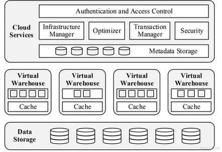
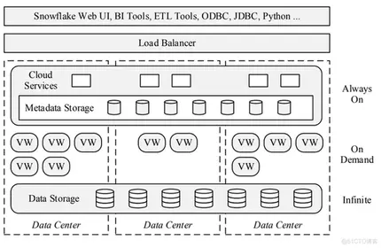
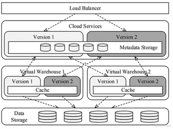
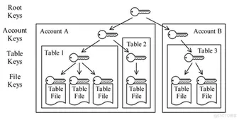
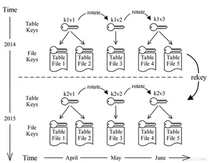

# The Snowflake Elastic Data Warehouse


## 摘要

我们生活在分布式计算的黄金时代。公有云平台几乎能够按需提供无限的计算和存储资源。同时，SaaS模型(Software-as-a-Service)将企业级系统带给了无法负担成本和相关系统复杂性的用户。传统的数仓系统正在努力的适应新的环境，但是首先，它是为固定资源而设计，从而没办法利用云的弹性能力。另外，传统的数仓依赖复杂的ETL流水线和物理调优，这个是和云的半结构数据和快速解决工作问题的新形式所需要的弹性和快速不一致的。

我们决定进行根本性的重新设计。我们的任务是去建立云上的企业级数据仓库的解决方案。就是Snowflake弹性数据仓库，简称Snowflake。Snowflake是一种多租户、事务性、安全、高度可扩展的弹性系统，具备完整的SQL支持和半结构化和schema-less数据模式支持。Snowflake在亚马逊云上提供现付即用的服务。用户只需将数据导入云上，就可以立即利用他们熟悉的工具和界面进行管理和查询。从2012年底，Snowflake开始计划实施，到2015年6月，Snowflake已经可以大体可用。现在，Snowflake被越来越多的大大小小的组织用于生产。这个系统每天运行几百万次查询在几PB的数据上。

本文主要介绍Snowflake的设计、多集群共享数据的结构和Snowflake的关键特性：极致的弹性和可用性、半结构化和schema-less的数据支持、时间旅行、端到端的安全性，最后是一些经验总结和对未来工作的展望。

<!--more-->

## 介绍

云技术的出现标志着软件的发展将从本地服务器上的交付和运行转移到由亚马逊、谷歌或微软等平台提供商提供的共享数据中心和软件即服务的解决方案。云的共享基础设施保证了规模经济，极高的可扩展性和可用性，现收现付成本模式，以便适应不可预测的使用需求。但是，只有当软件本身能够在商品资源池（云）上弹性伸缩时，才能获得这些优势。传统的数据仓库解决方案先于云，被设计成在小型静态集群上运行，这些集群由性能良好的机器组成，这使得传统的数仓在体系结构上不适合云。

但不仅平台发生了变化,数据也发生了变化。过去的情况是，数据仓库中的大多数数据都来自组织内部的数据源事务化：事务系统、企业资源规划（ERP）应用程序、客户关系管理（CRM）应用程序等。数据的结构、数量和速率都是可预测和可知道的。但随着云技术的发展，大量且快速增长的数据来源于不那么可控或外部的来源：应用程序日志、web应用程序、移动设备、社交媒体、传感器数据（物联网）。除了不断增长的数据量，这些数据经常以schema-less、半结构化的格式存储[<sup>3</sup>](#refer-anchor-3)。传统的数据仓库解决方案正在努力处理与这种新的数据。这些解决方案非常依赖于ETL管道和物理调优，但管道和物理调优是假定来自内部的可预测、不易移动且易于分类的数据。

为了应对这些缺点，部分数仓社区已经转向Hadoop或Spark等大数据平台[<sup>8</sup>](#refer-anchor-8)<sup>,</sup>[<sup>11</sup>](#refer-anchor-11)。尽管这些工具对于数据中心规模的处理任务来说是不可或缺的，开源社区也在不断地进行重大改进，如Stinger Initiative（号称让Hive提速100倍）[<sup>48</sup>](#refer-anchor-48)，但它们仍然缺乏现有数仓的效率和功能。但最重要的是，他们需要大量的努力来推广和使用[<sup>16</sup>](#refer-anchor-16)。

我们相信，有很大部分的案例和工作可以从云的经济性、弹性和服务方面获益。但传统的数据仓库技术或大数据平台都不能很好地为它们提供服务。所以我们决定专门为云构建一个全新的数据仓库系统。该系统被称为Snowflake弹性数据仓库，或叫“Snowflake”。与云数据管理领域的许多其他系统不同，Snowflake并不是基于Hadoop、PostgreSQL之类的，处理引擎和其他大部分组件都是从新开发的。

Snowflake的关键特点如下：

- **纯粹的SaaS服务体验** 用户不需要购买机器、雇佣数据库管理员或安装软件。用户要么已经在云中拥有数据，要么上传数据(或者发送邮件[<sup>14</sup>](#refer-anchor-14))。然后，他们可以使用Snowflake的图形界面或ODBC等标准化接口立即操作和查询数据。与其他数据库即服务（DBaaS）产品不同，Snowflake的服务覆盖了整个用户体验。用户无需调优，无需物理设计，无需存储整理任务。
- **关系型** Snowflake几乎完整的支持了ANSI的SQL和ACID的事务。大部分的用户几乎无需改动或者很小的改动就能迁移已经存在的工作内容。
- **半结构化** Snowflake提供了用于遍历、展平和嵌套半结构化数据的内置函数和SQL扩展，并支持JSON和Avro等流行格式。自动模式发现和列式存储使得对schema较少的半结构化数据的操作几乎与对普通关系数据的操作一样快，而无需用户额外的操作。
- **弹性** 存储和计算资源可以独立无缝地扩展，而不影响数据可用性或并发查询的性能。
- **高可用** Snowflake能够容忍节点，集群，甚至全部的数据中心失败。在软件和硬件更新的时候不会下线。
- **持续性** Snowflake的设计具有极高的持续性，可防止意外数据丢失：克隆、下线和跨区域备份。
- **经济节约** Snowflake具有很高的计算效率，所有的表数据都被压缩。用户只为他们实际使用的存储和计算资源付费。
- **安全** 所有数据包括临时文件和网络流量都是端到端加密的。没有用户数据暴露在云平台上。此外，用户能够基于角色在SQL级别执行级别细粒度的访问控制。

Snowflake现在运行在亚马逊云上面，但是未来我们也会支持其他云平台。在写这篇文档的同时，Snowflake被大大小小的组织用于生产。每天运行几百万次查询在几PB的数据上。

**大纲** 论文结构如下：第2节解释了Snowflake背后的关键设计：存储和计算的分离。第3节介绍了由此产生的多集群共享数据体系结构。第4节重点介绍了不同的特性：连续可用性、半结构化和schema-less数据、时间旅行和克隆以及端到端安全性。第5节讨论了相关工作。第6节总结了经验教训，并对正在进行的工作进行了展望。

## 存储与计算

Shared-nothing结构已经成为高性能数据仓库的主流体系结构，主要原因有两个：可扩展性和商用硬件。在Shared-nothing结构中，每个查询处理器节点都有自己的本地磁盘。表是跨节点水平分区的，每个节点只负责其本地磁盘上的行。这种设计可以很好地扩展星型模式查询，因为将一个小的（广播的）维度表与一个大的（分区的）事实表连接起来只需要很少的带宽。而且，由于共享数据结构或硬件资源几乎没有争用，因此不需要昂贵的定制硬件[<sup>25</sup>](#refer-anchor-25)。

在纯粹的Shared-nothing结构中，每个节点都有相同的功能并在相同的硬件上运行。这种方法的结果是很容易理解的具有良好优点的优雅的软件设计。不过，纯粹的Shared-nothing结构有一个重要的缺点：它将计算资源和存储资源紧密耦合，这在某些场景中会导致问题。

- **异构工作负载** 虽然硬件是同样的，但工作负载通常不是。对于大容量加载（高I/O带宽，轻计算）来说，理想的系统配置不适合复杂查询（低I/O带宽，重计算），反之亦然。因此，硬件配置需要在平均利用率较低的情况下进行权衡。
- **节点关系变化** 如果一些节点发生更改，或者是由于节点故障，或者是用户调整系统大小，则大量数据需要重新shuffle。由于相同的节点同时负责数据shuffle和查询，因此会对性能由显著的影响，从而限制了灵活性和可用性。
- **在线升级** 虽然通过副本机制可以在一定程度上减轻节点关系变化更改的影响，但软件和硬件升级最终会影响系统中的每个节点。原则上是可能的，一个又一个节点在没有任何系统停机的情况下进行升级。但是由于所有节点都是紧密耦合的，并且都是同质的，这使得实现在线升级变得非常困难。

在内部部署环境中，通常可以容忍这些问题。工作负载可能是异构的，但是如果只有一个小的、固定的资源池可以运行，那就没有办法了。同样，节点升级很少，节点故障和系统扩容也很少。

云的情况大不相同。像亚马逊EC2这样的平台具有许多不同的节点类型。它们只需简单将数据移动到正确类型的节点，同时，节点故障更为频繁，性能可能会发生巨大变化，甚至在相同类型的节点之间也是如此。因此，节点关系的改变不是偶然，而是常态。最后，有强烈的需求需要在线升级和弹性扩展。在线升级大大缩短了软件开发周期，提高了可用性。弹性伸缩进一步提高了可用性，并允许用户将资源消耗与他们的即时需求相匹配。

因为这样那样的原因，Snowflake做了存储和计算分离。存储和计算由两个松耦合、独立可扩展的服务来处理。计算是通过Snowflake的（专有的）shared-nothing引擎提供的。存储是通过亚马逊S3提供的，其实任何类型的对象存储都可以（Azure 对象存储[<sup>18</sup>](#refer-anchor-18)<sup>,</sup>[<sup>36</sup>](#refer-anchor-36)，Google云存储[<sup>20</sup>](#refer-anchor-20)）。同时，为了减少计算节点和存储节点之间的网络流量，每个计算节点在本地磁盘上缓存了一些表的数据。

存储和计算分离的另一个好处是，本地磁盘空间不用存储整个数据，这些数据可能非常大，而且大部分是冷数据（很少访问）。本地磁盘专门用于临时数据和缓存，两者都是热数据（建议使用高性能存储设备，如ssd）。因此，缓存了热数据，性能就接近甚至超过纯shared-nothing结构的性能。我们称这种新的体系结构为multi-cluster、 shared-data结构。

## 架构

Snowflake是给企业提供现成的服务。除了提供高可用性和操作性之外，企业使用就意味着高可用性。为此，Snowflake是一个面向服务的体系结构，由高度容错和独立可扩展的服务组成。这些服务通过RESTful接口进行通信，分为三个体系结构层：

- **数据存储** 该层使用amazon s3存储表数据和查询结果。
- **虚拟仓库** 系统的"肌肉"。该层通过弹性的虚拟机器集群（称为虚拟仓库），执行查询。
- **云服务** 系统的"大脑"。这一层是管理虚拟仓库、查询、事务和围绕虚拟仓库的所有元数据的服务的集合，包含数据库元信息、访问控制信息、加密密钥、使用情况统计等。

图1展示了Snowflake三个架构层及其主要组件。



### 数据存储

AWS被选为Snowflake的初始平台主要有两个原因。首先，AWS是云平台市场上最成熟的产品。其次（与第一点相关），AWS提供了最大的潜在用户资源。

接下来的选择是使用S3还是基于HDFS或类似的技术开发我们自己的存储服务。我们花了一些时间对S3进行了测试，发现虽然它的性能可能有些不同，但它的可用性、高可用性和强大的持续性有可靠的保证。因此，我们没有开发自己的存储服务，而是决定将精力投入到虚拟仓库层的本地缓存和数据倾斜处理技术上。

与本地存储相比，S3虽然具有更高的访问延迟，每个I/O请求都有更高的CPU开销，特别是在使用HTTPS连接的情况下。但是，S3是一个对象存储，具有一个相对简单的基于HTTP的PUT/GET/DELETE接口。对象（即文件）只能完全写入。甚至不可能将数据附加到文件的末尾。文件的确切大小需要在PUT请求中前就确定。并且，S3支持对部分（范围）文件的GET请求。

这些属性对Snowflake的表文件格式和并发控制方案有很大的影响（参见第3.3.2节）。表被水平地划分成大的、不可变的文件，这些文件相当于传统数据库系统中的块或页。在每个文件中，每个属性或列的值都被分组在一起并进行了大量压缩，这是一种普遍采取的方案，在文献[<sup>2</sup>](#refer-anchor-2)中称为PAX或hybrid columnar。每个表文件都有一个表头，其中包含文件中每列的偏移量，以及其他元数据。因为S3允许对部分文件执行GET请求，所以查询只需要下载文件头和它们需要的列。

Snowflake不仅在表数据上使用S3。当本地磁盘空间耗尽时，它还使用S3存储由查询（例如，大量连接）生成的临时数据，以及大型查询结果。将temp数据溢出到S3，系统可以计算任意大的查询，而不会出现内存不足或磁盘不足的错误。将查询结果存储在S3中，实现了客户端交互新方式并简化查询处理，因为它消除了对传统数据库系统中的服务端游标的需要。

元数据，例如catalog信息，由S3文件、统计信息、锁、事务日志等组成，存储在可伸缩的事务KV存储中，这也是云服务的一部分。

### 虚拟仓库

虚拟仓库层由EC2实例集群组成。每个这样的集群通过一个称为虚拟仓库（VW）的抽象呈现给用户。构成虚拟仓库的单个EC2实例称为工作节点。用户不直接与工作节点交互。事实上，用户不需要关心哪个或者多少个工作节点组成了一个虚拟仓库。虚拟仓库按照大家所熟悉的“T恤尺寸”从X-Small到XX-Large不等来标识规模大小。这样的抽象展示允许我们独立于底层云平台来发展服务和定价。

#### 弹性和隔离

VM是纯计算资源，可以按照需求创建、销毁或者在任意时刻改变大小。创建或者销毁一个VM对数据库状态没有任何影响。当没有查询时候，用户可以关闭所有的VM资源。这种弹性容许用户独立于数据层，按照需求动态的伸缩他们的计算资源。

每个查询只在一个VW上运行。工作节点不会在VW之间共享，从而使查询具有强大性能隔离。（也就是说，我们将工作节点共享视为未来工作的一个重要领域，因为对于性能隔离不太重要的用例，它将实现更高的利用率和更低的成本。）

提交新查询时，相应VW中的每个worker节点（或者如果优化器检测到一个小查询，则为节点的子集）生成一个新的worker进程。每个工作进程只在其查询时间内工作。worker进程本身，即使有update语句，不会对外部可见造成影响，因为表文件是不可变的，参见第3.3.2节。因此，worker故障很容易被控制，并且通过重试来解决。不过，Snowflake目前不支持部分重试，因此非常大的、长时间运行的查询是一个值得关注的领域和未来的工作。

每个用户可以在任何给定的时间运行多个VW，而每个VW又可以运行多个并发查询。每个VW都可以访问相同的共享表，而无需物理复制数据。

共享的无限存储意味着用户可以共享和集成所有数据，这是数据仓库的核心原则之一。同时，用户受益于私有计算资源，避免了不同工作和组织的干扰，这也是数据集市的原因之一。这种弹性和隔离使得一些新的使用策略成为可能。对于Snowflake用户来说，通常有几个VM用于来自不同组织的查询，通常是连续运行的，并按需定期启动VM，例如批量加载。

另一个与弹性有关的重要结果是，通常可以用大致相同的价格获得更好的性能表现。例如，在具有4个节点的系统上，数据加载需要15小时，而在具有32个节点的系统上，数据加载可能只需要2小时。由于计算时间是付费的，所以总体成本非常相似，但用户体验却截然不同。因此，我们相信弹性是Snowflake架构最大的优点和区别之一，因为需要一种新颖的设计来利用云的独特功能。

#### 本地缓存和文件窃取

每一个worker节点在本地磁盘上缓存了一些表数据。缓存的文件是一些表文件，即节点过去访问过的S3对象。准确地说，缓存保存文件头和文件的各个列，因为查询只下载它们需要的列。

缓存在工作节点的工作时间内有效，并在并发和后续工作进程（即查询）之间共享。它只是一个文件流和列请求，并遵循一个简单的最近最少使用（LRU）替换策略，而忽略了单个查询。这个简单的方案效果比较好，但是我们将来可能会改进它，以便更好地匹配不同的工作。

为了提高命中率并避免VW的工作节点之间对单个表文件进行冗余缓存，查询优化器使用表文件名上[<sup>31</sup>](#refer-anchor-31)的一致哈希将输入文件集分配给工作节点。因此，访问同一表文件的后续查询或并发查询将在同一工作节点上执行。

Snowflake中一致的hash是lazy的。当工作节点由于节点故障或VW调整大小而更改时，不会立即对数据进行shuffle。相反，Snowflake依赖LRU替换策略最终替换缓存内容。此解决方案将替换缓存内容的成本分摊到多个查询上，从而获得比立即缓存或纯shared-nothing系统更好的可用性，后者需要立即在节点之间shuffle大量表数据。它简化了系统，因为没有“降级”模式。

除了缓存，倾斜处理在云数据仓库中尤为重要。由于虚拟化问题或网络争用，某些节点的执行速度可能比其他节点慢得多。在这点上，Snowflake在扫描文件的时候就处理了这个问题。每当工作进程完成对其输入文件集的扫描时，它就会从其对等进程请求其他文件，我们称之为文件窃取。当请求到达时，如果一个worker发现它的输入文件集合中还有许多文件要处理，这个时候又有其他worker请求帮助，这个worker将这个请求中他需要的查询的范围内的一个剩余文件的处理权力转移给其他worker。然后其他worker直接从S3下载文件，而不是从这个worker下载。这种设计确保了文件窃取不会给当前worker增加额外的处理负担。

#### 执行引擎

如果一个1000个节点的系统执行一个查询，而另一个系统可以使用10个这样的节点就可以用同样时间完成这个查询，那么这个系统就没有什么价值了。因此，虽然可伸缩性是首要的，但每个节点的效率同样重要。我们希望给用户提供市场上任何数据库服务产品中最好的性价比，因此我们决定实现我们自己的SQL执行引擎。我们构建的引擎是列式的、向量化的和基于push的。

- **列式存储** 列式存储和执行通常被认为优于行式存储和执行，因为它更有效地使用了CPU缓存和SIMD指令，并且更有可能进行（轻量级）压缩[<sup>1</sup>](#refer-anchor-1)<sup>,</sup>[<sup>33</sup>](#refer-anchor-33)。

- **向量化执行** 与MapReduce相比[<sup>42</sup>](#refer-anchor-42)，Snowflake避免了中间结果的物化。相反，数据是以pipeline方式处理的，每次以列成批处理几千行。这种方法由VectorWise（最初是MonetDB/X100[<sup>15</sup>](#refer-anchor-15)）首创，这能节省了I/O并大大提高了缓存效率。

- **基于push的执行** 指关系运算符将结果推送到其下游运算符，而不是等待这些运算符拉取数据（经典的火山式模型）。Push-based提高了缓存效率，因为他消除了循环中的控制逻辑[<sup>41</sup>](#refer-anchor-41)。它还使Snowflake能够高效地处理DAG形式的计划，而不仅仅是树的结构，从而可能更好的采用共享和管道化的方式利用中间结果。

同时，传统查询处理中的许多开销在Snowflake中并不存在。需要注意的点，在执行时候不需要事务管理。就引擎而言，查询是针对一组固定的不可变文件执行的。此外，没有缓冲池。大多数查询扫描大量数据。这里没有使用内存进行表缓冲和操作。不过，Snowflake，在内存耗尽时，允许所有主要操作（join、group by、sort）溢写到磁盘。纯内存引擎虽然更精简，也许更快，但它的限制性太强，无法处理所有的查询情况。分析型工作有的时候会有大量的join或aggregation。

### 云服务

虚拟仓库是临时的、特定于用户的资源。相比，云服务层在很大程度上是多租户的。这一层的每个服务访问控制、查询优化器、事务管理器和其他服务都是长期存在的，并在许多用户之间共享。多租户提高了利用率并减少了管理开销，这比传统体系结构中每个用户都有一个完全私有的系统在体系结构上具有更好的规模经济。

每个服务都被复制以实现高可用性和可扩展性。因此，单个服务节点的故障，可能导致某些正在运行的查询可能会失败（并透明地重新执行），但是不会导致数据丢失或可用性下降。

#### 查询管理和优化

用户所有查询都通过云服务层。云服务层处理查询生命周期的所有早期阶段：解析、对象解析、访问控制和计划优化。

Snowflake的查询优化器遵循典型的层叠式方法[<sup>28</sup>](#refer-anchor-28)，采用自顶向下的基于成本的优化。所有用于优化的统计信息都会在数据加载和更新时自动维护。由于Snowflake不使用索引（参见第3.3.3节），因此执行计划搜索的空间会比其他一些系统更小。通过将许多决策下推到执行时候（例如连接的数据分布类型），执行计划搜索的空间进一步减少。这种设计减少了优化器做出的错误优化，以峰值性能的小损失为代价增加了健壮性。它还使系统更易于使用（性能变得更可预测），这与Snowflake对服务体验的整体关注是一致的。

优化器完成后，生成的执行计划将分发给部分查询节点。当查询执行时，云服务会不断跟踪查询的状态，收集性能指标并检测节点故障。所有查询信息和统计信息都存储起来，进行审计和性能分析。用户可以通过Snowflake图形界面监视和分析之前和正在进行的查询。

#### 并发控制

如前所述，并发控制完全由云服务层处理。Snowflake是为分析工作而设计的，这些工作往往会有大量读取、批量或随机插入以及批量更新。与大多数系统一样，我们决定通过快照隔离(Snapshot Isolation，SI)[<sup>17</sup>](#refer-anchor-17)实现ACID事务。

在SI下，事务的所有读取都会看到事务启动时数据库的一致快照。通常，SI是在多版本并发控制（MVCC）之上实现的，这意味着每个更改的数据库对象的一个副本都会保留一段时间。

MVCC是一个自然的选择，因为表文件是不可变的，这是使用S3存储的结果。只有将文件替换为包含更改的其他文件，才能对文件进行更改。因此，表上的写操作（insert、update、delete、merge）通过添加和删除相对于上一个表版本的整个文件来生成新版本的表。在元数据（在全局键值存储中）中跟踪文件的添加和删除，这种形式对属于特定表版本的文件集计算非常高效。

除了SI之外，Snowflake还使用这些快照来实现时间旅行和数据库对象的高效复制，详细信息请参见第4.4节。

#### 剪枝优化

限制对给定查询数据的访问是查询处理最重要的方面之一。从历史上看，数据库中的数据访问是通过使用B+树或类似数据结构形式的索引来限制的。虽然这种方法被证明对事务处理非常有效，但对于像Snowflake这样的系统，它会引发多个问题。首先，它严重依赖随机访问，由于存储介质（S3）和数据格式（压缩文件），这将是一个问题。其次，维护索引显著增加了数据量和数据加载时间。最后，用户需要显式地创建索引，这与Snowflake的纯服务方法不一样。即使在调优人员的帮助下，维护方面也可能是一个复杂、昂贵有风险的过程。

另一种技术最近在大规模数据处理中得到了广泛应用：基于最小-最大值的修剪，也称为小物化聚合[<sup>38</sup>](#refer-anchor-38)、区域映射[<sup>29</sup>](#refer-anchor-29)和数据跳跃[<sup>49</sup>](#refer-anchor-49)。这里，系统维护给定数据块（记录集、文件、块等）的数据分布信息，特别是块内的最小值和最大值。根据查询谓词的不同，这些值可用于确定给定查询可能不需要给定的数据块。例如，假设文件f1和f2在某个列x中分别包含值3…5和4…6。然后，如果查询有一个谓词，`Where x>=6`，我们就知道只需要访问f2。与传统索引不同，这种元数据通常比实际数据小几个数量级，因此存储开销小，访问速度快。

剪枝优化很好地符合Snowflake的设计原则：它不依赖于用户输入；它可以很好地扩展；并且易于维护。更重要的是，它可以很好地对大数据块进行顺序访问，并且在加载、查询优化和查询执行时间方面增加的开销很小。

Snowflake不断地为每个单独的表文件做相关元数据的剪枝优化。元数据不仅包括普通的关系列，还包括半结构化数据中自动检测的列的选择，参见第4.3.2节。在优化过程中，根据查询谓词检查元数据，以减少（“删减”）查询执行的输入文件集。优化器不仅对简单的基值谓词执行修剪，还对更复杂的表达式 如`WEEKDAY(orderdate) IN (6, 7)`执行剪枝优化。

除了静态剪枝，Snowflake还在执行过程中执行动态剪枝。例如，作为hash join处理的一部分，Snowflake收集有关build-side记录中join key分布的统计信息。然后将此信息推送到probe-side，并用于过滤probe side的整个文件，甚至可能跳过这些文件。除此之外，还使用其他技术，如bloom joins [<sup>40</sup>](#refer-anchor-40)。

## 亮点功能

Snowflake提供了关系型数仓所期望的许多特性：全面的SQL支持、ACID事务、标准接口、稳定性和安全性、用户支持，当然还有强大的性能和可扩展性。此外，它还引入了一些在相关系统中很少或没有的其他有价值的特性。本节介绍了其中一些我们认为有技术区别的特性。

### 纯粹的SaaS体验

Snowflake支持标准数据库接口（JDBC、ODBC、Python-PEP-0249），并与各种第三方工具和服务（如Tableau、Informatica或Looker）集成。它还提供了只使用web浏览器与系统交互。一个WebUI是一个关键的区别。WebUI使得从任何位置和环境访问Snowflake都非常容易，大大降低了引导和使用系统的复杂性。由于云中已有大量数据，它允许许多用户只需将Snowflake指向自己的数据并进行查询，而无需下载任何软件。

正如想的那样，UI可以SQL操作，还可以访问数据库目录、用户和系统管理、监视、使用信息等。我们不断扩展UI功能，致力于在线协作、用户反馈和支持等方面的工作。

但我们对易用性和服务体验的关注并不仅仅局限于用户界面，它还扩展到了系统架构的各个方面。没有故障模式，没有调优要求，没有物理设计，没有存储整理任务。一切都是关于数据和查询的。

### 持续可用性

在过去，数仓的解决方案一般是局域网内的隐藏较好的后端系统，与世界上大部分的网络隔离的。在这种环境中，计划内（软件升级或管理任务）和计划外（故障）的停机时间通常不会对操作产生很大影响。但是，随着数据分析对越来越多的业务任务变得至关重要，持续可用性成为数仓的一个重要需求。这一趋势反映了人们对现代SaaS系统的期望，要始终处于运行状态，应用程序没有（计划内）停机时间。

Snowflake提供了满足这些期望的连续可用性。这方面的两个主要技术是故障恢复能力和在线升级能力。

#### 故障恢复能力



Snowflake在体系结构的所有级别上都能容忍单个和相关的节点故障，如图2所示。如今，Snowflake的数据存储层是S3，它跨多个数据中心进行复制，在Amazon术语中称为“可用性区域”（availability zones）或AZs。跨AZs的复制允许S3处理完整的AZ故障，并保证99.99%的数据可用性和99.999999999%的持久性。与S3的体系结构相匹配，Snowflake的元数据存储也在多个AZ之间分布和复制。如果一个节点发生故障，其他节点可以在不影响最终用户的情况下接管任务。云服务层的其余服务由多个AZ中的无状态节点组成，负载均衡器负责分发用户请求。因此，单个节点故障甚至是完全的AZ故障都不会对系统范围造成影响，可能是对当前连接到故障节点的用户的一些失败查询。这些用户将被重定向到另一个节点进行下一次查询。

相比之下，虚拟仓库(VM)并不分布在AZs中。这个选择是出于性能考虑。高吞吐是分布式查询执行的关键，而在同一个AZ中，网络吞吐量要高得多。如果其中一个工作节点在查询执行期间失败，则查询会失败，但会透明地重新执行，要么立即替换该节点，要么暂时减少节点数。为了加速节点更换，Snowflake维护了一个小的备用节点池。（这些节点还用于快速VW配置。）

如果全部的AZ变得不可用，那么在该AZ的给定VW上运行的所有查询都将失败，并且用户需要在不同的AZ中主动重新配置VW。由于全部的AZ故障是真正的灾难性和极为罕见的事件，我们今天接受这种部分系统不可用的情况，但希望在将来解决它。

#### 在线升级能力

Snowflake不仅在发生故障时提供连续可用性，而且在软件升级期间也提供连续可用性。系统的设计允许同时部署服务的多个版本，包括云服务组件和虚拟仓库。这是因为所有服务实际上都是无状态的。所有的状态都保存在事务性KV存储服务中，并通过映射层进行访问，映射层负责元数据版本控制和模式演化。每当我们更改元数据模式时，我们都会确保与以前的版本向后兼容。

为了执行软件升级，Snowflake首先将新版本的服务与以前的版本一起部署。然后，用户帐户逐渐切换到新版本，这个时候，相应用户发出的所有新查询都被定向到新版本。同时，保证以前版本的所有查询都完成。一旦所有查询和用户在以前的版本没有查询后，以前版本的所有服务都将被终止和停用。



图3显示了正在进行的升级过程的快照。有两个版本的Snowflake运行并排，版本1（亮）和版本2（暗）。云服务有两个版本，控制两个虚拟仓库（vw），每个都有两个版本。负载平衡器将传入的请求定向到云服务的适当版本。一个版本的云服务只与一个匹配版本的通信。

如前所述，两个版本的云服务共享相同的元数据存储。此外，不同版本的vw能够共享相同的工作节点及其各自的缓存。因此，升级后不需要重新填充缓存。整个过程对用户是透明的，没有停机或性能下降。

在线升级也对我们的开发速度，以及如何处理Snowflake的关键bug产生了巨大的影响。在撰写本文时，我们每周升级一次所有服务。这意味着我们每周都会发布功能和改进。为了确保升级过程顺利进行，升级和降级都在一个特殊的预生产的Snowflake副本不断测试。在极少数情况下，如果我们在产品中发现了一个严重的bug（不一定是在升级过程中），我们可以很快地将其降级到以前的版本，或者实施一个修复程序并执行一个超出原计划的升级。这个过程并不像听起来那么可怕，因为我们不断地测试和使用升级/降级机制。这是高度自动化的和并且严格的。

### 半结构化和Schema-Less的数据

Snowflake将标准SQL类型系统扩展为三种半结构化数据类型：VARIANT、ARRAY和OBJECT。VARIANT类型的值可以存储本地SQL类型的任何值（DATE、VARCHAR等），也可以存储可变长度的数组，以及类似JavaScript的对象，字符串到VARIANT值的映射。后者在文献中也被称为documents，由此产生了文档存储的概念（MongoDB[<sup>39</sup>](#refer-anchor-39)，Couchbase[<sup>23</sup>](#refer-anchor-23)）。

数组和对象只是类型VARIANT的严格形式。内部表示是相同的：一个自描述的紧凑二进制序列化类型，它支持快速的键值查找，以及高效的类型测试、比较和hash。因此，VARIANT列可以像其他列一样用作join keys、gourping keys和ordering keys。

VARIANT类型允许Snowflake以ELT（Extract-Load-Transform）方式使用，而不是以传统的ETL（Extract-Transform-Load）方式使用。不需要指定数据的schema或在加载时进行转换。用户可以将JSON、Avro或XML格式的输入数据直接加载到变量列中；Snowflake处理解析和类型推断（参见第4.3.3节）。这种方法在文献中被恰当地称为"schema later"，它允许通过将信息生产者与信息消费者和任何中介分离来解决schema问题。相反，传统ETL管道中数据schema的任何更改都需要组织中多个部门之间的协调，这可能需要数月的时间来执行。

ELT和Snowflake的另一个优点是，以后如果需要转换，可以使用并行SQL数据库查询功能来执行转换，包括连接、排序、聚合、复杂谓词等操作，这些操作在传统ETL工具链中通常缺失或效率低下。在这一点上，Snowflake还具有自定义函数（udf），支持完整的JavaScript语法，并与VARIANT数据类型集成。对udf的支持进一步增加了可以在Snowflake中执行的ETL任务的数量。

#### 后关系执行

对数据最重要的操作是提取数据元素，可以按字段名（对于对象）提取，也可以按偏移量（对于数组）提取。Snowflake提供了函数式SQL和类JavaScript的路径标识来支持。内部编码也使得提取非常高效。子元素只是父元素中的指针;不需要复制。提取之后通常会将结果VARIANT值转换为标准SQL类型。同样，编码也使强制转换非常有效。

第二种常见操作是展平数据，即将嵌套结构旋转到多行中。Snowflake使用SQL横向视图来表示展开操作。这种扁平化可以是递归的，允许将文档的层次结构完全转换为一个适合SQL处理的关系表。与展平相反的操作是聚合。Snowflake为此引入了一些新的聚合和分析函数，如`ARRAY_AGG`和`OBJECT_AGG`。

#### 列存及处理

将半结构化数据序列化（二进制）是将半结构化数据集成到关系数据库中的常规选择。不好的方面是，行存储的处理效率一般低于列存储，所以列式关系数据一般会将半结构化数据转换为关系数据。

Cloudera Impala[<sup>21</sup>](#refer-anchor-21)（使用Parquet[<sup>10</sup>](#refer-anchor-10)）和Google Dremel[<sup>34</sup>](#refer-anchor-34)已经证明，半结构化数据的列式存储是可能的，也是有益的。然而，Impala和Dremel（及其外部化BigQuery[<sup>34</sup>](#refer-anchor-34)）要求用户为列式存储提供完整的table schema。为了实现schema-less序列化仍然保持灵活性和列式关系数据库的性能，Snowflake引入了一种新的自动类型推断和列式存储方法。

如第3.1节所述，Snowflake以混合列格式存储数据。在存储半结构化数据时，系统会自动对单个表文件中的文档集合执行统计分析，以执行自动类型推断，并确定哪些（类型化的）类型是常见的。然后从文档中移除相应的列单独存储，单独存储的列使用与本地关系数据相同的列压缩方式。对于这些列，Snowflake甚至会计算物化聚合，以便通过修剪（参见第3.3.3节）使用，就像普通关系数据一样。

在扫描过程中，不同的列可以重新组合成一个VARIANT的列。然而，大多数查询只对原始文档的一部分列感兴趣。在这些情况下，Snowflake会将映射和强制转换表达式下推到scan中，只访问必要的列并将其直接强制转换到目标SQL类型中。

上面描述的优化对于每个表文件都是独立执行的，这使得即使在schema变化的情况下也可以有效地存储和提取。然而，它确实给查询优化带来了挑战，特别是剪枝。假设一个查询在路径表达式上有一个谓词，我们希望使用修剪来限制要扫描的文件集。路径和相应的列可能出现在大多数文件中，但频率仅足以保证某些文件中的元数据。保守的解决方案是简单地扫描没有合适元数据的所有文件。Snowflake通过计算所有路径上的Bloom过滤器（而不是值）来改进此解决方案存在于文件中。这些Bloom过滤器与其他文件元数据一起保存，并在修剪期间由查询优化器进行探测。可以安全地跳过不包含给定查询所需路径的表文件。

#### 乐观转换

由于一些本地SQL类型（尤其是日期/时间值），比如常用的格式（如JSON或XML）中是字符串，因此需要在写入时（插入或更新期间）或读取时（查询期间）将这些值从字符串转换为其实际类型。如果没有schema的提示，这些字符串转换需要在读取时执行，而在以读取为主的查询中，这比在写入期间执行一次转换效率要低。没有类型的数据的另一个问题是缺少合适的元数据进行优化，比如对于日期比较重要。（分析工作通常在日期列上有范围查询。）

但在写入时，自动转换可能会丢失信息。例如，一些字段定义成数字实际上可能不是数字，比如前面填充0的字符串。又比如，看起来像是日期实际上可能是文本内容。Snowflake通过执行乐观数据转换来解决这个问题，并在单独的列中保存转换结果和原始字符串（除非是完全可逆的不保存原始字符串）。如果查询之后需要原始的字符串，则可以轻松地检索或重构。因为有不加载和不访问未使用的列，所以双存储对查询性能的影响是最小的。

#### 性能表现

为了评估列式存储、乐观转换和半结构化数据剪枝对查询性能的综合影响，我们使用TPC-H-like数据集和查询进行了测试。

我们创建了两种类型的数据库模式。首先，一个传统的关系型TPC-H模式。第二种是“schema-less”数据库模式，其中每个表都由一列VARIANT类型组成。然后，我们生成聚集（排序）的SF100和SF1000数据集（分别为100GB和1TB），以纯JSON格式存储数据集（即日期变成字符串），并使用关系数据库模式和schema-less数据库模式将数据加载到Snowflake中。我们没有将schema-less数据的字段、类型提供给系统，也没有进行调优。然后，我们在schema-less数据库定义了一些视图，以便能够对所有四个数据库运行完全相同的TPC-H查询集。（在撰写本文时，Snowflake不使用视图进行类型推断或其他优化。）

最后，我们对这四个数据库运行了所有22个TPC-H查询，使用了一个中等标准的仓库。图4显示了结果。测试结果是通过三次热缓存运行的结果。标准误差是很少，因此省略了。


可以看出，除了两个查询（SF1000上的Q9和Q17）之外，其他所有查询的schema-less存储和查询处理的开销都在10%左右。对于这两个查询，我们确定了慢的原因是join顺序，这是由distinct的已知错误造成的。我们继续改进半结构化数据的元数据收集和查询优化。

总之，对于具有相对稳定和简单模式的半结构化数据（即在实践中发现的大多数机器生成的数据），其查询性能几乎与传统关系数据查询的性能相当，可以直接使用列存储、列执行和修剪的优势，而无需用户优化。 

### 时间旅行和复制

在第3.3.2节中，我们讨论了Snowflake如何在多版本并发控制（MVCC）之上实现快照隔离（SI）。对表的写入操作（插入、更新、删除、合并）通过添加和删除整个文件来生成表的更新版本。

当文件被新版本删除时，它们将保留一段可配置的时间（当前最长为90天）。文件保留允许Snowflake非常高效地读取表的早期版本；也就是说，在数据库上执行时间旅行。用户可以使用方便的AT或BEFORE语法从SQL访问此功能。时间戳可以是绝对时间，相对时间，或者是相对之前查询语句中的时间（由ID引用）。

```sql
Select from my_table at (TIMESTAMP =>’Mon, 01 May 2015 16:20:00 -0700’::timestamp);
Select * from  my_table  at  (OFFSET => -60*5);   -- 5 min ago
Select * from my_table before (STATEMENT =>’8e5d0ca9-005e-44e6-b858-a8f5b37c5726’);
```

一个查询可以查询一个表的多个版本。

```sql
SELECT new.key, new.value, old.value FROM my_table new JOIN my_table AT(OFFSET => -86400) old -- 1 day ago ON new.key = old.key WHERE new.value <> old.value;
```

基于相同的底层元数据，Snowflake引入UNDROP关键字来快速恢复意外删除的表、schemas或整个数据库。

```sql
DROP DATABASE important_db;--whoops!
UNDROP DATABASE important_db;
```

Snowflake还实现了一个我们称之为CLONE的功能，通过新的关键字CLONE来表示。CLONE表可以快速创建具有相同定义和内容的新表，而无需对表文件进行物理复制。CLONE操作只是复制源表的元数据。克隆完成后，两个表引用同一组文件，但此后可以独立修改这两个表。CLONE特性还支持整个schemas或数据库，这是非常高效的快照。在进行大量更新之前，或者在执行较为复杂的探索性数据分析时，快照是一种很好的做法。CLONE关键字甚至可以与AT和BEFORE组合使用，这样就可以在事后创建快照。

```sql
CREATE DATABASE recovered_db CLONE important_db BEFORE( STATEMENT => ’8e5d0ca9-005e-44e6-b858-a8f5b37c5726’);
```

### 安全性

Snowflake旨在保护用户数据免受包括云平台在内的系统级别的攻击。为此，Snowflake实现了双因素身份验证（客户端）加密数据导入和导出、安全数据传输和存储以及基于角色的数据库对象访问控制（RBAC[<sup>26</sup>](#refer-anchor-26)）。在任何时候，数据在通过网络发送之前以及在写入本地磁盘或共享存储（S3）之前都是加密的。因此，Snowflake提供了完整的端到端数据加密和安全性。

#### 密钥层次结构

Snowflake使用了加密性强的AES 256位加密，其分层密钥模型植根于AWS CloudHSM。加密密钥会key rotation并rekeying（"重新加密"），以确保密钥完成整个NIST 800-57加密密钥管理生命周期。加密和密钥管理对用户完全透明，不需要用户配置或管理。

Snowflake秘钥层次结构（如图5所示）有四个级别：根秘钥、帐户秘钥、表秘钥和文件秘钥。每层（父）密钥加密，即将下面的（子）密钥层包装起来。每个帐户键对应一个用户帐户，每个表秘钥对应一个数据库表，每个文件秘钥对应一个表文件。

分层密钥模型是很好的安全实践，因为它们限制了每个密钥保护的数据量。如图5中的框所示，每一层都缩小了它下面的键的范围。Snowflake的分层密钥模型确保了多租户体系结构中用户数据的隔离，因为每个用户帐户都有一个单独的帐户密钥。



#### 密钥的生命周期
每个密钥保证了保护的数据量，Snowflake还保证了密钥可用时间。加密密钥经历四个阶段：

- (1) 操作前创建阶段
- (2) 操作阶段，其中密钥用于加密（发起者使用期）和解密(接收者使用期)
- (3) 操作后阶段，其中密钥不再使用，
- (4) 销毁阶段。阶段1、3和4的实现非常简单。第2阶段需要限制发起者和接收者的使用期限。只有当一个密钥不再加密任何所需的数据时，它才能转到第3和第4阶段。Snowflake使用key rotation限制发起者的使用周期，使用rekeying限制收件人的使用周期。


**key rotation** 以固定的间隔（例如，一个月）创建秘钥的新版本。在每个这样的间隔之后，将创建密钥的新版本，并且密钥的先前版本将“失效”。失效的版本仍然可用，但仅用于解密数据。在密钥层次结构中包装新的子密钥或写入表时，仅使用密钥的最新活动版本来加密数据。

**rekeying** 是用新密钥重新加密旧数据的过程。在特定的时间间隔（例如，一年）之后，使用失效密钥加密的数据将使用活动密钥重新加密。rekeying和key rotation不存在冲突。key rotation可确保密钥从活动状态（发起方使用）转移到失效状态（接收方使用），rekeying可确保密钥从失效状态转移到销毁状态。



图6显示了单个表秘钥的生命周期。假设每个月轮换一次秘钥，每年重新设置一次数据秘钥。表文件1和表文件2是在2014年4月创建的，使用键1版本1（k1v1）。2014年5月，将key1旋转为版本2（k1v2），并使用k1v2创建表文件3。2014年6月，key1被旋转到版本3（k1v3），并创建了另外两个表文件。2014年6月之后，不再对表进行插入或更新。2015年4月，k1v1已满一年，需要销毁。将创建一个新密钥，即密钥2版本1（k2v1），并使用k2v1重新设置与k1v1关联的所有文件的密钥。2015年5月，k1v2也发生了同样的情况，表文件3使用k2v2重新键入。2015年6月，表文件4和表文件5使用k2v3重新设置了密钥。

在帐户秘钥和表秘钥之间以及根秘钥和帐户秘钥之间实现了类似的方案。秘钥层次的每一级都会经历key rotation和rekeying，包括根秘钥。帐户密钥和根密钥的key rotation和rekeying不需要对文件进行重新加密。只需要重新加密较低级别的密钥。

不过，表秘钥和文件秘钥之间的关系是不同的。文件秘钥不由表秘钥包装。相反，文件密钥是从表密钥和（唯一的）文件名的组合加密派生的。因此，每当表密钥更改时，其所有相关的文件密钥都会更改，因此需要对受影响的表文件重新加密。然而，密钥派生的最大好处是，它消除了创建、管理和传递单个文件密钥的需要。像Snowflake这样的系统处理数十亿个文件，不然就必须处理GB级别的文件密钥。

我们选择这种设计也是因为Snowflake将存储和计算分离，它可以在不影响用户工作的情况下执行重新加密。rekeying是后台线程，rekeying与查询在不同的节点。在文件被重新加密之后，Snowflake会自动更新数据库表的元数据，以指向新加密的文件。所有正在进行的查询完成后，旧文件将被删除。

#### 端到端的安全性

Snowflake使用AWS CloudHSM作为防篡改、高度安全的方法来生成、存储和使用密钥层次结构的根密钥。AWS CloudHSM是一组硬件安全模块（hsm），它们连接到AWS中的虚拟私有集群。根密钥永远不会离开HSM设备。所有使用根密钥的加密操作都在HSMs本身中执行。因此，在未经授权访问HSM设备的情况下，不能打开较低级别的密钥。hsm还用于在帐户和表级别生成秘钥，包括在秘钥rotation和重建秘钥控期间。我们使用其高可用性配置中配置了AWS CloudHSM，从而保证最小化服务中断。

除数据加密外，Snowflake还通过以下方式保护用户数据：

- 1.通过访问S3时运用隔离存储策略。
- 2.用户帐户中基于角色的访问控制，用于对数据库对象进行细粒度的访问控制。
- 3.加密的数据导入和导出，云提供商（Amazon）也不知道数据的具体内容。
- 4.用于安全访问控制的双因素和联合身份验证。

总之，Snowflake提供了一个植根于AWS CloudHSM的分层密钥模型，并使用key rotation和rekeying来确保加密密钥遵循标准化的生命周期。密钥管理对用户完全透明，不需要配置、管理或下线。它是全面的安全策略的一部分，该策略支持完全的端到端加密和安全性。

## 相关工作

基于云的并行数据库系统。Amazon有许多DBaaS产品，其中amazon redshift是数仓产品。从并行数据库系统ParAccel演变而来，Redshift可以说是第一个真正的数据仓库系统，作为一种服务提供。Redshift使用了一个经典的 shared-nothing架构。因此，在可伸缩的同时，添加或删除计算资源需要重新分配数据。相比之下，Snowflake的多集群共享数据体系结构允许用户在不移动数据的情况下，立即从存储中独立地放大、缩小甚至暂停计算，包括跨孤立计算资源集成数据的能力。另外，遵循纯服务原则，Snowflake不需要物理调优、数据整理、手动收集表统计信息，也不需要用户进行表清理。尽管Redshift可以将JSON之类的半结构化数据作为VARCHAR来接收，但Snowflake对半结构化数据具有本地支持，包括列式存储这样重要的优化。

Google的云平台提供了一个完全托管的查询服务BigQuery，这是Dremel的实现。BigQuery服务允许用户快速在数TB的数据上运行查询，并在数千个节点上并行化。Snowflake的灵感之一是BigQuery对JSON和嵌套数据的支持，我们发现这是现代分析平台所必需的。但是，虽然BigQuery提供了一种类似SQL的语言，但它与ansi sql语法和语义有一些基本的偏差，这使得它很难与基于SQL的产品一起使用。此外，BigQuery表只能追加数据，需要schemas。相比之下，Snowflake提供了完整的DML（insert、update、delete、merge）、ACID事务，并且不需要对半结构化数据进行schema定义。

Microsoft SQL数据仓库（Azure SQL DW）是Azure云平台和基于SQL Server及其分析平台系统（APS）最新添加的服务应用。类似于Snowflake，它将存储和计算分开。计算资源可以通过数据仓库单元（DWU）进行扩展。但是并发的程度是有限制的。对于任何数据仓库，并发执行的查询的最大数量是32。相比之下，Snowflake通过虚拟仓库可以完全独立地扩展并发工作。Snowflake用户不需要分发密钥和管理其他任务。尽管Azure SQL DW确实支持通过PolyBase对非关系数据进行查询，但它不支持类似Snowflake对半结构化数据的VARIANT类型和相关优化。

文档存储和大数据。MongoDB、Couchbase Server和Apache Cassandra等文档存储近年来越来越受到应用程序开发人员的欢迎，因为它们提供了可伸缩性、简单性和灵活的schema。然而，这些系统的简单key value和CRUD（create、read、update和delete）的API带来的一个挑战是难以表达更复杂的查询。我们看到了一些类似SQL的查询语言的出现，比如用于Couchbase的N1QL或用于apache cassandra的CQL。此外，许多“大数据”引擎现在支持了对嵌套数据的查询，例如Apache Hive、Apache Spark、Apache Drill、Cloudera Impala和Facebook Presto。我们相信，这显示了对schema-less和半结构化数据的复杂分析的真正需求，而我们的半结构化数据支持正是受到许多此类系统的启发。通过使用schema推测、乐观转换和列存储，Snowflake将这些系统的灵活性与面向列的关系数据库的存储效率和执行速度结合了起来。

## 经验和展望
当Snowflake在2012年成立时，数据库方面完全专注于Hadoop上的SQL，在短时间内出现了十几个系统。当时，决定朝着一个完全不同的方向努力，为云构建一个“经典”的数据仓库系统，似乎是一个冒险的举动。经过三年的发展，我们相信这是一个正确的。Hadoop并没有取代关系型数据库，而是对它们进行了补充。人们仍然想要一个关系数据库，它需要更高效、更灵活，更适合于云计算。

Snowflake实现了我们的希望，即为云构建的系统可以为其用户提供一些功能。弹性的多集群共享数据体系结构改变了用户处理数据任务的方式。SaaS模式不仅让用户很容易试用和采用该系统，而且极大地帮助了我们的开发和测试。通过单一的生产版本和在线升级，我们能够发布新功能、提供改进和修复问题，比传统开发模式下的速度要快得多。

虽然我们希望半结构化扩展被证明是有用的，但我们对采用的速度感到惊讶。我们发现了一个非常流行的模型，在该模型中，组织将使用Hadoop实现两个功能：存储JSON，以及将其转换为可以加载到RDBMS中的格式。通过提供一个能够高效存储和处理半结构化数据的系统，我们发现Snowflake不仅取代了传统的数据库系统，而且还可以取代Hadoop集群。

当然，这不是一次无痛的旅行。虽然我们的团队拥有超过100年的数据库开发经验，但我们在开发过程中确实犯了一些完全可以避免的错误，包括一些关系运算符的早期实现过于简单化，没有在引擎的早期集成所有数据类型，对资源管理的关注不够早，全面的日期和时间函数功能的延迟推出。同时，我们对避免调优的持续关注引发了一系列工程挑战，最终带来了许多令人兴奋的技术解决方案。因此，如今，Snowflake只有一个调优参数：用户想要多少性能（并愿意为此付费）。

虽然Snowflake的性能已经非常有竞争力，特别是考虑到没有调优方面，但是我们知道有很多优化我们还没有时间去做。但有些出乎意料的是，对我们的用户来说，核心性能几乎从来都不是问题。原因是通过虚拟仓库进行弹性计算可以提供偶尔需要的性能提升。这使我们把发展方向集中在系统的其他方面。

我们面临的最大技术挑战与SaaS和系统的多租户方面有关。构建一个能够同时支持数百个用户的元数据层是一项非常具有挑战性和复杂的任务。处理各种类型的节点故障、网络故障和服务支持是一场永无止境的战斗。安全性一直是并将继续是一个大话题：保护系统和用户的数据免受外部攻击。维护一个每天运行数百万条查询的数百个节点的实时系统，会很有成就感，同时也需要一种高度集成的开发、操作和支持的方法。

Snowflake用户继续向系统抛出越来越大、越来越复杂的问题，会决定系统的发展。我们目前正致力于通过提供额外的元数据结构和数据重新组织来提高数据访问性能，重点是最小化或无用户交互。我们继续改进和扩展核心查询处理功能，包括标准SQL和半关系化数据结构的扩展。我们计划进一步改进倾斜处理和负载平衡策略，其重要性随着用户工作的规模而增加。我们致力于简化用户的工作管理，使系统更具弹性。我们致力于与外部系统的集成，包括数据高频加载等问题。

Snowflake未来面临的最大挑战是向全自助模式的过渡，用户可以在任何阶段注册并与系统交互，而无需我们的参与。它将带来许多安全性、性能和支持方面的挑战。我们期待着这种功能的实现。

## 致谢

Snowflake是大家的共同的产出，不能将人员一一在这里列出。我们要感谢整个Snowflake工程团队为产品所做的贡献，以及他们为产品所付出的辛勤工作、努力和自豪。我们还要感谢所有其他的“Snowflake”们，感谢他们为用户带来这款产品，共同打造一个伟大的公司所做的出色工作。与这样一支优秀的团队合作，我们一直深受感动并感到谦卑。

## 参考

<div id="refer-anchor-1"></div>

- [1] D. J. Abadi, S. R. Madden, and N. Hachem. Column-stores vs. row-stores: How different are they really? In Proc. SIGMOD, 2008.

<div id="refer-anchor-2"></div>

- [2] A. Ailamaki, D. J. DeWitt, M. D. Hill, and M. Skounakis. Weaving relations for cache performance. In Proc. VLDB, 2001.

<div id="refer-anchor-3"></div>

- [3] S. Alsubaiee et al. AsterixDB: A scalable, open source DBMS. PVLDB, 7(14):1905–1916, 2014.
- [4] Amazon Elastic Compute Cloud (EC2). aws.amazon.com/ec2/instance-types.
- [5] Amazon Simple Storage Service (S3). aws.amazon.com/s3.
- [6] Apache Cassandra. cassandra.apache.org.
- [7] Apache Drill. drill.apache.org.

<div id="refer-anchor-8"></div>

- [8] Apache Hadoop. hadoop.apache.org.
- [9] Apache Hive. hive.apache.org.

<div id="refer-anchor-10"></div>

- [10] Apache Parquet. parquet.apache.org.

<div id="refer-anchor-11"></div>

- [11] Apache Spark. spark.apache.org.
- [12] AWS CloudHSM. aws.amazon.com/cloudhsm.
- [13] E. Barker. NIST SP 800-57 – Recommendation for Key Management – Part 1: General (Revision 4), chapter 7. 2016.

<div id="refer-anchor-14"></div>

- [14] J. Barr. AWS Import/Export Snowball – Transfer 1 petabyte per week using Amazon-owned storage appliances.aws.amazon.com/blogs/aws/aws-importexport-snowballtransfer-1-petabyte-per-week-using-amazon-owned-storageappliances/, 2015.

<div id="refer-anchor-15"></div>

- [15] P. Boncz, M. Zukowski, and N. Nes. MonetDB/X100: Hyper-pipelining query execution. In Proc. CIDR, 2005.

<div id="refer-anchor-16"></div>

- [16] V. R. Borkar, M. J. Carey, and C. Li. Big data platforms: What’s next? ACM Crossroads, 19(1):44–49, 2012.

<div id="refer-anchor-17"></div>

- [17] M. J. Cahill, U. R¨ohm, and A. D. Fekete. Serializable isolation for snapshot databases. In Proc. SIGMOD, 2008.

<div id="refer-anchor-18"></div>

- [18] B. Calder et al. Windows Azure Storage: A highly available storage service with strong consistency. In Proc. SOSP, 2011.
- [19] Cassandra Query Language (CQL). cassandra.apache.org/doc/cql3/CQL.html.

<div id="refer-anchor-20"></div>

- [20] Cloud Storage – Google Cloud Platform. cloud.google.com/storage.

<div id="refer-anchor-21"></div>

- [21] Cloudera Impala. impala.io.
- [22] Couchbase N1QL. couchbase.com/n1ql.

<div id="refer-anchor-29"></div>

- [23] Couchbase Server. couchbase.com.
- [24] D. J. DeWitt, A. Halverson, R. Nehme, S. Shankar, J. Aguilar-Saborit, A. Avanes, M. Flasza, and J. Gramling. Split query processing in Polybase. In Proc. SIGMOD, 2013.

<div id="refer-anchor-25"></div>

- [25] D. J. DeWitt, S. Madden, and M. Stonebraker. How to build a high-performance data warehouse. db.csail.mit.edu/madden/high perf.pdf, 2006.

<div id="refer-anchor-26"></div>

- [26] D. Ferraiolo, D. R. Kuhn, and R. Chandramouli. Role-based access control. Artech House Publishers, 2003.
- [27] G. Graefe. Volcano: An extensible and parallel query evaluation system. IEEE TKDE, 6(1), 1994.

<div id="refer-anchor-28"></div>

- [28] G. Graefe. The cascades framework for query optimization. Data Engineering Bulletin, 18, 1995.

<div id="refer-anchor-29"></div>

- [29] G. Graefe. Fast loads and fast queries. In Data Warehousing and Knowledge Discovery, volume 5691 of LNCS. Springer, 2009.
- [30] A. Gupta et al. Amazon Redshift and the case for simpler data warehouses. In Proc. SIGMOD, 2015.

<div id="refer-anchor-31"></div>

- [31] D. Karger, E. Lehman, T. Leighton, R. Panigrahy, M. Levine, and D. Lewin. Consistent hashing and random trees: Distributed caching protocols for relieving hot spots on the world wide web. In Proc. STOC, 1997.
- [32] J. Krueger, M. Grund, C. Tinnefeld, H. Plattner, A. Zeier, and F. Faerber. Optimizing write performance for read optimized databases. In Proc. DASFAA, 2010.

<div id="refer-anchor-33"></div>

- [33] S. Manegold, M. L. Kersten, and P. Boncz. Database architecture evolution: Mammals flourished long before dinosaurs became extinct. PVLDB, 2(2):1648–1653, 2009.

<div id="refer-anchor-34"></div>

- [34] S. Melnik, A. Gubarev, J. J. Long, G. Romer, S. Shivakumar, M. Tolton, and T. Vassilakis. Dremel: Interactive analysis of web-scale datasets. PVLDB, 3(1-2):330–339, 2010.
- [35] Microsoft Analytics Platform System. www.microsoft.com/en-us/server-cloud/products/analytics-platform-system.

<div id="refer-anchor-36"></div>

- [36] Microsoft Azure Blob Storage. azure.microsoft.com/en-us/services/storage/blobs.
- [37] Microsoft Azure SQL DW. azure.microsoft.com/en-us/services/sql-data-warehouse.

<div id="refer-anchor-38"></div>

- [38] G. Moerkotte. Small materialized aggregates: A light weight index structure for data warehousing. In Proc. VLDB, 1998.

<div id="refer-anchor-39"></div>

- [39] MongoDB. mongodb.com.

<div id="refer-anchor-40"></div>

- [40] J. K. Mullin. Optimal semijoins for distributed database systems. IEEE TSE, 16(5):558–560, 1990.

<div id="refer-anchor-41"></div>

- [41] T. Neumann. Efficiently compiling efficient query plans for modern hardware. PVLDB, 4(9):539–550, 2011.

<div id="refer-anchor-42"></div>

- [42] A. Pavlo, E. Paulson, A. Rasin, D. J. Abadi, D. J. DeWitt, S. Madden, and M. Stonebraker. A comparison of approaches to large-scale data analysis. In Proc. SIGMOD, 2009.
- [43] Presto. prestodb.io.
- [44] K. Sato. An inside look at Google BigQuery. cloud.google.com/files/BigQueryTechnicalWP.pdf, 2012.
- [45] J. Schad, J. Dittrich, and J.-A. Quian´e-Ruiz. Runtime measurements in the cloud: Observing, analyzing, and reducing variance. PVLDB, 3(1):460–471, 2010.
- [46] K. Shvachko, H. Kuang, S. Radia, and R. Chansler. The Hadoop distributed file system. In Proc. MSST, 2010.
- [47] SQL DW Concurrency. azure.microsoft.com/en-us/documentation/articles/sql-data-warehouse-develop-concurrency.

<div id="refer-anchor-48"></div>

- [48] Stinger.next: Enterprise SQL at Hadoop scale. hortonworks.com/innovation/stinger.

<div id="refer-anchor-49"></div>

- [49] L. Sun, M. J. Franklin, S. Krishnan, and R. S. Xin. Fine-grained partitioning for aggressive data skipping. In Proc. SIGMOD, 2014.22

