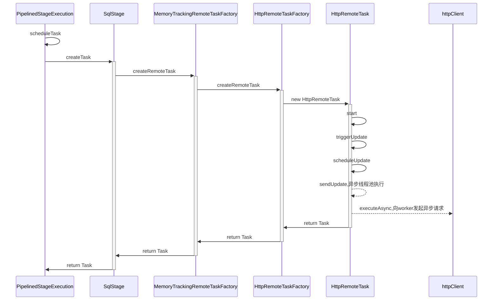
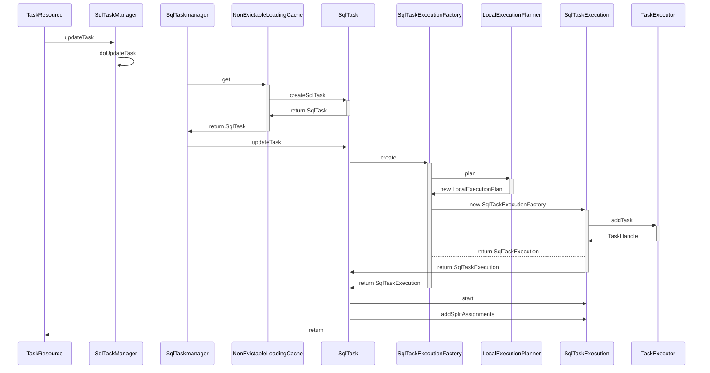
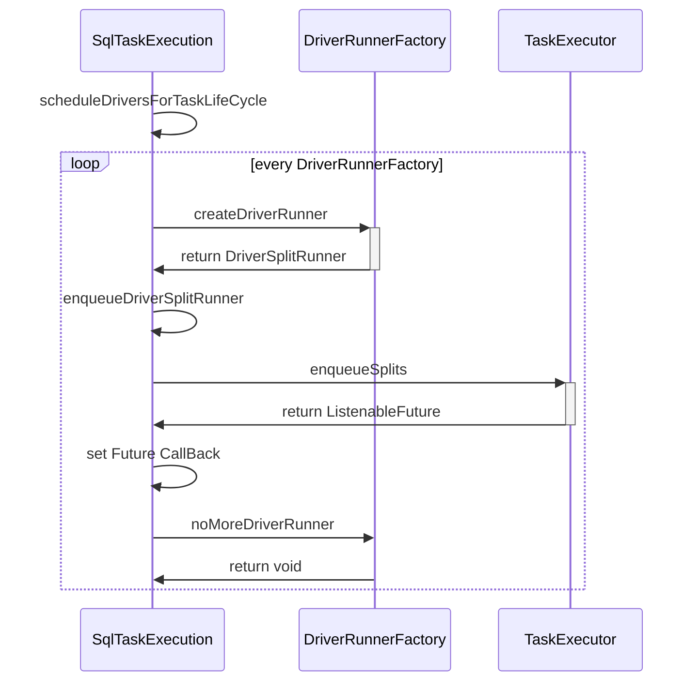
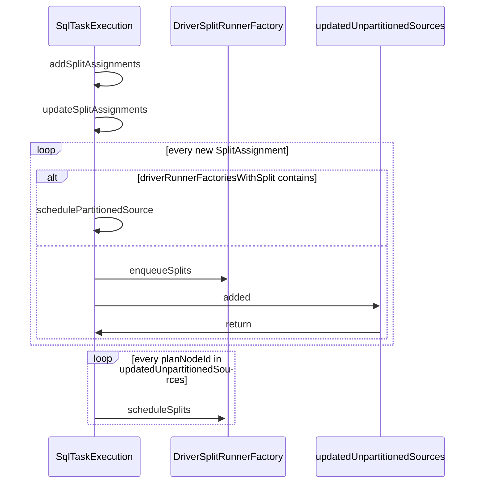
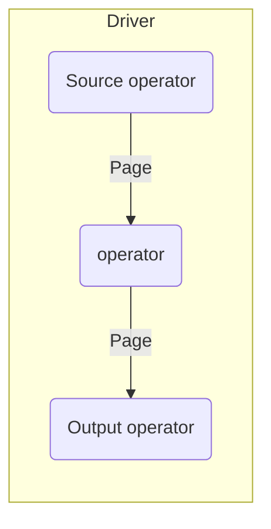
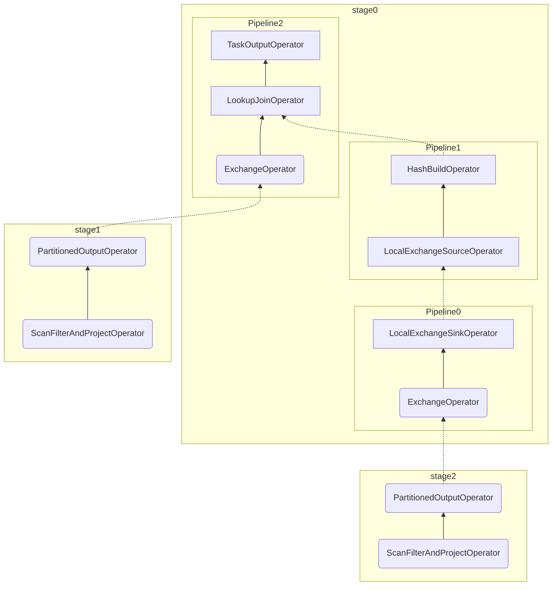

# Trino源码学习-TASK执行

[上篇](/posts/2023/02/53a7bc3d/)我们介绍了查询是如何调度的。本篇将介绍Task的执行。

<!--more-->

## 创建Task

分析上篇查询调度代码时，可以发现，查询调度最终通过StageExection#scheduleTask方法生成 RemoteTask。我们先来分析下Task是如何被创建的。



先来看入口PipelinedStageExecution#scheduleTask方法

```java
//io.trino.execution.scheduler.PipelinedStageExecution
public synchronized Optional<RemoteTask> scheduleTask(
            InternalNode node,
            int partition,
            Multimap<PlanNodeId, Split> initialSplits)
{
    if (stateMachine.getState().isDone()) {
        return Optional.empty();
    }

    checkArgument(!tasks.containsKey(partition), "A task for partition %s already exists", partition);

    OutputBuffers outputBuffers = outputBufferManagers.get(stage.getFragment().getId()).getOutputBuffers();
    // 此处创建了Task，TaskID结构:stageId + "." + partitionId + "." + attemptId
    Optional<RemoteTask> optionalTask = stage.createTask(
            node,
            partition,
            attempt,
            bucketToPartition,
            outputBuffers,
            initialSplits,
            ImmutableSet.of(),
            Optional.empty());

    if (optionalTask.isEmpty()) {
        return Optional.empty();
    }

    RemoteTask task = optionalTask.get();

    tasks.put(partition, task);

    ImmutableMultimap.Builder<PlanNodeId, Split> exchangeSplits = ImmutableMultimap.builder();
    // sourceTasks中存放了上游Stage的SourceTask,即当前Stage的输入
    // 在DistributedStagesScheduler#create方法中
    // parentStageExecution会将自己提供的listener注册到Child上，以获取Child的Task作为SourceTask。
    sourceTasks.forEach((fragmentId, sourceTask) -> {
        TaskStatus status = sourceTask.getTaskStatus();
        if (status.getState() != TaskState.FINISHED) {
            // 在DistributedStagesScheduler#create方法中
            // exchangeSources 存放了当前Stage的所有remoteSourceFragmentId
            PlanNodeId planNodeId = exchangeSources.get(fragmentId).getId();
            exchangeSplits.put(planNodeId, createExchangeSplit(sourceTask, task));
        }
    });
    //记录创建的TASK
    allTasks.add(task.getTaskId());
    // task尝试添加Source Split
    task.addSplits(exchangeSplits.build());
    // 通知task完成的Source
    completeSources.forEach(task::noMoreSplits);
    // 添加状态变更listener
    task.addStateChangeListener(this::updateTaskStatus);
    // 启动task(此处会在worker上发起创建Task请求)
    task.start();
    // 通知listener(parent stage) task创建信息
    taskLifecycleListener.taskCreated(stage.getFragment().getId(), task);

    // update output buffers
    OutputBufferId outputBufferId = new OutputBufferId(task.getTaskId().getPartitionId());
    updateSourceTasksOutputBuffers(outputBufferManager -> outputBufferManager.addOutputBuffer(outputBufferId));
    return Optional.of(task);
}
```

然后分析下HttpRemoteTask。

```java
//io.trino.server.remotetask.HttpRemoteTask
public HttpRemoteTask(... ...)
{
    // require param

    try (SetThreadName ignored = new SetThreadName("HttpRemoteTask-%s", taskId)) {
        ... ...
        // 将所有的initialSplits构建为ScheduledSplit，放入pendingSplits。
        for (Entry<PlanNodeId, Split> entry : initialSplits.entries()) {
            ScheduledSplit scheduledSplit = new ScheduledSplit(nextSplitId.getAndIncrement(), entry.getKey(), entry.getValue());
            pendingSplits.put(entry.getKey(), scheduledSplit);
        }
        ... ...
        int pendingSourceSplitCount = 0;
        long pendingSourceSplitsWeight = 0;
        // getPartitionedSources中存放着planFragment的TableScanNode Id
        for (PlanNodeId planNodeId : planFragment.getPartitionedSources()) {
            Collection<Split> tableScanSplits = initialSplits.get(planNodeId);
            if (!tableScanSplits.isEmpty()) {
                // 记录Split处理的数量
                pendingSourceSplitCount += tableScanSplits.size();
                pendingSourceSplitsWeight = addExact(pendingSourceSplitsWeight, SplitWeight.rawValueSum(tableScanSplits, Split::getSplitWeight));
            }
        }
        this.pendingSourceSplitCount = pendingSourceSplitCount;
        this.pendingSourceSplitsWeight = pendingSourceSplitsWeight;

        ... ...
        // 创建TaskInfo保存Task的内部信息
        TaskInfo initialTask = createInitialTask(taskId, location, nodeId, pipelinedBufferStates, new TaskStats(DateTime.now(), null));
        // 持续获取task状态
        this.taskStatusFetcher = new ContinuousTaskStatusFetcher();
        // 持续获取task信息
        this.taskInfoFetcher = new TaskInfoFetcher();
        ... ...
    }
}

public void start()
{
    try (SetThreadName ignored = new SetThreadName("HttpRemoteTask-%s", taskId)) {
        // to start we just need to trigger an update
        started.set(true);
        triggerUpdate(); // 触发创建或更新

        dynamicFiltersFetcher.start();
        taskStatusFetcher.start();
        taskInfoFetcher.start();
    }
}
private void triggerUpdate()
{
    if (!started.get()) {
        // task has not started yet
        return;
    }
    if (pendingRequestsCounter.getAndIncrement() == 0) {
        // schedule update if this is the first update requested
        scheduleUpdate();
    }
}
private void scheduleUpdate()
{
    executor.execute(this::sendUpdate);
}
private void sendUpdate()
{
    ... ...
    HttpUriBuilder uriBuilder = getHttpUriBuilder(taskStatus);
    Request request = preparePost()
            .setUri(uriBuilder.build())
            .setHeader(HttpHeaders.CONTENT_TYPE, MediaType.JSON_UTF_8.toString())
            .setBodyGenerator(createStaticBodyGenerator(taskUpdateRequestJson))
            .build();
    ListenableFuture<JsonResponse<TaskInfo>> future = httpClient.executeAsync(request, 
    Futures.addCallback(
            future,
            new SimpleHttpResponseHandler<>(new UpdateResponseHandler(splitAssignments, dynamicFilterDomains.getVersion(), System.nanoTime(), currentPendingRequestsCounter), request.getUri(), stats),
            executor);
}
```

HttpRemoteTask中HttpClient发出的请求会到达TaskResource的createOrUpdateTask方法。

```java
//io.trino.server.TaskResource
@Path("/v1/task")
public class TaskResource
{
  @ResourceSecurity(INTERNAL_ONLY)
  @POST
  @Path("{taskId}")
  @Consumes(MediaType.APPLICATION_JSON)
  @Produces(MediaType.APPLICATION_JSON)
  public void createOrUpdateTask(
          @PathParam("taskId") TaskId taskId,
          TaskUpdateRequest taskUpdateRequest,
          @Context UriInfo uriInfo,
          @Suspended AsyncResponse asyncResponse)
  {
      requireNonNull(taskUpdateRequest, "taskUpdateRequest is null");

      Session session = taskUpdateRequest.getSession().toSession(sessionPropertyManager, taskUpdateRequest.getExtraCredentials(), taskUpdateRequest.getExchangeEncryptionKey());

      if (injectFailure(session.getTraceToken(), taskId, RequestType.CREATE_OR_UPDATE_TASK, asyncResponse)) {
          return;
      }
      // 使用Taskmanager创建/更新Task，并返回task信息
      TaskInfo taskInfo = taskManager.updateTask(session,
              taskId,
              taskUpdateRequest.getFragment(),
              taskUpdateRequest.getSplitAssignments(),
              taskUpdateRequest.getOutputIds(),
              taskUpdateRequest.getDynamicFilterDomains());

      if (shouldSummarize(uriInfo)) {
          taskInfo = taskInfo.summarize();
      }

      asyncResponse.resume(Response.ok().entity(taskInfo).build());
  }
}
```

### TaskManager

在Worker上Task的创建是通过taskManager来实现的。



由于是第一次创建，所以NonEvictableLoadingCache中没有对应的TaskID,会通过createSqlTask来加载SqlTask

### SqlTaskExecution初始化

本小节分析下SqlTaskExecution是如何初始化的。

```java
//io.trino.execution.SqlTaskExecution
public SqlTaskExecution(
            TaskStateMachine taskStateMachine,
            TaskContext taskContext,
            OutputBuffer outputBuffer,
            LocalExecutionPlan localExecutionPlan,
            TaskExecutor taskExecutor,
            SplitMonitor splitMonitor,
            Executor notificationExecutor)
{
    ... ...

    try (SetThreadName ignored = new SetThreadName("Task-%s", taskId)) {
        // 根据是否是本地Source节点，将driverFactory放到不同的管理器中
        // index driver factories
        for (DriverFactory driverFactory : localExecutionPlan.getDriverFactories()) {
            Optional<PlanNodeId> sourceId = driverFactory.getSourceId();
            if (sourceId.isPresent() && partitionedSources.contains(sourceId.get())) {
                driverRunnerFactoriesWithSplitLifeCycle.put(sourceId.get(), new DriverSplitRunnerFactory(driverFactory, true));
            }
            else {
                //DriverSplitRunnerFactory中会初始化PipelineContext
                DriverSplitRunnerFactory runnerFactory = new DriverSplitRunnerFactory(driverFactory, false);
                sourceId.ifPresent(planNodeId -> driverRunnerFactoriesWithRemoteSource.put(planNodeId, runnerFactory));
                driverRunnerFactoriesWithTaskLifeCycle.add(runnerFactory);
            }
        }
        ... ...
        //  向TaskExecutor中添加Task
        if (!taskStateMachine.getState().isDone()) {
                taskHandle = createTaskHandle(taskStateMachine, taskContext, outputBuffer, localExecutionPlan, taskExecutor);
            }
        else {
                taskHandle = null;
        }
        ... ...
    }
}
//io.trino.execution.SqlTaskExecution.TaskHandle
private static TaskHandle createTaskHandle(
            TaskStateMachine taskStateMachine,
            TaskContext taskContext,
            OutputBuffer outputBuffer,
            LocalExecutionPlan localExecutionPlan,
            TaskExecutor taskExecutor)
{
    TaskHandle taskHandle = taskExecutor.addTask(
            taskStateMachine.getTaskId(),
            outputBuffer::getUtilization,
            getInitialSplitsPerNode(taskContext.getSession()),
            getSplitConcurrencyAdjustmentInterval(taskContext.getSession()),
            getMaxDriversPerTask(taskContext.getSession()));
    taskStateMachine.addStateChangeListener(state -> {
        if (state.isDone()) {
            taskExecutor.removeTask(taskHandle);
            for (DriverFactory factory : localExecutionPlan.getDriverFactories()) {
                factory.noMoreDrivers();
            }
        }
    });
    return taskHandle;
}
```

### Task更新

刚才分析代码时可以看到HttpRemoteTask是会出现更新(triggerUpdate)的情况，那么什么时候会触发Task更新？

我们先来看看什么时候会调用triggerUpdate。

- HttpRemoteTask#start: 读源码可知PipelinedStageExecution#scheduleTask每次的partition是不同的，start方法只会执行一次。
- HttpRemoteTask#addSplits: SourcePartitionedScheduler#assignSplits时会被多次调用，直到所有split批均被处理完成。
- HttpRemoteTask#noMoreSplits: source类型节点(tableScan,remoteNode)调度完成时，会通知一次。
- HttpRemoteTask#setOutputBuffers: RemoteTask未Start前，多次触发没有用。


根据上面的分析，可以知道只有Source类型的Task会被addSplits不断触发更新。每次更新时，都会将最新的SplitAssignment提交到Worker。

```java
//triggerUpdate -> sendUpdate
// io.trino.server.remotetask.HttpRemoteTask#sendUpdate
List<SplitAssignment> splitAssignments = getSplitAssignments();
VersionedDynamicFilterDomains dynamicFilterDomains = outboundDynamicFiltersCollector.acknowledgeAndGetNewDomains(sentDynamicFiltersVersion.get());

// Workers don't need the embedded JSON representation when the fragment is sent
Optional<PlanFragment> fragment = sendPlan.get() ? Optional.of(planFragment.withoutEmbeddedJsonRepresentation()) : Optional.empty();
TaskUpdateRequest updateRequest = new TaskUpdateRequest(
        session.toSessionRepresentation(),
        session.getIdentity().getExtraCredentials(),
        fragment,
        splitAssignments,
        outputBuffers.get(),
        dynamicFilterDomains.getDynamicFilterDomains(),
        session.getExchangeEncryptionKey());

private synchronized List<SplitAssignment> getSplitAssignments()
{
    return Stream.concat(planFragment.getPartitionedSourceNodes().stream(), planFragment.getRemoteSourceNodes().stream())
            .filter(Objects::nonNull)
            .map(PlanNode::getId)
            .map(this::getSplitAssignment)
            .filter(Objects::nonNull)
            .collect(toImmutableList());
}

private synchronized SplitAssignment getSplitAssignment(PlanNodeId planNodeId)
{   // addSplits会将Split记录到pendingSplits中
    Set<ScheduledSplit> splits = pendingSplits.get(planNodeId);
    boolean pendingNoMoreSplits = Boolean.TRUE.equals(this.noMoreSplits.get(planNodeId));
    boolean noMoreSplits = this.noMoreSplits.containsKey(planNodeId);

    SplitAssignment assignment = null;
    if (!splits.isEmpty() || pendingNoMoreSplits) {
        assignment = new SplitAssignment(planNodeId, splits, noMoreSplits);
    }
    return assignment;
}
```

## 本地运行逻辑计划

根据上面的代码分析，Worker中Task的运行由SqlTaskExecution表示。SqlTaskExecution从LocalExecutionPlan(本地执行逻辑计划)生成。LocalExecution由LocalExecutionPlanner#plan方法生成。
### LocalExecution

LocalExecution结构如下:

```java
public static class LocalExecutionPlan
{
    private final List<DriverFactory> driverFactories;
    private final List<PlanNodeId> partitionedSourceOrder; // stage中TableScan节点ID

    public LocalExecutionPlan(List<DriverFactory> driverFactories, List<PlanNodeId> partitionedSourceOrder)
    {
        this.driverFactories = ImmutableList.copyOf(requireNonNull(driverFactories, "driverFactories is null"));
        this.partitionedSourceOrder = ImmutableList.copyOf(requireNonNull(partitionedSourceOrder, "partitionedSourceOrder is null"));
    }

    public List<DriverFactory> getDriverFactories()
    {
        return driverFactories;
    }

    public List<PlanNodeId> getPartitionedSourceOrder()
    {
        return partitionedSourceOrder;
    }
}
```

我们来看看DriverFactory的结构。

```java
public class DriverFactory
{
    private final int pipelineId; // pipeline的ID
    private final boolean inputDriver; // 是否输入Diver
    private final boolean outputDriver; // 是否输出Driver
    private final List<OperatorFactory> operatorFactories; // 算子工厂
    private final Optional<PlanNodeId> sourceId; //SourceOperator对应的执行计划ID
    private final OptionalInt driverInstances; // driver的实例数
  ... ...
}
```

DriverInstances也就是执行时Pipeline的并行度。

- RemoteSourceNode的并行度是TASK_CONCURRENCY
- MergeWriterNode，TableExecuteNode和TableWriterNode并行度是Writer的个数，优先是TASK_PARTITIONED_WRITER_COUNT否则是TASK_WRITER_COUNT
- LocalExchangeNode根据自己的类型判断:
  - GATHER: 并行度是1
  - 优先使用上下文的并行度，否则是TASK_CONCURRENCY

OperatorFactory是算子工厂类。提供了创建Operator算子的能力。

```java
public interface OperatorFactory
{
    Operator createOperator(DriverContext driverContext);

    /**
     * Declare that createOperator will not be called any more and release
     * any resources associated with this factory.
     * <p>
     * This method will be called only once.
     * Implementation doesn't need to worry about duplicate invocations.
     */
    void noMoreOperators();

    OperatorFactory duplicate();
}
```
Operator接口有以下重要的方法:

- isBlocked() 当前算子是否阻塞
- needsInput() 当前算子是否需要输入Page
- addInput(Page page) 传递Page给当前算子
- getOutput() 获取当前算子输出的Page
- finish() 用于上游算子调用，告诉当前算子，不再有page输入
- isFinished() 当前算子是否完成计算

### LocalExecutionPlanner

分析完LocalExecution的结构，我们来关注下本地执行计划是怎么生成的。

```java
public LocalExecutionPlan plan(
            TaskContext taskContext,
            PlanNode plan,
            TypeProvider types,
            PartitioningScheme partitioningScheme,
            List<PlanNodeId> partitionedSourceOrder,
            OutputBuffer outputBuffer)
{
    List<Symbol> outputLayout = partitioningScheme.getOutputLayout();

    if (partitioningScheme.getPartitioning().getHandle().equals(FIXED_BROADCAST_DISTRIBUTION) ||
            partitioningScheme.getPartitioning().getHandle().equals(FIXED_ARBITRARY_DISTRIBUTION) ||
            partitioningScheme.getPartitioning().getHandle().equals(SCALED_WRITER_ROUND_ROBIN_DISTRIBUTION) ||
            partitioningScheme.getPartitioning().getHandle().equals(SINGLE_DISTRIBUTION) ||
            partitioningScheme.getPartitioning().getHandle().equals(COORDINATOR_DISTRIBUTION)) {
        return plan(taskContext, plan, outputLayout, types, partitionedSourceOrder, new TaskOutputFactory(outputBuffer));
    }

    // We can convert the symbols directly into channels, because the root must be a sink and therefore the layout is fixed
    ... ...

    return plan(
            taskContext,
            plan,
            outputLayout,
            types,
            partitionedSourceOrder,
            new PartitionedOutputFactory(
                    partitionFunction,
                    partitionChannels,
                    partitionConstants,
                    partitioningScheme.isReplicateNullsAndAny(),
                    nullChannel,
                    outputBuffer,
                    maxPagePartitioningBufferSize,
                    positionsAppenderFactory));
}
```

- 入口是LocalExecutionPlanner#plan方法。
  - 如果分区方式是如下方式，会将Task的输出OperatorFactory设置为TaskOutputFactory.
    - FIXED_BROADCAST_DISTRIBUTION
    - FIXED_ARBITRARY_DISTRIBUTION
    - SCALED_WRITER_ROUND_ROBIN_DISTRIBUTION
    - SINGLE_DISTRIBUTION和COORDINATOR_DISTRIBUTION
  - 否则会将Task的输出OperatorFactory设置为PartitionedOutputFactory.

```java
public LocalExecutionPlan plan(
            TaskContext taskContext,
            PlanNode plan,
            List<Symbol> outputLayout,
            TypeProvider types,
            List<PlanNodeId> partitionedSourceOrder,
            OutputFactory outputOperatorFactory)
{
    Session session = taskContext.getSession();
    LocalExecutionPlanContext context = new LocalExecutionPlanContext(taskContext, types);

    PhysicalOperation physicalOperation = plan.accept(new Visitor(session), context);

    Function<Page, Page> pagePreprocessor = enforceLoadedLayoutProcessor(outputLayout, physicalOperation.getLayout());

    List<Type> outputTypes = outputLayout.stream()
            .map(types::get)
            .collect(toImmutableList());

    context.addDriverFactory(
            context.isInputDriver(),
            true,
            new PhysicalOperation(
                    outputOperatorFactory.createOutputOperator(
                            context.getNextOperatorId(),
                            plan.getId(),
                            outputTypes,
                            pagePreprocessor,
                            new PagesSerdeFactory(plannerContext.getBlockEncodingSerde(), isExchangeCompressionEnabled(session))),
                    physicalOperation),
            context.getDriverInstanceCount());

    // notify operator factories that planning has completed
    context.getDriverFactories().stream()
            .map(DriverFactory::getOperatorFactories)
            .flatMap(List::stream)
            .filter(LocalPlannerAware.class::isInstance)
            .map(LocalPlannerAware.class::cast)
            .forEach(LocalPlannerAware::localPlannerComplete);

    return new LocalExecutionPlan(context.getDriverFactories(), partitionedSourceOrder);
}
```

- 开始执行带outputFactory的plan方法。
  - 构造LocalExecutionPlanContext
  - 使用Visitor遍历Plan树，并返回PhysicalOperation。
  - 基于outputOperatorFactory和上面的返回的PhysicalOperation，构建一个新的PhysicalOperation。
  - 将最终的PhysicalOperation添加到Context的DriverFactories中
  - 获取context中的DriverFactories，构建LocalExecution。

核心逻辑在Visitor遍历Plan树，并生成PhysicalOperation这块。

```java
private static class PhysicalOperation
{
    private final List<OperatorFactoryWithTypes> operatorFactoriesWithTypes;
    private final Map<Symbol, Integer> layout; 
    private final List<Type> types;
    ... ... 

    private PhysicalOperation(
            OperatorFactory operatorFactory,
            Map<Symbol, Integer> layout,
            TypeProvider typeProvider,
            Optional<PhysicalOperation> source)
    {
        requireNonNull(operatorFactory, "operatorFactory is null");
        requireNonNull(layout, "layout is null");
        requireNonNull(typeProvider, "typeProvider is null");
        requireNonNull(source, "source is null");

        this.types = toTypes(layout, typeProvider);
        this.operatorFactoriesWithTypes = ImmutableList.<OperatorFactoryWithTypes>builder()
                // operatorFactoriesWithTypes的顺序是先上游节点，然后是自己
                .addAll(source.map(PhysicalOperation::getOperatorFactoriesWithTypes).orElse(ImmutableList.of()))
                .add(new OperatorFactoryWithTypes(operatorFactory, types))
                .build();
        this.layout = ImmutableMap.copyOf(layout);
    }
  ... ...
}
// private static class LocalExecutionPlanContext
public void addDriverFactory(boolean inputDriver, boolean outputDriver, PhysicalOperation physicalOperation, OptionalInt driverInstances)
{
    List<OperatorFactoryWithTypes> operatorFactoriesWithTypes = physicalOperation.getOperatorFactoriesWithTypes();
    // addLookupOuterDrivers 是对joinNode中 outer部分返回的特殊处理。
    addLookupOuterDrivers(outputDriver, toOperatorFactories(operatorFactoriesWithTypes));
    List<OperatorFactory> operatorFactories;
    if (isLateMaterializationEnabled(taskContext.getSession())) {
        operatorFactories = handleLateMaterialization(operatorFactoriesWithTypes);
    }
    else {
        operatorFactories = toOperatorFactories(operatorFactoriesWithTypes);
    }
    // 注意，在此次新建了一个pipeline
    driverFactories.add(new DriverFactory(getNextPipelineId(), inputDriver, outputDriver, operatorFactories, driverInstances));
}
```

结合Visitor的代码和上面的代码可以知道。

- 上游的节点会先解析成PhysicalOperation，然后作为Source提供给下游节点，PhysicalOperation会合并Source的operatorFactoriesWithTypes。
- 在遍历Plan的过程中，对于joinNode，exchangeNode等多个Source的，context提供了addDriverFactory方法，将Source对应的PhysicalOperation优先加入到Context的DriverFactories中。
- 每次addDriverFactory，实际上会新增一个Pipeline。

## Task执行

Task执行的入口是SqlTaskExecution#start。



可以看到Task的执行主要依靠TaskExecutor。同时，我们可以注意到start中只调度了scheduleDriversForTaskLifeCycle中的DriverRunnerFactory。在SqlTaskExecution初始化一节中，对于本地Source，单独被放到了driverRunnerFactoriesWithRemoteSource中。这些Split是通过`taskExecution.addSplitAssignments(splitAssignments)`方法触发执行的(可以循环触发)。




```java
//io.trino.execution.SqlTaskExecution
private synchronized Set<PlanNodeId> updateSplitAssignments(List<SplitAssignment> splitAssignments)
{
  ImmutableSet.Builder<PlanNodeId> updatedUnpartitionedSources = ImmutableSet.builder();

  // first remove any split that was already acknowledged
  long currentMaxAcknowledgedSplit = this.maxAcknowledgedSplit;
  splitAssignments = splitAssignments.stream()
          .map(assignment -> new SplitAssignment(
                  assignment.getPlanNodeId(),
                  assignment.getSplits().stream()
                          .filter(scheduledSplit -> scheduledSplit.getSequenceId() > currentMaxAcknowledgedSplit)
                          .collect(toImmutableSet()),
                  assignment.isNoMoreSplits()))
          // drop assignments containing no unacknowledged splits
          // the noMoreSplits signal acknowledgement is not tracked but it is okay to deliver it more than once
          .filter(assignment -> !assignment.getSplits().isEmpty() || assignment.isNoMoreSplits())
          .collect(toList());

  // update task with new assignments
  for (SplitAssignment assignment : splitAssignments) {
      if (driverRunnerFactoriesWithSplitLifeCycle.containsKey(assignment.getPlanNodeId())) {
          // 本地Source
          schedulePartitionedSource(assignment);
      }
      else {
          // 远程Source，才会加到updatedUnpartitionedSources中
          // tell existing drivers about the new splits
          DriverSplitRunnerFactory factory = driverRunnerFactoriesWithRemoteSource.get(assignment.getPlanNodeId());
          factory.enqueueSplits(assignment.getSplits(), assignment.isNoMoreSplits());
          updatedUnpartitionedSources.add(assignment.getPlanNodeId());
      }
  }

  // update maxAcknowledgedSplit
  maxAcknowledgedSplit = splitAssignments.stream()
          .flatMap(source -> source.getSplits().stream())
          .mapToLong(ScheduledSplit::getSequenceId)
          .max()
          .orElse(maxAcknowledgedSplit);
  return updatedUnpartitionedSources.build();
}
```

对于本地Source，会调用schedulePartitionedSource方法。该方法中会启动处理split的Runner。

```java
//io.trino.execution.SqlTaskExecution
private synchronized void schedulePartitionedSource(SplitAssignment splitAssignmentUpdate)
{
    mergeIntoPendingSplits(splitAssignmentUpdate.getPlanNodeId(), splitAssignmentUpdate.getSplits(), splitAssignmentUpdate.isNoMoreSplits());

    while (schedulingPlanNodeOrdinal < sourceStartOrder.size()) {
        // 注意这个循环只会执行一次，后面的SplitAssign都会加入pendingSplitsForPlanNode
        PlanNodeId schedulingPlanNode = sourceStartOrder.get(schedulingPlanNodeOrdinal);

        DriverSplitRunnerFactory partitionedDriverRunnerFactory = driverRunnerFactoriesWithSplitLifeCycle.get(schedulingPlanNode);

        PendingSplitsForPlanNode pendingSplits = pendingSplitsByPlanNode.get(schedulingPlanNode);

        // Enqueue driver runners with split lifecycle for this plan node and driver life cycle combination.
        ImmutableList.Builder<DriverSplitRunner> runners = ImmutableList.builder();
        for (ScheduledSplit scheduledSplit : pendingSplits.removeAllSplits()) {
            // create a new driver for the split
            // 创建用于执行的DriverRunner
            runners.add(partitionedDriverRunnerFactory.createDriverRunner(scheduledSplit));
        }
        // 将DriverRunner放入TaskExecutor
        enqueueDriverSplitRunner(false, runners.build());

        // If all driver runners have been enqueued for this plan node and driver life cycle combination,
        // move on to the next plan node.
        if (pendingSplits.getState() != NO_MORE_SPLITS) {
            break;
        }
        partitionedDriverRunnerFactory.noMoreDriverRunner();
        pendingSplits.markAsCleanedUp();

        schedulingPlanNodeOrdinal++;
    }
}
// 将Split添加到pendingSplitsForPlanNode中
private void mergeIntoPendingSplits(PlanNodeId planNodeId, Set<ScheduledSplit> scheduledSplits, boolean noMoreSplits)
{
    checkHoldsLock();

    DriverSplitRunnerFactory partitionedDriverFactory = driverRunnerFactoriesWithSplitLifeCycle.get(planNodeId);
    PendingSplitsForPlanNode pendingSplitsForPlanNode = pendingSplitsByPlanNode.get(planNodeId);

    partitionedDriverFactory.splitsAdded(scheduledSplits.size(), SplitWeight.rawValueSum(scheduledSplits, scheduledSplit -> scheduledSplit.getSplit().getSplitWeight()));
    for (ScheduledSplit scheduledSplit : scheduledSplits) {
        pendingSplitsForPlanNode.addSplit(scheduledSplit);
    }
    if (noMoreSplits) {
        pendingSplitsForPlanNode.setNoMoreSplits();
    }
}
```

对于RemoteSource,会通过DriverSplitRunnerFactory#scheduleSplits执行。在方法内部会调用driver#updateSplitAssignment方法。Driver部分在下面会介绍，此处就不展开了。

### TaskExecutor

DriverRunner通过TaskExecutor#enqueueSplits方法执行。

```java
public List<ListenableFuture<Void>> enqueueSplits(TaskHandle taskHandle, boolean intermediate, List<? extends SplitRunner> taskSplits)
{
    List<PrioritizedSplitRunner> splitsToDestroy = new ArrayList<>();
    List<ListenableFuture<Void>> finishedFutures = new ArrayList<>(taskSplits.size());
    synchronized (this) {
        for (SplitRunner taskSplit : taskSplits) {
            // 将原有的SplitRunner包装为PrioritizedSplitRunner
            PrioritizedSplitRunner prioritizedSplitRunner = new PrioritizedSplitRunner(
                    taskHandle,
                    taskSplit,
                    ticker,
                    globalCpuTimeMicros,
                    globalScheduledTimeMicros,
                    blockedQuantaWallTime,
                    unblockedQuantaWallTime);

            if (taskHandle.isDestroyed()) {
                // If the handle is destroyed, we destroy the task splits to complete the future
                splitsToDestroy.add(prioritizedSplitRunner);
            }
            else if (intermediate) {
                // 立刻启动
                // Note: we do not record queued time for intermediate splits
                startIntermediateSplit(prioritizedSplitRunner);
                // add the runner to the handle so it can be destroyed if the task is canceled
                taskHandle.recordIntermediateSplit(prioritizedSplitRunner);
            }
            else {
                // 将Split 入队
                taskHandle.enqueueSplit(prioritizedSplitRunner);
                // 如果Task启动的Split低于保证(guaranteedNumberOfDriversPerTask)，尝试启动Split
                scheduleTaskIfNecessary(taskHandle);
                // 如果有更多的全局资源(低于minimumNumberOfDrivers)，TaskExecutor会全局启动更多Split
                addNewEntrants();
            }

            finishedFutures.add(prioritizedSplitRunner.getFinishedFuture());
        }
        recordLeafSplitsSize();
    }
    // 销毁split
    for (PrioritizedSplitRunner split : splitsToDestroy) {
        split.destroy();
    }
    return finishedFutures;
}
```


- 如果是立刻执行，会调用startIntermediateSplit，将SplitRunner加到waitingSplits中
- 否则排队调用enqueueSplit，将SplitRunner存储到Task的QueuedLeafSplits。
  - 调用Task的pollNextSplit尝试启动Task下的Split
  - 调用TaskExecutor的pollNextSplitWorker尝试尽可能启动所有Task中的Splits。
- TaskExecutor内部的executor中有轮询线程。
  - 线程不停的从waitingSplits中拿出SplitRunner
  - 调用SplitRunner的process方法
  - 如果SplitRunner被block，那就等block解除后，继续调度
  - 如果SplitRunner未完成，继续加入waitingSplits
  - 如果SplitRunner已完成，触发splitFinished方法

### MultilevelSplitQueue

TaskExecutor中的waitingSplits是MultilevelSplitQueue。这是一个多层级的优先级队列。

```java
public class MultilevelSplitQueue
{
    //每个level的阈值，比如LEVEL_THRESHOLD_SECONDS[1] = 1s，也就是说累计运行时间超过1s的任务会被放到level1。
    static final int[] LEVEL_THRESHOLD_SECONDS = {0, 1, 10, 60, 300};
    //一个保护性的值，一次process被计算的上限时间，避免某些任务因为特殊情况被计算了太多值。
    static final long LEVEL_CONTRIBUTION_CAP = SECONDS.toNanos(30);
    // 一个size为5的优先队列的2维数组。共5个level，
    // 每次take时，通过比对每一level已经消耗的时间，选取一个level，
    // 从该level里选取优先级最高的PrioritizedSplitRunner。
    @GuardedBy("lock")
    private final PriorityQueue<PrioritizedSplitRunner>[] levelWaitingSplits;
    //一个size为5的调度时间累加器，表示当前level的已用掉的调度时间。
    // PrioritizedSplitRunner在执行完任务的process之后会增加当前level的调度时间。
    // 这部分的数据主要用于在poll取PrioritizedSplitRunner数据的时候计算具体从哪个level的队列里面拿。
    private final AtomicLong[] levelScheduledTime;
    //是一个size为5的优先级分数数组，表明当前level的最小的优先级分数，
    // 每次从队里成功take出数据之后会更新这个当前level的优先级分数。
    private final AtomicLong[] levelMinPriority;
    private final CounterStat[] selectedLevelCounters;

    private final ReentrantLock lock = new ReentrantLock();
    private final Condition notEmpty = lock.newCondition();
    //这个字段用于设置不同level之间的cpu时间分配。默认用的是2，也就是level0-4时间占比为16:8:4:2:1
    private final double levelTimeMultiplier;
}
```
#### offer

将一个PrioritizedSplitRunner加入对应层级的优先队列，一个PrioritizedSplitRunner初始化的时候默认在level0。这里遇到空层级的时候，会将空层的运行时间调到预期的运行时间，Trino这样做的原因可能是：

如果不调整，如果这个空的level落后太多，那么之后真的有PrioritizedSplitRunner到达这个level时，这个level的优先级会很高（因为是按照每个层级已经分配到的时间来计算优先级的），可能会导致其它level较长时间得不到调度。

```java
public void offer(PrioritizedSplitRunner split)
{
    checkArgument(split != null, "split is null");

    split.setReady();
    int level = split.getPriority().getLevel();
    lock.lock();
    try {
        if (levelWaitingSplits[level].isEmpty()) {
            // Accesses to levelScheduledTime are not synchronized, so we have a data race
            // here - our level time math will be off. However, the staleness is bounded by
            // the fact that only running splits that complete during this computation
            // can update the level time. Therefore, this is benign.
            long level0Time = getLevel0TargetTime();
            long levelExpectedTime = (long) (level0Time / Math.pow(levelTimeMultiplier, level));
            long delta = levelExpectedTime - levelScheduledTime[level].get();
            levelScheduledTime[level].addAndGet(delta);
        }

        levelWaitingSplits[level].offer(split);
        notEmpty.signal();
    }
    finally {
        lock.unlock();
    }
}
```

#### take

pollSplit()方法选取一个合适的PrioritizedSplitRunner.

如果result.updateLevelPriority()返回true，说明这个PrioritizedSplitRunner对应的TaskHandle的优先级和PrioritizedSplitRunner的优先级不同，

而Trino认为TaskHandle关联的所有PrioritizedSplitRunner的level应当地一致改变，所以将PrioritizedSplitRunner重新放回队列，等待下一次调度。

```java
public PrioritizedSplitRunner take()
            throws InterruptedException
{
    while (true) {
        lock.lockInterruptibly();
        try {
            PrioritizedSplitRunner result;
            while ((result = pollSplit()) == null) {
                notEmpty.await();
            }

            if (result.updateLevelPriority()) {
                offer(result);
                continue;
            }

            int selectedLevel = result.getPriority().getLevel();
            levelMinPriority[selectedLevel].set(result.getPriority().getLevelPriority());
            selectedLevelCounters[selectedLevel].update(1);

            return result;
        }
        finally {
            lock.unlock();
        }
    }
}
// io.trino.execution.executor.PrioritizedSplitRunner
public boolean updateLevelPriority()
{
    Priority newPriority = taskHandle.getPriority();
    Priority oldPriority = priority.getAndSet(newPriority);
    return newPriority.getLevel() != oldPriority.getLevel();
}
```
#### pollSplit

如何决定选哪个level的优先队列：

- level的数量固定是5，Trino假设不同level之间CPU的预期时间分布是确定的，具体实现中使用levelMinPriority的幂次方来决定，比如选择levelMinPriority=2，level0-4的预期CPU时间占比就为16:8:4:2:1
- 维护了一个levelSchedueTime的数组，标识了各个level已经调度的时间，Trino的选择思路很简单
  - 首先计算出level0的基准时间，注意level0的基准时间是通过getLevel0TargetTime()计算得出的，而不是一个常数
  - 根据levelMinPriority给出的各level时间比例，我们就知道了每一个level的targetScheduledTime
  - Ratio = targetScheduledTime/实际的调度时间`levelScheduledTime[level].get()`，ratio结果最大的level就是我们认为最不符合预期比例的level，我们希望给它分配更多的时间，所以选择这个level。

```java
private PrioritizedSplitRunner pollSplit()
{
    long targetScheduledTime = getLevel0TargetTime();
    double worstRatio = 1;
    int selectedLevel = -1;
    for (int level = 0; level < LEVEL_THRESHOLD_SECONDS.length; level++) {
        if (!levelWaitingSplits[level].isEmpty()) {
            long levelTime = levelScheduledTime[level].get();
            double ratio = levelTime == 0 ? 0 : targetScheduledTime / (1.0 * levelTime);
            if (selectedLevel == -1 || ratio > worstRatio) {
                worstRatio = ratio;
                selectedLevel = level;
            }
        }

        targetScheduledTime /= levelTimeMultiplier;
    }

    if (selectedLevel == -1) {
        return null;
    }

    PrioritizedSplitRunner result = levelWaitingSplits[selectedLevel].poll();
    checkState(result != null, "pollSplit cannot return null");

    return result;
}

private long getLevel0TargetTime()
{
    long level0TargetTime = levelScheduledTime[0].get();
    double currentMultiplier = levelTimeMultiplier;
 
    for (int level = 0; level < LEVEL_THRESHOLD_SECONDS.length; level++) {
        currentMultiplier /= levelTimeMultiplier;
        long levelTime = levelScheduledTime[level].get();
        // 选择的是所有level经过比例换算之后最大的那个时间。
        level0TargetTime = Math.max(level0TargetTime, (long) (levelTime / currentMultiplier));
    }
 
    return level0TargetTime;
}
```

#### updatePriority

PrioritizedSplitRunner#process方法在处理完一次processFor之后，会更新其本身以及TaskHandle的Priority，就会调用到这个updatePriority方法.

- 计算TaskHanlde的累积调度时间是不是要升级到更高的level
- 逐级更新各level，然后返回更新后的Priority

```java
public Priority updatePriority(Priority oldPriority, long quantaNanos, long scheduledNanos)
{
    int oldLevel = oldPriority.getLevel();
    // 计算新的level
    int newLevel = computeLevel(scheduledNanos); 
    //上限保护
    long levelContribution = Math.min(quantaNanos, LEVEL_CONTRIBUTION_CAP);

    if (oldLevel == newLevel) {
        // 增加调度耗时
        addLevelTime(oldLevel, levelContribution);
        return new Priority(oldLevel, oldPriority.getLevelPriority() + quantaNanos);
    }

    long remainingLevelContribution = levelContribution;
    long remainingTaskTime = quantaNanos;

    // a task normally slowly accrues scheduled time in a level and then moves to the next, but
    // if the split had a particularly long quanta, accrue time to each level as if it had run
    // in that level up to the level limit.
    for (int currentLevel = oldLevel; currentLevel < newLevel; currentLevel++) {
        // 对不同level的时间贡献
        long timeAccruedToLevel = Math.min(SECONDS.toNanos(LEVEL_THRESHOLD_SECONDS[currentLevel + 1] - LEVEL_THRESHOLD_SECONDS[currentLevel]), remainingLevelContribution);
        addLevelTime(currentLevel, timeAccruedToLevel);
        remainingLevelContribution -= timeAccruedToLevel;
        remainingTaskTime -= timeAccruedToLevel;
    }

    addLevelTime(newLevel, remainingLevelContribution);
    // 获取level中最低的优先级
    long newLevelMinPriority = getLevelMinPriority(newLevel, scheduledNanos);
    // 耗时越高，levelPriority越高，越不易从优先级队列中取出。
    return new Priority(newLevel, newLevelMinPriority + remainingTaskTime);
}
```
### PrioritizedSplitRunner

PrioritizedSplitRunner执行相关的核心方法是process。

```java
 public ListenableFuture<Void> process()
{
    try {
        // 本次调度启动时间
        long startNanos = ticker.read();
        // 启动时间
        start.compareAndSet(0, startNanos);
        // 上次退出时间
        lastReady.compareAndSet(0, startNanos);
        // 调度次数+1
        processCalls.incrementAndGet();
        // 等待时间
        waitNanos.getAndAdd(startNanos - lastReady.get());

        CpuTimer timer = new CpuTimer();
        // 调用内部Split，最多只能执行1s，否则返回ListenableFuture
        ListenableFuture<Void> blocked = split.processFor(SPLIT_RUN_QUANTA);
        CpuTimer.CpuDuration elapsed = timer.elapsedTime();

        long quantaScheduledNanos = ticker.read() - startNanos;
        scheduledNanos.addAndGet(quantaScheduledNanos);
        // task更新优先级和耗时
        priority.set(taskHandle.addScheduledNanos(quantaScheduledNanos));
        // 更新上次运行时间
        lastRun.set(ticker.read());

        if (blocked == NOT_BLOCKED) {
            unblockedQuantaWallTime.add(elapsed.getWall());
        }
        else {
            blockedQuantaWallTime.add(elapsed.getWall());
        }

        long quantaCpuNanos = elapsed.getCpu().roundTo(NANOSECONDS);
        cpuTimeNanos.addAndGet(quantaCpuNanos);

        globalCpuTimeMicros.update(quantaCpuNanos / 1000);
        globalScheduledTimeMicros.update(quantaScheduledNanos / 1000);

        return blocked;
    }
    catch (Throwable e) {
        finishedFuture.setException(e);
        throw e;
    }
}
```

TaskHandle也持有一个Priority对象，这个Priority对象可以理解成是其关联的PrioritizedSplitRunner共享的一个cahce。

TaskHandle如何做到调度时统一考虑其关联的所有PrioritizedSplitRunner：

- PrioritizedSplitRunner#process方法中，更新Priority的时候会调用TaskHandle#addScheduledNanos
- TaskHandle#addScheduledNanos更新TaskHandle的Priority
- PrioritizedSplitRunner在从MultiLevelSplitQueue#take中被取出时，会首先判断一下自己的Priority和TaskHandle的Priority是否一致，如果不一致，说明该TaskHandle累计的运行时间已经导致其升级到其它level了，其关联的所有PrioritizedSplitRunner也应该升级，此时将这个出队的PrioritizedSplitRunner重新放入队列，另外选取一个PrioritizedSplitRunner。

### DriverSplitRunner

DriverSplitRunner是PrioritizedSplitRunner内部实际执行的SplitRunner。

```java
@Override
public ListenableFuture<Void> processFor(Duration duration)
{
    Driver driver;
    synchronized (this) {
        // if close() was called before we get here, there's not point in even creating the driver
        if (closed) {
            return immediateVoidFuture();
        }

        if (this.driver == null) {
            // 创建Driver
            this.driver = driverSplitRunnerFactory.createDriver(driverContext, partitionedSplit);
        }

        driver = this.driver;
    }
    //使用driver执行
    return driver.processForDuration(duration);
}
//io.trino.execution.SqlTaskExecution
public Driver createDriver(DriverContext driverContext, @Nullable ScheduledSplit partitionedSplit)
{
    Driver driver = driverFactory.createDriver(driverContext);

    if (partitionedSplit != null) {
        // TableScanOperator requires partitioned split to be added before the first call to process
        driver.updateSplitAssignment(new SplitAssignment(partitionedSplit.getPlanNodeId(), ImmutableSet.of(partitionedSplit), true));
    }

    pendingCreations.decrementAndGet();
    closeDriverFactoryIfFullyCreated();

    if (driverFactory.getSourceId().isPresent() && partitionedSplit == null) {
        driverReferences.add(new WeakReference<>(driver));
        scheduleSplits();
    }

    return driver;
}
//io.trino.operator.DriverFactory
public synchronized Driver createDriver(DriverContext driverContext)
{
    checkState(!noMoreDrivers, "noMoreDrivers is already set");
    requireNonNull(driverContext, "driverContext is null");
    ImmutableList.Builder<Operator> operators = ImmutableList.builder();
    //将Driver中的Operator初始化完毕
    for (OperatorFactory operatorFactory : operatorFactories) {
        Operator operator = operatorFactory.createOperator(driverContext);
        operators.add(operator);
    }
    return Driver.createDriver(driverContext, operators.build());
}
```

## Driver执行细节

最终，Task的执行是通过DriverSplitRunner中内置的Driver来实现的。本节我们来进一步分析Driver的实现细节。
### process

process的工作有:

- 记录执行时间
- 设置yieldSignal，防止执行太长时间导致阻塞
- 调用真正执行的方法processInternal
- 返回BlockedFuture

```java
public ListenableFuture<Void> process(Duration maxRuntime, int maxIterations)
{
    // if the driver is blocked we don't need to continue
    SettableFuture<Void> blockedFuture = driverBlockedFuture.get();
    if (!blockedFuture.isDone()) {
        return blockedFuture;
    }
    // 计算最多运行时间
    long maxRuntimeInNanos = maxRuntime.roundTo(TimeUnit.NANOSECONDS);
    // 当前线程尝试持有独占锁，最多等待100ms
    Optional<ListenableFuture<Void>> result = tryWithLock(100, TimeUnit.MILLISECONDS, true, () -> {
        OperationTimer operationTimer = createTimer();
        driverContext.startProcessTimer();
        // 延迟设置yield信号，1s
        driverContext.getYieldSignal().setWithDelay(maxRuntimeInNanos, driverContext.getYieldExecutor());
        try {
            long start = System.nanoTime();
            int iterations = 0;
            while (!isFinishedInternal()) {
                // 通过processInternal执行
                // yield 信号会用于 processInternal中的operator让出CPU
                // 从粗粒度实现用户态CPU资源的分时调度,
                // 进而实现cpu层面的多租户。
                ListenableFuture<Void> future = processInternal(operationTimer);
                iterations++;
                if (!future.isDone()) {
                    //更新阻塞future原因
                    return updateDriverBlockedFuture(future);
                }
                if (System.nanoTime() - start >= maxRuntimeInNanos || iterations >= maxIterations) {
                    break;
                }
            }
        }
        catch (Throwable t) {
            ... ...
        }
        finally {
            //重置yield信号
            driverContext.getYieldSignal().reset();
            // 记录执行时间
            driverContext.recordProcessed(operationTimer);
        }
        return NOT_BLOCKED;
    });
    return result.orElse(NOT_BLOCKED);
}
```

### processInternal

processInternal是Driver内部真正执行的地方。

```java
private ListenableFuture<Void> processInternal(OperationTimer operationTimer)
{
    checkLockHeld("Lock must be held to call processInternal");
    // 处理内存撤回
    handleMemoryRevoke();
    // 处理新增的SplitAssignment
    processNewSources();

    if (!activeOperators.isEmpty() && activeOperators.size() != allOperators.size()) {
        // 如果还有activeOperators, 告知第一个operator没有输入数据
        Operator rootOperator = activeOperators.get(0);
        rootOperator.finish();
        rootOperator.getOperatorContext().recordFinish(operationTimer);
    }

    boolean movedPage = false;
    for (int i = 0; i < activeOperators.size() - 1 && !driverContext.isDone(); i++) {
        // 获取当前Operator
        Operator current = activeOperators.get(i);
        // 获取下一个Operator
        Operator next = activeOperators.get(i + 1);

        // skip blocked operator
        if (getBlockedFuture(current).isPresent()) {
            continue;
        }

        // 如果当前Operator没有结束，同时下一个operator没有blocked且需要输入
        if (!current.isFinished() && getBlockedFuture(next).isEmpty() && next.needsInput()) {
            // 从当前Operator获取输出page
            Page page = current.getOutput();
            current.getOperatorContext().recordGetOutput(operationTimer, page);

            // if we got an output page, add it to the next operator
            if (page != null && page.getPositionCount() != 0) {
                // 将当前operator的输出作为下一个operator的输出
                next.addInput(page);
                next.getOperatorContext().recordAddInput(operationTimer, page);
                // 标记 page移动
                movedPage = true;
            }

            if (current instanceof SourceOperator) {
                // 标记 page移动
                movedPage = true;
            }
        }

        // if current operator is finished...
        if (current.isFinished()) {
            // 告知下一个operator没有输入数据
            next.finish();
            next.getOperatorContext().recordFinish(operationTimer);
        }
    }

    for (int index = activeOperators.size() - 1; index >= 0; index--) {
        //如果当前Operator已经结束，那么前面的Operator也应该结束了
        if (activeOperators.get(index).isFinished()) {
            // close and remove this operator and all source operators
            List<Operator> finishedOperators = this.activeOperators.subList(0, index + 1);
            // 关闭和销毁结束的Operator
            Throwable throwable = closeAndDestroyOperators(finishedOperators);
            // 从activeOperators中删除这个sublist
            finishedOperators.clear(); 
            if (throwable != null) {
                throwIfUnchecked(throwable);
                throw new RuntimeException(throwable);
            }
            // Finish the next operator, which is now the first operator.
            if (!activeOperators.isEmpty()) {
                // 告知下一个operator没有输入数据
                Operator newRootOperator = activeOperators.get(0);
                newRootOperator.finish();
                newRootOperator.getOperatorContext().recordFinish(operationTimer);
            }
            break;
        }
    }

    // 如果没有发生Page移动，检查是不是阻塞了
    if (!movedPage) {
        List<Operator> blockedOperators = new ArrayList<>();
        List<ListenableFuture<Void>> blockedFutures = new ArrayList<>();
        for (Operator operator : activeOperators) {
            Optional<ListenableFuture<Void>> blocked = getBlockedFuture(operator);
            if (blocked.isPresent()) {
                blockedOperators.add(operator);
                blockedFutures.add(blocked.get());
            }
        }
        // 确实有阻塞Operator
        if (!blockedFutures.isEmpty()) {
            // allow for operators to unblock drivers when they become finished
            // 当任意operator完成时，也能解除driver的阻塞状态。
            for (Operator operator : activeOperators) {
                operator.getOperatorContext().getFinishedFuture().ifPresent(blockedFutures::add);
            }

            // 创建包装阻塞, 内部任何阻塞完成，都会解除blocked状态
            ListenableFuture<Void> blocked = firstFinishedFuture(blockedFutures);
            // driver records serial blocked time
            driverContext.recordBlocked(blocked);
            // each blocked operator is responsible for blocking the execution
            // until one of the operators can continue
            for (Operator operator : blockedOperators) {
                operator.getOperatorContext().recordBlocked(blocked);
            }
            //返回阻塞
            return blocked;
        }
    }
    // 无阻塞
    return NOT_BLOCKED;
}
```

排在后面的operator依赖前面的Operator的输入，最前面的Operator是SourceOperator。可以想象每当Source产生一个Page，就会自底向上move，一直到Output Operator。从这种执行逻辑来看，Trino的计算模型是Push模型。



### destroyIfNecessary

调用链路: `process-> tryWithLock ->destroyIfNecessary`

```java
private void destroyIfNecessary()
{
    checkLockHeld("Lock must be held to call destroyIfNecessary");

    if (!state.compareAndSet(State.NEED_DESTRUCTION, State.DESTROYED)) {
        return;
    }

    // if we get an error while closing a driver, record it and we will throw it at the end
    Throwable inFlightException = null;
    try {
        inFlightException = closeAndDestroyOperators(activeOperators);
        if (driverContext.getMemoryUsage() > 0) {
            log.error("Driver still has memory reserved after freeing all operator memory.");
        }
        if (driverContext.getRevocableMemoryUsage() > 0) {
            log.error("Driver still has revocable memory reserved after freeing all operator memory. Freeing it.");
        }
        driverContext.finished();
    }
    catch (Throwable t) {
        // this shouldn't happen but be safe
        inFlightException = addSuppressedException(
                inFlightException,
                t,
                "Error destroying driver for task %s",
                driverContext.getTaskId());
    }

    if (inFlightException != null) {
        // this will always be an Error or Runtime
        throwIfUnchecked(inFlightException);
        throw new RuntimeException(inFlightException);
    }
}
```

## Pipeline

上面介绍了DriverSplitRunner的执行细节。每个DriverSplitRunner实际上代表了一个并行度下的一批operator的执行器。而一组DriverSplitRunner就是trino中的pipeline概念(包含在一个任务里的一串并行度相同的算子叫作流水线)。

一个SqlTaskExecution就对应了一个Task的执行。每个SqlTaskExecution中有多个Pipeline，每个pipeline是一些相同并发度的Operator列表。

```sql
select 
    t.*,n.*
from
    system.runtime.tasks t
left join 
    system.runtime.nodes n
on 
    t.node_id = n.node_id
where 
    t.state = 'FINISHED'
```

上面的Sql对应的查询Stage如下(stage1和stage2中只有一个pipeline0，图中就省略了):





在介绍本地运行逻辑计划中的DriverFactory有提到过，DriverFactory中的属性pipelineId就是Driver所在的Pipeline。没遇到一个LocalExchangeOperator或者包含LocalExchange的Operator(例如HashBuildOperator)就会在执行计划中创建一个新的pipeline。

在本地执行时，每个SqlTaskExecution中都会有执行上下文TaskContext。每个DriverSplitRunnerFactory在创建时，会在TaskContext中添加PipelineContext。同时在createDriverRunner时，会在每个PipelineContext中创建DriverContext。

```java
private DriverSplitRunnerFactory(DriverFactory driverFactory, boolean partitioned)
{
    this.driverFactory = driverFactory;
    this.pipelineContext = taskContext.addPipelineContext(driverFactory.getPipelineId(), driverFactory.isInputDriver(), driverFactory.isOutputDriver(), partitioned);
}
public DriverSplitRunner createDriverRunner(@Nullable ScheduledSplit partitionedSplit)
{
    checkState(!noMoreDriverRunner.get(), "noMoreDriverRunner is set");
    pendingCreations.incrementAndGet();
    // create driver context immediately so the driver existence is recorded in the stats
    // the number of drivers is used to balance work across nodes
    long splitWeight = partitionedSplit == null ? 0 : partitionedSplit.getSplit().getSplitWeight().getRawValue();
    DriverContext driverContext = pipelineContext.addDriverContext(splitWeight);
    return new DriverSplitRunner(this, driverContext, partitionedSplit);
}
```

### LocalExchage

trino使用LocalExchange在pipieline间传递数据(page)。

```java
public class LocalExchange
{
    private final Supplier<LocalExchanger> exchangerSupplier;
    
    private final List<LocalExchangeSource> sources;

    private final LocalExchangeMemoryManager memoryManager;
    public LocalExchange(... ...)
    {
        ImmutableList.Builder<LocalExchangeSource> sources = ImmutableList.builder();
        // 基于分区方式和并行度计算buffer数量
        int bufferCount = computeBufferCount(partitioning, defaultConcurrency, partitionChannels);
        for (int i = 0; i < bufferCount; i++) {
            sources.add(new LocalExchangeSource(source -> checkAllSourcesFinished()));
        }
        this.sources = sources.build();
        // 将LocalExchangeSource包装成Consumer<PageReference>
        List<Consumer<PageReference>> buffers = this.sources.stream()
                .map(buffer -> (Consumer<PageReference>) buffer::addPage)
                .collect(toImmutableList());
        // 创建localExchange内存管理器
        this.memoryManager = new LocalExchangeMemoryManager(maxBufferedBytes.toBytes());
        // 根据分区方式创建不同的Exchanger,后面用于LocalExchangeSink
        // 在LocalExchangeSink acceptpage时，会调用buffer的addPage。
        if (partitioning.equals(SINGLE_DISTRIBUTION)) {
            exchangerSupplier = () -> new BroadcastExchanger(buffers, memoryManager);
        }
        else if (partitioning.equals(FIXED_BROADCAST_DISTRIBUTION)) {
            exchangerSupplier = () -> new BroadcastExchanger(buffers, memoryManager);
        }
        else if (partitioning.equals(FIXED_ARBITRARY_DISTRIBUTION)) {
            exchangerSupplier = () -> new RandomExchanger(buffers, memoryManager);
        }
        else if (partitioning.equals(FIXED_PASSTHROUGH_DISTRIBUTION)) {
            Iterator<LocalExchangeSource> sourceIterator = this.sources.iterator();
            exchangerSupplier = () -> {
                checkState(sourceIterator.hasNext(), "no more sources");
                return new PassthroughExchanger(sourceIterator.next(), maxBufferedBytes.toBytes() / bufferCount, memoryManager::updateMemoryUsage);
            };
        }
        else if (partitioning.equals(SCALED_WRITER_ROUND_ROBIN_DISTRIBUTION)) {
            exchangerSupplier = () -> new ScaleWriterExchanger(... ... );
        }
        else if (partitioning.equals(FIXED_HASH_DISTRIBUTION) || partitioning.getCatalogHandle().isPresent() ||
                (partitioning.getConnectorHandle() instanceof MergePartitioningHandle)) {
            exchangerSupplier = () -> {
                ... ... 
                return new PartitioningExchanger(... ...);
            };
        }
        else {
            throw new IllegalArgumentException("Unsupported local exchange partitioning " + partitioning);
        }
    }
}
```

LocalExchangeSource中有属性`BlockingQueue<PageReference> buffer`,每当调用addPage方法时就会将Page加入到buffer中。然后通过removePage方法给LocalExchangeSourceOperator提供output。

