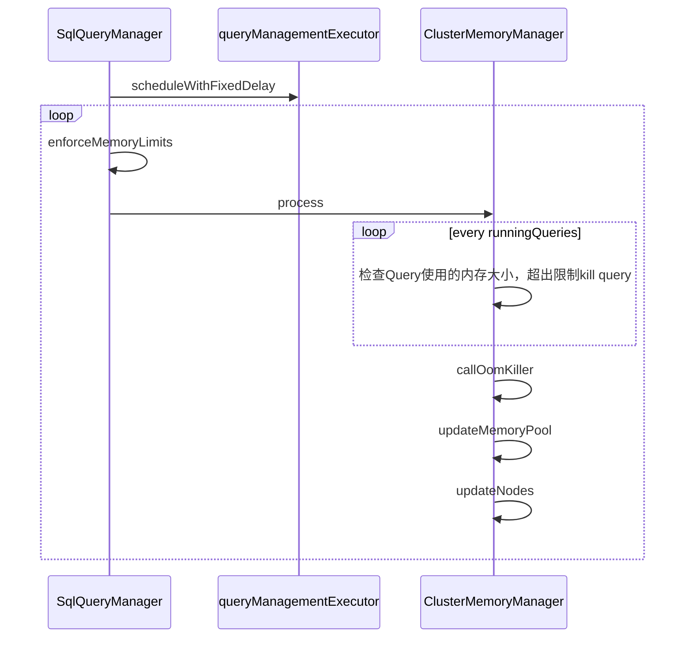

# Trino源码学习-内存管理

Trino中的内存管理分为两块:

- LocalMemoryManager: 在ServerMainModule中声明，用于管理当前节点的内存使用
- ClusterMemoryManager: 在CoordinatorModule中声明，用于管理集群的内存使用

<!--more-->

## LocalMemoryManager

LocalMemoryManager的主要功能都是依托MemoryPool实现的。memorypool中记录了userMemory和RevocableMemory的申请和回收。

QueryContext初始化时会持有MemoryPool。用于后续的内存信息更新和检测。

如果Session设置了resource_overcommit，那么QueryContext可用的UserMemory最大空间就是整个MemoryPool

```
+----------------------------------+
|                                  |
|         JVM MAX HEAP             |
+---------------+------------------+
|               |                  |
|  HeapHeadroom |   MemoryPool     |
|               |                  |
+---------------+------------------+
                |                  |
                |   UserMemory     |
                |                  |
                +------------------+
```

如果Session没有设置resource_overcommit，那么QueryContext可用的UserMemory最大空间就是整个UserMemory这一部分，其最大值是`query.max-memory-per-node`.

```
+--------------------------------------------------+
|                                                  |
|                 JVM MAX HEAP                     |
+---------------+----------------------------------+
|               |                                  |
|  HeapHeadroom |            MemoryPool            |
|               |                                  |
+---------------+---------------+------------------+
                |               |                  |
                |   UserMemory  |   UserMemory     |
                |               |                  |
                +---------------+------------------+
```


```java
// io.trino.memory.QueryContext
public synchronized void initializeMemoryLimits(boolean resourceOverCommit, long maxUserMemory)
{
    checkArgument(maxUserMemory >= 0, "maxUserMemory must be >= 0, found: %s", maxUserMemory);
    if (resourceOverCommit) {
        // Allow the query to use the entire pool. This way the worker will kill the query, if it uses the entire local memory pool.
        // The coordinator will kill the query if the cluster runs out of memory.
        this.maxUserMemory = memoryPool.getMaxBytes();
    }
    else {
        this.maxUserMemory = maxUserMemory;
    }
    memoryLimitsInitialized = true;
}
private synchronized ListenableFuture<Void> updateUserMemory(TaskId taskId, String allocationTag, long delta)
{
    if (delta >= 0) {
        enforceUserMemoryLimit(memoryPool.getQueryMemoryReservation(queryId), delta, maxUserMemory);
        ListenableFuture<Void> future = memoryPool.reserve(taskId, allocationTag, delta);
        if (future.isDone()) {
            return NOT_BLOCKED;
        }

        return future;
    }
    memoryPool.free(taskId, allocationTag, -delta);
    return NOT_BLOCKED;
}

private void enforceUserMemoryLimit(long allocated, long delta, long maxMemory)
{
    if (allocated + delta > maxMemory) {
        throw exceededLocalUserMemoryLimit(succinctBytes(maxMemory), getAdditionalFailureInfo(allocated, delta));
    }
}
```

## ClusterMemoryManager

- ClusterMemoryManager使用ClusterMemoryPool记录每个Query的内存分配。
- ClusterMemoryManager使用RemoteNodeMemory记录每个Node的内存状况。



SqlQueryManager的循环线程(1s一次)不断获取当前集群节点和集群整体内存占用情况，并在有OOM情况时，kill查询。

判断是否有OOM的条件是ClusterMemoryPool中存在阻塞节点。

```java
private boolean isClusterOutOfMemory()
{
    return pool.getBlockedNodes() > 0;
}
// BlockedNode的判断逻辑 
if (poolInfo.getFreeBytes() + poolInfo.getReservedRevocableBytes() <= 0) {
    blockedNodes++;
}
```

当存在OOM现象时，会把所有query遍历一遍，进一步分析。

- 如果查询有RESOURCE_OVERCOMMIT标志，且内存溢出了，那就把带有此标志的SQL Kill掉。
- 如果没有RESOURCE_OVERCOMMIT标志，那就看看内存是否超过集群允许的内存

然后将对应的Query标记为Failed。

```java
if (resourceOvercommit && outOfMemory) {
    // If a query has requested resource overcommit, only kill it if the cluster has run out of memory
    DataSize memory = succinctBytes(getQueryMemoryReservation(query));
    query.fail(new TrinoException(CLUSTER_OUT_OF_MEMORY,
            format("The cluster is out of memory and %s=true, so this query was killed. It was using %s of memory", RESOURCE_OVERCOMMIT, memory)));
    queryKilled = true;
}

if (!resourceOvercommit) {
    long userMemoryLimit = min(maxQueryMemory.toBytes(), getQueryMaxMemory(query.getSession()).toBytes());
    // 判断userMemory是否超出
    if (userMemoryReservation > userMemoryLimit) {
        query.fail(exceededGlobalUserLimit(succinctBytes(userMemoryLimit)));
        queryKilled = true;
    }
    // 判断totalMemory是否超出
    long totalMemoryLimit = min(maxQueryTotalMemory.toBytes(), getQueryMaxTotalMemory(query.getSession()).toBytes());
    if (totalMemoryReservation > totalMemoryLimit) {
        query.fail(exceededGlobalTotalLimit(succinctBytes(totalMemoryLimit)));
        queryKilled = true;
    }
}
```

如果发现集群有节点已经OOM了，但是过了5S，依然没有SQL被Kill掉，那就会触发SQL Kill策略，一共2种策略，通过`query.low-memory-killer.policy`指定:

- none: 不kill 任何Query
- total-reservation: kill 当前使用total内存最多的Query。
- total-reservation-on-blocked-nodes: kill OOM节点上使用内存最多的Query，默认设置。

```java
clusterUserMemoryReservation.set(totalUserMemoryBytes);
clusterTotalMemoryReservation.set(totalMemoryBytes);
// killOnOutOfMemoryDelay 默认5s
if (!lowMemoryKillers.isEmpty() &&
        outOfMemory &&
        !queryKilled &&
        nanosSince(lastTimeNotOutOfMemory).compareTo(killOnOutOfMemoryDelay) > 0) {
    if (isLastKillTargetGone()) {
        callOomKiller(runningQueries);
    }
    else {
        log.debug("Last killed target is still not gone: %s", lastKillTarget);
    }
}
```

## Trino内存配置参数

|配置名|默认值|范围|描述|
|:---|:---|:---|:---|
|`query.max-memory-per-node`|JVM max memory * 0.3|node|一个查询在一个worker节点上最大使用的用户内存|
|`query.max-memory`|20GB|cluster|一个查询在整个集群上最大使用的用户内存|
|`query.max-total-memory`|query.max-memory*2|cluster|一个查询在集群上最大使用的内存，包含可撤销内存|
|`memory.heap-headroom-per-node`|JVM max memory * 0.3|node|用于buffer的Jvm堆内存，主要是第三方库的内存分配，无法被统计跟踪|

> `query.max-memory-per-node`和`memory.heap-headroom-per-node`的和必须小于JVM的最大堆大小。

## spill-to-disk

对于内存密集查询，Trino允许溢出中间操作结果到磁盘。Trino引入了可撤销内存的概念。一个查询可以请求不计入限制的内存空间，但内存管理器可以随时撤销此内存空间。当内存空间被撤销时， 查询运行程序将中间数据从内存溢出到磁盘并稍后处理它。支持spill的Operator都实现了startMemoryRevoke方法.

> 溢写到磁盘是RevocableMemory

## OOM killer

Trino的默认JVM参数中设置了

- `-XX:+ExitOnOutOfMemoryError`:传递此参数时，抛出OutOfMemoryError时JVM将立即退出。

而linux 内核又有 OOM killer机制。所以在出现Worker OOM情况时要注意区分是节点JVM OOM，还是系统OOM。

- 判断是否系统OOM，可以通过 `grep "Out of memory" /var/log/messages`或者`dmesg -T` 查看，如果是系统OOM，一定要检查下节点是否有其他服务。
- 如果不是系统OOM，那么就是Trino节点OOM了，可以分析下是否内存或者堆外内存泄漏。或者是上述内存配置未正确设置。

