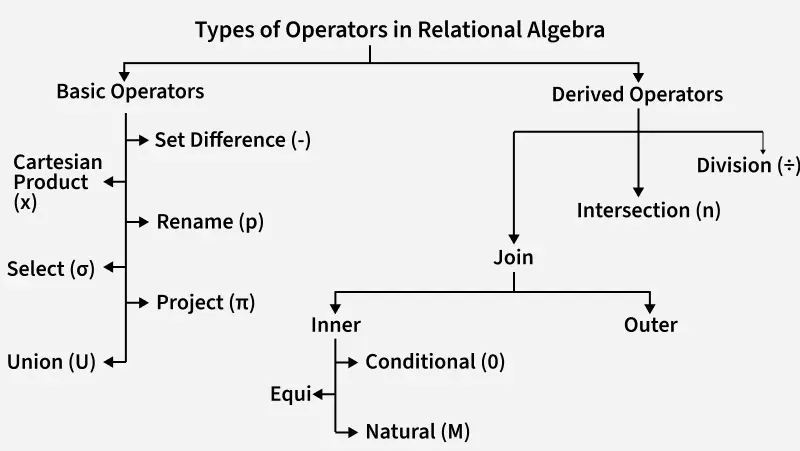

# 形式化关系查询语言

查询语言是用户用来从数据库中请求信息的语言。查询语言可以分为过程化和非过程化的。在过程化语言中用户指导系统对数据库执行一系列操作以计算出结果。在非过程化语言中，用户只需要描述所需信息，而不用给出具体过程。

实际上使用的查询语言既包含过程化的成分，又包含非过程化的成分。在一些"纯"查询语言中，关系代数是过程化的，而元组关系演算和域关系演算是非过程的。

在解释关系代数操作之前，介绍一些基本概念：

- 关系：在关系代数中，关系是由行和列组成的表，以结构化格式表示数据。每个关系都有一个唯一的名称，并由元组组成。
- 元组：元组是关系中的一行，其中包含每个属性的一组值。它表示关系表中的单个数据条目或记录。
- 属性：属性是关系中的列，每个列表示数据的特定特征或属性。例如，在“学生”关系中，属性可以是“姓名”、“年龄”和“年级”。
- 域：域是属性可以具有的可能值的集合。它定义可以存储在关系的每一列中的数据类型，如整数、字符串或日期。

<!--more-->

## 关系代数

关系代数是一种过程化查询语言。包含了一个运算的集合，这些运算以一个或两个关系为输入，产出一个新的关系为结果。由于关系运算的结果和输入类型一样，我们可以把多个关系代数运算组合成关系代数表达式。

关系代数运算的算子如下:

### 基本运算

选择，投影和更名运算称为一元运算。因为它们对一个关系进行运算。差集，笛卡尔积和并对两个关系进行运算，因而被称为二元运算。

#### 选择(select) 

选择运算选出满足给定谓词的元组。选择谓词中可以使用比较，也可以使用and，or和not将多个谓词组合为一个较大的谓词。

例如：如果我们有一个关系R，它有属性A、B和C，我们想选择`C>3`的元组:

| A | B | C |
|:---:|:---:|:---:|
| 1 | 2 | 4 |
| 2 | 2 | 3 |
| 3 | 2 | 3 |
| 4 | 3 | 4 |

$\sigma_{c>3}(R)$ 将选择c大于3的元组，输出

| A | B | C |
|:---:|:---:|:---:|
| 1 | 2 | 4 |
| 4 | 3 | 4 |

#### 投影(project) 

投影运算返回作为参数的关系，可以将某些属性排除在外。假设我们需要关系R中的列B和C。

$\Pi_{(B,C)}(R)$ 将仅显示以下列:

| B | C |
|:---:|:---:|
| 2 | 4 |
| 2 | 3 |
| 3 | 4 |

> 默认情况下，投影操作会删除重复的值

#### 并集(union) 

并集运算将两个集合合并起来。并集运算要求:

- 关系r和s必须是同元的，即它们的属性数目必须相同。
- 对于所有的i，r的第i个属性的域必须和s的第i个属性的域相同。

考虑下表中的学生有不同的选修科目。

法语课

| 学生姓名 | 学号 |
|:---:|:---:|
| Ram | 01 |
| Mohan | 02 |
| Vivek | 13 |
| Geeta | 17 |

德语课

| 学生姓名 | 学号 |
|:---:|:---:|
| Vivek | 13 |
| Geeta | 17 |
| Shyam | 21 |
| Rohan | 25 |

我们可以将学生姓名进行并集运算: $\Pi_{(学生姓名)}(法语课) \cup \Pi_{(学生姓名)}(德语课)$ ,输出:

| 学生姓名 |
|:---:|
| Ram |
| Mohan |
| Vivek |
| Geeta |
| Shyam |
| Rohan |

#### 差集(set-difference)

差集运算可以找出在一个关系而不在另一个关系中的元组。差集运算要求:

- 关系r和s必须是同元的，即它们的属性数目必须相同。
- 对于所有的i，r的第i个属性的域必须和s的第i个属性的域相同。

要查找仅学习法语但不学习德语的学生: $\Pi_{(学生姓名)}(法语课) - \Pi_{(学生姓名)}(德语课)$。

| 学生姓名 |
|:---:|
| Ram |
| Mohan |

#### 更名(rename)运算

rename可以给关系运算表达式赋上名称。当我们想要避免歧义时，它非常有用，特别是在复杂的情况下。重命名是一个一元操作，用于重命名关系的属性。

例如：我们可以将R中的属性B重命名为D。

| A | B | C |
|:---:|:---:|:---:|
| 1 | 2 | 4 |
| 2 | 2 | 3 |
| 3 | 2 | 3 |
| 4 | 3 | 4 |

$\rho_{（D/B）}(R)$ 将关系的属性“B”重命名为“D”。  

| A | D | C |
|:---:|:---:|:---:|
| 1 | 2 | 4 |
| 2 | 2 | 3 |
| 3 | 2 | 3 |
| 4 | 3 | 4 |

#### 笛卡尔积(Cartesian-product)

笛卡尔积运算使得我们可以将任意两个关系的信息组合在一起。假设A和B，那么A和B的笛卡尔积积将导致A的所有属性后面跟着B的每个属性。A的每条记录将与B的每条记录配对。

|Name|Age|Sex|
|:---:|:---:|:---:|
| Ram | 14 | M |
| Sona | 15 | F |
| Kim | 20 | M |

|ID|Course|
|:---:|:---:|
| 1 | DS |
| 2 | DBMS |

输出：如果关系A有3行，关系B有2行，则笛卡尔积 $A * B$ 将得到6行。

| Name | Age | Sex | ID | Course |
|:---:|:---:|:---:|:---:|:---:|
| Ram | 14 | M | 1 | DS |
| Ram | 14 | M | 2 | DBMS |
| Sona | 15 | F | 1 | DS |
| Sona | 15 | F | 2 | DBMS |
| Kim | 20 | M | 1 | DS |
| Kim | 20 | M | 2 | DBMS |

#### 形式化定义

关系代数中的基本表达式是:

- 数据库中的一个关系
- 一个常数关系

关系代数中一般的表达式是由更小的子表达式构成。设 $E1$ 和 $E2$ 是关系代数表达式。则以下都是关系代数表达式:

- 并集: $E1 \cup E2$
- 差集: $E1 - E2$
- 笛卡尔积: $E1 * E2$
- 选择: $\sigma_P(E1)$ ,其中p是E1的属性上的谓词
- 投影: $\Pi_S(E1)$ ,其中S是E1中某些属性的列表
- rename: $\rho_X(E1)$ ,其中 x是E1结果的新名字

### 多重集关系代数

与一般关系代数不同的是，SQL在输入关系以及在查询结果中存在元组的多重拷贝(多重集)。SQL标准有如下定义: 在一个查询的输出结果中，每个元组有多少个拷贝取决于所对应的元组在输入关系中的拷贝个数。针对SQL这种情况，有多重关系代数(适配多重集的关系代数)。

- 如果在 $r_1$ 中元组 $t_1$ 有 $c_1$ 份拷贝，并且 $t_1$ 满足选择 $\sigma_P$ ，那么在 $\sigma_P(r_1)$ 中元组 $t_1$ 有 $c_1$ 份拷贝。
- 对于 $r_1$ 中元组 $t_1$ 的每份拷贝，在 $\Pi_A(r_1)$ 中都有一个与之对应的 $\Pi_A(t_1)$ ，那么 $\Pi_A(t_1)$ 表示单个元组 $t_1$ 的投影。
- 如果在 $r_1$ 中元组 $t_1$ 有 $c_1$ 份拷贝，在 $r_2$ 中元组 $t_2$ 有 $c_2$ 份拷贝，那么在 $r_1 * r_2$ 中有元组 $(t1 \space t2)$ 的 $c_1 * c_2$ 份拷贝。
 
### 附加的关系代数运算

关系代数的基本运算可以表达任何关系代数查询。但是如果只依靠基本运算，某些查询表达出来会显得冗长。因此，引入了一些新运算，不能增强关系代数的表达能力，却可以简化一些常用查询。

#### 交集(intersection) 

交集运算可以获取两个集合相交的部分。交集不是基本运算，$r \cap s = r- (r-s)$ ，可以通过基本运算实现。

要查找学习法语且学习德语的学生: $\Pi_{(学生姓名)}(法语课) \cap \Pi_{(学生姓名)}(德语课)$。输出如下:

| 学生姓名 |
|:---:|
| Vivek |
| Geeta |

#### 赋值运算(assignment) 

赋值运算 $\gets$ 通过给临时关系变量赋值的方法帮助书写关系代数表达式。该关系变量可以在后续表达式中使用。

$$
 t \gets \Pi_{x, y}(\sigma_{condition}(R)) 
$$

例如: `CREATE VIEW t AS SELECT x, y FROM R WHERE condition`

#### 连接

将使用下面两个表解释不同的连接:

表 R:

| A | B |
|:---:|:---:|
| 1 | x |
| 2 | y |
| 3 | z |

表 S:

| B | C |
|:---:|:---:|
| x | 10 |
| y | 20 |
| w | 30 |

##### 自然连接(natural join)

自然连接运算是关系 r 和关系 s 的笛卡尔积中选取相同属性组 b 上值相等的元组所构成( $r \Join s= \sigma_{r[B]=s[B]}(r*s)$ )。
- join运算先形成两个参数的笛卡尔积，然后基于两个关系模式都出现的属性上的相等性(b=b)进行选择，最后还要去除重复属性。
- 如果关系r和s不含有任何相同的属性，那么自然join和笛卡尔积是相同的。

$R \Join S$ 的输出是:

| A | B | C |
|:---:|:---:|:---:|
| 1 | x | 10 |
| 2 | y | 20 |

##### $\theta$ 连接

$\theta$ 连接运算是在关系 r 和关系 s 的笛卡尔积中，选取 r 中属性 A 与 s 中属性 B 之间满足 $\theta$  条件的元组构成( $r \Join s_{A \theta B}= \sigma_{r[A] \theta s[B]}(r*s)$ )。

例如，基于条件θ连接表R和S，条件是`R.B = S.B and R.A > 1`: $R \Join S_{R.B=S.B \land R.A>1}$。

输出表：

| A | R.B | S.B | C |
|:---:|:---:|:---:|:---:|
| 2 | y | y | 20 |

##### 等值连接(equal join)

等值连接运算是关系 r 和关系 s 的笛卡尔积中选取 r 中属性 A 与 s 中属性 B 上值相等的元组所构成( $r \Join s_{A=B}= \sigma_{r[A]=s[B]}(r*s)$ )。当 $\theta$ 连接中运算符为`＝`时，就是等值连接，等值连接是 $\theta$ 连接的一个特例。

##### 外连接运算

外连接是连接运算的扩展。

- 左外连接 $r \sqsupset \Join s$ , 取出左侧关系中所有与右侧关系任一元组都不匹配的元组，用空值填充所有右侧关系的属性。在将产生的元组加到自然连接的结果中。
- 右外连接 $r \Join \sqsubset s$ ,取出右侧关系中所有与左侧关系任一元组都不匹配的元组，用空值填充所有左侧关系的属性。在将产生的元组加到自然连接的结果中。
- 全外连接 $r \sqsupset \Join \sqsubset s$，既做左外连接又做右外连接。取出左侧关系中所有与右侧关系任一元组都不匹配的元组，用空值填充所有右侧关系的属性。取出右侧关系中所有与左侧关系任一元组都不匹配的元组，用空值填充所有左侧关系的属性。最后，加上自然连接的结果。

#### 除法

除法运算符用于查找一个关系中与另一个关系中的所有记录相关联的记录。当我们想要在多个相关的数据集中识别满足某些条件的实体时，通常会使用它。

除法运算符$R \div S$可以应用于以下情况：

- B的属性是R的属性的真子集。
- 结果将包括A的所有属性，除了S中的那些。
- 它从R返回与S中的每个元组相关联的元组。

关系 R: 
| A | B |
|:---:|:---:|
| 1 | x |
| 1 | y |
| 2 | x |
| 2 | y |
| 3 | z |

关系 S:
| B |
|:---:|
| x |
| y |

除法 $R \div S$ 返回与S中所有B值关联的A值。

| A |
|:---:|
| 1 |
| 2 |

### 扩展的关系代数运算

#### 广义投影(generalized-projection)

广义投影运算允许在投影列表中使用算术运算和字符串函数等来对投影进行扩展。运算形式为: $\Pi_{F_1,F_2,...,Fn}(E)$ 。其中E是任意的关系代数表达式，而 $F_1,F_2,...,F_n$ 中的每一个都是涉及常量和E中的属性的算术表达式。 最基本的情况下，算术表达式可以仅仅是一个属性或常量。

#### 聚集(aggregate function)

聚集运算，可以对值的集合使用聚集函数，例如计算最小值或者平均值。聚集函数输入值的一个汇集，返回一个单一值。使用聚集函数对其进行操作的汇集中，一个值可以出现多次，值的出现顺序是无关紧要。这样的汇集称为多重集(multiset)。

聚合运算的运算形式如下: $_{G_1,G_2,...,G_n}G_{F_1(A_1),F_2(A_2),...,F_n(A_n)}(E)$ ，其中 $g_n$ 表示用于分组的一个属性，$f_n$ 是一个聚集函数，$a_n$ 是一个属性名。例如 $_{CATEGORY}G_{count(ID)}(E)$ 表示每个分类的ID数。 $G_{count(ID)}(E)$ 表示总ID数。

## 元组关系演算

在书写关系代数表达式时，提供了产生查询结果的过程序列，而元组关系演算是非过程化的查询语言，只描述所需信息，而不给出获取该信息的具体过程。元组关系演算中的查询表达式为: $|t| P(t)$ 。表示所有使谓词P为真的元组t的集合。

- 用 $t[A]$ 表示元组t在属性A上的值
- 用 $t\in r$ 表示元组t在关系r中。

### 查询示例

假设想表示 instructor关系中所有工资在80000以上的教师的ID，name，salary。

$$
|t| t\in instructor \land t[salary] > 80000|
$$

如果我们只想要ID属性，而不是关系instructor的所有属性。我们通过 $\exist t \in r(Q(t))$ 这一(存在)结构来表示 关系r中存在元组t使谓词Q(t)为真。

$$
\{ t| \exist s \space\in instructor(t[ID] = s[ID] \land s[salary] > 80000)\}
$$

表示 所有满足如下条件的元组t的集合(在关系instructor中存在元组s使得t和s在属性ID上值相等，且s在属性salary上值大于80000美元)。

- $\land$ 表示关系 与
- $\lor$ 表示关系 或
- $\lnot$ 表示关系 非
- $\implies$ 表示关系蕴含，$P \implies Q$ 表示，如果P为真，那么Q必然为真。逻辑上等价于 $\lnot P \lor Q$
- $\forall$ 表示对所有，例如 $\forall t \in r(Q(t))$ 表示对于关系r中所有元组t，Q均为真。

### 形式化定义

元组关系演算表达式具有如下形式: $|t|P(t)$ 。其中 P是一个公式，公式中可以出现很多元组变量，如果元组变量不被 $\exist$ 或 $\forall$ 修饰，则称为自由变量。因此，在

$$
t \in instructor \land \exist s \space\in department(t[dept\_name] = s[dept\_name])
$$

中，t是自由变量，而元组变量s是受限变量。元组关系演算的公式由原子构成，原子可以是如下的形式之一:

- $s \in r$ ，其中s是元组变量而r是关系。(注意: 不允许使用 $\notin$ 运算符)
- $s[x] \space \Theta \space u[y]$ ，其中s和u是元组变量，x是s所基于的关系模式中的一个属性，y是u所基于的关系模式中的一个属性， $\Theta$ 是比较关系运算符:  $\lt, \le, \ge ,\gt,\ne, =$。(注意: 要求属性x和y所属域的成员能用 $\Theta$ 比较)
- $s[x] \space \Theta \space c$ ，其中s是元组变量，x是s所基于的关系模式中的一个属性，$\Theta$ 是比较关系运算符，c是属性x所属域中的常量。

我们根据如下规则，使用原子构造公式:

- 原子是公式。
- 如果 $P_1$ 是公式，那么 $\lnot P_1$ 和 $(P_1)$ 也都是公式。
- 如果 $P_1$ 和 $P_2$ 是公式，那么 $P_1 \lor P_2$ 、$P_1 \land P_2$ 和 $P_1 \implies P_2$ 也都是公式。
- 如果 $P_1(s)$ 是包含自由元组变量s的公式，且r是关系，则 $\exist s \in r(P_1(s))$ 和 $\forall s \in r(P_1(s))$ 也都是公式。

我们可以写出一些形式上不一样的等价表达式。

- $P_1 \land P_2$ 等价于 $\lnot (\lnot (P_1) \lor \lnot(P_2))$
- $\forall t \in r(P_1(s))$ 等价于 $\lnot \exist t \in r(\lnot P_1(t))$
- $P_1 \implies P_2$ 等价于 $\lnot(P_1) \lor P_2$

### 表达式安全性问题

元组关系演算表达式可能产生一个无限的关系，例如 $|t| \lnot (t \in instructor)$ , 不在instructor的元组有无限多个，大多数的元组都不在数据库中。我们不希望有这样的表达式。

为了对元组关系演算进行限制，引入了元组关系公式P的域这一概念。P的域(dom(P))是P所引用的所有值的集合，既包括P自身用到的值，又包括P中涉及的关系的元组中出现的所有值。因此，P的域是P中显式出现的值及出现在P中的那些关系的所有值的集合。

例如, $dom(t \in instructor \land t[salary] >80000)$ 是包括80000和出现在instructor中的所有值的集合。如果 $|t|P(t)$ 结果中的所有值均来自dom(P),那么我们说表达式是安全的。$|t| \lnot (t \in instructor)$ 是不安全的，因为很可能存在某个不在instructor中的元组t。

> 在安全表达式范围内的元组关系演算和基本关系代数具有相同的表达能力(仅限于基本关系代数)。

## 域关系演算

关系运算的另一种形式被称为域关系运算，使用从属性域中取值的域变量，而不是整个元组的值。就像关系代数是SQL语言的基础一样，域关系演算是被广泛采用的QBE语言的理论基础。

### 形式化定义

域关系演算中的表达式形式如下:

$$
|<x_1,x_2,...,x_n>|P(x_1,x_2,...,x_n)
$$

其中，$x_1,x_2,...,x_n$ 代表域变量。和元组关系演算一样，P代表由原子构成的公式。域关系演算中的原子有如下形式之一:

- $<x_1,x_2,...,x_n> \in r$ ，其中r是n个属性上的关系，而 $x_1,x_2,...,x_n$ 是域变量或域常量。
- $x \Theta y$ ，其中x和y是域变量，而 $\Theta$ 是比较运算符  $\lt, \le, \ge ,\gt,\ne, =$ (要求属性x和y所属域可以用 $\Theta$ 比较 )
- $x \Theta c$ , 其中x是域变量，$\Theta$ 是比较运算符，而c是x作为域变量的那个属性域中的常量。

根据以下的规则，我们可以用原子构造公式:

- 原子是公式
- 如果 $P_1$ 是公式，那么 $\lnot P_1$ 和 $(P_1)$ 也都是公式。
- 如果 $P_1$ 和 $P_2$ 是公式，那么 $P_1 \lor P_2$ 、$P_1 \land P_2$ 和 $P_1 \implies P_2$ 也都是公式。
- 如果 $P_1(x)$ 是x的一个公式，其中x是自由域变量，则 $\exist x \in (P_1(x))$ 和 $\forall x \in (P_1(x))$ 也都是公式。

> 我们将 $\exist a,b,c(P(a,b,c))$ 作为 $\exist a(\exist b(\exist c (P(a,b,c))))$的简写。

### 查询示例

- 找出工资在80000美元以上的教师的ID，name，dept_name和salary: $|<i,n,d,s>|<i,n,d,s> \in instructor \land s> 80000$ 
- 找出工资大于80000美元的所有教师的名字: $|<i>| \exist n,d,s(<i,n,d,s> \in instructor \land s > 80000)$

### 表达式安全性问题

在元组关系演算中提到，可以写出产生结果为无限关系的表达式。域关系演算中也有类似的情况。例如: $|<i,n,d,s>| \lnot (<i,n,d,s> \in instructor)$ 。 

这样的表达式是不安全的，因为它允许在结果中出现不在表达式域中的值。此外，在域关系演算中，我们还需要注意 ”存在“ 和 ”对所有“ 子句中公式的形式。例如: 

$$
|<x>| \exist y(<x,y> \in r) \land \exist z(\lnot(<x,z> \in r) \land P(x,z)) 
$$

其中P是涉及x和z的公式。对于公式的第一部分 $\exist y(<x,y> \in r)$ ，我们在测试时只需要考虑r中的值。但是对于公式中的第二部分，我们在测试时，需要考虑不在r中出现的z值。实际上不在r中出现的值是无限多的。所有我们需要通过增加一些约束来限制上面的表达式。

在元组关系演算中，我们将所有存在量词修饰的变量限制在某个关系范围内。在域关系演算中，我们也增加用于定义安全性的规则，以处理上面的类型情况。

- 表达式的元组中所有值均来自 $dom(P)$.
- 对于形如 $\exist x(P_1(x))$ 的”存在“子公式而言，子公式为真，当且仅当在 $dom(P_1)$ 中有某个值x是 $P_1(x)$ 为真。
- 对于形如 $\forall x(P_1(x))$ 的”对所有“子公式而言，子公式为真，当且仅当在 $dom(P_1)$ 中所有值x 均使$P_1(x)$ 为真。

当上面条件同时成立时，我们认为表达式 $|<x_1,x_2,...,x_n>| P(x_1,x_2,...,x_n)$ 是安全的

## 总结

关系代数定义了一套在表上运算且输出结果也是表的代数运算。这些运算可以混合使用成表达式，来描述对应查询。关系代数运算可以分为:

- 基本运算
- 附加的运算(可以用基本运算表达)、
- 扩展的运算，扩展了关系代数的表达能力

关系代数是简洁的，形式化的语言。SQL是基于关系代数的。元组关系演算和域关系演算是非过程化的语言，代表了关系查询语言所需要的基本能力。基本关系代数是一种过程化语言，在能力上等价于被限制在安全表达式范围内的关系演算。

## 参考

- [1] [Introduction of Relational Algebra in DBMS](https://www.geeksforgeeks.org/dbms/introduction-of-relational-algebra-in-dbms/)

