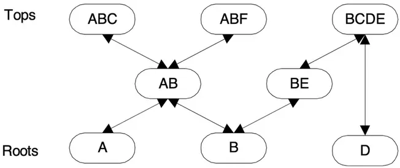
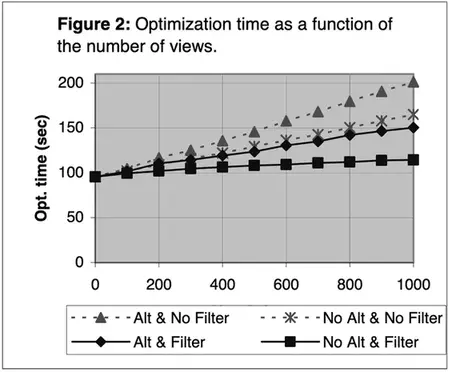
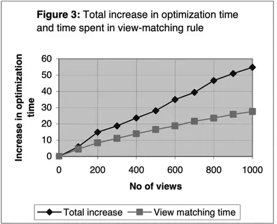

# 使用物化视图优化查询:一个实用的、可扩展的解决方案

本篇是论文[使用物化视图优化查询:一个实用的、可扩展的解决方案](https://courses.cs.washington.edu/courses/cse591d/01sp/opt_views.pdf)的中文简单翻译

<!--more-->

物化视图可以大大缩短查询处理时间，特别是对于大型表的聚合查询。要释放这种潜力，查询优化器必须知道如何以及何时利用物化视图。本文提出了一种快速且可扩展的算法，用于确定是否可以从物化视图中计算查询的部分或全部，并描述了如何将其纳入基于转换的优化器中。当前版本处理由selections、joins和group by组成的视图。优化仍然完全基于成本，也就是说，启发式规则不会选择单个“最佳”重写，而是生成多个重写，优化器以正常方式选择最佳替代方案。实验结果表明，该算法在Microsoft SQL Server上实现了良好的性能和可扩展性。优化时间随着视图数的增加而缓慢增加，但即使视图数达到1000次，优化耗时仍然很低。

关键字:

- 物化视图
- 视图匹配
- 查询优化

## 引言

使用物化视图来加速查询处理是一种古老的想法[<sup>10</sup>](#refer-anchor-10)，但直到最近几年，这个想法才在商业数据库系统中采纳。最近的TPC-R基准测试结果和实际的客户体验表明，通过明智地使用物化视图，可以将查询处理时间提高几个数量级。要释放物化视图的潜力，需要有效解决以下三个问题:

- 视图设计: 确定要实现哪些视图，包括如何存储和索引它们。
- 视图维护: 当更新基表时，有效地更新物化视图。
- 视图开发: 有效利用物化视图，以加快查询处理。

本文讨论了基于转换的优化器中的视图开发。概念上讲，优化器生成查询表达式的所有可能重写，估计它们的成本，并选择成本最低的重写。基于转换的优化器通过在查询的子表达式上应用本地转换规则来生成重写。应用规则产生替代表达式，等价于原始表达式。视图匹配，即从物化视图计算子表达式，就是一个转换规则。视图匹配规则调用一个视图匹配算法，该算法确定是否可以从一个或多个现有物化视图中计算原始表达式，如果可以，则生成替代表达式。在优化过程中，算法可能被调用多次，每次都在不同的子表达式上调用。

本文的主要贡献是:

- 为由 selections、join和final group-by (SPJG视图)组成的视图提供了一种高效的视图匹配算法;
- 一种新的索引结构(基于视图定义，而不是视图数据)，它可以快速地将搜索范围缩小到一小部分候选视图，并在这些视图上应用视图匹配。这里描述的算法版本仅限于SPJG视图，并产生单视图替代品。然而，这些并不是我们方法的固有限制;算法和索引结构可以扩展到更广泛的视图和替代品类别。我们简要地讨论了可能的扩展，但细节超出了本文的范围。

我们的视图匹配算法快速且可扩展。速度是至关重要的，因为在复杂查询的优化过程中可能会多次调用视图匹配算法。我们还想要一种能够高效处理数千个视图的算法。许多数据库系统包含数百甚至数千个表。这样的数据库可能有数百个物化视图。类似于[<sup>1</sup>](#refer-anchor-1)中描述的工具也可以生成大量视图。智能系统还可以缓存和重用先前计算的查询结果。缓存的结果可以被视为临时的实体化视图，很容易产生数千个实体化视图。该算法在Microsoft SQL Server中实现，使用基于Cascades框架的基于转换的优化器[<sup>6</sup>](#refer-anchor-6)。实验结果表明，该算法具有良好的性能和可扩展性。优化时间随着浏览量的增加呈线性增长，但即使视图数达到1000次，优化时间仍然很低。

通过优化器的常规规则机制集成视图匹配提供了重要的好处。可能会产生多个重写;有些利用物化视图，有些则不然。所有重写都参与正常的基于成本的优化，而不管它们是否使用物化视图。如果物化视图上有二级索引，则会自动考虑。优化时间甚至可以缩短。如果在优化过程的早期发现使用物化视图的廉价计划，它会收紧成本界限，从而导致更积极的修剪。

本文的其余部分组织如下。第2节描述了支持的物化视图类型，并定义了要解决的问题。第3节描述了决定是否可以从视图计算查询表达式的算法。第4节介绍了我们的索引结构。第5节给出了基于我们的原型实现的实验结果。相关工作将在第6节讨论。第7节包含总结和对可能扩展的简要讨论。

## 定义问题

SQL Server 2000支持物化视图。它们在索引视图中被调用，因为物化视图可以以多种方式被索引。通过在现有视图上创建**唯一的聚集索引**来实现视图。唯一性意味着视图输出必须包含**唯一键**。这对于保证视图可以增量更新是必要的。一旦创建了聚集索引，就可以创建额外的二级索引。并非所有视图都是可索引的。可索引视图必须由包含selections、(内部)join 和可选group-by的单级SQL语句定义。FROM子句不能包含派生表，也就是说，它必须引用基表，并且不允许子查询。聚合视图的输出必须包括所有分组列作为输出列(因为它们定义了键)和计数列。聚合函数仅限于sum和count。这就是本文所考虑的一类视图。

示例1:这个示例展示了如何在SQL Server 2000中创建一个带有附加二级索引的索引视图。本文中的所有示例都使用了TPC-H/R数据库。

```sql
CREATE VIEW v1 WITH schemabinding AS
SELECT p_partkey,
       p_name,
       p_retailprice,
       count_big(*) AS cnt,
       sum(l_extendedprice*l_quantity) AS gross_revenue
FROM dbo.lineitem,
     dbo.part
WHERE p_partkey < 1000
  AND p_name like '%steel%'
  AND p_partkey = l_partkey
GROUP BY p_partkey,
         p_name,
         p_retailprice
CREATE UNIQUE clustered INDEX v1_cidx ON v1(p_partkey)
CREATE INDEX v1_sidx ON v1(gross_revenue, p_name)
```

第一个语句创建视图v1。`with schemabbinding`对于索引视图是必需的。在所有聚合视图中都需要count_big列，以便可以增量地处理删除(当计数变为零时，组为空「在该聚合组下没有明细数据的意思」并且必须删除行)。由算术或其他表达式定义的输出列必须分配名称(使用AS子句)，以便可以引用它们。第二个语句物化视图并将结果存储在聚集索引中。即使语句只指定视图的(唯一)键，视图行中也包含所有输出列。最后一条语句在物化视图上创建二级索引。

如引言中所述，基于转换的优化器通过递归地在关系表达式上应用转换规则来生成重写。视图匹配是在select-project-join-group-by (SPJG)表达式上调用的转换规则。对于每个表达式，我们希望找到可以计算表达式的每个物化视图。在本文中，我们要求表达式可以单独从视图中计算。下面是本文考虑的视图匹配问题。

__使用单视图替代品进行视图匹配__:给定一个SPJG形式的关系表达式，找到可以计算该表达式的所有物化(SPJG)视图，并为找到的每个视图构造一个等价于给定表达式的替代表达式。

对整个查询没有施加任何限制。即使我们只考虑单视图替代品，也可以使用不同的视图来计算查询的不同部分。每当优化器找到SPJG表达式时，就调用视图匹配规则。视图匹配产生的所有替代品都以正常的方式参与基于成本的优化。此外，在物化视图上定义的任何二级索引都将以与基表相同的方式被自动纳入考虑。

本文解释的算法仅限于SPJG子表达式和单表替换。然而，这并不是我们方法的固有限制。该算法可以扩展到更广泛的输入和替代表达式类，例如，包含联合、外部连接或带有grouping sets的聚合的表达式。

## 从视图计算查询表达式

在本节中，我们将描述用于确定是否可以从视图计算查询表达式的测试，以及如果可以，如何构造替代表达式。第一部分处理 连接-查询-投影(join-select-project, SPJ)视图和查询（假设视图和查询引用相同的表）。带有额外表的视图和带有聚合的视图的场景将在单独的小节中覆盖。没有必要考虑表数少于查询表达式的视图「注: 例如某个查询表达式是基于两个表的字段的四则运算，如果视图只包含其中一个表，就可以直接忽略，交由子表达进一步处理」。这样的视图只能用于计算查询表达式的子表达式。将在每个子表达式上自动调用视图匹配规则。

我们的算法利用了四种类型的约束:列上的非空约束、主键约束、惟一性约束(通过创建惟一索引显式声明或隐含)和外键约束。我们假设视图和查询表达式的选择谓词已经转换为合取范式(CNF)。如果没有，我们首先将它们转换为CNF。我们还假设已经执行了连接消除（Join Elimination），因此查询和视图表达式不包含冗余表。(SQL Server优化器会自动执行此操作。)

>注：连接消除通过在不影响最终结果的情况下从查询中删除表，来简化SQL以提高查询性能。通常，当查询包含主键-外键连接并且查询中仅引用主表的主键列时，可以使用此优化从查询中删除主表。
> 考虑下面的例子，
>```sql
>select o.*from orders o innerjoin customer c on c.c_custkey=o.o_custkey
>``` 
> 订单表（orders）和客户表（customer）关联，且c_custkey是客户表的主键，那么客户表可以被消除掉，重写后的SQL如下：
>```sql
>select*from orders where o_custkey
> ```

### Join-select-project 视图和查询

要从视图计算SPJ查询表达式，视图必须满足以下要求。

1. 视图包含查询表达式所需的所有行。因为我们只考虑单视图替代品，所以这是一个明显的需求。但是，如果考虑包含视图联合的替代品，则不需要这样做。
2. 可以从视图中选择所有必需的行。即使视图中存在所有需要的行，我们也可能无法正确地提取它们。选择是通过应用谓词完成的。如果视图输出中缺少谓词所需的一列，则无法选择所需的行。
3. 所有的输出表达式都可以从视图的输出计算出来。
4. 所有输出行都具有正确的复制因子。SQL基于包语义，也就是说，基本表或SQL表达式的输出可能包含重复的行。因此，两个表达式产生相同的行集是不够的，任何重复的行也必须出现完全相同的次数。

列之间的等价在我们的测试中起着重要的作用，因此我们首先讨论这个主题。然后我们讨论如何确保满足上面的需求，每个需求都有一个单独的小节讨论。

#### 列等价类

$let \space W = P_{1} \land P_{2} \land ... \land P_{n}$ 是SPJ表达式的查询谓词(CNF形式)。通过收集合适的连词，我们可以将这个谓词重写为 $W= PE \land PNE$ ,其中PE是指( $T_i.C_p = T_j.C_q$ )形式的列相等谓词,PNE包含了其他所有谓词。$T_i$ 和 $T_j$ 是表（不一定是不同的 ），$C_p$ 和 $C_q$ 指列引用 「表示在某一个expression的输出中，哪些column的值是相同的」。

假设我们将执行SPJ表达式看作
1. 计算表join的笛卡尔积。
2. 然后在这个结果上进行PE谓词过滤。
3. 然后再执行PNE谓词过滤。
4. 最终计算输出列表中的表达式。

当执行完PE谓词过滤后，在PNE和输出列表中，一些列就是可以互相交互的。这种在等价的列之间重路由列引用的能力在后面很重要。

通过计算一组基于PE中的列相等谓词的等价类，可以简洁地获取关于列等价的知识。等价类是一组已知相等的列。计算等价类很简单。首先，将表达式引用的表的每一列放到一个单独的集合中。然后以任意顺序循环遍历列相等谓词。对于每个（ $T_i.C_p = T_j.C_q$ ）找到含有 $T_i.C_p$ 的集合和含有 $T_j.C_q$ 的集合。如果它们是不同的集合就合并这两个集合，否则什么都不做。最后剩下的集合是期望的等价类集合，包括由单个列组成的类。

备注: 

```
tables: i(o,p),j(q,r)
sets: {i.p} {i.o} {j.q} {j.r}
// 由于i.p = j.q
equivalence sets: {i.p,j.q} {i.o} {j.r}
```

#### 视图中是否存在所有必需的行?

假设查询表达式和视图表达式引用表 $T_1,T_2,...,T_m$ . 让 $W_q$ 表示查询表达式的where子句中的断言，$W_v$ 表示视图表达式的断言。原则上，判断视图是否包含所有查询表达式所必需的行很简单。我们所需要展示的是对于所有的有效表实例 $T_1,T_2,...,T_m$ ，表达式( $select \space * \space from \space\space T_1,T_2,...,T_m \space\space where \space W_q$ )的产出是表达式( $select \space * \space from \space\space T_1,T_2,...,T_m \space\space where \space W_v$ )的子集。这是可以保证的，如果我们有 $W_q \Rightarrow W_v$ ( $\Rightarrow$ 这里表示逻辑含义)。「举个例子，我们可以通过 $a>1 \Rightarrow a>10$，那么查询条件是`a>1`的视图显然包含了查询条件是`a>10`的query所必需的行」

因此，我们需要一个算法来判断 $W_q \Rightarrow W_v$ 是否成立。我们将断言重写 $W_q=P_{q.1}\land P_{q.2} \land ... \land P_{q.m}$ ，$W_v=P_{v.1} \land P_{v.2} \land ... \land P_{v.m}$。一个简单保守的算法是检查 $W_v$ 中的每个连接项 $P_{v.i}$ 都能在 $W_q$ 中找到相符的 $P_{q.i}$。这里有几种方式来判断连接项是否相符。例如，匹配可以是纯语法的。可以通过将每个连接项转换为字符串(例如，连接的SQL文本)，然后通过比较字符串来实现。这种方法的缺点是，即使是很小的语法差异也会导致不同的字符串。例如，两个谓词(`A>B`)和(`B<A`)将不会匹配。为了避免这个问题，我们必须解释谓词和利用表达式之间的等价。利用交换性就是一个很好的例子，它适用于许多类型的表达式:比较、加法、乘法和析取(OR)。我们可以设计不同复杂程度的匹配函数，这取决于我们在函数中构建了多少关于等价的知识。例如，一个简单的函数可能只理解`(A +B) = (B+ A)`，而一个更复杂的函数也可能认识到`(A/2+B/5)*10=A*5+B*2`。

我们的决策算法利用关于列等价和列范围的知识。我们首先将谓词 $W_q$ 和 $W_v$ 拆分成3个部分并把隐式测试写成:

$$
(PE_q \land PR_q \land PU_q \Rightarrow PE_v \land PR_v \land PU_v)
$$

$PE_q$ 由查询中的所有列相等谓词组成，$PR_q$ 包含了范围谓词，$PU_q$ 是剩余谓词包含的 $W_q$ 的所有剩余连接词。$W_v$ 以相同方式拆分。列相等谓词是 $(T_i.C_p = T_j.C_r)$ 形式的任何原子谓词。范围谓词是 $(T_i.C_p \space\space op\space\space c)$ 形式的任何原子谓词，其中op是如下操作符之一(`<`,`<=`,`=`,`>=`,`>`)。因此，隐式测试可以被分为3个独立部分：

$$
(PE_q \land PR_q \land PU_q \Rightarrow PE_v)\land (PE_q \land PR_q \land PU_q \Rightarrow PR_v) \land (PE_q \land PR_q \land PU_q \Rightarrow PU_v)
$$

隐式测试可以通过在先行词中删除连词来加强(用形式表示，公式 $(A \Rightarrow C)\Rightarrow (AB \Rightarrow C)$ 适用于任意谓词A、B、C。换句话说，如果我们能推断出A本身意味着C，那么A和B肯定一起意味着C【的子集】)。我们的最终测试是三个测试的强化版本。为了确定查询所需的所有行是否都存在于视图中，我们应用以下三个测试：

$$
(PE_q \Rightarrow PE_v)
$$

$$
(PE_q \land PR_q \Rightarrow PR_v) 
$$

$$
(PE_q \land PU_q \Rightarrow PU_v)
$$ 

第一个测试被称为相等等联接包容测试，因为在实践中，大多数列相等谓词来自相等等联接。然而，所有列相等谓词都包含在PE中，即使是那些引用同一表中列的谓词。回想一下，$PE_q$ 中的谓词是用于计算查询等价类的列相等谓词。由于 $PE_q$ 在后两个含义中是先行词，我们可以将列引用重路由到其查询等价类中的任何列。

这些测试显然比最低要求更强，可能会导致一些机会被错过。例如，当从等价连接测试的先行词中删除 $PR_q$ 时 ，我们将错过案例: 查询中两列等同于相同的常量。例如，$(A=2) \land (B=2)$，而视图包含较弱的谓词 $A=B$ 。剩下的包容测试中可能会出现类似的问题。例如，如果查询包含 $(A=5) \land (B=3)$，而视图包含谓词 $(A+B)=5$，我们将安全但错误地得出结论，视图没有提供所有必需的行。这是速度和完整性之间的权衡。

检查约束条件可以很容易地纳入测试。关键注意点是，查询使用的表上检查约束条件可以添加到where子句中，而不改变查询结果。因此，可以通过将检查约束条件包含在隐含 $W_q \Rightarrow W_v$ 的先行词中来考虑它们。检查约束条件是否会被实际利用取决于用于测试的算法。

**等价包含测试**,
等价包含测试相当于要求视图中所有相等的列在查询中也必须相等（但反之不成立）。我们通过首先计算列等价类来实现这个测试，如前一节所述，对于查询和视图，然后检查每个非平凡视图等价类是否是某个查询等价类的子集。由于传递性，仅仅检查视图中的所有列等价谓词也存在于查询中是一个弱得多的测试。假设视图包含 $A=B$ 和 $B=C$ ，查询包含 $A=C$ 和 $C=B$ 。即使实际前缀不拟合，它们在逻辑上是等价的，因为它们都暗示A=B=C。通过使用等价类可以正确捕捉传递性的效果。

如果视图通过了等价连接包含测试，我们就知道它不包含任何冲突的列相等约束。我们还可以很容易地计算出必须在视图上强制执行哪些补偿列相等约束才能产生查询结果。每当一些视图等价类 $E_1,E_2,…,E_n$ 映射到相同的查询等价类E时，我们在 $E_i$ 中的任何列和 $E_{i+1}$ 中的任何列之间创建一个列相等谓词，对于 $i=1,2,…,n-1$

**范围包含测试**
当不涉及OR时，范围包容测试有一个简单的算法。我们与查询中的每个等价类关联一个范围，该范围指定等价类中列的下限和上限。两个边界最初都没有初始化。然后我们一个接一个地考虑范围谓词，找到包含引用列的等价类，并根据需要设置或调整其范围。如果谓词是类型 $(T_i.C_p<=c)$ ，我们将边界设置为其当前值的最小值和c，如果是类型 $(T_i.C_p>=c)$，我们将边界设置为其当前值的最大值和c。$(T_i.C_p<c)$ 形式的谓词被视为$(T_i.C_p<=c-\Delta)$。其中 $c-\Delta$ 表示列 $T_i.C_p$ 领域中c前面的最小值。$(T_i.C_p>c)$ 形式的谓词被视为$(T_i.C_p<=c+\Delta)$。最后，形式 $(T_i.C_p=c)$ 的谓词被视为 $(T_i.C_p>=c) \land(T_i.C_p<=c)$。对视图重复相同的过程。

如果视图受到比查询更严格的约束，则无法生成所有必需的行。为了检查这一点，我们考虑至少设置了一个边界的范围视图等价类。我们在查询中找到匹配的等价类，在查询等价类中至少有一个列的查询等价类，并检查查询等价类的范围是否包含在视图等价类的范围内。（未初始化的边界被视为 $+\infty$ 或 $-\infty$。）如果不是，范围包容测试失败，视图被拒绝使用。

在此过程中，我们可以确定必须将哪些补偿范围谓词应用于视图以产生查询结果。如果查询范围与相应的视图范围精确匹配，则不需要限制。如果下界不完全拟合，我们必须通过强制谓词 $(T.C>=lb)$ 来限制视图结果，其中 $T.C$ 是（查询）等价类中的列，lb是范围的下界。如果上界不同，我们需要强制谓词 $(T.C<=ub)$。

这种范围覆盖算法可以扩展为支持范围谓词的析取(OR)。由于篇幅限制，我们将不在这里讨论扩展。我们的原型不支持析取。

**残余包含测试**
既不是列相等谓词也不是范围谓词的连接词构成查询和视图的残余谓词。应用于这些谓词的唯一推理是列等价。我们通过检查视图残余谓词中的每个连接词是否与查询残余谓词中的连接词匹配来测试含义。如果两个列引用相同的（查询）等价类，则它们匹配。如果匹配失败，视图将被拒绝，因为视图包含查询中不存在的谓词。查询中任何与视图中任何谓词不匹配的残余谓词都必须应用于视图。

正如本节开头所讨论的，是否发现两个连词匹配取决于匹配算法。我们的原型实现使用弱匹配算法：除了列等价，表达式必须相同。表达式由文本字符串和列引用列表表示。文本字符串包含表达式的文本版本，省略了列引用。列表包含表达式中的每个列引用，按照它们在表达式的文本版本中出现的顺序。要比较两个表达式，我们首先比较字符串。如果它们相等，我们扫描两个列表，比较两个列表中相同位置的列引用。如果两个列引用都包含在同一个（查询）等价类中，则列引用匹配，否则不匹配。如果所有列对都匹配，则表达式匹配。我们选择这种弱算法是为了速度，充分意识到它可能会导致一些机会的错失。

总之，以下是我们测试视图是否包含查询所需的所有行的过程的步骤。

1. 计算查询和视图的等价类。
2. 检查每个视图等价类是否是查询等价类的子集。如果不是，则拒绝视图
3. 计算查询和视图的范围间隔。
4. 检查每个视图范围是否包含相应的查询范围。如果不是，则拒绝视图。
5. 检查视图的剩余谓词中的每个连接词是否与查询的剩余谓词中的连接词匹配。如果不是，则拒绝视图

Example 2:

View:

```sql
Create view V2 with schemabinding as
Select l_orderkey, o_custkey, l_partkey,
l_shipdate, o_orderdate,
l_quantity*l_extendedprice as gross_revenue
From dbo.lineitem, dbo.orders, dbo.part
Where l_orderkey = o_orderkey
And l_partkey = p_partkey
And p_partkey >= 150
And o_custkey >= 50 and o_custkey <= 500
And p_name like ‘%abc%’
```

Query:

```sql
Select l_orderkey, o_custkey, l_partkey,
l_quantity*l_extendedprice
From lineitem, orders, part
Where l_orderkey = o_orderkey
And l_partkey = p_partkey
And l_partkey >= 150 and l_partkey <= 160
And o_custkey = 123
And o_orderdate = l_shipdate
And p_name like ‘%abc%’
And l_quantity*l_extendedprice > 100
```

- 第1步，计算等价类。并非所有的等价类都显示出来；{o_orderdate}和{l_shipdate}被包括在内，因为它们在示例后面需要。
  - 视图等价类
    - $\{l\_orderkey,o\_orderkey\},\{l\_partkey,p\_partkey\},\{o\_orderdate\},\{l\_shipdate\}$
  - 查询等价类
    - $\{l\_orderkey,o\_orderkey\},\{l\_partkey,p\_partkey\},\{o\_orderdate,l\_shipdate\}$
- 第2步：检查视图等价类包含。两个非平凡视图等价类在查询等价类之间都有精确匹配。（平凡）等价类 $\{o\_orderdate\}$ 和$\{l\_shipdate\}$ 映射到同一个查询等价类，这意味着替代表达式必须创建补偿谓词 (o_orderdate=l_shipdate)。
- 第3步: 计算范围。
  - 视图范围：$\{l\_partkey,p\_partkey\}\in (150, +\infty), \{o\_custkey\}\in (50,500)$
  - Query范围：$\{l\_partkey,p\_partkey\} \in (150,160),\{o\_custkey\} \in (123,123)$
- 第4步：检查查询范围的包含。$\{l\_partkey,p\_partkey\}$ 上的范围 $(150,160)$ 包含在相应的视图范围内。上限不匹配，因此我们必须强制执行谓词 $(\{l\_partkey,p\_partkey\}<=160)$。$\{o\_custkey\}$ 上的范围 $(123,123)$ 也包含在相应的响应视图范围内。边界不匹配，因此我们必须强制执行谓词 $(o\_custkey>=123)$ 和 $(o\_custkey<=123)$，这可以简化为 $(o_custkey=123)$。
- 第5步：检查视图残余谓词的匹配。
  - 视图残余谓词: `p_name like "%abc%"`
  - Query残余谓词: `p_name like "%abc%", l_quantity*l_extendedprice>100`
  - 视图只有一个残余谓词，`p_name like "%abc%"`，也存在于查询中。必须强制执行额外的残余谓词，`l_quantity*l_extendedprice>100`。
  
视图通过了所有测试，因此我们得出结论，它包含所有必需的行。必须应用于视图的补偿谓词是: 

$$
(o\_orderdate=l\_shipdate),(\{p\_partkey, l\_partkey\}<=160),(o\_custkey=123),(l\_quantity*l\_extendedprice>100.00)
$$

> 第二个谓词中的符号$\{p\_partkey, l\_partkey\}$ 意味着我们可以选择p_partkey或l_partkey。

#### 是否可以选择所需的行?

我们在上一节中解释了如何确定必须在视图上强制执行的补偿谓词，以将其减少到正确的行集合。它们有三种不同的类型。

1. 比较视图和查询等价类时获得的列相等谓词。在上面的例子中，有一个这种类型的谓词：$(o\_orderdate=l\_shipdate)$ 。
2. 根据视图范围检查查询范围时获得的范围谓词。这种类型有两个谓词：$(\{p\_partkey, l\_partkey\}<=160), (o\_custkey=123)$ 。
3. 查询中不匹配的剩余谓词。有一个这种类型的谓词：$(l\_quantity*l\_extendedprice>100)$

所有补偿谓词都必须可以从视图的输出中计算。我们通过考虑每个列引用来引用包含该列的等价类，而不是引用该列本身，从而利用列之间的等价性。查询等价类被用于除一种情况之外的所有情况，即补偿列等价谓词（上面列表中的第一点）。引入这些谓词正是为了强制执行查询所需的附加列等价性。每个这样的谓词合并两个视图等价类，它们共同使视图等价类等于查询等价类。因此，列引用可以重定向到其视图等价类中的任何列，但不能重定向到其查询等价类中的任何列。

上述类型1和类型2的补偿谓词只包含简单的列引用。我们所需要做的就是检查引用的等价类中是否至少有一列是视图的输出列，并将引用路由到该列。类型3的补偿谓词可能涉及更复杂的表达式。在这种情况下，即使引用的一些列不能映射到视图的输出列，也有可能评估表达式。例如，如果 $l\_quantity*l\_extendedprice$ 作为视图输出列可用，我们仍然可以评估谓词 $(l\_quantity*l\_extendedprice>100)$ ，而不需要列 $l\_quantity$ 和 $l\_extendedprice$ 。然而，我们的原型实现忽略了这种可能性，并要求补偿谓词中引用的所有列都映射到视图的（简单）输出列。

总之，如下所示我们确定查询所需的所有行是否都可以从视图中正确选择:

1. 如上一节所述，在比较视图等价类和查询等价类时构造补偿列相等谓词。尝试将每个列引用映射到输出列（使用视图等价类）。如果这不可能，请拒绝视图。
2. 如上一节所述，通过比较列范围来构造补偿范围谓词。尝试将每个列引用映射到输出列（使用查询等价类）。如果这不可能，请拒绝视图。
3. 查找视图中缺失的查询的剩余谓词。尝试将每个列引用映射到输出列（使用查询等价类）。如果这不可能，请拒绝视图

#### 可以计算输出表达式吗？

检查是否可以从视图中计算查询的所有输出表达式类似于检查是否可以正确计算附加谓词。如果输出表达式是常量，则只需将常量复制到输出。如果输出表达式是简单的列引用，则检查它是否可以映射（使用查询等价类）到视图的输出列。对于其他表达式，我们首先检查视图输出是否包含完全相同的表达式（考虑列等价性）。如果是，则将输出表达式替换为对匹配视图输出列的引用。如果不是，我们检查表达式的源列是否可以全部映射到视图输出列，即是否可以从（简单）输出列计算完整的表达式。如果视图未能通过这些测试，则视图将被拒绝。

该算法将遗漏一些情况。例如，我们不考虑表达式的某些部分是否与视图输出表达式匹配。我们也不考虑由于where子句中的约束而推断查询列是常量的情况，可能会考虑对列的检查约束。

#### 行是否以正确的重复因子出现？

当查询和视图引用完全相同的表时，如果视图通过了前面的测试，则可以轻松满足此条件。更有趣的情况发生在视图引用其他表时，这将在下一节中介绍。

### 带有额外表的视图

假设我们有一个引用表 $T_1,T_2,...,T_n$ 的SPJ查询和一个引用另一个表的视图，也就是表 $T_1,T_2,...,T_n,S$ 。在什么情况下，查询仍然可以从视图中计算出来？我们的方法是基于识别保基数连接（有时称为表扩展连接）。如果T中的每一行都与S中的一行连接，则表T和S之间的连接是基数保持连接。如果是这样，我们可以将S视为简单地从S扩展T。T中非空外键中所有列之间的等价连接和S中的唯一键具有此属性。外键约束保证，对于T的每一行t，S中至少有一行s与t中所有非空外键列的列值匹配。验证外键约束时，t中所有包含null的列都被忽略。可以证明所有要求（等价连接、所有列、非空、外键、唯一键）都是重要的。

现在考虑视图引用多个额外表的情况。假设查询引用表 $T_1,T_2,...,T_n$ ，视图引用m个额外表，即它引用表 $T_1,T_2,...,T_n,T_{n+1},T_{n+2},...,T_{n+m}$ 。为了确定表 $T_{n+1},T_{n+2},...,T_{n+m}$ 是否通过一系列基数保持连接。我们构建一个有向图，称为外键连接图。图中的节点代表表 $T_1,T_2,...,T_n,T_{n+1},T_{n+2},...,T_{n+m}$ 。如果视图直接或传递地指定表 $T_i$ 和 $T_j$ 之间的连接，并且连接满足上面列出的所有五个要求(等价连接、所有列、非空、外键、唯一键)，则从表 $T_i$ 到表 $T_j$ 有一条边。为了正确捕获传递等价连接条件，我们必须在向图添加边时使用等价类。假设我们正在考虑是否从表 $T_i$ 到表 $T_j$ 添加一条边，且从表 $T_i$ 的列 $F_1,F_2,...,F_n$ 到 $T_j$ 的列 $C_1,C_2,...,C_n$ 有一个可接受的外键约束。对于每个列 $C_i$ ，我们定位列的等价类，并检查相应的外键列 $F_i$ 是否属于同一个等价类。如果连接列通过了这个测试，我们添加边。

一旦构建了图，我们尝试通过一系列删除来消除节点 $T_{n+1},T_{n+2},...,T_{n+m}$ 。我们反复删除任何没有传出边和恰好有一个传入边的节点。(从逻辑上讲，这执行传入边表示的连接。)当一个节点 $T_i$ 被删除时，它的传入边也被删除，这可能会使另一个节点可删除。这个过程一直持续到不能再删除节点或节点 $T_{n+1},T_{n+2},...,T_{n+m}$ 被删除。如果我们成功地消除了节点 $T_{n+1},T_{n+2},...,T_{n+m}$，视图中多余的表可以通过保持基数连接来消除，并且视图通过此测试。

视图仍然必须通过上一节中详述的测试（包含测试、可用的必需输出列）。然而，这些测试都假设查询和视图引用相同的表。为了使它们相同，我们在概念上将额外的表 $T_{n+1},T_{n+2},...,T_{n+m}$ 添加到查询中，并通过完全相同的外键连接将它们连接到现有的表 $T_1,T_2,...,T_n$ ，这些外键连接用于从视图中消除它们。因为连接都保持基数，这不会以任何方式改变查询的结果。在实践中，我们只是通过更新查询等价类来模拟额外表的添加。我们首先为表 $T_{n+1},T_{n+2},...,T_{n+m}$ 中的每一列添加一个简单的等价类。（我们现在已经将表添加到查询的from子句中。）接下来，我们扫描在上述消除过程中删除的所有外键边的连接条件，并将它们应用于查询等价类。这将导致一些查询等价类合并。（我们现在已经将连接条件添加到where子句中。）在这个过程结束时，（概念上）修改后的查询引用了与视图相同的表，并且查询等价类已经更新以反映这种变化。在此修改之后，上一节中描述的所有测试都可以原封不动地应用。

示例 3: 此示例说明了具有额外表的视图。

```sql
-- View:
Create view v3 with schemabinding as
Select c_custkey, c_name, l_orderkey,
l_partkey, l_quantity
From dbo.lineitem, dbo.orders, dbo.customer
Where l_orderkey = o_orderkey
And o_custkey = c_custkey
And o_orderkey >= 500

-- Query:
Select l_orderkey, l_partkey, l_quantity
From lineitem
Where l_orderkey between 1000 and 1500
And l_shipdate = l_commitdate
```

视图和查询的等价类和范围如下。

- 视图: 
  - $\{l\_orderkey，o\_orderkey\}, \{o\_custkey, c\_custkey\}$
  - $\{l\_orderkey,o\_orderkey\} \in(500,+\infty)$ 
- 查询: 
  - $\{l\_shipdate，l\_commitdate\}$
  - $\{l\_orderkey\} \in (1000,1500)$

视图图的外键连接图由三个节点(lineitem, order, client)组成，具有从lineitem到order的边和从order到customer的边。customer节点可以删除，因为它没有传出边且只有一个传入边。因此接下来也可以删除了order到custom的边。此时order没有传出边，可以删除。

然后我们在概念上将order和custom添加到查询中。lineitem-to-order 边的连接谓词是 $l\_orderkey=o\_orderkey$ ，它生成等价类$\{l\_orderkey，o\_orderkey\}$ 。order-to-custom边的连接谓词是 $o\_custkey=c\_custkey$ ，它生成等价类$\{o\_custkey，c\_custkey\}$ 。更新查询后的的查询等价类和范围是:

- $\{l\_shipdate, l\_commitdate\}, \{l\_orderkey, o\_orderkey\}, \{o\_custkey, c\_custkey\}$
- $\{l\_orderkey, o\_orderkey\} \in (1000, 1500)$

然后我们应用包容测试。视图通过了等价连接包容测试，因为每个视图等价类都是查询等价类的子集。它还通过了范围包含测试，因为视图范围 $\{l\_orderkey,o\_orderkey\}\in(500,+\infty)$ 包含相应的查询范围 $\{l\_orderkey, o\_orderkey\} \in (1000, 1500)$ 。补偿谓词是 $l\_orderkey>=1000 \land l\_orderkey<=1500$ ，这可以强制执行，因为l_orderkey在视图输出中可用。最终，视图的每个输出列都可以从视图输出中计算出来。

上面的过程确保我们可以直接或间接地将视图中的每个额外表"预连接"到查询的某个输入表T，并且生成的更宽的表将包含与T完全相同的行。这是安全的，但有些限制性，因为我们只需要为查询实际使用的行保证它，而不是所有的行。下面是这种情况的一个例子。假设我们有一个由表T和S组成的视图，它们连接在 $T.F=S.C$ 上，其中F被声明为引用C的外键，而C是S的主键。现在考虑表T上的一个选择查询，谓词 $T.F>50$ 。如果 $T.F$ 没有用"not null"声明，视图将被我们的过程拒绝。T和S的连接不会保留T的基数，因为在 $T.F$ 列中带有空值的行不存在于视图中。但是，对于具有非空 $T.F$ 值的行的子集，它确实保留了基数，这是因为查询中的拒绝空值谓词 $T.F>50$ 才是最重要的。换句话说，在任何情况下，T中任何包含T.F中空值的行都将被丢弃查询谓词。可以修改算法来处理这种情况（尚未实现）。在考虑是否向外键连接图添加边时，所需要的只是额外的检查。如果查询在列上包含拒绝空值的谓词（等连接谓词除外），则允许空值的外键列仍然是可以接受的。

### 聚合查询和视图

在本节中，我们将考虑聚合查询和视图。SQLServer允许在查询和物化视图的group-by列表中使用表达式，而不仅仅是列。在物化视图中，所有group-by表达式也必须在输出列表中，以确保每一行都有一个唯一的键。此外，输出列表必须包含一个 $count\_big(*)$ 列，以便可以增量处理删除。物化视图中目前唯一允许的其他聚合函数是sum。

我们将聚合查询视为由SPJ查询组成，然后是group by操作，视图也是如此。如果视图满足以下要求，则可以从视图中计算聚合查询。

1. 视图的SPJ部分生成查询的SPJ部分所需的所有行，并具有正确的重复因子。
2. 补偿谓词所需的所有列（如果有）都在视图输出中可用。
3. 视图不包含聚合或比查询更少的聚合，即，查询形成的组可以通过视图输出的组的进一步聚合来计算。
4. 执行进一步分组所需的所有列（如果需要）都在视图输出中可用。
5. 计算输出表达式所需的所有列都在视图输出中可用

前两个要求与SPJ查询相同。如果查询的group-by列表是视图的group-by列表的子集，则满足第三个要求。也就是说，如果视图在表达式A、B、C上分组，则查询可以在A、B、C的任何子集上分组。这包括空集，它对应于没有group-by子句的聚合查询。我们目前要求查询中的每个group-by表达式与视图中的某个group-by表达式完全匹配（考虑到列等效性）。这可以放宽。如[<sup>16</sup>](#refer-anchor-16)所示，视图的分组表达式在功能上确定查询的分组表达式就足够了。

如果查询group-by列表等于视图group-by列表，则不需要进一步聚合，因此自动满足第四个要求。如果它是一个严格的子集，那么我们必须在视图之上添加一个补偿的group-by。分组表达式与查询相同。因为它们是视图分组表达式的子集，并且视图的所有分组表达式都必须是视图输出的一部分，所以它们在视图输出中始终可用。因此，第三个要求是自动满足的。测试第四个要求是否满足实际上与讨论SPJ查询的内容相同。唯一的细微区别发生在处理聚合表达式时。如果查询指定了 $count(*)$ 并且视图是聚合视图，则$count(*)$ 必须替换为视图 $count\_big(*)$ 列上的SUM。如果查询输出包含 $SUM(E)$ ，其中E是某个标量表达式，我们要求视图包含完全匹配的输出列（考虑列等效性）。$AVG(E)$ 转换为 $SUM(E)/count\_big(*)$。

示例4: 这听起来可能太简单了，可能会导致一些读者怀疑我们是否处理以下示例视图和查询所示的情况

```sql
-- View:
Create view v4 with schemabinding as
Select o_custkey, count_big(*) as cnt
sum(l_quantity*l_extendedprice)as revenue
From dbo.lineitem, dbo.orders
Where l_orderkey = o_orderkey
Group by o_custkey
-- Query:
Select c_nationkey,
sum(l_quantity*l_extendedprice)
From lineitem, orders, customer
Where l_orderkey = o_orderkey
And o_custkey = c_custkey
Group by c_nationkey
```

很容易看出，通过将查询与客户表连接，然后在c_nationkey上聚合结果，可以从视图中计算查询。但是，该视图不满足上面列出的任何条件，因此人们可能会认为我们将错过这个机会。并非如此——这是与优化器集成有帮助的情况。对于这种类型的查询，SQL服务器选项器还会生成包括预聚合在内的替代方案。也就是说，它将生成以下形式的查询表达式。

```sql
Select c_nationkey, sum(rev)
From customer,
(select o_custkey,
sum(l_quantity*l_extendedprice) as rev
From lineitem, orders
Where l_orderkey = o_orderkey
Group by o_custkey) as iq
Where c_custkey = o_custkey
Group by c_nationkey
```

当在内部查询上调用视图匹配算法时，它很容易识别出可以从v4计算表达式。然后在视图中替换会产生所需的表达式，即

```sql
Select c_nationkey, sum(revenue)
From customer, v4
Where c_custkey = o_custkey
Group by c_nationkey
```

## 视图的快速过滤

为了加快视图匹配速度，我们在内存中保存每个物化视图的描述。视图描述包含应用上一节中描述的测试所需的所有信息。即便如此，如果视图数量非常大，每次调用视图匹配规则时，将测试应用于所有视图是缓慢的。在本节中，我们将描述一个内存索引，称为过滤器树，它允许我们快速丢弃查询无法使用的视图。

过滤器树是一个多向搜索树，其中所有叶子都在同一级别上。树中的节点包含（键、指针）对的集合。键由一组值组成，而不仅仅是一个值。内部节点中的指针指向下一个级别的节点，而叶节点中的指针指向视图描述列表。过滤器树在树的每一层将视图集细分为越来越小的分区。

过滤器树中的搜索可能会遍历多条路径。当搜索到达一个节点时，它会继续沿着该节点的一些传出指针进行。是否继续沿着指针进行搜索是通过对与指针关联的键应用搜索条件来确定的。条件总是具有相同的类型：
- 如果键是给定搜索键的子集（超集）或等于给定搜索键，则符合条件。搜索键也是一个集合。我们总是可以进行线性扫描并检查每个键
- 但如果节点包含许多键，这可能会很慢。为了避免线性扫描，我们以格子结构组织键，这使我们能够轻松找到给定搜索键的所有子集（超集）。

我们将这种内部结构称为格子索引。我们将在下一节中更详细地描述格子索引，然后解释应用于树的不同级别的分区条件。

### 格子索引

集合之间的子集关系在集合之间强加了部分顺序，可以表示为一个格子。正如名称所示，格子索引组织与格子结构相关的图中的键。除了上面描述的（键，向下指针）对之外，格子索引中的一个节点还包含两个指针集合，超集指针和子集指针。节点V的超集指针指向一个节点，该节点表示由V表示的集合的最小超集。类似地，V的子集指针指向一个节点，该节点表示由V表示的集合的最大子集。**没有子集的集合称为根，没有超集的集合称为顶**。格子索引还包含一个指向顶部的指针数组和一个指向根的指针数组。下图显示了存储八个键集的格索引。



搜索格索引是一个简单的递归过程。假设我们想找到AB的超集。我们从顶部节点开始，在那里我们发现ABC和ABF是AB的超集。从每个合格节点开始，我们递归地跟随子集指针，在每一步检查目标节点是否是AB的子集。AB是可访问的，但如果它的子集节点是，则没有。搜索返回ABC、ABF和AB。请注意，AB是两次到达的，一次来自ABC，一次来自ABF。为了避免多次访问并可能返回同一个节点，搜索过程必须记住哪些节点被访问过。查找子集的算法是相似的；主要区别在于搜索从根节点开始，并按照超集指针向上进行。由于空间限制，我们将不描述格索引的插入和删除算法。它们并不复杂，但需要注意细节。

### 分区条件

过滤器树递归地将视图集细分为越来越小的非重叠分区。在每个级别，应用不同的分区条件。在本节中，我们将描述原型中使用的分区条件。

#### 源表条件

缺少查询所需的一些表的视图可以被丢弃。这是由以下条件捕获的。

源表条件：除非视图的源表集是查询的源表集的超集，否则无法从视图计算查询。我们使用视图的源表集作为键构建格子索引。给定查询的源表集，我们在格子索引中搜索包含满足此条件的视图的分区。

#### 中心条件

回想一下第3.2节中解释的用于从视图中消除额外表的算法。在该节中，让算法将源表集减少到与查询相同的集合就足够了。但是，我们可以让算法运行，直到不能从视图中消除更多的表，从而将重新存储的表集减少到尽可能小的集合。我们将重新存储集称为视图的中心。正如第3.2节所讨论的，除非我们可以通过保持基数连接消除所有额外的表，否则视图不能用于回答查询。中心不能进一步减少，因此我们可以忽略任何中心不是查询源表集子集的视图。这个观察给了我们以下条件。

中心条件：除非视图的中心是查询的源表集的子集，否则无法从视图计算查询。前面的条件为我们提供了视图的源表集的下限，而这个条件为我们提供了上限。我们再次使用格子索引结构，但这次使用视图中心作为键，而不是完整的源表集。给定一个查询，然后我们在索引中搜索其键是查询的源表集的子集的节点。

上面所说的计算视图中心的算法往往会产生不必要的小中心，因为它只考虑外键连接。它可以通过考虑其他谓词来改进。假设T是一个表，且将被上面的算法从中心中删除。假设 $T.C$ 是一个不参与任何非平凡等价类的列。如果 $T.C$ 在范围或其他谓词中被引用，我们可以将T留在中心。连接不再保证是基数保持，因为 $T.C$ 上的谓词可能会拒绝T中的某些行。对 $T.C$ 的引用可以重新路由到另一个列的唯一方法是如果查询包含涉及 $T.C$ 的列相等谓词。但是，如果是这种情况，那么T也必须在查询的源表中，因此将T留在中心不会导致视图被拒绝。

#### 输出列条件

假设目前查询和视图的输出列表都是简单的列引用。我们将分别处理更复杂的输出表达式。如前所述，查询不能从视图中计算，除非它的所有输出表达式都可以从视图的输出中计算出来。但是，这并不意味着查询输出列必须匹配输出列，因为列之间是等价的。以下示例说明了需要什么。

示例6：假设查询输出列A、B和C。此外，假设查询包含生成以下等价类的列相等谓词：$\{A,D,E\},\{B,F\},\{C\}$ 。等价类中的列都具有相同的值，因此它们可以在输出列表中互换使用。我们通过将输出列表写成$\{A,D,E\},\{B,F\},\{C\}$ 来指示此选择。

现在考虑一个输出 $\{A,D,G\},\{E\},\{B\},\{C,H\}$ 的视图，其中列等价性是根据视图的列相等谓词计算出来的。输出列表中实际包含的列由下划线表示。从逻辑上讲，我们可以将视图视为输出所有列，也就是说，就好像它的输出列表被扩展到A，D，G，E，B，C，H。

如果视图的扩展输出列表中至少有A、D或E列中的一个存在，则可以从视图中计算查询的第一个输出列。在这种情况下，所有列都存在。类似地，如果扩展输出列表中存在B或F，则可以计算第二列。B有（但F没有）。最后，第三个输出列需要C，它也存在于扩展输出列表中。因此，可以从视图中计算查询输出。

正如这个例子所示，要正确测试输出列的可用性，我们必须考虑查询和视图中的列等价性。我们通过用对列等价类的引用替换输出列表中的每个列引用来做到这一点。对于视图，我们然后通过包含引用等价类中的每一列来计算扩展输出列表。我们现在可以说明必须保持的条件。

输出列条件：视图不能提供所有必需的输出列，除非对于查询输出列表中的每个等价类，视图的扩展输出列表中至少有一列可用。

为了利用这个条件，我们使用视图的扩展输出列表作为键来构建格索引。给定一个查询，我们从顶部节点开始递归搜索索引。如果一个节点的扩展输出列表满足上述条件，则该节点符合条件。如果是，我们遵循它的子集指针。如果不是，则无需遵循指针，因为如果视图V没有提供所有必需的列，则扩展输出列表是V扩展输出列表子集的任何视图也没有。

#### 列分组

除非查询的分组列是视图分组列的子集，否则无法从聚合视图计算聚合查询，并再次考虑列等价性。这与查询的输出列和视图之间必须保持的关系完全相同。因此，我们可以以与输出列相同的方式扩展视图的分组列表，并在扩展的分组列表上构建网格索引。为了完整起见，以下是分组列之间必须保持的条件。

分组列条件：除非对于查询分组列表中的每个等价类，视图的扩展分组列表中至少存在其中一列，否则无法从聚合视图计算聚合查询

#### 范围约束列

如果视图对视图中未受范围约束的列指定了范围约束，则无法计算查询，同样要考虑列等价性。我们与每个查询关联并查看一个范围约束列表，其中每个条目都反映一个列等价类。如果列等价类具有受约束的范围，即至少设置了一个边界，则该列表将包含列等价类。接下来，我们以与输出列相同的方式计算扩展约束列表，但这次是针对查询而不是视图。我们现在可以说明必须满足的条件。

范围约束条件：除非对于视图的范围约束列表中的每个等价类，至少有一列存在于查询的扩展范围约束列表中，否则无法从视图计算查询。

请注意，扩展范围约束列表与查询相关联，而不是与视图相关联。因此，不能使用视图扩展约束列表上的格索引，模仿输出列和分组列上的索引。但是，我们可以基于涉及缩减范围约束列表的较弱条件构建格索引。缩减范围约束列表仅包含引用平凡等价类的列，即不等价于任何其他列的列。

弱范围约束条件：除非视图的缩减范围约束列表是查询的扩展范围约束列表的子集，否则无法从视图计算查询。

基于此条件构建格索引时，视图的完整约束列表将被包括在内并用作节点的键，但子集-超集关系仅基于缩减的约束列表计算。搜索从根开始，沿着超集边缘向上进行。如果一个节点通过了弱范围约束条件，我们会跟随它的超集指针，但只有当它也通过了范围约束时，才会返回该节点。如果一个节点没有通过弱范围约束条件，它的所有超集节点也将失败，因此无需检查它们。 

#### 残余谓词条件

回想一下，我们将所有既不是列相等谓词也不是范围谓词的谓词都视为残余谓词。残余包容测试检查视图中的每个残余谓词是否也存在于查询中，再次考虑列等效性。我们的测试实现使用匹配函数，该函数比较转换为文本字符串的谓词，省略列引用，然后分别匹配列引用。我们与每个视图和查询相关联，一个仅包含残余谓词的文本字符串的残余谓词列表。那么以下条件必须成立。

残余谓词条件：除非视图的残余谓词列表是查询的残余谓词列表的子集，否则无法从视图中计算查询。出于过滤目的，我们然后使用视图的残余谓词列表作为键构建格索引。给定查询的残差列表，我们搜索其键是查询残差列表子集的节点

#### 输出表达式条件

输出表达式的处理方式与残余谓词大致相同。我们将表达式转换为文本字符串，省略列引用，并与每个视图关联并查询由其输出表达式的文本字符串组成的输出表达式列表。然后，我们可以根据以下条件构建格索引。

输出表达式条件：除非其（文本）输出表达式列表是视图（文本）输出表达式列表的子集，否则无法从视图计算查询。

搜索其键是查询（文本）输出表达式列表超集的节点。该条件是保守的，因为我们忽略了使用普通列或预计算部分“从头开始”计算表达式的可能性。该条件可以被削弱以涵盖这种可能性，但细节超出了本文的范围


#### 分组表达式条件

分组子句中的表达式可以以与输出列表中的表达式相同的方式处理。为了完整起见，我们说明了条件。

分组表达式条件：除非其（文本）分组表达式列表是视图的（文本）分组表达式列表的子集，否则无法从聚合视图计算聚合查询

### 总结

正如我们所看到的，上面的每个条件都可以作为细分视图集合的格索引的基础。这些条件是独立的，可以按任何顺序组合以创建过滤器树。例如，我们可以创建一个过滤器树，其中根节点根据其集线器对视图进行分区，第二级节点根据视图的扩展输出列列表进一步细分每个分区。我们可以停在那里或使用任何其他条件添加更多级别。我们的实现使用具有八个级别的过滤器树。从上到下，级别是：集线器、源表、输出表达式、输出列、剩余约束和范围约束。对于聚合视图，还有两个额外的级别：分组表达式和分组列。

## 实验结果

我们已经在SQLServer中实现了视图匹配算法，包括过滤器树。一个目标是保持优化时间低，即使物化视图的数量很高。我们进行了一系列实验，测量优化时间的增加和使用过滤器树的好处。

实验中使用的视图是在TPC-H/R数据库上随机生成的SPJG视图。每个视图都是通过随机选择一个表并通过外键等连接随机加入其他表来生成的。然后在随机选择的列上添加范围谓词，直到结果的SPJ部分的估计基数在包含的最大表的25-75%以内。输出列也是随机选择的。大约75%的视图是聚合视图，使用随机选择的输出列进行分组。任何剩余的（数字）输出列都被用作SUM的参数。参数文件指定了选择表作为初始表的频率、选择外键进行连接的频率、列接收范围谓词的频率以及选择列作为输出列的频率。我们总共生成了1000个物化视图。查询以相同的方式生成，但随机数生成器使用不同的种子，并将结果的基数限制在查询中使用的最大表的8-12%以内。40%的查询引用了两个表，20%引用了三个，17%引用了四个，13%引用了五个，8%引用了六个，2%引用了七个表。

所有实验都在具有128 MB内存和700MHz奔腾处理器的机器上运行。数据库是缩放系数为0.5（500MB）的TPC-H，定义了主键和外键。缩放系数不影响优化时间。



上图显示了1000个随机生成的查询的总优化时间，这些查询改变了物化视图的数量。底部两行是在启用过滤器树的情况下测量的。标记为Alt&Filter的行显示了总优化时间。优化时间随着视图数量线性增加。对于1000个视图，它增加了大约60%。绝对时间仍然很低；平均而言，每个查询只有0.15秒。优化时间的增加是由两个因素引起的：查找和检查候选视图的时间以及优化器处理产生的替代品所花费的时间。为了将这两个组件分开，我们还在不引入替代品的情况下运行了优化。也就是说，视图匹配算法执行了其正常的分析，但总是在不产生替代品的情况下返回。底线显示了没有产生替代品时的优化时间。这表明大约35%的时间花在查找和检查视图上，其余时间花在进一步处理产生的替代品上。

最上面的两行（虚线）显示了禁用过滤器树的优化时间。使用过滤器树查找候选视图显着减少了优化时间。对于1000个视图，当过滤器树被禁用时，优化时间增加了大约110%，而启用时则增加了大约60%。

简单地通过从不产生替代品来估计视图匹配所花费的时间并不完全准确。引入替代品会增加视图匹配所花费的时间，因为替代品会导致生成额外的表达式，在这些表达式上也会尝试视图匹配。换句话说，引入替代品增加了视图匹配规则的调用次数。我们检测代码以更准确地测量视图匹配规则所花费的总时间。结果如下图所示。对于1000个视图，大约一半的优化时间增加源于视图匹配代码。当视图较少时，平均生成的替代品较少，并且将更大一部分时间花在视图匹配上。当视图很少时，大多数调用根本不会产生替代品，在这种情况下，所有时间都花在（不成功的）视图匹配上。



我们还测量了过滤器树如何有效地减少了必须更仔细测试的视图数量。视图匹配规则可能会在不可接受的表达式上调用。例如，表达式可能包含子查询。如果是这样，则规则立即返回，而不检查任何视图。这些不成功的调用不计入后续摘要。如果第一次测试成功，我们就开始寻找可接受的视图。如果没有过滤器树，那么每个视图都必须被检查。使用过滤器树，大多数视图会被快速丢弃，只剩下一小部分候选视图。过滤器树对我们的工作负载非常有效；它始终将候选集平均减少到不到0.4%的视图。

100个视图的实际数字为0.29%，1000个视图的实际数字为0.36%。平均而言，15%到20%的候选视图通过了进一步的检查并产生了替代品。每次调用产生的替代品的平均数量很低：100个视图为0.04个，1000个视图上升到0.59个。这意味着大多数调用根本没有找到匹配的视图。但是，每次查询都会多次调用视图匹配规则。在我们的工作负载中，平均调用次数在17.8到17.9次之间。每个查询产生的替代品的平均数量从100个视图的0.7到1000个视图的10.5不等。换句话说，优化器平均考虑了使用视图对查询进行超过十次不同的重写。


上图绘制了实际使用物化视图的最终执行计划的数量。考虑到视图和查询是随机生成的，曲线的行为符合预期，即附加视图的好处随着系统中已有视图的数量而减少。已经有200个视图，最佳执行计划对大约60%的查询使用视图。有了1000个视图，这增加到大约87%。这一切都表明视图匹配正在工作，找到适用的视图并产生改进的计划。

## 相关工作

文献中提出的用于解决视图匹配问题的算法在几个方面有所不同：

- 考虑的查询表达式类。
- 支持的视图类。
- 考虑的替代表达式类。
- 是否以及如何处理多个替代。
- 假设是包语义学还是集合语义学。
- 利用了哪些约束（如果有的话）。

然而，视图匹配算法只解决了部分最佳化问题。该算法还必须集成到整体优化过程中，以便所有使用视图的有效重写都以与不使用视图的重写相同的方式生成和评估。许多关于使用视图进行查询优化的论文完全忽略了这方面，有些只考虑了找到所有有效重写的问题，有些选择提出了启发式规则的最佳重写。

Larson和Yang[<sup>10</sup>](#refer-anchor-10)是第一个描述SPJ查询和视图的视图匹配算法的人。他们假设集合语义学，只考虑单表替代，不考虑约束。他们的算法有时会产生无法在SQL或标准关系代数中表达的替代。我们的视图匹配算法与本文采用的方法有很多共同之处。在随后的论文[<sup>17</sup>](#refer-anchor-17)中，Larson和Yang扩展了他们的算法，以考虑由视图连接组成的替代。重点是找到所有有效的重写，但论文没有讨论如何选择最佳重写。

Chaudhuri等人[<sup>4</sup>](#refer-anchor-4)发表了第一篇关于将物化视图的使用纳入查询优化的论文，在他们的例子中，是使用动态编程的System-R样式优化器。他们处理了有限形式的SPJ查询和视图，并假设了集合语义学。他们的匹配算法不考虑谓词包含或约束。他们利用了一个映射表，该映射表指定查询的哪些子表达式可以被可用视图之一替换。映射表是在连接枚举开始之前计算的。在连接枚举期间，正在考虑的表达式的重写位于映射表中，并且以正常方式估计它们的成本。一项针对十个查询的小型实验研究显示，只有六个物化视图的优化时间增加了50%。

Levy、Mendelzon和Sagiv[<sup>11</sup>](#refer-anchor-11)研究了使用视图重写SPJ查询的复杂性，并证明了许多相关问题是NP完全的。即使对于问题的最简单版本也是如此，确定是否存在没有内置谓词的连接查询的重写。（用SQL术语来说：where子句仅限于列相等谓词和将列等同于常数的谓词的连词。）

Gupta， Harinaryan和Quass[<sup>9</sup>](#refer-anchor-9)介绍了一种广义投影算子，该算子在统一的框架中捕获重复消除、聚合、分组和重复保存投影。论文重点讨论了这种新算子的转换规则。他们使用转换规则生成可以使用聚合视图重写的表达式。替换表达式仅限于单个视图，不考虑选择谓词和分组表达式的包容性。

Srivastava等人[<sup>15</sup>](#refer-anchor-15)提出了SPJG查询和视图的视图匹配算法。他们假设包语义学，但不考虑约束。他们考虑了选择谓词的包容性，尽管在多大程度上尚不清楚，因为测试包容性的算法没有完全描述。除了单视图替代之外，他们还考虑由视图联合组成的替代（但仅限于SPJ视图）。毫不奇怪，我们的视图匹配算法基于与他们相似的条件。然而，他们要求视图和它所替换的表达式引用完全相同的表，而我们没有。论文没有讨论如何在多个重写中进行选择，也没有讨论与优化器集成相关的其他问题。没有提供实验结果。Chang和Lee[<sup>3</sup>](#refer-anchor-3)认识到，即使视图包含额外的表，有时也可以使用它。但是，我们无法从他们的论文中看出他们应用了哪些测试来验证这一点。

查询的分组列必须是视图分组列的子集的要求是足够的，但不是必要的。Yan和Larson[<sup>16</sup>](#refer-anchor-16)证明了视图的分组列在功能上决定查询的分组列就足够了。此属性在OLAP环境中很重要，因为维度层次结构中的较低级别在功能上决定了层次结构中的较高级别。 Park、Kim和Lee[<sup>13</sup>](#refer-anchor-13)利用了这些功能依赖关系来定义OLAP查询和视图之间的部分顺序（格子）。关键的观察是，视图只有在与格子中的查询相同或更低的级别时才可能有用。他们的算法可能会产生包含联合和连接的替代品。他们使用heuris作为一组由外键连接的表，功能依赖关系由外键暗示，并将被利用。

Oracle是第一个支持物化视图的商业数据库系统[<sup>2</sup>](#refer-anchor-2)。视图可能包含连接和聚合，但没有选择。查询重写算法在Oracle 8i留档中进行了简要描述。该算法考虑用物化视图替换部分或全部PSJG查询。考虑通过基数保持连接连接的额外表的视图，并考虑维度层次结构中级别之间的功能依赖关系。在一个替代表达式中可以使用多个视图。如果可以进行多次重写，则根据所涉及视图的大小通过启发式规则选择一个。然后对所选择的重写进行优化，并将其与没有物化视图的最佳计划进行比较。没有提供关于查询重写算法的速度或可扩展性的信息。

Zaharioudakis等人[<sup>18</sup>](#refer-anchor-18)描述了在DB2 UDB中实现的视图匹配算法。该算法执行查询图的自下而上匹配，但不需要精确匹配。在此过程中可能会引入补偿节点，例如选择和进一步的聚合。基数保持连接被识别为选择谓词的包含（尽管没有描述确切的算法）。还处理复杂的聚合（汇总、立方体、分组集）。本文没有准确说明考虑了哪些替代表达式，也没有说明是否考虑了多次重写。与基于成本的优化器的集成没有得到解决，也没有报告实验结果。

Pottinger和Levy[<sup>14</sup>](#refer-anchor-14)考虑了数据集成上下文中连接SPJ查询和视图的视图匹配问题。在该上下文中，视图描述了来自某些数据源的可用数据，并且必须仅使用视图集来回答查询。可能无法找到与查询等效的重写。相反，目标是找到最大限度包含的重写，它提供了可能的最佳答案（大多数行）。重写由连接在一起的视图组合的联合组成，其中每个这样的组合都会为结果贡献一些行。他们提出了一种新算法，称为MiniCon算法，并将其性能与两种早期算法进行了比较。MiniCon算法通过考虑连接列的可用性来减少视图组合的数量。也就是说，如果视图V必须连接到表T（或包含T的另一个视图）以提供完整的行，但所需的连接列不在其输出列中，则可以丢弃V。然后，他们通过实验表明，利用这种观察可以提供显着的加速。由于目标的不同，我们还不完全清楚如何将他们的发现转化为查询优化上下文

## 总结和展望

物化视图可以非常显着地减少查询流转时长，但前提是查询优化器能够快速找到适用的视图。我们为SPJG视图提出了一种高效的视图匹配算法，并将其描述为集成到transformation-based优化器中。我们还提出了一种索引结构，称为过滤器树，它极大地加快了对适用视图的搜索速度。从MicrosoftSQLServer中的一个实现中获得的实验结果表明，该算法速度很快，并且可以扩展到非常大量的视图。系统中有1000个视图，平均优化时间保持在每个查询0.15秒，即使平均生成了十个使用视图的不同替代品。据我们所知，没有其他算法达到这种速度和可扩展性水平。

我们正计划扩展该算法以涵盖更广泛的视图和替代表达式类别。一些扩展很简单，只需要局部更改。例如，用于确定视图是否包含查询所需的所有行的测试有些保守，并且没有完全利用约束。这些测试可以通过多种方式进行改进。我们指出了如何考虑检查约束。对包含OR的谓词的支持也可以相对容易地添加。改进关于何时可以从其他标量表达式计算标量表达式的推理也是可取的。

一些扩展稍微复杂一点。当前的算法只产生单表替代。我们计划在全套算法中添加联合替代和带有基表反向连接的替代。联合替代涵盖了所需的所有行不能从单个视图中获得但可以从多个视图中收集的情况。重叠视图和SQL的包语义学使问题复杂化。如果可以从多个视图中获得相同的行，我们必须确保它们以正确的重复因子出现在结果中。基表反向连接涵盖了视图包含所需的所有表和行但缺少某些列的情况。在这种情况下，值得将视图反向连接到基表以提取缺失的列，尤其是缺失的列可从索引中获得。 

## 参考

<div id="refer-anchor-1"></div> 

- [1] S. Agrawal, S. Chaudhuri, V. R. Narasayya: Automated Selection of Materialized Views and Indexes in SQL Databases. VLDB 2000: 496-505

<div id="refer-anchor-2"></div> 

- [2] R.G. Bello, K. Dias, J. Feenan, J. Finnerty, W.D. Norcott, H. Sun, A. Witkowski, M. Ziauddin, Materialized Views in Oracle, VLDB 1998, 659-664.

<div id="refer-anchor-3"></div> 

- [3] J. Chang and S. Lee, Query Reformulation Using Materialized Views in Data Warehousing Environment, First ACM Int’l Workshop on Data Warehousing and OLAP (DOLAP), 1998, 54-59.

<div id="refer-anchor-4"></div> 

- [4] S. Chaudhuri, S. Krishnamurthy, S. Potamianos, K. Shim, Optimizing Queries with Materialized Views, ICDE 1995, 190-200.

<div id="refer-anchor-5"></div> 

- [5] S. Cohen, W. Nutt, A. Serebrenik, Rewriting Aggregate Queries Using Views, PODS, 1999, 155-166.

<div id="refer-anchor-6"></div> 

- [6] G. Graefe, The Cascades Framework for Query Optimization, Data Engineering Bulletin, 18(3), 1995, 19-29.

<div id="refer-anchor-7"></div> 

- [7] G. Graefe and W. J. McKenna, The Volcano Optimizer Generator: Extensibility and Efficient Search, ICDE 1993, 209-218.

<div id="refer-anchor-8"></div> 

- [8] S. Grumbach, M. Rafanelli, L. Tininini, Querying Aggregate Data, PODS 1999, 174-184.

<div id="refer-anchor-9"></div> 

- [9] A. Gupta, V. Harinarayan, D. Quass, Aggregate Query Processing in Data WareHousing Environments, VLDB 1995, 358-369.

<div id="refer-anchor-10"></div> 

- [10] P.-Å. Larson and H. Z. Yang, Computing Queries from Derived Relations, VLDB 1985, 259-269.

<div id="refer-anchor-11"></div> 

- [11] A. Levy, A. O. Mendelzon, Y. Sagiv, D. Srivastava, Answering Queries Using Views, PODS 1995, 95-104.

<div id="refer-anchor-12"></div> 

- [12] W. Nutt, Y. Sagiv, S. Shurin, Deciding Equivalence Among Aggregate Queries, PODS 1998, 214-223.

<div id="refer-anchor-13"></div> 

- [13] C.-S. Park, M. H. Kim and Y.-J. Lee, Rewriting OLAP Queries Using Materialized Views and Dimension Hierarchies in Data Warehouses, Korea Advanced Institute of Science and Technology, CS/TR-2000-156.

<div id="refer-anchor-14"></div> 

- [14] R. Pottinger, A. Levy, A Scalable Algorithm for Answering Queries Using Views, VLDB 2000, 484-495.

<div id="refer-anchor-15"></div> 

- [15] D. Srivastava, S. Dar, H.V. Jagadish, A. Levy, Answering Queries with Aggregation Using Views, VLDB 1996, 318-329.

<div id="refer-anchor-16"></div> 

- [16] W. P. Yan and P. -Å. Larson, Eager Aggregation and Lazy Aggregation, VLDB 1995, 345-357.

<div id="refer-anchor-17"></div> 

- [17] H. Z. Yang and P. -Å. Larson, Query Transformation for PSJ Queries, VLDB 1987, 245-254.

<div id="refer-anchor-18"></div> 

- [18] M. Zaharioudakis, R. Cochrane, G. Lapis, H. Pirahesh, M. Urata, Answering Complex SQL Queries Using Automatic Summary Tables, SIGMOD 2000, 105-116

