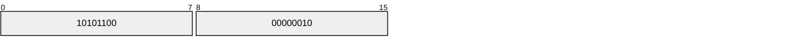
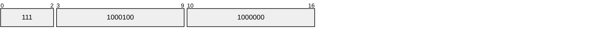
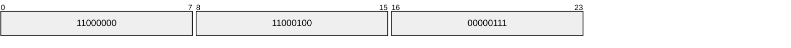
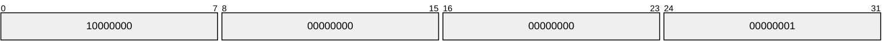
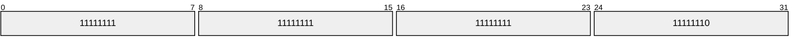
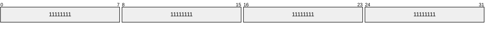
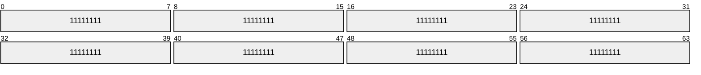
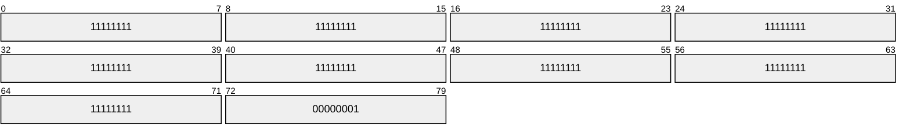

# varint编码

Varint是一种使用一个或多个字节序列化整数的方法，会把整数编码为变长字节。对于32位整型的4个字节数据经过Varint编码后需要`1~5`个字节，小的数字使用1个byte，大的数字使用5个bytes。64位整型数据编码后占用`1~10`个字节。

在实际场景中小数字的使用率远远多于大数字，因此通过Varint编码对于大部分场景都可以起到很好的压缩效果。

<!--more-->

## 编码原理

Varint 中的每个 byte 的最高位 bit 有特殊的含义，如果该位为 1，表示后续的 byte 也是该数字的一部分，如果该位为 0，则结束。

其他的 7 个 bit 都用来表示数字(不足补0)。因此小于 128 的数字都可以用一个 byte 表示。大于 128 的数字，比如 300，会用两个字节来表示：

由于负数的高位为1,所以采用这种压缩处理的时候必须负数转成正数。

解码的过程就是将字节依次取出，去掉最高有效位，因为是小端排序所以先解码的字节要放在低位，之后解码出来的二进制位继续放在之前已经解码出来的二进制的高位，最后转换为10进制数完成varint编码的解码过程。

## 举例

对数字123456进行varint编码，123456用二进制表示为(大端序):

每次低从向高取7位再加上最高有效位变成:

所以经过varint编码后123456占用三个字节分别为`192 196 7`。

## 负数的处理

数字 -1，负数在内存中以补码形式存放，先计算补码，我们以32位的整型为例

- -1的源码(符号位为1表负，其他跟正数一样)：

- -1的反码(符号位不变，其他位全部取反):

- -1的补码(反码+1):

但是varint对负数统一是用64位来表示的，所以64位的-1在内存中表示如下:

每7位分为一小块，一共可分成了10块（因为64位 = 7位 * 9 + 1）

编码过程

1. 从右往左依次取7位，第一次取出来的1111111，因为自己不是最后一块，根据规则左边补1，得到11111111
2. 重复上面的步骤，依次处理每块数据
3. 最后一块1，因为是最后一块了，根据规则左边补0，得到00000001

所以，最终varint表示法-1的最终格式是

显然负数不适合使用 varint 编码，对空间消耗太大。

## 负数优化-zigzag编码

potobuf中对 varint 的负数使用 zigzag 编码优化。zigzag编码的本质，是把负数按照一定的规则转换成一个正数，然后再按照varint的方式编码。

| 原始数据 | zigzag数据 |
|---|---|
| 0 | 0 |
| -1 | 1 |
| 1 | 2 |
| -2 | 3 |
| 2 | 4 |
| 2147483647 | 4294967294 |
| -2147483648 | 4294967295 |

总结zigzag编码公式(下面的 |数据| 是求数据绝对值的意思)

- 当数据为0时，zigzag编码也为0
- 当数据为负数时，zigzag编码 = |数据| * 2 - 1
- 当数据为正数时，zigzag编码 = |数据| * 2

