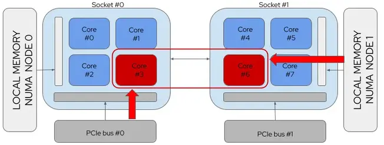

# 系统性能分析-CPU-异常分析

本文记录一些分析 CPU 性能问题的工具&方法。

<!--more-->

## CPU Time

在分析 CPU 性能时，实际上是在分析 CPU 时间的使用状况。CPU 时间是指 CPU 用于处理计算机程序或操作系统指令的时间量，不同于经过的时间(包括了例如等待输入/输出等 (I/O) 操作或进入低功耗（空闲）模式等开销)。


CPU 时间以时钟周期或秒为单位。通常，将 CPU 时间测量为 CPU 容量的百分比（称为 CPU 使用率）是很有用的。CPU 时间和 CPU 使用率有两个主要用途。

- CPU 时间可以用于量化两种功能相同的算法的整体经验效率。在比较复杂程度不小的类似算法时，这种类型的测量特别有用。在这种情况下，实际运行时间（实际经过的持续时间）无关紧要，计算机执行程序的速度可能会变慢或变快，具体取决于现实世界的变量(如 CPU 的温度)以及其他操作系统变量(如进程的优先级)。
- CPU 使用率用于量化处理器在计算机程序之间共享的方式。单个程序的 CPU 使用率高可能表明它对处理能力要求很高，或者可能会出现故障;例如，它已经进入了一个无限循环。CPU 时间允许测量单个程序所需的处理能力，从而消除干扰，例如等待输入的执行时间或暂停以允许其他程序运行的时间。

相反，实时时间(挂钟时间)是从计算机程序开始到结束所花费的时间，由普通时钟测量。经过的实时包括 I/O 时间、任何多任务延迟以及程序引起的所有其他类型的等待。

根据 CPU 实际执行的操作，CPU 性能报告的值可以细分为：

- User time，用户时间是 CPU 忙于在 用户空间 中执行代码的时间量。
- System time，系统时间是 CPU 忙于在 内核空间 中执行代码的时间量。
- Idle time，空闲时间是衡量未使用的 CPU 时间量。
- Steal time，窃取时间是衡量虚拟机在特定时间段内被剥夺的 CPU 时间量，即操作系统想要执行但虚拟机管理程序不允许执行的时间量。

## 负载

系统负载是计算机系统执行的计算工作量的度量。负载平均值表示一段时间内的平均系统负载。它通常以三个数字的形式显示，分别表示最近 1 分钟、5 分钟和 15 分钟内的系统负载。

空闲计算机的负载数为0（空闲进程不计算在内）。每个正在使用或等待CPU的进程（就绪队列或运行队列）将负载数增加1。每个终止的进程将其减少1。大多数UNIX系统只计算处于运行（在CPU上）或可运行（等待CPU）状态的进程。然而，Linux也包括处于不间断休眠状态的进程（通常等待磁盘活动），如果由于I/O系统繁忙或停顿，许多进程仍处于阻塞状态，这可能会导致明显不同的结果。

从数学上讲，所有三个值总是平均自系统启动以来的所有系统负载。它们都是指数衰减的，但它们衰减的速度不同：它们分别在1、5和15分钟后按e指数衰减。

对于多核 CPU 而言，系统负载要除以核数，例如在具有四个CPU的系统中，平均负载为3.73表示平均有3.73个进程准备运行，并且每个进程都可以调度到一个CPU中。

## 调度

Linux 内核用于控制在系统上管理任务（或进程）的方式。任务调度程序（有时称作进程调度程序）是决定下一次要运行哪个任务的内核组件。它负责以最佳方式使用系统资源，以保证能够同时执行多个任务。因此，它是任何多任务操作系统的核心组件。

### 抢占
 
任务调度背后的理论非常简单。如果系统中存在多个可运行的进程，必须始终至少有一个进程正在运行。如果可运行进程的数目超过了系统中处理器的数目，则并非所有进程都能始终运行。因此，某些进程需要暂时停止（或挂起），使其他进程能够再次运行。由调度程序决定下一次运行队列中的哪个进程。

如前所述，与其他所有 Unix 变体类似，Linux 也是多任务操作系统。即，多个任务可以同时运行。Linux 提供所谓的抢占式多任务，让调度程序决定何时挂起某个进程。这种强制挂起称为抢占。从一开始就为所有 Unix 风格提供了抢占式多任务。

### 时间片
 
提前定义某个进程在被抢占之前的运行时长。此时长称为进程的时间片，表示提供给每个进程的处理器时间长短。通过指派时间片，调度程序可以针对运行中的系统做出全局决策，并防止单个进程占据处理器资源。

### 进程优先级

调度程序基于进程的优先级评估进程。任务调度程序使用复杂算法计算进程的当前优先级。最后会为每个进程指定一个值，根据该值“允许”进程在处理器上运行。

### 进程分类

通常根据进程的用途和行为对进程分类。尽管有时界线区分不够清晰，但一般会采用两条准则进行分类。这两条准则彼此独立，但并非互不包容。

一种方法是将进程分类为 I/O 密集型或处理器密集型。

- I/O 密集型: I/O 代表输入/输出设备，例如键盘、鼠标或者光盘和硬盘。I/O 密集型进程将大部分时间花费在提交和等待请求上。它们的运行频率极高，但时间间隔较短，不会阻塞等待 I/O 请求的其他进程。
- 处理器密集型:相比之下，处理器密集型任务将时间用在执行代码上，通常会运行到被调度程序抢占为止。它们不会阻塞等待 I/O 请求的进程，因此其运行频率可以更低，但时间间隔更长。

另一种方法是按类型将进程划分为交互式、批处理和实时进程。

- 交互式进程将大量时间花费在等待 I/O 请求（例如键盘或鼠标操作）上。调度程序必须按用户请求快速唤醒此类进程，否则用户会发现环境无响应。典型延迟大约为 100 毫秒。办公应用程序、文本编辑器或图像处理程序都是典型的交互式进程。
- 批处理进程通常在后台运行，不需要做出响应。调度程序往往会为它们分配较低的优先级。多媒体转换器、数据库搜索引擎或日志文件分析器都是批处理进程的典型示例。
- 实时进程永远不可被低优先级进程阻塞，调度程序需保证这些进程在很短时间获得响应。用于编辑多媒体内容的应用程序就是实时进程的典型示例。

### 完全公平调度程序

从 Linux 内核版本 2.6.23 开始，采用了一种新方法来调度可运行的进程。完全公平调度程序 (CFS) 成为了默认 Linux 内核调度程序。

CFS 尝试为每个可运行的任务保证公平性。为了找出最平衡的任务调度方式，它使用了红黑树的概念。红黑树是一种自我平衡式数据搜索树，能够以合理方式提供插入项和去除项，使其自身保持适当的平衡。

当 CFS 调度任务时，它会累加“虚拟运行时” (vruntime)。选择运行的下一个任务始终是迄今为止累加 vruntime 最小的那个任务。在将任务插入运行队列（下次要执行的进程的规划时间线）时通过平衡红黑树，可保证 vruntime 最小的任务始终是红黑树中的第一个项。

任务的累计 vruntime 与该任务的优先级相关。高优先级任务的 vruntime 的累加速度比低优先级任务要慢，导致更频繁地选择在处理器上运行高优先级任务。

从 Linux 内核版本 2.6.24 开始，可对 CFS 进行微调，以保证为组而不仅仅是任务提供公平性。为此，将可运行的任务分组以构成实体，而 CFS 会尝试为这些实体而不是各个可运行的任务提供公平性。调度程序还会尝试为这些实体中的各个任务提供公平性。

## `/proc`

proc 是一个提供内核数据结构接口的伪文件系统(pseudo-filesystem)，它通常由系统自动挂载在 `/proc` 目录下，我们可以通过它获取丰富的系统以及进程信息。

### `/proc/cpuinfo`

`/proc/cpuinfo` 文件中存放了 CPU的相关信息(型号，缓存大小等)。

```sh
$ cat /proc/cpuinfo
... 
processor	: 43
vendor_id	: GenuineIntel
cpu family	: 6
model		: 79
model name	: Intel(R) Xeon(R) CPU E5-2650 v4 @ 2.20GHz
stepping	: 1
microcode	: 0xb00001f
cpu MHz		: 2197.542
cache size	: 30720 KB
physical id	: 1
siblings	: 24
core id		: 9
cpu cores	: 12
apicid		: 51
initial apicid	: 51
fpu		: yes
fpu_exception	: yes
cpuid level	: 20
wp		: yes
flags		: fpu vme de pse tsc msr pae mce cx8 apic sep mtrr pge mca cmov pat pse36 clflush dts acpi mmx fxsr sse sse2 ss ht tm pbe syscall nx pdpe1gb rdtscp lm constant_tsc arch_perfmon pebs bts rep_good nopl xtopology nonstop_tsc cpuid aperfmperf pni pclmulqdq dtes64 ds_cpl vmx smx est tm2 ssse3 sdbg fma cx16 xtpr pdcm pcid dca sse4_1 sse4_2 x2apic movbe popcnt aes xsave avx f16c rdrand lahf_lm abm 3dnowprefetch cpuid_fault epb cat_l3 cdp_l3 invpcid_single pti intel_ppin tpr_shadow vnmi flexpriority ept vpid fsgsbase tsc_adjust bmi1 hle avx2 smep bmi2 erms invpcid rtm cqm rdt_a rdseed adx smap intel_pt xsaveopt cqm_llc cqm_occup_llc cqm_mbm_total cqm_mbm_local dtherm arat pln pts
bugs		: cpu_meltdown spectre_v1 spectre_v2 spec_store_bypass l1tf mds swapgs taa itlb_multihit
bogomips	: 4394.48
clflush size	: 64
cache_alignment	: 64
address sizes	: 46 bits physical, 48 bits virtual
power management:
...
```

- processor: CPU 逻辑核 ID
- physical: CPU 所在物理 CPU ID
- core id: 当前物理核在其所处CPU中的编号
- cpu cores: 一个物理CPU的核心数
- siblings: 一个物理CPU的逻辑核数

如果siblings和cpu cores一致，则说明不支持超线程，或者超线程未打开。如果siblings是cpu cores的两倍，则说明支持超线程，并且超线程已打开。

> 相关命令 `lscpu`

### `/proc/stat`

该文件包含了所有CPU活动的信息，文件中的所有值都是从系统启动开始累计到当前时刻。不同内核版本中该文件的格式可能不大一致。

```sh
$ cat /proc/stat
cpu  18305672671 7881525 9994859733 297801368017 172163672 591944369 1503697966 0 0 0
cpu0 372842856 203305 203978560 5999565204 5647164 15490191 238312627 0 0 0
cpu1 465292329 214690 226997175 6051850428 5055153 14587600 75421782 0 0 0
cpu2 444677027 200645 226035350 6104184103 4989091 14631876 45203836 0 0 0
...
```

结果中第一行为 CPU 的总时间，从第二行开始为不同 CPU 核心各自的时间。在多核心的计算机上指令的执行往往会在多个核心之间来回切换，我们只需关注 CPU 的总时间即可。

一行中有 11 列，对应着不同的细分时间(从系统启动开始累计到当前时刻)，分别为：

- user (1) 在用户态中花费的时间
- nice (2) 低优先级下在用户态中花费的时间
- system (3) 在内核态中花费的时间
- idle (4) 空闲时间
- iowait (5) 等待 I/O 完成的时间
- irq (6) 硬中断时间
- softirq (7) 软中断时间
- steal (8) 虚拟环境下在其他系统中花费的时间
- guest (9) 在虚拟化 CPU 上花费的时间
- guest_nice (10) 低优先级的 guest 时间

上面的单位是jiffies。jiffies是内核中的一个全局变量，用来记录自系统启动一来产生的节拍数，在linux中，一个节拍大致可理解为操作系统进程调度的最小时间片，不同linux内核可能值有不同，通常在1ms到10ms之间。计算 CPU 总时间只需要将 每一行的数字 相加即可。

#### jiffies

系统定时器timer能够以可编程的方式设定频率，来中断cpu处理器。此频率即hz,为每秒的定时器节拍(tick)数，对应着内核变量HZ。tick为两个连续中断的时间间隔。jiffies变量记录了系统启动以来，系统定时器已经触发的次数。内核每秒钟将jiffies变量增加HZ数。因此，对于HZ值为100的系统，1个jiffy等于10ms，而对于HZ为1000的系统，1个jiffy仅为1ms。 

> `getconf CLK_TCK` 命令可以获取 1s 的 tick 数

jiffies既反应了次数指标，又反映的是精度的指标，HZ值大，定时器间隔时间就小，因此进程调度的准确性会更高。但是，HZ值越大也会导致开销和电源消耗更多，因为更多的处理器将被耗费在系统定时器中断上下文中。HZ的值取决于体系架构。在x86系统上，在2.4内核中，该值默认设置为100；在2.6内核中，该值变为1000。

#### `/proc/[pid]/stat`

`/proc/pid/stat` 是有关进程的状态信息，使用 ps 命令时获取的就是这里的信息。运行 `cat /proc/1/stat` 命令的结果如下所示：

```sh
$ cat /proc/1/stat
1 (systemd) S 0 1 1 0 -1 4194560 36786 3017356 11140 6504 126 657 5262 952 20 0 1 0 13 173899776 2528 18446744073709551615 1 1 0 0 0 0 671173123 4096 1260 0 0 0 17 6 0 0 0 0 0 0 0 0 0 0 0 0 0
```

可以看到同样包含了非常多的信息，这里我们只需要关注这 4 个数字：

- utime (14) 进程在用户态中的时间
- stime (15) 进程在内核态中的时间
- cutime (16) 进程在用户态中等待子进程的时间
- cstime (17) 进程在内核态中等待子进程的时间

进程的总Cpu时间processCpuTime = utime + stime + cutime + cstime，该值包括其所有线程的cpu时间。时间单位同样是 jiffies。

#### `/proc/[pid]/task/[tid]/stat`

该文件包含了某一进程所有的活动的信息，该文件中的所有值都是从系统启动开始累计到当前时刻。该文件的内容格式以及各字段的含义同`/proc/[pid]/stat`文件。线程Cpu时间threadCpuTime = utime + stime

### `/proc/loadavg`

```sh
$ cat /proc/loadavg
4.10 5.66 5.36 4/9463 1909
```
前三个是1、5、15分钟内的平均进程数。第四个的分子是正在运行的进程数，分母是进程总数；最后一个最近运行的进程ID号。

### `/proc/schedstat`

schedstat的结果分为两个部分:

#### CPU统计数据

```sh
cpu<N> 1 2 3 4 5 6 7 8 9
## 例如
cpu0 0 0 0 0 0 0 6272714826920996 8991871353794350 92960412051
```

- 第一个字段是sched_yield()的统计数据：sched_yield()被调用了#次
- 接下来的三个是schedule()的统计数据：
    - 这个字段是一个过时的数组过期计数，在O(1)调度器中使用。为了ABI兼容性， 我们保留了它，但它总是被设置为0。
    - schedule()被调用了#次
    - 调用schedule()导致处理器变为空闲了#次
- 接下来的两个是try_to_wake_up()的统计数据：
    - try_to_wake_up()被调用了#次
    - 调用try_to_wake_up()导致本地CPU被唤醒了#次
- 接下来的三个统计数据描述了调度延迟：
    - 本处理器运行任务的总时间，单位是纳秒
    - 本处理器任务等待运行的时间，单位是纳秒
    - 本CPU运行了#个时间片

#### 域统计数据

对于每个被描述的CPU，和它相关的每一个调度域均会产生下面一行数据（注意，如果 CONFIG_SMP没有被定义，那么*没有*调度域被使用，这些行不会出现在输出中）。

```sh
domain<N> <cpumask> 1 2 3 4 5 6 7 8 9 10 11 12 13 14 15 16 17 18 19 20 21 22 23 24 25 26 27 28 29 30 31 32 33 34 35 36
## 例如
domain0 0000,01000001 0 0 0 0 0 0 0 0 0 0 0 0 0 0 0 0 0 0 0 0 0 0 0 0 0 0 0 0 0 0 0 0 0 0 0 0
domain1 000f,ff000fff 0 0 0 0 0 0 0 0 0 0 0 0 0 0 0 0 0 0 0 0 0 0 0 0 0 0 0 0 0 0 0 0 0 0 0 0
domain2 ffff,ffffffff 0 0 0 0 0 0 0 0 0 0 0 0 0 0 0 0 0 0 0 0 0 0 0 0 0 0 0 0 0 0 0 0 0 0 0 0
```

- 第一个字段是一个位掩码，表明该域在操作哪些CPU。
- 接下来的24个字段是load_balance()函数的各个统计数据，按空闲类型分组（空闲， 繁忙，新空闲）：
    - 当CPU空闲时，sched_balance_rq()在这个调度域中被调用了#次
    - 当CPU空闲时，sched_balance_rq()在这个调度域中被调用，但是发现负载无需均衡#次
    - 当CPU空闲时，sched_balance_rq()在这个调度域中被调用，试图迁移1个或更多任务且失败了#次
    - 当CPU空闲时，sched_balance_rq()在这个调度域中被调用，发现不均衡（如果有） #次
    - 当CPU空闲时，pull_task()在这个调度域中被调用#次
    - 当CPU空闲时，尽管目标任务是热缓存状态，pull_task()依然被调用#次
    - 当CPU空闲时，sched_balance_rq()在这个调度域中被调用，未能找到更繁忙的 队列#次
    - 当CPU空闲时，在调度域中找到了更繁忙的队列，但未找到更繁忙的调度组 #次
    - 当CPU繁忙时，sched_balance_rq()在这个调度域中被调用了#次
    - 当CPU繁忙时，sched_balance_rq()在这个调度域中被调用，但是发现负载无需均衡#次
    - 当CPU繁忙时，sched_balance_rq()在这个调度域中被调用，试图迁移1个或更多任务且失败了#次
    - 当CPU繁忙时，sched_balance_rq()在这个调度域中被调用，发现不均衡（如果有）#次
    - 当CPU繁忙时，pull_task()在这个调度域中被调用#次
    - 当CPU繁忙时，尽管目标任务是热缓存状态，pull_task()依然被调用#次
    - 当CPU繁忙时，sched_balance_rq()在这个调度域中被调用，未能找到更繁忙的 队列#次
    - 当CPU繁忙时，在调度域中找到了更繁忙的队列，但未找到更繁忙的调度组 #次
    - 当CPU新空闲时，sched_balance_rq()在这个调度域中被调用了#次
    - 当CPU新空闲时，sched_balance_rq()在这个调度域中被调用，但是发现负载无需 均衡#次
    - 当CPU新空闲时，sched_balance_rq()在这个调度域中被调用，试图迁移1个或更多 任务且失败了#次
    - 当CPU新空闲时，sched_balance_rq()在这个调度域中被调用，发现不均衡（如果有） #次
    - 当CPU新空闲时，pull_task()在这个调度域中被调用#次
    - 当CPU新空闲时，尽管目标任务是热缓存状态，pull_task()依然被调用#次
    - 当CPU新空闲时，sched_balance_rq()在这个调度域中被调用，未能找到更繁忙的 队列#次
    - 当CPU新空闲时，在调度域中找到了更繁忙的队列，但未找到更繁忙的调度组 #次
- 接下来的3个字段是active_load_balance()函数的各个统计数据：
    - active_load_balance()被调用了#次
    - active_load_balance()被调用，试图迁移1个或更多任务且失败了#次
    - active_load_balance()被调用，成功迁移了#次任务
- 接下来的3个字段是sched_balance_exec()函数的各个统计数据：
    - sbe_cnt不再被使用 
    - sbe_balanced不再被使用
    - sbe_pushed不再被使用
- 接下来的3个字段是sched_balance_fork()函数的各个统计数据：
    - sbf_cnt不再被使用
    - sbf_balanced不再被使用
    - sbf_pushed不再被使用
- 接下来的3个字段是try_to_wake_up()函数的各个统计数据：
    - 在这个调度域中调用try_to_wake_up()唤醒任务时，任务在调度域中一个 和上次运行不同的新CPU上运行了#次
    - 在这个调度域中调用try_to_wake_up()唤醒任务时，任务被迁移到发生唤醒 的CPU次数为#，因为该任务在原CPU是冷缓存状态
    - 在这个调度域中调用try_to_wake_up()唤醒任务时，引发被动负载均衡#次

#### `/proc/[pid]/schedstat`

schedstats还添加了一个新的`/proc/[pid]/schedstat`文件，来提供一些进程级的 相同信息。这个文件中，有三个字段与该进程相关：

- 在CPU上运行花费的时间(单位是纳秒)
- 在运行队列上等待的时间(单位是纳秒)
- 在CPU上运行了#个时间片

> 我们可以在`/proc/[pid]/task/[tid]/schedstat`找到每一线程的调度延迟。

#### `/proc/[pid]/sched`

线程状态主要被记录在/proc/self/sched文件中，我们可以通过读取该文件的时间来统计线程状态。

```sh
se.exec_start       :    2781299327.397282  //此进程最近被调度到的开始执行时刻（这个值是每次update_curr都进行更新）
se.vruntime        :       3144603.079903   //虚拟运行时间
se.sum_exec_runtime:       2843625.998498   //累计运行的物理时间时间
se.wait_start       :             0.000000  //最近一次当前进程被入队的时刻
se.sleep_start      :             0.000000  //此进程最近一次被从队列里取出，并被置S状态的时刻
se.block_start      :             0.000000  //此进程最近一次被从队列里取出，并被置D状态的时刻
se.sleep_max      :             0.000000    //最长处于S状态时间
se.block_max      :             0.000000    //最长处于D状态时间
se.exec_max       :             1.004266    //最长单次执行时间
se.slice_max       :           998.456300   //曾经获得时间片的最长时间
se.wait_max       :             0.455235    //最长在就绪队列里的等待时间
se.wait_sum       :            15.615407    //累计在就绪队列里的等待时间
se.wait_count      :                 3147   //累计等待次数
se.iowait_sum      :           215.825267   //io等待时间
se.iowait_count     :                   67  //io等待次数  io_schedule调用次数
sched_info.bkl_count:                    0  //此进程大内核锁调用次数
se.nr_migrations    :                    0  //需要迁移当前进程到其他cpu时累加此字段
se.nr_migrations_cold:                    0
se.nr_failed_migrations_affine:           194  //进程设置了cpu亲和，进程迁移时检查失败的次数
se.nr_failed_migrations_running:           0 
se.nr_failed_migrations_hot:               0   //当前进程因为是cache hot导致迁移失败的次数
se.nr_forced_migrations :                  0   //在当前进程cache hot下，由于负载均衡尝试多次失败，强行进行迁移的次数
se.nr_wakeups         :                 0   //被唤醒的累计次数（从不可运行到可运行）
se.nr_wakeups_sync     :                0   //同步唤醒次数，即a唤醒b，a立刻睡眠，b被唤醒的次数
se.nr_wakeups_migrate  :                 0  //被唤醒得到调度的当前cpu，不是之前睡眠的cpu的次数
se.nr_wakeups_local     :                0  //被本地唤醒的次数（唤醒后在当前cpu上执行）
se.nr_wakeups_remote   :                0   //非本地唤醒累计次数
se.nr_wakeups_affine    :                0  //考虑了任务的cache亲和性的唤醒次数
se.nr_wakeups_affine_attempts:            0
se.nr_wakeups_passive  :                    0
se.nr_wakeups_idle     :                    0
avg_atom            :           903.886204 //本进程平均耗时sum_exec_runtime/ nr_switches
avg_per_cpu           :             0.000001
nr_switches            :                 3146 //主动切换和被动切换的累计次数
nr_voluntary_switches   :                    0 //主动切换次数（由于prev->state为不可运行状态引起的切换）
nr_involuntary_switches  :                 3146 //被动切换次数
se.load.weight          :                 1024  //该se的load
policy                 :                    0  //调度策略 normal
prio                   :                  120  //优先级(nice=0)
clock-delta             :                   51
```

## NUMA

早期，CPU朝着高频率的方向发展遇到了天花板，转而向着多核心的方向发展。在这种架构中，所有的CPU都是通过一条总线来访问内存，我们把这种架构叫做SMP架构（Symmetric Multi-Processor），也就是对称多处理器结构。可以看出来，SMP架构有下面4个特点：

- CPU和CPU以及CPU和内存都是通过一条总线连接起来
- CPU都是平等的，没有主从关系
- 所有的硬件资源都是共享的，即每个CPU都能访问到任何内存、外设等
- 内存是统一结构和统一寻址的（UMA, Uniform Memory Architecture）


对SMP服务器进行扩展的方式包括增加内存、使用更快的CPU、增加CPU、扩充I/O(槽口数与总线数)以及添加更多的外部设备(通常是磁盘存储)。SMP服务器的主要特征是共享，系统中所有资源(CPU、内存、I/O等)都是共享的。也正是由于这种特征，导致了SMP服务器的主要问题，那就是它的扩展能力非常有限。

因为所有的处理器都通过一条总线连接起来，因此随着处理器的增加，系统总线成为了系统瓶颈。此外对于SMP服务器而言，每一个共享的环节都可能造成SMP服务器扩展时的瓶颈，而最受限制的则是内存。由于每个CPU必须通过相同的内存总线访问相同的内存资源，因此随着CPU数量的增加，内存访问冲突将迅速增加，最终会造成CPU资源的浪费，使CPU性能的有效性大大降低。实验证明，SMP服务器CPU利用率最好的情况是2至4个CPU。

由于SMP在扩展能力上的限制，人们开始探究如何进行有效地扩展从而构建大型系统的技术，NUMA就是这种努力下的结果之一。利用NUMA技术，可以把几十个CPU(甚至上百个CPU)组合在一个服务器内。


NUMA服务器的基本特征是具有多个CPU Node，每个CPU Node由多个CPU(如4个)组成，每个 Node 都有自己的集成内存控制器（IMC，Integrated Memory Controller）。在 Node 内部，架构类似SMP，使用 IMC Bus 进行不同核心间的通信；不同的 Node 间通过QPI（Quick Path Interconnect）进行通信，因此每个CPU可以访问整个系统的内存。显然，访问本地内存的速度将远远高于访问远地内存(系统内其它节点的内存)的速度，这也是非一致存储访问NUMA的由来。

由于这个特点，为了更好地发挥系统性能，开发应用程序时需要尽量减少不同CPU模块之间的信息交互。NUMA技术同样有一定缺陷，由于访问远地内存的延时远远超过本地内存，因此当CPU数量增加时，系统性能无法线性增加。

### NUMA Node 拓扑

查看 NUMA Node 拓扑可以用过 `numactl` 命令(Ubuntu 可以通过`apt install numactl` 安装)。

```sh
$ numactl -H
available: 2 nodes (0-1)
node 0 cpus: 0 1 2 3 4 5 6 7 8 9 10 11 24 25 26 27 28 29 30 31 32 33 34 35
node 0 size: 128572 MB
node 0 free: 24371 MB
node 1 cpus: 12 13 14 15 16 17 18 19 20 21 22 23 36 37 38 39 40 41 42 43 44 45 46 47
node 1 size: 128990 MB
node 1 free: 13876 MB
node distances:
node   0   1
  0:  10  21
  1:  21  10
```

上面的结果表示机器只有两个 Node，每个 Node 有 24 个逻辑 CPU，管理125G内存。

Node 和 Node 之间进行通信的代价是不等的，同样是 Remote 节点，其代价可能不一样，这个信息在 node distances 中以一个矩阵的方式展现。

执行 `numactl --show` 显示当前的 NUMA 设置：

```sh
$ numactl --show
policy: default
preferred node: current
physcpubind: 0 1 2 3 4 5 6 7 8 9 10 11 12 13 14 15 16 17 18 19 20 21 22 23 24 25 26 27 28 29 30 31 32 33 34 35 36 37 38 39 40 41 42 43 44 45 46 47
cpubind: 0 1
nodebind: 0 1
membind: 0 1
```

numactl 命令还有几个重要选项：

- `--cpubind=0`： 绑定到 node 0 的 CPU 上执行。
- `--membind=1`： 只在 node 1 上分配内存。
- `--interleave=nodes`：nodes 可以是 all、N,N,N 或 N-N，表示在 nodes 上轮循（round robin）分配内存。
- `--physcpubind=cpus`：cpus 是 /proc/cpuinfo 中的 processor（超线程） 字段，cpus 的格式与 --interleave=nodes 一样，表示绑定到 cpus 上运行。
- `--preferred=1`： 优先考虑从 node 1 上分配内存。
- `--localalloc`:规定进程从当前node上请求分配内存。

### 分配策略

结合上面 numactl 的选项介绍下 NUMA 的分配策略:

- 每个进程和线程都从其父进程继承 NUMA 策略。继承的策略可以基于每个线程进行修改，它定义了允许调度进程的 CPU 甚至单个内核，应该从哪里分配内存，以及这两个决定的严格程度。
- 每个线程最初都分配了一个 “首选” 节点来运行。线程可以在其他位置运行（如果策略允许），但调度程序会尝试确保它始终在首选节点上运行。
- 为进程分配的内存在特定节点上分配，默认情况下为 “current”，这意味着首选与线程相同的节点运行。
- 无论系统需求如何，在一个节点上进行的内存分配都不会移动到另一个节点。在节点上分配内存后，它将保留在那里。


NUMA的CPU分配策略有:

- cpubind: cpubind规定进程运行在某几个node之上
- physcpubind: 而physcpubind可以更加精细地规定运行在哪些核上。

NUMA的内存分配策略有:
- localalloc: 规定进程从当前node上请求分配内存；
- preferred: 指定了一个推荐的node来获取内存，如果被推荐的node上没有足够内存，进程可以尝试别的node
- membind: 指定若干个node，进程只能从这些指定的node上请求分配内存。
- interleave: 进程从指定的若干个node上以RR（Round Robin 轮询调度）算法交织地请求分配内存。

numactl 命令的几个例子：

```sh
## 运行 test_program 程序，参数是 argument，绑定到 node 1 的 CPU和内存上
numactl --cpubind=1 --membind=1 test_program arguments

## 在 processor 0-4，8-12 上运行 test_program
numactl --physcpubind=0-4,8-12 test_program arguments

## 轮询分配内存
numactl --interleave=all test_program arguments

## 优先考虑从 node 1 上分配内存
numactl --preferred=1 test_program arguments
```

### 资源对齐

下图是 8 核 2 Node 的一个机器


在NUMA没有对齐资源时，也就是 CPU 3 需要访问远端内存，而 CPU 6 需要访问远端PCI 设备，相应带来数据访问延迟。



当NUMA对齐资源，则CPU 2 和 CPU 3 都是访问近端内存和近端PCI设备，带来性能提升。


我们可以通过`numastat`来观察资源对齐情况(也可以查看文件`cat /sys/devices/system/node/node0/numastat`)。

```sh
$ numastat
                           node0           node1
numa_hit           2277203020768   2437212562722
numa_miss             3342035854     27677109781
numa_foreign         27677109781      3342035854
interleave_hit             35565           35671
local_node         2277199872083   2437213193120
other_node            3345184539     27676479383
```
- numa_hit: 命中的，也就是为这个节点成功分配本地内存访问的内存大小
- numa_miss: 把内存访问分配到另一个node节点的内存大小，这个值和另一个node的numa_foreign相对应。
- numa_foreign: 另一个Node访问local内存大小，与对方node的numa_miss相对应
- local_node: 这个节点的进程成功在这个节点上分配内存访问的大小
- other_node: 这个节点的进程在其它节点上分配的内存访问大小

很明显，miss值和foreign值越高，就要考虑资源对齐的问题。

Linux 识别到 NUMA 架构后，默认的内存分配方案是：优先从本地分配内存。如果本地内存不足，优先淘汰本地内存中无用的内存。使内存页尽可能地和调用线程处在同一个 node。Linux 的默认策略在不需要分配大量内存的应用上一般没什么问题。但是对于数据库这种大内存(可能分配超过一个 NUMA node 的内存量)应用来说，可能会引起一些性能问题。

- Linux内核默认使用CPU亲和的内存分配策略，使内存页尽可能的和调用线程处在同一个Node中
- 由于内存页没有动态调整策略，使得大部分内存页都集中在CPU 0上
- 又因为Reclaim默认策略优先淘汰/Swap 内存，使得大量有用内存被换出
- 当被换出页被访问时问题就以数据库响应时间飙高甚至阻塞的形式出现了

一个MySQL 分配内存的例子如下所示：


由于节点 0 的可用内存已完全耗尽，因此即使系统总体上具有大量可用内存（超过 10GB 已用于缓存），它也完全位于节点 1 上。如果在节点 0 上调度的任何进程需要本地内存来执行任何操作，则将导致一些已分配的内存被换出，以释放一些节点 0 页面。即使节点 1 上有空闲内存，Linux 内核在许多情况下更喜欢分页节点 0 内存，而不是释放节点 1 上的一些缓存并使用该内存。当然，分页比非本地内存访问要昂贵得多。

对于这种情况可以使用`numactl --interleave all command` 是内存均匀分配。

- `numactl --interleave=all`
- 在MySQL进程启动前，使用`sysctl -q -w vm.drop_caches=3`清空文件缓存所占用的空间
- Innodb在启动时，就完成整个Innodb_buffer_pool_size的内存分配
- (Optional)设置vm.swappiness=1或0


此外，还可以修改NUMA系统中的内存回收策略。如果出现本 node 上内存已经不够，而其他 node 上还有富余内存的情况，是选择在本 node 上启动内存回收，还是适当地从其他 node 分配呢? 一般小型 NUMA 系统(node 数目为 2 的)倾向于从其他 node 分配，而对于大型 NUMA 系统（node 数目大于等于 4 的），由于跨 node 的内存访问的代价更大，则往往宁愿 reclaim。具体的决策由内核参数 "/proc/sys/vm/zone_reclaim_mode" 控制，其值默认为 0，表示从其他 node/zone 分配。如果该值设为 1，虽然会回收，也尽量选用轻量级的方式，即只回收 unmmaped 的 page cache 页面(unmapped 的页面是指没有被进程页表映射的 page frame，这样的页面在 reclaim 时不需要通过 reserve mapping 解除映射关系，回收最为迅速)。如果为 2，则可以回收造成开销更大的，需要 writeback 的页面。为 4 的话，那么需要 swap 操作的匿名页面也会被包含。

### Automatic NUMA Balancing

自动NUMA平衡将任务（可以是线程或进程）移近它们正在访问的内存。它还将应用程序数据移动到更靠近引用它的任务的内存中。当自动NUMA平衡处于活动状态时，这一切都由内核自动完成。

自动平衡 NUMA 通过三个基本步骤完成：

- 任务扫描程序定期扫描任务的部分地址空间，并标记内存，以在下一次访问数据时强制引发页错误。
- 下一次访问数据会导致 NUMA 删格化错误。基于此错误，可将数据迁移到与访问内存的任务相关联的内存节点。
- 要将某个任务、该任务使用的 CPU 以及该任务访问的内存保留在一起，调度程序会将共享数据的任务分到一组。

数据取消映射和页错误处理会产生开销。但是，一般情况下，访问与 CPU 关联的数据的线程会抵消这项开销。

当满足以下两个条件时，将启用自动NUMA平衡：

```sh
## 显示多个节点
$ numactl --hardware
## 显示1
$ cat /proc/sys/kernel/numa_balancing
```

## Command

### `lscpu`

除了`/proc/cpuinfo`也可以使用`lscpu`命令来查看 CPU 信息:

```sh
$ lscpu
Architecture:                    x86_64
CPU op-mode(s):                  32-bit, 64-bit
Byte Order:                      Little Endian
Address sizes:                   46 bits physical, 48 bits virtual
CPU(s):                          48
On-line CPU(s) list:             0-47
Thread(s) per core:              2
Core(s) per socket:              12
Socket(s):                       2
NUMA node(s):                    2
Vendor ID:                       GenuineIntel
CPU family:                      6
Model:                           79
Model name:                      Intel(R) Xeon(R) CPU E5-2650 v4 @ 2.20GHz
Stepping:                        1
CPU MHz:                         2197.573
BogoMIPS:                        4395.14
Virtualization:                  VT-x
L1d cache:                       768 KiB
L1i cache:                       768 KiB
L2 cache:                        6 MiB
L3 cache:                        60 MiB
NUMA node0 CPU(s):               0-11,24-35
NUMA node1 CPU(s):               12-23,36-47
Vulnerability Itlb multihit:     KVM: Vulnerable
Vulnerability L1tf:              Mitigation; PTE Inversion
Vulnerability Mds:               Vulnerable: Clear CPU buffers attempted, no microcode; SMT vulnerable
Vulnerability Meltdown:          Mitigation; PTI
Vulnerability Spec store bypass: Vulnerable
Vulnerability Spectre v1:        Mitigation; usercopy/swapgs barriers and __user pointer sanitization
Vulnerability Spectre v2:        Mitigation; Full generic retpoline, STIBP disabled, RSB filling
Vulnerability Tsx async abort:   Vulnerable: Clear CPU buffers attempted, no microcode; SMT vulnerable
Flags:                           fpu vme de pse tsc msr pae mce cx8 apic sep mtrr pge mca cmov pat pse36 clflush dts acpi mmx fxsr sse sse2 ss ht tm pbe syscall nx pdpe1gb rdtscp lm constant_tsc arch_perfmon pebs bts rep_good nopl xtopology nonstop_tsc cpuid aperfmperf pni pclmulq
                                 dq dtes64 ds_cpl vmx smx est tm2 ssse3 sdbg fma cx16 xtpr pdcm pcid dca sse4_1 sse4_2 x2apic movbe popcnt aes xsave avx f16c rdrand lahf_lm abm 3dnowprefetch cpuid_fault epb cat_l3 cdp_l3 invpcid_single pti intel_ppin tpr_shadow vnmi flexpriority e
                                 pt vpid fsgsbase tsc_adjust bmi1 hle avx2 smep bmi2 erms invpcid rtm cqm rdt_a rdseed adx smap intel_pt xsaveopt cqm_llc cqm_occup_llc cqm_mbm_total cqm_mbm_local dtherm arat pln pts
```

- Socket: 物理cpu 数
- Core(s) per socket: 每个物理 CPU 的核数
- Thread(s) per core:  每个核的线程数

### ps

ps命令可以查看系统中相关进程的状态信息，其中包含了 CPU 使用率。

```sh
### -ww 宽屏模式，防止截断。

## 查看进程 CPU 使用(按 CPU 排序)
$ ps -ewwo  user,pid,ppid,time,%cpu,cmd --sort=%cpu

## 查看线程程 CPU 使用(按 CPU 排序)
## -L 选项 表示显示线程
$ ps -eLwwo  user,pid,ppid,lwp,time,%cpu,cmd --sort=%cpu
```

CPU使用率目前是使用的CPU时间除以进程运行的时间(cputime/realtime ratio)，以百分比表示。这是不理想的，它不符合ps遵循的标准。CPU使用率加起来不太可能正好达到100%。

### uptime

uptime 可以显示当前机器负载

```sh
$ uptime
17:05:25 up 797 days,  6:39,  1 user,  load average: 3.06, 4.86, 5.13
```

### w

w命令用于显示目前登入系统的用户信息。第一行会显示机器负载信息。

```sh
$ w -f
17:08:30 up 797 days,  6:42,  1 user,  load average: 4.26, 4.84, 5.09
USER     TTY        LOGIN@   IDLE   JCPU   PCPU WHAT
victor    pts/4     16:29    2.00s  0.01s  0.00s w -f
```

- USER - 在你的 Linux 或 BSD 系统中登录的用户名称。
- TTY - 当前会话的终端标识符号。
- FROM - 用户的主机名或 IP 地址(-f 命令可以隐藏)。
- LOGIN@ - 用户登录的时间。它有时会根据你的系统设置显示日期。
- IDLE - 用户与终端交互后的空闲时间。
- JCPU - 该会话的所有用户进程使用的 CPU 时间。
- PCPU - 该用户的进程（在 WHAT 字段中提到）使用的时间。
- WHAT - 当前带参数的进程。

### tload

tload命令用于显示系统负载状况，使用ASCII字符简单地以文字模式显示系统负载状态。

```sh
tload [Option]][tty]
```

|选项|说明|
|:---|:---|
|-d <秒数>|设置图形更新的间隔时间，单位为秒，默认为5秒|
|-s <列数>|设置图形的垂直刻度大小，单位为列，默认为20列|
|-V|显示tload命令的版本信息|

tty是可选的终端设备。如果不指定tty，则默认在当前终端显示负载图形。

### top

top 命令的使用可以参考[linux 命令 top](/posts/3a1678d4/)

Cpu使用率计算:

- 采样两个足够短的时间间隔的Cpu快照，分别记作t1,t2，其中t1、t2的结构均为：(user、nice、system、idle、iowait、irq、softirq、stealstolen、guest)的9元组;
- 计算总的Cpu时间片totalCpuTime
    - 把第一次的所有cpu使用情况求和，得到s1;
    - 把第二次的所有cpu使用情况求和，得到s2;
    - s2 - s1得到这个时间间隔内的所有时间片，即totalCpuTime = j2 - j1 ;
- 计算空闲时间idle。idle对应第四列的数据，用第二次的第四列 - 第一次的第四列即可
- 计算cpu使用率`pcpu =100* (total-idle)/total`

某一进程Cpu使用率的计算

- 采样两个足够短的时间间隔的cpu快照与进程快照，
    - 每一个cpu快照均为(user、nice、system、idle、iowait、irq、softirq、stealstolen、guest)的9元组;
    - 每一个进程快照均为 (utime、stime、cutime、cstime)的4元组；
- 分别计算出两个时刻的总的cpu时间与进程的cpu时间，分别记作：totalCpuTime1、totalCpuTime2、processCpuTime1、processCpuTime2
- 计算该进程的cpu使用率 pcpu = `100*( processCpuTime2 – processCpuTime1) / (totalCpuTime2 – totalCpuTime1)`

> 单核情况下使用率按100%计算，如果是多核情况下processCpuTime还需乘以cpu核心的个数(这就是为什么服务器上常会有 CPU 超过 100%的进程)

### dstat/vmstat/iostat

dstat/vmstat/iostat 命令的使用可以参考[linux 命令 stat系列](/posts/bb7ea87f/)

对于 CPU 性能主要关注 CPU 和 System 方面的指标。

## Cgroup

基于 Linux cgroups的解决方案越来越多地用于在同一主机上托管多个应用程序(容器)。有关CPU的cgroup subsystem有3个：

- cpu : 用来限制cgroup的CPU使用率
- cpuacct : 用来统计cgroup的CPU的使用率
- cpuset : 用来绑定cgroup到指定CPU的哪个核上和NUMA节点

Cgroup 有V1和 V2 之分。可以通过`mount |grep cgroup` 命令来判断Cgroup 版本。

### cpu

cpu子系统用来限制cgroup如何使用CPU的时间，也就是调度，它提供了3种调度办法，并且这3种调度办法都可以在启动容器时进行配置，分别是：

- share ：相对权重的CPU调度
- cfs ：完全公平调度
- rt ：实时调度

#### share 

shares用来设置CPU的相对值，并且是针对所有的CPU（内核），默认值是1024，假如系统中有两个cgroup，分别是A和B，A的shares值是1024，B的shares值是512，那么A将获得1024/(1204+512)=66%的CPU资源，而B将获得33%的CPU资源。此时注意:

- 如果A不忙，没有使用到66%的CPU时间，那么剩余的CPU时间将会被系统分配给B，即B的CPU使用率可以超过33%
- 如果添加了一个新的cgroup C，且它的shares值是1024，那么A的限额变成了1024/(1204+512+1024)=40%，B的变成了20%

从上面可以看出：

- 只在多个容器同时争抢同一个 cpu 资源时，shares才会生效。
- shares是对 CPU 相对占比的限制，不能做到非常精细的控制 CPU 使用率


#### cfs

cfs 是Completely Fair Scheduler的缩写，代表完全公平调度，它利用 cpu.cfs_quota_us 和 cpu.cfs_period_us 实现公平调度，这两个文件内容组合使用可以限制进程在长度为 cfs_period_us 的时间内，只能被分配到总量为 cfs_quota_us 的 CPU 时间。

- cfs_period_us用来配置时间周期长度,cfs_period_us的取值范围为1毫秒到1秒。默认为 100ms。
- cfs_quota_us用来配置当前cgroup在设置的周期长度内所能使用的CPU时间数(指单核的时间，多核则需要在设置时累加)，cfs_quota_us的取值大于1ms即可。 如果cfs_quota_us的值为-1（默认值），表示不受cpu时间的限制。

两个文件配合起来设置CPU的使用上限。两个文件的单位都是微秒。下面是几个例子：

```sh
## 1.限制只能使用1个CPU（每250ms能使用250ms的CPU时间）
echo 250000 > cpu.cfs_quota_us
echo 250000 > cpu.cfs_period_us

## 2.限制使用2个CPU（内核）（每500ms能使用1000ms的CPU时间，即使用两个内核）
echo 1000000 > cpu.cfs_quota_us
echo 500000 > cpu.cfs_period_us

## 3.限制使用1个CPU的20%（每50ms能使用10ms的CPU时间，即使用一个CPU核心的20%）
echo 10000 > cpu.cfs_quota_us
echo 50000 > cpu.cfs_period_us
```

#### rt

rt 是RealTime的缩写，它是实时调度，它与cfs调度的区别是cfs不会保证进程的CPU使用率一定要达到设置的比率，而rt会严格保证，让进程的占用率达到这个比率，适合实时性较强的任务，它包含 cpu.rt_period_us 和 cpu.rt_runtime_us 2个配置项。

### cpuacct

#### cpuacct

`/sys/fs/cgroup/cpu,cpuacct/cpuacct.usage`文件记录了所有进程的总 CPU 时间。

```sh
## 单位 纳秒
244302662542233
```

`/sys/fs/cgroup/cpu,cpuacct/cpuacct.usage_all`文件记录了每个核上占用的内核态和用户态时间。

```sh
## 单位 纳秒
cpu user system
0 217674599037 0
1 749919451932 0
```

`/sys/fs/cgroup/cpu,cpuacct/cpuacct.usage_percpu`文件记录每个核 CPU时间(单位 纳秒)。

`/sys/fs/cgroup/cpu,cpuacct/cpuacct.stat`文件记录了内核态和用户态的jiffies。

```sh
user 17994967
system 5780565
```
容器将所有用户态时间都记录到了 user 指标项，系统态时间都记录到了 system。
- 容器中的 user 指标：在指标含义上等同于宿主机的 user + nice
- 容器中的 system 指标：在指标含义上等同于宿主机的 system + irq + softirq

> cpuacct.usage的统计精度高于 cpuacct.stat，同时[由于批量处理的原因，可能会看到用户和系统时间的过时值](https://www.kernel.org/doc/Documentation/cgroup-v1/cpuacct.txt)。所以cpuacct.stat中的时间和cpuacct.usage中的值一般是不对等的。

#### cpu

`/sys/fs/cgroup/cpu,cpuacct/cpu.stat`中记录了 cfs 的统计信息。

```sh
nr_periods 146232
nr_throttled 130
throttled_time 30197510213
```

- nr_periods: 经过的周期间隔数（如 cpu.cfs_period_us 中所述）。
- nr_throttled: cgroup 中任务被节流的次数（即耗尽所有按配额分得的可用时间后，被禁止运行）。
- throttled_time: cgroup 中任务被节流的时间总计（以纳秒为单位）。

### cpuset

cpuset主要是为了NUMA(非均匀访问存储模型)使用的，cpuset调用sched_setaffinity来设置进程的cpu亲和性，调用mbind和set_mempolicy来设置内存的亲和性。可以通过查看/proc/$pid/status查看当前进程cpu和mem的亲和性。

```sh
mkdir test1
echo 1 > test1/cpuset.cpus
echo 2 > test2/cpuset.cpus
echo 1 > test1/cpuset.cpu_exclusive
echo 1 > test2/cpuset.cpu_exclusive
```

cpuset使用中应该遵循以下3点:

- 子cpuset的cpu和memory node必须是父cgoup的子集
- 除非父cgroup标记了exclusive，否则子cgoup无法标记该flag
- 如果cgroup的cpu或memory标记了exclusive，那么该cgroup的cpu不能与兄弟cgroup有重合，且父子之间必须重合(参见第一条)

`cpuset.cpu_exclusive` 文件，值为（0 或者 1），它可以指定：其它 cpuset 及其父、子 cpuset 是否可共享该 cpuset 的特定 CPU。默认情况下（0），CPU 不会专门分配给某个 cpuset 。exclusive并不能保证cpu的隔离，只用于保证不于其他兄弟cpuset定义的cpus重叠。核隔离可以使用内核启动参数isolcpus，隔离的cpu不会对其进行负载均衡操作。

`cpuset.memory_spread_page`用于设定文件系统缓冲是否应在该 cpuset 的内存节点中均匀分布，`cpuset.memory_spread_slab`用于设定slab缓冲(如inode和dentries)是否应在该 cpuset 的内存节点中均匀分布，默认否。该策略在将(大的)数据文件分布到多个node时可以提升性能（平均分布）。

`cpuset.sched_load_balance`和`cpuset.sched_relax_domain_level`与cpu负载均衡有关。linux使用sched domains(调度域)为单位进行负载均衡。当sched_load_balance设置为enable时，会在该cpuset中的cpu上进行负载均衡，否则不会在该cpuset中的cpu上进行负载均衡(不同cpuset中重叠的cpu上可能也会有负载均衡)。当root cpuset的sched_load_balance为enable时，会在所有的cpu上进行负载均衡，此时会忽略所有子cpuset中对该值的设置，因此只有在root cpuset disable之后，子cpuset才能生效。cpu负载均衡会影响系统性能，在以下两种情况下可以不需要该功能：

- 大型系统中存在很多cpu，如果对单独进程分配了独立的cpu，此时无需使用cpu负载均衡
- 实时系统上需要减少cpu的损耗，此时可以不适用负载均衡

`cpuset.sched_relax_domain_level`表示 kernel 应尝试平衡负载的 CPU 宽度范围，仅当`cpuset.sched_load_balance enable`时生效。一般无需改动。

`cpuset.memory_migrate`包含一个标签（0 或者 1），用来指定当 cpuset.mems 的值更改时，是否应该将内存中的页迁移到新节点。


> 在设置cpuset时必须首先设置cpuset.cpus和cpuset.mems，否则可能出现"No space left on device"的错误


## 参考

- [1] [CPU time - Wikipedia](https://en.wikipedia.org/wiki/CPU_time)
- [2] [ps - Linux Man Pages](https://www.man7.org/linux/man-pages/man1/ps.1.html)
- [3] [sched-stats.txt](https://www.kernel.org/doc/Documentation/scheduler/sched-stats.txt)
- [4] [schedstat reads data from /proc/schedstat on Linux, compares values and prints difference to terminal](https://gist.github.com/myaut/11a656ce7801518c99ce)
- [5] [微调任务调度程序](https://documentation.suse.com/zh-cn/sled/15-SP5/html/SLED-all/cha-tuning-taskscheduler.html)
- [6] [Linux CFS 调度器：原理、设计与内核实现（2023）](https://arthurchiao.art/blog/linux-cfs-design-and-implementation-zh/)
- [7] [Control Groups V1](https://www.kernel.org/doc/Documentation/cgroup-v1/)
- [8] [如何正确获取容器的CPU利用率？](https://heapdump.cn/article/5528295)
- [9] [Linux 中 CPU 利用率是如何算出来的？](https://heapdump.cn/article/5336774)
- [10] [Red Hat Enterprise Linux> 7> 资源管理指南>A.2.cpu](https://docs.redhat.com/zh_hans/documentation/red_hat_enterprise_linux/7/html/resource_management_guide/sec-cpu#sect-cfs)
- [11] [The MySQL “swap insanity” problem and the effects of the NUMA architecture](http://blog.jcole.us/2010/09/28/mysql-swap-insanity-and-the-numa-architecture/)
- [12] [A brief update on NUMA and MySQL](http://blog.jcole.us/2012/04/16/a-brief-update-on-numa-and-mysql/)
- [13] [NUMA架构的CPU -- 你真的用好了么？](https://cenalulu.github.io/linux/numa/)
- [14] [The container throttling problem](https://danluu.com/cgroup-throttling/)
- [15] [自动平衡非一致性内存访问 (NUMA)](https://documentation.suse.com/zh-cn/sles/15-SP2/html/SLES-all/cha-tuning-numactl.html)

