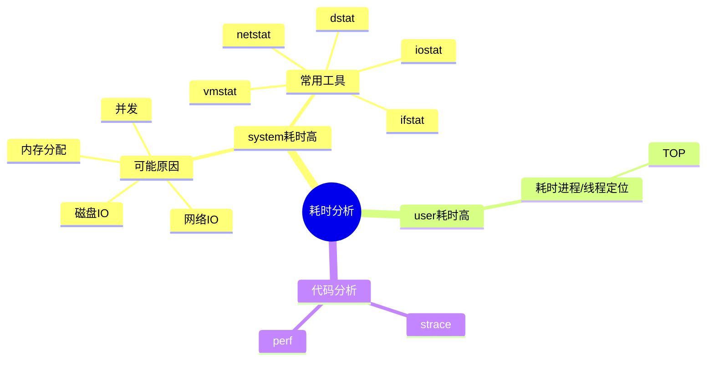

# 系统性能分析-CPU耗时定位

上篇博客介绍了 [CPU异常分析的工具和方法](/post/2024/09/c8c5ed6/)。本文将介绍如何定位 CPU 耗时。

<!--more-->

## 定位思路



## 代码分析

### strace 

strace是一个可用于诊断、调试和教学的Linux用户空间跟踪器。我们用它来监控用户空间进程和内核的交互，比如系统调用、信号传递、进程状态变更等(strace底层使用内核的ptrace特性来实现其功能)。

strace有两种运行模式。

- 一种是通过它启动要跟踪的进程。用法很简单，在原本的命令前加上strace即可。比如我们要跟踪 `ls -lh /var/log/messages` 这个命令的执行，可以这样：`strace ls -lh /var/log/messages`。
- 另外一种运行模式，是跟踪已经在运行的进程，在不中断进程执行的情况下进行分析。这种方式通过传递pid启动`strace -p [pid]`。

strace常用选项：

- `-t` 跟踪的每一行都以时间为前缀。
- `-tt` 在每行输出的前面，显示毫秒级别的时间
- `-T` 显示每次系统调用所花费的时间,这将记录每个系统调用的开始和结束之间的时间差。
- `-v` 对于某些相关调用，把完整的环境变量，文件stat结构等打出来。
- `-f` 跟踪目标进程，以及目标进程创建的所有子进程
- `-e expr` 控制要跟踪的事件和跟踪行为,比如指定要跟踪的系统调用名称
  - `-e trace=set` 仅跟踪指定的系统调用集。该选项用于确定哪些系统调用可能是跟踪有用有用。例如，trace=open，close，read，write表示仅跟踪这四个系统调用。
  - `-e trace=file` 跟踪所有以文件名作为参数的系统调用。
  - `-e trace=process` 跟踪涉及过程管理的所有系统调用。
- `-o` 把strace的输出单独写到指定的文件
- `-s` 当系统调用的某个参数是字符串时，最多输出指定长度的内容，默认是32个字节
- `-p` 指定要跟踪的进程pid, 要同时跟踪多个pid, 重复多次-p选项即可。
- `-c` 统计系统调用的所执行的时间,次数和出错的次数等。
- `-S` 按指定条件对-c选项打印的直方图输出进行排序。

```sh
 strace -c uptime
% time     seconds  usecs/call     calls    errors syscall
------ ----------- ----------- --------- --------- ----------------
 23.99    0.000688          10        65           mmap
 19.28    0.000553          12        44           mprotect
 14.92    0.000428          12        35         6 open
 10.95    0.000314          10        29           read
  8.96    0.000257           8        29           close
  8.72    0.000250           9        27           fstat
  1.99    0.000057          14         4           munmap
  1.92    0.000055          13         4         4 access
  1.36    0.000039           7         5         4 stat
  1.26    0.000036          18         2         2 statfs
  1.19    0.000034           8         4           lseek
  1.15    0.000033           8         4           rt_sigaction
  1.08    0.000031          10         3           brk
  0.63    0.000018           9         2           fcntl
  0.56    0.000016           5         3           alarm
  0.49    0.000014          14         1           write
  0.28    0.000008           8         1           rt_sigprocmask
  0.28    0.000008           8         1           uname
  0.28    0.000008           8         1           arch_prctl
  0.24    0.000007           7         1           getrlimit
  0.24    0.000007           7         1           set_tid_address
  0.24    0.000007           7         1           set_robust_list
  0.00    0.000000           0         1           execve
------ ----------- ----------- --------- --------- ----------------
100.00    0.002868                   268        16 total
```

### perf

perf是Linux内核自带的一款性能分析工具，它利用内核中的性能计数器（performance counters）来收集系统的各种性能数据。这些数据包括CPU使用率、缓存命中率、分支预测失败率等，可以帮助我们深入了解系统的运行情况，找出性能瓶颈，进而进行优化。

perf的主要功能

- 数据收集：perf可以收集CPU、内存、IO等各个方面的性能数据，通过对这些数据的分析，我们可以找出系统中的性能瓶颈。
- 实时分析：perf提供了实时分析功能，可以在系统运行过程中实时查看性能数据，帮助开发人员及时发现问题并进行调整。
- 事件跟踪：perf支持事件跟踪功能，可以跟踪系统中的特定事件，如函数调用、系统调用等，从而找出性能问题的根源。

> `perf list` 可以列出所有可用的性能事件。这些事件包括硬件事件（如 CPU 周期、缓存命中/未命中等）和软件事件（如上下文切换、系统调用等）。

#### perf record

使用 perf record 命令来记录目标程序的性能数据。

```sh
timeout 10s perf record -g -p 1156
```

- `-e` 选择性能事件。可以是 CPU 周期、缓存未命中等。使用 perf list 命令来查看所有可用的事件。
- `-g` 记录函数调用关系（调用栈）。这对于分析程序中函数调用和热点非常有帮助。
- `-a` 表示对所有 CPU 进行采样
- `-p` 记录指定进程的性能数据。只关注某一个特定进程
- `-t` 记录指定线程的性能数据。用于分析多线程程序中某个特定线程的性能
- `-F 99` 设置采样频率，表示每秒采样 99 次
- `-c 1000` 设置事件的采样周期。例如，每发生1000次事件采样一次。


这会生成一个 perf.data 文件，它包含了采集的性能数据，也可以用 -o 来指定生成的文件名。

可以指定要分析的事件类型，例如 CPU 时钟周期、缓存命中等。

```sh
perf record -e cpu-clock -a sleep 6
## 还支持跟踪点（tracepoints），这是一种在内核中预定义的事件，可以用来跟踪系统调用等。
perf record -e 'syscalls:sys_enter_*' -a sleep 6
```

#### 分析性能数据

使用`perf report`产生结果分析。

```
Samples: 717  of event 'cycles:uppp', Event count (approx.): 195060525                         
  Children      Self  Command  Shared Object       Symbol                                          
-   39.16%     0.00%  java     libpthread-2.17.so  [.]start_thread
     start_thread
   - java_start
      - 33.09% ConcurrentG1RefineThread::run
         - ConcurrentG1RefineThread::run_young_rs_sampling
            - 32.64% ConcurrentG1RefineThread::sample_young_list_rs_lengths
               + YoungList::rs_length_sampling_next
      - 3.63% WatcherThread::run
         + 2.20% WatcherThread::sleep
         + 1.16% PeriodicTask::real_time_tick
      + 1.38% VMThread::run
      + 0.99% JavaThread::run  
+   39.16%     0.00%  java     libjvm.so           [.] java_start
+   33.09%     0.00%  java     libjvm.so           [.] ConcurrentG1RefineThread::run
+   33.09%     0.06%  java     libjvm.so           [.] ConcurrentG1RefineThread::run_young_rs_sampling
+   32.64%     0.38%  java     libjvm.so           [.] ConcurrentG1RefineThread::sample_young_list_rs_lengths
+   32.26%     6.15%  java     libjvm.so           [.] YoungList::rs_length_sampling_next
+   12.71%     0.75%  java     libjvm.so           [.] G1CollectorPolicy::update_incremental_cset_info
+   11.22%     3.05%  java     libjvm.so           [.] G1CollectorPolicy::predict_region_elapsed_time_ms
+    9.82%     0.25%  java     libjvm.so           [.] Monitor::lock_without_safepoint_check
+    9.69%     9.57%  java     libjvm.so           [.] Monitor::ILock
+    7.41%     0.00%  java     perf-659.map        [.] 0x00007f2bdd52fc06
+    7.41%     0.24%  java     libzip.so           [.] Java_java_util_zip_Inflater_inflateBytes
+    6.68%     0.21%  java     libzip.so           [.] inflate
+    6.24%     5.87%  java     libjvm.so           [.] G1CollectorPolicy::predict_bytes_to_copy
+    5.55%     0.00%  java     perf-659.map        [.] 0x00007f2bde89eabc
+    5.45%     5.45%  java     libzip.so           [.] inflate_fast
+    5.31%     0.00%  java     [unknown]           [k] 0x9090909090c3c9e5
+    5.31%     0.00%  java     libjvm.so           [.] Klass::is_klass
```

| 列 | 描述 |
|---|---|
| Children | 该函数及其所有子函数的 CPU 使用百分比总和 |
| Self | 该函数本身 CPU 使用百分比 |
| Command | 正在运行的程序或命令 |
| Shared Object | 包含该函数的库或模块 |
| Symbol | 函数或方法的名称 |

文件查看不够直观，还有一种火焰图分析的方式：
- 工具下载: `git clone https://github.com/brendangregg/FlameGraph.git`
- 使用命令：
  - 使用perf script工具对perf.data进行解析`perf script -i perf.data &> perf.unfold`
  - 将perf.unfold中的符号进行折叠：`/data/stackcollapse-perf.pl perf.unfold &> perf.folded`
  - 最后生成svg图：`/data/flamegraph.pl perf.folded > perf.svg`

#### CPU 内部耗时

在[CPU流水线简介](/post/efefddd2/)中介绍了 CPU 内部的流水线执行模型。考虑到 CPU模型内部耗时，90%的CPU利用率可能意味着：


也可能意味着：


> 当CPU执行时，所需的数据不在寄存器或cache中。需要去内存加载数据，这期间CPU没有工作，等待，称stall。

当然还有可能是其他因素，为了了解了解 CPU 内部的耗时指标，我们可以通过 perf stat命令。下面是一个例子:

```sh
## 也可以通过 -e 选项增加自己感兴趣的事件
## perf stat -e cycles,instructions,L1-dcache-loads,L1-dcache-load-misses,LLC-loads,LLC-load-misses,dTLB-loads,dTLB-load-misses -- sleep 10 

$ perf stat -a -- sleep 10

 Performance counter stats for 'system wide':

     641398.723351      task-clock (msec)         #   64.116 CPUs utilized            (100.00%)
           379,651      context-switches          #    0.592 K/sec                    (100.00%)
            51,546      cpu-migrations            #    0.080 K/sec                    (100.00%)
        13,423,039      page-faults               #    0.021 M/sec                  
 1,433,972,173,374      cycles                    #    2.236 GHz                      (75.02%)
   <not supported>      stalled-cycles-frontend  
   <not supported>      stalled-cycles-backend   
 1,118,336,816,068      instructions              #    0.78  insns per cycle          (75.01%)
   249,644,142,804      branches                  #  389.218 M/sec                    (75.01%)
     7,791,449,769      branch-misses             #    3.12% of all branches          (75.01%)

      10.003794539 seconds time elapsed
```

> 这里的关键指标是每个周期的指令(insns每周期：IPC)，它显示了平均每个CPU时钟周期我们完成了多少条指令。越高越好（一个简化）。上面0.78的例子听起来不错（78%忙？）但是考虑到这个处理器的最高速度是4.0的IPC。这也被称为4宽，这意味着，CPU可以在每个时钟周期停用（完成）四条指令。因此，在4宽系统上0.78的IPC意味着CPU以其最高速度的19.5%运行。较新的Intel处理器可能会转向5宽。

- task-clock：用于执行程序的CPU时间，单位是ms(毫秒)。第二列中的CPU utillized则是指这个进程在运行perf的这段时间内的CPU利用率，该数值是由task-clock除以最后一行的time elapsed(也就是wall time，真实时间，单位为秒，下面的M/sec等数值都是除以这个数得到的)再除以1000得出的。
- context-switches：程序在运行过程中发生的上下文切换次数。这个指标值大家都很熟悉，就不细说了。
- cpu-migrations：程序在运行过程中发生的CPU迁移次数，即被调度器从一个CPU转移到另外一个CPU上运行。这里要注意下CPU迁移和上下文切换的不同之处：发生上下文切换时不一定会发生CPU迁移，而发生CPU迁移时肯定会发生上下文切换。发生上下文切换时有可能只是把上下文从当前CPU中换出，下一次调度器还是将进程安排在这个CPU上执行。
- page-faults：缺页。指当内存访问时先根据进程虚拟地址空间中的虚拟地址通过MMU查找该内存页在物理内存的映射，没有找到该映射，则发生缺页，然后通过CPU中断调用处理函数，从物理内存中读取。
- cycles：CPU时钟周期。CPU从它的指令集(instruction set)中选择指令执行。一个指令包含以下的步骤，每个步骤的执行都至少需要花费一个时钟周期。
  - 指令读取(instruction fetch)
  - 指令解码(instruction decode)
  - 执行(execute)
  - 内存访问(memory access)
  - 寄存器回写(register write-back)
- stalled-cycles：停滞周期，是指令管道未能按理想状态发挥并行作用，发生停滞的时钟周期。stalled-cycles-frontend指指令读取或解码的指令步骤，而stalled-cycles-backend则是指令执行步骤。
- instructions：该进程在这段时间内完成的CPU指令，这是整个perf stat命令输出中最重要的指标值。
  - 第二列中的insns per cycle，简称IPC，表示一个时钟周期内能完成多少个CPU指令。该值越高，表示CPU的性能越好。
  - 第二列第二行的stalled cycles per insn(上图由于不支持stalled-cycles所以未显示)，表示完成每个指令，有多少个时钟周期是被停滞的，这个值越小，表示CPU的性能越好。该值是由stalled-cycles-frontend除以instructions得到的。
- branches：这段时间内发生分支预测的次数。
- branches-misses：这段时间内分支预测失败的次数，这个值越小越好。

