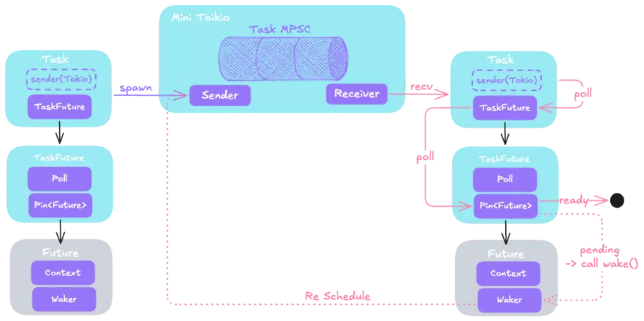

# Rust Future 实现原理

Rust 既支持了基于系统线程的多线程编程模型，也支持了基于`async/await`的异步编程模型。Rust 的async编程有有以下特性:

- Future 在 Rust 中是惰性的
- Async 在 Rust 中使用开销是零
- Rust 没有内置异步调用所必需的运行时，但是社区生态中已经提供了非常优异的运行时实现，例如 tokio和async-std
- 运行时同时支持单线程和多线程

<!--more-->

## Rust异步编程

`async/await` 是 Rust 内置的语言特性，可以让我们用同步的方式去编写异步的代码。极大地简化了异步编程的复杂性。

- 通过`async`标记的语法块会被转换成实现了Future特征的状态机。 与同步调用阻塞当前线程不同，当Future执行并遇到阻塞时，它会让出当前线程的控制权，这样其它的Future就可以在该线程中运行，这种方式完全不会导致当前线程的阻塞。
- `await`方法保证了调用异步方法的顺序，同时在执行await时，如果 future 没有 ready，线程可以挂起当前 future 任务，去执行其他 future 任务。

### async 编程示例

先来看个异步的例子:

```rust
/*
 * [dependencies]
 * chrono = "0.4.41"
 * futures = "0.3.24"
 * async-std = "1.13.1"
 */
use std::{thread, time::Duration};

use chrono::Local;

async fn async_hello_11() {
    println!(
        "[{}] [{:?}] hello async 11!",
        Local::now().timestamp_millis(),
        thread::current().id()
    );
}
async fn async_hello_12() {
    println!(
        "[{}][{:?}] hello async 12!",
        Local::now().timestamp_millis(),
        thread::current().id()
    );
}
async fn async_hello_1() {
    async_hello_11().await;
    tokio::time::sleep(Duration::from_secs(2)).await;
    async_hello_12().await;
}
async fn async_hello_2() {
    println!(
        "[{}][{:?}] hello async 2 !",
        Local::now().timestamp_millis(),
        thread::current().id()
    );
}
#[tokio::main]
async fn main() {
    let f1 = async_hello_1();
    let f2 = async_hello_2();
    tokio::join!(f1, f2);
}
```

从输出中可以发现 3 个异步方法均在同一线程中调度执行。

```
[1747186771086] [ThreadId(1)] hello async 11! ────┬───────┐
                                                  1ms     │ 
[1747186771087][ThreadId(1)] hello async 2 !  ────┘      2001ms
                                                          │
[1747186773087][ThreadId(1)] hello async 12!  ────────────┘
```

## 异步底层:Future

在Rust的异步编程中，Future是一个核心概念。一个Future代表了一个可能尚未完成的计算，类似于一个占位符，未来某个时刻会产生一个结果。

### Future 特征

```rust
pub trait Future {
    /* future 返回值的类型*/
    type Output;
    fn poll(self: Pin<&mut Self>, cx: &mut Context<'_>) -> Poll<Self::Output>;
}
```

Future 的唯一方法是`poll`, 方法返回一个Poll枚举,指示Future是已完成(Ready)还是尚未完成(Pending)。poll 方法有2个参数:

- `self: Pin<&mut Self>`: 注意 self 被 Pin 指针包装(pin确保内存中self的数据不会被移动)。
- `Context`: 运行上下文，上下文中包含了`Waker`,Waker用于指示Future准备好被重新调度。


- 一旦 future 返回了 Ready，就不应该再次调用poll方法。
- 在多个轮询调用中，只有传递给最近调用的上下文中的waker应该被安排接收唤醒。
- future 本身是惰性的，只有通过对 poll方法的调用才能推进 future 的执行。


### 脱糖(Async -> Future)

> 这里所说的脱糖并不是指 rust 会生成脱糖的代码，实际上 rust 是在llvm字节码层面实现的 async => future。所以下面的代码只是一份等效的 rust 代码。

前面提到通过`async`标记的语法块会被转换成实现了Future特征的状态机。接下来会一个异步函数转为使用 Future 实现的同步版本。

```rust
async fn foo_async(n: u64) {
    println!("start async");
    tokio::time::sleep(Duration::from_secs(n)).await;
    println!("end async");
}
```

接下来转换为一个使用 Future 特征的同步版本:

```rust
use std::future::Future;
use std::pin::Pin;
use std::task::{Context, Poll};
use std::time::Duration;

use tokio::time::Sleep;
// 异步对应的状态机
enum FooState {
    // begin
    Started,
    // await Future1,ie Sleep
    Await1,
    // The future has completed.
    Done,
}
struct FooFuture {
    state: FooState,
    // 这里的 pin 后面会展开介绍，先可以看做为 Sleep(impl Future)类型
    sleep: Pin<Box<Sleep>>,
}

impl Future for FooFuture {
    type Output = ();

    fn poll(mut self: Pin<&mut Self>, cx: &mut Context<'_>) -> Poll<()> {
        loop {
            match self.state {
                FooState::Started => {
                    println!("start async");
                    self.state = FooState::Await1;
                }
                FooState::Await1 => match self.sleep.as_mut().poll(cx) {
                    Poll::Ready(_) => {
                        self.state = FooState::Done;
                    }
                    Poll::Pending => {
                        // 重新加入调度，后面会详细介绍
                        cx.waker().wake_by_ref();               
                        return Poll::Pending;
                    }
                },
                FooState::Done => {
                    println!("end async");
                    return Poll::Ready(());
                }
            }
        }
    }
}
fn foo_sync(n: u64) -> FooFuture {
    let duration = Duration::from_secs(n);
    let sleep = Box::pin(tokio::time::sleep(duration));
    FooFuture {
        state: FooState::Started,
        sleep,
    }
}
```

### Future 使用问题

#### 递归

在内部，async fn 创建了一个包含了要`.await` 的子 Future 的状态机。这样递归的 async fn 有点诡异，因为结果的状态机必须包含它自身：

```rust
// This function:
async fn foo() {
    step_one().await;
    step_two().await;
}
// 生成一个这样的类型:
enum Foo {
    First(StepOne),
    Second(StepTwo),
}

// 所以这个函数:
async fn recursive() {
    recursive().await;
    recursive().await;
}

// 生成一个这样的类型:
enum Recursive {
    First(Recursive),
    Second(Recursive),
}
```

这不会工作——我们创建了大小为无限大的类型！编译器会报错：

```
error[E0733]: recursion in an `async fn` requires boxing
 --> src/lib.rs:1:22
  |
1 | async fn recursive() {
  |                      ^ an `async fn` cannot invoke itself directly
  |
  = note: a recursive `async fn` must be rewritten to return a boxed future.
```

为了允许这种做法，我们需要用 Box 来间接调用。而不幸的是，编译器限制意味着把 recursive() 的调用包裹在 Box::pin 并不够。为了让递归调用工作，我们必须把 recursive 转换成非 async 函数，然后返回一个`.boxed()`的异步块。

```rust
use futures::future::{BoxFuture, FutureExt};

fn recursive() -> BoxFuture<'static, ()> {
    async move {
        recursive().await;
        recursive().await;
    }.boxed()
}
```

#### 在 async 语句块中使用 ?

async 语句块和 async fn 最大的区别就是前者无法显式的声明返回值，在大多数时候这都不是问题，但是当配合 ? 一起使用时，问题就有所不同:

```rust
async fn foo() -> Result<u8, String> {
    Ok(1)
}
async fn bar() -> Result<u8, String> {
    Ok(1)
}
pub fn main() {
    let fut = async {
        foo().await?;
        bar().await?;
        Ok(())
    };
}
```

以上代码编译后会报错:

```
error[E0282]: type annotations needed
  --> src/main.rs:14:9
   |
11 |     let fut = async {
   |         --- consider giving `fut` a type
...
14 |         Ok(1)
   |         ^^ cannot infer type for type parameter `E` declared on the enum `Result`
```

原因在于编译器无法推断出`Result<T, E>`中的 E 的类型，目前还没有办法为 async 语句块指定返回类型。既然编译器无法推断出类型，那就给它更多提示，可以使用 `::< ... >`的方式来增加类型注释：

```rust
let fut = async {
    foo().await?;
    bar().await?;
    Ok::<(), String>(()) // 在这一行进行显式的类型注释
};
```

给予类型注释后此时编译器就知道 `Result<T, E>`中的 E 的类型是 String，进而成功通过编译。

#### async 函数和 Send 特征

对于async fn ，它返回的 Future 能否在线程间传递的关键在于 `.await`运行过程中，作用域中的变量类型是否是 Send。Rc 无法在多线程环境使用，原因就在于它并未实现 Send 特征，那就用它来做例子:

```rust
use std::rc::Rc;

#[derive(Default)]
struct NotSend(Rc<()>);
```

事实上，未实现 Send 特征的变量可以出现在 async fn 语句块中:

```rust
async fn bar() {}
async fn foo() {
    NotSend::default();
    bar().await;
}

fn require_send(_: impl Send) {}

fn main() {
    require_send(foo());
}
```

即使上面的 foo 返回的 Future 是 Send， 但是在它内部短暂的使用 NotSend 依然是安全的，原因在于它的作用域并没有影响到 `.await`，下面来试试声明一个变量，然后让 `.await` 的调用处于变量的作用域中试试:

```rust
async fn foo() {
    let x = NotSend::default();
    bar().await;
}
```

不出所料，错误如期而至:

```
error: future cannot be sent between threads safely
  --> src/main.rs:17:18
   |
17 |     require_send(foo());
   |                  ^^^^^ future returned by `foo` is not `Send`
   |
   = help: within `impl futures::Future<Output = ()>`, the trait `std::marker::Send` is not implemented for `Rc<()>`
note: future is not `Send` as this value is used across an await
  --> src/main.rs:11:5
   |
10 |     let x = NotSend::default();
   |         - has type `NotSend` which is not `Send`
11 |     bar().await;
   |     ^^^^^^^^^^^ await occurs here, with `x` maybe used later
12 | }
   | - `x` is later dropped here
```
提示很清晰，`.await`在运行时处于 x 的作用域内。`.await`有可能被执行器调度到另一个线程上运行，而 Rc 并没有实现 Send，因此编译器报错。为了规避这个问题，你可能需要引入一个块作用域来封装任何非 Send 变量。这会让编译器更容易发现这些变量不会存活超过`.await` 点。

```rust
async fn foo() {
    {
        let x = NotSend::default();
    }
    bar().await;
}
```

### Delay future

了解 Future 特征后，我们实现一个非常简单的 future -- 延时执行

```rust
use std::future::Future;
use std::pin::Pin;
use std::task::{Context, Poll};
use std::time::{Duration, Instant};

struct Delay {
    when: Instant,
}

impl Future for Delay {
    type Output = &'static str;

    fn poll(self: Pin<&mut Self>, cx: &mut Context<'_>) -> Poll<&'static str> {
        if Instant::now() >= self.when {
            println!("Delay complete");
            Poll::Ready("done")
        } else {
            // 此处触发一次唤醒
            cx.waker().wake_by_ref();
            Poll::Pending
        }
    }
}

#[tokio::main]
async fn main() {
    let when = Instant::now() + Duration::from_secs(2);
    let future = Delay { when };

    let out = future.await;
    assert_eq!(out, "done");
}
```

在返回 Poll::Pending 之前，我们调用了 cx.waker().wake_by_ref()。这是为了满足 future 约定。通过返回 Poll::Pending，我们有责任发出 waker 信号。在上面的实现中内联发出了 waker 信号。这样做将导致 future 立即重新调度、再次执行，并且可能尚未准备好完成。在这种特定情况下，即使我们根本没有准备好继续操作，我们也发出了 waker 信号。除了浪费一些 CPU 周期外，这没有什么问题。但是，此特定实现将导致忙循环。

我们可以更新 Delay,确保完成时才 wake。

```rust
use std::future::Future;
use std::pin::Pin;
use std::task::{Context, Poll};
use std::time::{Duration, Instant};
use std::thread;

struct Delay {
    when: Instant,
}

impl Future for Delay {
    type Output = &'static str;

    fn poll(self: Pin<&mut Self>, cx: &mut Context<'_>)
        -> Poll<&'static str>
    {
        if Instant::now() >= self.when {
            println!("Hello world");
            Poll::Ready("done")
        } else {
            // Get a handle to the waker for the current task
            let waker = cx.waker().clone();
            let when = self.when;

            // Spawn a timer thread.
            thread::spawn(move || {
                let now = Instant::now();

                if now < when {
                    thread::sleep(when - now);
                }
                waker.wake();
            });
            Poll::Pending
        }
    }
}
```

上面的计时器版本实现咋一看没有问题，但是需要注意的是，Rust 的异步模型允许单个 future 在执行时跨任务迁移。考虑以下情况:

```rust
use futures::future::poll_fn;
use std::future::Future;
use std::pin::Pin;

#[tokio::main]
async fn main() {
    let when = Instant::now() + Duration::from_millis(10);
    let mut delay = Some(Delay { when });

    poll_fn(move |cx| {
        let mut delay = delay.take().unwrap();
        let res = Pin::new(&mut delay).poll(cx);
        assert!(res.is_pending());
        tokio::spawn(async move {
            delay.await;
        });

        Poll::Ready(())
    }).await;
}
```

poll_fn 函数使用闭包创建一个 Future 实例。上面的代码片段创建了一个 Delay 实例，轮询一次，然后将 Delay 实例发送到一个新任务，并在其中进行 await 操作。在此示例中，使用不同的 Waker 实例多次调用 Delay::poll。发生这种情况时，您必须确保在传递给最近一次 poll 调用的 Waker 上调用 wake。在实现 future 时，至关重要的是要假设每次调用 poll 可能会提供不同的 Waker 实例。poll 函数必须使用新的 waker 更新任何先前记录的 waker。

同时，上面的Delay 实现每次轮询时都会衍生一个新的线程。这很好，但如果轮询过于频繁（例如，如果您在 future 和其他 future 上使用 select!，则每当其中任何一个发生事件时都会轮询两者），则效率会非常低。

针对上面的两个问题: 一种方法是记住您是否已经衍生了一个线程，并且仅在您尚未衍生线程时才衍生一个新线程。但是，如果您这样做，则必须确保在后续的 poll 调用中更新线程的 Waker，否则您将不会唤醒最近的 Waker。

```rust
use std::future::Future;
use std::pin::Pin;
use std::sync::{Arc, Mutex};
use std::task::{Context, Poll, Waker};
use std::thread;
use std::time::{Duration, Instant};

struct Delay {
    when: Instant,
    // This is Some when we have spawned a thread, and None otherwise.
    waker: Option<Arc<Mutex<Waker>>>,
}

impl Future for Delay {
    type Output = ();

    fn poll(mut self: Pin<&mut Self>, cx: &mut Context<'_>) -> Poll<()> {
        // 判断是否 ready
        if Instant::now() >= self.when {
            return Poll::Ready(());
        }

        // 如果是初次 poll，创建计时器线程。
        // 否则确保 waker 是正确的
        if let Some(waker) = &self.waker {
            let mut waker = waker.lock().unwrap();

            // 检查存储的 waker 是否满足当前的 waker(是否会 wake 相同的 task)
            if !waker.will_wake(cx.waker()) {
                // 更新 waker
                *waker = cx.waker().clone();
            }
        } else {
            let when = self.when;
            let waker = Arc::new(Mutex::new(cx.waker().clone()));
            self.waker = Some(waker.clone());
            thread::spawn(move || {
                let now = Instant::now();
                if now < when {
                    thread::sleep(when - now);
                }
                let waker = waker.lock().unwrap();
                waker.wake_by_ref();
            });
        }
        Poll::Pending
    }
}
```

当然我们还可以使用`tokio::sync::Notify`来实现 delay。Notify 提供基本的任务通知机制。它处理 wakers 的细节，包括确保记录的 waker 与当前任务匹配。

```rust
use tokio::sync::Notify;
use std::sync::Arc;
use std::time::{Duration, Instant};
use std::thread;

async fn delay(dur: Duration) {
    let when = Instant::now() + dur;
    let notify = Arc::new(Notify::new());
    let notify_clone = notify.clone();

    thread::spawn(move || {
        let now = Instant::now();
        if now < when {
            thread::sleep(when - now);
        }
        notify_clone.notify_one();
    });
    notify.notified().await;
}
```

### 同时执行多个 Future

通常使用`.await` 来执行future，但是这会阻塞并发任务，直到特定的 Future 完成。然而，真实的异步应用经常需要并发执行几个不同的操作。

#### join!

`futures::join`宏等待并发执行的多个不同 future 完成。

```rust
use futures::join;

async fn get_book_and_music() -> (Book, Music) {
    let book_fut = get_book();
    let music_fut = get_music();
    join!(book_fut, music_fut)
}
```

> 对于那些返回 Result 的 future，考虑使用 `try_join!` 而非 join。因为 join 只会在所有子 future 都完成后才会完成，它甚至会在子 future 返回 Err 之后继续处理。与 `join!` 不同，`try_join!` 会在其中的子future返回错误后立即完成。

#### select!

`join!`只有等所有 Future 结束后，才能集中处理结果，如果你想同时等待多个 Future ，且任何一个 Future 结束后，都可以立即被处理，可以考虑使用 `futures::select!`。

```rust
use futures::{
    future::FutureExt, // for `.fuse()`
    pin_mut,
    select,
};

async fn task_one() { /* ... */ }
async fn task_two() { /* ... */ }

async fn race_tasks() {
    let t1 = task_one().fuse();
    let t2 = task_two().fuse();

    pin_mut!(t1, t2);

    select! {
        () = t1 => println!("任务1率先完成"),
        () = t2 => println!("任务2率先完成"),
    }
}
```

select!还支持 default 和 complete 分支:

- complete 分支当所有的 Future 和 Stream 完成后才会被执行，它往往配合 loop 使用，loop 用于循环完成所有的 Future
- default 分支，若没有任何 Future 或 Stream 处于 Ready 状态， 则该分支会被立即执行

## mini 运行时

要运行异步函数，必须通过 poll 函数调用。而最外层的 Future 是通过异步运行时调度的。接下来我们将实现一个最小运行时。



> 工程级别的tokio运行时[调度器](https://tokio.rs/blog/2019-10-scheduler)

### RunTime

```rust
struct MiniTokio {
    scheduled: mpsc::Receiver<Arc<Task>>,
    sender: mpsc::Sender<Arc<Task>>,
}
impl MiniTokio {
    fn run(&self) {
        while let Ok(task) = self.scheduled.recv() {
            task.poll();
        }
    }
    fn new() -> MiniTokio {
        let (sender, scheduled) = mpsc::channel();
        MiniTokio { scheduled, sender }
    }
    fn spawn<F>(&self, future: F)
    where
        F: Future<Output = ()> + Send + 'static,
    {
        Task::spawn(future, &self.sender);
    }
}
```

### Task

```rust
struct Task {
    task_future: Mutex<TaskFuture>,
    executor: mpsc::Sender<Arc<Task>>,
}
/// 将我们的 schedule 函数与 std::task::Waker 连接起来。
/// 标准库提供了一个低级 API，可以使用 手动 vtable 构建 来做到这一点。
/// 此策略为实现者提供了最大的灵活性，但需要大量不安全的样板代码。
/// 我们将使用 futures crate 提供的 ArcWake 实用程序，而不是直接使用 RawWakerVTable
impl ArcWake for Task {
    fn wake_by_ref(arc_self: &Arc<Self>) {
        arc_self.schedule();
    }
}
impl Task {
    /// 当在 waker 上调用 wake() 时，任务被推送到通道的发送端
    fn schedule(self: &Arc<Self>) {
        self.executor.send(self.clone());
    }
    /// 轮询
    fn poll(self: Arc<Self>) {
        // 准备 future 上下文
        let waker = task::waker(self.clone());
        let mut cx = Context::from_waker(&waker);
        
        let mut task_future = self.task_future.try_lock().unwrap();
        // Poll the inner future
        task_future.poll(&mut cx);
    }
    fn spawn<F>(future: F, sender: &mpsc::Sender<Arc<Task>>)
    where
        F: Future<Output = ()> + Send + 'static,
    {
        // 创建一个 task
        let task = Arc::new(Task {
            task_future: Mutex::new(TaskFuture::new(future)),
            executor: sender.clone(),
        });
        // 开始调度
        let _ = sender.send(task);
    }
}
/// A structure holding a future and the result of
/// the latest call to its `poll` method.
struct TaskFuture {
    future: Pin<Box<dyn Future<Output = ()> + Send>>,
    poll: Poll<()>,
}
impl TaskFuture {
    fn new(future: impl Future<Output = ()> + Send + 'static) -> TaskFuture {
        TaskFuture {
            future: Box::pin(future),
            poll: Poll::Pending,
        }
    }
    fn poll(&mut self, cx: &mut Context<'_>) {
        // 防止重复唤醒内部的 future
        if self.poll.is_pending() {
            self.poll = self.future.as_mut().poll(cx);
        }
    }
}
```

### 使用

```rust
fn main() {
    let mut mini_tokio = MiniTokio::new();
    // 提交任务
    mini_tokio.spawn(async {
        let when = Instant::now() + Duration::from_millis(10);
        let future = Delay { when };

        let out = future.await;
        assert_eq!(out, "done");
    });
    // 启动运行时调度
    mini_tokio.run();
}
```

## 阻塞 vs 非阻塞

`async/await`的异步编程是非阻塞的，适合 I/O bound的任务，通过让出目前的协程调度，执行下一个任务的方式，来消除ContextSwitch上的开销。协程适用于被阻塞的，且需要大量并发的场景。但不适用于大量计算的多线程，

考虑下面两种情况:

- 昂贵的CPU-Bound(受限于CPU资源的)计算
- 同步IO(Synchronous IO)操作

在这两种情况下，我们都在处理一个会在一段时间内阻止任务.await的操作。为了解决这个问题，我们必须将阻塞操作移动到Tokio线程池外部的线程中去。关于这一点有三种形式可以使用:

- 使用tokio::task::spawn_blocking函数
    - Tokio运行时包含一个单独的线程池，专门用于运行阻塞函数，你可以使用 spawn_blocking在其上运行任务。这个线程池的上限是大约500个线程，因此可以在这个线程池上进行大量阻塞操作。由于线程池有如此多的线程，它最适合用于阻塞 I/O (如与文件系统交互)或使用阻塞数据库库(如diesel)。
    - 线程池不适合昂贵的CPU-bound计算，因为线程池的线程数量比计算机上的 CPU核心数量多得多。当线程数等于CPU核心数时，CPU-bound的计算运行效率最高。
- 使用rayon crate
    - rayon提供了一个专门用于昂贵的CPU-bound计算的线程池(与 tokio 相比，rayon的线程池的最大线程数量很少)
- 通过std::thread::spawn创建一个专门的线程
    - 如果阻塞操作是需要永久运行下去的，那么应该在专用线程上运行它。例如，考虑一个管理数据库连接的线程，他需要使用通道来接收要执行的操作。因为这个线程在循环中监听该通道，所以它永远不会退出。
    - 在上述两个线程池中的任何一个上运行这样的任务都会是一个问题，因为它实际上从池中永久地带走了一个线程。一旦这样做了几次，线程池中就没有更多的线程了，所有其他阻塞任务都无法执行。

## 长尾延迟

```rust
let mut listener = TcpListener::bind(&addr).await?;
loop {
    let (mut socket, _) = listener.accept().await?;
    tokio::spawn(async move {
        // handle socket
    });
}
```

Rust编译器将上面的代码转换为状态机。运行时复用少数线程执行这些状态机任务。每一个`.await`调用是将控制权返回给调度器的机会。在上面的示例中，`listener.accept().await`将返回一个挂起的套接字。如果没有挂起的套接字，则将控制权交还给调度程序。

```rust
tokio::spawn(async move {
    let mut buf = [0; 1024];
    loop {
        let n = socket.read(&mut buf).await?;
        if n == 0 {
            break;
        }
        // Write the data back
        socket.write(buf[..n]).await?;
    }
});
```

1. `read().await` 在等待数据的时候让出控制权
2. 数据到达，任务恢复 
3. `write().await`在写入套接字时让出控制权 
4. 写完成，任务恢复 
5. 立即循环回`read()`


如果接收数据的速度比处理数据的速度快，那么在数据块处理完成之前，可能已经接收了更多的数据。此时，`read().await`可能会立刻返回不让出控制权。然后循环下去，也不会让出控制权给调度器。导致以下结果:

- 同一运行时线程上的其他任务 __饥饿__
- 延迟差异大：一些请求立即得到处理，而另一些请求等待的时间比应该等待的时间长得多 
- 公平性差：当前任务独占CPU时间。

### tokio: yield_now

Tokio的用户可以在应用程序和库中添加`yield_now()`来解决这个问题。

> 在实践中，很少有人真正这样做，最终容易受到这种问题的影响。

```rust
tokio::spawn(async move {
    let mut buf = [0; 1024];

    loop {
        let n = socket.read(&mut buf).await?;

        if n == 0 {
            break;
        }

        socket.write_all(&buf[..n]).await?;
        
        // Explicit yield after processing
        task::yield_now().await;
    }
});
```

这个问题的常见解决方案是抢占。对于普通的操作系统线程，内核会经常中断执行，以确保所有线程的公平调度。完全控制执行的运行时（Go、Erlang等）也会使用抢占来确保任务的公平调度。这是通过注入yield点来实现的 —— 代码检查任务是否已经执行了足够长的时间，如果是，则在编译时返回给调度程序。不幸的是，Tokio无法使用这种技术，因为Rust的async生成器没有为执行器（如Tokio）提供任何注入这种yield点的机制。

### Tokio:Per-task operation budget

即使Tokio无法抢占，仍然有机会推动一个任务yield。截至0.2.14，每个Tokio任务都有一个操作预算。当调度程序切换到任务时，这个预算会被重置。每个Tokio资源(套接字、计时器、通道、…)都知道这个预算。只要任务还有预算剩余，资源就会像以前一样运行。

每个异步操作(用户等待的操作 - `.await`)减少任务的预算。一旦任务超出预算，所有Tokio资源将永远返回`Not Ready`，直到任务返回给调度器。在这一点上，预算被重置，在Tokio资源上`.await`的 future将再次正常运行。

以上面的 socket 代码为例，当`socket.read(..)`和`socket.write(..)`被调用时，预算会递减。如果预算为零，则任务会返回给调度程序。如果read或write由于底层套接字没有准备好（没有待处理的数据或完整的发送缓冲区）而无法继续，则任务也会返回给调度程序。

## 参考资料

- [1] [深入异步|Tokio](https://tokio.rust-lang.net.cn/tokio/tutorial/async)
- [2] [Reducing tail latencies with automatic cooperative task yielding](https://tokio.rs/blog/2020-04-preemption)

