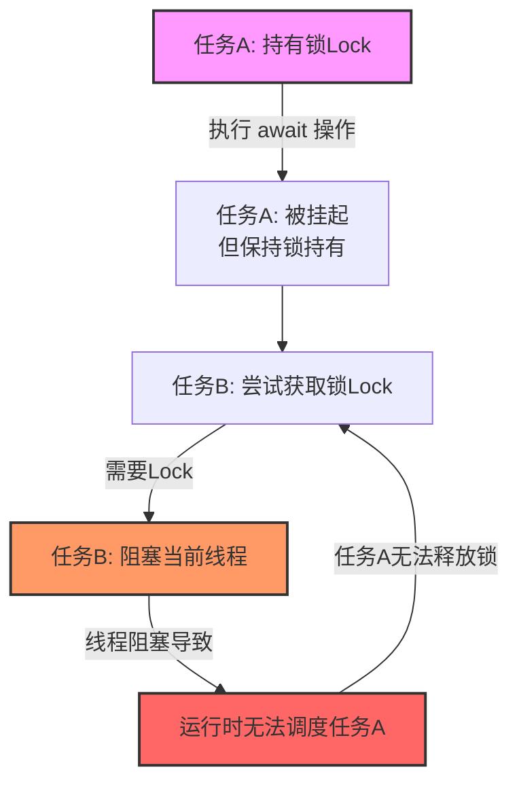
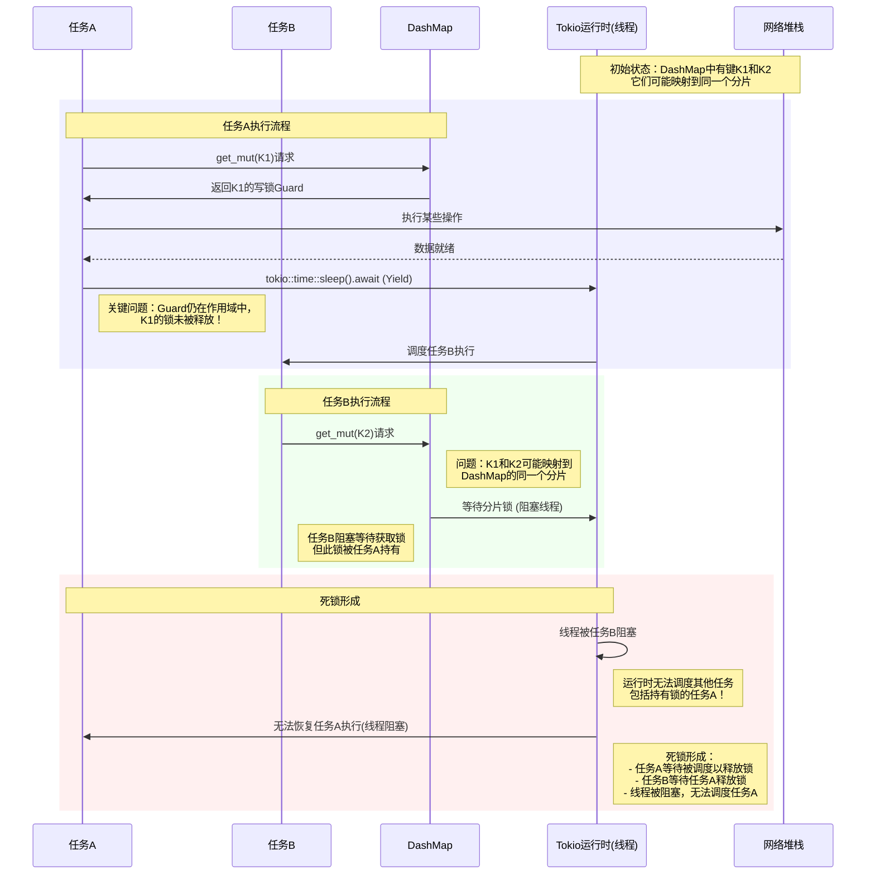

# Rust Future 共享状态

如何在 Rust 的多线程中共享值？

- 共享值的方式是使用`Arc`
- 修改值的方式是使用`Mutex`

<!--more-->

使用Arc将允许您共享该值，因为每当克隆Arc时，都会为相同的共享值提供一个新句柄。对内部值的任何更改都将在Arc的所有其他克隆中可见(克隆Arc非常便宜，因为实际上不必复制其中的数据)。当最后一个Arc超出范围时，Arc中的数据将被销毁。但是Arc只提供对其内部值的不可变访问，当另一个线程可能同时读取一个值时，修改它是不安全的。为此，我们需要添加了一个Mutex。Mutex的目的是确保当时只有一个线程可以访问该值。它使用lock方法(MutexGuard)来做到这一点。

当调用lock时，如果在其他线程有来自同一个互斥锁的MutexGuard，那么对lock的调用将休眠，直到该MutexGuard超出作用域。这保证了在任何时候最多只能存在一个MutexGuard，并且对内部值的所有访问都必须通过MutexGuard。因此可以保证没有两个线程可以同时访问共享值。这使得修改值变得安全。

```rust
use std::collections::HashMap;
use std::sync::{Arc, Mutex};
#[derive(Clone)]
pub struct SharedMap {
    inner: Arc<Mutex<SharedMapInner>>,
}
struct SharedMapInner {
    data: HashMap<i32, String>,
}
impl SharedMap {
    pub fn new() -> Self {
        Self {
            inner: Arc::new(Mutex::new(SharedMapInner {
                data: HashMap::new(),
            }))
        }
    }
    pub fn insert(&self, key: i32, value: String) {
        let mut lock = self.inner.lock().unwrap();
        lock.data.insert(key, value);
    }
    pub fn get(&self, key: i32) -> Option<String> {
        let lock = self.inner.lock().unwrap();
        lock.data.get(&key).cloned()
    }
}
```

这个例子展示了如何创建一个共享HashMap。SharedMap类型派生了Clone，但是对其调用Clone实际上并不克隆其中的所有数据。这是由于Arc。

```rust
fn main() {
    let map = SharedMap::new();

    map.insert(10, "hello world".to_string());
    let map1 = map.clone();
    let map2 = map.clone();

    let thread1 = std::thread::spawn(move || {
        map1.insert(10, "foo bar".to_string());
    });
    let thread2 = std::thread::spawn(move || {
        let value = map2.get(10).unwrap();
        if value == "foo bar" {
            println!("Thread 1 was faster");
        } else {
            println!("Thread 2 was faster");
        }
    });
    thread1.join().unwrap();
    thread2.join().unwrap();
}
```

## 异步代码

rust 的异步编程可以用同步的方式去编写异步的代码，所以在共享状态的处理上，几乎没有不同，除了一点😂:

> 注意: 不要在持有同步锁时，调用 await 方法。

先来看个 demo:

```rust
use chrono::Local;
use futures::future::join_all;
use std::{
    collections::HashMap,
    sync::{Arc, Mutex},
    time::Duration,
};
use tokio;
#[tokio::main]
async fn main() -> Result<(), Box<dyn std::error::Error>> {
    let tasks: Arc<Mutex<HashMap<i32, i32>>> = Arc::new(Mutex::new(HashMap::new()));
    let t = &tasks;
    let mut async_events = vec![];

    for i in 0..2 {
        let mut task = tasks.lock().unwrap();
        task.insert(i, i);
        async_events.push(async move {
            let j = i;
            let thread_id = std::thread::current().id();
            println!("{},{:?},{} get_mut", Local::now(), thread_id, j);
            if let Some(_v) = t.lock().unwrap().get_mut(&j) {
                println!("{},{:?},{} get_mut success", Local::now(), thread_id, j);
                tokio::time::sleep(Duration::from_secs(1)).await;
                println!("{},{:?},{} get_mut sleep", Local::now(), thread_id, j);
            }
        });
    }
    join_all(async_events).await;
    Ok(())
}
/// output
/// 2025-08-26 11:33:19.054910418 +00:00,ThreadId(1),0 get_mut
/// 2025-08-26 11:33:19.054974503 +00:00,ThreadId(1),0 get_mut success
/// 2025-08-26 11:33:19.055002621 +00:00,ThreadId(1),1 get_mut
/// -- dead lock
```

运行上面的 demo,会发现程序处于死锁的状态。死锁原因如下:

- 异步运行时基于协作式调度，任务在 .await 点主动让出 CPU。
- 如果一个任务在持有同步锁（会阻塞线程）后执行 .await，它会让出 CPU，但锁并未释放。
- 当其他任务尝试获取同一把锁时，会因为无法获取而阻塞当前线程，从而阻止了持有锁的任务继续执行和释放锁，导致死锁。



关键代码就是获取同步锁时调用了`.await`。

```rust
for i in 0..2 {
    let mut task = tasks.lock().unwrap();
    task.insert(i, i);
    async_events.push(async move {
        if let Some(_v) = t.lock().unwrap().get_mut(&i) {     ----- 获取锁
                                                                  | 
            tokio::time::sleep(Duration::from_secs(1)).await;     | 此处 future 挂起
                                                                  |  
        }                                                     ----- 释放锁
    });
}
```

要解决这一问题，可以:

- 在 await 之前 drop 掉 MutexGuard（通过缩小作用域或手动 drop）。
- 使用Tokio提供的Mutex和RwLock异步锁(推荐)。异步锁的优势
    - 非阻塞：获取锁的操作是异步的，不会阻塞线程
    - await-safe：可以在持有锁的情况下执行 await，不会导致死锁
    - 与运行时集成：Tokio 的运行时知道如何调度等待锁的任务
- 重构代码, 避免在异步任务中需要长时间持有锁。例如，先读取数据并复制，然后释放锁后再 await。

### dashmap

dashmap将map拆分为多个分片并在每个分片周围设置一个RwLock来工作。对不同分片的访问是完全独立的，但是对同一分片的访问行为就像一个普通的`RwLock<HashMap<K, V>>`。

因此使用 dashmap 也会遇到上面的死锁问题(当多个 task 争用同一个分片时)。

```rust
#[tokio::main]
async fn main() -> Result<(), Box<dyn std::error::Error>> {
    let tasks: DashMap<i32, i32> = DashMap::new();
    let t = &tasks;
    let mut async_events = vec![];

    for i in 0..10 {  /// 此处次数调大，以命中同一个分片
        tasks.insert(i, i);
        async_events.push(async move {
            let j = i;
            if let Some(_v) = t.get_mut(&j) {
                tokio::time::sleep(Duration::from_secs(1)).await;
            }
        });
    }
    join_all(async_events).await;
    Ok(())
}
```

时序图如下:



## 参考

- [1] [Shared mutable state in Rust](https://draft.ryhl.io/blog/shared-mutable-state/)
- [2] [Tokio.Shared state](https://tokio.rs/tokio/tutorial/shared-state)

