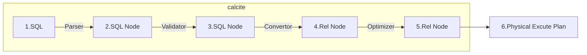
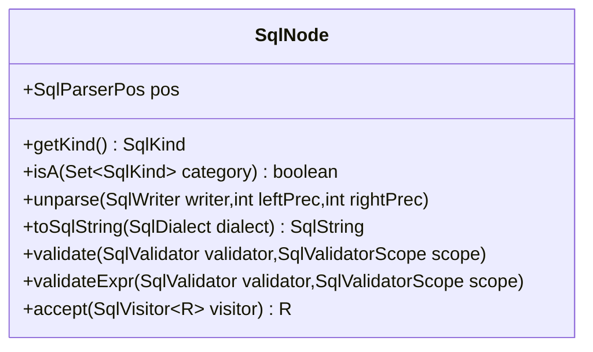
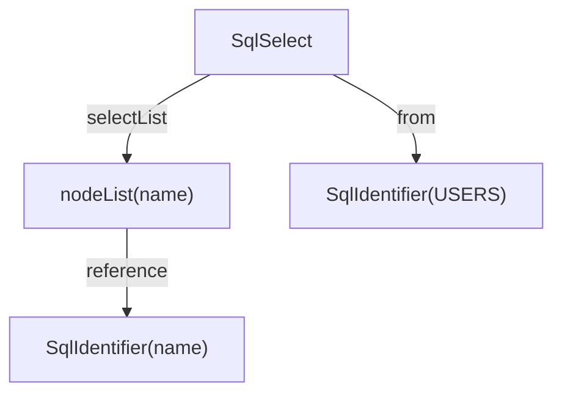
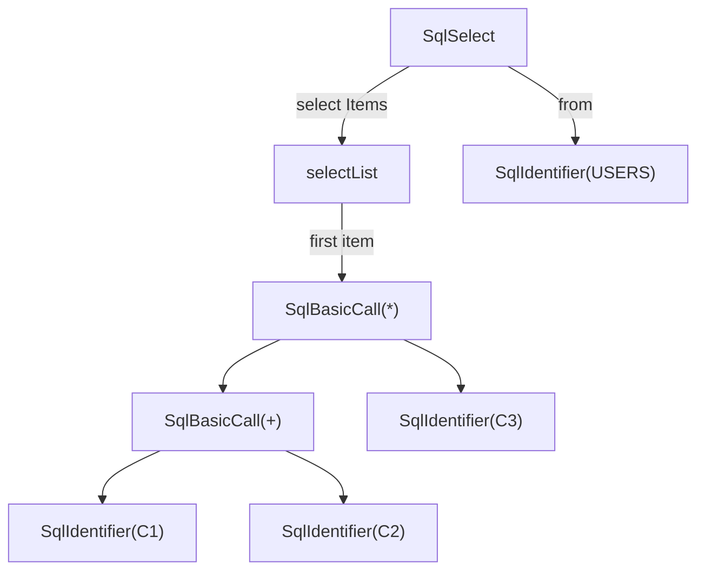

# Apache Calcite:SQL解析


Calcite 中的SQL Parser 使用JavaCC 实现。JavaCC 在前面的博客中有过介绍, 本文就不赘述了。本文主要介绍Parser。

<!--more-->



## Parser

Calcite SQL Parser 的核心实现在 calcite-core 模块，在 src/main 下包含了 codegen 目录:

```sh
## calcite/core/src/main/codegen
.
├── config.fmpp
├── default_config.fmpp
├── includes
│   ├── compoundIdentifier.ftl
│   └── parserImpls.ftl
└── templates
    └── Parser.jj
```

- Parser.jj 文件是 SQL Parser 相关的词法和语法规则文件，并且为了实现 SQL Parser 的扩展，在文件内使用了 Freemarker 模板引擎。
- config.fmpp 和 default_config.fmpp 基于 [fmpp](https://fmpp.sourceforge.net/),用于定义 Freemarker 模板的属性。
- includes目录下的`compoundIdentifier.ftl`和`parserImpls.ftl`是扩展文件, 里面可以添加自定义的SQL语法规则。

在`calcite/core/build.grade.kts`中定义了SQLParser的构建方法:

```groovy
val fmppMain by tasks.registering(org.apache.calcite.buildtools.fmpp.FmppTask::class) {
    config.set(file("src/main/codegen/config.fmpp"))
    templates.set(file("src/main/codegen/templates"))
}

val javaCCMain by tasks.registering(org.apache.calcite.buildtools.javacc.JavaCCTask::class) {
    dependsOn(fmppMain)
    val parserFile = fmppMain.map {
        it.output.asFileTree.matching { include("**/Parser.jj") }
    }
    inputFile.from(parserFile)
    packageName.set("org.apache.calcite.sql.parser.impl")
}
```

- 先通过Fmpp配置和模版生成JavaCC 的 jj 文件。
- 再通过 JavaCC 生成 Parser(包`org.apache.calcite.sql.parser.impl`)。

### SQL Parser - 门面类

由于真正的Parser 是通过JavaCC 生成的动态代码。Calcite 实际使用的是 SQL Parser的门面类:`org.apache.calcite.sql.parser.SqlParser`。调用 SQLParser.create 可以快速创建解析对象，然后进行 SQL 解析。

```java
public void simpleParse(){
    String sql = "select name from users";
    SqlParser sqlParser = SqlParser.create(sql, SqlParser.Config.DEFAULT);
    SqlNode sqlNode = sqlParser.parseQuery();
    log.info(sqlNode.toString());
}
```

除了通用的 Create 方法外，SqlParser 还支持对不同场景下的 SQL 解析。

```java
// 解析 SQL 表达式
public SqlNode parseExpression() throws SqlParseException {...}
// 解析 SQL 查询语句
public SqlNode parseQuery() throws SqlParseException {...}
// 解析 SQL 语句
public SqlNode parseStmt() throws SqlParseException {...}
// 解析分号分隔的 SQL 语句
public SqlNodeList parseStmtList() throws SqlParseException {...}
```

### SqlParser.Config - Parser 配置

SqlParser创建时可以通过`create(String sql, Config config)`传入一个 Config 类来定制 SqlParser 的一些行为，例如:

- quoting: 转义identifier的字符(可以是双引号，单引号，反引号等)
- caseSensitive: 是否大小写敏感
- quotedCasing: 转义identifier的格式转换(可以是不变，大写，小写)
- unquotedCasing: 未转义identifier的格式转换(可以是不变，大写，小写)

### SqlAbstractParserImpl - Parser 抽象层

SqlAbstractParserImpl有以下实现:

- SqlParserImpl: 解析标准 SQL 语句，Calcite默认语法规则[<sup>1</sup>](#refer-anchor-1)
- SqlDdlParserImpl: 解析数据定义语言 (DDL) 语句，Calcite/server模块中实现。
- SqlBabelParserImpl: 支持多种 SQL 方言兼容(如 Oracle, MySQL, Hive 等)，Calcite/babel模块中实现。

`SqlParser.create(sql, SqlParser.Config.DEFAULT.withParserFactory(SqlBabelParserImpl.FACTORY))` 可以获取不同的SqlAbstractParserImpl。

Parser 调用的[示例代码](https://github.com/chutian0610/calcite-demos/blob/master/tutorials/tutorial01/src/test/java/info/victorchu/calcite/tutorial01/parser/CalciteSqlParserTest.java)如下:

```java
String sql = "select name from users";
SqlParser sqlParser = SqlParser.create(sql, SqlParser.Config.DEFAULT.withParserFactory(SqlBabelParserImpl.FACTORY));
SqlNode sqlNode = sqlParser.parseQuery();
log.info(sqlNode.toString());
```

### SQL 扩展

在上面介绍了SqlParserImpl是如何通过 Fmpp 和 JavaCC 生成。同时在SqlAbstractParserImpl部分介绍了SqlBabelParserImpl是对标准 SQL 的一种扩展。接下来，我们来看下Calcite/babel模块是如何对标准 sql 进行扩展的。

```sh
## calcite/babel/src/main/codegen
.
├── config.fmpp
└── includes
    ├── parserImpls.ftl
    └── parserPostgresImpls.ftl
```

config.fmpp 文件定义了 Parser.jj 模板中需要使用的参数，如果未配置则默认会使用 default_config.fmpp 中的参数。config.fmpp中的数据分为两部分:

```fmpp
data:{
    # parser.jj Template 中的变量
    parser:{
        # package、class 和 imports 用于定义生成的解析器类的包名、类名和引入的包。
        # keywords 用于定义扩展语法中的关键字
        # nonReservedKeywordsToAdd 用于定义非保留的关键字。
        
    }
}

freemarkerLinks: {
  # freemarker include 依赖的地址
  includes: includes/
}

```

includes文件夹中是语法规则的扩展文件,在原始的 Parser.jj 文件中通过下面的 freemarker 标签引入，最终会将文件内容替换上面的标签。

```xml
<#-- Add implementations of additional parser statement calls here -->
<#list (parser.implementationFiles!default.parser.implementationFiles) as file>
    <#include "/@includes/"+file />
</#list>
```


上面的逻辑都在`calcite/babel/build.gradle.kts`构建脚本中实现。会指定 core 模块 templates 目录下的 Parser.jj 作为模板，扩展的语法定义会被整合到模板中，统一输出最终的 Parser.jj 文件。

```gradle
val fmppMain by tasks.registering(org.apache.calcite.buildtools.fmpp.FmppTask::class) {
    inputs.dir("src/main/codegen").withPathSensitivity(PathSensitivity.RELATIVE)
    config.set(file("src/main/codegen/config.fmpp"))
    templates.set(file("$rootDir/core/src/main/codegen/templates"))
}
```

## SQL Node

SQL通过SqlParser的处理，最终生成了 SQL Node。Calcite 并没有通过  JavaCC 的jjtree 方式自动生成语法节点类，而是在代码中预先定义SqlNode和其子类，然后在 Parser.jj 文件中使用。大多数产生式规则返回的都是SqlNode的子类。

```bnf
SqlNode SqlStmtEof() :
{
    SqlNode stmt;
}
{
    stmt = SqlStmt() <EOF>
    {
        return stmt;
    }
}
```

bnf对应的 java 代码如下:

```java
public final SqlNode SqlStmtEof() throws ParseException {
    SqlNode stmt = this.SqlStmt();
    this.jj_consume_token(0);
    return stmt;
}
```

SqlNode 是 Calcite 中负责封装语义信息的基础类，除了在解析阶段使用外，它还在校验（validate）、转换 RelNode（convert）以及生成不同方言的 SQL（toSqlString）等阶段都发挥了重要作用。



- SqlParserPos: 表示语法节点在原始文本中的位置。
- getKind(): 用于快速查找某些类型的语法节点，默认类型是 Other。
- isA(): 用于快速识别某一类的语法节点。
- unparse(): 用于从 SQLNode 反向生成 sql 文本
- toSqlString():内部使用了unparse，并适配了不同的 Sql 方言
- validate(): 用于验证 Sql 语法节点。
- validateExpr(): 用于验证在表达式上下文内的 Sql 语法节点。
- accept(): 访问者模式驱动方法。


在 SqlNode 下面有几个细分场景(见`org.apache.calcite.sql.util.SqlVisitor`):

- SqlCall: 代表了Sql 子句操作，实际上是对SqlOperator 的调用。
    - 例如查询操作是 SqlSelectOperator，对应的 SqlNode 是 SqlSelect。
    - Join 操作是SqlJoinOperator，对应的 SqlNode 是 SqlJoin。
- SqlIdentifier: 代表 SQL 中的标识符，例如 SQL 语句中的表名、字段名。
- SqlLiteral: 主要用于封装 SQL 中的常量，通常也叫做字面量。
- SqlNodeList: 代表了SqlNode列表，例如常见的例如 Select 中的字段列表。
- SqlDataTypeSpec: 代表的 Sql 的数据类型定义，例如`ROW(foo NUMBER(5, 2) NOT NULL`
- SqlDynamicParam: 代表了 Sql 中的动态参数，一般常见于 Sql 预编译时使用。例如 JDBC PreparedStatement中的`?`
- SqlIntervalQualifier: 代表了 Sql 中时间间隔定义，例如`INTERVAL 1 DAY`(注意`INTERVAL '1' DAY`会被解析为SqlLiteral)。

下面我们再深入了解下不同子类的具体作用。

### SqlCall

SqlCall代表了Sql 子句操作，实际上是对SqlOperator 的调用。以SqlSelect为例:

```java
public class SqlSelect extends SqlCall {
  SqlNodeList keywordList;
  SqlNodeList selectList;
  @Nullable SqlNode from;
  @Nullable SqlNode where;
  @Nullable SqlNodeList groupBy;
  @Nullable SqlNode having;
  SqlNodeList windowDecls;
  @Nullable SqlNode qualify;
  @Nullable SqlNodeList orderBy;
  @Nullable SqlNode offset;
  @Nullable SqlNode fetch;
  @Nullable SqlNodeList hints;
  ... ...
  @Override
  public SqlOperator getOperator() {
    return SqlSelectOperator.INSTANCE;
  }
  @Override public SqlKind getKind() {
    return SqlKind.SELECT;
  }
  @Override
  public List<SqlNode> getOperandList() {
    return ImmutableNullableList.of(this.keywordList, this.selectList, this.from, this.where, this.groupBy, this.having, this.windowDecls, this.qualify, new SqlNode[]{this.orderBy, this.offset, this.fetch, this.hints});
  }
}
```

SqlSelect中的属性描述了Select 子句的不同部分，例如对 sql `select name from users` 解析可以得到如下的SqlNode树:



此外SqlSelect还实现了SqlCall中的其他方法，其中和 Operator 相关的有 2 个:

- 获取操作符: getOperator 
- 获取操作数列表: getOperandList

#### SqlOperator

SqlOperator 用于表示 SqlCall 这类节点的类型，SqlOperator包括函数、“=”等操作符和“case”语句等语法结构。操作符可以表示查询级表达式(如`SqlSelectOperator`)或行级表达式(如`org.apache.calcite.sql.fun.SqlBetweenOperator`)。

SqlOperator中包含了操作符名称，元数据和校验。此外这里的操作符，操作数的定义和编程语言是类似的。因为操作符也会涉及优先级定义:

```java
public abstract class SqlOperator {
   /*
    * 最高优先级
    */
    public static final int MDX_PRECEDENCE = 200;
    /*
     * 此操作符绑定到左侧表达式的优先级。如果操作符是左结合的，则小于右优先级。
     */
    private final int leftPrec;
    /*
     * 此操作符绑定到右侧表达式的优先级。如果操作符是左结合的，这比左优先级高。
     */ 
    private final int rightPrec;
```

leftPrec和rightPrec 需要在创建SqlOperator时指定。

```java
protected SqlOperator(
     ... ...
      int leftPrecedence,
      int rightPrecedence,
     ... ...
)
```
```java
protected SqlOperator(
      ... ... 
      int prec,
      boolean leftAssoc,
      ... ...
){
    this(
    ... ...
    leftPrec(prec, leftAssoc),
    rightPrec(prec, leftAssoc),
    ... ...
    );
}
/*
 * 假设优先级为 2,
 * 如果是左结合那么优先级是(2,3)
 * 如果是右结合那么优先级是(3,2)
 */
protected static int leftPrec(int prec, boolean leftAssoc) {
    assert (prec % 2) == 0;
    if (!leftAssoc) {
        ++prec;
    }
    return prec;
}

protected static int rightPrec(int prec, boolean leftAssoc) {
    assert (prec % 2) == 0;
    if (leftAssoc) {
        ++prec;
    }
    return prec;
}
``` 

- 对于二元操作符`SqlBinaryOperator`，一般都是区分左右结合的。在`SqlStdOperatorTable`中有非常多的`SqlBinaryOperator`实例。
- 对于一元操作符(`SqlPostfixOperator`或`SqlPrefixOperator`)通常来说是不区分左右结合的，leftAssoc都等于 true。
- 所有的函数`SqlFunction`优先级都是 100。

#### Function

大部分的函数在 sql 解析时会被解析为 SqlUnresolvedFunction(继承 Operator)。也就是说一个不存在但符合函数语法的函数也可以通过 SqlParser的解析，并被解析为SqlUnresolvedFunction。

```java
// org.apache.calcite.sql.parser.SqlAbstractParserImpl
protected SqlCall createCall(
    SqlIdentifier funName,
    SqlParserPos pos,
    SqlFunctionCategory funcType,
    SqlLiteral functionQualifier,
    SqlNode[] operands) {
    // Create a placeholder function.  Later, during
    // validation, it will be resolved into a real function reference.
    SqlOperator fun = new SqlUnresolvedFunction(funName, null, null, null, null,
        funcType);
    return fun.createCall(functionQualifier, pos, operands);
}
```

### SqlLiteral

SqlLiteral代表了 Sql 中的常量:

```mermaid
classDiagram
    class SqlLiteral{
      +SqlTypeName typeName
      +Object value
      +getValueAs(Class~T~ clazz) T
    }
    note for SqlLiteral "Root Class of Sql Literal"

    class SqlAbstractDateTimeLiteral
    note for SqlAbstractDateTimeLiteral "A SQL literal representing a DATE, TIME or TIMESTAMP value."
    &lt;&lt;Abstract>> SqlAbstractDateTimeLiteral
    SqlLiteral <|-- SqlAbstractDateTimeLiteral
    SqlAbstractDateTimeLiteral <|-- SqlDateLiteral
    class SqlTimeLiteral
    SqlAbstractDateTimeLiteral <|-- SqlTimeLiteral
    SqlAbstractDateTimeLiteral <|-- SqlTimeTzLiteral
    SqlAbstractDateTimeLiteral <|-- SqlTimestampLiteral 
    SqlAbstractDateTimeLiteral <|-- SqlTimestampTzLiteral

    class SqlAbstractStringLiteral
    note for SqlAbstractStringLiteral "base for character and binary string literals."
    &lt;&lt;Abstract>> SqlAbstractStringLiteral
    SqlLiteral<|-- SqlAbstractStringLiteral
    SqlAbstractStringLiteral <|-- SqlBinaryStringLiteral
    SqlAbstractStringLiteral <|-- SqlCharStringLiteral
    
    SqlLiteral<|-- SqlIntervalLiteral
    note for SqlIntervalLiteral "A SQL literal representing a time interval."

    SqlLiteral<|-- SqlNumericLiteral
    note for SqlNumericLiteral "A numeric SQL literal."

    SqlLiteral <|-- SqlUnknownLiteral
    note for SqlUnknownLiteral "Literal whose type is not yet known"

    SqlLiteral <|-- SqlUuidLiteral
    note for SqlUuidLiteral "A SQL literal representing an UUID value"
```

SqlLiteral中的typeName用于区分常量类型。包含的类型如下:

| 类型名称 | 类型含义 | 值类型 |
|:---:|:---:|:---:|
| SqlTypeName.NULL | 空值。 | null |
| SqlTypeName.BOOLEAN | Boolean 类型，包含：TRUE，FALSE 或者 UNKNOWN。 | Boolean 类型，null 代表 UNKNOWN。 |
| SqlTypeName.DECIMAL | 精确数值，例如：0，-.5，12345。 | BigDecimal |
| SqlTypeName.DOUBLE | 近似数值，例如：6.023E-23。 | BigDecimal |
| SqlTypeName.DATE | 日期，例如：DATE '1969-04'29'。 | Calendar |
| SqlTypeName.TIME | 时间，例如：TIME '18:37:42.567'。 | Calendar |
| SqlTypeName.TIMESTAMP | 时间戳，例如：TIMESTAMP '1969-04-29 18:37:42.567'。 | Calendar |
| SqlTypeName.CHAR | 字符常量，例如：'Hello, world!'。 | NlsString |
| SqlTypeName.BINARY | 二进制常量，例如：X'ABC', X'7F'。 | BitString |
| SqlTypeName.SYMBOL | 符号是一种特殊类型，用于简化解析。 | An Enum |
| SqlTypeName.INTERVAL_YEAR … SqlTypeName.INTERVAL_SECOND | 时间间隔，例如：INTERVAL '1:34' HOUR。 | SqlIntervalLiteral.IntervalValue. |

值得注意的是，SqlTypeName.SYMBOL 并没有SqlLiteral的对应子类，而是直接使用 Java 的 Enum 类型。

```java
/**
 * Creates a literal which represents a parser symbol, for example the
 * `TRAILING` keyword in the call
 * `Trim(TRAILING 'x' FROM 'Hello world!')`.
 */
public static SqlLiteral createSymbol(@Nullable Enum<?> o, SqlParserPos pos) {
return new SqlLiteral(o, SqlTypeName.SYMBOL, pos);
}
```

## SQL 方言

在 Calcite 中 SqlNode 还有一个强大的功能——SQL 生成。因为 Calcite 的目标是适配各种不同的存储引擎，提供统一的查询引擎，因此 Calcite 需要通过 SqlNode 语法树，生成不同存储引擎对应的 SQL 方言。

在 SqlNode 中提供了 toSqlString 方法，允许用户传入不同的数据库方言，将 SqlNode 语法树转换为对应方言的 SQL 字符串。

```java
String sql = "select name from users";
SqlParser parser = SqlParser.create(sql,SqlParser.Config.DEFAULT);
SqlNode node = parser.parseQuery();
String prestoSql = node.toSqlString(MysqlSqlDialect.DEFAULT).getSql();
Assertions.assertEquals("SELECT `NAME`\n" +
        "FROM `USERS`",prestoSql);
```

接下来关注下 `toSqlString`方法的实现。

```java
public SqlString toSqlString(@Nullable SqlDialect dialect, boolean forceParens) 
{
    return toSqlString(c ->
        // 指定方言
        c.withDialect(Util.first(dialect, AnsiSqlDialect.DEFAULT))
            // 使用括号(嵌套)
            .withAlwaysUseParentheses(forceParens)
            // 查询列表在不同的行
            .withSelectListItemsOnSeparateLines(false)
            // update 列表在不同的行
            .withUpdateSetListNewline(false)
            // 缩进行
            .withIndentation(0));
}
```

在 toSqlString 重载方法内部，会初始化 SqlWriterConfig 参数，该参数用于控制 SQL 翻译过程中的换行、是否添加标识符引号等行为。参数初始化完成后，会将参数设置作为 Lambda 函数传递到另一个重载方法中。

```java
public SqlString toSqlString(UnaryOperator<SqlWriterConfig> transform) {
    final SqlWriterConfig config = transform.apply(SqlPrettyWriter.config());
    SqlPrettyWriter writer = new SqlPrettyWriter(config);
    unparse(writer, 0, 0);
    return writer.toSqlString();
}
```

在该重载方法内部，会创建 SqlPrettyWriter 作为 SQL 生成的容器，它会记录 SQL 生成过程中的 SQL 字符片段。从方法实现中可以发现，SQL 生成的核心逻辑是 unparse 方法，调用时会传入 writer 类。

### unparse

unparse将 SqlNode 通过 SqlWriter转为 SQL。每个 SqlNode 子类都实现了 unparse 方法。

```java
public abstract void unparse(
    SqlWriter writer,
    int leftPrec,
    int rightPrec);
```

接下来我们先分析 SqlCall 的实现。

- SqlCall 先判断是否要在节点外面添加括号。判断策略是节点 Operator 的优先级和 Node 的左右优先级比较。

```java
@Override public void unparse(
    SqlWriter writer,
    int leftPrec,
    int rightPrec) {        
    final SqlDialect dialect = writer.getDialect();
    if (needsParentheses(writer, leftPrec, rightPrec)) {
        final SqlWriter.Frame frame = writer.startList("(", ")");
        dialect.unparseCall(writer, this, 0, 0);
        writer.endList(frame);
    } else {
        dialect.unparseCall(writer, this, leftPrec, rightPrec);
    }
}
private boolean needsParentheses(SqlWriter writer, int leftPrec, int rightPrec) {
    if (getKind() == SqlKind.SET_SEMANTICS_TABLE) {
        return false;
    }
    final SqlOperator operator = getOperator();
    return leftPrec > operator.getLeftPrec()
        || (operator.getRightPrec() <= rightPrec && (rightPrec != 0))
        || writer.isAlwaysUseParentheses() && isA(SqlKind.EXPRESSION)
        || (operator.getRightPrec() <= rightPrec + 1 && isA(SqlKind.COMPARISON));
}
```

- 然后再通过 SqlDialect 的unparseCall 方法处理 SqlCall 节点。如果节点类型是 Row会有一个特殊处理逻辑。最终会转交给 Operator 来处理 unparse。

```java
// SqlDialect.java
public void unparseCall(SqlWriter writer, SqlCall call, int leftPrec,
      int rightPrec) {
    SqlOperator operator = call.getOperator();
    switch (call.getKind()) {
        case ROW:
            // Remove the ROW keyword if the dialect does not allow that.
            if (!getConformance().allowExplicitRowValueConstructor()) {
                if (writer.isAlwaysUseParentheses()) {
                // If writer always uses parentheses, it will have started parentheses
                // that we now regret. Use a special variant of the operator that does
                // not print parentheses, so that we can use the ones already started.
                operator = SqlInternalOperators.ANONYMOUS_ROW_NO_PARENTHESES;
            } else {
            // Use an operator that prints "(a, b, c)" rather than
            // "ROW (a, b, c)".
            operator = SqlInternalOperators.ANONYMOUS_ROW;
            }
        }
        default:
        operator.unparse(writer, call, leftPrec, rightPrec);
    }
}
```

- Operator 会根据自身的语法类型来unparse。`a+b`的Operator是二元操作符，所以使用 BINARY 方式处理。

```java
public void unparse(
    SqlWriter writer,
    SqlCall call,
    int leftPrec,
    int rightPrec) {
    getSyntax().unparse(writer, this, call, leftPrec, rightPrec);
}
public enum SqlSyntax {
   ... ... 
  /**
   * Binary operator syntax, as in "x + y".
   */
  BINARY {
    @Override public void unparse(
        SqlWriter writer,
        SqlOperator operator,
        SqlCall call,
        int leftPrec,
        int rightPrec) {
      SqlUtil.unparseBinarySyntax(operator, call, writer, leftPrec, rightPrec);
    }
  }
  ... ...
}
```

- 最终的处理逻辑是在`SqlUtil.unparseBinarySyntax()`中。

```java
public static void unparseBinarySyntax(
      SqlOperator operator,
      SqlCall call,
      SqlWriter writer,
      int leftPrec,
      int rightPrec) {
    assert call.operandCount() == 2;
    final SqlWriter.Frame frame =
        writer.startList(
            (operator instanceof SqlSetOperator)
                ? SqlWriter.FrameTypeEnum.SETOP
                : SqlWriter.FrameTypeEnum.SIMPLE);
    call.operand(0).unparse(writer, leftPrec, operator.getLeftPrec());
    final boolean needsSpace = operator.needsSpace();
    writer.setNeedWhitespace(needsSpace);
    writer.sep(operator.getName());
    writer.setNeedWhitespace(needsSpace);
    call.operand(1).unparse(writer, operator.getRightPrec(), rightPrec);
    writer.endList(frame);
}
```

### 优先级的作用

先来看个例子:

```java
String sql = "select (c1+c2)*c3 from users";
SqlParser parser = SqlParser.create(sql,SqlParser.Config.DEFAULT);
SqlNode node = parser.parseQuery();
```

对应的节点是:



如果按照中序遍历语法树的话，`first item`会得到 C1+C2*C3。此时会发现生成的表达式结果不对了。

简单一点的解法是当节点是 expression 时，默认添加括号。

```java
// SqlCall.java
private boolean needsParentheses(SqlWriter writer, int leftPrec, int rightPrec) {
    if (getKind() == SqlKind.SET_SEMANTICS_TABLE) {
        return false;
    }
    final SqlOperator operator = getOperator();
    return leftPrec > operator.getLeftPrec()
        || (operator.getRightPrec() <= rightPrec && (rightPrec != 0))
        // 如果当前节点是 expression，且开启默认添加括号
        || writer.isAlwaysUseParentheses() && isA(SqlKind.EXPRESSION)
        || (operator.getRightPrec() <= rightPrec + 1 && isA(SqlKind.COMPARISON));
}
// SqlUtils.java
public static void unparseBinarySyntax(
      SqlOperator operator,
      SqlCall call,
      SqlWriter writer,
      int leftPrec,
      int rightPrec) {
    assert call.operandCount() == 2;
    final SqlWriter.Frame frame =
        writer.startList(
            (operator instanceof SqlSetOperator)
                ? SqlWriter.FrameTypeEnum.SETOP
                : SqlWriter.FrameTypeEnum.SIMPLE);
    call.operand(0).unparse(writer, leftPrec, operator.getLeftPrec());
    final boolean needsSpace = operator.needsSpace();
    writer.setNeedWhitespace(needsSpace);
    writer.sep(operator.getName());
    writer.setNeedWhitespace(needsSpace);
    call.operand(1).unparse(writer, operator.getRightPrec(), rightPrec);
    writer.endList(frame);
  }
```

但是这样对于表达式 `c1+c2+c3`,生成的 sql 就变成`(c1+c2)+c3`,会在 sql 引入很多无效的括号。

Calcite 引入了 Operator 优先级来解决问题:

- `+`或`-` 优先级是 40
- `*`或`/` 优先级是 60

下面是左右优先级和 operator 的优先级对比。`c1+c2`的 rightPrec符合needsParentheses中的条件，所以会添加括号。

```ascii              
    left:3->60┌───┐ 61<-2:right
         ┌────┼ * ┼─────┐      
         │    └───┘     │      
         │              │      
         │            ┌─▼──┐   
  3->40┌─▼─┐41<-60    │ c3 │   
   ┌───┼ + ┼────┐     └────┘   
   │   └───┘    │              
   │            │              
┌──▼─┐       ┌──▼─┐            
│ c1 │       │ c2 │            
└────┘       └────┘              
```

### SqlWriter

SqlWriter从解析树构造SQL语句，并支持方言差异兼容。

```mermaid
classDiagram
    class SqlWriter{
     + getDialect() SqlDialect
     + literal(String s)
     + keyword(String s)
     + identifier(String name, boolean quoted)
     + newlineAndIndent()
     + fetchOffset(SqlNode fetch,SqlNode offset)
     + topN(SqlNode fetch,SqlNode offset)
     + startFunCall(String funName) Frame
     + endFunCall(Frame frame)
     + startList(FrameType frameType, String open, String close) Frame
     + endList(Frame frame)
     + ...()
    }
    &lt;&lt;Interface>> SqlWriter
    class SqlWriterConfig{
        + dialect() SqlDialect
        + keywordsLowerCase() Boolean
        + quoteAllIdentifiers() Boolean
        + indentation() int
        + clauseStartsLine() Boolean
        + clauseEndsLine() Boolean
        + selectListItemsOnSeparateLines() Boolean
        + lineFolding() LineFolding
        + selectFolding() LineFolding
        + fromFolding() LineFolding
        + whereFolding() LineFolding
        + groupByFolding() LineFolding
        + havingFolding() LineFolding
        + windowFolding() LineFolding
        + matchFolding() LineFolding
        + orderByFolding() LineFolding
        + overFolding() LineFolding
        + valuesFolding() LineFolding
        + updateSetFolding() LineFolding
        + selectListExtraIndentFlag() Boolean
        + windowDeclListNewline() Boolean
        + valuesListNewline() Boolean
        + updateSetListNewline() Boolean
        + windowNewline() Boolean
        + caseClausesOnNewLines() Boolean
        + whereListItemsOnSeparateLines() Boolean        
        + leadingComma() Boolean
        + subQueryStyle() SubQueryStyle
        + alwaysUseParentheses() Boolean
        + lineLength() int
        + foldLength() int 
    }
    &lt;&lt;Interface>> SqlWriterConfig
    note for ImmutableSqlWriterConfig "generated by org.immutables.processor"
    SqlWriterConfig <|.. ImmutableSqlWriterConfig
    SqlWriter *-- SqlWriterConfig
    SqlPrettyWriter *-- SqlWriterConfig
    SqlWriter <| .. SqlPrettyWriter
    class SqlPrettyWriter{
        + SqlDialect dialect
        + StringBuilder buf
        + SqlWriterConfig config
    }
```

SqlWriterConfig 中存放了SqlWriter生成 sql 过程中的配置。

- `xxxFolding()`方法用于确定sql某部分对于过长行的处理策略。
- `xxxNewLine()`用于判断 sql 某部分是否在新的行中。
- `dialect()` 用于获取当前使用的 sql 方言
- 还有些其他方法用于判断大小写，缩进长度，转义，使用括号等参数。

SqlWriter提供了几类方法:

- `print()`,`literal()`,`keyword()`和`identifier()` 直接向 buf 中 print 对应文本，由于identifier有可能是转义的，所以会通过dialect写入buf，以实现方言兼容。
- `startList()`和`endList()`处理复杂SqlNode(`startFunCall()`和`endFunCall()`内部调用`startList()`和`endList()`)。
- `fetchOffset()`和`topN()` 对特殊 SqlNode 的处理。

在 Node to Sql的转换过程中，SqlWriter将 Sql的不同部分拆分为不同类型的Frame。

- 先通过 StartList 创建 Frame。
- 然后处理 SqlNode 中的属性和子节点。
- 最后通过 endList 结束 Frame。

例如 SqlIdentifier的 unparse 过程:

```java
// SqlIdentifier.java
@Override public void unparse(
    SqlWriter writer,
    int leftPrec,
    int rightPrec) {
SqlUtil.unparseSqlIdentifierSyntax(writer, this, false);
}
// SqlUtils.java
public static void unparseSqlIdentifierSyntax(
      SqlWriter writer,
      SqlIdentifier identifier,
      boolean asFunctionID) {
    final boolean isUnquotedSimple = identifier.isSimple()
        && !identifier.getParserPosition().isQuoted();
    final SqlOperator operator = isUnquotedSimple
        ? SqlValidatorUtil.lookupSqlFunctionByID(SqlStdOperatorTable.instance(), identifier, null)
        : null;
    boolean unparsedAsFunc = false;
    final SqlWriter.Frame frame =
        writer.startList(SqlWriter.FrameTypeEnum.IDENTIFIER);
    if (isUnquotedSimple && operator != null) {
      if (asFunctionID
          || operator.getSyntax() == SqlSyntax.FUNCTION_ID
          || operator.getSyntax() == SqlSyntax.FUNCTION_ID_CONSTANT) {
        // 处理 Identifier 属性，使用文本写入方法    
        writer.keyword(identifier.getSimple());
        unparsedAsFunc = true;
      }
    }

    if (!unparsedAsFunc) {
      for (int i = 0; i < identifier.names.size(); i++) {
        writer.sep(".");
        final String name = identifier.names.get(i);
        final SqlParserPos pos = identifier.getComponentParserPosition(i);
        if (name.isEmpty()) {
          // 处理 Identifier 属性，使用文本写入方法   
          writer.print("*");
          writer.setNeedWhitespace(true);
        } else {
           // 处理 Identifier 属性，使用文本写入方法   
          writer.identifier(name, pos.isQuoted());
        }
      }
    }
    if (null != identifier.getCollation()) {
      identifier.getCollation().unparse(writer);
    }
    writer.endList(frame);
}
```

## 参考

<div id="refer-anchor-1"></div>

- [1] [Apache Calcite.SQL language](https://calcite.apache.org/docs/reference.html)

