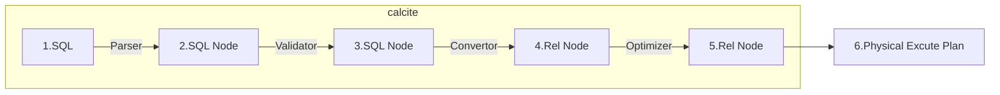
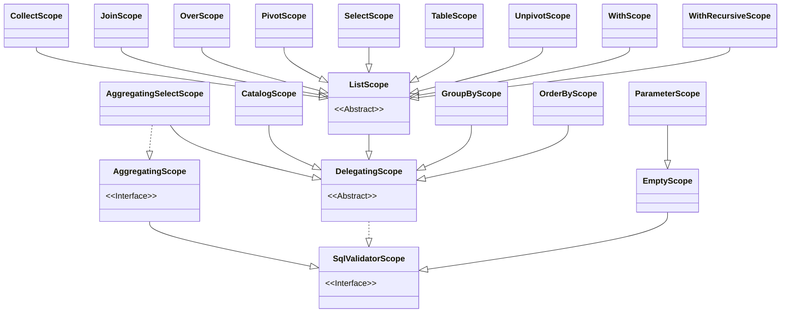
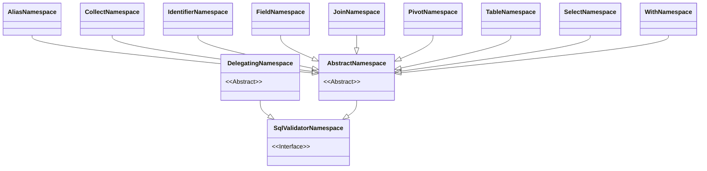

# Apache Calcite: SQL验证


本文主要介绍Calcite 中的SQL Validator。Calcite 通过 SQL 校验器实现 SQL 绑定，SQL 校验器所需的 Catalog 信息，在[深入理解 Apache Calcite Catalog](/post/f2cd8cb8/) 中已经做了详细的介绍。

> SQL 绑定主要的作用是将 SQL 解析生成的 AST 和数据库的元数据进行绑定，从而生成具有语义的 AST。SQL 绑定会通过自底向上的方式遍历 AST，对抽象语法树中的节点进行绑定分析，绑定的过程中会将表、列等元数据附在语法树上，最后生成具有语义的语法树 Bounded AST。

<!--more-->



## Validator

SQL 校验器的核心类为 SqlValidator，它负责使用 Calcite 元数据信息对 AST 进行验证，最终生成具有语义信息的 AST。除了 SqlValidator 校验器类之外，Calcite 为了将 SQL 中的名称解析为对象，还在校验器内部构建了两个对象：SqlValidatorScope 和 SqlValidatorNamespace。

- SqlValidatorScope 表示名称解析的范围，代表了在查询中的某一个位置，当前可见的字段名和表名。
- SqlValidatorNamespace 则表示了校验过程中查询语句的数据来源，不同的查询位置都有不同类型的 namespace 类，例如：表名对应的 IdentifierNamespace，Select 语句对应的 SelectNamespace，以及 UNION、EXCEPT、INTERSECT 对应的 SetopNamespace。

### SqlValidator

```mermaid
classDiagram
    class SqlValidator {
        &lt;&lt;Interface>>
        + getCatalogReader() SqlValidatorCatalogReader
    }
    class SqlValidatorCatalogReader{
        &lt;&lt;Interface>>
        + getTable(List~String~ names) SqlValidatorTable
        + getNamedType(SqlIdentifier typeName) RelDataType
        + getRootSchema() CalciteSchema
        + getConfig() CalciteConnectionConfig
        + nameMatcher() SqlNameMatcher
        + createTypeFromProjection(RelDataType type,List~String~ columnNameList) RelDataType
        + getAllSchemaObjectNames(List~String~ names) List~SqlMoniker~
    }
    class SqlOperatorTable{
        &lt;&lt;Interface>>
        + lookupOperatorOverloads(SqlIdentifier opName,SqlFunctionCategory category,SqlSyntax syntax,List~SqlOperator~ operatorList,SqlNameMatcher nameMatcher)
        + getOperatorList()  List~SqlOperator~
        + ... ...()
    }
    class RelDataTypeFactory{
        &lt;&lt;Interface>>
        + getTypeSystem() RelDataTypeSystem
        + createJavaType(Class clazz) RelDataType
        + createJoinType(RelDataType... types) RelDataType
        + createStructType(StructKind kind, List~RelDataType~ typeList,List~String~ fieldNameList) RelDataType
        + createStructType(List~RelDataType~ typeList,List~String~ fieldNameList) RelDataType
        + createArrayType(RelDataType elementType,long maxCardinality) RelDataType
        + createMapType(RelDataType keyType, RelDataType valueType) RelDataType
        + ... ... ()
    }
    class SqlValidatorImpl{
        - SqlValidatorCatalogReader catalogReader
        - SqlOperatorTable opTab
        - RelDataTypeFactory typeFactory 
        - SqlValidator.Config config
        - TypeCoercion typeCoercion
    }
    class SqlValidator.Config{
        &lt;&lt;Interface>>
    }
    SqlValidatorImpl --|> SqlValidator
    SqlValidatorImpl o-- SqlValidator.Config
    SqlValidatorImpl o-- RelDataTypeFactory
    SqlValidatorImpl o-- SqlValidatorCatalogReader
    SqlValidatorImpl o-- SqlOperatorTable
    class Prepare.CatalogReader{
        &lt;&lt;Interface>>
    }
    class CalciteCatalogReader{
        # CalciteSchema rootSchema
        # RelDataTypeFactory typeFactory
        # CalciteConnectionConfig config
    }
    Prepare.CatalogReader --|> SqlValidatorCatalogReader
    Prepare.CatalogReader --|> SqlOperatorTable
    CalciteCatalogReader --|> Prepare.CatalogReader
    class ChainedSqlOperatorTable{
        # List~SqlOperatorTable~ tableList
    }
    ChainedSqlOperatorTable --|> SqlOperatorTable
    class SqlStdOperatorTable
    SqlStdOperatorTable --|> SqlOperatorTable
    class RelDataTypeFactoryImpl{
        &lt;&lt;Abstract>>
    }
    class SqlTypeFactoryImpl
    class JavaTypeFactoryImpl
    class JavaTypeFactory{
        &lt;&lt;Interface>>
    }
    JavaTypeFactory --|> RelDataTypeFactory
    RelDataTypeFactoryImpl --|> RelDataTypeFactory
    SqlTypeFactoryImpl --|> RelDataTypeFactoryImpl
    JavaTypeFactoryImpl --|> SqlTypeFactoryImpl
    JavaTypeFactoryImpl --|> JavaTypeFactory
```



SqlValidatorImpl 是 SqlValidator的默认实现类。SqlValidatorImpl初始化方法`SqlValidatorImpl(SqlOperatorTable opTab,SqlValidatorCatalogReader catalogReader,RelDataTypeFactory typeFactory,Config config)`依赖了 4 个组件:

- SqlOperatorTable: 用来定义查找SQL算子（SqlOperator）和函数的接口。
- SqlValidatorCatalogReader: 用来给SqlValidator提供目录（Catalog）信息，也就是获得表、类型和Schema信息，它的实现类为CalciteCatalogReader。
- RelDataTypeFactory: 是处理数据类型的工厂类，它负责SQL类型、Java类型和集合类型的创建和转化。针对不同的接口形式，Calcite支持SQL和Java两种实现(SqlTypeFactoryImpl和JavaTypeFactoryImpl)。
- SqlValidator.Config: SqlValidator的配置信息，比如是否允许类型隐式转换、是否展开选择的列，等等。

此外, SqlValidatorImpl在初始化时，还会创建 TypeCoercion 类型转换类，它主要用于 SQL 中可能存在的隐式类型转换^[类型兼容部分后面会单独介绍]。

### SqlValidatorScope

在通用编程语言中都有作用域的概念, 只能使用当前作用域或父作用域内的函数或变量, 例如函数是一个作用域, 函数内部只能使用函数内定义的局部变量, 或定义在全局作用域内的全局变量或函数, 但是不能使用定义在其他函数内部的局部变量. SQL语言中同样有作用域, 在Calcite中称为Scope。

Calcite内的作用域（SqlValidatorScope）指SQL每个子查询的解析范围，可以是解析树中的任何位置或者任何含有列的节点。Calcite 根据不同的 SQL 类型实现了众多 SqlValidatorScope 子类，以满足不同场景下的 SQL 校验需求。下图展示了SqlValidatorScope的常见子类:



SelectScope 表示查询语句的名称解析范围，该范围中可见的对象包含了 FROM 子句的对象以及从父节点继承的对象。如下展示了一个常见的查询语句，该语句中包含了关联查询、子查询以及排序。

```sql
SELECT expr1
  FROM t1,
      t2,
      (SELECT expr2 FROM t3) AS q3
  WHERE c1 IN (SELECT expr3 FROM t4)
  ORDER BY expr4
```

Calcite 会将该语句拆分为 4 个 SelectScope 分别表示不同表达式对象的可见范围。

- expr1 可以访问 t1, t2, q3 中的对象；也就是说expr1只能使用t1, t2, q3中存在的列名.
- expr2 可以访问 t3 中的对象；
- expr3 可以访问 t4 中的对象
- expr4 可以访问 t1, t2, q3, 以及在 SELECT 子句中定义的任何列别名。

### SqlValidatorNamespace

SqlValidatorNamespace 代表查询中的一个命名空间（Namespace），用于管理该命名空间内的可见列和类型信息。例如：在查询`SELECT emp.deptno, age FROM emp, dept`时，FROM 子句形成了一个包含 emp 和 dept 两张表，以及这些表中列组成的行类型在内的命名空间。不同的 RelNode 类型有与之对应的 Namespace 对象，下图展示了 Calcite 中定义的常见 SqlValidatorNamespace 实现类。



SelectNamespace 表示了查询语句对应的命名空间，我们同样以如下的查询语句为例：

```sql
SELECT expr1
  FROM t1,
      t2,
      (SELECT expr2 FROM t3) AS q3
  WHERE c1 IN (SELECT expr3 FROM t4)
  ORDER BY expr4
```

Calcite 会从查询语句中提取出 4 个命名空间，分别如下所示，命名空间代表的关系，简单理解可以认为是查询过程中的数据来源。

- t1：t1 表所代表的关系；
- t2：t2 表所代表的关系；
- (SELECT expr2 FROM t3) AS q3：子查询所代表的关系；
- (SELECT expr3 FROM t4)：子查询所代表的关系。


## 校验示例

SqlValidator的构造和使用过程见[validator示例](https://github.com/chutian0610/calcite-demos/blob/master/tutorials/tutorial02/src/test/java/info/victorchu/calcite/tutorial02/validator/SqlValidatorTest.java)。

对于 sql `select * from mysql.customer limit 10`,在 Validate 前 SqlNode 结构如下。

```
#SqlCall: type=SqlOrderBy
  #SqlCall: type=SqlSelect
    #SqlNodeList: nodeList=[*]
      #SqlIdentifier: name=*
    #SqlIdentifier: name=mysql.customer
  #SqlLiteral: type=DECIMAL value=10
```

Validate 后 SqlNode 结构发生了变化:

```
#SqlCall: type=SqlOrderBy
  #SqlCall: type=SqlSelect
    #SqlNodeList: nodeList=[customer.c_custkey,customer.c_name,customer.c_address,customer.c_nationkey,customer.c_phone,customer.c_acctbal,customer.c_mktsegment,customer.c_comment]
      #SqlIdentifier: name=customer.c_custkey
      #SqlIdentifier: name=customer.c_name
      #SqlIdentifier: name=customer.c_address
      #SqlIdentifier: name=customer.c_nationkey
      #SqlIdentifier: name=customer.c_phone
      #SqlIdentifier: name=customer.c_acctbal
      #SqlIdentifier: name=customer.c_mktsegment
      #SqlIdentifier: name=customer.c_comment
    #SqlCall: type=SqlBasicCall
      #SqlIdentifier: name=mysql.customer
      #SqlIdentifier: name=customer
    #SqlLiteral: type=DECIMAL value=10
  #SqlLiteral: type=DECIMAL value=10
```

可以看到原先的`*`已经被替换为`customer`表中的所有字段。此外，SqlValidator 也完成了涉及表的校验，例如表是否存在，字段是否正确，字段类型是否合法等等。


## Validate 流程

接下来我们深入源码了解下 Validate 的流程。

### 入口方法

Validate的入口是`org.apache.calcite.sql.validate.SqlValidatorImpl#validate()`方法

```java
@Override public SqlNode validate(SqlNode topNode) {
    SqlValidatorScope scope = new EmptyScope(this);
    scope = new CatalogScope(scope, ImmutableList.of("CATALOG"));
    final SqlNode topNode2 = validateScopedExpression(topNode, scope);
    final RelDataType type = getValidatedNodeType(topNode2);
    Util.discard(type);
    return topNode2;
}
```

- 首先会创建用于 root 节点校验的 EmptyScope，并将 EmptyScope 作为 CatalogScope 的父类，CatalogScope 可以查看所有 Schema 中的元数据，在校验过程中能够帮助对 `schema.table.column` 进行列解析。
- 然后会调用 validateScopedExpression 进行校验，这部分是 SQL 校验器的核心逻辑。内部依次调用了 performUnconditionalRewrites、registerQuery 和 validate 方法，我们将对这些方法内部实现细节进行深入探究。

```java
private SqlNode validateScopedExpression(SqlNode topNode, SqlValidatorScope scope) {
  	// 重写 SqlNode 进行标准化，以方便后续的逻辑计划优化
    SqlNode outermostNode = performUnconditionalRewrites(topNode, false);
    cursorSet.add(outermostNode);
    top = outermostNode;
    if (outermostNode.isA(SqlKind.TOP_LEVEL)) {
      	// 注册 Scope 和 Namespace
        registerQuery(scope, null, outermostNode, outermostNode, null, false);
    }
  	// 校验 SqlNode
    outermostNode.validate(this, scope);
    if (!outermostNode.isA(SqlKind.TOP_LEVEL)) {
        // 推断类型
        deriveType(scope, outermostNode);
    }
    return outermostNode;
}
```

### performUnconditionalRewrites

performUnconditionalRewrites 主要用于 SqlNode 重写标准化，从而方便后续的逻辑计划优化

- performUnconditionalRewrites 首先会对 SqlNodeList和SqlCall类型的节点，递归处理其内部的Operand.
    - 特别是如果当前节点是 SqlUnresolvedFunction类型，会尝试从 SqlOperatorTable 中查找函数，并重新设置运算符。注意，此处是一个提前尝试，没有找到对应函数的SqlUnresolvedFunction会在后面对函数校验时，进行最终的转换(包含了类型兼容等问题的处理)。
- 然后根据节点自身类型对自身作一些变换。performUnconditionalRewrites 主要会将如下的非标准 SqlNode 转换为标准的 SqlNode，具体包括：VALUES、ORDER_BY、EXPLICIT_TABLE、DELETE、UPDATE 和 MERGE。VALUES 改写由于在类似 `FROM (VALUES(...)) [ AS alias ]`场景中存在问题，目前已经不进行改写。
    - SqlOrderBy会将排序和 limit 下推到内部的查询(SqlSelect 或 SqlWith)。
    - EXPLICIT_TABLE 则会将 将 Table t 子句改写为 SELECT * FROM t 语句。
    - DELETE 和 UPDATE 会根据条件改写生成 SqlSelect，代表了删除和更新语句所需要删除和更新的数据。
    - MERGE 改写会将 SqlMerge 改写为 SqlUpdate 或 SqlInsert，以复用 SqlUpdate 和 SqlInsert 的处理逻辑。

### registerQuery

在对 SqlNode 重写后，Calcite 会调用 registerQuery 方法生成 SqlValidatorScope 和 SqlValidatorNamespace 对象。

在调用 registerQuery 方法前，Calcite 会判断当前的 SqlNode 是否为顶层节点，SqlKind 类中定义的顶层节点包含了 QUERY、DML 和 DDL 3类。

```java
public static final EnumSet<SqlKind> TOP_LEVEL = concat(QUERY, DML, DDL);

public static final EnumSet<SqlKind> QUERY =
    EnumSet.of(SELECT, UNION, INTERSECT, EXCEPT, VALUES, WITH, ORDER_BY,
        EXPLICIT_TABLE);
```

判断 SqlNode 为顶层节点后， 会继续调用 registerQuery 方法并传入参数。

```java
/**
 * Registers a query in a parent scope.

 * @param usingScope  Scope whose child list this scope should add itself to
 * @param node        Query node
 * @param alias       Name of this query within its parent. Must be specified
 *                    if usingScope != null
 * @param checkUpdate if true, validate that the update feature is supported
 *                    if validating the update statement
 */
private void registerQuery(
    SqlValidatorScope parentScope,
    @Nullable SqlValidatorScope usingScope,
    SqlNode node,
    SqlNode enclosingNode,
    @Nullable String alias,
    boolean forceNullable,
    boolean checkUpdate){
    ... ...
    }
```

- parentScope 表示当前 SqlNode 的父名称解析范围，顶层节点的 parentScope 为 CatalogScope（CatalogScope 可以查看所有 Schema 中的元数据，它的父类是 EmptyScope）
- usingScope 将会添加当前 Scope 为需要使用的子Scope。
- node 表示当前的 SqlNode
- enclosingNode 和 node 通常是相同的，enclosingNode 通常表示 FROM 子句最顶层的节点 ，可以从 enclosingNode 中获取别名等信息
- alias 表当前查询在父查询中的名称，如果 usingScope 不为空则必须指定 alias。

registerQuery 方法内部会根据 SqlKind 进行判断，对不同类型的 SQL 进行处理,接下来以SELECT 语句为例展开介绍:

```java
case SELECT:
    // 首先会创建 SelectNamespace 对象
    final SqlSelect select = (SqlSelect) node;
    // 然后调用 registerNamespace 方法，将 SelectNamespace 记录在 namespaces(`<SqlNode, SqlValidatorNamespace>`)中。
    // 如果 usingScope 不为 null，则将当前 SelectNamespace 注册为 usingScope 的子节点。
    final SelectNamespace selectNs =
        createSelectNamespace(select, enclosingNode);
    registerNamespace(usingScope, alias, selectNs, forceNullable);
    final SqlValidatorScope windowParentScope =
        first(usingScope, parentScope);
    // 创建 SelectScope，并将其记录到全局的 scopes 中，scopes 的结构为 `<SqlNode, SqlValidatorScope>`
    SelectScope selectScope =
        new SelectScope(parentScope, windowParentScope, select);
    scopes.put(select, selectScope);
    // 处理 Select 的不同子句
```

然后 会对Select 的各个不同的子句进行注册:

- 首先会从 WHERE 语句开始，并将 WHERE 对应的 Scope 存储到 clauseScopes
- 再调用 registerOperandSubQueries 注册 WHERE 运算符中的子查询
- 最终整个方法会将 SELECT 语句中的 Projection、From、Where、Order By、Group By、Having 等子句都进行注册，生成对应的 Scope 和 Namespace 对象。

> 在对应的子句的registerXXX方法中会，递归处理其内部节点。

registerQuery 执行完成后，注册的信息会存储在 SqlValidatorImpl 对象中，分别包括了 scopes、clauseScopes 和 namespaces。

- scopes 对象用于存储查询节点和它们对应的 SqlValidatorScope 之间的映射- clauseScopes 对象则用于存储子句和 SqlValidatorScope 之间的映射，用于表示当前子句可见的范围。
- namespaces 代表了数据来源，例如表数据源，子查询数据源。

> [TestCase](https://github.com/chutian0610/calcite-demos/blob/master/tutorials/tutorial02/src/test/java/info/victorchu/calcite/tutorial02/validator/SqlValidatorTest.java)中的`testQuery03()` 就展示了sql中scopes和namespaces之间的关系。

### validate

完成 registerQuery 后，Validator中已经包含了校验所需的Scope 和 Namespace。接下来就是基于前面准备的信息，对查询语句进行校验。Validator首先会调用 `SqlNode#validate`方法，该方法在不同的 SqlNode 中具有不同的实现。接下来以 SqlSelect 为例展开介绍。

```java
// SqlSelect#validate 实现
@Override
public void validate(SqlValidator validator, SqlValidatorScope scope) {
    validator.validateQuery(this, scope, validator.getUnknownType());
}
```

`SqlSelect#validate` 方法会调用校验器的 validateQuery 方法，validateQuery 中核心的处理逻辑为 `validateNamespace` 和 `validateAccess`，分别校验 Namespace 以及对表的访问。

```java
@Override
public void validateQuery(SqlNode node, SqlValidatorScope scope, RelDataType targetRowType) {
    ...
    // 校验 Namespace
    validateNamespace(ns, targetRowType);
    switch (node.getKind()) {
        case EXTEND:
            // Until we have a dedicated namespace for EXTEND
            deriveType(requireNonNull(scope, "scope"), node);
            break;
        default:
            break;
    }
    if (node == top) {
        validateModality(node);
    }
    // 校验对表的访问
    validateAccess(node, ns.getTable(), SqlAccessEnum.SELECT);
    validateSnapshot(node, scope, ns);
}
```

#### validateNamespace

validateNamespace 方法内部会调用 SqlValidatorNamespace#validate 方法，然后设置校验后的节点类型。

```java
protected void validateNamespace(final SqlValidatorNamespace namespace,
      RelDataType targetRowType) {
    namespace.validate(targetRowType);
    final SqlNode node = namespace.getNode();
    if (node != null) {
      RelDataType type = namespace.getType();
      ... ...
      setValidatedNodeType(node, type);
    }
  }
```

SqlSelect对应的 Namespace 是 SelectNamespace。SelectNamespace的 validate方法继承自父类。实际上validate中会调用子类的`validateImpl`方法。

```java
// org.apache.calcite.sql.validate.AbstractNamespace
// status字段可以判断当前 Scope 是否在被验证中. 用于检查循环依赖
@Override public final void validate(RelDataType targetRowType) {
    switch (status) {
    case UNVALIDATED:
      try {
        status = SqlValidatorImpl.Status.IN_PROGRESS;
        checkArgument(rowType == null,
            "Namespace.rowType must be null before validate has been called");
        RelDataType type = validateImpl(targetRowType);
        requireNonNull(type, "validateImpl() returned null");
        setType(type);
      } finally {
        status = SqlValidatorImpl.Status.VALID;
      }
      break;
    case IN_PROGRESS:
      throw new AssertionError("Cycle detected during type-checking");
    case VALID:
      break;
    default:
      throw Util.unexpected(status);
    }
}
// 如果 status 为 UNVALIDATED 状态，则会调用 validateImpl 方法.也就是AbstractNamespace实现类的逻辑。
// org.apache.calcite.sql.validate.SelectNamespace
@Override public RelDataType validateImpl(RelDataType targetRowType) {
    validator.validateSelect(select, targetRowType);
    return requireNonNull(rowType, "rowType");
}
```

`SelectNamespace#validateImpl` 内部则会调用 `validator.validateSelect` 方法，`SqlValidatorImpl#validateSelect` 方法内会依次调用:
- `validateFrom`: 校验数据源
- `validateWhereClause`: 校验过滤条件
- `validateGroupClause`: 校验分组
- `validateHavingClause`: 校验Having条件
- `validateWindowClause`: 校验窗口函数
- `validateQualifyClause`: 校验窗口函数计算后过滤条件
- `validateSelectList`: 校验查询列
- `validateOrderList`: 校验排序

```java
protected void validateSelect(SqlSelect select, RelDataType targetRowType) {
    // Namespace is either a select namespace or a wrapper around one.
    final SelectNamespace ns = getNamespaceOrThrow(select).unwrap(SelectNamespace.class);
    // 获取 Select 语句中的投影列表
    final SqlNodeList selectItems = SqlNonNullableAccessors.getSelectList(select);
    RelDataType fromType = unknownType;
    ...
    // Make sure that items in FROM clause have distinct aliases.
    final SelectScope fromScope = (SelectScope) getFromScope(select);
    ...
    if (select.getFrom() == null) {
        if (this.config.conformance().isFromRequired()) {
            throw newValidationError(select, RESOURCE.selectMissingFrom());
        }
    } else {
        validateFrom(select.getFrom(), fromType, fromScope);
    }
    validateWhereClause(select);
    validateGroupClause(select);
    validateHavingClause(select);
    validateWindowClause(select);
    validateQualifyClause(select);
    handleOffsetFetch(select.getOffset(), select.getFetch());
    
    // Validate the SELECT clause late, because a select item might
    // depend on the GROUP BY list, or the window function might reference
    // window name in the WINDOW clause etc.
    final RelDataType rowType = validateSelectList(selectItems, select, targetRowType);
    ns.setType(rowType);
    
    // Validate ORDER BY after we have set ns.rowType because in some
    // dialects you can refer to columns of the select list, e.g.
    // "SELECT empno AS x FROM emp ORDER BY x"
    validateOrderList(select);
    ...
}
```

##### validateFrom

validateFrom 方法会根据不同的数据源类型来分发到不同的方法。

```java
protected void validateFrom(
      SqlNode node,
      RelDataType targetRowType,
      SqlValidatorScope scope) {
    requireNonNull(scope, "scope");
    requireNonNull(targetRowType, "targetRowType");
    switch (node.getKind()) {
    case AS:
    case TABLE_REF:
      validateFrom(
          ((SqlCall) node).operand(0),
          targetRowType,
          scope);
      break;
    case VALUES:
      validateValues((SqlCall) node, targetRowType, scope);
      break;
    case JOIN:
      validateJoin((SqlJoin) node, scope);
      break;
    case OVER:
      validateOver((SqlCall) node, scope);
      break;
    case UNNEST:
      validateUnnest((SqlCall) node, scope, targetRowType);
      break;
    case COLLECTION_TABLE:
      validateTableFunction((SqlCall) node, scope, targetRowType);
      break;
    default:
      validateQuery(node, scope, targetRowType);
      break;
    }

    // Validate the namespace representation of the node, just in case the
    // validation did not occur implicitly.
    getNamespaceOrThrow(node, scope).validate(targetRowType);
  }
```

当 From 的节点是 SqlTableRef时，会转为对内部的SqlIdentifier(表名)进行验证。对应的 Namespace 为 IdentifierNamespace，执行 validateFrom 时内部会调用 IdentifierNamespace#validateImpl 方法，该方法内部实现逻辑如下。

```java
@Override
public RelDataType validateImpl(RelDataType targetRowType) {
    // 从元数据中解析表名，并组装为 TableNamespace
    resolvedNamespace = resolveImpl(id);
    if (resolvedNamespace instanceof TableNamespace) {
        // 从 TableNamespace 中获取 table
        SqlValidatorTable table = ((TableNamespace) resolvedNamespace).getTable();
        // 判断是否需要将 identifier 展开为全限定名称
        if (validator.config().identifierExpansion()) {
            // TODO:  expand qualifiers for column references also
            List<String> qualifiedNames = table.getQualifiedName();
            if (qualifiedNames != null) {
                // Assign positions to the components of the fully-qualified
                // identifier, as best we can. We assume that qualification
                // adds names to the front, e.g. FOO.BAR becomes BAZ.FOO.BAR.
                List<SqlParserPos> poses = new ArrayList<>(Collections.nCopies(qualifiedNames.size(), id.getParserPosition()));
                int offset = qualifiedNames.size() - id.names.size();
                
                // Test offset in case catalog supports fewer qualifiers than catalog reader.
                if (offset >= 0) {
                    for (int i = 0; i < id.names.size(); i++) {
                        poses.set(i + offset, id.getComponentParserPosition(i));
                    }
                }
                id.setNames(qualifiedNames, poses);
            }
        }
    }
    
    RelDataType rowType = resolvedNamespace.getRowType();
    ...
    return rowType;
}
```

resolveImpl 方法会根据 id 从元数据中解析出表名，并封装为 TableNamespace 对象。对象中包含了从元数据中获取的 table 对象。然后会判断是否需要将 identifier 展开为全限定名称。

##### validateSelectList

再来看下 Select 投影列校验逻辑，首先会遍历 SELECT 投影列.

- 如果投影列仍然是一个子查询，则会调用 handleScalarSubQuery 处理标量子查询，判断是否符合标量子查询的规范。
- 否则会调用 expandSelectItem 方法展开投影列，将 column 展开为 tbl.column, expandSelectItem 方法也可以将星号展开为全部列。展开后的投影列 newSelectList 会分别设置到 select 节点和 selectScope 中，方便后续校验继续使用。

```java
protected RelDataType validateSelectList(final SqlNodeList selectItems, SqlSelect select, RelDataType targetRowType) {
    // Validate SELECT list. Expand terms of the form "*" or "TABLE.*".
    final SqlValidatorScope selectScope = getSelectScope(select);
    final List<SqlNode> expandedSelectItems = new ArrayList<>();
    final Set<String> aliases = new HashSet<>();
    final PairList<String, RelDataType> fieldList = PairList.of();
    // 遍历 selectItems 投影列，如果是 SqlSelect 则处理标量子查询
    for (SqlNode selectItem : selectItems) {
        if (selectItem instanceof SqlSelect) {
            handleScalarSubQuery(select, (SqlSelect) selectItem, expandedSelectItems, aliases, fieldList);
        } else {
            // Use the field list size to record the field index
            // because the select item may be a STAR(*), which could have been expanded.
            final int fieldIdx = fieldList.size();
            final RelDataType fieldType = targetRowType.isStruct() && targetRowType.getFieldCount() > fieldIdx ? targetRowType.getFieldList().get(fieldIdx).getType() : unknownType;
            // 展开投影列，将 NAME 展开为 EMPS.NAME
            expandSelectItem(selectItem, select, fieldType, expandedSelectItems, aliases, fieldList, false);
        }
    }
    
    // Create the new select list with expanded items.  Pass through
    // the original parser position so that any overall failures can
    // still reference the original input text.
    SqlNodeList newSelectList = new SqlNodeList(expandedSelectItems, selectItems.getParserPosition());
    if (config.identifierExpansion()) {
        // 将展开后的 newSelectList 设置到 select 中
        select.setSelectList(newSelectList);
    }
    // 将展开后的 newSelectList 设置到 selectScope 中
    getRawSelectScopeNonNull(select).setExpandedSelectList(expandedSelectItems);
    
    // TODO: when SELECT appears as a value sub-query, should be using
    // something other than unknownType for targetRowType
    inferUnknownTypes(targetRowType, selectScope, newSelectList);
    
    for (SqlNode selectItem : expandedSelectItems) {
        validateNoAggs(groupFinder, selectItem, "SELECT");
        validateExpr(selectItem, selectScope);
    }
    
    return typeFactory.createStructType(fieldList);
}
```

#### validateAccess

validateAccess 方法用于校验当前节点对表是否具有访问权限，node 参数表示当前节点，table 表示要访问的表，requiredAccess 则表示需要访问的类型。table.getAllowedAccess() 会从 RelOptTableImpl#getAllowedAccess 获取可访问类型，会返回全部类型，包括：SELECT、UPDATE、INSERT 和 DELETE，如果不具有访问权限，则抛出异常。

```java
/**
 * Validates access to a table.
 *
 * @param table Table
 * @param requiredAccess Access requested on table
 */
private void validateAccess(SqlNode node, @Nullable SqlValidatorTable table, SqlAccessEnum requiredAccess) {
    if (table != null) {
        // RelOptTableImpl#getAllowedAccess 返回全局访问类型，包括了 SELECT、UPDATE、INSERT 和 DELETE
        SqlAccessType access = table.getAllowedAccess();
        // 如果不具有访问权限，则抛出异常
        if (!access.allowsAccess(requiredAccess)) {
            throw newValidationError(node, RESOURCE.accessNotAllowed(requiredAccess.name(), table.getQualifiedName().toString()));
        }
    }
}

```

### 总结

完成校验后，返回的 SqlNode中:

-  Identifier 都进行了全限定名展开,可以很快速地获取到列对象所属的表，以及表对象所属的 Schema。
- 函数对象则会查找到 Calcite 内置的函数，或者用户在元数据中定义的函数。

这些校验后的对象将在后续 SqlNode 转换 RelNode 过程中发挥重要作用。

> deriveType 类型推断部分将会在独立的文章中介绍。

