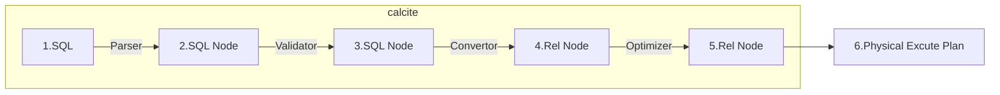
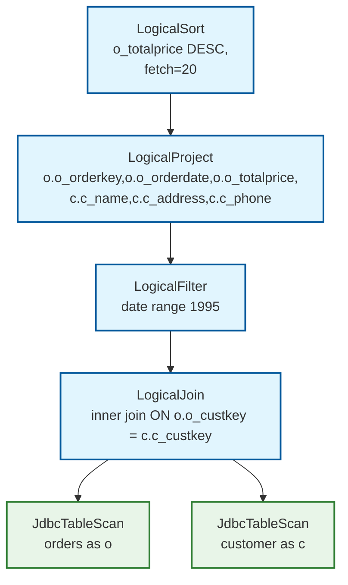
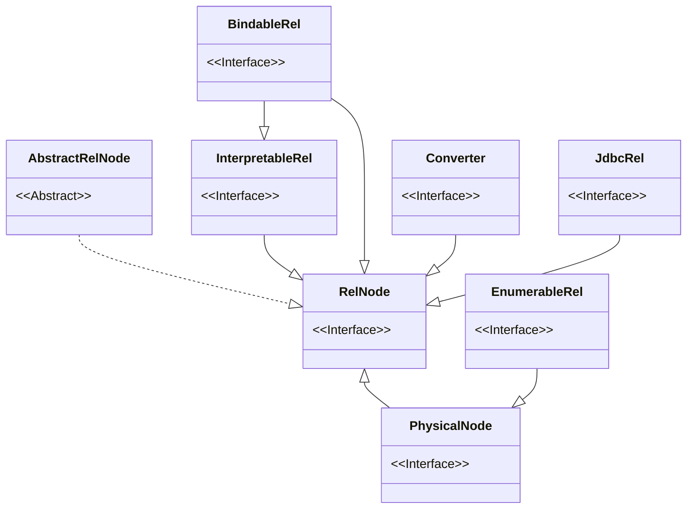
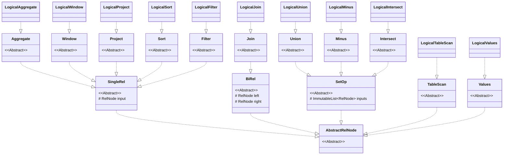

# Apache Calcite 关系代数



持续更新中...


本文主要介绍Calcite 中的AST转执行计划。关系代数最早由E. F. Codd在1970年的论文[A Relational Model of Data for Large Shared Data Banks](https://www.seas.upenn.edu/~zives/03f/cis550/codd.pdf)中提出, 是关系型数据库查询语言的基础, 也是查询优化技术的理论基础。 在Calcite内部, 会将SQL查询转化为一颗等价的关系算子树, 并在此基础上进行查询优化. 通用的关系代数理论可以参考之前的文章[形式化关系查询语言](/posts/9e3f23c9/), 接下来介绍在Calciate中的实现。

<!--more-->


## SQL to 关系代数

类似于编译器会首先将高级语言转化为中间表示(IR), 然后对IR进行优化, 最后转化为目标机器语言。Calcite会先将SQL语句解析为SqlNode AST树,之后Calcite会将SqlNode树转化为RelNode树(即Calcite中的IR)并进行查询优化。

我们可以通过SqlToRelConverter实现 SqlNode 转 RelNode。[代码实例](https://github.com/chutian0610/calcite-demos/blob/master/tutorials/tutorial02/src/test/java/info/victorchu/calcite/tutorial02/converter/RelNodeConverterTest.java)如下:

```java
// testCase - testQuery01
VolcanoPlanner planner = new VolcanoPlanner(RelOptCostImpl.FACTORY, Contexts.of(config));
planner.addRelTraitDef(ConventionTraitDef.INSTANCE);

RelOptCluster cluster = RelOptCluster.create(planner, new RexBuilder(typeFactory));
SqlToRelConverter.Config converterConfig = SqlToRelConverter.config()
        .withTrimUnusedFields(true)
        .withExpand(false)
        .withInSubQueryThreshold(0) // not convert in subquery to join
        ;
SqlToRelConverter converter = new SqlToRelConverter(null,
        sqlValidator,
        catalogReader,
        cluster,
        StandardConvertletTable.INSTANCE,
        converterConfig);
RelRoot root = converter.convertQuery(sqlNode, true, true);
log.info(RelOptUtil.toString(root.rel));  
```

以下面的 SQL 为例:

```sql
SELECT 
    o.o_orderkey,
    o.o_orderdate,
    o.o_totalprice,
    c.c_name,
    c.c_address,
    c.c_phone
FROM mysql.orders o
JOIN mysql.customer c ON o.o_custkey = c.c_custkey
WHERE o.o_orderdate >= '1995-01-01'
  AND o.o_orderdate < '1996-01-01'
ORDER BY o.o_totalprice DESC
LIMIT 20
```

对应的关系代数是:

```java
LogicalSort(sort0=[$2], dir0=[DESC], fetch=[20])
  LogicalProject(o_orderkey=[$0], o_orderdate=[$4], o_totalprice=[$3], c_name=[$10], c_address=[$11], c_phone=[$13])
    LogicalFilter(condition=[AND(>=($4, CAST('1995-01-01'):DATE NOT NULL), <($4, CAST('1996-01-01'):DATE NOT NULL))])
      LogicalJoin(condition=[=($1, $9)], joinType=[inner])
        JdbcTableScan(table=[[mysql, orders]])
        JdbcTableScan(table=[[mysql, customer]])
```

对应的逻辑计划如下图:



## 关系代数

接下来将详细介绍Calcite关系代数的实现。

### RelNode

RelNode是Calcite中关系算子(Relation Expression)的父类型, 代表了对关系的一种处理操作. 所有的关系算子都是它的子类型, 继承关系如下图所示(主要包含了几个顶层子类):




AbstractRelNode表达逻辑算子，与物理执行无关。Converter虽然也是RelNode的子类型, 但它实际上不代表一种关系运算, 而是不同RelNode之间的转换器。

Calcite 不仅支持逻辑计划生成，还支持物理计划生成，Calcite 的物理算子均继承自 RelNode:

- PhysicalNode 表示物理执行算子。对于大多数数据库系统，物理执行算子都是默认使用动态代码生成&编译方式执行。
- InterpretableRel 表示算子是通过解释器方式执行,所以实现该接口的都是物理算子。
- JdbcRel 表示算子是通过生成 SQL语句，然后提交到外部数据库方式执行，所以实现该接口的都是物理算子。

物理算子和 Converter 均会在后面的文章中详细介绍。本文主要关注逻辑算子。

#### AbstractRelNode

AbstractRelNode是逻辑算子的父类。



- SingleRel是一元算子的父类型, 其子类型包含常见的Project, Filter, Aggregate等。
- BiRel是Join算子的父类型。
- SetOp是集合算子的父类型, 其子类型包含Union, Intersect, Minus。

常见的逻辑算子如下:

|逻辑算子|描述|
|---|---|
|LogicalFilter|迭代其输入并返回条件为true的元素。对应 sql 中的 where，having 等部分。|
|LogicalTableScan|返回表中所有的行|
|LogicalValues|代表多行数据(0行或多行)|
|LogicalAggregate|用于消除重复项并计算总数，对应 sql 中的 groupby部分 和select 中的聚合函数|
|LogicalWindow|一组窗口聚合的关系算子。|
|LogicalProject|从其输入的关系算子中计算一组“选择列”，对应 sql 中select 标量部分。|
|LogicalSort|对其输入施加特定排序顺序而不更改其内容的关系算子。|
|LogicalJoin|根据某种条件组合两个关系算子的算子。|
|LogicalUnion|返回其输入的行并集的关系算子，可选地消除重复项。对应 SQL 中的 Union|
|LogicalMinus|返回其第一个输入的行减去其他输入的任何匹配行的关系算子。对应SQL 中的EXCEPT|
|LogicalIntersect|返回其输入行相交的关系算子。|

#### RelNode 方法

下面来看下RelNode的一些方法和生态类型。


## 转换逻辑

