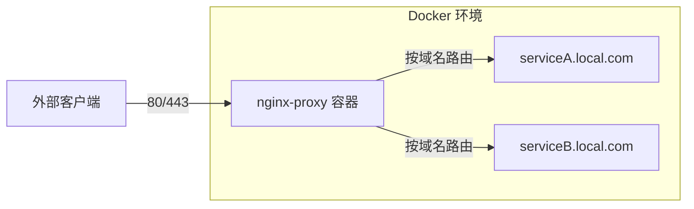
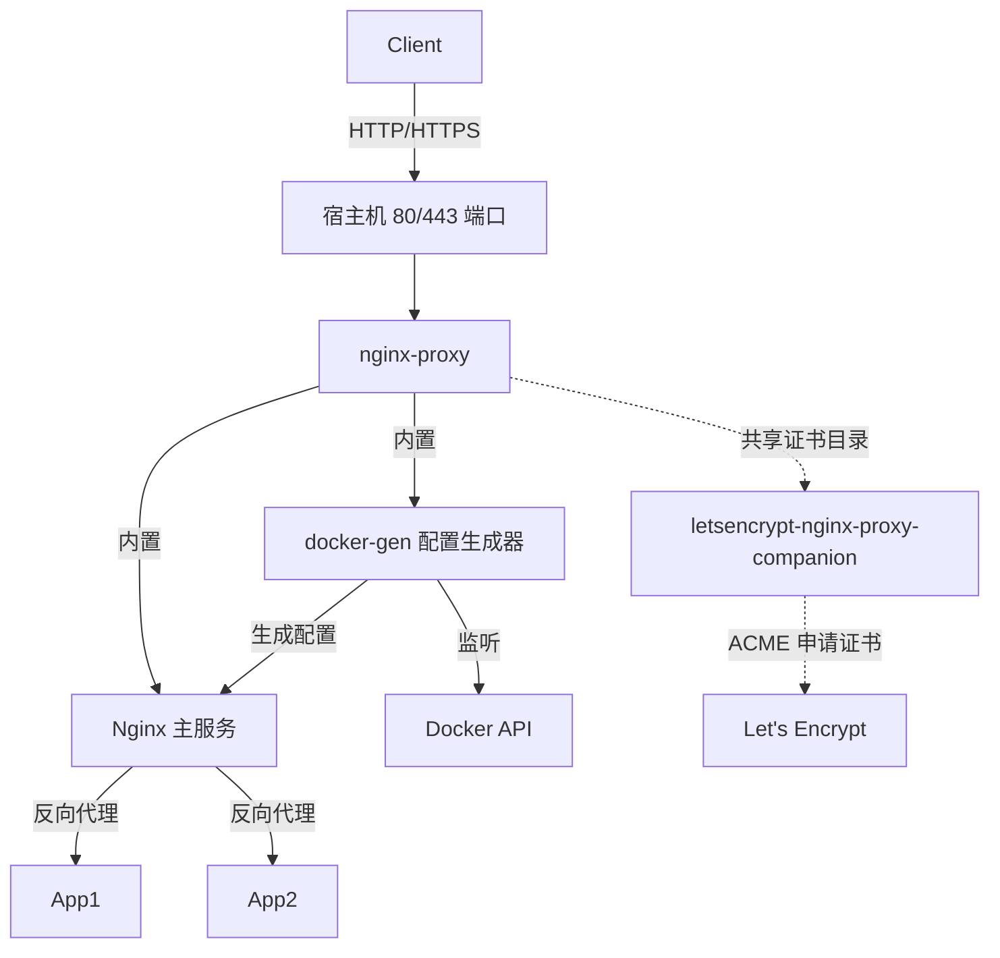
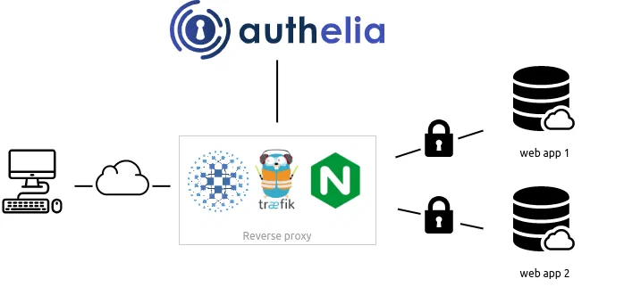

# Self-Host 服务暴露公网：我用三招守住安全底线


搬家后，Self-Host 服务无法通过公网 IPv4 访问，只能用 IPv6 + DDNS 方案。但家里路由器不支持精细的 IPv6 访问管理，开着防火墙会影响服务，关闭防火墙又等于裸奔。

最终通过三招解决了问题：反向代理隔离、登录增强、FRP 流量转发。

<!--more-->

## 方案概览

目标很明确：在尽量不暴露端口的前提下，让外部能访问服务。

核心思路是分层防御：
1. 所有流量先到反向代理，不直接暴露后端服务
2. 对没有认证或认证薄弱的服务，增加 Authelia 二次验证
3. 通过 FRP 将 IPv4 流量转发到家庭网络，覆盖不支持 IPv6 的网络

## 第一招：nginx-proxy 统一入口

### 核心思路

让所有 Self-Hosted 服务共享一个反向代理，域名路由 + 自动 HTTPS。容器端口不绑定宿主机，从外部无法直连服务端口。



nginx-proxy 还支持自动检测 Docker 容器标签，以及通过 letsencrypt-nginx-proxy-companion 自动申请 SSL 证书。

### docker-gen 工作原理

nginx-proxy 容器内置了 docker-gen，它监听 Docker API，检测带有 `VIRTUAL_HOST` 环境变量的容器，自动生成 Nginx 配置并重载。



### 最小可运行示例

```yaml
services:
  nginx-proxy:
    image: nginxproxy/nginx-proxy
    container_name: nginx-proxy
    ports:
      - "80:80"
      - "443:443"
    volumes:
      - /var/run/docker.sock:/tmp/docker.sock:ro
      - ./vhost.d:/etc/nginx/vhost.d:ro
      - ./certs:/etc/nginx/certs:ro
    networks:
      - proxy
    restart: always

  acme-companion:
    image: nginxproxy/acme-companion
    depends_on:
      - nginx-proxy
    volumes_from:
      - nginx-proxy
    volumes:
      - ./certs:/etc/nginx/certs:rw
    environment:
      - DEFAULT_EMAIL=your@email.com
    networks:
      - proxy
    restart: always

  whoami:
    image: traefik/whoami
    networks:
      - proxy
    environment:
      - VIRTUAL_HOST=whoami.victor.local
    restart: always

networks:
  proxy:
    name: proxy
```

## 第二招：Authelia 登录增强

### 什么时候需要

某些 Self-Hosted 服务不支持鉴权，或仅支持单因素认证（用户名 + 密码），没有防暴力破解。一旦公网暴露，安全性堪忧。

Authelia 可以为这些服务增加用户登录、防暴力破解等功能。

### 架构图



### 配置 Authelia

```yaml
# configuration.yml
server:
  address: "tcp://0.0.0.0:9091"

log:
  level: info

identity_validation:
  reset_password:
    jwt_secret: "替换为高强度随机字符串"

session:
  secret: "替换为高强度随机字符串"
  cookies:
    - domain: victor.local
      authelia_url: "https://auth.victor.local"
      default_redirection_url: "https://whoami.victor.local"
      expiration: 1h
      inactivity: 5m

storage:
  encryption_key: "替换为32字节随机字符串"
  local:
    path: /config/db.sqlite3

authentication_backend:
  file:
    path: /config/users_database.yml

access_control:
  default_policy: deny
  rules:
    - domain: auth.victor.local
      policy: bypass
    - domain:
        - victor.local
        - "*.victor.local"
      policy: one_factor

regulation:
  max_retries: 3
  find_time: 120
  ban_time: 300

notifier:
  filesystem:
    filename: /config/notifications.yml
```

生成高强度随机字符串：

```bash
openssl rand -base64 32
```

用户配置文件 `users_database.yml`：

```yaml
users:
  victor:
    disabled: false
    displayname: "Victor Chu"
    password: "用 Authelia 命令生成的 Argon2 哈希"
    email: xxx@xxx.com
    groups:
      - admins
      - dev
```

生成密码哈希：

```bash
docker run --rm authelia/authelia authelia crypto hash generate argon2 --password 'your_plain_password'
```

### 与 Nginx 集成

在 `vhost.d/whoami.victor.local` 添加认证端点配置：

```nginx
set $upstream_authelia http://authelia:9091/api/authz/auth-request;

location /internal/authelia/authz {
    internal;
    proxy_pass $upstream_authelia;

    proxy_set_header X-Original-Method $request_method;
    proxy_set_header X-Original-URL $scheme://$http_host$request_uri;
    proxy_set_header X-Forwarded-For $remote_addr;
    proxy_set_header Content-Length "";
    proxy_set_header Connection "";
    proxy_set_header Host $http_host;
    proxy_set_header X-Forwarded-Host $http_host;

    proxy_pass_request_body off;
    proxy_http_version 1.1;
    proxy_next_upstream error timeout invalid_header http_500 http_502 http_503;
}
```

在 `vhost.d/whoami.victor.local_location` 添加认证请求：

```nginx
proxy_set_header Host $http_host;
proxy_set_header X-Original-URL $scheme://$http_host$request_uri;
proxy_set_header X-Forwarded-Proto $scheme;
proxy_set_header X-Forwarded-Host $http_host;
proxy_set_header X-Forwarded-URI $request_uri;
proxy_set_header X-Forwarded-Ssl on;
proxy_set_header X-Forwarded-For $remote_addr;
proxy_set_header X-Real-IP $remote_addr;

real_ip_header X-Forwarded-For;
real_ip_recursive on;

auth_request /internal/authelia/authz;

auth_request_set $user $upstream_http_remote_user;
auth_request_set $groups $upstream_http_remote_groups;

proxy_set_header Remote-User $user;
proxy_set_header Remote-Groups $groups;

auth_request_set $redirection_url $upstream_http_location;
error_page 401 =302 $redirection_url;
```

如果需要支持 websocket，需要在 Location 文件中添加:

```
proxy_http_version 1.1;
proxy_set_header Upgrade $http_upgrade;
proxy_set_header Connection "upgrade";
```

## 第三招：FRP 流量转发

### 问题

公司网络不支持 IPv6，无法访问家里的服务。Tailscale 在跨协议时无法 P2P 直连，需要流量中转。

### VPS 部署 FRP 服务端

```toml
# frps.toml
bindPort = 7000

webServer.addr = "0.0.0.0"
webServer.port = 7500
webServer.user = "admin"
webServer.password = "your_secure_password"

auth.token = "your_secure_token"
```

```bash
docker run -d \
  --name frps \
  --restart always \
  --network host \
  -v ./frp:/etc/frp \
  snowdreamtech/frps
```

### 内网部署 FRP 客户端

```toml
# frpc.toml
serverAddr = "你的公网服务器IP"
serverPort = 7000
auth.token = "your_secure_token"

[web-443]
type = tcp
local_ip = 127.0.0.1
local_port = 443
remote_port = 443
```

```bash
docker run -d \
  --name frpc \
  --restart always \
  --network host \
  -v ./frp:/etc/frp \
  snowdreamtech/frpc
```

> 建议VPS选择轻量应用服务器，功网带宽无限制。

使用FRP后可以将路由的IPV6防火墙也打开。

## 总结

三招组合使用，基本覆盖了 Self-Hosted 服务暴露公网的主要安全场景：

| 方案 | 作用 | 复杂度 |
|------|------|--------|
| nginx-proxy | 统一入口 + 自动 HTTPS | 低 |
| Authelia | 登录增强 + 防暴力破解 | 中 |
| FRP | IPv4 到 IPv6 流量转发，可以打开 IPV6 防火墙 | 低 |

如果你的服务本来就有完善认证（如 LDAP/OIDC），Authelia 可以跳过。FRP 也可以替换成 WireGuard VPN，取决于你的网络环境。

