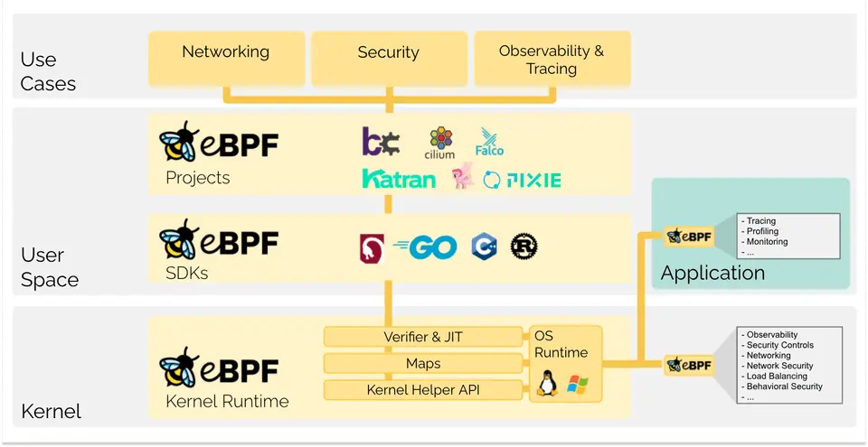
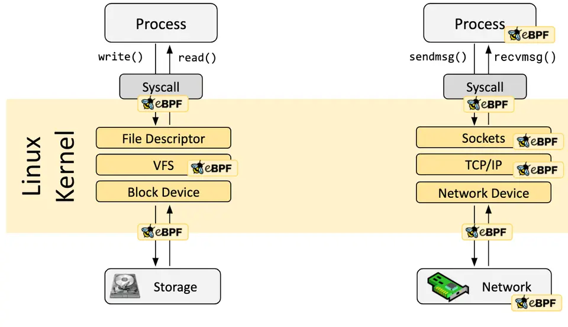
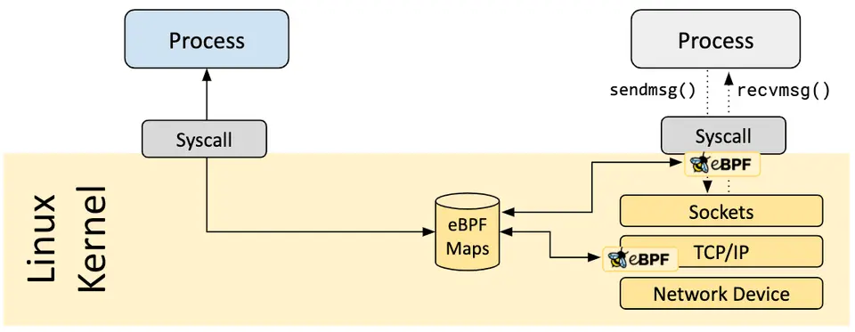
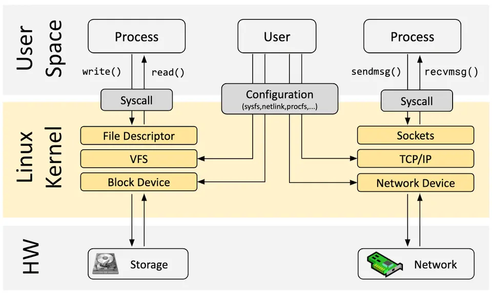
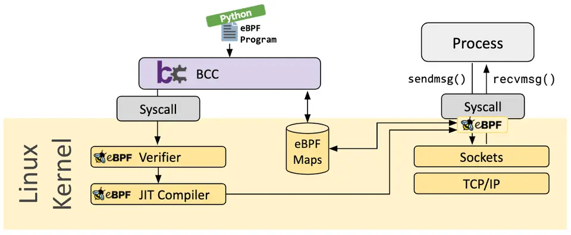
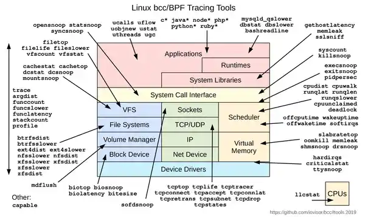

# eBPF 简介：从钩子、验证器到 BCC 实战


你有没有遇到过这种场景：线上服务偶发延迟，`top` 看 CPU 正常、`iostat` 看磁盘不忙、`strace` 抓不到关键调用，但应用就是慢。想看某个系统调用真实的耗时分布？想找"一闪而过"的短进程？传统工具集体失灵。

问题的根源在于：**Linux 内核对你"关着门"**。你想观测的所有关键路径——系统调用、网络收发、调度、文件 I/O——都在内核里，而你已经很多年没编译过内核了。

`eBPF`（extended Berkeley Packet Filter）就是 Linux 给开发者开的一扇窗。它让你**不重启内核、不写内核模块**，就能在内核的关键路径上跑一段自定义逻辑。本文用三件事讲清它：eBPF 是什么、怎么工作、怎么先用起来。

<!--more-->

## 什么是 eBPF

先把名字搞清楚。`BPF` 最早是 1992 年诞生的 **Berkeley Packet Filter**，顾名思义，最初就是用来过滤网络包的。2014 年，Alexei Starovoitov 大幅扩展了它，Linux 3.15 引入新版本——`eBPF`（extended BPF），**从此它能干的事远远不止包过滤**。现在 BPF 和 eBPF 两个词在社区里基本互通，老版本则被叫做 `cBPF`（classic BPF）以示区别。

至于 `eBPF` 的官方吉祥物 eBee（一只蜜蜂），纯粹是社区选出来的标志，与缩写本身无关——之所以今天还保留"BPF"三个字母，主要是因为 Linux 源码、工具链、文档里已经根深蒂固地使用着它。

那 eBPF 到底是什么？**一句话定义**：一种让用户编写的**沙箱程序**在内核特权上下文中安全运行的技术。

对比一下传统做法就更清楚。想给 Linux 内核加点新能力，过去基本只有两条路：

- **改内核源码**：发邮件给 LKML，运气好几年后合入主线，运气差被维护者打回。
- **写内核模块**：自己维护，**每次内核升级都可能编译不过**，还可能因为一个空指针直接搞挂整个系统。

eBPF 提供了**第三条路**：不改源码、不写模块，把一段程序以字节码的形式塞进内核，挂到指定钩子上。内核在加载前会做严格校验，加载后用 JIT 编译成本地指令——**性能接近原生内核代码**（多数 benchmark 显示在 5% 以内），**安全性由验证器兜底**。

正因为这个特性，eBPF 在过去几年催生了一波项目：

- **网络**：Cilium 用 XDP/eBPF 替代 iptables 做 Kubernetes 的 kube-proxy；
- **可观测性**：Brendan Gregg 的整套性能分析工具链几乎都跑在 eBPF 之上；
- **安全**：Falco、Tetragon 用 eBPF 做容器运行时的入侵检测。

需要强调的是：**eBPF 不是"替代内核开发"，而是给内核加了一层"可编程层"**。内核源码该写还得写，只是很多以前必须改内核才能做的事，现在用一段 eBPF 程序就能在用户态完成。

## eBPF 的工作原理

讲完"是什么"，我们看"怎么工作"。eBPF 看似神秘，拆开看其实就是五件套的协作：**钩子（Hook）**、**验证器（Verifier）**、**JIT 编译**、**Map**、**Helper 调用**。



这张图来自 [eBPF.io 官方文档](https://ebpf.io/what-is-ebpf/)，把五件套的关系画得很清楚。我们按数据流方向走一遍。

### 钩子：程序挂哪里

eBPF 是**事件驱动**的。程序平时不跑，**只有内核或应用程序经过某个钩子点时才被触发**。

钩子分两类：

- **预定义钩子**：系统调用（`sys_enter_*` / `sys_exit_*`）、函数入口/退出、网络事件（XDP、tc）、各种内核 tracepoint；
- **动态探针**：用 `kprobe` 探内核任意函数、`uprobe` 探用户态任意函数——理论上**内核或应用的几乎任何位置都能挂**。



这种"满天星"的钩子布局，正是 eBPF 能覆盖几乎所有可观测性场景的基础。

### 验证器：内核安全门

光能挂还不够。内核的特权地位决定了：**任何被加载进来的代码都必须证明"我不会搞坏系统"**。这就是验证器的工作。

加载一个 eBPF 程序时，验证器会做一系列静态检查：

- 程序**一定会运行到结束**（不允许死循环，但允许验证器能证明"有界"的循环）；
- **不能越界访问内存**，不允许用未初始化的变量；
- 程序**大小受限**，不能任意膨胀；
- **复杂度有上限**，验证器必须能在限定时间内分析完所有执行路径。

如果验证不通过，程序根本进不了内核。这也是 eBPF 能在生产环境被信任的根本原因——**不是"相信你不会写错"，而是"在加载前就证明了不会错"**。

验证通过后，还会再叠一层保护：内核把 eBPF 程序存放的内存设为**只读**，避免运行时被篡改；常量会被"盲化"（constant blinding）以防 JIT 喷射攻击；推测执行路径也有专门的 Spectre 缓解。

### JIT 编译：把字节码变成机器码

`eBPF` 程序加载时还是通用字节码，每次执行都解释跑，性能撑不住。内核会调用 **JIT（Just-in-Time）编译器** 把字节码翻译成目标 CPU 的本地指令。翻译完，**执行效率与手写内核代码几乎没有差距**。

这是 eBPF 能"上生产"的另一根支柱：沙箱安全归验证器，性能归 JIT，两者缺一不可。

### Map：eBPF 与用户态的桥梁

一个 eBPF 程序光自己跑没用，它**需要把数据交给用户态的工具来展示**，或者**和其他 eBPF 程序共享状态**。这个角色由 **Map** 承担。

Map 本质上是一组**键值数据结构**，支持哈希表、数组、LRU、环形缓冲区、栈、LPM 等多种类型；既可以从 eBPF 程序访问，也可以通过 `bpf()` 系统调用从用户态访问。



举个直观的例子：`execsnoop` 工具就是用 Map 把每次捕获到的 `exec()` 调用信息聚合起来，用户态程序周期性读取并打印。

### Helper 调用：eBPF 访问内核的唯一通道

eBPF 程序**不能直接调用任意内核函数**——那样会把程序和特定内核版本死死绑在一起。

替代方案是 **Helper 函数**：内核提供一组稳定、版本兼容的 API，eBPF 程序只能通过 Helper 间接访问内核能力。常见的 Helper 包括：

- `bpf_ktime_get_ns()`：获取纳秒级时间戳；
- `bpf_get_current_pid_tgid()`：获取当前进程 PID；
- `bpf_probe_read()`：从任意地址安全读数据；
- `bpf_map_lookup_elem()` / `bpf_map_update_elem()`：操作 Map。

**Helper 是 eBPF 的"系统调用"，把"用什么"和"怎么用"解耦开**，让同一份 eBPF 程序能跑在多个内核版本上。

### 五件套的协作流程

走一遍完整的 eBPF 程序生命周期：

1. 开发者用 C（或 Go/Rust）写 eBPF 程序，**clang 编译成 BPF 字节码**；
2. 用户态程序通过 `bpf()` 系统调用加载字节码；
3. **验证器静态检查**安全性，不通过直接拒绝；
4. **JIT 编译**为目标 CPU 指令；
5. 程序挂到指定钩子（kprobe / tracepoint / XDP 等）；
6. 触发时执行，**通过 Map 与用户态交换数据**；
7. 用 Helper 与内核交互，**不直接调用内核函数**。

整个过程**完全在用户态发起**，不需要特权工具，但要求加载进程有 `CAP_BPF` 权限（或 root）。

## 为什么是 eBPF

讲完机制，回到一个更根本的问题：**为什么 eBPF 这么重要？**

eBPF 官网给了一个很精彩的类比——把镜头拉回 20 年前的浏览器。

> 你还记得 GeoCities 吗？20 年前，网页几乎完全由静态 HTML 写就，本质就是一个文档，靠浏览器渲染。看看今天的网页——它们已经是完整的应用程序，Web 技术已经取代了绝大多数需要编译语言编写的程序。

驱动这场革命的，是 **JavaScript**。它让浏览器从"渲染文档的工具"变成了"可编程的运行时"。三个关键能力缺一不可：

- **安全**：沙箱运行不受信任的代码；
- **持续交付**：不需要发布新浏览器版本就能演进功能；
- **性能**：JIT 编译保证可编程性的开销足够低。


把这个故事搬到 Linux 内核，**几乎一一对应**：

| JavaScript 之于浏览器 | eBPF 之于 Linux 内核 |
|----------------------|---------------------|
| 沙箱隔离 | 验证器（Verifier） |
| 持续交付、不等浏览器版本 | 热加载、不等内核版本 |
| JIT 编译低开销 | JIT 编译接近原生性能 |

所以 eBPF 的真正意义，不在某个具体工具，而在于**它让 Linux 内核的创新速度，第一次接近了应用层**。过去需要等几年内核版本更新才能用的能力，现在写一段 eBPF 程序就能在生产环境用上。

更宏观地看，eBPF 改变了 Linux 内核的扩展方式。下图展示了 eBPF 在 Linux 内核架构中的位置——它**不替换任何已有子系统，而是在它们之上加了一层动态扩展**：



## 开发工具链

看到这里你可能会想："听起来不错，但总不能让我手写 BPF 字节码吧？"

实际上**没人直接写字节码**。社区已经构建了好几层抽象，按使用门槛从低到高排：

- **bcc**：Python（或 Lua）前端 + C 内核探针，**80+ 现成工具**覆盖性能、网络、安全等场景。适合"先跑起来"。
- **bpftrace**：类 awk 的高级跟踪语言，灵感来自 DTrace。适合临时排查，一行命令出直方图。
- **libbpf + CO-RE**：C/C++ 库，配合 BTF（BPF Type Format）做"一次编译、跨内核版本运行"。**生产环境首选**。
- **cilium/ebpf**（Go 库）：云原生场景用得最多，Cilium、Tetragon 都基于它。



> **配图说明**：上方的 `bcc.webp` 展示的是抽象层面的工具链分层（高层 API → 库 → 字节码 → 内核）；后文 BCC 实战末尾的 `bcc-tools-2019.webp` 则是 bcc 仓库提供的 80+ 工具全景图，可作为具体工具的速查参考。

对绝大多数读者，我的建议是：**从 bcc 开始**。门槛最低、文档最全、工具最多。当 bcc 满足不了需求（比如生产环境长期部署、对性能极致敏感），再考虑 libbpf + CO-RE。

## BCC 实战：看见真实内核行为

光讲理论太空，直接动手。BCC 在主流 Linux 发行版的包管理器里都有：

```bash
# Ubuntu/Debian
sudo apt install bpfcc-tools linux-headers-$(uname -r)

# CentOS/RHEL
sudo yum install bcc-tools kernel-devel-$(uname -r)
```

工具装好后位于 `/usr/share/bcc/tools/`。下面三个工具是性能分析的"瑞士军刀"。

### execsnoop：抓住一闪而过的进程

```bash
sudo execsnoop
```

输出会一行行打印新进程：

```text
PCOMM            PID    RET ARGS
supervise        9660     0 ./run
supervise        9661     0 ./run
mkdir            9662     0 /bin/mkdir -p ./main
run              9663     0 ./run
```

`execsnoop` 监听的是 `exec()` 系统调用——这正是 `top`、`ps` 这类基于快照的工具**看不到**的：那些生命周期极短、还没来得及被采集到就退出的进程。典型应用是发现被漏掉的 fork bomb 或反复拉起的定时任务。

### opensnoop：看见进程在读什么文件

```bash
sudo opensnoop
```

```text
PID    COMM               FD ERR PATH
1565   redis-server        5   0 /proc/1565/stat
1603   snmpd               9   0 /proc/net/dev
1603   snmpd              -1   2 /sys/class/net/eth0/device/vendor
```

`open()` 系统调用能告诉你"这个进程到底在读什么"——配置文件、数据文件、日志文件都一览无余。如果一个应用性能差、行为诡异，**先看它在反复 open 哪些不存在的文件**，往往能直接定位问题。

### biolatency：把磁盘 I/O 的"长尾"暴露出来

```bash
sudo biolatency
```

```text
Tracing block device I/O... Hit Ctrl-C to end.
^C
     usecs           : count     distribution
       0 -> 1        : 0        |                                      |
       2 -> 3        : 0        |                                      |
       ...
     128 -> 255      : 12       |********                              |
     256 -> 511      : 15       |**********                            |
     512 -> 1023     : 43       |*******************************       |
    1024 -> 2047     : 52       |**************************************|
    2048 -> 4095     : 47       |**********************************    |
    4096 -> 8191     : 52       |**************************************|
    8192 -> 16383    : 36       |**************************            |
```

`iostat` 给你的平均延迟会把长尾"平均"掉，`biolatency` 用**直方图**告诉你真实分布。**多模分布、长尾、突发尖刺**，一眼可见。

这三个工具覆盖了进程、文件、I/O 三个维度，是分析问题的"最小可用集"。BCC 仓库里还有更多工具，按主题归类如下：



最后记住一句口诀：**先 `uptime` → `dmesg` → `vmstat` → `mpstat` → `pidstat` → `iostat` → `sar` → `top`**（Netflix 60 秒排查法），确认大致方向后再上 BCC 工具做"显微镜"。

## 总结与延伸

### 核心观点回顾

1. **eBPF = 内核沙箱可编程**：在不改源码、不写模块的前提下，把用户态程序安全地放进内核跑。
2. **安全靠验证器，性能靠 JIT**：前者把"坏程序"挡在门外，后者让"好程序"跑得飞快。
3. **Map 是数据通道，Helper 是 API**：eBPF 与用户态通信靠 Map，访问内核能力靠 Helper。
4. **bcc 是最低门槛的入门工具链**：80+ 现成工具，三行命令就能看到内核真相。

### 适用边界

eBPF 也不是银弹：

- **不适合替换所有内核逻辑**：极度延迟敏感的关键路径仍要谨慎；
- **写 eBPF 程序比写 Go 服务门槛高**：需要懂 C、内核概念、BPF 指令集；
- **内核版本有要求**：大量工具需要 Linux 4.x 及以上。

### 学习路径建议

**别从内核源码学起，从一行 `execsnoop` 开始**。

1. **入门**：跑一遍 BCC 工具集，读 Brendan Gregg 的 *BPF Performance Tools*（强烈推荐）或 O'Reilly 的 *Learning eBPF*；
2. **进阶**：学习 bpftrace 语法，能用一两行命令解决具体问题；
3. **生产**：研究 libbpf + CO-RE，理解 BTF、ring buffer 等现代特性；
4. **前沿**：读 Cilium、Tetragon、bpfman 等项目的源码，参与 eBPF 社区。

### 参考资料

- [eBPF 官方文档（中文）](https://ebpf.io/zh-hans/what-is-ebpf/) —— 本文主要参考
- [BCC 项目仓库](https://github.com/iovisor/bcc) —— 80+ 工具与示例
- [BCC Tutorial](https://github.com/iovisor/bcc/blob/master/docs/tutorial.md) —— 实战命令大全
- [Brendan Gregg 博客：Learn eBPF Tracing](https://www.brendangregg.com/blog/2019-01-01/learn-ebpf-tracing.html) —— 性能分析必读
- [eBPF & XDP 参考指南](https://docs.cilium.io/en/stable/bpf/) —— Cilium 团队维护的深入文档
- [Linux 内核 BPF 文档](https://www.kernel.org/doc/html/latest/bpf/) —— 最权威但也最难读的源码级参考

那只叫 eBee 的蜜蜂，已经悄悄飞进了 Linux 内核的每一个角落。下次线上出问题又抓不到根因时，记得把它放出来。

