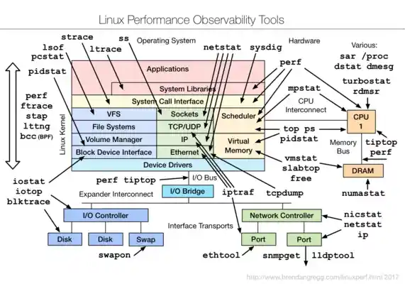
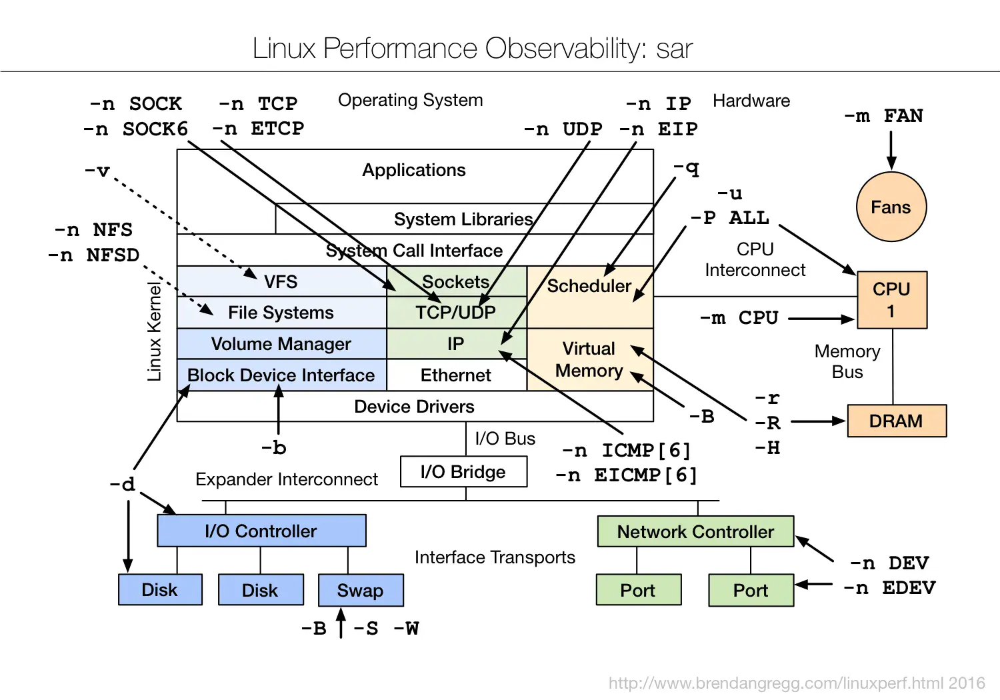

# 60 秒定位 Linux 性能瓶颈：一份能直接抄的命令清单


凌晨 3 点，oncall 电话响了。"服务慢了，用户在刷不出页面。" 你 SSH 进一台从没见过的 Linux 服务器，没有 Prometheus dashboard，没有 APM 火焰图，只有黑漆漆的命令行。

第一分钟该敲什么？

Netflix 性能工程团队 2015 年给出的答案是：**10 个命令，60 秒**。本文把这套方法整理成一份可以照抄的清单，并补上一张"心智地图"，让你不只是机械记忆命令，而是理解**为什么要敲它们、应该看哪几列、看完之后该往哪走**。

<!--more-->

## 一、先讲方法，再敲命令

先聊**性能分析的思维框架**。命令只是工具，没有框架支撑的 `top` 一通乱按，往往会让你在十几个跳动的数字里迷失方向。

Brendan Gregg 提出的 **USE 方法**（Utilization, Saturation, Errors）就是为这种场景设计的——它把"性能"这件事拆成三个可量化的问题：

- **U（Utilization 利用率）**：资源忙了多长时间？例如 CPU 利用率 80%、磁盘利用率 100%。
- **S（Saturation 饱和度）**：资源在排队等多少活？例如 runqueue 长度、I/O 等待时间。
- **E（Errors 错误）**：有多少失败的请求？例如网卡丢包、磁盘 I/O 错误。

实战中，**检查顺序应该是 Errors > Saturation > Utilization**。错误和饱和度都是"硬信号"——只要出现就是问题；利用率还要看具体阈值（CPU 80% 不一定有问题，跑批任务本来就是 80%）。

另一个关键思路是**排除法**：你每检查并排除一个资源，就把搜索范围缩小一圈。这套命令清单跑完一圈后，剩下没被排除的那个子系统，就是瓶颈所在。

| 资源 | Utilization | Saturation | Errors |
|------|-------------|------------|--------|
| CPU | `%usr + %sys` | runqueue `r` | dmesg oom-killer |
| 内存 | used / total | swap `si/so` | dmesg oom-killer |
| 磁盘 | `iostat %util` | `await`, `avgqu-sz` | dmesg I/O 错误 |
| 网络 | `sar %ifutil` | `retrans/s` | `ifconfig` errors |

## 二、心智地图：把工具按"测什么"分组

光这一圈命令，记忆负担就不小。Chris Hantha 画过一张著名的图谱——《Linux Performance Observability Tools》——把工具按"被测资源 × 观测方法"分成二维矩阵。



我们把它简化成下面这张中文速查表，后面的命令清单就是这张表的逐行展开：

|  | CPU | 内存 | 磁盘 | 网络 |
|---|---|---|---|---|
| **基础状态** | uptime, top, ps | free | iostat | ip, ss |
| **动态统计** | vmstat, mpstat, pidstat | vmstat, sar -r | iostat -xz, sar -d | sar -n DEV, nicstat |
| **进程级** | pidstat -u/w, lsof | pidstat -r, lsof | pidstat -d, lsof | lsof -i, ss, netstat |
| **连接 / 协议** | — | — | — | sar -n TCP,ETCP |
| **进阶追踪** | perf, bcc | bcc | biolatency | tcpconnect |

记住这张表，再看命令清单就有了目录感：**"我现在关心的是 CPU 的饱和度" → 翻到 CPU 行的 `vmstat` 列**。

## 三、命令拆解：按子系统分组讲

> **前置：`sysstat` 包**——下面很多命令（`iostat` / `mpstat` / `pidstat` / `sar`）都在 `sysstat` 包里，**Debian/Ubuntu** 用 `apt install sysstat`，**RHEL/CentOS** 用 `yum install sysstat`。没装的话 `iostat` 等会报 "command not found"。

### 3.1 必读项：`dmesg | tail`

这条不属于任何子系统，但**永远值得先看**。OOM killer、SYN flood、硬件错误、文件系统异常——这些关键事件都在内核 ring buffer 里，只看最后 10 行就够：

```bash
$ dmesg | tail
[1880957.563150] perl invoked oom-killer: gfp_mask=0x280da, order=0
[1880957.563400] Out of memory: Kill process 18694 (perl) score 246
[2320864.954447] TCP: Possible SYN flooding on port 7001. Dropping request
```

`oom-killer` 出现 = 系统内存告急；`SYN flooding` 出现 = 网络层有异常。先扫一眼，10 秒就能排除（或确认）一整类问题。

### 3.2 CPU 组：3 个命令，3 个角度

**`uptime`**：3 个数字告诉你一切的开始。

```bash
$ uptime
23:51:26 up 21:31, 1 user, load average: 30.02, 26.43, 19.02
```

load average 的三个数字是 **1 分钟 / 5 分钟 / 15 分钟**的指数加权滑动平均。**重点不是绝对值，而是趋势**：

- 1 分钟值 ≫ 15 分钟值 → 负载在快速攀升
- 1 分钟值 ≪ 15 分钟值 → 峰值已经过去，你登录晚了
- 三个值都接近 CPU 核数 → 长期满载

注意：**load average 包括 uninterruptible 的进程**（典型场景：阻塞在磁盘 I/O 上），所以光看这个数字无法区分 CPU 饱和还是 I/O 饱和。

**`vmstat 1`**：把 CPU、内存、I/O 摊在一行里。

```bash
$ vmstat 1
procs ---memory--- ---swap-- ---io--- -system-- ------cpu-----
 r  b  swpd  free   buff  cache   si  so   bi  bo   in   cs  us sy id wa st
34  0     0  200889792  73708  591828  0   0    0   5    6   10  96  1  3  0  0
```

重点关注这几列：

- **`r`**：正在 CPU 上跑 + 等 CPU 的进程数。**`r > CPU 核数 = CPU 饱和`**（比 load average 更准，因为它不包含 I/O 等待）
- **`si, so`**：swap in / out，非零 = 内存不够了
- **`us + sy`**：用户态 + 内核态 CPU 时间，> 80% 表示 CPU 吃紧
- **`wa`**：等待 I/O 的时间，长期 > 5% 说明有磁盘瓶颈

**`mpstat -P ALL 1` + `pidstat 1`**：从"CPU 整体"到"单核 + 单进程"。

`mpstat` 把每个 CPU 核的使用率列出来——**单核 100% 而其他核空闲**，几乎可以断定是单线程热点（典型例子：旧版同步代码、Python GIL 锁、某个不当的同步原语）。

`pidstat` 进一步按进程聚合，给出"哪个进程在吃 CPU"：

```bash
$ pidstat 1
07:41:03 PM   UID   PID    %usr  %system  %CPU   Command
07:41:04 PM     0  6521 1590.00     1.00 1591.00  java
07:41:04 PM     0  6564 1573.00    10.00 1583.00  java
```

注意上面那个 `1591%`——`%CPU` 列是**所有核的累加**，这台 32 核机器上这个 Java 进程几乎吃满了 16 个核。

**`ps aux` / `ps -ef`**：进程快照，比 `top` 更适合做"调查记录"。

`top` 持续刷新会清屏、不方便复制粘贴。`ps` 给的是**一次性快照**，可以 `grep`、可以粘到 IM：

```bash
$ ps aux | grep -E "java|python" --color=auto
USER  PID  %CPU  %MEM  VSZ      RSS       TTY  STAT  START  COMMAND
root  6521  1590.0  5.2  5043200  4100000  ?    Sl    07:38  java -jar app.jar
root  6564  1573.0  5.1  5043200  4098000  ?    Sl    07:38  java -jar app.jar
```

`STAT` 列里藏着**进程状态**，是排障时极重要的信息：

- **`D`**：uninterruptible sleep，**阻塞在内核 I/O 上**——这些进程 `kill -9` 都杀不掉，只能等 I/O 结束
- **`R`**：正在 CPU 上跑
- **`S`**：可中断睡眠（最常见，多数进程大部分时间都停在这里）
- **`T`**：被 job control 信号（如 Ctrl-Z）暂停
- **`Z`**：**僵尸进程**——子进程已退出但父进程没回收，看到大量 `Z` 要查父进程
- **`I`**：空闲内核线程（较新内核）

`ps -ef` 风格不同但功能类似，重点多了一个 **`PPID`**（父进程 ID），查"孤儿进程 / 僵尸父进程"时看这个列。

> **Nice 值**：`ps` 里的 `NI` 列是进程优先级，范围 -20 到 19，**越小优先级越高**。用 `renice -n 19 PID` 把跑批任务调成"最礼貌"的状态，是和线上服务争抢 CPU 时的好习惯。

### 3.3 内存组：1 个命令 + 1 个反共识

```bash
$ free -m
             total    used    free   shared  buffers   cached
Mem:        245998   24545  221453       83        59      541
-/+ buffers/cache:   23944  222053
Swap:            0       0       0
```

很多人看到第一行的 `free = 221G` 觉得"内存够用"；又觉得"才用 24G，留 222G 是浪费"——这是 **Linux 内存管理最常见的误解**。

真相是：**Linux 会把空闲内存拿去做 page cache 和 buffer cache**，需要时再吐回给应用。所以看 `free` 列毫无意义，**正确看的是第二行 `-/+ buffers/cache` 里的 `used`**——`23944 MB` 才是应用真正占用的内存。

如果 `swap` 那一行 `si/so` 不为零，再去配合 `vmstat` 确认是内存真的不够了（不是某次大页申请的瞬时抖动）。

### 3.4 磁盘组：`iostat -xz 1` 的两个误区

```bash
$ iostat -xz 1
Device:  rrqm/s  wrqm/s  r/s  w/s   rkB/s  wkB/s  avgrq-sz  avgqu-sz  await  r_await  w_await  svctm  %util
xvdb     0.01    0.00   1.02  8.94  127.97  598.53  145.79  0.00     0.43    1.78     0.28    0.25   0.25
dm-1     0.00    0.00   0.00  0.94    0.01    3.78    8.00  0.33   345.84    0.04   346.81    0.01   0.00
```

`iostat` 字段很多，但排障时**先看两件事**：

- **`%util` > 60%**：设备在忙（注意是"忙"，不是"满"）
- **`await`** 远高于设备本身的物理延迟（NVMe SSD 健康值 < 1ms，机械盘 < 10ms）：队列在堆积

**第一个误区**：把 `%util = 100%` 等同于"磁盘打满"。如果底层是 LVM / dm-device 前置多块物理盘，前端 100% 不代表后端真饱和。要看 **`await` + `avgqu-sz`** 才能下结论——上面那个 `dm-1` 设备 `%util = 0.00` 但 `await = 345.84ms`，才是真正的延迟信号。

**第二个误区**：磁盘慢 = 应用问题。Linux 的 **page cache、read-ahead、write-back** 会让应用"感受不到"真实磁盘延迟。`%util` 看起来不高但 `await` 高，可能是 page cache 被旁路（例如 direct I/O）或文件系统层面的问题。

### 3.5 网络组：带宽、协议、连接三件套

**`sar -n DEV 1`**：每张网卡每秒收发多少。

```bash
$ sar -n DEV 1
12:16:48 AM  IFACE  rxpck/s  txpck/s   rxkB/s   txkB/s  %ifutil
12:16:49 AM   eth0 18763.00  5032.00  20686.42   478.30    0.00
```

重点是 **`rxkB/s + txkB/s`**——超过网卡带宽的 60-70% 就要警惕（万兆网卡 6-7 GB/s 是个常见分水岭）。`%ifutil` 这个字段**多数情况下不太准**（这也是 `nicstat` 等替代工具存在的原因），所以别完全依赖它。

**`sar -n TCP,ETCP 1`**：把 TCP 层的事摊开。

```bash
$ sar -n TCP,ETCP 1
12:17:19 AM  active/s  passive/s  iseg/s  oseg/s
12:17:20 AM       1.00       0.00  10233  18846
12:17:19 AM  atmptf/s  estres/s  retrans/s  isegerr/s  orsts/s
12:17:20 AM       0.00      0.00      0.00       0.00     0.00
```

- **`active/s` vs `passive/s`**：粗略代表"出方向连接"和"入方向连接"。如果服务器是反向代理或 API 网关，`passive/s` 会明显高于 `active/s`。
- **`retrans/s`**：TCP 重传，**非零 = 网络或对端有问题**。可能是公网抖动，也可能是对端过载丢包。

**`ss` / `netstat`**：看"连接"而不是看"流量"。

`sar -n DEV` 告诉你"网卡吞吐多少"，`ss` / `netstat` 告诉你"现在有哪些连接在跑"。两者定位不同问题：**流量爆 = `sar` 抓；连接数爆 = `ss` 抓**：

```bash
# 现代化的 ss（推荐）
$ ss -antp
State   Recv-Q  Send-Q  Local Address   Foreign Address   PID/Program
LISTEN  0       128     *:8080          *:*               users:(("java",pid=6521))
ESTAB   0       0       10.0.0.5:8080   10.0.0.20:52431   users:(("java",pid=6521))

# 经典 netstat（已废弃，但老机器上还有）
$ sudo netstat -antp
Proto  Recv-Q  Send-Q  Local    Foreign   State   PID/Program
tcp    0       0        0.0.0.0:8080  0.0.0.0:*  LISTEN  6521/java
```

> **`netstat` 在新发行版里已被废弃**，man page 明说"用 `ss` 代替"。`ss` 在 10w+ 连接时速度比 `netstat` 快一个数量级，新机器直接用 `ss`。

常用组合：
- `ss -s`：连接数摘要（类比 `netstat -s`）
- `ss -tan state ESTABLISHED | wc -l`：数当前已建立的连接
- `ss -tan 'sport = :80'`：只看 80 端口的连接（用 `dport` 看目的端口）
- `sudo ss -antp | grep <PID>`：查某个进程的所有连接

**`nicstat`**：比 `sar -n DEV` 更准的网卡监控。

`%ifutil` 字段不准是因为 Linux 内核统计网卡利用率很困难。`nicstat` 单独实现了基于速率的算法，能正确告诉你"万兆网卡真的吃到 80% 了"。Ubuntu 装 `nicstat` 包，RHEL 从 [scotte/nicstat](https://github.com/scotte/nicstat) 编译。

**`sar` 的扩展子命令**（同属 `sysstat` 包）：

- `sar -q 1`：队列长度 + load average，等同于 `uptime` 但带每秒采样
- `sar -r 1`：内存使用率（比 `free` 更细，带历史）
- `sar -b 1`：I/O 和传输速率
- `sar -d 1`：每块磁盘的统计（部分功能等同 `iostat -d`）
- `sar -S 1`：swap 空间使用



`sysstat` 默认会按天把 `sar` 数据落到 `/var/log/sysstat/saDD`，历史可用 `-f` 指定文件 + `-s/-e` 限定时间窗口查（`sar -s 17:00:00 -e 17:30:00 -f /var/log/sysstat/sa01 -r`）。先在 `/etc/default/sysstat` 把 `ENABLED=true` 并重启服务才收集历史。事故复盘用 [ksar](https://github.com/vlsi/ksar) 可视化。

### 3.6 综合收尾：`top` 的正确位置

```bash
$ top
%Cpu(s): 96.8 us,  0.4 sy,  0.0 ni,  2.7 id,  0.1 wa,  0.0 hi,  0.0 si,  0.0 st
   PID  USER   %CPU  %MEM   COMMAND
 20248  root  3090.0   5.2  java
  4213  root    23.5   0.0  mesos-slave
```

我把 `top` 放在最后是有意为之。前面这一圈工具给的是**跨时间的滚动统计**（每秒刷新、能看趋势），`top` 给的是**瞬时快照**。放到最后有两个目的：

1. **做差异检查**——如果 `top` 看到的 CPU 头部进程和 `pidstat` 给的结论对得上，说明指标稳定
2. **避免被 `top` 误导**——`top` 跳动的数字容易让人产生"系统很忙"的错觉，先有全局判断再看 `top`，节奏更稳

`top` 的小坑：屏幕会清屏、看不了历史。**`Ctrl-S` 暂停输出、`Ctrl-Q` 继续**——这个快捷键在排查"一闪而过"的问题时能救命。

**`top` 关键列速查**：

- **`VIRT`**：虚拟内存总量，**包含未实际使用的部分**（如 mmap 但没读的库文件），数值大不代表真用了那么多
- **`RES`**：实际占用的物理内存，**判断"谁吃内存"就看这一列**
- **`SHR`**：可与其他进程共享的内存（如 libc.so），多个 Python 进程的 `SHR` 会有重叠——加起来会超过系统总内存，不要被骗
- **`S`**：进程状态（`D` / `R` / `S` / `T` / `Z`），含义同 `ps aux` 的 `STAT` 列
- **`%CPU` 是所有核累加**：32 核机器上 `3000%` 意味着吃满 30 个核

两个隐藏利器：按 **`Shift+H`** 切换线程视图（看 Java/Python 这类多线程应用时特别有用），按 **`c`** 切换显示完整命令行（看启动参数）。觉得 `top` 交互不友好，可以装 **`htop`**——颜色高亮、支持鼠标、可以按列排序，是更现代的替代。

## 四、定位之后：用 eBPF 工具链深挖

命令清单跑完一圈，理想情况下你已经能回答三个问题：

- 哪个子系统出了问题？（CPU / 内存 / 磁盘 / 网络）
- 大致是哪个进程在捣乱？
- 严重程度如何？

接下来就该"定点深挖"了。这里有 3 个工具梯度：

**1. 传统工具：够用为先**

- `strace -p PID`：抓进程的系统调用，看它在等什么
- `lsof -p PID`：看进程打开了哪些文件 / 端口。常见用法：
  - 查"日志写到哪了" → `lsof -p PID | grep .log`
  - 查"文件删了但磁盘没释放" → `lsof | grep deleted`
  - 查进程所有网络连接 → `lsof -i -a -p PID`
- `perf top`：CPU 采样 + 火焰图基础
- `iotop`、`iftop`：分别看进程级 I/O、网络吞吐

**2. 现代工具：eBPF 工具集**

- `biolatency`、`biosnoop`：磁盘 I/O 延迟分布
- `tcpconnect`、`tcplife`：TCP 连接生命周期
- `opensnoop`、`execsnoop`：短命进程的"一闪而过"调用

这是 eBPF 的强项——**不改内核、不重启服务**，就能在内核关键路径上抓到你想要的数据。详细原理可以看我之前写的《[eBPF 简介：从钩子、验证器到 BCC 实战](/post/0bff2f37/)》。

**3. 选择建议：按场景**

- **偶发延迟、传统工具抓不到** → eBPF（`biolatency` / `tcplife`）
- **CPU 飙高想找热点** → `perf top` + flamegraph
- **想知道某个进程在干嘛** → `strace` + `lsof` 组合
- **怀疑网络丢包** → `sar -n ETCP` + `tcpdump`

记住一个原则：**先广撒网（命令清单 + 扩展工具箱），再定点抓（专业工具）**。上来就 `strace` 一通抓，往往抓了一堆 syscall 才发现瓶颈根本不在系统调用层。

## 总结

60 秒性能分析不是黑魔法，是**纪律**。把命令清单形成肌肉记忆，配合 USE 方法作为思维主线，就能在 oncall 时快速定位问题。

回顾三个核心观点：

1. **命令不在多，看对列比会敲更重要**——核心是知道"看哪一列"
2. **USE 方法 + 排除法 > 凭直觉**——用框架收敛问题比堆工具更高效
3. **命令行只是起点**——定位后用 `perf` / `bcc` / eBPF 工具链继续深挖

**适用边界**：本文只覆盖"裸机命令行"场景。云上有完整的 APM（Datadog / SkyWalking / 阿里云 ARMS）时，应优先用平台能力；只有 APM 也定位不到时，才回到命令行。

**延伸阅读**：

- Brendan Gregg《Systems Performance》第 2 版——性能分析领域的事实标准
- [Brendan Gregg 个人站](http://www.brendangregg.com/linuxperf.html)——命令详解的权威来源
- [Netflix Tech Blog 原文](https://netflixtechblog.com/)——本文的源头
- [eBPF 简介：从钩子、验证器到 BCC 实战](/post/0bff2f37/)——下一篇该读的内容

**图片出处**：本文插图（命令输出截图与总览图）均取自 Isuru Perera 的文章 *Linux Performance Observability Tools*（[Medium 链接](https://medium.com/@chrishantha/linux-performance-observability-tools-19ae2328f87f)），在原图基础上重命名以便引用。

