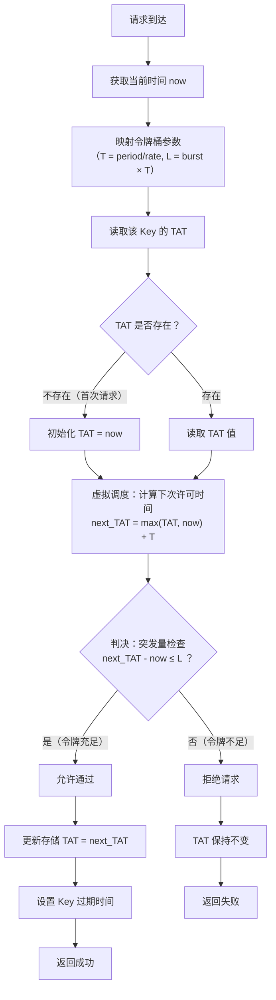

# 限流简介


限流是高并发系统里最朴素的自我保护手段：当流量超过系统承载上限时，主动拒绝或排队部分请求，换取整体稳定。

这篇文章从固定窗口、滑动窗口、漏桶、令牌桶、GCRA 五类经典算法讲起，用 Redis Lua 脚本还原实现细节，再分析 Redisson RateLimiter 的设计本质，最后落到分布式限流的三大关键问题与生产选型建议。如果你正在设计或优化一套限流方案，这篇文章会是一张清晰的路线图。

<!--more-->

## 什么是限流？

**限流，就是给并发请求设置一个明确的"上限"。** 当单位时间内的请求量超过这个阈值时，多余的请求会被拒绝、排队或降级处理，而不是任由它们涌入系统深处。

你可以把它想象成景区限流：故宫每天限流 8 万人，限制的并不是容量，而是参观体验与文物安全的临界点。超过上限，后到的游客只能改天再来——软件系统中的限流，逻辑与此完全一致。

服务器的 CPU、内存、数据库连接池、线程池都是有限资源。当瞬时流量远超处理能力时，系统就像超负荷运转的餐厅后厨：订单越积越多，每道菜的出锅时间都被拉长，最终谁也吃不上饭——表现在系统上，就是请求大面积超时、服务响应变慢，直至整体崩溃。

**限流的本质，是一种"有损服务"下的自我保护机制。** 它承认系统无法处理所有请求，于是主动放弃一部分请求，换取其余请求能被快速、正确地处理，保证核心功能不至于瘫痪。听起来有些无奈，但在高并发场景下，这恰恰是最理性的选择：死扛的结果往往是全盘崩溃，而适度的"拒绝"，反而能让系统在能力范围内持续稳定地提供服务。

理解了这一点，就能跳出"限流就是少接点客"的浅层认知。本质上，限流是一套围绕**"什么时候限、限多少、怎么限、限谁"** 的工程策略。下文会从固定窗口、滑动窗口、漏桶、令牌桶这些经典算法讲起，再聊到 GCRA 与生产环境的实战细节。

## 算法地图

在深入细节之前，先把常见的限流算法摆在一张图上，建立全局认知：

| 算法 | 核心思路 | 是否允许突发 | 单次判定成本 | 内存占用 | 典型应用场景 |
|------|---------|-------------|------------|---------|-------------|
| 固定窗口 | 单位时间内计数器 +1 | 是（边界可翻倍） | O(1) | 极小（1 个计数器） | 简单 QPS 限制 |
| 滑动窗口 | 维护最近 N 毫秒的请求集合 | 近似平滑 | O(1) | 大（每个请求 1 条记录） | API 配额、用户操作频率 |
| 漏桶 | 桶匀速漏水，请求匀速流出 | 否（强制平滑） | O(1) | 极小（2 个数值） | 保护下游数据库、第三方 API |
| 令牌桶 | 桶匀速产令牌，请求取令牌 | 是（桶可囤积） | O(1) | 极小（2 个数值） | 通用 HTTP 接口限流 |
| GCRA | 仅维护"理论到达时间" TAT | 是（等价令牌桶） | O(1) | 极小（1 个数值） | 高性能网关、嵌入式限流 |

下文按"由简到繁、由计数型到令牌型"的顺序逐一展开。

## 固定窗口

**固定窗口（Fixed Window）** 是最直观、最容易理解的限流算法，几乎所有随手写出来的限流逻辑，本质上都是它。

原理一句话讲清楚：把时间切成等长的片段（例如每 1 秒一个窗口），每个窗口内维护一个计数器。请求到来时，计数器加 1；超过阈值则拒绝；窗口结束时，计数器清零，进入下一个窗口。

```text
窗口阈值 = 3
时间轴 →
窗口1 (0~1s)        窗口2 (1~2s)        窗口3 (2~3s)
|----+----+----|----+----+----|----+----+----|
  ✓    ✓    ✓     ✓   ✓✓   ✗    ✓    ✓    ✓

✓ 请求通过  ✗ 请求拒绝
```

上图中，三个 1 秒窗口的阈值都设为 3。窗口 1 的 3 个请求全部通过；窗口 2 内的第 4 个请求触发拒绝；窗口 3 只来了 2 个请求，未触发限制。

### Redis 实现：固定窗口

基于 Redis 只需一个 key 加一个过期时间即可：

```lua
-- fixed_window.lua
-- KEYS[1] : 限流的 key，例如 "rate_limit:user123:login"
-- ARGV[1] : 窗口阈值，最大允许请求数
-- ARGV[2] : 窗口时长，单位秒

local key    = KEYS[1]
local limit  = tonumber(ARGV[1])
local window = tonumber(ARGV[2])

-- 获取当前计数
local current = redis.call('GET', key)

if current == false then
    -- 首个请求：初始化为 1，过期时间略大于窗口（避免边界时钟偏差）
    redis.call('SET', key, 1, 'EX', window + 1)
    return 1
else
    current = tonumber(current)
    if current < limit then
        -- 未达上限：累加计数
        redis.call('INCR', key)
        return current + 1
    else
        -- 达到上限：拒绝请求
        return -1
    end
end
```

**优点：** 实现简单、内存占用极小——每个窗口仅需一个计数器。

**致命缺陷：边界翻倍问题。** 当流量恰好集中在窗口 1 的末尾与窗口 2 的开头时，跨窗口的 1 秒内实际通过的请求数可能达到阈值的 2 倍。固定窗口只关心自己窗口内的计数，对跨窗口的流量尖峰毫无感知，限流不平滑。

## 滑动窗口

固定窗口的根源问题在于：窗口一旦切换，计数就清零，前一秒与后一秒的流量被完全割裂。

**滑动窗口** 的解法是：把窗口视为一个持续向前滑动的时间区间，只统计"距离当前时刻最近的一个窗口时长内"的请求数。

具体来说：若窗口大小为 1 秒，每次请求到来时，系统都检查"最近 1 秒内"已处理多少请求。达到上限则拒绝，否则放行，并把这次请求的时间戳记录下来，作为后续判断的依据。

```text
时间轴 →  (窗口向前滑动)

        [  滑动窗口 = 最近1秒  ]
|----+----+----+----+----+----|
0.0  0.2  0.4  0.6  0.8  1.0  1.2 ...

时刻 0.0s: 请求1进来  窗口内[1]            <3 通过
时刻 0.3s: 请求2进来  窗口内[1,2]          <3 通过
时刻 0.5s: 请求3进来  窗口内[1,2,3]        =3 通过
时刻 0.7s: 请求4进来  窗口内[1,2,3]        =3 拒绝 (最近1秒内已有3次)
时刻 1.1s: 请求5进来  窗口内[2,3] (0.3~1.1)=2 通过 (请求1已滑出窗口)
```

关键观察：当时间走到 1.1 秒时，0.0 秒的请求 1 已超出"最近 1 秒"的范围，不再计入。此时计数为 2，请求 5 顺利通过。这正是滑动窗口的精妙之处：**流量控制连续平滑，没有硬边界带来的突刺。**

### Redis 实现：滑动窗口（精确版）

滑动窗口的核心需求是：**按时间戳存储每次请求，并能高效地进行范围统计与清理。** Redis 的有序集合（Sorted Set, ZSET）天然契合这一需求：

- **member**：请求的唯一标识（例如 UUID 或请求流水号），避免重复计数。
- **score**：请求到达的时间戳（毫秒精度）。

每次请求时，先用 `ZREMRANGEBYSCORE` 移除窗口外的旧记录，再用 `ZCARD` 统计当前窗口内的成员数。若未达阈值，把当前请求加入 ZSET 并放行；否则拒绝。

```lua
-- sliding_window.lua
-- KEYS[1] : 限流 ZSET 的 key
-- ARGV[1] : 窗口大小，单位秒
-- ARGV[2] : 窗口阈值，最大允许请求数
-- ARGV[3] : 当前请求的唯一标识（UUID/随机串）
-- ARGV[4] : 当前时间戳，毫秒（由客户端传入，保证分布式下的一致性）

local key       = KEYS[1]
local window    = tonumber(ARGV[1]) * 1000  -- 转为毫秒
local limit     = tonumber(ARGV[2])
local member    = ARGV[3]
local now       = tonumber(ARGV[4])

-- 计算窗口左边界
local windowStart = now - window

-- 移除窗口外的旧数据
redis.call('ZREMRANGEBYSCORE', key, 0, windowStart)

-- 获取当前窗口内的请求数
local current = redis.call('ZCARD', key)

if current < limit then
    -- 未达上限：记录本次请求，并设置 key 过期（窗口长度 + 1秒冗余）
    redis.call('ZADD', key, now, member)
    redis.call('PEXPIRE', key, window + 1000)
    return 1
else
    return -1
end
```

> ZSET 中的 member 必须唯一，生产环境建议使用 UUID 或雪花算法生成的 ID。

### ZSET vs List：两种实现路径的权衡

在极高并发下，ZSET 内存开销较大（每个 member 还要存 score 和 UUID），也可以用 List 实现：

```lua
-- sliding_window_list.lua
local key        = KEYS[1]
local window_ms  = tonumber(ARGV[1]) * 1000
local limit      = tonumber(ARGV[2])
local now        = tonumber(ARGV[3])
local window_start = now - window_ms

-- 移除过期元素
while true do
    local oldest = redis.call('LINDEX', key, 0)
    if not oldest then break end
    if tonumber(oldest) < window_start then
        redis.call('LPOP', key)
    else
        break
    end
end

-- 检查当前长度
local count = redis.call('LLEN', key)
if count >= limit then
    return -1
end

redis.call('RPUSH', key, now)
redis.call('PEXPIRE', key, window_ms + 1000)
return count + 1
```

两种数据结构的对比如下：

| 维度 | ZSET | List |
|------|------|------|
| **内存占用** | 较高：每个 member 含 score（double）+ 唯一标识（通常为 UUID） | 较低：仅存时间戳数字 |
| **清理效率** | `ZREMRANGEBYSCORE` 批量删除，时间复杂度 O(log N + M) | 需逐个 `LPOP`，Lua 内循环次数多，最坏情况阻塞 Redis |
| **计数精度** | member 天然去重，重试不会重复计数 | **无唯一性约束**，重复推送会被多算，限流偏紧 |
| **复杂度** | API 清晰，处理范围干净 | 依赖 List 头尾操作，分布式下时间漂移可能乱序 |
| **适用场景** | 中等 QPS（万级以下）、要求精确去重的业务限流 | 百万 QPS 以上的网关层、内存极度敏感、可保证请求无重复 |

### Redis 实现：近似滑动窗口（格子法）

精确滑动窗口要存储每个请求的时间戳，在高并发下成本可观。**当流量极高时，可以用"格子法"牺牲微小精度，换取性能与内存的大幅改善。**

以 1 秒窗口、阈值 100 为例，思路是：

- 将 1 秒切成 10 个格子，每个格子 100 毫秒。
- 每个格子对应一个 Redis key（如 `rate:user:action:格子索引`），存该格子内的请求计数，过期时间为 1 秒 + 缓冲。
- 每次请求：定位当前格子（`bucket_index = now_ms // 100`），累加该格子计数，并求和最近 10 个格子的总数。超过阈值则拒绝。
- 这样只需要维护 10 个计数器，**内存与固定窗口相当**，但精度与滑动窗口接近。

```lua
-- approx_sliding_window.lua
-- KEYS[1] : 限流 key 前缀（如 "rate_limit:user123:login"）
-- ARGV[1] : 窗口大小（秒）
-- ARGV[2] : 阈值
-- ARGV[3] : 格子数量 N（如 10）
-- ARGV[4] : 当前毫秒时间戳

local key_prefix = KEYS[1]
local window_sec = tonumber(ARGV[1])
local limit      = tonumber(ARGV[2])
local bucket_num = tonumber(ARGV[3])
local now_ms     = tonumber(ARGV[4])

local bucket_span    = math.ceil(window_sec * 1000 / bucket_num) -- 每个格子的毫秒长度
local current_bucket = math.floor(now_ms / bucket_span)

-- 计算需要检查的格子区间
local start_bucket = current_bucket - bucket_num + 1
local end_bucket   = current_bucket

-- 统计总计数
local total = 0
for i = start_bucket, end_bucket do
    local key = key_prefix .. ":" .. i
    local cnt = redis.call('GET', key)
    if cnt then
        total = total + tonumber(cnt)
    end
end

-- 总和已达阈值则拒绝
if total >= limit then
    return -1
end

-- 递增当前格子并设置过期
local current_key = key_prefix .. ":" .. current_bucket
redis.call('INCR', current_key)
redis.call('PEXPIRE', current_key, window_sec * 1000 + bucket_span)

return total + 1
```

**格子数的取舍：**

| 格子数 N | 单次 Redis 操作 | 理论最大突发 | 适用场景 |
|---------|----------------|------------|---------|
| 5~10 | 5~10 次 GET | 阈值的 `1.1~1.2` 倍 | 极高 QPS 网关层，内存极度敏感 |
| 10~20 | 10~20 次 GET | 阈值的 `1.05~1.1` 倍 | 通用推荐，绝大多数业务场景 |
| 30~60 | 30~60 次 GET | 阈值的 `1.02~1.03` 倍 | 准精确限流，可接受更高开销 |

通常 10~20 个格子就能在绝大多数场景取得不错的平衡：例如 1 秒窗口 10 个格子，理论最大突发约为阈值的 `1 + 1/N`，仅比精确滑动窗口多放约 10%。若窗口放大到 1 分钟，仍可使用 10 个格子，每个 6 秒，精度略降但远好于固定窗口。

**优势：** 内存仅需 N 个计数器，操作简单，性能高，适合超高并发的网关层限流。
**局限：** 仍是近似算法，边界处存在理论误差；对极端精确计费的场景不适用。

## 漏桶算法

固定窗口与滑动窗口本质上都在**计数**：统计一段时间内来了多少请求，超限则拒绝。这种模式的副作用是：只要未超阈值，请求可以一瞬间全部通过。例如阈值 100 req/s，第 1 毫秒涌入 100 个请求也会被全部放行，剩下的 999 毫秒只能干等。

但有些场景不容许这种"一拥而上"。比如保护下游数据库，我们期望请求以**均匀的速度**抵达，而不是一阵一阵地冲击。这时就轮到**漏桶算法** 登场了。

漏桶把请求想象成水流，系统里放着一只底部带小孔的桶：

- 请求来了，先倒进桶里（入桶）。
- 桶底部以恒定速率向下漏水（处理请求）。
- 桶满了，再倒水就溢出（请求被拒绝）。

请求可以任意速度到达，只要桶未满就被暂存；处理端按预设速率（如 2 req/s）从容取出。桶一满，新来的请求直接溢出被限流。

| 对比点 | 滑动窗口 / 固定窗口 | 漏桶 |
|:---|:---|:---|
| 核心逻辑 | 统计过去一段时间的请求数，超了就限流 | 控制请求离开的速度，削峰填谷 |
| 流量整形 | 弱——允许瞬时突发至阈值 | 强——无论流入多猛，流出始终恒定 |
| 应对突发 | 接受窗口内的突发 | 超出桶容量即丢弃 |
| 适合场景 | 保护整体 QPS 上限，允许弹性 | 严格保护下游处理能力，要求恒定间隔 |

可见，计数器型算法"管来"，漏桶算法"管走"。这决定了漏桶天然适合**需要严格流控** 的场景，例如调用第三方 API、对方要求 QPS 不超过 10 且两次请求间隔不能小于 100ms——漏桶就是为此量身定做。

### Redis 实现：漏桶

```lua
-- leaky_bucket.lua
-- KEYS[1] : 桶的 key（如 "leaky_bucket:user123:api"）
-- ARGV[1] : 桶的容量（最大水位）
-- ARGV[2] : 漏水速率，单位：个/秒
-- ARGV[3] : 当前时间戳（毫秒）
-- ARGV[4] : 本次请求需要增加的请求数（通常为 1）

local key        = KEYS[1]
local capacity   = tonumber(ARGV[1])
local rate       = tonumber(ARGV[2])
local now        = tonumber(ARGV[3])
local requested  = tonumber(ARGV[4])

-- 读取当前水位与上次漏水时间
local water     = tonumber(redis.call('GET', key))
local last_time = 0

if water == false then
    water = 0
else
    last_time = tonumber(redis.call('GET', key .. ':ts')) or 0
end

-- 计算自上次以来的漏水量
local elapsed = (now - last_time) / 1000
local leaked  = elapsed * rate
water = math.max(0, water - leaked)

-- 判断是否溢出
if water + requested > capacity then
    return -1
end

-- 入桶
water = water + requested
redis.call('SET', key, water)
redis.call('SET', key .. ':ts', now)

-- 设置过期，防止空桶长期占用内存
local ttl = math.ceil(capacity / rate) + 1
redis.call('EXPIRE', key, ttl)
redis.call('EXPIRE', key .. ':ts', ttl)

return water
```

**适用场景：**

- 严格保护下游，要求平滑流量（如数据库连接池、第三方支付接口）。
- 需要整形的场景：即便上游有多波突发流量，下游始终收到均匀的请求序列。
- 配合消息队列使用，天然契合生产-消费模型。

**局限：**

- 对"合理的突发"不友好。例如系统平时能轻松处理 100 QPS，但秒杀前几秒突然涌入 200 QPS，漏桶会毫不留情地丢弃超出桶容量的部分，即使下游其实能应对短暂冲高。
- 参数选择依赖实际处理能力：速率设小了浪费性能，设大了起不到保护作用，需要根据压测精确调优。

正是漏桶"过于死板"的这一缺点，才催生了更灵活、允许一定突发的**令牌桶算法**。

## 令牌桶算法

**令牌桶** 的思路非常巧妙：不再"倒水进桶"，而是在桶里放令牌。

- 系统以固定速率向桶中添加令牌（如每秒产生 2 个）。
- 桶有自己的容量上限（如最多 10 个）。桶满后，新产生的令牌被丢弃。
- 每个请求到来时，必须从桶里取走一个令牌才能被处理。
- 桶空时，请求被限流——要么等待，要么直接拒绝。

| 对比 | 漏桶 | 令牌桶 |
|:---|:---|:---|
| 核心对象 | 请求（水） | 令牌 |
| 整形方向 | 控制流出速率（处理端） | 控制流入速率（请求端） |
| 突发流量 | 不支持，超容量即丢弃 | 支持，空闲时囤积的令牌可支撑一波突发 |
| 适用场景 | 严格保护下游处理节奏 | 允许弹性突发，但限制长期平均速率 |

漏桶在乎"下游处理能力曲线是一条直线"，令牌桶在乎"平均速率不超标，但允许瞬时冲高"。大部分实际业务限流（用户登录、发帖、抢购）并非必须恒速处理，只要保证长期上限不被冲破即可。**这种情况下，令牌桶远比漏桶灵活，也因此成为公认最适合生产环境的限流算法。**

### Redis 实现：令牌桶

```lua
-- token_bucket.lua
-- KEYS[1] : 令牌桶的 key（如 "token_bucket:user123:api"）
-- ARGV[1] : 令牌桶容量（最大令牌数）
-- ARGV[2] : 令牌生成速率（个/秒）
-- ARGV[3] : 当前时间戳（毫秒）
-- ARGV[4] : 本次请求需要消耗的令牌数（通常为 1）

local key       = KEYS[1]
local capacity  = tonumber(ARGV[1])
local rate      = tonumber(ARGV[2])
local now       = tonumber(ARGV[3])
local requested = tonumber(ARGV[4])

-- 读取当前令牌数与上次填充时间
local tokens    = tonumber(redis.call('GET', key))
local last_time = tonumber(redis.call('GET', key .. ':ts')) or 0

if tokens == false then
    tokens = capacity  -- 首次初始化为满桶
end

-- 根据经过的时间补充令牌
local elapsed    = (now - last_time) / 1000
local add_tokens = elapsed * rate
tokens = math.min(capacity, tokens + add_tokens)

-- 令牌不足则拒绝
if tokens < requested then
    return -1
end

-- 消耗令牌并保存
tokens = tokens - requested
redis.call('SET', key, tokens)
redis.call('SET', key .. ':ts', now)

-- 设置过期时间：桶清空所需的最长时间
local ttl = math.ceil(capacity / rate) + 1
redis.call('EXPIRE', key, ttl)
redis.call('EXPIRE', key .. ':ts', ttl)

return tokens
```

令牌桶几乎是目前 HTTP 接口限流、用户行为频率控制领域的"标配"算法，原因有三：

- **宽容：** 空闲时的令牌累积允许小高峰通过，不至于对正常业务造成误伤。
- **严格：** 长期平均处理速率绝不会超过令牌生成速率，保护系统整体承载极限。
- **直观：** 容量 = 可接受的最大突发量，速率 = 长期吞吐量上限，运营容易理解。

当然，令牌桶也有边界。若下游是真正的"一个请求处理一个请求，中间没有缓冲"（如老式串行打印机、对时序有严格要求的硬件设备），漏桶可能更合适。但对 99% 的互联网后端服务而言，**令牌桶就是最佳实践**。

## GCRA：通用信元速率算法

传统令牌桶需要存储两个值：tokens 和 last_time。在分布式系统中，如果多个客户端时钟不一致，或 Redis 服务器的时钟被调整，上次填充时间的计算就会出现偏差。

**有没有一种方式，只用一个变量就能表达整个限流逻辑？**

这就是 **GCRA（Generic Cell Rate Algorithm，通用信元速率算法）**，起源于 ATM 网络的流量整形。

**核心思想：用"理论到达时间"代替"桶"。** GCRA 不再关心"桶里还剩多少"，只维护一个参数——**TAT（Theoretical Arrival Time，理论到达时间）**。它表示**上一个请求被"安排"在什么时候执行**，或者说**下一个请求允许到达的最早时间**。



算法的步骤极其简单：

1. 设定**发射间隔** `Δt`（例如速率 5 req/s，则 `Δt = 1/5 = 200ms`）。
2. 当请求在 `ta`（实际到达时间）到来时，比较 `ta` 与 `TAT`：
   - 若 `ta >= TAT`：请求在预定时间之后到达，不算提前。
     - 允许通过，**`TAT = ta + Δt`**（在到达时间上叠加间隔，不给"迟到"发奖励）。
   - 若 `ta < TAT`：请求到得太早，需要再等一等。
     - 若 `TAT - ta` 超过突发容忍 `burst_tolerance = max_burst × Δt`，**拒绝**。
     - 否则允许通过，但 **`TAT = TAT + Δt`**（在原计划时间上累加间隔，使流量严格匀速）。
3. 状态只需要持久化一个值：`TAT`。

可以看到，**没有"桶"的容量概念，也不数令牌个数，只做时间加减。** 但神奇的是，它完全能模拟令牌桶的行为（包括支持突发）。

假设 `Δt = 200ms`，突发容忍 `max_burst = 2`（即最多提前 2 个间隔，允许 400ms 内的堆积）：

| 请求到达时间 `ta` | `TAT` | 判断 | 操作后 `TAT` |
|------------------|-------|------|-------------|
| ta = 0ms         | TAT = 0ms | 0 >= 0 放行 | 0 + 200 = 200ms |
| ta = 50ms        | TAT = 200ms | 50 < 200 且差值 150ms < 400ms 放行 | 200 + 200 = 400ms |
| ta = 100ms       | TAT = 400ms | 100 < 400 且差值 300ms < 400ms 放行 | 400 + 200 = 600ms |
| ta = 120ms       | TAT = 600ms | 120 < 600 且差值 480ms > 400ms 拒绝 | TAT 不变 = 600ms |
| ta = 700ms       | TAT = 600ms | 700 >= 600 放行 | 700 + 200 = 900ms |

观察：

- 第 2、3 个请求虽然"早了"，但差值在容忍范围内仍然被接受，并把后续 TAT 延后——**实现了突发**。
- 第 4 个请求太早，被拒绝，**保护了长期速率**。
- 经过一段空闲（第 5 个请求），TAT 直接重置为 `ta + Δt`，不保留积压——等效于令牌桶的"空闲时令牌不会无限囤积"。

这个"容忍差值"就是 `burst = max_burst × Δt`，对应令牌桶的**桶容量**。

### 手工 Lua 实现 GCRA

仅需维护 `TAT`（毫秒为单位）即可：

```lua
-- gcra.lua
-- KEYS[1] : TAT key
-- ARGV[1] : emission interval (毫秒)，即 1000/rate
-- ARGV[2] : burst tolerance (毫秒)，即 capacity * interval
-- ARGV[3] : 当前时间 (毫秒)

local key      = KEYS[1]
local interval = tonumber(ARGV[1])
local burst    = tonumber(ARGV[2])
local now      = tonumber(ARGV[3])

local tat = tonumber(redis.call('GET', key))
if tat == false then
    tat = now
end

if now >= tat then
    -- 未提前：更新 TAT 至 now + interval
    local new_tat = now + interval
    redis.call('SET', key, new_tat)
    redis.call('PEXPIRE', key, burst + 1000)
    return 1
else
    -- 提前到达
    if (tat - now) > burst then
        -- 超过容忍：拒绝
        return -1
    else
        -- 在容忍内：按计划延后
        local new_tat = tat + interval
        redis.call('SET', key, new_tat)
        redis.call('PEXPIRE', key, burst + 1000)
        return 1
    end
end
```

### 漏桶与令牌桶的统一视角

GCRA 揭示了一个有趣的事实：**漏桶和令牌桶的底层数学完全相同**，区别仅在于初始状态与参数语义。

| 对比维度 | GCRA 漏桶 | GCRA 令牌桶 |
| :--- | :--- | :--- |
| **底层公式** | `next_TAT = max(TAT, now) + T` | **完全一样** |
| **Redis 存储** | 1 个 String（存 TAT） | **完全一样**（1 个 String） |
| **冷启动行为** | 默认允许突发（`TAT = now`） | 若严格模拟空桶，需预热（`TAT = now + L`） |
| **参数 `burst` 语义** | 突发流量容忍度（滴水容量） | 令牌桶最大容量 |
| **空闲后行为** | 立即允许突发（桶空了） | 立即允许突发（桶满了）——**结果相同** |

由此可以归纳出：

- 仅存 TAT、初始化 `TAT = now`，就实现了一个允许冷启动突发的通用限流器。它既可以叫漏桶，也可以叫"令牌桶宽松模式"。
- 若要令牌桶的"严格冷启动（禁止初始突发）"，只需在 Lua 加一行：`if tat == nil then tat = now + L end`。
- 将 `burst` 设为 1，可实现严格"匀速消费"。

### 批量支持

经典 GCRA 维护一个 理论到达时间（TAT），每次请求间隔固定 `Δt`。如果允许一次消耗 n 个许可，最简单的映射就是把这一次请求等价为 连续 n 次单许可请求，即 TAT 应增加 `n * Δt`。但这里有一个额外条件：突发容忍度（burst） 必须能容纳这 n 个许可对应的“提前量”。否则就算桶容量够，算法也可能误杀。

假设参数：

- Δt：单个许可的发射间隔（如 200ms）
- burst：最大提前量（对应桶容量 × Δt，例如 10 个许可 → burst = 2000ms）
- 请求申请 n 个许可

修改后的判断逻辑：

- 如果 ta >= TAT（请求在计划之后到达）
  - → 通过，新 TAT = ta + n * Δt
- 如果 ta < TAT（请求来得早）
  - 需要“预支”未来 n 个间隔，理论最早可完成时间 = TAT + n * Δt
  - 提前量 = (TAT + n * Δt) - ta
  - 若提前量 ≤ burst，则通过，新 TAT = TAT + n * Δt ,否则拒绝

这个逻辑完美还原了令牌桶的效果：桶容量 = burst / Δt，一次拿 n 个令牌等价于把未来 n 个间隔的许可提前消耗，同时受桶容量上限约束。

一个 lua的实现:

```lua
-- gcra_throttle.lua
-- KEYS[1] : 限流器 key
-- ARGV[1] : capacity (最大突发许可数，桶容量)
-- ARGV[2] : rate (每秒允许通过的许可数)
-- ARGV[3] : requested (本次申请许可数)
-- ARGV[4] : current_time (可选，客户端传入毫秒时间戳，若不传则使用 Redis 服务器时间)
-- 返回: {allowed, retry_after_seconds, remaining}

local key = KEYS[1]
local capacity = tonumber(ARGV[1])
local rate = tonumber(ARGV[2])
local requested = tonumber(ARGV[3])
local now = tonumber(ARGV[4])
if not now then
    -- 使用 Redis 服务器时间（微秒精度，这里转为毫秒）
    local redis_time = redis.call('TIME')  -- 返回 {seconds, microseconds}
    now = tonumber(redis_time[1]) * 1000 + math.floor(tonumber(redis_time[2]) / 1000)
end

-- 发射间隔（毫秒）
local emission_interval = 1000 / rate
-- 突发容忍度（毫秒）
local burst = capacity * emission_interval

-- 读取理论到达时间 TAT
local tat = redis.call('GET', key)
if not tat then
    tat = now
else
    tat = tonumber(tat)
end

-- 计算新的理论到达时间
local new_tat = math.max(tat, now) + requested * emission_interval

-- 判断是否允许
local allowed = 0
local retry_after = 0
local remaining = 0

if new_tat - now <= burst then
    -- 允许通过
    allowed = 1
    redis.call('SET', key, new_tat)
    -- 设置过期时间：最多 burst + 一个间隔，避免冷 key 残留
    redis.call('PEXPIRE', key, math.floor(burst + emission_interval + 1000))

    -- 计算 remaining：等价于 capacity - 已预支的许可数
    -- 已预支许可数 = (new_tat - now) / emission_interval
    local consumed = (new_tat - now) / emission_interval
    remaining = math.max(0, capacity - math.ceil(consumed))
    retry_after = 0
else
    -- 拒绝
    allowed = 0
    -- retry_after = 最早可重试的时间 - now
    retry_after = (new_tat - burst - now) / 1000  -- 转为秒
    if retry_after < 0 then retry_after = 0 end
    -- remaining 为 0，因为桶中没有足够的令牌
    remaining = 0
end

return {allowed, retry_after, remaining}
```


> **一点提醒：** GCRA 与本文其他算法一样，都是单 key 单速率的限流器。生产中的"用户级 + 全局级"分层限流仍需组合多个 key 串联判断，这是此类算法的共性而非 GCRA 独有的局限。

## Redisson RateLimiter

Redisson 的 `RateLimiter` 是 Java 生态中最广泛使用的分布式限流实现之一。**它并非传统令牌桶，而是用 ZSET + 计数器实现 GCRA——是的，前文讲的 GCRA 在这里得到了工业级的 Java 落地。** 理解这一点，再看下面的源码分析会顺很多。

### 核心数据结构

- **`permitsName`（ZSET key）**：记录已发放的许可。
  - **score**：许可被允许使用的时间戳（毫秒，由传入的 `ARGV[2]` 提供）。
  - **member**：经 `struct.pack('Bc0I', len, random, ARGV[1])` 编码的二进制串，包含随机串（用于去重）与本次请求的许可数。这样既能支持单次消耗多个许可（如批量操作），又保证 member 唯一性。
- **`valueName`（String key）**：当前可用许可数（初始化为 `rate`），相当于桶里剩余的令牌。

### 工作流程

#### 1. 过期许可回收

脚本首先计算窗口左边界 `now - interval`，从 ZSET 中取出 score 小于该值的所有成员：

```lua
local expiredValues = redis.call('zrangebyscore', permitsName, 0, tonumber(ARGV[2]) - interval);
```

这些是已经滑出时间窗口的许可，对应令牌桶中"随着时间流逝新产生的令牌"。遍历过期成员，累计释放的许可数 `released`。

若 `released > 0`，执行：

- 用 `ZREMRANGEBYSCORE` 删除所有过期成员。
- 尝试把 `currentValue` 增加 `released`，但不超过 `rate`。若 `currentValue + released > rate`，说明内部状态可能出现不一致，此时重新统计整个 ZSET 中的剩余许可总数 `used`，并设置 `currentValue = rate - used`，确保计数精确等于"窗口内剩余可发许可"。
- 将更新后的 `currentValue` 写回 `valueName`。

这模拟了令牌补充——**但不是连续地按速率递增，而是每次请求到来时一次性回收窗口外的过期许可。** 系统空闲一段时间后，第一个请求会触发回收大量许可，`currentValue` 瞬间回满到 `rate`，从而支持突发流量。

#### 2. 判断是否放行

- 若 `currentValue >= 请求许可数`：
  - 将本次许可信息（随机串 + 许可数）写入 ZSET，`score = 当前时间`。
  - 对 `valueName` 执行 `DECRBY` 减掉消耗的许可。
  - 返回 `nil`（表示允许通过）。
- 若 `currentValue < 请求许可数`：
  - 从 ZSET 取出最早一个许可（最小 score），计算重试等待时间：`res = 3 + interval - (now - firstValue[2])`。该值实际表示"要等到那个最早的许可过期后，才能获得足够的令牌"。常数 3 是一个微小的安全偏移。
  - 返回 `res` 给客户端，客户端据此延时重试。

#### 3. 首次初始化

若 `valueName` 不存在，说明是首次使用：直接将其置为 `rate`，再执行一次"消耗许可"逻辑（写入 ZSET 并递减）。**因此第一次请求总是可以拿到满桶的许可。**

#### 4. Key 过期管理

根据 `keepAliveTime` 或 hash key 自身的 TTL 设置相关 key 的过期，避免长期不用的限流器残留内存。

### 设计总结

Redisson 实际上没有维护传统令牌桶的两个变量（令牌数 + 上次填充时间），而是：

- **速率控制**：通过滑动窗口的过期回收实现。任何长度为 `interval` 的滑动窗口内，通过的请求总数不超过 `rate`。
- **突发支持**：空闲后 ZSET 变空，`valueName` 回满到 `rate`，可一次性通过 `rate` 个请求——**等价于令牌桶容量 = rate**。
- **平滑效果**：每次消耗许可时都在 ZSET 留下带时间戳的记录，后续请求必须等这些记录过期才能拿到新许可，从而限制输出速率（补充是批量的，平滑度取决于 `interval` 设置）。

**Redisson 的本质是一个严格的滑动窗口限流器，通过将窗口长度定义为 `interval`、上限定义为 `rate`，完美复现令牌桶的容量突发 + 长期限速行为。** 用户使用时无需感知底层实现，配置起来就像配置令牌桶一样直观。

## 分布式限流的三个关键问题

在分布式环境下，即使算法写得再正确，线上跑起来仍会冒出让人头疼的问题。下面列出三个最常见的坑，以及对应的解决思路。

### 时钟不同步：你的"一秒"不是我的"一秒"

固定窗口、滑动窗口、令牌桶、GCRA——几乎所有算法都依赖时间。单机场景下，`System.currentTimeMillis()` 完全够用；但在分布式系统中，不同服务器的时钟可能存在毫秒甚至秒级的偏差。

如果限流逻辑让客户端自己传时间戳（很多 Lua 脚本都这么干），那么一台"走得快"的服务器发出的请求，可能提前耗尽限流配额；一台"走得慢"的服务器，则可能因时间戳滞后，导致本该过期的许可迟迟无法回收。

**应对：**

- **NTP 严格同步**：将所有参与限流的服务器时钟偏差控制在 10ms 以内，但别完全指望它。
- **以 Redis 时间为准**：用 `redis.call('TIME')` 代替传入的 `ARGV`。代价是增加一次 Redis 调用，但能杜绝客户端作恶或时钟偏差。
- **单调递增序列号**：用序列号代替时间戳，但通常需要额外的协调服务（如 ZooKeeper），仅适合对时间极度敏感的特殊场景。

### 热点 Key：90% 的流量都打在一个 Redis 节点上

假设做了一个全局限流：所有用户共享一个限流 key（如 `rate_limit:global:login`）。双十一零点，千万级并发同时冲向这个 key，所有请求都在 Redis 的同一个 slot（集群模式）或同一个实例上排队。

Redis 的单线程处理模型下，这个 key 会成为绝对瓶颈——CPU 打满、网络吞吐饱和、连接超时，**限流器本身反而成了故障点**。

**应对：**

- **拆 key 打散**：避免"全局唯一 key"。可按用户 ID、IP 或随机分桶（例如 `rate_limit:global:login:bucket_0 ~ bucket_99`）。每个子桶独立限流，总通过量用子桶容量之和控制。这会牺牲一点全局精确度（子桶之间可能不均匀），但性能提升巨大。
- **本地预限流**：在应用服务器内存中先做一次粗粒度限流（如 Guava RateLimiter），只有本地预通过的请求才去 Redis 做精确判断。这样能过滤掉 90% 以上的请求，极大减轻 Redis 压力。
- **避免人为加剧热点**：在 Redis Cluster 下，不要用 hash tag 强制把全局 key 分配到特定节点。

### 性能抖动：限流不该比业务还慢

限流的本质是保护系统，但如果限流本身引入了不可忽略的延迟，那就本末倒置了。

常见原因包括：Lua 脚本中的循环遍历（如 List 清理、ZSET 范围扫描）、大 key 的 `ZREMRANGEBYSCORE`、或 Redis CPU 被其他业务打满导致限流命令排队。在毫秒级的服务里，一次限流判断若从 0.5ms 飙升到 10ms，足以拖慢整个调用链。

**应对：**

- **算法匹配数据规模**：避免在高并发下使用 `while` 循环清理 List；优先使用 ZSET 的批量操作（`ZREMRANGEBYSCORE` 的时间复杂度为 O(log N) 而非 O(N)）。若请求量极大，使用上文提到的近似滑动窗口（格子法）。
- **脚本超时与降级**：为 Lua 脚本执行设置合理的超时，一旦 Redis 响应变慢，采用"默认放行"或"转本地限流"的降级策略。**保命要紧，宁可少限一点，也别把业务全堵死。**
- **物理隔离**：若限流流量极大（百万 QPS 级别），将限流 Redis 与业务缓存 Redis 物理隔离，避免相互干扰。也可采用 Redis-Cell 这类 C 模块来提升单机吞吐量。
- **监控与告警**：把限流脚本的平均执行时间、Redis 命令的 p99 延迟、限流拒绝率都纳入监控。**抖动一旦出现，第一时间发现比事后补救重要得多。**

## 算法选型指南

上文的算法地图讲了"算法本身怎么看"，这里讲"业务场景怎么选"：

| 业务场景 | 推荐方案 | 选型理由 |
|---------|---------|---------|
| 简单 QPS 上限，可接受边界翻倍 | 固定窗口 | 一行计数器搞定，零依赖 |
| 通用 HTTP 接口、用户操作频率 | 令牌桶 / GCRA | 兼顾突发容忍与长期限速 |
| 极高 QPS 网关层、内存极度敏感 | 近似滑动窗口（格子法） | 用少量计数器模拟平滑限流 |
| 严格保护下游数据库或第三方 API | 漏桶 | 强制输出平滑，无任何突发 |
| API 配额精确管理（计费、强一致） | 精确滑动窗口 | 严格去重，误差最小 |
| 高性能分布式限流器（Java 生态） | Redisson RateLimiter | GCRA 的工业级实现，开箱即用 |

### 微服务中的部署位置

限流的价值不仅取决于算法，也取决于它部署在哪一层。常见的有四层，由外向内依次递进：

| 层级 | 典型实现 | 控制粒度 | 作用 |
|------|---------|---------|------|
| **客户端 SDK / 接入层** | Guava RateLimiter、Sentinel SDK | 用户/设备 | 减少无效请求到达服务端，省下网络与 TLS 开销 |
| **API 网关** | Envoy、Nginx、Sentinel Gateway | 全局、租户 | 统一入口级保护，防突发把网关打挂 |
| **服务内部** | Redisson RateLimiter、Sentinel | 用户、IP、业务键 | 细粒度业务限流，配合熔断/降级 |
| **数据访问层** | 连接池限流、Sentinel | 资源维度 | 保护数据库、缓存等核心资源不被击穿 |

**实战建议：组合部署而不是单点。** 例如：

- 网关层做全局粗粒度限流（兜底）
- 服务内部按用户/业务做细粒度限流（精细控制）
- 数据访问层兜底保护最关键的资源（最后防线）

这样每一层都守住自己的职责，整体韧性最强。

### 主流限流库/组件一览

不同语言和场景下都有成熟的开箱即用方案：

| 名称 | 语言/平台 | 特点 |
|------|----------|------|
| **Guava RateLimiter** | Java | 令牌桶，进程内单机版，简单易用 |
| **Redisson RateLimiter** | Java | 分布式，基于 Redis（GCRA 实现） |
| **Sentinel** | Java | 阿里开源，限流 + 熔断 + 降级一体 |
| **Resilience4j** | Java | 函数式熔断限流库，轻量 |
| **Envoy** | C++/网关 | 服务网格/网关层限流 |
| **Nginx** | 网关 | `limit_req` / `limit_conn` 指令 |
| **Redis-Cell** | Redis Module | 单机极致性能，C 语言扩展 |

### 几个普适原则

1. **从简单开始**：大多数场景令牌桶就够用，别过早优化。
2. **压测为准**：算法选型与参数（QPS、桶容量、格子数）都应基于真实压测，不要拍脑袋。
3. **可观测性先行**：上线前就要有拒绝率、延迟、桶水位等指标的监控，否则出问题只能盲人摸象。
4. **分层部署**：单点限流挡不住所有故障，多层组合才有韧性。

### 阈值怎么定：实践经验

最后一个常见问题：阈值数字到底怎么拍？几条经验：

- **基线压测先行**：先用工具（如 wrk、JMeter、ghz）测出单实例能稳定承载的 QPS 与 p99 延迟，作为阈值上限。
- **留 20%~30% buffer**：线上环境比压测复杂（网络抖动、上下游 RT 波动），不要把阈值打到理论极限。
- **按业务峰值 × 倍数估算**：参考历史峰值的 1.5~2 倍，避免秒杀等场景直接打挂。
- **先宽松后收紧**：上线初期阈值宽松一些，根据真实拒绝率与转化率数据逐步收紧。
- **按用户/资源分维度**：不要全局一个值，给 VIP 用户、内部调用、第三方接入分别配阈值。
- **灰度验证**：新阈值先小流量灰度，观察拒绝率与下游指标再全量。

## 参考资料

- [GCRA 限流算法](https://en.wikipedia.org/wiki/Generic_cell_rate_algorithm)
- [RedissonRateLimiter](https://github.com/redisson/redisson/blob/master/redisson/src/main/java/org/redisson/RedissonRateLimiter.java)

